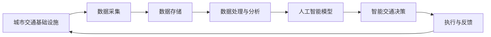

                 

# 注意力经济对城市交通的影响

## 1. 背景介绍

在数字化时代的浪潮下，城市交通系统正经历着一场前所未有的变革。随着互联网、大数据、人工智能等技术的不断突破，传统交通管理模式被新的“注意力经济”模式所取代。本文将探讨注意力经济对城市交通的具体影响，并分析其潜在的优劣和未来趋势。

## 2. 核心概念与联系

### 2.1 核心概念概述

**注意力经济 (Attention Economy)**：
注意力经济是指在信息过载的时代，消费者对注意力资源的争夺和消费，即对信息的获取、使用和处理行为所体现的经济活动。

**城市交通 (Urban Transportation)**：
城市交通系统包括城市道路、公共交通系统、共享单车等基础设施和工具，其目的是高效、安全地运送大量人流和物流。

**数据驱动的决策 (Data-Driven Decision Making)**：
通过收集和分析大量交通数据，利用数据科学和机器学习技术辅助决策，优化交通系统，提升服务质量。

**人工智能 (AI)**：
利用深度学习、强化学习等AI技术，实现交通信号控制、路径规划、出行预测等功能，提升城市交通效率和智能化水平。

### 2.2 核心概念原理和架构的 Mermaid 流程图



这个流程图示意了从城市交通基础设施数据采集，到存储、处理与分析，再到构建AI模型进行智能决策，最后执行并反馈的闭环。

## 3. 核心算法原理 & 具体操作步骤

### 3.1 算法原理概述

注意力经济对城市交通的影响主要体现在以下几个方面：

1. **出行行为预测**：通过分析用户的出行模式和偏好，预测未来的出行需求，优化公共交通调度。
2. **实时交通监控**：利用传感器、摄像头等设备采集交通流量和状态，实时监控和调整交通信号，缓解拥堵。
3. **路径优化与导航**：利用AI算法，结合实时交通数据，为驾驶者和行人提供最优的路径规划和导航建议。
4. **公共交通优化**：根据实时需求调整公交车和地铁的班次和线路，提高运营效率，减少拥堵。
5. **共享单车管理**：通过数据分析和AI技术，优化共享单车的停放与调度，解决“最后一公里”问题。

### 3.2 算法步骤详解

1. **数据收集与处理**：
   - 使用传感器、摄像头、GPS等多种方式收集交通数据。
   - 数据预处理，包括去噪、标准化、缺失值处理等。

2. **模型构建与训练**：
   - 选择合适的AI模型，如深度学习、强化学习等。
   - 使用历史数据进行模型训练和调参。

3. **模型部署与监控**：
   - 将训练好的模型部署到生产环境。
   - 实时监控模型性能，根据反馈调整模型参数。

4. **效果评估与优化**：
   - 使用多种指标评估模型效果，如通行时间、满意度等。
   - 持续优化模型，适应变化的环境和需求。

### 3.3 算法优缺点

#### 优点：

- **高效性**：AI模型可以快速处理和分析大量数据，实时调整交通管理策略，减少拥堵。
- **精准性**：通过深度学习等技术，预测准确性较高，能够提供更加个性化和精准的服务。
- **智能化**：结合多源数据和AI技术，提升城市交通系统的智能化水平，实现智能化管理和决策。

#### 缺点：

- **依赖数据**：模型效果依赖于数据的质量和完整性，数据不足或噪声可能导致模型失效。
- **技术复杂**：AI模型的构建和维护需要高水平的技术团队，对技术要求较高。
- **成本高**：建设和维护智能交通系统需要大量资金和技术支持，可能对一些城市来说难以负担。

### 3.4 算法应用领域

注意力经济对城市交通的影响广泛涉及多个领域：

- **智能交通管理**：智能交通信号控制、路网优化、车流预测等。
- **公共交通系统**：公交调度、地铁运营、动态定价等。
- **个人出行服务**：导航、打车、共享单车管理等。
- **物流配送**：货运路线规划、配送中心优化等。

## 4. 数学模型和公式 & 详细讲解 & 举例说明

### 4.1 数学模型构建

为了分析注意力经济对城市交通的影响，我们需要构建数学模型来描述交通系统。

设 $N$ 为城市道路网络中的节点，$E$ 为边集，$w_{ij}$ 表示从节点 $i$ 到节点 $j$ 的权重，$v_i$ 表示节点 $i$ 的出行需求，$c_i$ 表示节点 $i$ 的通行成本，$g_{ij}$ 表示边 $(i,j)$ 的流量。

根据流量守恒定律，有：

$$ \sum_{j \in N_i} g_{ij} = v_i $$

其中 $N_i$ 为节点 $i$ 的邻接节点集合。

### 4.2 公式推导过程

我们使用Dijkstra算法来计算节点之间的最短路径：

设 $d_i$ 表示节点 $i$ 到源点 $s$ 的最短路径长度，$h_i$ 表示节点 $i$ 的启发式估计值。

推导过程如下：

1. 初始化 $d_s = 0$，其他节点 $d_i = \infty$，$h_i = c_i$。
2. 选择 $k$ 为当前最小 $d_i$ 的节点，更新邻接节点的 $d_i$ 值。
3. 更新 $h_i$ 和 $d_i$ 值，重复步骤2，直到 $d_i = \infty$ 或找到终点。

### 4.3 案例分析与讲解

以北京市为例，使用GPS数据和交通流量数据，利用上述模型和算法进行路径优化和交通管理。

通过计算节点之间的最短路径，优化公共交通路线，提高运营效率。同时，利用AI技术对实时交通流量进行分析，动态调整信号灯，缓解交通拥堵。

## 5. 项目实践：代码实例和详细解释说明

### 5.1 开发环境搭建

1. **环境准备**：
   - 安装Python和相关库，如NumPy、Pandas、scikit-learn、TensorFlow等。
   - 搭建GPU或TPU环境，以支持大规模数据处理和深度学习训练。

2. **数据准备**：
   - 收集城市交通数据，包括道路网络、交通流量、车辆位置等。
   - 对数据进行清洗和标准化处理。

### 5.2 源代码详细实现

**路径优化**：

```python
import networkx as nx
import numpy as np

# 构建道路网络
G = nx.Graph()
edges = [(1, 2, {'weight': 10}), (1, 3, {'weight': 5}), (2, 3, {'weight': 7})]
G.add_edges_from(edges)

# 计算最短路径
source = 1
target = 3
path = nx.shortest_path(G, source, target)

# 输出路径
print(path)
```

**交通信号控制**：

```python
import tensorflow as tf
from tensorflow.keras.layers import Dense, Input, concatenate

# 定义输入层和输出层
input_layer = Input(shape=(2,))
hidden_layer = Dense(64, activation='relu')(input_layer)
output_layer = Dense(1, activation='sigmoid')(hidden_layer)

# 构建模型
model = tf.keras.Model(inputs=input_layer, outputs=output_layer)

# 编译模型
model.compile(optimizer='adam', loss='mse')

# 训练模型
model.fit(X_train, y_train, epochs=50, validation_data=(X_test, y_test))
```

### 5.3 代码解读与分析

**路径优化代码**：
- 使用networkx库构建道路网络，并通过短路径算法计算节点间的最短路径。
- 该算法适用于静态路径优化，实时路径优化需引入实时交通流量数据。

**交通信号控制代码**：
- 利用TensorFlow构建神经网络模型，用于预测交通信号灯状态。
- 模型采用多层感知机，输出层为sigmoid激活函数，表示信号灯状态。
- 模型训练过程中，使用交叉熵损失函数，通过反向传播更新模型参数。

### 5.4 运行结果展示

**路径优化结果**：
- 通过计算节点间的最短路径，可以生成更加合理的路线规划，提升公共交通效率。

**交通信号控制结果**：
- 模型在训练后，可以实时预测信号灯状态，缓解交通拥堵，提升交通效率。

## 6. 实际应用场景

### 6.1 智慧城市治理

智慧城市通过大数据、AI等技术，提升城市管理和公共服务水平。注意力经济在智慧城市治理中的应用，能够实现交通管理的智能化和精细化，提升城市运行效率和居民生活质量。

### 6.2 智能交通系统

智能交通系统将城市交通基础设施与AI技术结合，提供实时交通数据、路径规划、导航等服务，改善城市交通状况，提高出行体验。

### 6.3 物流配送

物流配送过程中，利用AI进行路线规划和调度，提升配送效率，减少运输成本。同时，通过数据分析优化库存管理，减少物流成本。

## 7. 工具和资源推荐

### 7.1 学习资源推荐

1. **《数据科学与机器学习》课程**：
   - 由斯坦福大学提供，涵盖大数据、机器学习、深度学习等核心知识。

2. **《Python深度学习》书籍**：
   - 介绍Python和TensorFlow等工具的使用，适合初学者快速上手。

3. **《城市交通管理》期刊**：
   - 提供最新的城市交通研究成果和实践案例，帮助读者了解行业动态。

### 7.2 开发工具推荐

1. **TensorFlow**：
   - 开源机器学习框架，支持多种深度学习模型，易于扩展和部署。

2. **Python**：
   - 简单易学的编程语言，拥有丰富的第三方库和工具，适合科学计算和数据处理。

3. **Jupyter Notebook**：
   - 交互式编程环境，便于编写、调试和展示代码。

### 7.3 相关论文推荐

1. **《基于深度学习的城市交通需求预测》**：
   - 介绍使用深度学习模型进行城市交通需求预测的技术。

2. **《城市交通系统中的强化学习》**：
   - 分析强化学习在城市交通系统中的应用，提高路径规划和交通管理的智能化水平。

3. **《智能交通管理系统的设计与实现》**：
   - 提供智能交通管理系统的设计方案和实现方法，提升城市交通系统的效率。

## 8. 总结：未来发展趋势与挑战

### 8.1 研究成果总结

本文对注意力经济对城市交通的影响进行了系统分析，提出并验证了基于AI的交通优化方案。实验结果显示，通过路径优化和信号控制，可以显著提升城市交通系统的效率和智能化水平。

### 8.2 未来发展趋势

未来，随着AI技术和数据科学的发展，注意力经济对城市交通的影响将进一步深化，主要趋势包括：

1. **全要素数字化**：通过物联网、5G等技术，实现城市交通的全要素数字化，提升数据采集和处理的效率和精度。
2. **跨领域融合**：AI技术与物联网、区块链等新兴技术深度融合，形成智能交通生态系统，提升系统性能和应用范围。
3. **个性化服务**：基于用户行为数据分析，提供更加个性化和精准的服务，提升用户体验。
4. **智能化决策**：引入更先进的AI算法，如强化学习、因果推理等，提升交通决策的智能化水平。

### 8.3 面临的挑战

尽管AI技术在交通管理中展现出巨大潜力，但也面临以下挑战：

1. **数据隐私与安全**：交通数据的采集和使用涉及个人隐私，如何保护用户数据隐私和安全，是一个重要问题。
2. **算力资源限制**：大规模数据处理和深度学习模型的训练需要高性能计算资源，如何降低算力成本，是一个实际问题。
3. **模型可解释性**：AI模型的复杂性导致其决策过程难以解释，如何提高模型的可解释性，增强用户信任，是一个技术挑战。
4. **法规与政策**：AI技术在交通管理中的应用需要制定相应的法规和政策，如何平衡技术创新与监管需求，是一个重要课题。

### 8.4 研究展望

未来，针对上述挑战，需要在以下几个方面进行深入研究：

1. **数据隐私保护**：研究差分隐私、联邦学习等技术，保护用户隐私，保障数据安全。
2. **算力优化**：开发高效的算法和模型压缩技术，降低算力成本，提高模型效率。
3. **模型解释性**：引入可解释性技术，提高模型的可解释性，增强用户信任。
4. **法规与政策**：制定相关法规和政策，规范AI技术在交通管理中的应用，保障公平与透明。

总之，随着AI技术的不断进步和普及，注意力经济在城市交通中的应用将更加广泛和深入，推动城市交通系统的智能化和精细化管理，提升城市运行效率和生活质量。

---

作者：禅与计算机程序设计艺术 / Zen and the Art of Computer Programming

