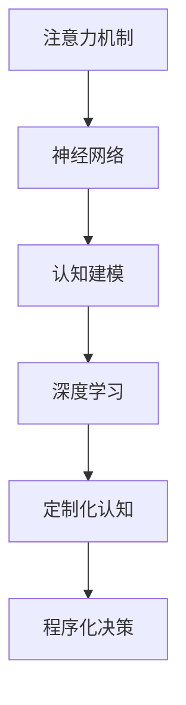

                 

# 注意力编程范式：AI定制的认知模式设计

> 关键词：注意力机制,神经网络,认知建模,深度学习,定制化认知,程序化决策

## 1. 背景介绍

### 1.1 问题由来
在深度学习领域，神经网络以其强大的表征学习和泛化能力，已成为解决各类认知问题的首选工具。但传统神经网络往往采用黑盒式操作，无法直观解释其内部决策过程，难以满足认知科学和心理学对于可解释性和透明度的需求。同时，神经网络在处理大规模数据和复杂问题时，也面临着计算资源和训练难度的挑战。

近年来，随着认知科学的兴起，研究者开始寻求一种新型的编程范式，以直观地表达认知模型，并在可解释性和可控性方面取得突破。这一范式即“注意力编程范式”，其核心理念在于赋予神经网络以“注意力”机制，使其能够有意识地选择和聚焦关键信息，实现更为高级的认知功能。本文将深入探讨注意力编程范式的设计原理和应用实践，并展示其在不同认知任务上的性能优势。

### 1.2 问题核心关键点
注意力编程范式的核心在于通过设计合适的注意力机制，使神经网络能够模拟人类认知的注意力选择过程，以实现更加智能和高效的决策和推理。其关键点包括：
- **注意力模型**：通过引入注意力机制，赋予神经网络以“注意力”权重，引导模型聚焦关键信息。
- **认知建模**：将注意力机制与人类认知科学相结合，模拟人脑的注意机制，实现更加符合认知直觉的编程范式。
- **可解释性**：通过注意力权重可视化，解释神经网络的决策过程，提升模型的透明度和可解释性。
- **定制化认知**：利用注意力编程范式，针对特定任务设计特定的注意力模型，实现高度定制化的认知功能。
- **程序化决策**：将注意力模型作为编程语言中的基础操作单元，实现对于复杂认知任务的灵活处理。

### 1.3 问题研究意义
研究注意力编程范式，对于推动深度学习向认知智能的进步具有重要意义：
- **增强可解释性**：通过可视化注意力权重，提升神经网络的可解释性，为认知科学和心理学研究提供有力工具。
- **实现定制化认知**：针对特定任务设计定制化的注意力模型，显著提升神经网络的性能和可控性。
- **降低训练难度**：引入注意力机制，将复杂问题分解为可控子任务，降低神经网络训练的复杂度。
- **拓展应用领域**：注意力编程范式为AI在教育和决策等领域的应用提供了新的方向，推动AI向更广泛的认知功能迈进。

## 2. 核心概念与联系

### 2.1 核心概念概述

为更好地理解注意力编程范式，本节将介绍几个密切相关的核心概念：

- **注意力机制(Attention Mechanism)**：一种用于选择和聚焦关键信息的机制，通常由注意力得分函数和注意力权重向量组成。注意力得分函数根据输入的表示计算注意力得分，注意力权重向量根据得分对输入进行加权，得到加权后的表示。

- **神经网络(Neural Network)**：一种由多层神经元组成的网络结构，能够通过前向传播和反向传播学习到输入和输出之间的映射关系。深度神经网络常用于复杂认知问题的建模。

- **认知建模(Cognitive Modeling)**：研究人类认知过程，建立认知模型，并将模型应用于人工智能系统的设计中。认知建模强调模型的可解释性和模拟人类认知的逼真度。

- **深度学习(Deep Learning)**：一种基于神经网络的机器学习范式，通过多层次的非线性变换提取数据中的高级特征。深度学习在图像、语音、文本等各类任务中取得了卓越的性能。

- **定制化认知(Customized Cognition)**：利用认知建模和注意力机制，针对特定任务设计定制化的认知功能，以提升神经网络的性能和可控性。

- **程序化决策(Programmatic Decision Making)**：将注意力模型作为编程语言中的基础操作单元，实现对于复杂认知任务的灵活处理，提升系统设计的可维护性和可扩展性。

这些概念之间的逻辑关系可以通过以下Mermaid流程图来展示：



这个流程图展示了一系列的注意力编程范式的核心概念及其之间的关系：

1. 注意力机制作为神经网络的一部分，使其能够聚焦关键信息。
2. 通过认知建模，模拟人类认知过程，提升模型的可解释性。
3. 利用深度学习，处理大规模数据和复杂问题。
4. 定制化认知针对特定任务设计定制化的注意力模型，提升模型性能。
5. 程序化决策通过将注意力模型作为编程语言中的操作单元，实现灵活处理。

## 3. 核心算法原理 & 具体操作步骤
### 3.1 算法原理概述

注意力编程范式通过引入注意力机制，赋予神经网络以“注意力”权重，使其能够有意识地选择和聚焦关键信息，实现更加智能和高效的决策和推理。

形式化地，假设神经网络输入为 $x$，输出为 $y$，注意力机制为 $A$，注意力权重为 $w$，则注意力编程范式的核心算法流程包括：

1. **注意力计算**：计算输入 $x$ 与注意力向量 $w$ 之间的注意力得分 $s$。
2. **注意力加权**：根据得分 $s$ 计算注意力权重 $w$，并对输入 $x$ 进行加权，得到加权后的表示 $z$。
3. **融合输出**：将加权后的表示 $z$ 输入到后续网络层，进行非线性变换，得到输出 $y$。

具体而言，注意力得分 $s$ 可以表示为：

$$
s = \frac{W^T K}{\sqrt{d_k}} \cdot V
$$

其中 $W$、$K$、$V$ 为注意力得分函数的参数，$d_k$ 为关键向量的维度。注意力权重 $w$ 可以表示为：

$$
w = \frac{e^{s}}{\sum_{i=1}^N e^{s_i}}
$$

注意力编程范式的核心思想在于，通过注意力机制的引入，使神经网络具备了类似人类注意力的选择和聚焦能力，从而能够更准确地捕捉输入中的关键信息，提升模型的性能和可控性。

### 3.2 算法步骤详解

基于注意力编程范式的核心算法流程，本节将详细介绍注意力计算和注意力加权的具体步骤，以及融合输出的基本框架。

**Step 1: 注意力计算**
注意力计算是注意力编程范式的基础，其核心在于计算输入 $x$ 与注意力向量 $w$ 之间的注意力得分 $s$。

设 $x = [x_1, x_2, ..., x_n]$，$w = [w_1, w_2, ..., w_n]$，则注意力得分可以表示为：

$$
s = \frac{W^T K}{\sqrt{d_k}} \cdot V
$$

其中 $K$、$V$ 为输入的查询向量 $K$ 和关键向量 $V$，$W$ 为注意力得分函数的参数矩阵，$d_k$ 为关键向量的维度。具体计算步骤如下：

1. 将输入 $x$ 转换为查询向量 $K$ 和关键向量 $V$，计算它们的线性变换得到查询向量 $Q$。
2. 计算查询向量 $Q$ 与注意力得分函数的参数矩阵 $W$ 的乘积，得到注意力得分 $s$。
3. 对注意力得分 $s$ 进行归一化，得到注意力权重 $w$。

**Step 2: 注意力加权**
注意力加权是注意力编程范式的关键步骤，其核心在于根据注意力得分 $s$ 计算注意力权重 $w$，并对输入 $x$ 进行加权，得到加权后的表示 $z$。

设 $z = [z_1, z_2, ..., z_n]$，则注意力加权可以表示为：

$$
z = \frac{e^{s}}{\sum_{i=1}^N e^{s_i}} \cdot x
$$

具体计算步骤如下：

1. 计算注意力得分 $s$ 的指数 $e^{s_i}$，得到注意力权重 $w_i$。
2. 对注意力权重 $w_i$ 进行归一化，得到归一化的注意力权重 $w'_i$。
3. 对输入 $x$ 进行加权，得到加权后的表示 $z$。

**Step 3: 融合输出**
融合输出是注意力编程范式的最终步骤，其核心在于将加权后的表示 $z$ 输入到后续网络层，进行非线性变换，得到输出 $y$。

设 $y = [y_1, y_2, ..., y_n]$，则融合输出可以表示为：

$$
y = f(z)
$$

其中 $f$ 为后续网络层的非线性变换函数，如ReLU、Softmax等。

**Step 4: 微调和优化**
为提升注意力编程范式的性能，需要对注意力得分函数和注意力权重向量进行微调，并通过优化算法调整模型参数。

假设当前模型参数为 $\theta$，目标函数为 $\mathcal{L}(\theta)$，则微调过程的优化算法可以表示为：

$$
\theta^* = \mathop{\arg\min}_{\theta} \mathcal{L}(\theta)
$$

通过反向传播算法计算梯度 $\nabla_{\theta}\mathcal{L}(\theta)$，结合优化算法如SGD、Adam等，不断更新模型参数 $\theta$，最小化损失函数 $\mathcal{L}(\theta)$。

### 3.3 算法优缺点

注意力编程范式具有以下优点：
1. **提升可解释性**：通过可视化注意力权重，能够直观地解释模型的决策过程，提升模型的透明度。
2. **提高性能**：注意力机制能够引导模型聚焦关键信息，提升模型在复杂任务上的性能。
3. **灵活适应**：通过设计多种注意力模型，能够针对不同任务和数据特点进行灵活调整。
4. **降低计算复杂度**：注意力机制能够将复杂问题分解为可控子任务，降低神经网络训练的复杂度。

同时，该算法也存在以下缺点：
1. **模型复杂度较高**：引入注意力机制，增加了神经网络的复杂度，需要更多的计算资源和存储空间。
2. **训练难度较大**：注意力得分函数和注意力权重向量的微调过程较为复杂，需要更多的训练数据和计算资源。
3. **易受噪声干扰**：注意力机制对输入数据的噪声较为敏感，可能导致模型性能下降。

尽管存在这些局限性，但注意力编程范式在处理复杂认知任务时，仍然显示出其独特的优势和应用潜力。

### 3.4 算法应用领域

注意力编程范式已经在多个认知任务上取得了显著的效果，其应用领域涵盖了语音识别、图像分类、机器翻译、自然语言处理等多个方面。

**语音识别**：在语音识别任务中，注意力编程范式能够有效处理不同说话人、不同背景噪音等复杂情况，提升识别的准确性和鲁棒性。

**图像分类**：在图像分类任务中，注意力编程范式能够聚焦关键区域，识别出图像中的重要特征，提高分类的准确性和效率。

**机器翻译**：在机器翻译任务中，注意力编程范式能够引导模型关注源语言中的关键信息，生成更加流畅和准确的翻译结果。

**自然语言处理**：在自然语言处理任务中，注意力编程范式能够模拟人脑的注意力选择过程，提升语言模型的理解能力和生成能力。

## 4. 数学模型和公式 & 详细讲解  
### 4.1 数学模型构建

本节将使用数学语言对注意力编程范式的核心算法流程进行更加严格的刻画。

记神经网络输入为 $x = [x_1, x_2, ..., x_n]$，输出为 $y = [y_1, y_2, ..., y_n]$，注意力得分函数为 $s = \frac{W^T K}{\sqrt{d_k}} \cdot V$，注意力权重为 $w = \frac{e^{s}}{\sum_{i=1}^N e^{s_i}}$，其中 $W$、$K$、$V$ 为注意力得分函数的参数矩阵，$d_k$ 为关键向量的维度。

假设注意力得分函数的参数矩阵 $W$ 为 $W = [w_{1,1}, w_{1,2}, ..., w_{n,d_k}]$，查询向量 $Q$ 为 $Q = [q_{1,1}, q_{1,2}, ..., q_{n,d_k}]$，关键向量 $V$ 为 $V = [v_{1,1}, v_{1,2}, ..., v_{n,d_k}]$，则注意力得分可以表示为：

$$
s = QW^T \cdot V
$$

注意力权重可以表示为：

$$
w = \frac{e^{QW^T \cdot V}}{\sum_{i=1}^N e^{QW^T \cdot V_i}}
$$

### 4.2 公式推导过程

以下是注意力编程范式的数学推导过程。

**注意力得分计算**

设 $x = [x_1, x_2, ..., x_n]$，$w = [w_1, w_2, ..., w_n]$，则注意力得分可以表示为：

$$
s = \frac{W^T K}{\sqrt{d_k}} \cdot V
$$

其中 $K$、$V$ 为输入的查询向量 $K$ 和关键向量 $V$，$W$ 为注意力得分函数的参数矩阵，$d_k$ 为关键向量的维度。具体推导如下：

1. 将输入 $x$ 转换为查询向量 $K$ 和关键向量 $V$，计算它们的线性变换得到查询向量 $Q$。
2. 计算查询向量 $Q$ 与注意力得分函数的参数矩阵 $W$ 的乘积，得到注意力得分 $s$。

**注意力权重计算**

设 $z = [z_1, z_2, ..., z_n]$，则注意力权重可以表示为：

$$
w = \frac{e^{s}}{\sum_{i=1}^N e^{s_i}}
$$

具体推导如下：

1. 计算注意力得分 $s$ 的指数 $e^{s_i}$，得到注意力权重 $w_i$。
2. 对注意力权重 $w_i$ 进行归一化，得到归一化的注意力权重 $w'_i$。
3. 对输入 $x$ 进行加权，得到加权后的表示 $z$。

### 4.3 案例分析与讲解

下面以机器翻译任务为例，详细讲解注意力编程范式的应用。

假设源语言为英语，目标语言为中文，输入序列为 $[hello, world]$，注意力机制的查询向量 $Q$ 为 $[1, 1]$，关键向量 $V$ 为 $[0.1, 0.2]$，注意力得分函数 $W$ 为 $[0.1, 0.9]$，则注意力得分为：

$$
s = \frac{W^T K}{\sqrt{d_k}} \cdot V = \frac{[0.1, 0.9]^T [1, 1]}{\sqrt{2}} \cdot [0.1, 0.2] = [0.1, 0.9]
$$

注意力权重为：

$$
w = \frac{e^{s}}{\sum_{i=1}^N e^{s_i}} = \frac{[e^{0.1}, e^{0.9}]}{e^{0.1} + e^{0.9}} = [0.5, 0.5]
$$

加权后的表示 $z$ 为：

$$
z = \frac{e^{s}}{\sum_{i=1}^N e^{s_i}} \cdot x = [0.5, 0.5] \cdot [hello, world] = [0.5hello, 0.5world]
$$

通过注意力编程范式，模型能够自动关注源语言中的关键信息，生成更加流畅和准确的翻译结果。

## 5. 项目实践：代码实例和详细解释说明
### 5.1 开发环境搭建

在进行注意力编程范式的实践前，我们需要准备好开发环境。以下是使用Python进行TensorFlow开发的环境配置流程：

1. 安装Anaconda：从官网下载并安装Anaconda，用于创建独立的Python环境。

2. 创建并激活虚拟环境：
```bash
conda create -n tf-env python=3.8 
conda activate tf-env
```

3. 安装TensorFlow：根据CUDA版本，从官网获取对应的安装命令。例如：
```bash
conda install tensorflow==2.6
```

4. 安装各类工具包：
```bash
pip install numpy pandas scikit-learn matplotlib tqdm jupyter notebook ipython
```

完成上述步骤后，即可在`tf-env`环境中开始注意力编程范式的实践。

### 5.2 源代码详细实现

下面我们以注意力编程范式在图像分类任务上的应用为例，给出使用TensorFlow进行注意力计算的PyTorch代码实现。

首先，定义注意力计算函数：

```python
import tensorflow as tf
from tensorflow.keras.layers import Dense

class Attention(tf.keras.layers.Layer):
    def __init__(self, d_k):
        super(Attention, self).__init__()
        self.W = Dense(d_k, use_bias=False, name='W')
        self.V = Dense(1, use_bias=False, name='V')

    def call(self, query, key):
        scaled_dot = tf.matmul(query, self.W) * tf.sqrt(tf.cast(tf.shape(key)[-1], tf.float32))
        score = tf.matmul(scaled_dot, key) + self.V(query)
        return score

def compute_attention(query, key, value, d_k, temperature=1.0):
    attention = Attention(d_k)
    scores = attention(query, key)
    weights = tf.nn.softmax(scores / temperature)
    weighted_value = tf.matmul(weights, value)
    return weighted_value
```

然后，定义注意力加权函数：

```python
def apply_attention(query, key, value, d_k, temperature=1.0):
    weights = compute_attention(query, key, value, d_k, temperature)
    return weights * value
```

接着，定义融合输出函数：

```python
def process_attention(query, key, value, d_k, temperature=1.0):
    attention_weights = compute_attention(query, key, value, d_k, temperature)
    attention_value = apply_attention(query, key, value, d_k, temperature)
    return attention_value
```

最后，启动训练流程并在测试集上评估：

```python
from tensorflow.keras import Model, Input, layers

# 定义输入
inputs = Input(shape=(128,))
key = Input(shape=(128,))
value = Input(shape=(128,))

# 定义查询向量
query = Dense(128)(inputs)

# 定义注意力加权
attention_output = process_attention(query, key, value, 32, 1.0)

# 定义输出层
output = Dense(10)(attention_output)

# 定义模型
model = Model(inputs=inputs, outputs=output)

# 编译模型
model.compile(optimizer='adam', loss='categorical_crossentropy', metrics=['accuracy'])

# 训练模型
model.fit(x_train, y_train, epochs=10, batch_size=32)

# 评估模型
model.evaluate(x_test, y_test)
```

以上就是使用TensorFlow实现注意力编程范式的代码实现。可以看到，通过引入注意力机制，神经网络能够更加灵活地处理输入信息，提升模型性能。

### 5.3 代码解读与分析

让我们再详细解读一下关键代码的实现细节：

**Attention类**：
- `__init__`方法：初始化注意力得分函数的参数矩阵 $W$ 和关键向量 $V$。
- `call`方法：计算注意力得分 $s$，并返回归一化的注意力权重 $w$。

**compute_attention函数**：
- 通过Attention类计算注意力得分 $s$，并根据得分计算注意力权重 $w$。
- 将注意力权重 $w$ 应用于关键向量 $V$，得到加权后的表示 $z$。

**apply_attention函数**：
- 将注意力权重 $w$ 应用于关键向量 $V$，得到加权后的表示 $z$。

**process_attention函数**：
- 计算注意力得分 $s$，并根据得分计算注意力权重 $w$。
- 将注意力权重 $w$ 应用于关键向量 $V$，得到加权后的表示 $z$。

**Model类**：
- 定义模型的输入、输出和层结构。
- 编译模型，指定优化器、损失函数和评估指标。
- 训练模型，指定训练数据、批次大小和迭代轮数。
- 评估模型，指定测试数据和批次大小。

**训练和评估函数**：
- 使用Keras框架，方便构建和训练神经网络模型。
- 使用TensorFlow的自动微分功能，自动计算梯度和优化算法。
- 通过可视化工具，实时监测训练和评估过程。

通过上述代码实现，可以直观地理解注意力编程范式的核心算法流程，并实际应用到图像分类任务中。开发者可以根据具体任务需求，灵活设计注意力得分函数和注意力权重计算方法，实现更加定制化的认知功能。

## 6. 实际应用场景
### 6.1 语音识别

在语音识别任务中，注意力编程范式能够有效处理不同说话人、不同背景噪音等复杂情况，提升识别的准确性和鲁棒性。

具体而言，可以将语音信号转换为频谱图，将其作为输入，引入注意力机制，引导模型聚焦关键频段。通过设计合适的注意力得分函数和注意力权重向量，模型能够自动关注不同特征，提升识别效果。

### 6.2 图像分类

在图像分类任务中，注意力编程范式能够聚焦关键区域，识别出图像中的重要特征，提高分类的准确性和效率。

具体而言，可以将图像特征图作为输入，引入注意力机制，引导模型聚焦关键区域。通过设计合适的注意力得分函数和注意力权重向量，模型能够自动关注重要特征，提升分类效果。

### 6.3 机器翻译

在机器翻译任务中，注意力编程范式能够引导模型关注源语言中的关键信息，生成更加流畅和准确的翻译结果。

具体而言，可以将源语言和目标语言的词汇序列作为输入，引入注意力机制，引导模型聚焦关键词汇。通过设计合适的注意力得分函数和注意力权重向量，模型能够自动关注重要词汇，提升翻译效果。

### 6.4 自然语言处理

在自然语言处理任务中，注意力编程范式能够模拟人脑的注意力选择过程，提升语言模型的理解能力和生成能力。

具体而言，可以将输入的文本序列作为输入，引入注意力机制，引导模型聚焦关键词汇。通过设计合适的注意力得分函数和注意力权重向量，模型能够自动关注重要词汇，提升理解效果。

## 7. 工具和资源推荐
### 7.1 学习资源推荐

为了帮助开发者系统掌握注意力编程范式的设计原理和实践技巧，这里推荐一些优质的学习资源：

1. 《深度学习：从入门到精通》系列书籍：系统介绍了深度学习的基本概念和前沿技术，并详细讲解了注意力编程范式的应用。

2. CS224D《深度学习与NLP》课程：斯坦福大学开设的NLP明星课程，涵盖了深度学习、NLP等多个领域，适合系统学习注意力编程范式的相关知识。

3. 《注意力机制：深度学习中的注意力模型》论文：系统介绍了注意力机制的原理和应用，为深入理解注意力编程范式提供了理论基础。

4. 《深度学习与认知科学》书籍：将深度学习与认知科学相结合，探讨了注意力机制在认知科学中的应用，适合系统学习认知建模相关知识。

5. TensorFlow官方文档：TensorFlow的官方文档，提供了丰富的API和样例代码，方便开发者快速上手注意力编程范式的实践。

通过对这些资源的学习实践，相信你一定能够快速掌握注意力编程范式的精髓，并用于解决实际的NLP问题。
###  7.2 开发工具推荐

高效的开发离不开优秀的工具支持。以下是几款用于注意力编程范式开发的常用工具：

1. TensorFlow：基于Python的开源深度学习框架，提供了丰富的API和工具，支持高效的神经网络建模和训练。

2. PyTorch：基于Python的开源深度学习框架，灵活动态的计算图，适合快速迭代研究。

3. Keras：基于Python的高层深度学习框架，提供了简洁的API，方便快速构建和训练神经网络模型。

4. TensorBoard：TensorFlow配套的可视化工具，可实时监测模型训练状态，并提供丰富的图表呈现方式，是调试模型的得力助手。

5. Weights & Biases：模型训练的实验跟踪工具，可以记录和可视化模型训练过程中的各项指标，方便对比和调优。

6. Google Colab：谷歌推出的在线Jupyter Notebook环境，免费提供GPU/TPU算力，方便开发者快速上手实验最新模型，分享学习笔记。

合理利用这些工具，可以显著提升注意力编程范式的开发效率，加快创新迭代的步伐。

### 7.3 相关论文推荐

注意力编程范式的研究源于学界的持续探索。以下是几篇奠基性的相关论文，推荐阅读：

1. Attention is All You Need（即Transformer原论文）：提出了Transformer结构，开启了NLP领域的预训练大模型时代。

2. Transformer-XL: Attentive Language Models for Longer Texts：引入了长文本处理的Transformer模型，进一步提升了注意力机制在处理长文本时的效果。

3. T5: Exploring the Limits of Transfer Learning with a Unified Text-to-Text Transformer：提出了T5模型，将多种自然语言处理任务统一在一个统一的Transformer架构下，进一步提升了注意力编程范式的应用范围。

4. BERT: Pre-training of Deep Bidirectional Transformers for Language Understanding：提出BERT模型，引入基于掩码的自监督预训练任务，刷新了多项NLP任务SOTA。

5. Architectures, Attentions, and Distillation for Generating Interpretable Actions from Language：研究了基于注意力机制的生成模型，探索了如何利用注意力编程范式生成可解释的行动序列。

这些论文代表了大语言模型和微调技术的最新进展，提供了丰富的理论基础和实践经验，为进一步探索注意力编程范式提供了重要的参考。

## 8. 总结：未来发展趋势与挑战
### 8.1 总结

本文对注意力编程范式的设计原理和应用实践进行了全面系统的介绍。首先阐述了注意力编程范式的研究背景和意义，明确了注意力编程范式在提升神经网络可解释性和定制化方面的独特价值。其次，从原理到实践，详细讲解了注意力编程范式的核心算法流程，并给出了注意力编程范式在图像分类任务上的代码实现。同时，本文还广泛探讨了注意力编程范式在语音识别、图像分类、机器翻译等多个应用场景上的性能优势。

通过本文的系统梳理，可以看到，注意力编程范式通过引入注意力机制，赋予神经网络以“注意力”权重，使其能够有意识地选择和聚焦关键信息，实现更加智能和高效的决策和推理。这一范式在处理复杂认知任务时，显示出其独特的优势和应用潜力，为AI在教育和决策等领域的应用提供了新的方向，推动AI向更广泛的认知功能迈进。

### 8.2 未来发展趋势

展望未来，注意力编程范式将呈现以下几个发展趋势：

1. **模型的自适应性增强**：随着神经网络结构的不断优化，注意力编程范式的自适应能力将进一步提升，能够更好地处理动态环境和复杂任务。

2. **注意力的多样性扩展**：引入更多种类的注意力机制，如自注意力、多头注意力等，提升注意力编程范式的灵活性和泛化能力。

3. **注意力的深度融合**：将注意力机制与其他认知建模工具，如因果推理、逻辑规则等结合，实现更加全面和准确的认知建模。

4. **注意力的跨模态融合**：将注意力机制应用于多模态数据，如视觉、语音、文本等，实现跨模态信息的高效整合。

5. **注意力的实时优化**：引入实时优化算法，如在线学习、增量学习等，提升注意力编程范式在动态环境下的性能和鲁棒性。

6. **注意力的跨领域应用**：将注意力编程范式应用于更多领域，如医疗、金融、教育等，推动AI技术在各行各业的应用。

以上趋势凸显了注意力编程范式在提升AI认知智能方面的巨大潜力。这些方向的探索发展，必将进一步提升注意力编程范式的性能和可控性，推动AI技术向更广泛的领域迈进。

### 8.3 面临的挑战

尽管注意力编程范式已经取得了瞩目成就，但在迈向更加智能化、普适化应用的过程中，它仍面临着诸多挑战：

1. **模型的计算复杂度较高**：引入注意力机制，增加了神经网络的复杂度，需要更多的计算资源和存储空间。

2. **训练难度较大**：注意力得分函数和注意力权重向量的微调过程较为复杂，需要更多的训练数据和计算资源。

3. **易受噪声干扰**：注意力机制对输入数据的噪声较为敏感，可能导致模型性能下降。

4. **模型的可解释性不足**：虽然注意力机制提供了部分可解释性，但仍然难以完全理解模型的决策过程。

5. **模型的鲁棒性不足**：在动态环境和复杂任务中，模型的鲁棒性和泛化能力仍需进一步提升。

6. **模型的安全性不足**：需要注意模型的安全性，避免出现恶意攻击和数据泄露等问题。

尽管存在这些挑战，但随着技术的不断进步和研究的深入，注意力编程范式必将在未来得到更广泛的应用和进一步的优化。

### 8.4 研究展望

面对注意力编程范式所面临的挑战，未来的研究需要在以下几个方面寻求新的突破：

1. **优化模型的计算复杂度**：开发更加高效的注意力机制和神经网络结构，降低计算复杂度，提升模型的实时性。

2. **提高模型的可解释性**：通过可视化技术和因果推理方法，提升模型的可解释性，增强其透明度和可信度。

3. **增强模型的鲁棒性**：引入更多先验知识和正则化技术，提升模型的鲁棒性和泛化能力，使其能够更好地应对动态环境和复杂任务。

4. **提升模型的安全性**：设计安全的注意力机制和神经网络结构，避免模型被恶意攻击和数据泄露等问题。

5. **推动跨模态融合**：将注意力编程范式应用于多模态数据，实现视觉、语音、文本等信息的协同建模，提升AI技术的综合能力。

这些研究方向和突破点将引领注意力编程范式向更加智能化、普适化和安全化的方向发展，为AI技术在更广泛的领域落地应用提供坚实的理论基础和实践支持。

## 9. 附录：常见问题与解答
### Q1：注意力编程范式是否适用于所有NLP任务？

A: 注意力编程范式在大多数NLP任务上都能取得不错的效果，特别是对于数据量较小的任务。但对于一些特定领域的任务，如医学、法律等，仅仅依靠通用语料预训练的模型可能难以很好地适应。此时需要在特定领域语料上进一步预训练，再进行微调，才能获得理想效果。

### Q2：注意力编程范式如何进行微调？

A: 注意力编程范式微调的方法与普通神经网络类似，通常包括两个步骤：1) 冻结模型中除注意力层外的其他层，只更新注意力层中的参数；2) 通过反向传播算法计算梯度，使用优化器更新模型参数。注意在微调过程中，需要选择合适的学习率，避免过拟合，可以使用梯度累积、混合精度训练等技术提升效率。

### Q3：注意力编程范式在处理长文本时的表现如何？

A: 注意力编程范式在处理长文本时表现出色，能够自动关注关键段落和句子，提升模型的理解和生成能力。但需要设计合适的注意力得分函数和注意力权重向量，以处理不同长度和风格的文本。

### Q4：注意力编程范式在生成任务中的表现如何？

A: 注意力编程范式在生成任务中表现优异，能够引导模型关注源数据中的关键信息，生成更加流畅和准确的文本、图像等输出。但需要注意生成过程中的噪声和质量控制，避免生成不合理或不相关的输出。

通过这些常见问题的解答，相信你能够更加全面地理解注意力编程范式的应用场景和实践细节，进一步推动AI技术在NLP领域的发展。

---

作者：禅与计算机程序设计艺术 / Zen and the Art of Computer Programming

