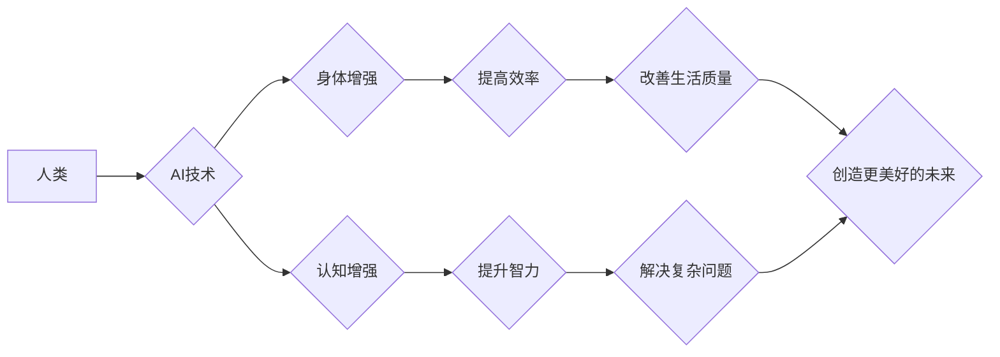

> 人类增强、AI、道德、身体增强、未来趋势、机遇、挑战

## 1. 背景介绍

人类文明自诞生以来，就一直在探索如何超越自身的局限性。从使用工具到发明火，从农业文明到工业革命，每一次进步都代表着人类对自身能力的提升。如今，人工智能（AI）的快速发展，为人类增强带来了前所未有的机遇。

AI技术能够分析海量数据，识别模式，并做出决策，这赋予了它强大的能力，可以帮助我们解决复杂问题，提高效率，甚至改变我们的身体和认知能力。例如，AI驱动的医疗诊断系统可以帮助医生更准确地识别疾病，AI辅助手术机器人可以提高手术的精准度和安全性，AI植入脑机接口可以帮助残疾人恢复肢体功能。

然而，AI技术带来的进步也引发了广泛的伦理和社会问题。如何确保AI技术安全可靠？如何避免AI技术被滥用？如何分配AI技术带来的利益？这些问题都需要我们认真思考和探讨。

## 2. 核心概念与联系

**2.1 人类增强**

人类增强是指利用科技手段提升人类的生理、认知和社会能力，使其超越自然界限制，达到更高水平的性能和功能。

**2.2 AI技术**

人工智能技术是指模拟人类智能行为的计算机科学领域。它涵盖了机器学习、深度学习、自然语言处理、计算机视觉等多个分支。

**2.3 身体增强**

身体增强是指通过科技手段提升人类的身体能力，例如增强力量、速度、耐力、感知能力等。

**2.4 认知增强**

认知增强是指通过科技手段提升人类的认知能力，例如增强记忆力、注意力、学习能力、创造力等。

**2.5 伦理与社会影响**

AI技术带来的人类增强，会对人类的伦理、社会结构、价值观等方面产生深远的影响。

**2.6 未来发展机遇与挑战**

AI技术的发展为人类增强带来了前所未有的机遇，但也面临着诸多挑战。

**Mermaid 流程图**



## 3. 核心算法原理 & 具体操作步骤

### 3.1  算法原理概述

人类增强算法通常基于机器学习和深度学习技术，通过训练模型识别和理解人类行为模式，并根据这些模式提供个性化的增强方案。

例如，用于身体增强的算法可以分析用户的运动轨迹和生理数据，识别肌肉力量和运动效率的不足，并提供针对性的训练计划和反馈。

用于认知增强的算法可以分析用户的学习习惯和认知能力，识别学习效率和记忆力的瓶颈，并提供个性化的学习策略和辅助工具。

### 3.2  算法步骤详解

1. **数据收集:** 收集用户的生理数据、行为数据、学习数据等相关信息。
2. **数据预处理:** 对收集到的数据进行清洗、转换、归一化等处理，使其适合模型训练。
3. **模型选择:** 选择合适的机器学习或深度学习模型，例如卷积神经网络、循环神经网络等。
4. **模型训练:** 使用预处理后的数据训练模型，使其能够识别和理解人类行为模式。
5. **模型评估:** 使用测试数据评估模型的性能，并根据评估结果进行模型调优。
6. **个性化方案生成:** 根据训练好的模型，为用户生成个性化的增强方案，例如训练计划、学习策略、辅助工具等。
7. **方案反馈与迭代:** 收集用户使用方案的反馈，并根据反馈进行方案迭代优化。

### 3.3  算法优缺点

**优点:**

* **个性化:** 能够根据用户的具体情况提供个性化的增强方案。
* **效率:** 可以帮助用户更快地达到目标，提高效率。
* **可扩展性:** 可以应用于多种场景，例如身体增强、认知增强、社交增强等。

**缺点:**

* **数据依赖:** 需要大量的数据进行训练，数据质量直接影响模型性能。
* **算法复杂性:** 训练复杂的深度学习模型需要强大的计算能力和专业知识。
* **伦理风险:** 需要谨慎考虑算法的潜在风险，避免被滥用。

### 3.4  算法应用领域

* **医疗保健:** 辅助诊断、个性化治疗、康复训练
* **教育:** 个性化学习、提高学习效率、辅助教学
* **体育训练:** 提升运动能力、预防运动损伤、优化训练计划
* **娱乐:** 增强游戏体验、创造沉浸式互动体验
* **军事:** 增强士兵的作战能力、提高战场感知能力

## 4. 数学模型和公式 & 详细讲解 & 举例说明

### 4.1  数学模型构建

人类增强算法通常基于统计学习理论，利用数学模型来描述人类行为模式和增强效果。

例如，用于身体增强的算法可以构建一个回归模型，预测用户的运动能力根据训练计划的变化。

用于认知增强的算法可以构建一个分类模型，预测用户的学习效率根据学习策略的变化。

### 4.2  公式推导过程

假设我们构建一个用于预测用户运动能力的回归模型，输入变量为训练计划，输出变量为运动能力。

模型可以采用线性回归模型，其公式如下：

$$
y = \beta_0 + \beta_1 x_1 + \beta_2 x_2 + ... + \beta_n x_n + \epsilon
$$

其中：

* $y$ 为运动能力
* $x_1, x_2, ..., x_n$ 为训练计划的各个特征
* $\beta_0, \beta_1, \beta_2, ..., \beta_n$ 为模型参数
* $\epsilon$ 为误差项

模型参数可以通过最小二乘法进行估计，目标是找到使模型预测值与实际值误差最小的参数值。

### 4.3  案例分析与讲解

假设我们收集了100名用户的运动能力和训练计划数据，并使用线性回归模型进行训练。

训练结果显示，模型参数为：

* $\beta_0 = 50$
* $\beta_1 = 2$
* $\beta_2 = 1$

这意味着，对于每个增加1个训练计划特征值，用户的运动能力将增加2或1分。

我们可以使用这个模型来预测新用户的运动能力，只要输入他们的训练计划特征值即可。

## 5. 项目实践：代码实例和详细解释说明

### 5.1  开发环境搭建

* 操作系统: Ubuntu 20.04
* Python 版本: 3.8
* 必要的库: TensorFlow, NumPy, Pandas

### 5.2  源代码详细实现

```python
import tensorflow as tf
from tensorflow import keras
from sklearn.model_selection import train_test_split
from sklearn.preprocessing import StandardScaler

# 加载数据
data = pd.read_csv('training_data.csv')

# 分割数据
X = data.drop('motion_ability', axis=1)
y = data['motion_ability']
X_train, X_test, y_train, y_test = train_test_split(X, y, test_size=0.2, random_state=42)

# 数据标准化
scaler = StandardScaler()
X_train = scaler.fit_transform(X_train)
X_test = scaler.transform(X_test)

# 建立模型
model = keras.Sequential([
    keras.layers.Dense(64, activation='relu', input_shape=(X_train.shape[1],)),
    keras.layers.Dense(32, activation='relu'),
    keras.layers.Dense(1)
])

# 编译模型
model.compile(optimizer='adam', loss='mean_squared_error')

# 训练模型
model.fit(X_train, y_train, epochs=100, batch_size=32)

# 评估模型
loss = model.evaluate(X_test, y_test)
print('Loss:', loss)

# 预测
new_data = [[1, 2, 3]]  # 新用户的训练计划特征值
prediction = model.predict(scaler.transform(new_data))
print('Prediction:', prediction)
```

### 5.3  代码解读与分析

* 代码首先加载训练数据，并将其分割为训练集和测试集。
* 然后，使用标准化方法对数据进行预处理，使其符合模型训练的要求。
* 接着，建立一个深度学习模型，包含多个隐藏层和输出层。
* 模型使用Adam优化器和均方误差损失函数进行训练。
* 训练完成后，使用测试集评估模型的性能，并预测新用户的运动能力。

### 5.4  运行结果展示

运行代码后，会输出模型的训练损失和预测结果。

## 6. 实际应用场景

### 6.1  医疗保健

AI驱动的医疗诊断系统可以帮助医生更准确地识别疾病，例如癌症、心血管疾病等。

AI辅助手术机器人可以提高手术的精准度和安全性，减少手术时间和并发症。

AI植入脑机接口可以帮助残疾人恢复肢体功能，例如瘫痪患者可以通过意念控制机械臂。

### 6.2  教育

AI个性化学习平台可以根据学生的学习习惯和能力，提供个性化的学习内容和学习策略。

AI辅助教学工具可以帮助老师更有效地进行教学，例如自动批改作业、提供个性化反馈等。

### 6.3  体育训练

AI分析运动员的运动数据，识别运动技巧的不足，并提供针对性的训练计划和反馈。

AI辅助训练设备可以帮助运动员提高训练效率和效果，例如智能跑步机、智能哑铃等。

### 6.4  未来应用展望

随着AI技术的不断发展，人类增强将在更多领域得到应用，例如：

* **增强现实 (AR) 和虚拟现实 (VR):** AI可以增强AR和VR体验，创造更逼真的虚拟世界。
* **个性化娱乐:** AI可以根据用户的喜好，提供个性化的娱乐内容和体验。
* **远程协作:** AI可以帮助人们更有效地进行远程协作，例如远程手术、远程教育等。

## 7. 工具和资源推荐

### 7.1  学习资源推荐

* **在线课程:** Coursera, edX, Udacity
* **书籍:** 深度学习，机器学习，人工智能导论
* **博客:** OpenAI Blog, Google AI Blog, DeepMind Blog

### 7.2  开发工具推荐

* **Python:** TensorFlow, PyTorch, Keras
* **云平台:** Google Cloud Platform, Amazon Web Services, Microsoft Azure

### 7.3  相关论文推荐

* **AlphaGo:** Mastering the game of Go with deep neural networks and tree search
* **GPT-3:** Language Models are Few-Shot Learners
* **BERT:** Pre-training of Deep Bidirectional Transformers for Language Understanding

## 8. 总结：未来发展趋势与挑战

### 8.1  研究成果总结

AI技术在人类增强领域取得了显著的进展，例如：

* **医疗诊断:** AI驱动的医疗诊断系统已经能够识别多种疾病，并辅助医生做出更准确的诊断。
* **康复训练:** AI辅助康复训练系统可以帮助残疾人恢复肢体功能，提高生活质量。
* **个性化学习:** AI个性化学习平台可以根据学生的学习习惯和能力，提供个性化的学习内容和学习策略。

### 8.2  未来发展趋势

* **更强大的AI模型:** 未来将出现更强大的AI模型，能够更好地理解和模拟人类智能。
* **更广泛的应用场景:** AI增强技术将应用于更多领域，例如娱乐、交通、制造等。
* **更个性化的体验:** AI增强技术将更加个性化，能够