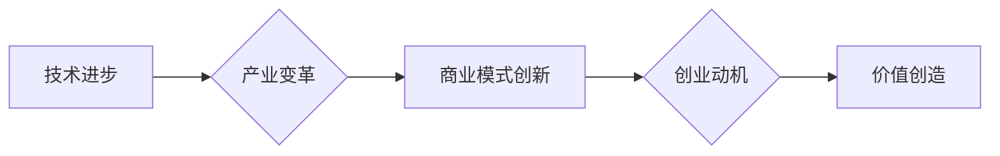

> 人工智能，创业动机，技术进步，产业变革，商业模式，创新驱动，未来趋势

## 1. 背景介绍

人工智能（AI）技术的飞速发展，正在深刻地改变着我们的生活和工作方式。从自动驾驶汽车到智能语音助手，从个性化推荐系统到医疗诊断辅助，AI技术的应用场景日益广泛，其带来的巨大价值和潜力也吸引着越来越多的创业者。

然而，仅仅依靠技术进步并不能保证创业成功的概率。创业者需要洞察市场需求，识别商业机会，并构建可持续的商业模式。在AI时代，创业动机需要更加清晰，更加聚焦于技术进步与产业变革的结合点。

## 2. 核心概念与联系

**2.1 AI技术与产业变革**

人工智能技术本身是一个跨学科领域，涵盖了机器学习、深度学习、自然语言处理、计算机视觉等多个子领域。这些技术的发展，正在推动着各个行业的数字化转型和智能升级。

* **制造业:** AI技术可以实现智能制造，提高生产效率和产品质量，例如，利用机器视觉进行缺陷检测，利用机器人进行自动化生产。
* **金融业:** AI技术可以提高金融服务的效率和精准度，例如，利用机器学习进行风险评估，利用自然语言处理进行客户服务自动化。
* **医疗保健业:** AI技术可以辅助医生进行诊断和治疗，例如，利用深度学习进行图像识别，利用自然语言处理进行病历分析。

**2.2 商业模式创新**

AI技术的应用，不仅可以提高现有业务的效率和效益，还可以催生全新的商业模式。例如：

* **数据驱动型商业模式:** 利用AI技术分析海量数据，挖掘用户需求和市场趋势，为用户提供个性化服务和产品。
* **平台化商业模式:** 建立AI技术平台，为开发者提供工具和服务，促进AI技术的应用和创新。
* **订阅型商业模式:** 提供基于AI技术的软件服务，用户通过订阅的方式获得持续的价值。

**2.3 创业动机与价值创造**

在AI时代，创业动机需要更加清晰，更加聚焦于技术进步与产业变革的结合点。创业者需要思考以下问题：

* **哪些行业或领域最有可能被AI技术颠覆或重塑？**
* **哪些AI技术应用场景能够为用户创造真正的价值？**
* **如何构建一个可持续的商业模式，将AI技术转化为商业收益？**

**Mermaid 流程图**



## 3. 核心算法原理 & 具体操作步骤

**3.1 算法原理概述**

深度学习是人工智能领域的重要分支，其核心是利用多层神经网络来模拟人类大脑的学习过程。深度学习算法能够从海量数据中自动提取特征，并进行复杂的模式识别和预测。

**3.2 算法步骤详解**

1. **数据预处理:** 收集和清洗数据，将其转换为深度学习算法可以理解的格式。
2. **网络结构设计:** 根据具体任务需求，设计深度神经网络的结构，包括层数、节点数量、激活函数等。
3. **模型训练:** 利用训练数据，通过反向传播算法，调整网络参数，使模型的预测结果越来越准确。
4. **模型评估:** 利用测试数据，评估模型的性能，例如，准确率、召回率、F1-score等。
5. **模型部署:** 将训练好的模型部署到实际应用场景中，例如，部署到云服务器、边缘设备等。

**3.3 算法优缺点**

**优点:**

* **高准确率:** 深度学习算法能够从海量数据中自动提取特征，从而实现高准确率的模式识别和预测。
* **自动化学习:** 深度学习算法能够自动学习数据中的模式，无需人工特征工程。
* **泛化能力强:** 深度学习模型能够泛化到新的数据，具有较强的适应能力。

**缺点:**

* **数据依赖:** 深度学习算法需要海量数据进行训练，否则模型性能会下降。
* **计算资源消耗大:** 深度学习模型训练需要大量的计算资源，例如，GPU、TPU等。
* **可解释性差:** 深度学习模型的决策过程比较复杂，难以解释其背后的逻辑。

**3.4 算法应用领域**

深度学习算法广泛应用于各个领域，例如：

* **图像识别:** 人脸识别、物体检测、图像分类等。
* **自然语言处理:** 文本分类、情感分析、机器翻译等。
* **语音识别:** 语音转文本、语音助手等。
* **推荐系统:** 商品推荐、内容推荐等。
* **医疗诊断:** 疾病诊断、影像分析等。

## 4. 数学模型和公式 & 详细讲解 & 举例说明

**4.1 数学模型构建**

深度学习模型的核心是神经网络，其结构可以抽象为一个多层感知机（MLP）。每个神经元接收多个输入信号，并通过权重进行加权求和，然后应用激活函数进行非线性变换，最终输出一个信号。

**4.2 公式推导过程**

假设一个神经网络有L层，每层有n个神经元，输入数据为x，输出为y。则神经网络的输出可以表示为：

```latex
y = f_L(W_L * f_{L-1}(W_{L-1} * ... * f_1(W_1 * x) ...))
```

其中：

* $f_i$ 表示第i层的激活函数。
* $W_i$ 表示第i层的权重矩阵。

**4.3 案例分析与讲解**

以图像分类为例，假设输入图像为一个32x32的像素矩阵，共有1024个像素。我们可以构建一个深度神经网络，其中包含卷积层、池化层和全连接层。

* **卷积层:** 利用卷积核提取图像特征，例如，边缘、纹理等。
* **池化层:** 对卷积层的输出进行降维，减少计算量，提高模型的鲁棒性。
* **全连接层:** 将池化层的输出进行分类，预测图像的类别。

通过训练，网络的参数（权重）会不断调整，使得模型能够准确地识别图像的类别。

## 5. 项目实践：代码实例和详细解释说明

**5.1 开发环境搭建**

* **操作系统:** Ubuntu 20.04
* **编程语言:** Python 3.7
* **深度学习框架:** TensorFlow 2.0
* **硬件环境:** GPU (NVIDIA GeForce RTX 3060)

**5.2 源代码详细实现**

```python
import tensorflow as tf

# 定义模型结构
model = tf.keras.models.Sequential([
    tf.keras.layers.Conv2D(32, (3, 3), activation='relu', input_shape=(32, 32, 3)),
    tf.keras.layers.MaxPooling2D((2, 2)),
    tf.keras.layers.Conv2D(64, (3, 3), activation='relu'),
    tf.keras.layers.MaxPooling2D((2, 2)),
    tf.keras.layers.Flatten(),
    tf.keras.layers.Dense(10, activation='softmax')
])

# 编译模型
model.compile(optimizer='adam',
              loss='sparse_categorical_crossentropy',
              metrics=['accuracy'])

# 训练模型
model.fit(x_train, y_train, epochs=10)

# 评估模型
loss, accuracy = model.evaluate(x_test, y_test)
print('Test loss:', loss)
print('Test accuracy:', accuracy)
```

**5.3 代码解读与分析**

* **模型结构:** 代码定义了一个简单的卷积神经网络，包含两层卷积层、两层池化层和一层全连接层。
* **激活函数:** 使用ReLU激活函数，可以提高模型的非线性表达能力。
* **损失函数:** 使用sparse_categorical_crossentropy损失函数，用于多分类问题。
* **优化器:** 使用Adam优化器，可以快速收敛。

**5.4 运行结果展示**

训练完成后，可以将模型部署到实际应用场景中，例如，部署到云服务器、边缘设备等。

## 6. 实际应用场景

**6.1 智能客服**

AI技术可以用于构建智能客服系统，自动回答用户常见问题，提高客户服务效率。例如，利用自然语言处理技术，可以实现文本对话，理解用户意图，并提供相应的回复。

**6.2 个性化推荐**

AI技术可以分析用户行为数据，推荐个性化的商品、内容或服务。例如，利用协同过滤算法，可以根据用户的历史购买记录，推荐与之相关的商品。

**6.3 自动驾驶**

AI技术是自动驾驶的核心技术之一，可以实现车辆的感知、决策和控制。例如，利用计算机视觉技术，可以识别道路上的障碍物，并做出相应的避让动作。

**6.4 医疗诊断**

AI技术可以辅助医生进行疾病诊断，提高诊断准确率。例如，利用深度学习算法，可以分析医学影像数据，识别病灶，辅助医生做出诊断。

**6.4 未来应用展望**

AI技术的应用场景还在不断扩展，未来将会有更多新的应用场景出现。例如：

* **工业自动化:** AI技术可以实现更智能的工业自动化，例如，利用机器人进行复杂的操作，提高生产效率。
* **教育个性化:** AI技术可以提供个性化的教育服务，例如，根据学生的学习进度和能力，定制学习方案。
* **城市智能化:** AI技术可以用于构建智慧城市，例如，利用传感器数据，优化交通流量，提高城市管理效率。

## 7. 工具和资源推荐

**7.1 学习资源推荐**

* **在线课程:** Coursera、edX、Udacity等平台提供丰富的AI课程。
* **书籍:** 《深度学习》、《机器学习》、《人工智能导论》等书籍。
* **开源项目:** TensorFlow、PyTorch、Keras等开源深度学习框架。

**7.2 开发工具推荐**

* **编程语言:** Python
* **深度学习框架:** TensorFlow、PyTorch、Keras
* **数据处理工具:** Pandas、NumPy
* **可视化工具:** Matplotlib、Seaborn

**7.3 相关论文推荐**

* **AlphaGo论文:** https://arxiv.org/abs/1607.02886
* **BERT论文:** https://arxiv.org/abs/1810.04805
* **GPT-3论文:** https://arxiv.org/abs/2005.14165

## 8. 总结：未来发展趋势与挑战

**8.1 研究成果总结**

近年来，AI技术取得了长足的进步，在各个领域都取得了显著的应用成果。例如，在图像识别、自然语言处理、语音识别等领域，AI模型的性能已经超过了人类水平。

**8.2 未来发展趋势**

* **模型规模化:** 未来AI模型的规模将会进一步扩大，拥有更多的参数和更强的计算能力。
* **模型泛化能力增强:** 研究者将致力于提高AI模型的泛化能力，使其能够适应更多不同的场景和数据。
* **模型解释性增强:** 研究者将致力于提高AI模型的解释性，使其决策过程更加透明和可理解。
* **边缘计算:** AI模型将部署到边缘设备，实现更快速的响应和更低的延迟。

**8.3 面临的挑战**

* **数据安全和隐私:** AI模型的训练需要大量数据，如何保证数据的安全和隐私是一个重要的挑战。
* **算法偏见:** AI模型可能存在算法偏见，导致不公平的结果。如何解决算法偏见是一个重要的研究方向。
* **伦理问题:** AI技术的应用可能会带来一些伦理问题，例如，自动驾驶车辆的责任归属问题。如何制定相应的伦理规范是一个重要的课题。

**8.4 研究展望**

未来，AI技术将继续发展，并对我们的生活