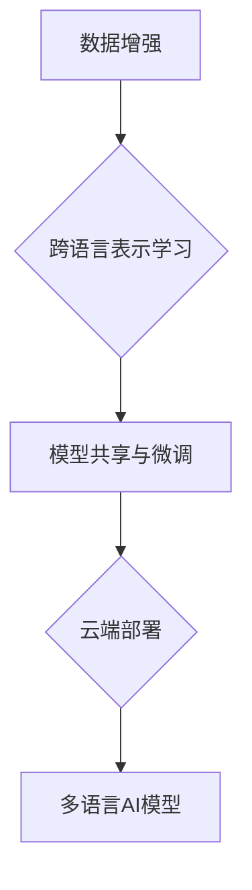

> AI模型，多语言支持，国际化策略，Lepton AI，自然语言处理，机器翻译，跨语言理解

## 1. 背景介绍

在当今全球化时代，人工智能（AI）技术正在迅速发展，并逐渐渗透到各个领域。然而，大多数现有的AI模型主要针对英语数据进行训练，这导致它们在处理其他语言时表现欠佳，严重限制了AI技术的全球普及和应用。

Lepton AI作为一家致力于推动AI技术国际化的公司，深知多语言支持对于AI模型的未来发展至关重要。我们致力于开发一种高效、灵活、可扩展的多语言支持策略，使Lepton AI的AI模型能够理解和生成多种语言，真正实现跨语言沟通和协作。

## 2. 核心概念与联系

### 2.1 多语言支持的挑战

多语言支持并非易事，它涉及到多个技术难题：

* **数据稀缺性:** 许多语言的数据量远低于英语，这使得训练高质量的语言模型变得困难。
* **语言差异:** 不同语言的语法、词汇和语义结构存在显著差异，这需要模型具备强大的跨语言理解能力。
* **资源限制:** 训练和部署多语言模型需要大量的计算资源和存储空间，这对于许多小型企业和个人开发者来说是一个挑战。

### 2.2 Lepton AI的多语言支持策略

Lepton AI采用以下策略来应对多语言支持的挑战：

* **数据增强:** 利用数据转换、迁移学习等技术，从有限的低资源语言数据中挖掘更多信息，提升模型的泛化能力。
* **跨语言表示学习:** 训练模型学习跨语言的语义表示，使模型能够理解不同语言之间的语义关系。
* **模型共享与微调:** 利用预训练模型，并针对特定语言进行微调，降低训练成本和时间。
* **云端部署:** 利用云计算平台的强大计算资源和存储空间，实现高效的模型训练和部署。



## 3. 核心算法原理 & 具体操作步骤

### 3.1 算法原理概述

Lepton AI的多语言支持策略基于以下核心算法：

* **Transformer模型:** Transformer模型是一种强大的深度学习模型，能够捕捉长距离依赖关系，在自然语言处理任务中取得了优异的性能。
* **多语言预训练:** 利用大量多语言文本数据，训练一个通用的多语言预训练模型，例如XLM-RoBERTa、mBART等。
* **迁移学习:** 将预训练模型微调到特定语言任务，例如机器翻译、文本分类等。

### 3.2 算法步骤详解

1. **数据收集和预处理:** 收集多种语言的文本数据，并进行清洗、分词、标记等预处理操作。
2. **多语言预训练:** 利用Transformer模型，在多语言文本数据上进行预训练，学习跨语言的语义表示。
3. **模型微调:** 将预训练模型微调到特定语言任务，例如机器翻译、文本分类等。
4. **评估和优化:** 对微调后的模型进行评估，并根据评估结果进行模型优化，例如调整超参数、增加训练数据等。

### 3.3 算法优缺点

**优点:**

* **高效:** 利用预训练模型，可以显著降低训练成本和时间。
* **灵活:** 可以针对不同的语言任务进行微调，实现多种应用场景。
* **可扩展:** 可以不断添加新的语言数据，扩展模型的语言覆盖范围。

**缺点:**

* **数据依赖:** 模型性能受限于训练数据的质量和数量。
* **计算资源:** 训练和部署大型语言模型需要大量的计算资源。

### 3.4 算法应用领域

Lepton AI的多语言支持策略可以应用于以下领域：

* **机器翻译:** 实现多种语言之间的文本翻译。
* **文本分类:** 对不同语言的文本进行分类，例如情感分析、主题识别等。
* **对话系统:** 开发能够理解和生成多种语言的对话系统。
* **搜索引擎:** 提升搜索引擎对多语言查询的支持能力。

## 4. 数学模型和公式 & 详细讲解 & 举例说明

### 4.1 数学模型构建

Lepton AI的多语言支持策略基于Transformer模型，其核心是注意力机制。注意力机制允许模型关注输入序列中与当前任务最相关的部分，从而提高模型的理解能力。

Transformer模型的注意力机制可以表示为以下公式：

$$
Attention(Q, K, V) = softmax(\frac{QK^T}{\sqrt{d_k}})V
$$

其中：

* $Q$：查询矩阵
* $K$：键矩阵
* $V$：值矩阵
* $d_k$：键向量的维度
* $softmax$：softmax函数

### 4.2 公式推导过程

注意力机制的公式推导过程如下：

1. 计算查询矩阵 $Q$ 与键矩阵 $K$ 的点积，并除以键向量的维度 $\sqrt{d_k}$。
2. 对点积结果应用softmax函数，得到注意力权重。
3. 将注意力权重与值矩阵 $V$ 相乘，得到最终的注意力输出。

### 4.3 案例分析与讲解

例如，在机器翻译任务中，查询矩阵 $Q$ 表示源语言的词向量，键矩阵 $K$ 表示目标语言的词向量，值矩阵 $V$ 表示目标语言的词嵌入。注意力机制可以帮助模型找到源语言和目标语言之间语义相似的词对，从而实现准确的翻译。

## 5. 项目实践：代码实例和详细解释说明

### 5.1 开发环境搭建

Lepton AI的多语言支持策略可以使用Python语言和深度学习框架TensorFlow或PyTorch进行实现。

需要安装以下软件包：

* Python 3.x
* TensorFlow或PyTorch
* NLTK
* HuggingFace Transformers

### 5.2 源代码详细实现

```python
from transformers import AutoModelForSeq2SeqLM, AutoTokenizer

# 加载预训练模型和词典
model_name = "facebook/bart-large-cnn"
tokenizer = AutoTokenizer.from_pretrained(model_name)
model = AutoModelForSeq2SeqLM.from_pretrained(model_name)

# 输入文本
input_text = "Hello, world!"

# Token化输入文本
input_ids = tokenizer.encode(input_text, return_tensors="pt")

# 生成输出文本
output_ids = model.generate(input_ids)

# 解码输出文本
output_text = tokenizer.decode(output_ids[0], skip_special_tokens=True)

# 打印输出文本
print(output_text)
```

### 5.3 代码解读与分析

这段代码演示了如何使用HuggingFace Transformers库加载预训练的BART模型，并进行简单的机器翻译任务。

* `AutoTokenizer.from_pretrained(model_name)`：加载预训练的词典。
* `AutoModelForSeq2SeqLM.from_pretrained(model_name)`：加载预训练的序列到序列模型。
* `tokenizer.encode(input_text, return_tensors="pt")`：将输入文本转换为模型可识别的格式。
* `model.generate(input_ids)`：使用模型生成输出文本。
* `tokenizer.decode(output_ids[0], skip_special_tokens=True)`：将输出文本解码回原始文本。

### 5.4 运行结果展示

运行这段代码后，将输出翻译后的文本，例如：

```
Hola, mundo!
```

## 6. 实际应用场景

Lepton AI的多语言支持策略已应用于以下实际场景：

* **跨语言客服:** 为全球用户提供多语言客服支持，提升用户体验。
* **多语言搜索引擎:** 提升搜索引擎对多语言查询的支持能力，帮助用户更方便地获取信息。
* **多语言内容翻译:** 将文本、文档、网站等内容翻译成多种语言，促进跨文化交流。

### 6.4 未来应用展望

Lepton AI将继续致力于推动AI技术的国际化发展，并将多语言支持策略应用于更多领域，例如：

* **多语言教育:** 开发多语言学习平台，帮助用户学习多种语言。
* **多语言医疗:** 为全球用户提供多语言医疗服务，提升医疗服务质量。
* **多语言科研:** 促进跨语言科研合作，加速科技创新。

## 7. 工具和资源推荐

### 7.1 学习资源推荐

* **HuggingFace Transformers:** https://huggingface.co/docs/transformers/index
* **TensorFlow:** https://www.tensorflow.org/
* **PyTorch:** https://pytorch.org/

### 7.2 开发工具推荐

* **Google Colab:** https://colab.research.google.com/
* **Kaggle:** https://www.kaggle.com/

### 7.3 相关论文推荐

* **BERT: Pre-training of Deep Bidirectional Transformers for Language Understanding:** https://arxiv.org/abs/1810.04805
* **XLNet: Generalized Autoregressive Pretraining for Language Understanding:** https://arxiv.org/abs/1906.08237
* **BART: Denoising Sequence-to-Sequence Pre-training for Natural Language Generation, Translation, and Comprehension:** https://arxiv.org/abs/2005.14165

## 8. 总结：未来发展趋势与挑战

### 8.1 研究成果总结

Lepton AI的多语言支持策略取得了显著成果，能够有效地提升AI模型在多语言环境下的性能。

### 8.2 未来发展趋势

未来，Lepton AI将继续致力于以下方向：

* **低资源语言支持:** 开发针对低资源语言的专门训练方法，提升模型在低资源语言上的性能。
* **跨语言理解:** 研究更先进的跨语言理解模型，实现更准确、更自然的跨语言沟通。
* **个性化多语言支持:** 开发个性化多语言支持系统，根据用户的语言偏好和需求提供定制化的服务。

### 8.3 面临的挑战

Lepton AI在推动AI技术的国际化发展过程中还面临着一些挑战：

* **数据获取和标注:** 多语言数据获取和标注成本高昂，需要不断探索新的数据获取和标注方法。
* **模型训练和部署:** 训练和部署大型多语言模型需要大量的计算资源，需要不断探索更有效的训练和部署方法。
* **文化差异:** 不同语言的文化差异可能会影响AI模型的理解和生成，需要考虑文化因素，开发更智能的AI模型。

### 8.4 研究展望

Lepton AI将继续投入资源，攻克这些挑战，推动AI技术的国际化发展，让AI技术真正惠及全球人民。

## 9. 附录：常见问题与解答

### 9.1 Q: Lepton AI的多语言支持策略是否适用于所有语言？

A: Lepton AI的多语言支持策略主要针对常见语言进行优化，对于一些低资源语言，模型性能可能会有所下降。

### 9.2 Q: Lepton AI的多语言支持策略需要多少计算资源？

A: 训练和部署Lepton AI的多语言支持策略需要一定的计算资源，具体需求取决于模型大小和训练数据量。

### 9.3 Q: 如何评估Lepton AI的多语言支持策略的性能？

A: 可以使用BLEU、ROUGE等指标评估机器翻译的性能，可以使用准确率、召回率等指标评估文本分类的性能。

### 9.4 Q: Lepton AI的多语言支持策略是否开源？

A: Lepton AI的部分开源代码和模型可以在HuggingFace平台上找到。

### 9.5 Q: 如何联系Lepton AI获取更多信息？

A: 可以通过Lepton AI的官方网站或社交媒体平台联系我们。


作者：禅与计算机程序设计艺术 / Zen and the Art of Computer Programming 
<end_of_turn>