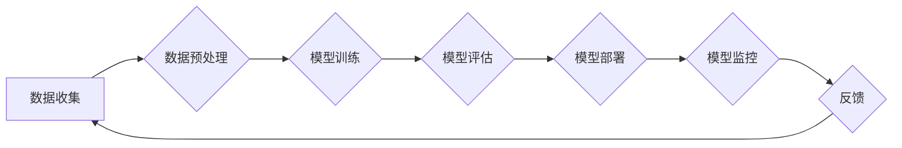

> AI系统质量保证, 
> 模型可靠性, 
> 可解释性, 
> 测试方法, 
> 持续集成, 
> 联邦学习

## 1. 背景介绍

随着人工智能 (AI) 技术的飞速发展，AI 系统已渗透到各个领域，从医疗保健到金融，再到自动驾驶，AI 系统正在改变着我们的生活。然而，随着 AI 系统的应用范围不断扩大，其质量保证也日益成为一个关键问题。传统的软件测试方法难以有效地应对 AI 系统的复杂性和不确定性。

传统的软件测试方法主要关注功能正确性，而 AI 系统的质量不仅包括功能正确性，还包括模型可靠性、可解释性、公平性、安全性等多个方面。此外，AI 系统通常是一个复杂的系统，包含多个模块和组件，这些模块和组件之间相互依赖，这使得 AI 系统的测试更加复杂。

## 2. 核心概念与联系

**2.1 AI 系统质量保证的核心概念**

* **模型可靠性:** 指 AI 模型在给定输入下能够产生准确、一致和可预测的输出的能力。
* **可解释性:** 指能够理解 AI 模型的决策过程，并解释其输出结果的原因。
* **公平性:** 指 AI 模型对所有用户都公平地对待，不产生歧视或偏见。
* **安全性:** 指 AI 系统能够抵抗恶意攻击和数据泄露。

**2.2 AI 系统质量保证的联系**

AI 系统质量保证是一个多方面的挑战，需要综合考虑模型可靠性、可解释性、公平性、安全性等多个方面。这些方面相互关联，共同影响着 AI 系统的整体质量。

**2.3  AI 系统质量保证流程图**



## 3. 核心算法原理 & 具体操作步骤

**3.1 算法原理概述**

本节将介绍一种用于评估 AI 模型可靠性的核心算法原理，例如：

* **蒙特卡罗方法:** 通过随机采样来模拟模型的性能，并估计其可靠性。
* **bootstrap 方法:** 通过重复采样训练数据来评估模型的泛化能力。
* **Adversarial Attack:** 通过生成对抗样本来测试模型的鲁棒性。

**3.2 算法步骤详解**

以蒙特卡罗方法为例，详细介绍其步骤：

1. **定义目标函数:** 首先需要定义一个目标函数，用来衡量模型的性能。例如，对于分类任务，目标函数可以是准确率、召回率或 F1-score。
2. **生成随机样本:** 使用蒙特卡罗方法生成多个随机样本，每个样本都是从训练数据中随机抽取的。
3. **训练模型:** 对每个随机样本训练一个模型。
4. **评估模型性能:** 对每个训练好的模型进行评估，并记录其目标函数值。
5. **计算平均值:** 对所有模型的性能值进行平均，得到模型的可靠性估计值。

**3.3 算法优缺点**

* **优点:** 蒙特卡罗方法能够有效地估计模型的可靠性，并且能够处理高维数据。
* **缺点:** 蒙特卡罗方法需要大量的计算资源，并且其结果的准确性取决于随机样本的质量。

**3.4 算法应用领域**

蒙特卡罗方法广泛应用于机器学习、金融建模、风险管理等领域。

## 4. 数学模型和公式 & 详细讲解 & 举例说明

**4.1 数学模型构建**

假设我们有一个分类模型，其输出为一个概率值，表示样本属于某个类别的概率。我们可以使用贝叶斯定理来构建一个数学模型，用来估计模型的可靠性。

**4.2 公式推导过程**

贝叶斯定理如下：

$$P(A|B) = \frac{P(B|A)P(A)}{P(B)}$$

其中：

* $P(A|B)$ 是在已知事件 B 发生的情况下，事件 A 发生的概率。
* $P(B|A)$ 是在已知事件 A 发生的情况下，事件 B 发生的概率。
* $P(A)$ 是事件 A 发生的概率。
* $P(B)$ 是事件 B 发生的概率。

我们可以将贝叶斯定理应用于我们的分类模型，其中：

* $A$ 是样本属于某个类别的事件。
* $B$ 是模型预测样本属于某个类别的概率。

**4.3 案例分析与讲解**

假设我们有一个分类模型，用于判断邮件是否为垃圾邮件。模型预测邮件为垃圾邮件的概率为 0.8。我们知道，真实垃圾邮件的比例为 10%。

我们可以使用贝叶斯定理来估计模型的可靠性：

$$P(\text{邮件为垃圾邮件}| \text{模型预测为垃圾邮件}) = \frac{P(\text{模型预测为垃圾邮件}|\text{邮件为垃圾邮件})P(\text{邮件为垃圾邮件})}{P(\text{模型预测为垃圾邮件})}$$

其中：

* $P(\text{模型预测为垃圾邮件}|\text{邮件为垃圾邮件}) = 0.8$ (模型的准确率)
* $P(\text{邮件为垃圾邮件}) = 0.1$ (真实垃圾邮件的比例)
* $P(\text{模型预测为垃圾邮件})$ 可以通过计算所有邮件的预测概率的平均值来得到。

通过计算上述公式，我们可以得到模型预测邮件为垃圾邮件的可靠性。

## 5. 项目实践：代码实例和详细解释说明

**5.1 开发环境搭建**

本节将使用 Python 语言和 TensorFlow 库来实现一个简单的 AI 模型，并进行测试。

**5.2 源代码详细实现**

```python
import tensorflow as tf

# 定义模型
model = tf.keras.models.Sequential([
  tf.keras.layers.Dense(128, activation='relu', input_shape=(784,)),
  tf.keras.layers.Dense(10, activation='softmax')
])

# 编译模型
model.compile(optimizer='adam',
              loss='sparse_categorical_crossentropy',
              metrics=['accuracy'])

# 训练模型
model.fit(x_train, y_train, epochs=10)

# 评估模型
loss, accuracy = model.evaluate(x_test, y_test)
print('Test loss:', loss)
print('Test accuracy:', accuracy)
```

**5.3 代码解读与分析**

这段代码定义了一个简单的深度学习模型，用于手写数字识别任务。

* `tf.keras.models.Sequential` 创建了一个顺序模型，其中层级依次连接。
* `tf.keras.layers.Dense` 定义了一个全连接层，其中 128 个神经元使用 ReLU 激活函数。
* `tf.keras.layers.Dense` 定义了输出层，具有 10 个神经元，使用 softmax 激活函数，用于输出 10 个数字类别的概率。
* `model.compile` 编译模型，指定优化器、损失函数和指标。
* `model.fit` 训练模型，使用训练数据进行训练。
* `model.evaluate` 评估模型，使用测试数据计算损失和准确率。

**5.4 运行结果展示**

训练完成后，模型的准确率将显示在控制台输出中。

## 6. 实际应用场景

**6.1 医疗诊断**

AI 系统可以用于辅助医生进行诊断，例如识别病理图像中的肿瘤，预测患者的风险。

**6.2 金融风险管理**

AI 系统可以用于识别欺诈交易，评估信用风险，优化投资组合。

**6.3 自动驾驶**

AI 系统可以用于感知周围环境，做出驾驶决策，例如识别交通信号灯，避开障碍物。

**6.4 未来应用展望**

随着 AI 技术的不断发展，AI 系统将在更多领域得到应用，例如个性化教育、智能家居、机器人等。

## 7. 工具和资源推荐

**7.1 学习资源推荐**

* **书籍:**
    * 深度学习
    * 人工智能：一种现代方法
* **在线课程:**
    * Coursera: 深度学习
    * edX: 人工智能

**7.2 开发工具推荐**

* **TensorFlow:** 开源深度学习框架
* **PyTorch:** 开源深度学习框架
* **Scikit-learn:** 机器学习库

**7.3 相关论文推荐**

* **Attention Is All You Need**
* **BERT: Pre-training of Deep Bidirectional Transformers for Language Understanding**

## 8. 总结：未来发展趋势与挑战

**8.1 研究成果总结**

近年来，AI 系统的质量保证取得了显著进展，例如：

* 出现了新的测试方法和工具，例如对抗样本生成、可解释性分析等。
* 发展了新的模型评估指标，例如公平性、鲁棒性等。

**8.2 未来发展趋势**

未来，AI 系统的质量保证将朝着以下方向发展：

* **更加自动化:** 使用自动化工具和技术来提高测试效率和覆盖率。
* **更加智能:** 使用 AI 技术来辅助测试，例如自动生成测试用例、自动识别缺陷等。
* **更加可解释:** 开发更加可解释的 AI 模型，以便更好地理解其决策过程。

**8.3 面临的挑战**

AI 系统的质量保证仍然面临一些挑战，例如：

* **缺乏标准化:** 目前还没有统一的标准和规范来指导 AI 系统的质量保证。
* **数据稀缺:** 许多 AI 应用领域的数据量有限，这使得模型的训练和测试更加困难。
* **黑盒问题:** 一些 AI 模型过于复杂，难以理解其决策过程，这使得其质量保证更加困难。

**8.4 研究展望**

未来，需要进一步研究以下问题：

* 如何建立统一的 AI 系统质量保证标准和规范。
* 如何解决数据稀缺问题，提高模型的泛化能力。
* 如何开发更加可解释的 AI 模型，以便更好地理解其决策过程。

## 9. 附录：常见问题与解答

**9.1 如何评估 AI 模型的可靠性？**

可以使用蒙特卡罗方法、bootstrap 方法、Adversarial Attack 等方法来评估 AI 模型的可靠性。

**9.2 如何提高 AI 模型的可解释性？**

可以使用可解释性分析工具，例如 LIME、SHAP 等，来解释 AI 模型的决策过程。

**9.3 如何保证 AI 系统的安全性？**

可以使用安全测试方法，例如对抗样本攻击、数据泄露攻击等，来评估 AI 系统的安全性。

作者：禅与计算机程序设计艺术 / Zen and the Art of Computer Programming


<end_of_turn>