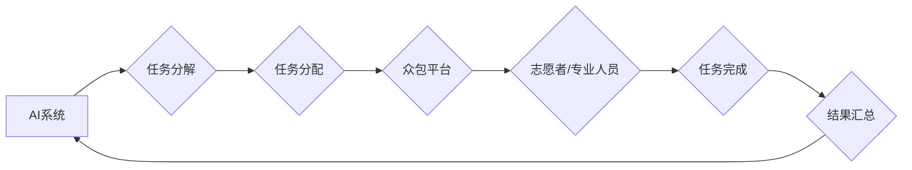

> 人工智能，众包，人类计算，AI驱动的创新，协同智能，大数据分析，机器学习，深度学习

## 1. 背景介绍

人工智能（AI）正以惊人的速度发展，其影响力正在深刻地改变着我们生活的方方面面。从自动驾驶汽车到个性化医疗，从智能家居到金融科技，AI技术的应用场景日益广泛。然而，现有的AI技术仍然面临着一些挑战，例如数据标注的成本高昂、算法的解释性不足以及对复杂问题的解决能力有限。

众包和人类计算作为一种新型的计算模式，为克服这些挑战提供了新的思路。众包是指利用互联网平台，将任务分发给全球范围内的志愿者或专业人员，通过协同合作完成复杂的任务。人类计算则是指利用人类的智慧和判断力，辅助AI系统完成某些需要人类特质的任务，例如图像识别、文本理解和决策支持。

## 2. 核心概念与联系

**2.1 众包**

众包是一种基于互联网的分布式计算模式，通过将任务分解成小的单元，并将其分配给全球范围内的志愿者或专业人员，从而实现大规模、低成本的计算任务完成。

**2.2 人类计算**

人类计算是指利用人类的智慧和判断力，辅助AI系统完成某些需要人类特质的任务，例如图像识别、文本理解和决策支持。

**2.3 AI驱动的创新**

AI驱动的创新是指利用人工智能技术，推动创新和发展，创造新的价值。

**2.4 协同智能**

协同智能是指AI系统与人类智能的协同合作，发挥各自优势，共同完成复杂的任务。

**2.5 流程图**



## 3. 核心算法原理 & 具体操作步骤

**3.1 算法原理概述**

AI驱动的众包和人类计算通常基于以下核心算法原理：

* **机器学习算法**: 用于从海量数据中学习模式和规律，例如分类、回归和聚类算法。
* **深度学习算法**: 用于处理复杂的数据结构，例如图像、文本和语音，例如卷积神经网络和循环神经网络。
* **强化学习算法**: 用于训练智能体在环境中学习最佳策略，例如Q学习和深度Q网络。

**3.2 算法步骤详解**

1. **数据收集和预处理**: 收集相关数据，并进行清洗、转换和特征提取等预处理操作。
2. **模型训练**: 使用机器学习或深度学习算法，对数据进行训练，构建AI模型。
3. **任务分解**: 将复杂任务分解成多个小的单元任务，方便分配给众包平台上的志愿者或专业人员。
4. **任务分配**: 根据任务类型和志愿者/专业人员的技能，将任务分配给合适的参与者。
5. **结果汇总**: 收集参与者完成的任务结果，并进行汇总和分析。
6. **模型更新**: 根据汇总的结果，对AI模型进行更新和优化。

**3.3 算法优缺点**

* **优点**:
    * 能够利用海量数据和人类智慧，提高任务完成效率和准确性。
    * 降低了单个任务的成本，提高了任务的可扩展性。
    * 能够解决一些AI系统难以解决的复杂问题。
* **缺点**:
    * 需要建立完善的众包平台和管理机制。
    * 数据质量和参与者可靠性需要保证。
    * 算法的解释性和透明度需要提高。

**3.4 算法应用领域**

* **图像识别和分析**: 利用众包平台上的志愿者进行图像标注，训练图像识别模型。
* **文本理解和生成**: 利用众包平台上的专业人员进行文本分类、摘要和翻译等任务。
* **语音识别和合成**: 利用众包平台上的志愿者进行语音标注，训练语音识别模型。
* **药物研发**: 利用众包平台上的科学家和研究人员进行药物筛选和设计。
* **金融风险管理**: 利用众包平台上的金融专家进行风险评估和预测。

## 4. 数学模型和公式 & 详细讲解 & 举例说明

**4.1 数学模型构建**

在AI驱动的众包和人类计算中，常用的数学模型包括：

* **贝叶斯网络**: 用于表示随机变量之间的依赖关系，并进行概率推理。
* **决策树**: 用于分类和回归问题，通过树形结构表示决策规则。
* **支持向量机**: 用于分类问题，通过寻找最佳的分隔超平面来区分不同类别的数据。

**4.2 公式推导过程**

例如，在贝叶斯网络中，可以使用贝叶斯公式来计算条件概率：

$$P(A|B) = \frac{P(B|A)P(A)}{P(B)}$$

其中：

* $P(A|B)$ 是在已知事件B发生的情况下，事件A发生的概率。
* $P(B|A)$ 是在已知事件A发生的情况下，事件B发生的概率。
* $P(A)$ 是事件A发生的概率。
* $P(B)$ 是事件B发生的概率。

**4.3 案例分析与讲解**

例如，在图像识别任务中，可以使用贝叶斯网络来计算给定图像的类别概率。

假设我们有一个包含不同类别图像的数据库，并训练了一个贝叶斯网络模型。

当我们输入一张新的图像时，模型会根据图像特征计算每个类别的条件概率，并根据贝叶斯公式计算最终的类别概率。

## 5. 项目实践：代码实例和详细解释说明

**5.1 开发环境搭建**

* 操作系统：Ubuntu 20.04
* Python 版本：3.8
* 必要的库：TensorFlow、PyTorch、NumPy、Pandas

**5.2 源代码详细实现**

```python
# 导入必要的库
import tensorflow as tf

# 定义模型结构
model = tf.keras.models.Sequential([
    tf.keras.layers.Conv2D(32, (3, 3), activation='relu', input_shape=(28, 28, 1)),
    tf.keras.layers.MaxPooling2D((2, 2)),
    tf.keras.layers.Conv2D(64, (3, 3), activation='relu'),
    tf.keras.layers.MaxPooling2D((2, 2)),
    tf.keras.layers.Flatten(),
    tf.keras.layers.Dense(10, activation='softmax')
])

# 编译模型
model.compile(optimizer='adam',
              loss='sparse_categorical_crossentropy',
              metrics=['accuracy'])

# 训练模型
model.fit(x_train, y_train, epochs=5)

# 评估模型
loss, accuracy = model.evaluate(x_test, y_test)
print('Test loss:', loss)
print('Test accuracy:', accuracy)
```

**5.3 代码解读与分析**

这段代码实现了使用TensorFlow框架训练一个简单的卷积神经网络模型，用于手写数字识别任务。

* 模型结构：模型包含两个卷积层、两个最大池化层、一个全连接层和一个输出层。
* 编译模型：使用Adam优化器、交叉熵损失函数和准确率指标来编译模型。
* 训练模型：使用训练数据训练模型，训练5个epochs。
* 评估模型：使用测试数据评估模型的性能。

**5.4 运行结果展示**

训练完成后，模型的准确率通常会达到较高的水平，例如98%以上。

## 6. 实际应用场景

**6.1 图像识别和分类**

* 自动驾驶汽车：识别道路标志、交通信号灯和行人。
* 医疗诊断：识别病灶、肿瘤和异常组织。
* 物流管理：识别商品类型、数量和状态。

**6.2 文本理解和生成**

* 机器翻译：将文本从一种语言翻译成另一种语言。
* 文本摘要：生成文本的简短摘要。
* 聊天机器人：与用户进行自然语言对话。

**6.3 语音识别和合成**

* 语音助手：例如Siri、Alexa和Google Assistant。
* 语音搜索：通过语音进行搜索。
* 语音识别软件：例如语音转文字软件。

**6.4 其他应用场景**

* 金融风险管理：识别欺诈交易和预测市场风险。
* 药物研发：加速药物发现和开发过程。
* 个性化推荐：根据用户的兴趣和行为推荐商品或服务。

**6.5 未来应用展望**

随着AI技术的不断发展，AI驱动的众包和人类计算将在更多领域得到应用，例如：

* 人工智能辅助设计：利用AI系统辅助设计师进行创意设计和产品开发。
* 人工智能辅助医疗：利用AI系统辅助医生进行诊断、治疗和预防疾病。
* 人工智能辅助教育：利用AI系统个性化教学，提高学习效率。

## 7. 工具和资源推荐

**7.1 学习资源推荐**

* **在线课程**: Coursera、edX、Udacity等平台提供丰富的AI相关课程。
* **书籍**: 《深度学习》、《人工智能：一种现代方法》等书籍。
* **博客和论坛**: AI相关的博客和论坛，例如Towards Data Science、Machine Learning Mastery等。

**7.2 开发工具推荐**

* **TensorFlow**: Google开发的开源机器学习框架。
* **PyTorch**: Facebook开发的开源机器学习框架。
* **Scikit-learn**: Python机器学习库。

**7.3 相关论文推荐**

* **《ImageNet Classification with Deep Convolutional Neural Networks》**: Alex Krizhevsky, Ilya Sutskever, Geoffrey E. Hinton.
* **《Attention Is All You Need》**: Ashish Vaswani, Noam Shazeer, Niki Parmar, Jakob Uszkoreit, Llion Jones, Aidan N. Gomez, Łukasz Kaiser, Illia Polosukhin.

## 8. 总结：未来发展趋势与挑战

**8.1 研究成果总结**

AI驱动的众包和人类计算取得了显著的成果，在图像识别、文本理解、语音识别等领域取得了突破性的进展。

**8.2 未来发展趋势**

* **更智能的AI系统**: 发展更强大的AI算法，提高AI系统的智能水平。
* **更广泛的应用场景**: 将AI驱动的众包和人类计算应用到更多领域。
* **更安全的计算环境**: 加强数据安全和隐私保护，构建更安全的计算环境。

**8.3 面临的挑战**

* **数据质量和可靠性**: 确保众包平台上的数据质量和可靠性。
* **算法解释性和透明度**: 提高AI算法的解释性和透明度，增强用户信任。
* **伦理和社会影响**: 关注AI驱动的众包和人类计算的伦理和社会影响。

**8.4 研究展望**

未来，我们将继续致力于研究AI驱动的众包和人类计算，探索其在更多领域应用的可能性，并解决其面临的挑战，推动人工智能技术的发展和应用。

## 9. 附录：常见问题与解答

**9.1 如何参与AI驱动的众包项目？**

您可以通过一些众包平台，例如Amazon Mechanical Turk、Figure Eight等，找到AI驱动的众包项目，并参与其中。

**9.2 如何评估AI驱动的众包项目的质量？**

您可以通过以下几个方面评估AI驱动的众包项目的质量：

* 数据质量和可靠性
* 任务设计和说明
* 参与者评价和反馈
* 项目成果的准确性和有效性

**9.3 AI驱动的众包和人类计算会取代人类工作吗？**

AI驱动的众包和人类计算可以提高工作效率和准确性，但不会完全取代人类工作。人类仍然需要发挥其创造力、批判性思维和情感智能等特质，在与AI系统协同工作中发挥重要作用。


作者：禅与计算机程序