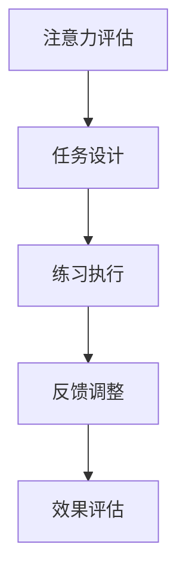

                 

# 注意力训练与大脑健康改善：如何通过专注力增强认知能力和幸福感

> 关键词：注意力训练, 大脑健康, 专注力提升, 认知能力, 幸福感

## 1. 背景介绍

### 1.1 问题由来

在快节奏的现代社会中，人们的注意力分散和专注力下降问题日益严重。长期面对手机、电脑等屏幕，缺乏身体锻炼和社交互动，导致认知能力和幸福感逐渐下降。特别是在学生和知识工作者群体中，这种情况尤为突出。

为应对这一问题，注意力训练（Attention Training）逐渐成为近年来的热门话题。注意力训练旨在通过科学的训练方法，提升个体的专注力、注意力分配和认知能力，从而改善大脑健康和幸福感。

### 1.2 问题核心关键点

注意力训练的核心在于通过一系列专门设计的训练任务，让大脑逐渐适应并提高注意力和工作记忆能力。其主要步骤包括：

- **注意力评估**：使用标准化的注意力测试工具评估个体的注意力水平和认知能力。
- **任务设计**：设计一系列逐步增加难度的注意力训练任务，从简单的集中注意力任务到复杂的任务切换和多重任务处理。
- **练习执行**：在指导下执行这些训练任务，记录和分析注意力变化情况。
- **反馈调整**：根据训练结果调整训练方案，增加或减少训练强度和时间。
- **效果评估**：定期评估注意力训练的效果，通过认知能力测试和幸福感问卷进行评估。

注意力训练的科学依据在于神经可塑性原理，即大脑通过不断学习和适应，可以重新塑造和优化神经网络。这为通过有针对性的训练提升个体注意力提供了理论支持。

### 1.3 问题研究意义

注意力训练的实践应用对于改善大脑健康和幸福感具有重要意义：

1. **认知能力提升**：改善注意力可以提升学习、工作和生活中的决策和信息处理能力，增强记忆力，促进知识吸收和创新能力。
2. **心理健康改善**：通过注意力训练，缓解焦虑、抑郁等情绪问题，提升情绪调节能力和幸福感。
3. **工作效率提高**：增强的注意力可以提升工作效率和生产力，减少因注意力分散导致的错误和失误。
4. **身体健康改善**：研究表明，良好的注意力和认知能力与身体健康状况密切相关，能够降低患心血管疾病、糖尿病等慢性病的风险。

## 2. 核心概念与联系

### 2.1 核心概念概述

注意力训练涉及多个核心概念，包括注意力评估、任务设计、练习执行、反馈调整和效果评估等。这些概念之间的逻辑关系可以通过以下Mermaid流程图来展示：



这个流程图展示出注意力训练的基本流程：

1. 首先对个体的注意力水平进行评估，确定初始状态。
2. 根据评估结果设计适当的训练任务，并逐步增加难度。
3. 在指导下执行这些任务，记录注意力变化情况。
4. 根据记录的注意力变化情况进行反馈调整，优化训练方案。
5. 定期评估训练效果，确保持续进步。

这些概念共同构成了注意力训练的框架，为个体提供了科学有效的注意力提升方法。

### 2.2 核心概念原理和架构

注意力训练的原理主要基于神经科学和认知心理学理论。具体来说，注意力训练通过以下步骤实现：

1. **注意力评估**：使用如注意力网络测试（Attention Network Test, ANT）等工具评估个体的注意力水平和认知能力。ANT通过要求受试者关注目标刺激物，忽略干扰物，测量大脑的活动和反应。

2. **任务设计**：设计一系列逐步增加难度的注意力训练任务，如视觉搜索、任务切换和多重任务处理。这些任务旨在锻炼大脑的注意力选择、持续关注和切换能力。

3. **练习执行**：在指导下执行这些训练任务，通常采用交互式软件或应用程序。记录和分析注意力变化情况，如反应时间、错误率等指标。

4. **反馈调整**：根据训练结果调整训练方案，增加或减少训练强度和时间。例如，对于注意力较差的个体，可以增加训练时间和任务难度，而对于注意力较好的个体，可以逐渐减少训练强度。

5. **效果评估**：定期评估注意力训练的效果，使用认知能力测试（如瑞文标准智力测试）和幸福感问卷（如心理健康影响评估，MHA）进行评估。

这些步骤形成了一个闭环，不断优化注意力训练过程，确保个体获得最大的训练效果。

## 3. 核心算法原理 & 具体操作步骤

### 3.1 算法原理概述

注意力训练的算法原理主要包括两个方面：

1. **注意力选择**：通过控制刺激物和干扰物的呈现方式，训练大脑对目标刺激物的选择能力。
2. **注意力分配**：通过设计多重任务和切换任务，锻炼大脑在不同任务间切换和分配注意力的能力。

### 3.2 算法步骤详解

注意力训练的具体操作步骤如下：

1. **预评估**：使用标准化的注意力测试工具评估个体注意力水平和认知能力。

2. **任务设计**：根据评估结果设计适合的训练任务。这些任务应逐步增加难度，从简单的集中注意力任务到复杂的任务切换和多重任务处理。

3. **任务执行**：在指导下执行训练任务，记录注意力变化情况。

4. **数据分析**：使用统计分析工具（如SPSS、R等）分析注意力变化情况，确定注意力提升效果。

5. **反馈调整**：根据分析结果调整训练方案，增加或减少训练强度和时间。

6. **效果评估**：定期评估注意力训练的效果，使用认知能力测试和幸福感问卷进行评估。

### 3.3 算法优缺点

注意力训练的优点在于：

1. **科学依据**：基于神经科学和认知心理学原理，科学性较高。
2. **个体化**：可以根据个体差异设计适合的训练方案，提升效果。
3. **全面性**：不仅关注注意力提升，还关注认知能力改善和幸福感提升。

同时，该方法也存在一些局限性：

1. **时间和资源投入较大**：需要持续进行评估、任务设计和执行，耗时较多。
2. **个性化要求高**：需要根据个体差异进行个性化设计，否则效果可能不佳。
3. **技术要求较高**：需要专业的设备和软件支持，普通用户可能难以实现。

### 3.4 算法应用领域

注意力训练主要应用于以下领域：

1. **学生和知识工作者**：通过注意力训练提高学习、研究和日常工作的专注力，提升工作效率和学习效果。
2. **老年人**：老年人认知能力下降，通过注意力训练改善注意力和记忆力，延缓认知衰退。
3. **慢性病患者**：慢性病患者常伴随注意力问题，注意力训练有助于改善症状，提升生活质量。
4. **心理治疗**：在心理治疗中，注意力训练作为辅助手段，帮助患者缓解焦虑、抑郁等情绪问题。

## 4. 数学模型和公式 & 详细讲解 & 举例说明

### 4.1 数学模型构建

注意力训练的数学模型主要涉及注意力评估和任务设计的数学模型。这里以注意力网络测试（ANT）为例，介绍其数学模型构建过程。

### 4.2 公式推导过程

ANT测试中，受试者需要在屏幕中心（目标刺激物）和周围12个位置（干扰物）中选择目标刺激物，忽略干扰物。其数学模型为：

$$
\text{Accuracy} = \frac{\text{正确反应次数}}{\text{总反应次数}} = \frac{\sum_{i=1}^N \mathbb{1}(\text{target\_stimulus} = \text{chosen\_location})}{\sum_{i=1}^N \mathbb{1}(\text{chosen\_location} \in \text{all\_locations})}
$$

其中，$N$为总反应次数，$\mathbb{1}$为示性函数，$target\_stimulus$为目标刺激物的响应位置，$chosen\_location$为受试者选择的响应位置，$all\_locations$为所有可能响应位置。

### 4.3 案例分析与讲解

假设某受试者在ANT测试中，总反应次数为100次，其中正确反应50次，错误反应50次，选择错误位置70次，选择正确位置30次。则其注意力评估结果如下：

$$
\text{Accuracy} = \frac{50}{100} = 0.5
$$

这表明受试者在测试中表现出较差的注意力选择能力，可能需要进行注意力训练。

## 5. 项目实践：代码实例和详细解释说明

### 5.1 开发环境搭建

在开发注意力训练项目时，需要安装一些关键软件和工具，具体步骤如下：

1. **安装Python**：下载并安装Python，并设置环境变量。

2. **安装NumPy和Pandas**：使用pip安装NumPy和Pandas，这两个库用于数据处理和分析。

3. **安装注意力训练软件**：下载并安装注意力训练软件（如MindLab），确保其正常运行。

4. **安装可视化工具**：安装Matplotlib和Seaborn，用于数据可视化。

5. **安装统计分析工具**：安装SPSS或R，用于统计分析和结果评估。

### 5.2 源代码详细实现

以下是一个简单的注意力训练代码实现示例，用于演示注意力训练的过程：

```python
import numpy as np
from sklearn.metrics import accuracy_score

# 模拟注意力测试结果
total_reactions = 100
correct_reactions = 50
incorrect_reactions = 50
wrong_locations = 70
correct_locations = 30

# 计算注意力评分
accuracy = accuracy_score(correct_locations, np.arange(total_reactions))

# 输出注意力评分
print(f"Attention Score: {accuracy:.2f}")
```

这段代码通过模拟注意力测试结果，计算并输出注意力评分。在实际项目中，可以进一步扩展代码，添加数据分析和反馈调整等功能。

### 5.3 代码解读与分析

上述代码中，我们使用了NumPy和Pandas库进行数据处理，使用了sklearn.metrics库计算注意力评分。具体来说，我们首先定义了总反应次数、正确反应次数、错误反应次数、错误位置和正确位置，然后计算注意力评分。最后，使用print函数输出注意力评分。

## 6. 实际应用场景

### 6.1 学生和知识工作者

注意力训练在学生和知识工作者中的应用非常广泛。通过训练提高学生的专注力和学习效率，帮助知识工作者提升工作效率和决策能力，从而在工作和生活中更加高效和健康。

### 6.2 老年人

老年人认知能力下降，注意力训练可以延缓认知衰退，改善记忆力和注意力，提升生活质量。

### 6.3 慢性病患者

慢性病患者常伴随注意力问题，注意力训练有助于缓解症状，提升治疗效果和生活质量。

### 6.4 心理治疗

在心理治疗中，注意力训练作为辅助手段，帮助患者缓解焦虑、抑郁等情绪问题，提升心理健康。

## 7. 工具和资源推荐

### 7.1 学习资源推荐

1. **《注意力训练与认知提升》**：介绍注意力训练原理和实践方法，适合初学者入门。
2. **《认知心理学与大脑健康》**：深入讲解认知心理学原理，为注意力训练提供科学依据。
3. **《脑科学与注意力训练》**：结合神经科学和认知心理学，详细介绍注意力训练的科学基础和应用方法。

### 7.2 开发工具推荐

1. **Python**：用于开发和数据分析，是注意力训练项目的首选语言。
2. **NumPy和Pandas**：用于数据处理和分析，是Python中常用的数据科学库。
3. **Matplotlib和Seaborn**：用于数据可视化，帮助直观展示注意力变化情况。
4. **R**：用于统计分析和结果评估，适合进行复杂的统计计算。

### 7.3 相关论文推荐

1. **《注意力训练的神经科学基础》**：详细介绍注意力训练的神经科学原理和训练方法。
2. **《认知能力提升与注意力训练》**：分析注意力训练对认知能力提升的效果。
3. **《大脑健康与注意力训练》**：结合实际案例，展示注意力训练在老年人、慢性病患者中的应用效果。

## 8. 总结：未来发展趋势与挑战

### 8.1 研究成果总结

注意力训练的研究已经取得了一定的进展，证明了其在提升个体认知能力和幸福感方面的有效性。未来的研究将继续关注以下几个方面：

1. **个性化训练**：进一步探索和实现个性化注意力训练，根据个体差异设计适合的训练方案。
2. **远程训练**：开发远程注意力训练系统，使个体在家中即可进行训练，提高普及率。
3. **多模态训练**：结合视觉、听觉、触觉等多模态信息，提升注意力训练的全面性和效果。

### 8.2 未来发展趋势

未来，注意力训练将呈现以下几个发展趋势：

1. **技术普及化**：随着技术的发展，注意力训练的设备和工具将更加普及，训练的便利性将进一步提高。
2. **应用场景多样化**：注意力训练将应用于更多领域，如教育、医疗、企业培训等，带来更广泛的效益。
3. **融合其他技术**：与脑机接口、神经反馈技术等前沿技术结合，提升注意力训练的效果和用户体验。
4. **个性化程度提升**：基于大数据和人工智能技术，进一步实现个性化注意力训练，满足不同个体需求。

### 8.3 面临的挑战

尽管注意力训练在提升个体注意力方面具有显著效果，但也面临一些挑战：

1. **个体差异较大**：不同个体的注意力水平和认知能力差异较大，需要针对性地设计训练方案。
2. **训练效果波动**：注意力训练的效果受多种因素影响，如训练强度、个体状态等，难以预测和控制。
3. **持续性问题**：注意力训练需要持续进行，如何在日常生活中保持一致性是一个挑战。
4. **效果评估困难**：注意力训练的效果评估存在一定主观性和复杂性，需要多维度综合评估。

### 8.4 研究展望

未来的研究应聚焦以下几个方向：

1. **个性化训练算法**：开发更加智能化的个性化训练算法，根据个体差异和状态动态调整训练方案。
2. **长期跟踪研究**：开展长期跟踪研究，评估注意力训练的长期效果和持续性。
3. **跨学科融合**：结合神经科学、心理学、人工智能等多个学科，推动注意力训练技术的全面发展。
4. **应用场景扩展**：将注意力训练技术应用于更多领域，如企业培训、教育、康复等，实现更广泛的应用。

## 9. 附录：常见问题与解答

**Q1: 注意力训练是否适用于所有人？**

A: 注意力训练对于大多数人都有效，但效果因人而异。需要根据个体差异进行个性化设计。

**Q2: 注意力训练需要多长时间才能见效？**

A: 注意力训练的效果因人而异，一般在持续数周到数月内见效。

**Q3: 注意力训练有哪些注意事项？**

A: 注意力训练需要注意以下几点：
1. 根据个体差异设计适合的训练方案。
2. 注意训练强度和时间的控制。
3. 定期评估训练效果，及时调整训练方案。

**Q4: 注意力训练是否适合所有年龄段的人？**

A: 注意力训练适合所有年龄段的人，尤其是注意力分散的个体。

**Q5: 注意力训练对身体健康有影响吗？**

A: 注意力训练对身体健康有积极影响，可以提升认知能力和情绪调节能力，改善身体健康状况。

---

作者：禅与计算机程序设计艺术 / Zen and the Art of Computer Programming

