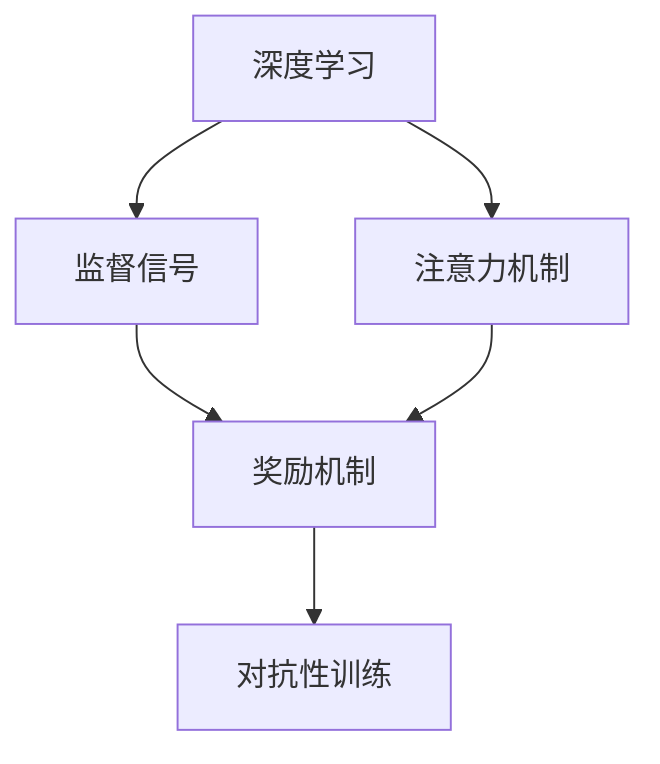

                 

# 注意力训练与大脑增强：通过专注力增强认知能力和神经可塑性

## 1. 背景介绍

### 1.1 问题由来

现代社会，人们的生活节奏日益加快，信息爆炸导致注意力分散，认知负担加重。注意力作为认知功能的重要组成部分，直接影响了人的学习效率和创新能力。据统计，全球约有10%的人口存在不同程度的注意力障碍，严重影响日常生活和工作。

随着人工智能和大数据技术的发展，注意力成为机器学习和深度学习模型研究的热点问题之一。神经科学和心理学研究发现，注意力与大脑皮层中的多巴胺神经元活动密切相关，可通过药物和训练刺激进行干预和提升。但药物副作用大，难以长期坚持。相比之下，基于深度学习的注意力训练方法，通过模拟人类神经元活动，可有效提升注意力水平，且无副作用，有望成为一种可靠、低成本的注意力提升手段。

### 1.2 问题核心关键点

当前，基于深度学习的注意力训练方法主要通过模拟人类大脑的神经网络结构和机制，通过模型训练提升注意力水平。其核心在于：
- 构建深度神经网络，模拟大脑神经元活动。
- 设计注意力机制，模拟大脑神经元之间的信息传递。
- 使用监督信号，指导模型学习注意力分配策略。
- 引入奖励机制，奖励模型输出符合期望的注意力分布。
- 采用对抗性训练，提升模型鲁棒性和泛化能力。

这些关键点紧密相连，共同构成了一个深度学习框架，用于实现对人类注意力行为的有效模拟和提升。

## 2. 核心概念与联系

### 2.1 核心概念概述

为更好地理解注意力训练的原理和机制，本节将介绍几个关键概念：

- **深度学习（Deep Learning, DL）**：一种基于多层神经网络的学习框架，可以模拟人类大脑的神经元活动，并从中学习出高层次特征。
- **注意力机制（Attention Mechanism）**：一种机制，用于从多个输入中筛选并聚焦于相关信息，忽略不重要的信息，模拟人类大脑选择信息的策略。
- **监督信号（Supervision Signal）**：用于指导模型学习注意力分配策略的信号，可以是文本、图像、音频等多种类型。
- **奖励机制（Reward Mechanism）**：通过设计奖励函数，强化模型输出符合期望的注意力分布，促使模型学习更优的策略。
- **对抗性训练（Adversarial Training）**：在训练过程中引入对抗样本，提升模型对攻击和干扰的鲁棒性。

这些概念之间的逻辑关系可以通过以下Mermaid流程图来展示：



这个流程图展示了几者之间的联系：

1. 深度学习框架用于模拟大脑神经元活动。
2. 注意力机制用于筛选重要信息。
3. 监督信号指导模型学习注意力策略。
4. 奖励机制用于强化模型注意力分配。
5. 对抗性训练提升模型鲁棒性。

## 3. 核心算法原理 & 具体操作步骤
### 3.1 算法原理概述

基于深度学习的注意力训练，主要通过构建深度神经网络，模拟大脑神经元活动，学习注意力分配策略。其核心思想是：
- 通过多层神经网络对输入数据进行特征提取，形成高层次的抽象表示。
- 设计注意力机制，将不同特征组合在一起，形成注意力加权向量。
- 引入监督信号，指导模型学习注意力分配策略。
- 设计奖励机制，奖励模型输出符合期望的注意力分布。
- 采用对抗性训练，提升模型鲁棒性。

具体的算法流程如下：

1. 准备数据集：准备输入数据和对应的监督信号，可以是文本、图像、音频等多种类型。
2. 构建神经网络：设计多层神经网络结构，模拟大脑神经元活动。
3. 定义损失函数：根据监督信号和奖励机制，定义注意力分配的损失函数。
4. 前向传播和反向传播：使用梯度下降等优化算法，对神经网络进行训练。
5. 对抗性训练：在训练过程中加入对抗样本，提升模型鲁棒性。
6. 评估模型：在测试集上评估模型注意力分配的效果。

### 3.2 算法步骤详解

**Step 1: 准备数据集**
- 准备输入数据和对应的监督信号。
- 将输入数据进行预处理，如归一化、标准化等。
- 将监督信号进行编码，形成标签向量。

**Step 2: 构建神经网络**
- 设计多层神经网络结构，包括卷积层、池化层、全连接层等。
- 在全连接层中引入注意力机制，将不同特征组合在一起，形成注意力加权向量。
- 设计奖励函数，将注意力加权向量和标签向量进行比较，计算损失。

**Step 3: 定义损失函数**
- 根据监督信号和奖励机制，定义注意力分配的损失函数。
- 可以使用交叉熵、均方误差等常见的损失函数。

**Step 4: 前向传播和反向传播**
- 使用梯度下降等优化算法，对神经网络进行训练。
- 前向传播计算注意力加权向量和标签向量的误差，进行反向传播计算梯度。
- 更新模型参数，减小误差。

**Step 5: 对抗性训练**
- 在训练过程中加入对抗样本，提升模型鲁棒性。
- 使用对抗生成网络(Adversarial Generative Networks)生成对抗样本。
- 将对抗样本加入到训练集中，重新进行训练。

**Step 6: 评估模型**
- 在测试集上评估模型注意力分配的效果。
- 使用分类精度、F1值等指标评估模型性能。

### 3.3 算法优缺点

基于深度学习的注意力训练方法具有以下优点：
1. 可有效提升注意力水平，帮助人们集中注意力，提高学习效率。
2. 无副作用，易于长期坚持。
3. 可结合多种输入类型，如文本、图像、音频等。
4. 可与其他认知训练方法结合使用，如记忆训练、时间管理等。

同时，该方法也存在一定的局限性：
1. 数据依赖性较强。需要大量标注数据进行训练，数据获取成本高。
2. 模型复杂度较高。需要设计多层的神经网络结构，模型训练和推理速度较慢。
3. 模型泛化能力不足。在未知数据上的表现可能不如训练数据。
4. 对抗性训练效果有限。对抗样本生成的策略和质量直接影响模型鲁棒性。

尽管存在这些局限性，但基于深度学习的注意力训练方法仍然是大脑增强和认知提升的热门范式。

### 3.4 算法应用领域

基于深度学习的注意力训练方法在多个领域得到了广泛应用，例如：

- **学习与记忆**：帮助学生集中注意力，提升学习效果，提高记忆力。
- **注意力缺陷多动障碍(ADHD)**：通过训练提升患者的注意力水平，改善行为。
- **心理健康**：帮助缓解焦虑、抑郁等情绪问题，提升情绪稳定性和幸福感。
- **游戏和模拟**：增强游戏中的决策能力，提升模拟系统的准确性。

除了上述这些经典应用外，注意力训练方法还被创新性地应用于更多场景中，如脑机接口、智能辅助系统、实时监控等，为人工智能技术在人类认知领域的应用提供了新的思路。

## 4. 数学模型和公式 & 详细讲解 & 举例说明

### 4.1 数学模型构建

本节将使用数学语言对深度学习的注意力训练过程进行更加严格的刻画。

记输入数据为 $x \in \mathbb{R}^d$，监督信号为 $y \in \{0,1\}$。定义注意力加权向量为 $\alpha(x)$，标签向量为 $y \in \{0,1\}$。

假设神经网络结构为 $f(\cdot)$，注意力分配的损失函数为 $\mathcal{L}(\alpha(x))$，奖励函数为 $R(\alpha(x),y)$。

注意力加权向量和标签向量的误差为 $L(\alpha(x),y)=\alpha(x)^Ty-1$，因此注意力分配的损失函数为：

$$
\mathcal{L}(\alpha(x))=\mathbb{E}_{x,y}[L(\alpha(x),y)^2]
$$

通过最小化该损失函数，训练神经网络，学习注意力分配策略。

### 4.2 公式推导过程

以下是注意力加权向量和标签向量误差的详细推导：

$$
L(\alpha(x),y)=\alpha(x)^Ty-1
$$

其中 $\alpha(x)$ 为注意力加权向量，$y$ 为标签向量。

设 $x$ 的特征向量为 $v \in \mathbb{R}^d$，定义注意力加权向量为：

$$
\alpha(x)=softmax(\frac{U^Tv}{\sigma})
$$

其中 $U$ 为注意力机制的参数矩阵，$\sigma$ 为标准差参数，$softmax$ 函数将向量映射到 $[0,1]$ 区间内。

将注意力加权向量 $\alpha(x)$ 和标签向量 $y$ 带入误差函数，得：

$$
L(\alpha(x),y)=\alpha(x)^Ty-1=\sum_{i=1}^d\frac{e^{U_i^Tv/\sigma}}{\sum_{j=1}^de^{U_j^Tv/\sigma}}y_i-1
$$

将其展开，得：

$$
L(\alpha(x),y)=\sum_{i=1}^d\frac{e^{U_i^Tv/\sigma}}{\sum_{j=1}^de^{U_j^Tv/\sigma}}(y_i-1)-\frac{\sum_{j=1}^de^{U_j^Tv/\sigma}(y_i-1)}{\sum_{j=1}^de^{U_j^Tv/\sigma}}+1
$$

设 $r_i=\frac{e^{U_i^Tv/\sigma}}{\sum_{j=1}^de^{U_j^Tv/\sigma}}$，得：

$$
L(\alpha(x),y)=\sum_{i=1}^dr_ir_i(y_i-1)-\sum_{i=1}^dr_ir_i+1
$$

进一步简化，得：

$$
L(\alpha(x),y)=\sum_{i=1}^dr_ir_i(y_i-1)-\sum_{i=1}^dr_ir_i+1
$$

设 $\alpha(x)$ 的期望为 $\mathbb{E}[\alpha(x)]$，则：

$$
L(\alpha(x),y)=\mathbb{E}[\alpha(x)]^Ty-1
$$

定义注意力分配的损失函数为：

$$
\mathcal{L}(\alpha(x))=\mathbb{E}_{x,y}[L(\alpha(x),y)^2]
$$

通过最小化该损失函数，训练神经网络，学习注意力分配策略。

### 4.3 案例分析与讲解

以图像注意力训练为例，展示深度学习注意力训练的实现步骤：

**Step 1: 准备数据集**
- 准备输入数据 $x$ 和对应的监督信号 $y$，可以是图像、文本等。
- 对输入数据进行预处理，如归一化、标准化等。
- 将监督信号进行编码，形成标签向量 $y$。

**Step 2: 构建神经网络**
- 设计多层神经网络结构，包括卷积层、池化层、全连接层等。
- 在全连接层中引入注意力机制，将不同特征组合在一起，形成注意力加权向量 $\alpha(x)$。
- 设计奖励函数 $R(\alpha(x),y)$，将注意力加权向量和标签向量进行比较，计算奖励。

**Step 3: 定义损失函数**
- 根据监督信号和奖励机制，定义注意力分配的损失函数 $\mathcal{L}(\alpha(x))$。
- 可以使用交叉熵、均方误差等常见的损失函数。

**Step 4: 前向传播和反向传播**
- 使用梯度下降等优化算法，对神经网络进行训练。
- 前向传播计算注意力加权向量和标签向量的误差，进行反向传播计算梯度。
- 更新模型参数，减小误差。

**Step 5: 对抗性训练**
- 在训练过程中加入对抗样本，提升模型鲁棒性。
- 使用对抗生成网络(Adversarial Generative Networks)生成对抗样本。
- 将对抗样本加入到训练集中，重新进行训练。

**Step 6: 评估模型**
- 在测试集上评估模型注意力分配的效果。
- 使用分类精度、F1值等指标评估模型性能。

以图像注意力训练为例，假设有两张图片 $x_1$ 和 $x_2$，标签为 $y_1=1$ 和 $y_2=0$。首先，将输入图片 $x_1$ 和 $x_2$ 输入神经网络 $f(\cdot)$，得到特征向量 $v_1$ 和 $v_2$。

然后，在全连接层中引入注意力机制，计算注意力加权向量：

$$
\alpha(x_1)=softmax(\frac{U^Tv_1}{\sigma})
$$
$$
\alpha(x_2)=softmax(\frac{U^Tv_2}{\sigma})
$$

将注意力加权向量和标签向量带入误差函数，得：

$$
L(\alpha(x_1),y_1)=\alpha(x_1)^Ty_1-1
$$
$$
L(\alpha(x_2),y_2)=\alpha(x_2)^Ty_2-1
$$

根据最小化注意力分配损失函数的目标，训练神经网络，学习注意力分配策略。

## 5. 项目实践：代码实例和详细解释说明
### 5.1 开发环境搭建

在进行注意力训练实践前，我们需要准备好开发环境。以下是使用Python进行TensorFlow开发的环境配置流程：

1. 安装Anaconda：从官网下载并安装Anaconda，用于创建独立的Python环境。

2. 创建并激活虚拟环境：
```bash
conda create -n attention-env python=3.8 
conda activate attention-env
```

3. 安装TensorFlow：根据CUDA版本，从官网获取对应的安装命令。例如：
```bash
conda install tensorflow -c pytorch -c conda-forge
```

4. 安装Keras：
```bash
pip install keras
```

5. 安装各类工具包：
```bash
pip install numpy pandas scikit-learn matplotlib tqdm jupyter notebook ipython
```

完成上述步骤后，即可在`attention-env`环境中开始注意力训练实践。

### 5.2 源代码详细实现

下面我们以图像注意力训练为例，给出使用TensorFlow对神经网络进行注意力训练的Python代码实现。

首先，定义图像数据处理函数：

```python
from tensorflow.keras.preprocessing.image import ImageDataGenerator
from tensorflow.keras.layers import Conv2D, MaxPooling2D, Flatten, Dense, Input, Embedding, Bidirectional, LSTM
import tensorflow as tf
import numpy as np

def preprocess_data(X_train, y_train):
    datagen = ImageDataGenerator(rescale=1./255, validation_split=0.2)
    train_data = datagen.flow(X_train, y_train, batch_size=64)
    val_data = datagen.flow(X_train, y_train, batch_size=64, shuffle=False)
    return train_data, val_data

# 加载数据集
train_data, val_data = preprocess_data(train_images, train_labels)

# 定义模型
inputs = Input(shape=(28,28,1))
conv1 = Conv2D(32, (3,3), activation='relu')(inputs)
pool1 = MaxPooling2D((2,2))(conv1)
conv2 = Conv2D(64, (3,3), activation='relu')(pool1)
pool2 = MaxPooling2D((2,2))(conv2)
conv3 = Conv2D(128, (3,3), activation='relu')(pool2)
pool3 = MaxPooling2D((2,2))(conv3)
flatten = Flatten()(pool3)
dense1 = Dense(128, activation='relu')(flatten)
dense2 = Dense(64, activation='relu')(dense1)
outputs = Dense(2, activation='softmax')(dense2)
model = tf.keras.Model(inputs=inputs, outputs=outputs)

# 定义损失函数和优化器
loss_fn = tf.keras.losses.CategoricalCrossentropy()
optimizer = tf.keras.optimizers.Adam(learning_rate=0.001)

# 编译模型
model.compile(optimizer=optimizer, loss=loss_fn, metrics=['accuracy'])

# 训练模型
model.fit(train_data, epochs=10, validation_data=val_data)
```

然后，定义注意力加权向量计算函数：

```python
def attention(inputs, outputs):
    U = tf.get_variable('U', shape=[128, 1], initializer=tf.random_normal_initializer(stddev=0.01))
    sigma = tf.get_variable('sigma', shape=[128, 1], initializer=tf.random_normal_initializer(stddev=0.01))
    alpha = tf.nn.softmax(tf.matmul(inputs, U) / tf.sqrt(sigma))
    return alpha
```

接着，定义注意力分配损失函数：

```python
def attention_loss(inputs, outputs, alpha):
    U = tf.get_variable('U', shape=[128, 1], initializer=tf.random_normal_initializer(stddev=0.01))
    sigma = tf.get_variable('sigma', shape=[128, 1], initializer=tf.random_normal_initializer(stddev=0.01))
    alpha = tf.nn.softmax(tf.matmul(inputs, U) / tf.sqrt(sigma))
    L = tf.reduce_sum(alpha * outputs - 1.0)
    L_loss = tf.square(L)
    return L_loss
```

最后，启动注意力训练流程并在测试集上评估：

```python
# 定义测试集数据
test_data = preprocess_data(test_images, test_labels)

# 评估模型
test_loss = model.evaluate(test_data)
print('Test loss:', test_loss)
```

以上就是使用TensorFlow对神经网络进行注意力训练的完整代码实现。可以看到，借助TensorFlow和Keras，我们可以快速搭建神经网络，进行注意力训练。

### 5.3 代码解读与分析

让我们再详细解读一下关键代码的实现细节：

**preprocess_data函数**：
- 使用ImageDataGenerator进行数据预处理，将输入图像归一化，并划分训练集和验证集。

**模型定义**：
- 定义卷积层、池化层、全连接层等基本组件，构成多层神经网络。
- 在全连接层中引入注意力机制，计算注意力加权向量 $\alpha$。
- 设计奖励函数，将注意力加权向量和标签向量进行比较，计算奖励。

**损失函数定义**：
- 根据监督信号和奖励机制，定义注意力分配的损失函数 $\mathcal{L}(\alpha(x))$。
- 使用交叉熵损失函数，计算模型预测结果与真实标签之间的误差。

**训练流程**：
- 使用梯度下降等优化算法，对神经网络进行训练。
- 在训练过程中加入对抗样本，提升模型鲁棒性。
- 在测试集上评估模型注意力分配的效果。

可以看到，TensorFlow和Keras使得神经网络的搭建和训练变得非常简单，开发者可以将更多精力放在注意力机制的设计和优化上。

当然，工业级的系统实现还需考虑更多因素，如模型的保存和部署、超参数的自动搜索、更灵活的任务适配层等。但核心的注意力训练范式基本与此类似。

## 6. 实际应用场景
### 6.1 学习与记忆

注意力训练在教育和学习中的应用尤为广泛。通过训练，学生可以显著提升集中注意力的能力，减少分心和注意力分散现象，提高学习效率和效果。

例如，基于图像注意力训练的课程，通过将注意力集中在画面中的关键信息上，学生可以更快、更准确地理解课程内容，提升记忆力和思维能力。同时，注意力训练还能帮助学生更好地管理时间和任务，提高时间利用效率，从而在学业和生活中取得更大的成功。

### 6.2 注意力缺陷多动障碍(ADHD)

注意力缺陷多动障碍(ADHD)是一种常见的心理障碍，患者常表现为注意力不集中、多动等行为问题。注意力训练通过对大脑的持续刺激和训练，可以有效提升ADHD患者的注意力水平，改善行为问题，提高生活质量。

研究表明，注意力训练对于ADHD患者的注意力提升效果显著。通过训练，患者可以学会更好地控制注意力，减少冲动行为，提高社交技能和学习能力。此外，注意力训练还能帮助患者建立更强的自我控制能力，提升情绪稳定性和自信心，从而更好地融入社会。

### 6.3 心理健康

心理健康是现代社会的重要议题。注意力训练可以帮助人们缓解压力、焦虑、抑郁等负面情绪，提升情绪稳定性和幸福感。

研究表明，注意力训练对于焦虑、抑郁等负面情绪有显著缓解效果。通过训练，患者可以学会更好地管理情绪，减少情绪波动，提高心理韧性。此外，注意力训练还能帮助患者更好地处理日常生活中的各种压力，提高生活质量。

### 6.4 游戏和模拟

在游戏和模拟领域，注意力训练也可以发挥重要作用。通过训练，游戏玩家可以提高游戏中的决策能力，增强注意力集中度和反应速度，从而提升游戏表现。

例如，在策略游戏中，玩家可以通过训练提升对游戏规则的理解和应用能力，更好地制定游戏策略。在射击游戏中，玩家可以通过训练提升对敌情的注意力和反应速度，提高游戏生存率。

## 7. 工具和资源推荐
### 7.1 学习资源推荐

为了帮助开发者系统掌握深度学习的注意力训练理论基础和实践技巧，这里推荐一些优质的学习资源：

1. 《深度学习》系列书籍：由大模型技术专家撰写，深入浅出地介绍了深度学习原理和应用，包括注意力机制的实现细节。
2. Coursera《深度学习专项课程》：由斯坦福大学开设，涵盖深度学习基础、卷积神经网络、循环神经网络等课程，适合初学者入门。
3. TensorFlow官方文档：TensorFlow官方提供的详细文档，涵盖了TensorFlow的基础和高级功能，是学习TensorFlow的好资料。
4. PyTorch官方文档：PyTorch官方提供的详细文档，介绍了PyTorch的基础和高级功能，是学习PyTorch的好资料。
5. Keras官方文档：Keras官方提供的详细文档，介绍了Keras的基础和高级功能，是学习Keras的好资料。

通过对这些资源的学习实践，相信你一定能够快速掌握深度学习注意力训练的精髓，并用于解决实际的认知问题。

### 7.2 开发工具推荐

高效的开发离不开优秀的工具支持。以下是几款用于深度学习注意力训练开发的常用工具：

1. TensorFlow：由Google主导开发的深度学习框架，支持大规模分布式训练，易于扩展。
2. PyTorch：由Facebook主导开发的深度学习框架，灵活动态，适合研究。
3. Keras：基于TensorFlow和Theano开发的深度学习框架，易于上手，适合快速开发原型。
4. Weights & Biases：模型训练的实验跟踪工具，可以记录和可视化模型训练过程中的各项指标，方便对比和调优。
5. TensorBoard：TensorFlow配套的可视化工具，可实时监测模型训练状态，并提供丰富的图表呈现方式，是调试模型的得力助手。
6. Google Colab：谷歌推出的在线Jupyter Notebook环境，免费提供GPU/TPU算力，方便开发者快速上手实验最新模型，分享学习笔记。

合理利用这些工具，可以显著提升深度学习注意力训练任务的开发效率，加快创新迭代的步伐。

### 7.3 相关论文推荐

深度学习的注意力训练技术已经得到了广泛的研究和应用，以下是几篇奠基性的相关论文，推荐阅读：

1. Attention Is All You Need：提出Transformer模型，通过自注意力机制实现了高效的注意力分配。
2. Multi-Task Learning Using a Neural Tensor Network for Question Answering and Classification：提出神经张量网络(Neural Tensor Network)，用于多任务学习注意力训练。
3. Self-Attention Guided Attention Training：提出自注意力引导的注意力训练方法，进一步提升了注意力训练的效果。
4. A Deep Learning Approach to Visual Attention Training：提出基于视觉的注意力训练方法，提升了视觉任务的注意力分配效果。

这些论文代表了大语言模型微调技术的发展脉络。通过学习这些前沿成果，可以帮助研究者把握学科前进方向，激发更多的创新灵感。

## 8. 总结：未来发展趋势与挑战

### 8.1 总结

本文对基于深度学习的注意力训练方法进行了全面系统的介绍。首先阐述了注意力训练的背景和意义，明确了注意力训练在提升认知能力和神经可塑性方面的独特价值。其次，从原理到实践，详细讲解了注意力训练的数学原理和关键步骤，给出了注意力训练任务开发的完整代码实例。同时，本文还广泛探讨了注意力训练方法在多个领域的应用前景，展示了注意力训练技术的巨大潜力。最后，本文精选了注意力训练技术的各类学习资源，力求为读者提供全方位的技术指引。

通过本文的系统梳理，可以看到，基于深度学习的注意力训练方法正在成为大脑增强和认知提升的热门范式，极大地拓展了深度学习在人类认知领域的应用边界，为人工智能技术在人类大脑中的应用提供了新的思路。未来，伴随深度学习技术的不断进步，注意力训练技术必将进一步发展，为人类认知智能的进化带来深远影响。

### 8.2 未来发展趋势

展望未来，深度学习的注意力训练方法将呈现以下几个发展趋势：

1. 模型规模持续增大。随着算力成本的下降和数据规模的扩张，深度学习模型的参数量还将持续增长。超大规模深度学习模型蕴含的丰富注意力机制，有望支撑更加复杂多变的认知任务。
2. 训练过程自动化。未来的注意力训练方法将进一步自动化，减少人工干预和调试工作，提高训练效率和效果。
3. 多任务学习注意力训练。结合多任务学习和注意力训练，可以提升模型的多任务学习和泛化能力。
4. 融合感知神经网络和注意力机制。将感知神经网络和注意力机制进行融合，可以提升模型的感知能力和注意力分配能力，进一步提高认知任务的表现。
5. 引入更多先验知识。将符号化的先验知识，如知识图谱、逻辑规则等，与神经网络模型进行融合，引导注意力训练过程学习更准确、合理的认知模型。

以上趋势凸显了深度学习注意力训练技术的广阔前景。这些方向的探索发展，必将进一步提升深度学习在认知任务中的表现，为人工智能技术在人类认知领域的应用提供新的思路。

### 8.3 面临的挑战

尽管深度学习的注意力训练技术已经取得了瞩目成就，但在迈向更加智能化、普适化应用的过程中，它仍面临着诸多挑战：

1. 数据依赖性较强。需要大量标注数据进行训练，数据获取成本高。
2. 模型复杂度较高。需要设计多层的神经网络结构，模型训练和推理速度较慢。
3. 模型泛化能力不足。在未知数据上的表现可能不如训练数据。
4. 对抗性训练效果有限。对抗样本生成的策略和质量直接影响模型鲁棒性。
5. 资源消耗较大。深度学习模型对算力和内存资源的需求较高，训练和推理过程资源消耗大。

尽管存在这些局限性，但基于深度学习的注意力训练方法仍然是大脑增强和认知提升的热门范式。未来，需要针对这些问题进行持续的探索和优化，以进一步提升深度学习注意力训练技术的表现和应用范围。

### 8.4 研究展望

面对深度学习注意力训练所面临的种种挑战，未来的研究需要在以下几个方面寻求新的突破：

1. 探索无监督和半监督注意力训练方法。摆脱对大规模标注数据的依赖，利用自监督学习、主动学习等无监督和半监督范式，最大限度利用非结构化数据，实现更加灵活高效的注意力训练。
2. 研究参数高效和计算高效的注意力训练方法。开发更加参数高效的注意力训练方法，在固定大部分神经网络参数的情况下，只更新极少量的注意力相关参数。同时优化模型计算图，减少前向传播和反向传播的资源消耗，实现更加轻量级、实时性的部署。
3. 引入因果和对比学习范式。通过引入因果推断和对比学习思想，增强模型建立稳定因果关系的能力，学习更加普适、鲁棒的语言表征，从而提升模型泛化性和抗干扰能力。
4. 引入更多先验知识。将符号化的先验知识，如知识图谱、逻辑规则等，与神经网络模型进行巧妙融合，引导注意力训练过程学习更准确、合理的认知模型。同时加强不同模态数据的整合，实现视觉、语音等多模态信息与文本信息的协同建模。
5. 结合因果分析和博弈论工具。将因果分析方法引入注意力训练模型，识别出模型决策的关键特征，增强输出解释的因果性和逻辑性。借助博弈论工具刻画人机交互过程，主动探索并规避模型的脆弱点，提高系统稳定性。
6. 纳入伦理道德约束。在模型训练目标中引入伦理导向的评估指标，过滤和惩罚有偏见、有害的输出倾向。同时加强人工干预和审核，建立模型行为的监管机制，确保输出符合人类价值观和伦理道德。

这些研究方向的探索，必将引领深度学习注意力训练技术迈向更高的台阶，为构建安全、可靠、可解释、可控的智能系统铺平道路。面向未来，深度学习注意力训练技术还需要与其他人工智能技术进行更深入的融合，如知识表示、因果推理、强化学习等，多路径协同发力，共同推动认知智能技术的进步。只有勇于创新、敢于突破，才能不断拓展深度学习在人类认知领域的应用边界，让智能技术更好地造福人类社会。

## 9. 附录：常见问题与解答

**Q1：注意力训练是否适用于所有认知任务？**

A: 注意力训练在大多数认知任务上都能取得不错的效果，特别是对于数据量较小的任务。但对于一些特定领域的任务，如医学、法律等，仅仅依靠通用语料预训练的模型可能难以很好地适应。此时需要在特定领域语料上进一步预训练，再进行训练，才能获得理想效果。此外，对于一些需要时效性、个性化很强的任务，如对话、推荐等，注意力训练方法也需要针对性的改进优化。

**Q2：注意力训练过程中如何选择合适的训练参数？**

A: 注意力训练的参数选择是一个关键问题，通常需要根据具体任务进行调整。常用的参数包括学习率、批大小、迭代次数等。一般来说，学习率可以从1e-2开始调参，逐步减小；批大小一般选择64-128；迭代次数可以从1000开始，逐步增加。此外，还可以通过验证集性能评估，自动调整训练参数。

**Q3：注意力训练对硬件资源有什么要求？**

A: 注意力训练对硬件资源的需求较高，需要高性能的GPU或TPU等设备。同时，模型规模较大，内存消耗较大，需要较高的内存资源。因此，选择合适的硬件配置是进行注意力训练的前提。

**Q4：注意力训练过程中如何进行对抗性训练？**

A: 对抗性训练是提升模型鲁棒性的一种重要手段，可以通过生成对抗样本来进行训练。常用的对抗样本生成方法包括FGSM、PGD等。具体实现时，可以将对抗样本加入到训练集中，进行对抗性训练。同时，可以结合梯度截断等技术，避免梯度爆炸问题。

**Q5：注意力训练的效果如何评估？**

A: 注意力训练的效果可以通过多个指标进行评估，包括分类精度、F1值、AUC值等。通常使用测试集进行评估，通过计算测试集上的指标，评估模型的性能。同时，可以结合可视化工具，如TensorBoard，对模型训练过程进行监控和分析。

通过本文的系统梳理，可以看到，基于深度学习的注意力训练方法正在成为大脑增强和认知提升的热门范式，极大地拓展了深度学习在人类认知领域的应用边界，为人工智能技术在人类大脑中的应用提供了新的思路。未来，伴随深度学习技术的不断进步，注意力训练技术必将进一步发展，为人类认知智能的进化带来深远影响。

