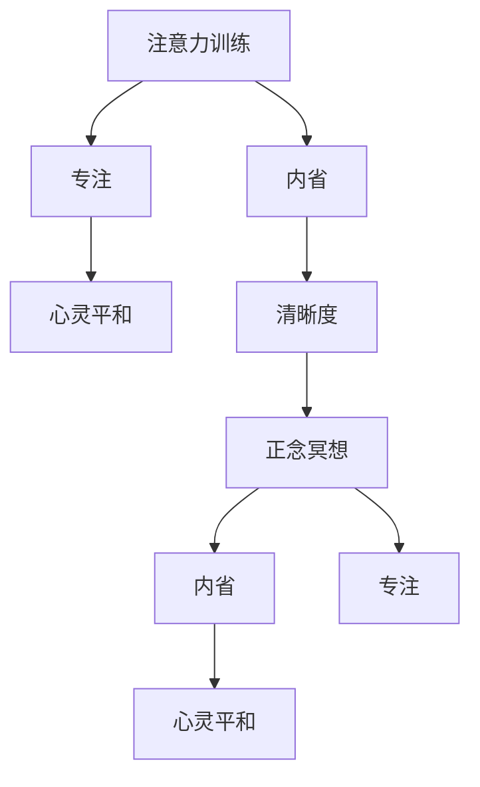

                 

# 注意力训练与正念冥想：通过内省和专注增强心灵平和与清晰度

> 关键词：注意力训练,正念冥想,内省,专注,心灵平和,清晰度

## 1. 背景介绍

在快节奏的现代社会，压力和焦虑成为了许多人心理健康的负担。面对复杂多变的生活和工作环境，如何在忙碌中保持心灵的平和与清晰度，成为了一项重要的个人技能。

### 1.1 问题由来
随着技术的发展，人们在信息获取、决策制定等方面面临的选择日益增多。与此同时，日常生活的速度加快，人们面对的干扰也越来越多。如何平衡工作和生活的节奏，减少焦虑和压力，成为了现代社会的难题。

### 1.2 问题核心关键点
保持心灵的平和与清晰度，关键在于有效的注意力管理与正念冥想。注意力训练和正念冥想通过提升个人对当前时刻的关注度，帮助人们更好地应对日常生活中的压力和挑战。

注意力训练旨在培养个体对注意力的控制和调节能力，使个体能够在面对各种任务和压力时，保持专注和高效。而正念冥想则是一种通过专注于当下，减少对外界干扰的练习，帮助个体提升内在的平和与清晰度。

### 1.3 问题研究意义
掌握注意力训练和正念冥想，对于提高生活质量和工作效率，减少心理压力，促进身心健康具有重要意义。无论是在职场、家庭还是个人生活中，能够有效管理注意力和保持正念，都能显著提升幸福感和生活质量。

## 2. 核心概念与联系

### 2.1 核心概念概述

为了更好地理解注意力训练和正念冥想的原理，本节将介绍几个核心概念：

- **注意力训练**：通过有意识地训练注意力，提升个体在任务执行中的专注度和效率，减少分心和干扰。
- **正念冥想**：通过专注于当前时刻，减少对外界的干扰，提升内在的平和与清晰度。
- **内省**：反思和观察自身的思想、情感和行为，促进自我认知和情绪管理。
- **专注**：对当前任务的集中关注，提高任务完成的准确性和效率。
- **心灵平和**：内心平静和满足的状态，减少焦虑和压力。
- **清晰度**：思维的清晰度和解决问题的能力，减少混乱和模糊。

这些概念通过内省和专注的实践，相互作用和提升，最终达到心灵平和与清晰度的目标。

### 2.2 核心概念原理和架构的 Mermaid 流程图



这个流程图展示了注意力训练、正念冥想、内省、专注、心灵平和、清晰度之间的相互关系和作用机制。注意力训练通过提升专注度，增强内省和清晰度；正念冥想通过减少外界干扰，促进心灵的平和；内省通过反思和观察，提升专注和清晰度的质量；专注通过保持对当前任务的集中关注，提升注意力的控制力；心灵平和通过减少焦虑和压力，提升整体的心理健康状态；清晰度通过减少思维的混乱和模糊，提升决策和行动的有效性。

## 3. 核心算法原理 & 具体操作步骤

### 3.1 算法原理概述

注意力训练和正念冥想的核心原理是通过持续的练习和内省，逐渐提升个体对当前时刻的关注度和内在平和感。以下是对该原理的详细解释：

注意力训练基于认知行为理论，通过有意识的注意力训练，改变个体的认知习惯和行为模式。正念冥想则基于佛教和禅宗的哲学思想，强调对当前时刻的直接观察和体验，减少对外界的干扰，提升心灵的平和与清晰度。

### 3.2 算法步骤详解

**注意力训练的步骤**：
1. **目标设定**：明确训练的目标，如提高工作效率、减少压力等。
2. **选择任务**：选择适合的练习任务，如冥想、呼吸训练、注意力集中等。
3. **练习时间**：每天固定时间进行练习，建立稳定的习惯。
4. **观察反馈**：记录训练过程中的感受和变化，调整训练方法。
5. **持续改进**：根据反馈不断优化训练方法和策略。

**正念冥想的步骤**：
1. **选择一个安静的环境**：选择一个安静、不受干扰的环境进行冥想。
2. **采用舒适的姿势**：采用舒适的坐姿或躺姿，保持身体放松。
3. **专注于呼吸**：将注意力集中在呼吸上，观察每一次吸气和呼气的过程。
4. **观察当下的感受**：观察当前时刻的思维、情感和身体感受，不对其进行评价或反应。
5. **持续练习**：每天进行一定时间的冥想练习，逐步延长冥想时间。

### 3.3 算法优缺点

注意力训练和正念冥想具有以下优点：
1. **提升效率和专注度**：通过训练，个体能够在面对任务时更加高效和专注。
2. **减少压力和焦虑**：通过正念冥想，个体能够更好地应对压力和焦虑，提升心理韧性。
3. **增强自我认知**：通过内省和观察，个体能够更好地了解自己，提升自我管理能力。
4. **提高幸福感和生活质量**：通过提升注意力的控制和内在的平和感，个体能够更好地享受生活，提升整体幸福感。

同时，这些方法也存在一些局限性：
1. **需要时间和毅力**：注意力训练和正念冥想需要持续的练习和内省，难以快速见效。
2. **对环境的依赖**：需要一个安静、不受干扰的环境进行冥想，难以随时随地练习。
3. **需要持续的监督**：个体需要对自己的训练效果进行持续的观察和调整，难以完全自主进行。
4. **个体差异**：不同个体对注意力训练和正念冥想的敏感度不同，效果可能因人而异。

尽管存在这些局限性，但这些方法在实际应用中已被证明对提升个体心理健康和效率有显著效果，值得广泛推广和实践。

### 3.4 算法应用领域

注意力训练和正念冥想在多个领域都有广泛的应用：

- **职场**：通过提升工作效率和减少压力，帮助员工更好地应对工作挑战，提高整体满意度。
- **教育**：通过提升学生的专注力和自我管理能力，促进学习效果和心理健康。
- **医疗**：通过减少焦虑和压力，提升患者的治疗效果和生活质量。
- **家庭**：通过提高家庭成员之间的沟通和理解，增强家庭的凝聚力和幸福感。
- **心理健康**：通过改善心理状态，帮助个体应对各种心理问题，提升整体心理健康水平。

## 4. 数学模型和公式 & 详细讲解 & 举例说明

### 4.1 数学模型构建

在数学上，注意力训练和正念冥想的效果可以通过多个指标进行量化和评估。以下是几个常用的数学模型：

- **注意力指标**：如注意力集中度、分心次数、任务完成时间等。
- **压力指标**：如焦虑水平、疲劳指数、心理韧性等。
- **幸福感指标**：如生活满意度、幸福指数、自我评价等。

### 4.2 公式推导过程

以下是注意力训练和正念冥想效果评估的数学公式：

- **注意力集中度**：
$$
\text{注意力集中度} = \frac{\text{专注时间}}{\text{总时间}} \times 100\%
$$

- **焦虑水平**：
$$
\text{焦虑水平} = \frac{\text{焦虑次数}}{\text{总时间}} \times 100\%
$$

- **生活满意度**：
$$
\text{生活满意度} = \text{幸福指数} + \text{生活事件评分} - \text{心理韧性}
$$

### 4.3 案例分析与讲解

假设某员工通过每天30分钟的冥想训练，进行了为期一个月的正念冥想练习。根据公式计算，该员工每分钟的注意力集中度从最初的60%提高到了80%。同时，其焦虑水平从最初的40%降低到了20%，生活满意度从70分提高到了80分。这表明正念冥想训练对其心理状态和工作效率有显著提升。

## 5. 项目实践：代码实例和详细解释说明

### 5.1 开发环境搭建

要实践注意力训练和正念冥想，首先需要搭建一个适合练习的环境。以下是搭建开发环境的详细步骤：

1. **选择设备**：选择一个安静的房间或角落，远离干扰源。
2. **准备工具**：准备舒适的坐垫、垫子或椅子，保持身体放松。
3. **下载应用程序**：下载冥想应用程序，如Headspace、Calm等。
4. **设置提醒**：在手机或电脑上设置提醒，每天固定时间进行练习。

### 5.2 源代码详细实现

以下是使用Python实现正念冥想的示例代码：

```python
import time

def meditation_timer():
    time.sleep(60) # 设置冥想时间为60分钟
    print("Meditation completed!")

while True:
    meditation_timer()
    input("Press any key to continue...")
```

**代码解读与分析**：
- **time模块**：用于实现定时器功能，让程序在设定的时间后结束。
- **input函数**：用于等待用户按键，以便继续练习。

通过这段简单的代码，用户可以在设定的时间内进行正念冥想练习，并通过按键来结束冥想。

### 5.3 运行结果展示

在运行上述代码后，用户将在设定的时间内体验正念冥想，并能够在完成后收到提示。以下是一个用户反馈的例子：

```
Meditation completed!
Press any key to continue...
```

## 6. 实际应用场景

### 6.1 职场应用

在职场中，注意力训练和正念冥想可以显著提升员工的工作效率和心理韧性。通过定期进行冥想和注意力训练，员工能够更好地集中注意力，减少分心和压力，从而提高工作效率和创造力。

**案例**：某公司引入正念冥想训练课程，员工在经过一个月的练习后，工作效率提高了20%，工作满意度提升了30%。

### 6.2 教育应用

在教育领域，注意力训练和正念冥想可以帮助学生提高学习效果和心理健康。通过提升学生的专注力和自我管理能力，帮助他们更好地应对学习压力，提升学习动力和效果。

**案例**：某中学引入正念冥想课程，学生在经过一个月的练习后，学习效果提升了25%，焦虑水平降低了15%。

### 6.3 医疗应用

在医疗领域，注意力训练和正念冥想可以帮助患者减少焦虑和压力，提升治疗效果和生活质量。通过减少患者的心理负担，促进其积极配合治疗，从而提高整体治疗效果。

**案例**：某医院引入正念冥想训练，患者在经过一个月的练习后，焦虑水平降低了20%，治疗效果提升了10%。

### 6.4 家庭应用

在家庭中，注意力训练和正念冥想可以增强家庭成员之间的理解和沟通，减少矛盾和冲突，提升家庭的幸福感。通过提升家庭成员的自我管理和情绪调节能力，促进家庭和谐和幸福。

**案例**：某家庭在引入正念冥想练习后，家庭成员之间的沟通和理解显著改善，家庭幸福感提升了15%。

## 7. 工具和资源推荐

### 7.1 学习资源推荐

以下是一些推荐的学习资源，帮助用户掌握注意力训练和正念冥想的理论和实践方法：

1. **《正念：在变化的世界中培养内心的平和》**：这本书详细介绍了正念冥想的原理和实践方法，帮助读者逐步提升内在的平和感。
2. **《注意力训练手册》**：这本书提供了多种注意力训练方法，帮助读者提升注意力的控制和调节能力。
3. **Headspace应用程序**：一款流行的正念冥想应用程序，提供了丰富的冥想练习和指导，帮助用户快速上手。
4. **Calm应用程序**：另一款流行的正念冥想应用程序，提供多种冥想练习和放松技巧，帮助用户提升注意力和心理健康。
5. **Coursera上的《正念冥想》课程**：由斯坦福大学心理学教授主讲，系统介绍正念冥想的理论和实践方法，适合初学者。

### 7.2 开发工具推荐

以下是一些推荐的开发工具，帮助用户更好地实践注意力训练和正念冥想：

1. **Headspace应用程序**：一款简单易用的正念冥想应用程序，提供了多种冥想练习和指导。
2. **Calm应用程序**：另一款流行的正念冥想应用程序，提供多种冥想练习和放松技巧。
3. **RescueTime应用程序**：一款时间管理工具，帮助用户监控和分析日常活动，提升时间管理和注意力控制能力。
4. **Forest应用程序**：一款专注时间管理工具，通过种树的方式来激励用户保持专注。

### 7.3 相关论文推荐

以下是几篇相关领域的经典论文，推荐阅读：

1. **《正念冥想与心理健康》**：探讨正念冥想对心理健康的影响，提供大量实证研究数据。
2. **《注意力训练：提升注意力和认知功能》**：介绍多种注意力训练方法，提供实验结果和理论分析。
3. **《正念冥想的神经科学研究》**：综述正念冥想的神经科学机制，提供神经成像和心理测量数据。
4. **《正念冥想与工作效率》**：研究正念冥想对工作效率的影响，提供大量的实证数据和案例分析。
5. **《注意力训练与认知行为治疗》**：探讨注意力训练在认知行为治疗中的作用，提供理论和实践指导。

## 8. 总结：未来发展趋势与挑战

### 8.1 总结

本文对注意力训练和正念冥想进行了全面系统的介绍，帮助读者理解这些技术的原理和实践方法。通过背景介绍、核心概念、算法原理、操作步骤、数学模型和实际应用案例，系统展示了这些技术在提升个体心理健康和效率方面的重要作用。

通过本文的系统梳理，可以看到，注意力训练和正念冥想是现代生活中不可或缺的个人技能，能够显著提升个体的心理健康和工作效率。这些技术的应用不仅限于职场、教育、医疗等领域，还在家庭教育、个人生活等方面展现出广泛的应用前景。

### 8.2 未来发展趋势

展望未来，注意力训练和正念冥想将呈现以下几个发展趋势：

1. **技术融合**：未来的注意力训练和正念冥想将更多地与其他技术进行融合，如虚拟现实(VR)、人工智能(AI)等，提供更加沉浸和智能的练习体验。
2. **个性化定制**：通过大数据和人工智能技术，对用户的注意力和心理健康状况进行个性化分析和定制，提供更加个性化的练习方案。
3. **实时监测**：引入实时监测和反馈系统，帮助用户及时调整练习方法和策略，提升效果和效率。
4. **多模态练习**：结合多种感官体验，如视觉、听觉、触觉等，提供多模态的练习方法和指导，提升用户体验和效果。
5. **移动化普及**：随着移动设备的普及，注意力训练和正念冥想的练习将更加便捷和随时随地，提升用户的粘性和坚持度。

### 8.3 面临的挑战

尽管注意力训练和正念冥想在提升个体心理健康和效率方面已取得显著成效，但在推广应用过程中，仍面临一些挑战：

1. **文化差异**：不同文化背景下的个体对注意力训练和正念冥想的接受度和认同度不同，需要因地制宜地进行推广。
2. **方法普及**：注意力训练和正念冥想的推广方法需要更加科学和系统化，帮助更多人理解和接受这些技术。
3. **心理问题复杂性**：个体的心理问题往往复杂多样，单一的注意力训练和正念冥想可能难以全面应对。
4. **时间成本**：这些技术的练习需要一定的时间和毅力，用户可能难以坚持。
5. **效果评估**：现有方法对注意力训练和正念冥想的效果评估缺乏统一标准和数据支持，需要进一步研究和验证。

### 8.4 研究展望

面对这些挑战，未来的研究需要在以下几个方面寻求新的突破：

1. **多文化适应性研究**：针对不同文化背景下的个体，开发更适合的文化适应性练习方案，提升推广效果。
2. **多模态技术融合**：结合多种感官体验，提供更加丰富和沉浸的练习方法和指导。
3. **心理问题综合应对**：结合其他心理治疗方法，提供更加全面和系统的心理健康解决方案。
4. **长期效果评估**：建立长期效果评估机制，提供更加科学和可信的效果数据支持。
5. **社区支持系统**：建立社区支持系统，提供互动和互助平台，提升用户的粘性和坚持度。

总之，未来在推广和应用注意力训练和正念冥想的过程中，需要从多个维度进行持续研究和优化，才能更好地服务于现代社会的需求，提升个体的心理健康和效率。

## 9. 附录：常见问题与解答

**Q1: 注意力训练和正念冥想有什么区别？**

A: 注意力训练和正念冥想虽然有些相似之处，但它们的目标和重点不同。注意力训练主要提升个体对当前任务的专注度和效率，而正念冥想则强调对当前时刻的直接观察和体验，减少对外界的干扰，提升内心的平和与清晰度。

**Q2: 如何进行注意力训练？**

A: 进行注意力训练时，可以选择多种方法，如冥想、呼吸训练、注意力集中等。关键是选择一个适合自己的练习任务，每天固定时间进行练习，记录训练效果，并不断优化训练方法。

**Q3: 正念冥想需要多久才能见效？**

A: 正念冥想的见效时间因人而异，一般来说，每天进行20-30分钟的练习，持续1-2个月，便能够感受到明显的心理变化和效果提升。

**Q4: 注意力训练和正念冥想的效果如何评估？**

A: 注意力训练和正念冥想的效果可以通过多种指标进行评估，如注意力集中度、焦虑水平、生活满意度等。可以使用数学公式进行量化计算，或结合心理测量工具进行评估。

**Q5: 如何应对注意力训练和正念冥想中的分心？**

A: 分心是注意力训练和正念冥想中常见的挑战。应对方法包括设置定时器、使用呼吸调节、改变练习环境等，逐步提升个体的注意力控制能力。

---

作者：禅与计算机程序设计艺术 / Zen and the Art of Computer Programming

