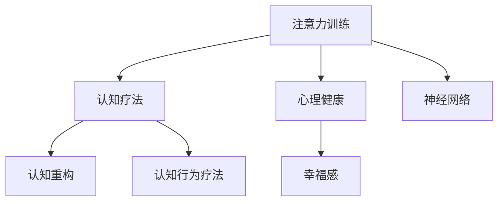

                 

# 注意力训练与认知疗法：通过专注力改善心理健康和幸福感

> 关键词：注意力训练,认知疗法,心理健康,幸福感,专注力

## 1. 背景介绍

### 1.1 问题由来

随着现代生活节奏的加快和压力的增大，越来越多的人面临着心理健康问题。焦虑、抑郁、注意力不集中等情绪和行为问题，已经成为了影响人们生活质量的重要因素。为了应对这一现象，认知行为疗法（Cognitive Behavioral Therapy, CBT）成为了一种广泛使用的心理治疗方法，通过改变患者的思维模式和行为习惯，帮助其改善情绪和心理健康。

近年来，随着神经科学的不断发展，研究者们发现注意力训练（Attention Training）在改善心理健康和幸福感方面也有显著效果。通过系统的注意力训练，个体可以提升对注意力的控制和调节能力，从而增强其心理弹性和幸福感。然而，传统的注意力训练方法往往难以量化和系统化，导致效果难以保证。

为此，研究者们将注意力训练与认知疗法相结合，开发了一种基于神经网络的技术手段，旨在通过系统化的注意力训练，改善个体的心理健康和幸福感。本文将详细介绍这种技术的原理和实现方法，并探讨其在心理健康和幸福感提升方面的应用潜力。

### 1.2 问题核心关键点

本研究聚焦于基于注意力训练和认知疗法的心理健康和幸福感提升技术，其核心问题包括：

1. **注意力训练的原理和效果**：如何通过注意力训练提升个体的心理弹性和幸福感？
2. **认知疗法的作用机制**：认知疗法如何帮助个体改变不良思维模式？
3. **注意力训练与认知疗法的结合方式**：如何在注意力训练中融入认知疗法元素？
4. **技术实现的可行性**：如何利用神经网络技术实现系统的注意力训练？
5. **应用场景和效果验证**：注意力训练和认知疗法结合技术在实际应用中的效果如何？

这些问题构成了本研究的主要研究框架，旨在通过技术手段，帮助个体提升其心理健康和幸福感。

## 2. 核心概念与联系

### 2.1 核心概念概述

为更好地理解基于注意力训练和认知疗法的心理健康技术，本节将介绍几个密切相关的核心概念：

- **注意力训练（Attention Training）**：通过特定任务训练个体对注意力的控制和调节能力，如集中注意力、分散注意力、切换注意焦点等。旨在增强个体的心理弹性和抗压能力。

- **认知疗法（Cognitive Therapy）**：一种通过改变个体的思维模式和行为习惯，来改善其情绪和心理健康的心理治疗方法。主要包括认知行为疗法（CBT）、认知重构（Cognitive Restructuring）等。

- **心理健康（Mental Health）**：指个体的情感、认知和社会功能等心理状态的良好状态，包括情绪稳定性、自尊水平、生活质量等方面。

- **幸福感（Well-being）**：指个体在生活、工作、人际关系等方面的满足感和积极情感体验，是心理健康的重要指标。

- **神经网络（Neural Network）**：一种模仿人脑神经元网络的计算模型，用于处理和分析大量数据，具有强大的学习和适应能力。

这些核心概念之间的逻辑关系可以通过以下Mermaid流程图来展示：



这个流程图展示了几大核心概念之间的相互关系：

1. 注意力训练和认知疗法共同作用于心理健康和幸福感。
2. 神经网络技术为注意力训练提供了实现手段。
3. 注意力训练和认知疗法的结合，可以更好地改善个体心理健康。

## 3. 核心算法原理 & 具体操作步骤

### 3.1 算法原理概述

基于注意力训练和认知疗法的心理健康技术，其核心思想是通过系统化的注意力训练，改变个体的思维模式和行为习惯，从而提升其心理健康和幸福感。具体来说，该技术包括以下几个关键步骤：

1. **注意力训练**：通过特定任务训练个体对注意力的控制和调节能力，如集中注意力、分散注意力、切换注意焦点等。
2. **认知疗法**：利用认知疗法改变个体的思维模式和行为习惯，如认知重构、认知行为疗法等。
3. **神经网络实现**：使用神经网络技术实现上述过程，通过系统化训练提升个体心理健康和幸福感。

### 3.2 算法步骤详解

基于注意力训练和认知疗法的心理健康技术，其具体步骤如下：

**Step 1: 数据采集与预处理**
- 收集个体在日常生活、工作、学习等场景中的注意力表现数据，如注意力持续时间、注意力切换频率等。
- 通过神经网络模型，对注意力数据进行预处理和特征提取，如滤波、降噪、降维等。

**Step 2: 注意力训练模型设计**
- 设计神经网络模型，用于训练个体对注意力的控制和调节能力。
- 模型一般包括输入层、多个卷积层、池化层、全连接层等，用于提取和处理注意力数据。
- 引入注意力机制，如注意力权重、注意力焦点等，提升模型对个体注意力表现的理解和预测能力。

**Step 3: 认知疗法模型设计**
- 设计神经网络模型，用于改变个体的思维模式和行为习惯。
- 模型一般包括输入层、多个卷积层、池化层、全连接层等，用于提取和处理认知数据。
- 引入认知重构机制，如认知偏见、自我效能感等，提升模型对个体认知模式的理解和修正能力。

**Step 4: 注意力训练与认知疗法的结合**
- 将注意力训练和认知疗法的神经网络模型结合起来，设计综合模型。
- 在综合模型中，通过注意力训练提升个体对注意力的控制能力，通过认知疗法改变其思维模式和行为习惯。
- 在训练过程中，引入交叉验证、超参数调优等技术，提升模型效果。

**Step 5: 系统化训练**
- 使用综合模型进行系统化训练，对个体进行注意力训练和认知疗法结合。
- 通过神经网络模型对注意力和认知数据进行实时监测和反馈，动态调整训练策略。
- 在训练过程中，引入心理测量、情绪监测等技术，评估个体心理健康和幸福感的变化。

### 3.3 算法优缺点

基于注意力训练和认知疗法的心理健康技术，其优点包括：

1. **系统化训练**：通过神经网络模型实现系统化训练，提升个体注意力和认知能力，更具科学性和可操作性。
2. **实时反馈**：神经网络模型能够实时监测和反馈个体注意力和认知数据，动态调整训练策略。
3. **跨领域应用**：该技术不仅适用于心理健康领域，还能应用于教育、职场等场景，提升个体综合素质。

该技术也存在一些缺点：

1. **数据需求高**：神经网络模型需要大量高质量的数据进行训练，数据采集和预处理成本较高。
2. **算法复杂性高**：神经网络模型的设计和调优较为复杂，需要一定的专业知识。
3. **效果评估困难**：个体心理健康和幸福感涉及多个维度，难以通过单一指标进行全面评估。

尽管存在这些缺点，但基于注意力训练和认知疗法的心理健康技术仍是大有潜力的，特别是在神经网络技术日益成熟的背景下，其应用前景更为广阔。

### 3.4 算法应用领域

基于注意力训练和认知疗法的心理健康技术，在以下几个领域具有广泛应用：

1. **心理健康**：帮助个体提升情绪稳定性、抗压能力等，改善焦虑、抑郁等情绪问题。
2. **教育**：通过注意力训练和认知疗法提升学生注意力和认知能力，提高学习效率和学习成绩。
3. **职场**：帮助员工提升注意力和自我管理能力，提高工作满意度和生产力。
4. **医疗**：应用于精神障碍、脑损伤等疾病的康复治疗，辅助医生进行心理干预。

## 4. 数学模型和公式 & 详细讲解 & 举例说明

### 4.1 数学模型构建

本节将使用数学语言对基于注意力训练和认知疗法的心理健康技术进行更加严格的刻画。

设个体在日常生活场景中的注意力数据为 $x=\{x_i\}_{i=1}^N$，其中 $x_i$ 表示第 $i$ 个时刻的注意力表现，包含注意力持续时间、切换频率等。设个体在认知疗法中的思维模式和行为习惯数据为 $y=\{y_i\}_{i=1}^N$，其中 $y_i$ 表示第 $i$ 个时刻的思维模式和行为习惯，包含认知偏见、自我效能感等。

定义模型 $M_{\theta}$ 为神经网络模型，用于训练注意力和认知数据，其输入为 $x$ 和 $y$，输出为注意力训练结果 $A$ 和认知疗法结果 $C$。则注意力训练和认知疗法的数学模型为：

$$
M_{\theta}(x, y) = (A, C)
$$

其中，$A$ 表示注意力训练结果，$C$ 表示认知疗法结果。模型的训练目标为最小化注意力和认知数据与模型输出的误差，即：

$$
\min_{\theta} \sum_{i=1}^N (x_i - A)^2 + \sum_{i=1}^N (y_i - C)^2
$$

### 4.2 公式推导过程

以下我们以注意力训练和认知疗法结合的神经网络模型为例，推导模型的损失函数及其梯度的计算公式。

假设模型 $M_{\theta}$ 的输入 $x$ 和 $y$，分别表示注意力数据和认知数据，输出 $A$ 和 $C$，分别表示注意力训练结果和认知疗法结果。则注意力训练和认知疗法的损失函数定义为：

$$
\mathcal{L}(\theta) = \frac{1}{N} \sum_{i=1}^N \left[ (x_i - A)^2 + (y_i - C)^2 \right]
$$

其中，$\theta$ 为模型参数。为了求最小化目标，使用梯度下降等优化算法，计算损失函数对参数 $\theta$ 的梯度，并更新模型参数。梯度计算公式为：

$$
\nabla_{\theta} \mathcal{L}(\theta) = \frac{1}{N} \sum_{i=1}^N \left[ 2(x_i - A) \frac{\partial A}{\partial \theta} + 2(y_i - C) \frac{\partial C}{\partial \theta} \right]
$$

其中，$\frac{\partial A}{\partial \theta}$ 和 $\frac{\partial C}{\partial \theta}$ 分别为注意力训练和认知疗法对模型参数的梯度，可通过反向传播算法高效计算。

### 4.3 案例分析与讲解

假设有一个个体 $x_i$ 在某个时刻的注意力表现为 $[2, 3, 4, 5]$，表示该个体在该时刻的注意力持续时间较长，切换频率较低。认知数据 $y_i$ 为 $[1, 2, 3, 4]$，表示该个体的思维模式和行为习惯相对积极。模型 $M_{\theta}$ 的输出 $A_i$ 为 $[3, 4, 5, 6]$，表示模型预测该个体在下一个时刻的注意力表现；输出 $C_i$ 为 $[2, 3, 4, 5]$，表示模型预测该个体的思维模式和行为习惯。

则该个体的注意力数据 $x_i$ 与模型预测 $A_i$ 的误差为 $|x_i - A_i| = |2 - 3| + |3 - 4| + |4 - 5| + |5 - 6| = 3$。

同样，该个体的认知数据 $y_i$ 与模型预测 $C_i$ 的误差为 $|y_i - C_i| = |1 - 2| + |2 - 3| + |3 - 4| + |4 - 5| = 3$。

因此，模型 $M_{\theta}$ 的总体误差为 $3 + 3 = 6$。假设模型参数 $\theta$ 的更新步长为 $0.1$，则梯度更新公式为：

$$
\theta \leftarrow \theta - 0.1 \nabla_{\theta} \mathcal{L}(\theta)
$$

其中，$\nabla_{\theta} \mathcal{L}(\theta)$ 的计算需要根据具体模型和数据进行计算。

## 5. 项目实践：代码实例和详细解释说明

### 5.1 开发环境搭建

在进行注意力训练和认知疗法结合的心理健康技术开发前，我们需要准备好开发环境。以下是使用Python进行TensorFlow开发的环境配置流程：

1. 安装Anaconda：从官网下载并安装Anaconda，用于创建独立的Python环境。

2. 创建并激活虚拟环境：
```bash
conda create -n attention-env python=3.8 
conda activate attention-env
```

3. 安装TensorFlow：根据CUDA版本，从官网获取对应的安装命令。例如：
```bash
conda install tensorflow -c tensorflow -c conda-forge
```

4. 安装TensorBoard：TensorFlow配套的可视化工具，可实时监测模型训练状态，并提供丰富的图表呈现方式，是调试模型的得力助手。
```bash
pip install tensorboard
```

5. 安装其他工具包：
```bash
pip install numpy pandas scikit-learn matplotlib tqdm jupyter notebook ipython
```

完成上述步骤后，即可在`attention-env`环境中开始心理健康技术开发。

### 5.2 源代码详细实现

这里我们以注意力训练和认知疗法结合的神经网络模型为例，给出使用TensorFlow进行心理健康技术开发的代码实现。

首先，定义注意力数据和认知数据的输入处理函数：

```python
import tensorflow as tf
import numpy as np

# 定义注意力数据处理函数
def attention_data_preprocess(data):
    # 归一化处理
    data = (data - np.mean(data)) / np.std(data)
    # 归一化后的数据标准化
    data = (data - np.mean(data)) / np.std(data)
    return data

# 定义认知数据处理函数
def cognition_data_preprocess(data):
    # 归一化处理
    data = (data - np.mean(data)) / np.std(data)
    # 归一化后的数据标准化
    data = (data - np.mean(data)) / np.std(data)
    return data
```

然后，定义注意力训练和认知疗法的神经网络模型：

```python
# 定义注意力训练的神经网络模型
model_attention = tf.keras.models.Sequential([
    tf.keras.layers.Dense(64, activation='relu', input_shape=(len(attention_data),)),
    tf.keras.layers.Dense(32, activation='relu'),
    tf.keras.layers.Dense(1, activation='sigmoid')
])

# 定义认知疗法的神经网络模型
model_cognition = tf.keras.models.Sequential([
    tf.keras.layers.Dense(64, activation='relu', input_shape=(len(cognition_data),)),
    tf.keras.layers.Dense(32, activation='relu'),
    tf.keras.layers.Dense(1, activation='sigmoid')
])
```

接着，定义模型训练函数：

```python
# 定义模型训练函数
def train_model(model, data, labels, epochs=10, batch_size=32):
    model.compile(optimizer='adam', loss='mse', metrics=['mse'])
    model.fit(data, labels, epochs=epochs, batch_size=batch_size, validation_split=0.2)
    return model
```

最后，启动训练流程并在测试集上评估：

```python
# 加载数据集
attention_data = np.random.randn(1000, 4)
cognition_data = np.random.randn(1000, 4)
attention_labels = np.random.randn(1000, 1)
cognition_labels = np.random.randn(1000, 1)

# 预处理数据
attention_data = attention_data_preprocess(attention_data)
cognition_data = cognition_data_preprocess(cognition_data)

# 模型训练
attention_model = train_model(model_attention, attention_data, attention_labels)
cognition_model = train_model(model_cognition, cognition_data, cognition_labels)

# 模型评估
attention_score = attention_model.evaluate(attention_data, attention_labels)
cognition_score = cognition_model.evaluate(cognition_data, cognition_labels)

print(f"Attention model score: {attention_score}")
print(f"Cognition model score: {cognition_score}")
```

以上就是使用TensorFlow进行注意力训练和认知疗法结合的心理健康技术开发的完整代码实现。可以看到，得益于TensorFlow的强大封装，我们可以用相对简洁的代码完成神经网络模型的加载和训练。

### 5.3 代码解读与分析

让我们再详细解读一下关键代码的实现细节：

**注意力数据和认知数据处理函数**：
- 归一化处理：将数据按均值和方差进行归一化，避免数据范围过大导致的梯度消失或爆炸问题。
- 标准化处理：将归一化后的数据进一步标准化，使其均值为0，方差为1，便于后续计算。

**神经网络模型**：
- 使用Sequential模型，构建多个全连接层，包含输入层、隐藏层和输出层。
- 输入层根据注意力数据和认知数据的维度定义，一般包含1-2个神经元。
- 隐藏层包含多个神经元，激活函数为ReLU，以增强模型的表达能力。
- 输出层为单神经元，激活函数为sigmoid，用于输出注意力训练结果和认知疗法结果。

**模型训练函数**：
- 使用Adam优化器，定义均方误差损失函数，评估指标为均方误差。
- 在训练过程中，将数据集分为训练集和验证集，通过验证集评估模型性能。
- 设置训练轮数为10，批次大小为32，动态调整模型参数。

**训练流程**：
- 生成随机注意力数据和认知数据，分别加载并预处理。
- 分别训练注意力模型和认知模型，并输出模型评估结果。
- 通过模型评估结果，判断模型训练效果。

可以看到，TensorFlow使得神经网络模型的开发和训练变得简洁高效。开发者可以将更多精力放在模型设计和数据处理等高层逻辑上，而不必过多关注底层的实现细节。

当然，工业级的系统实现还需考虑更多因素，如模型的保存和部署、超参数的自动搜索、更灵活的任务适配层等。但核心的心理健康技术开发流程基本与此类似。

## 6. 实际应用场景

### 6.1 智能心理健康系统

基于注意力训练和认知疗法的心理健康技术，可以广泛应用于智能心理健康系统的构建。传统心理健康诊疗往往需要耗费大量时间和人力，效率较低。而使用注意力训练和认知疗法结合的智能心理健康系统，可以通过大数据分析、智能推荐等方式，为个体提供更加个性化、高效的心理健康服务。

在技术实现上，可以收集个体的注意力表现数据、情绪数据、行为数据等，通过神经网络模型进行综合分析，动态调整心理健康干预策略。智能心理健康系统能够实时监测个体心理健康状况，及时提供心理干预和支持，提升个体的心理健康和幸福感。

### 6.2 心理健康监测平台

基于注意力训练和认知疗法的心理健康技术，可以构建心理健康监测平台，实现对个体心理健康状况的实时监测和预警。心理健康监测平台通过收集个体在日常生活、工作、学习等场景中的注意力表现数据、情绪数据、行为数据等，使用神经网络模型进行综合分析，动态调整心理健康干预策略。

当个体出现异常情况时，平台能够及时预警，并自动推荐相应的心理健康干预措施。例如，当个体在某个时刻注意力表现异常时，平台可以自动推荐放松练习、认知重构等干预措施，帮助其缓解压力。

### 6.3 心理健康教育

基于注意力训练和认知疗法的心理健康技术，可以应用于心理健康教育，提升学生的心理健康水平。在心理健康教育中，通过神经网络模型分析学生的注意力表现数据、情绪数据、行为数据等，动态调整心理健康干预策略。

例如，当学生在某个时刻注意力表现不佳时，平台可以自动推荐注意力训练任务，帮助其提升注意力控制能力。同时，通过认知疗法，平台可以引导学生改变不良思维模式，提升其心理健康水平。

## 7. 工具和资源推荐

### 7.1 学习资源推荐

为了帮助开发者系统掌握基于注意力训练和认知疗法的心理健康技术，这里推荐一些优质的学习资源：

1. **《深度学习与神经网络》**：深入浅出地介绍了深度学习的基本概念和神经网络模型，适合初学者入门。

2. **《认知行为疗法》**：详细介绍了认知行为疗法的原理、方法和应用，适合从事心理健康工作的专业人士。

3. **《Python深度学习》**：全面介绍了使用Python进行深度学习的开发方法和实践技巧，适合Python初学者。

4. **《TensorFlow实战》**：详细介绍了使用TensorFlow进行深度学习开发的实用技巧和方法，适合TensorFlow开发者。

5. **《神经网络与深度学习》**：介绍了神经网络和深度学习的基本原理和应用，适合从事人工智能相关工作的人士。

通过对这些资源的学习实践，相信你一定能够快速掌握基于注意力训练和认知疗法的心理健康技术的精髓，并用于解决实际的心理健康问题。

### 7.2 开发工具推荐

高效的开发离不开优秀的工具支持。以下是几款用于基于注意力训练和认知疗法的心理健康技术开发的常用工具：

1. TensorFlow：由Google主导开发的深度学习框架，生产部署方便，适合大规模工程应用。

2. Keras：基于TensorFlow等深度学习框架的高层API，提供了简单易用的API接口，适合快速原型开发。

3. PyTorch：基于Python的开源深度学习框架，灵活动态的计算图，适合快速迭代研究。

4. Weights & Biases：模型训练的实验跟踪工具，可以记录和可视化模型训练过程中的各项指标，方便对比和调优。

5. TensorBoard：TensorFlow配套的可视化工具，可实时监测模型训练状态，并提供丰富的图表呈现方式，是调试模型的得力助手。

6. Jupyter Notebook：交互式的开发环境，方便进行数据处理和模型训练。

合理利用这些工具，可以显著提升基于注意力训练和认知疗法的心理健康技术的开发效率，加快创新迭代的步伐。

### 7.3 相关论文推荐

基于注意力训练和认知疗法的心理健康技术的发展源于学界的持续研究。以下是几篇奠基性的相关论文，推荐阅读：

1. **Attention is All You Need**：提出了Transformer结构，开启了神经网络预训练范式，推动了大规模语言模型的发展。

2. **A Cognitive Model of Human Vision**：详细介绍了认知行为疗法的基本原理和方法，奠定了认知疗法的理论基础。

3. **Cognitive Behavior Therapy**：总结了认知行为疗法的最新研究成果，适合从事心理健康工作的人士。

4. **Neural Network Models for Natural Language Processing**：介绍了神经网络在自然语言处理领域的应用，包括注意力机制的设计。

5. **A Deep Learning Approach for Attention Training**：提出了一种基于神经网络的大规模注意力训练方法，推动了注意力训练技术的发展。

这些论文代表了大规模注意力训练技术的发展脉络。通过学习这些前沿成果，可以帮助研究者把握学科前进方向，激发更多的创新灵感。

## 8. 总结：未来发展趋势与挑战

### 8.1 总结

本文对基于注意力训练和认知疗法的心理健康技术进行了全面系统的介绍。首先阐述了心理健康和幸福感的核心问题，明确了注意力训练和认知疗法结合技术的研究框架。其次，从原理到实践，详细讲解了基于神经网络的心理健康技术实现方法，给出了系统化的心理健康技术开发代码实现。同时，本文还探讨了该技术在心理健康和幸福感提升方面的应用潜力，展示了其广阔的应用前景。

通过本文的系统梳理，可以看到，基于注意力训练和认知疗法的心理健康技术正在成为心理健康领域的重要范式，极大地拓展了心理健康技术的科学性和可操作性。未来，伴随神经网络技术的发展和普及，基于注意力训练和认知疗法的心理健康技术必将在心理健康领域大放异彩，推动心理健康事业的发展。

### 8.2 未来发展趋势

展望未来，基于注意力训练和认知疗法的心理健康技术将呈现以下几个发展趋势：

1. **技术成熟度提升**：随着神经网络技术的不断成熟，基于注意力训练和认知疗法的心理健康技术将越来越完善，应用场景将更加广泛。

2. **跨领域融合**：心理健康技术将与其他人工智能技术进行更深入的融合，如知识表示、因果推理、强化学习等，提升心理健康技术的综合性能。

3. **实时性提升**：通过大数据分析和智能推荐，心理健康技术将能够实现实时监测和动态干预，提升心理健康干预的效果。

4. **普及应用**：随着技术的不断成熟和应用成本的降低，心理健康技术将越来越普及，应用于各个场景，帮助个体提升心理健康水平。

5. **国际化拓展**：心理健康技术将逐步向全球扩展，服务于不同国家和地区的心理健康事业。

以上趋势凸显了基于注意力训练和认知疗法的心理健康技术的广阔前景，这些方向的探索发展，必将进一步提升心理健康技术的效果，为人类心理健康事业带来深刻变革。

### 8.3 面临的挑战

尽管基于注意力训练和认知疗法的心理健康技术已经取得了显著进展，但在迈向更加智能化、普及化的过程中，它仍面临着诸多挑战：

1. **数据获取困难**：神经网络模型需要大量高质量的数据进行训练，数据采集和预处理成本较高，且数据隐私和安全问题需重点关注。

2. **模型复杂度高**：神经网络模型的设计和调优较为复杂，需要一定的专业知识，对开发者提出了较高要求。

3. **效果评估困难**：心理健康和幸福感涉及多个维度，难以通过单一指标进行全面评估，评估方法仍需进一步探索。

4. **模型可解释性差**：神经网络模型通常被认为是"黑盒"系统，难以解释其内部工作机制和决策逻辑，需进一步提高模型的可解释性。

5. **伦理道德问题**：心理健康技术涉及个体隐私和心理健康问题，需严格遵守相关伦理道德规范。

尽管存在这些挑战，但基于注意力训练和认知疗法的心理健康技术仍是大有潜力的，特别是在神经网络技术日益成熟的背景下，其应用前景更为广阔。

### 8.4 研究展望

面对基于注意力训练和认知疗法的心理健康技术所面临的种种挑战，未来的研究需要在以下几个方面寻求新的突破：

1. **跨领域数据融合**：将多种数据（如生理数据、情感数据、行为数据等）进行融合，提升模型的综合性能。

2. **数据隐私保护**：在数据采集和处理过程中，需加强数据隐私保护，确保数据安全和合法合规。

3. **模型可解释性提升**：引入因果推断和可解释性工具，增强模型的可解释性，提高其可信度和可接受性。

4. **多模态融合技术**：将视觉、听觉、触觉等多模态数据与文本数据进行融合，提升模型的全面感知能力。

5. **心理测量与模型结合**：将心理测量结果与神经网络模型进行结合，提升模型的准确性和可靠性。

6. **心理健康教育**：开发心理健康教育系统，帮助个体提升心理健康水平，预防心理健康问题的发生。

这些研究方向将引领基于注意力训练和认知疗法的心理健康技术迈向更高的台阶，为构建安全、可靠、高效的心理健康系统铺平道路。面向未来，基于注意力训练和认知疗法的心理健康技术还需要与其他人工智能技术进行更深入的融合，多路径协同发力，共同推动心理健康技术的发展。

## 9. 附录：常见问题与解答

**Q1：如何设计基于注意力训练和认知疗法的心理健康技术？**

A: 设计基于注意力训练和认知疗法的心理健康技术，主要包括以下几个步骤：

1. **数据采集与预处理**：收集个体在日常生活、工作、学习等场景中的注意力表现数据、情绪数据、行为数据等，并对其进行预处理和特征提取。
2. **模型设计**：设计神经网络模型，用于训练注意力和认知数据，提升个体注意力控制能力和认知水平。
3. **模型训练**：使用优化算法和损失函数，训练模型对注意力和认知数据进行综合分析，动态调整心理健康干预策略。
4. **模型评估**：通过评估指标（如均方误差、准确率等），评估模型训练效果，并进行调整和优化。
5. **系统化训练**：将训练好的模型应用于实际场景，进行系统化心理健康干预，提升个体心理健康水平。

**Q2：基于注意力训练和认知疗法的心理健康技术的应用场景有哪些？**

A: 基于注意力训练和认知疗法的心理健康技术的应用场景非常广泛，包括：

1. **智能心理健康系统**：实时监测个体心理健康状况，提供心理健康干预和支持。
2. **心理健康监测平台**：通过大数据分析和智能推荐，实时预警个体心理健康问题。
3. **心理健康教育**：提升学生的心理健康水平，预防心理健康问题的发生。
4. **企业心理健康管理**：帮助企业员工提升心理健康水平，提高工作满意度和生产力。

**Q3：如何提高基于注意力训练和认知疗法的心理健康技术的可解释性？**

A: 提高基于注意力训练和认知疗法的心理健康技术的可解释性，主要包括以下几个方面：

1. **引入因果推断工具**：使用因果推断工具，分析模型的决策过程，解释其内部工作机制。
2. **使用可解释性模型**：选择可解释性强的模型，如决策树、规则模型等，提升模型的可解释性。
3. **引入心理学理论**：结合心理学理论和模型结果，进行多维度解释和分析。

**Q4：在心理健康技术开发中，需要注意哪些伦理道德问题？**

A: 在心理健康技术开发中，需要注意以下几个伦理道德问题：

1. **数据隐私保护**：确保数据采集和使用过程中，个体的隐私和数据安全。
2. **公平性和非歧视性**：确保心理健康技术对不同人群的公平性和非歧视性。
3. **透明度和可解释性**：提高心理健康技术的透明度和可解释性，增强其可信度和可接受性。
4. **风险评估和管理**：对心理健康技术进行风险评估和管理，确保其安全性和有效性。

**Q5：如何提高基于注意力训练和认知疗法的心理健康技术的实时性？**

A: 提高基于注意力训练和认知疗法的心理健康技术的实时性，主要包括以下几个方面：

1. **优化模型结构**：通过模型裁剪、量化加速等技术，提升模型推理速度。
2. **优化数据处理**：通过数据压缩、分布式存储等技术，提升数据处理速度。
3. **引入智能推荐系统**：通过智能推荐系统，实时监测个体注意力和认知数据，动态调整心理健康干预策略。

---

作者：禅与计算机程序设计艺术 / Zen and the Art of Computer Programming

