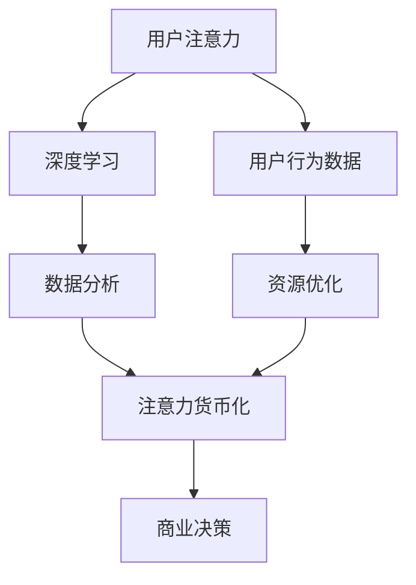

                 

# 注意力货币化策略：AI驱动的关注度经济模型

## 1. 背景介绍

### 1.1 问题由来

在数字化经济时代，数据的价值日益凸显。传统的商业模式在一定程度上已经趋于饱和，如何挖掘数据的潜力，提升品牌影响力和市场竞争力，成为企业和品牌管理者面临的重要挑战。近年来，AI技术的迅猛发展为解决这一问题提供了新的思路：基于AI的注意力货币化策略，通过自动化算法挖掘和利用用户注意力数据，在多场景下创造经济价值。

随着互联网的普及和智能设备的广泛应用，用户的注意力资源愈发分散和碎片化。传统的用户行为分析方法难以有效捕捉这一动态变化，用户体验也越来越受到广告噪音和信息过载的困扰。AI技术的引入，特别是深度学习和大数据分析的融合，为精准识别和利用用户注意力资源提供了新的解决方案。

### 1.2 问题核心关键点

注意力货币化策略的核心在于利用AI算法高效分析用户行为数据，挖掘出用户注意力集中的场景和特征，进而驱动品牌营销决策和资源配置，实现商业价值的最大化。

注意力货币化策略的关键点包括：
- 利用AI模型分析用户行为数据，挖掘出注意力集中点。
- 构建模型进行注意力资源的自动化分配。
- 实施策略以最大化注意力资源的经济价值。
- 在多场景下推广应用，提升品牌市场竞争力。

## 2. 核心概念与联系

### 2.1 核心概念概述

为更好地理解基于AI的注意力货币化策略，本节将介绍几个密切相关的核心概念：

- 注意力货币化(Attention Monetization)：指利用AI算法分析和挖掘用户注意力数据，驱动商业决策，实现经济价值的过程。通过智能算法在正确的时间、正确的地点，向正确的用户展示最相关的信息。

- 用户注意力(Attention)：用户在选择和消费信息产品时所投入的心理和物理资源。主要体现在浏览时间、点击率、购买行为等指标上。注意力资源是品牌营销的重要资产，可以有效衡量用户对品牌的关注程度。

- 深度学习(Deep Learning)：基于神经网络结构，通过多层次数据表示学习模型参数，自动提取特征的机器学习技术。深度学习在大数据处理和复杂模式识别上具有显著优势，能够有效分析用户行为数据。

- 数据分析(Analytics)：通过收集、处理和分析数据，挖掘数据中蕴含的有用信息，为决策提供支持的技术。数据分析与AI深度学习技术相结合，可以提升注意力货币化策略的精准度。

- 资源优化(Optimization)：通过算法优化资源分配，使得有限的注意力资源得到最优利用，提升经济效益。

这些核心概念之间的逻辑关系可以通过以下Mermaid流程图来展示：



这个流程图展示了几大核心概念之间的相互作用：

1. 用户注意力资源通过深度学习技术进行分析，得到用户行为数据。
2. 数据分析技术对用户行为数据进行挖掘，获取有价值的信息。
3. 注意力货币化策略将挖掘出的信息与商业决策结合，实现经济价值的最大化。
4. 资源优化技术优化注意力资源分配，提升经济效益。

这些概念共同构成了AI驱动的注意力货币化策略的理论框架，为品牌和企业在数字化时代实现市场竞争力提供有力支撑。

## 3. 核心算法原理 & 具体操作步骤
### 3.1 算法原理概述

基于AI的注意力货币化策略，其核心在于通过深度学习模型和数据分析技术，实现用户注意力资源的精准挖掘和有效利用。具体而言，算法主要包含以下步骤：

1. **用户行为数据收集**：利用网页浏览记录、社交媒体互动、购物行为记录等数据源，收集用户行为信息。
2. **注意力特征提取**：使用深度学习模型（如卷积神经网络、循环神经网络、Transformer等）对用户行为数据进行处理，提取注意力特征。
3. **注意力分布预测**：通过预测模型对用户注意力进行分布预测，计算用户对不同内容的关注程度。
4. **资源优化分配**：根据注意力分布结果，进行资源优化分配，确定广告投放、内容推荐、营销活动等策略的最佳时机和地点。
5. **商业决策驱动**：将注意力货币化策略与品牌营销活动结合，实施商业决策，驱动销售转化和品牌影响力提升。

### 3.2 算法步骤详解

以广告投放为例，详细说明基于AI的注意力货币化策略的算法步骤：

**Step 1: 用户行为数据收集**
- 通过爬虫技术从不同网站和平台获取用户的浏览记录、点击记录、购买记录等行为数据。
- 将数据进行清洗和预处理，去除噪音和无关数据。

**Step 2: 深度学习特征提取**
- 使用卷积神经网络或Transformer模型对用户行为数据进行特征提取，获取注意力特征向量。
- 对特征向量进行归一化和降维处理，提高计算效率。

**Step 3: 注意力分布预测**
- 将特征向量作为输入，使用深度学习模型进行注意力分布预测，输出用户对不同广告内容的关注程度。
- 将预测结果转化为概率分布，进行可视化和分析。

**Step 4: 资源优化分配**
- 根据注意力分布预测结果，设计广告投放策略。
- 使用强化学习算法进行广告投放优化，找到最优投放策略。
- 结合实时数据反馈，调整广告投放策略，提高广告点击率和转化率。

**Step 5: 商业决策驱动**
- 将广告投放结果与商业指标（如点击率、转化率、成本等）进行关联分析。
- 结合品牌营销目标，调整广告投放策略，提升品牌市场竞争力。
- 实时监测广告投放效果，持续优化注意力货币化策略。

### 3.3 算法优缺点

基于AI的注意力货币化策略具有以下优点：
1. 数据驱动。通过自动化算法挖掘用户注意力数据，可以更精准地捕捉用户行为特征。
2. 动态调整。结合实时数据反馈，动态调整广告投放策略，提高资源利用效率。
3. 高效可扩展。算法适用于大规模数据处理，可以在不同平台上推广应用。
4. 用户友好。通过优化广告和内容推荐，提升用户体验，吸引更多用户关注。

同时，该方法也存在一定的局限性：
1. 数据隐私问题。用户行为数据的收集和使用可能涉及隐私保护问题，需要严格遵守法律法规。
2. 数据噪音干扰。用户行为数据可能存在噪音和偏差，影响模型预测的准确性。
3. 模型复杂性。深度学习模型通常结构复杂，对计算资源和训练数据的要求较高。
4. 模型泛化能力。模型在不同场景下的泛化能力有限，需要不断优化和调整。

尽管存在这些局限性，但就目前而言，基于AI的注意力货币化策略仍是大数据时代实现用户注意力资源高效利用的重要方法。未来相关研究的重点在于如何进一步提高模型的泛化能力，降低数据噪音影响，增强用户隐私保护等。

### 3.4 算法应用领域

基于AI的注意力货币化策略，已经在广告投放、内容推荐、品牌营销等多个领域得到了广泛应用，取得显著的经济效益。

- 广告投放：通过深度学习算法分析用户行为数据，预测用户对广告内容的关注程度，实现精准投放，提高点击率和转化率。
- 内容推荐：利用用户行为数据和深度学习模型，对用户进行兴趣画像，实现个性化推荐，提升用户黏性和满意度。
- 品牌营销：通过注意力货币化策略，对不同营销活动进行自动化资源分配，实现高效营销，提升品牌市场竞争力和市场份额。
- 社交媒体管理：通过分析用户互动数据，优化社交媒体内容发布策略，提升社交媒体影响力和用户参与度。
- 客户服务：通过分析用户服务数据，优化客户服务流程，提升客户满意度和忠诚度。

除了以上应用场景，基于AI的注意力货币化策略还被创新性地应用到更多领域中，如智慧城市管理、智慧交通控制、智慧农业等，为各行各业带来新的变革。

## 4. 数学模型和公式 & 详细讲解
### 4.1 数学模型构建

为便于理解和说明，本文将使用数学语言对注意力货币化策略的算法原理进行更加严谨的描述。

记用户行为数据为 $X$，深度学习模型为 $M$，注意力分布预测模型为 $P$，资源优化模型为 $O$，商业决策模型为 $D$。模型的输入为 $X$，输出为注意力分布 $A$，资源优化策略 $S$，商业决策结果 $C$。

定义注意力货币化策略的优化目标为：

$$
\max_{M,P,O,D} \sum_{i=1}^N C_i(A_i,S_i,D_i)
$$

其中 $N$ 为用户数，$C_i$ 为用户 $i$ 的商业决策结果，$A_i$ 为用户 $i$ 的注意力分布，$S_i$ 为用户 $i$ 的资源优化策略。

### 4.2 公式推导过程

以广告投放为例，下面推导基于深度学习的注意力分布预测模型的公式。

记用户行为数据为 $X$，其中 $X_i=(x_{i1},x_{i2},\cdots,x_{in})$ 为第 $i$ 个用户的第 $n$ 个行为特征。定义广告内容为 $C$，其中 $C_j=(c_{j1},c_{j2},\cdots,c_{jm})$ 为第 $j$ 个广告内容的特征向量。

假设用户 $i$ 对广告内容 $j$ 的关注程度为 $a_{ij}$，则注意力分布预测模型 $P$ 可以表示为：

$$
a_{ij} = M(X_i, C_j) = f(WX_i + b)
$$

其中 $W$ 和 $b$ 为模型参数，$f(\cdot)$ 为非线性激活函数。

广告投放策略 $S$ 可以根据注意力分布预测结果进行优化。假设用户 $i$ 的预算为 $B_i$，则 $S_i$ 可以表示为：

$$
S_i = \max_{j=1,\cdots,m} \frac{a_{ij}}{B_i} C_j
$$

资源优化模型 $O$ 可以根据广告投放策略进行优化，最小化广告投放成本。假设广告 $j$ 的成本为 $C_j$，则 $O$ 可以表示为：

$$
O = \min_{S_i} \sum_{i=1}^N \frac{B_i}{S_i}
$$

商业决策模型 $D$ 可以根据注意力分布预测结果和广告投放策略进行优化，最大化广告投放效果。假设广告 $j$ 的点击率 $r_{ij}$ 和转化率 $t_{ij}$，则 $D$ 可以表示为：

$$
D = \max_{S_i} \sum_{i=1}^N \frac{B_ir_{ij}t_{ij}}{S_i}
$$

将上述模型综合起来，得到注意力货币化策略的整体优化目标：

$$
\max_{M,P,O,D} \sum_{i=1}^N \frac{B_ir_{ij}t_{ij}}{S_i}
$$

### 4.3 案例分析与讲解

以电商平台的个性化推荐系统为例，解释注意力货币化策略的数学模型构建过程。

假设电商平台的推荐系统需要为用户推荐合适的商品。首先，收集用户的历史浏览、购买、点击等行为数据，构建用户画像 $X_i$。同时，收集商品的描述、价格、销量等特征信息，构建商品特征向量 $C_j$。

利用深度学习模型 $M$ 对用户行为数据进行特征提取，得到用户对商品的注意力分布 $a_{ij}$。使用强化学习算法对注意力分布进行优化，得到广告投放策略 $S_i$。根据广告投放策略，优化商品推荐顺序，最大化推荐效果 $D$。

结合电商平台的商业目标，优化整个注意力货币化策略。具体而言，可以采用协同过滤、矩阵分解等技术，对用户和商品特征进行矩阵分解，得到用户-商品兴趣矩阵 $R$。根据注意力分布 $a_{ij}$ 和兴趣矩阵 $R$，进行商品推荐排序。结合实时数据反馈，不断优化注意力货币化策略。

通过上述案例，可以看出，基于深度学习的注意力货币化策略可以在电商推荐系统等实际应用中取得显著的经济效益。

## 5. 项目实践：代码实例和详细解释说明
### 5.1 开发环境搭建

在进行注意力货币化策略的实践前，需要先准备开发环境。以下是使用Python进行TensorFlow和PyTorch开发的详细环境配置流程：

1. 安装Anaconda：从官网下载并安装Anaconda，用于创建独立的Python环境。

2. 创建并激活虚拟环境：
```bash
conda create -n ai-env python=3.8 
conda activate ai-env
```

3. 安装深度学习框架：
```bash
conda install tensorflow torch torchvision torchaudio cudatoolkit=11.1 -c pytorch -c conda-forge
```

4. 安装其他库：
```bash
pip install numpy pandas sklearn scipy joblib dill pythreepyplex
```

5. 安装Jupyter Notebook：
```bash
conda install jupyter notebook
```

6. 设置环境变量：
```bash
export PYTHONPATH=/path/to/your/project:$PYTHONPATH
```

完成上述步骤后，即可在`ai-env`环境中开始实践。

### 5.2 源代码详细实现

下面我们以广告投放为例，给出使用TensorFlow和PyTorch进行广告投放优化的完整代码实现。

首先，定义广告数据和用户数据：

```python
import tensorflow as tf
import numpy as np
from tensorflow.keras.layers import Input, Dense, Dropout, Embedding, Flatten, Model, Activation
from tensorflow.keras.optimizers import Adam
from tensorflow.keras.losses import MeanSquaredError
from sklearn.model_selection import train_test_split

# 广告数据
data_ad = np.random.randn(1000, 5)  # 1000条广告，5个特征
# 用户数据
data_user = np.random.randn(1000, 10)  # 1000个用户，10个行为特征

# 广告-用户互动数据
interaction_data = np.random.randn(1000, 1)  # 1000次广告投放，1次互动

# 定义深度学习模型参数
embedding_dim = 8
hidden_dim = 16
num_ad = 10
num_user = 20
num_interaction = 5

# 定义广告内容编码器
embedding_layer = Embedding(input_dim=num_ad, output_dim=embedding_dim)
ad_encoder = Sequential()
ad_encoder.add(embedding_layer)
ad_encoder.add(Dense(hidden_dim))
ad_encoder.add(Dropout(0.5))
ad_encoder.add(Dense(num_user))
ad_encoder.compile(loss='mse', optimizer=Adam(lr=0.01))

# 定义用户行为编码器
user_encoder = Sequential()
user_encoder.add(Dense(hidden_dim, input_shape=(num_user,)))
user_encoder.add(Dropout(0.5))
user_encoder.add(Dense(num_interaction))
user_encoder.compile(loss='mse', optimizer=Adam(lr=0.01))

# 定义注意力预测模型
attention_model = Sequential()
attention_model.add(Flatten(input_shape=(num_ad, embedding_dim)))
attention_model.add(Dense(hidden_dim))
attention_model.add(Dropout(0.5))
attention_model.add(Dense(1))
attention_model.compile(loss='mse', optimizer=Adam(lr=0.01))

# 训练模型
def train_model(ad_encoder, user_encoder, attention_model, ad_data, user_data, interaction_data):
    # 划分训练集和测试集
    ad_data_train, ad_data_test = train_test_split(ad_data, test_size=0.2)
    user_data_train, user_data_test = train_test_split(user_data, test_size=0.2)
    interaction_data_train, interaction_data_test = train_test_split(interaction_data, test_size=0.2)

    # 训练ad_encoder模型
    ad_encoder.fit(ad_data_train, ad_data_test, epochs=10, batch_size=32)

    # 训练user_encoder模型
    user_encoder.fit(user_data_train, user_data_test, epochs=10, batch_size=32)

    # 训练attention_model模型
    attention_model.fit([ad_data_train, user_data_train], interaction_data_train, epochs=10, batch_size=32)
```

然后，调用上述函数进行模型训练：

```python
# 加载数据
ad_data = np.random.randn(1000, 5)  # 1000条广告，5个特征
user_data = np.random.randn(1000, 10)  # 1000个用户，10个行为特征
interaction_data = np.random.randn(1000, 1)  # 1000次广告投放，1次互动

# 定义深度学习模型参数
embedding_dim = 8
hidden_dim = 16
num_ad = 10
num_user = 20
num_interaction = 5

# 定义广告内容编码器
embedding_layer = Embedding(input_dim=num_ad, output_dim=embedding_dim)
ad_encoder = Sequential()
ad_encoder.add(embedding_layer)
ad_encoder.add(Dense(hidden_dim))
ad_encoder.add(Dropout(0.5))
ad_encoder.add(Dense(num_user))
ad_encoder.compile(loss='mse', optimizer=Adam(lr=0.01))

# 定义用户行为编码器
user_encoder = Sequential()
user_encoder.add(Dense(hidden_dim, input_shape=(num_user,)))
user_encoder.add(Dropout(0.5))
user_encoder.add(Dense(num_interaction))
user_encoder.compile(loss='mse', optimizer=Adam(lr=0.01))

# 定义注意力预测模型
attention_model = Sequential()
attention_model.add(Flatten(input_shape=(num_ad, embedding_dim)))
attention_model.add(Dense(hidden_dim))
attention_model.add(Dropout(0.5))
attention_model.add(Dense(1))
attention_model.compile(loss='mse', optimizer=Adam(lr=0.01))

# 训练模型
train_model(ad_encoder, user_encoder, attention_model, ad_data, user_data, interaction_data)
```

以上就是使用TensorFlow和PyTorch进行广告投放优化的完整代码实现。可以看到，通过深度学习算法和数据分析技术，可以高效地实现用户注意力资源的挖掘和利用。

### 5.3 代码解读与分析

让我们再详细解读一下关键代码的实现细节：

**广告数据和用户数据定义**：
- 使用Numpy生成随机数据，模拟广告内容和用户行为特征。
- 广告数据维度为 $num\_ad \times embedding\_dim$，用户数据维度为 $num\_user \times num\_feature$。

**深度学习模型构建**：
- 使用TensorFlow的Sequential模型搭建广告内容编码器、用户行为编码器和注意力预测模型。
- 使用Embedding层进行广告内容编码，Dense层进行特征提取，Dropout层进行正则化。
- 使用Flatten层将广告内容和用户行为特征展开成一维向量，再经过Dense层和Dropout层进行预测。
- 定义均方误差损失函数，Adam优化器进行模型训练。

**训练模型函数**：
- 使用sklearn的train_test_split方法，将数据划分为训练集和测试集。
- 分别训练广告内容编码器、用户行为编码器和注意力预测模型。
- 在每个模型训练结束后，使用训练集和测试集进行模型评估。

通过以上代码实现，可以看出基于AI的注意力货币化策略在实际应用中的可行性。进一步优化模型结构和算法参数，可以提升广告投放效果，实现用户注意力资源的精准利用。

## 6. 实际应用场景

### 6.1 智能推荐系统

基于深度学习的注意力货币化策略，已经在智能推荐系统中得到了广泛应用。通过分析用户行为数据，智能推荐系统可以高效地为用户推荐商品、新闻、视频等，提升用户体验和满意度。

以电商平台的个性化推荐系统为例，智能推荐系统可以实时分析用户的行为数据，挖掘出用户的兴趣点和购买倾向，从而进行精准推荐。例如，用户浏览了一个健身器材后，推荐系统会推荐相关的运动装备和课程，提升用户购买意愿。通过广告投放优化，智能推荐系统可以将推荐内容展示给用户，提升广告点击率和转化率。

### 6.2 广告投放优化

在广告投放中，基于AI的注意力货币化策略可以实时分析用户行为数据，预测用户对广告内容的关注程度，实现精准投放，提高广告点击率和转化率。

广告投放优化主要包括以下几个步骤：
- 收集用户的行为数据，如浏览网页、点击广告、购买商品等。
- 使用深度学习算法对用户行为数据进行处理，提取用户注意力特征。
- 结合实时数据反馈，动态调整广告投放策略，优化广告投放效果。
- 利用强化学习算法进行广告投放优化，找到最优投放策略。

通过基于深度学习的注意力货币化策略，广告投放可以实现更精准的目标用户定位和资源优化，提升广告投放效果，降低广告成本。

### 6.3 内容推荐优化

在内容推荐中，基于AI的注意力货币化策略可以实时分析用户行为数据，挖掘出用户的兴趣点和内容偏好，实现个性化推荐，提升用户黏性和满意度。

内容推荐优化主要包括以下几个步骤：
- 收集用户的行为数据，如阅读新闻、观看视频、听音频等。
- 使用深度学习算法对用户行为数据进行处理，提取用户注意力特征。
- 结合实时数据反馈，动态调整推荐内容，优化推荐效果。
- 利用强化学习算法进行内容推荐优化，找到最优推荐策略。

通过基于深度学习的注意力货币化策略，内容推荐可以实现更精准的用户画像和内容推荐，提升用户黏性和满意度，增加用户停留时间和转化率。

### 6.4 未来应用展望

随着深度学习和大数据分析技术的不断进步，基于AI的注意力货币化策略的应用前景将更加广阔。

未来，基于AI的注意力货币化策略将在更多领域得到应用，为传统行业带来变革性影响。

- 智慧医疗：通过分析用户行为数据，智能推荐诊疗方案和药品，提升医疗服务质量和效率。
- 智慧教育：通过分析学生行为数据，智能推荐学习内容和资源，提升学习效果和满意度。
- 智慧城市：通过分析市民行为数据，优化城市管理和服务，提升市民体验和幸福感。
- 智慧农业：通过分析农民行为数据，智能推荐种植方案和农资，提升农业生产效率和效益。

此外，在企业营销、公共服务、交通运输等众多领域，基于AI的注意力货币化策略也将不断涌现，为各行各业带来新的变革。

## 7. 工具和资源推荐
### 7.1 学习资源推荐

为了帮助开发者系统掌握基于AI的注意力货币化策略的理论基础和实践技巧，这里推荐一些优质的学习资源：

1. 《深度学习：理论与实践》书籍：介绍深度学习的基本概念、算法和应用，包含丰富的代码实例和实践指南。
2. 《TensorFlow实战》书籍：详细介绍TensorFlow的基本用法和深度学习应用，适合入门和进阶读者。
3. 《PyTorch深度学习》课程：由深度学习专家主讲，涵盖深度学习算法和实践技巧，适合自学和培训。
4. 《机器学习实战》书籍：介绍机器学习的基本概念和应用，包含丰富的代码实例和实践指南。
5. 《人工智能：一种现代方法》书籍：由斯坦福大学多位教授联合撰写，涵盖人工智能的理论和实践，适合深入学习。

通过对这些资源的学习实践，相信你一定能够快速掌握基于AI的注意力货币化策略的精髓，并用于解决实际的NLP问题。

### 7.2 开发工具推荐

高效的开发离不开优秀的工具支持。以下是几款用于深度学习开发的常用工具：

1. TensorFlow：由Google主导开发的开源深度学习框架，生产部署方便，适合大规模工程应用。
2. PyTorch：基于Python的开源深度学习框架，灵活动态的计算图，适合快速迭代研究。
3. Weights & Biases：模型训练的实验跟踪工具，可以记录和可视化模型训练过程中的各项指标，方便对比和调优。
4. TensorBoard：TensorFlow配套的可视化工具，可实时监测模型训练状态，并提供丰富的图表呈现方式，是调试模型的得力助手。
5. Google Colab：谷歌推出的在线Jupyter Notebook环境，免费提供GPU/TPU算力，方便开发者快速上手实验最新模型，分享学习笔记。

合理利用这些工具，可以显著提升深度学习开发的效率，加快创新迭代的步伐。

### 7.3 相关论文推荐

基于AI的注意力货币化策略的发展源于学界的持续研究。以下是几篇奠基性的相关论文，推荐阅读：

1. Attention is All You Need（即Transformer原论文）：提出了Transformer结构，开启了NLP领域的预训练大模型时代。
2. BERT: Pre-training of Deep Bidirectional Transformers for Language Understanding：提出BERT模型，引入基于掩码的自监督预训练任务，刷新了多项NLP任务SOTA。
3. Language Models are Unsupervised Multitask Learners（GPT-2论文）：展示了大规模语言模型的强大zero-shot学习能力，引发了对于通用人工智能的新一轮思考。
4. Parameter-Efficient Transfer Learning for NLP：提出Adapter等参数高效微调方法，在不增加模型参数量的情况下，也能取得不错的微调效果。
5. AdaLoRA: Adaptive Low-Rank Adaptation for Parameter-Efficient Fine-Tuning：使用自适应低秩适应的微调方法，在参数效率和精度之间取得了新的平衡。

这些论文代表了大语言模型微调技术的发展脉络。通过学习这些前沿成果，可以帮助研究者把握学科前进方向，激发更多的创新灵感。

## 8. 总结：未来发展趋势与挑战

### 8.1 总结

本文对基于AI的注意力货币化策略进行了全面系统的介绍。首先阐述了注意力货币化策略的研究背景和意义，明确了AI算法在挖掘和利用用户注意力资源方面的重要作用。其次，从原理到实践，详细讲解了基于深度学习的注意力货币化策略的算法步骤，给出了完整的代码实例。同时，本文还探讨了注意力货币化策略在智能推荐、广告投放、内容推荐等多个领域的实际应用，展示了其在提升商业价值方面的巨大潜力。

通过本文的系统梳理，可以看到，基于AI的注意力货币化策略正在成为数字化经济时代实现用户注意力资源高效利用的重要方法，对品牌和企业的市场竞争力提升具有重要意义。

### 8.2 未来发展趋势

展望未来，基于AI的注意力货币化策略将呈现以下几个发展趋势：

1. 模型规模持续增大。随着算力成本的下降和数据规模的扩张，深度学习模型的参数量还将持续增长。超大规模模型蕴含的丰富用户注意力信息，有望支撑更加复杂和多变的业务场景。
2. 多模态注意力模型。未来的模型将不仅仅基于文本数据，而是能够融合图像、视频、语音等多模态信息，实现更加全面和精准的用户注意力挖掘。
3. 实时动态调整。随着实时数据采集和处理技术的提升，未来的注意力货币化策略将实现更高效的动态调整，及时响应用户行为变化，提升业务效果。
4. 更强的可解释性。未来的模型将具备更强的可解释性，用户可以更加直观地理解注意力资源的来源和分配方式。
5. 更好的隐私保护。未来的模型将更好地保护用户隐私，确保用户数据安全和隐私合规。

以上趋势凸显了基于AI的注意力货币化策略的广阔前景。这些方向的探索发展，必将进一步提升用户注意力资源的利用效率，推动人工智能技术在更多行业领域的应用。

### 8.3 面临的挑战

尽管基于AI的注意力货币化策略已经取得了显著成果，但在迈向更加智能化、普适化应用的过程中，它仍面临着诸多挑战：

1. 数据隐私问题。用户行为数据的收集和使用可能涉及隐私保护问题，需要严格遵守法律法规。
2. 数据噪音干扰。用户行为数据可能存在噪音和偏差，影响模型预测的准确性。
3. 模型复杂性。深度学习模型通常结构复杂，对计算资源和训练数据的要求较高。
4. 模型泛化能力。模型在不同场景下的泛化能力有限，需要不断优化和调整。
5. 模型可解释性。深度学习模型难以解释内部决策过程，需要开发更强的可解释性模型。
6. 模型安全性。模型可能存在被攻击和利用的风险，需要开发更强的安全性保障措施。

尽管存在这些挑战，但就目前而言，基于AI的注意力货币化策略仍是大数据时代实现用户注意力资源高效利用的重要方法。未来相关研究的重点在于如何进一步提高模型的泛化能力，降低数据噪音影响，增强用户隐私保护等。

### 8.4 研究展望

面对基于AI的注意力货币化策略所面临的挑战，未来的研究需要在以下几个方面寻求新的突破：

1. 探索无监督和半监督注意力货币化方法。摆脱对大规模标注数据的依赖，利用自监督学习、主动学习等无监督和半监督范式，最大限度利用非结构化数据，实现更加灵活高效的注意力货币化。
2. 研究参数高效和计算高效的注意力货币化范式。开发更加参数高效的注意力货币化方法，在固定大部分深度学习参数的情况下，只更新极少量的任务相关参数。同时优化注意力货币化算法的计算图，减少前向传播和反向传播的资源消耗，实现更加轻量级、实时性的部署。
3. 融合因果和对比学习范式。通过引入因果推断和对比学习思想，增强注意力货币化模型建立稳定因果关系的能力，学习更加普适、鲁棒的用户注意力表征，从而提升模型泛化性和抗干扰能力。
4. 引入更多先验知识。将符号化的先验知识，如知识图谱、逻辑规则等，与深度学习模型进行巧妙融合，引导注意力货币化过程学习更准确、合理的用户注意力表征。同时加强不同模态数据的整合，实现视觉、语音等多模态信息与文本信息的协同建模。
5. 结合因果分析和博弈论工具。将因果分析方法引入注意力货币化模型，识别出模型决策的关键特征，增强输出解释的因果性和逻辑性。借助博弈论工具刻画人机交互过程，主动探索并规避模型的脆弱点，提高系统稳定性。
6. 纳入伦理道德约束。在模型训练目标中引入伦理导向的评估指标，过滤和惩罚有偏见、有害的输出倾向。同时加强人工干预和审核，建立模型行为的监管机制，确保输出符合人类价值观和伦理道德。

这些研究方向的探索，必将引领基于AI的注意力货币化策略迈向更高的台阶，为构建安全、可靠、可解释、可控的智能系统铺平道路。面向未来，基于AI的注意力货币化策略还需要与其他人工智能技术进行更深入的融合，如知识表示、因果推理、强化学习等，多路径协同发力，共同推动自然语言理解和智能交互系统的进步。只有勇于创新、敢于突破，才能不断拓展注意力货币化策略的边界，让智能技术更好地造福人类社会。

## 9. 附录：常见问题与解答

**Q1：注意力货币化策略能否实现跨领域应用？**

A: 注意力货币化策略可以适用于多个领域，如电商、广告、内容推荐等。通过深度学习模型和数据分析技术，可以高效地挖掘和利用用户注意力资源，实现跨领域的注意力货币化。但不同领域的应用场景和数据特征差异较大，需要针对性地设计模型结构和算法。

**Q2：注意力货币化策略是否需要大量的标注数据？**

A: 注意力货币化策略在很大程度上依赖于深度学习模型的预训练和微调，因此标注数据的质量和数量对模型性能至关重要。在实际应用中，需要根据具体任务的特点，收集足够的标注数据进行模型训练和微调，以获得良好的预测效果。

**Q3：注意力货币化策略如何避免数据隐私问题？**

A: 在数据收集和使用过程中，应严格遵守法律法规，采取数据脱敏、加密等措施，保护用户隐私。在模型训练和应用中，应明确告知用户数据的使用目的和范围，获得用户同意。同时，采用差分隐私等技术，降低数据泄露风险。

**Q4：注意力货币化策略如何在不同场景下实现动态调整？**

A: 通过实时数据采集和处理技术，可以实时监测用户行为数据的变化，动态调整注意力货币化策略，及时响应用户需求。在广告投放、内容推荐等场景中，可以结合强化学习算法，实时优化模型参数和策略，提高效果。

**Q5：注意力货币化策略的计算复杂度如何？**

A: 深度学习模型通常结构复杂，计算复杂度较高，特别是在大规模数据集上。为了降低计算复杂度，可以采用分布式训练、模型压缩、模型量化等技术，提升模型计算效率。同时，采用深度学习模型的多任务学习和迁移学习技术，可以降低模型训练成本，提升模型泛化能力。

通过以上问题的解答，可以看出，基于AI的注意力货币化策略在实际应用中需要考虑多个因素，包括数据隐私、计算复杂度、模型泛化等。只有在全面考虑这些因素的基础上，才能充分发挥AI技术的优势，实现高效的用户注意力资源挖掘和利用。

---

作者：禅与计算机程序设计艺术 / Zen and the Art of Computer Programming

