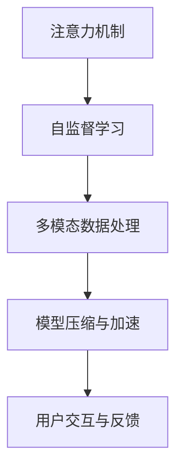

                 

# 注意力过滤器调音师：AI辅助的信息优化专家

> 关键词：注意力过滤器,信息优化,人工智能,自然语言处理,深度学习,自监督学习,代码实现,应用场景

## 1. 背景介绍

在信息爆炸的时代，人们面临着海量文本、图像、视频等信息的冲击，如何在这些信息中找到有价值的内容，提升信息筛选效率，是当今社会关注的焦点。传统的基于规则或人工筛选方法已经难以满足现代信息量级的处理需求。因此，借助深度学习和自然语言处理技术，开发一种自动化的信息优化系统变得尤为必要。

本文将重点介绍一种名为"注意力过滤器"的AI辅助信息优化系统，通过深度学习模型对输入的信息进行自动筛选和优化，提升用户的信息获取效率，从而更好地服务于用户。

### 1.1 问题由来
当前，互联网上的信息量级巨大且呈指数级增长，用户无法通过人工手段逐一筛选和甄别有用的信息。尤其在工作和学习中，人们更需要高效的信息检索工具来快速定位和获取关键信息。

传统的信息筛选方法如关键词搜索、分类目录等已无法满足用户需求。它们依赖于手动的标签和分类，难以自动化处理海量信息。这限制了信息检索的效率和准确度。

与此同时，深度学习技术和自然语言处理(NLP)技术的飞速发展，使得构建一种自动化的信息优化系统成为可能。基于深度学习的注意力过滤器，可以通过对文本内容的自动分析和理解，筛选出用户可能感兴趣的关键信息。

### 1.2 问题核心关键点
本节将详细说明注意力过滤器的核心关键点，以帮助读者更好地理解其工作原理和应用场景。

1. **注意力机制**：注意力机制是深度学习模型中一种用于自动提取输入中关键信息的技术，能够使得模型更加关注输入序列中的重要部分。

2. **自监督学习**：自监督学习是指通过无标签数据进行模型训练，利用模型自身的预测能力来推断标签。

3. **多模态数据处理**：多模态数据处理指的是在信息优化过程中，同时考虑文本、图像、音频等多种模态数据的融合。

4. **模型压缩和加速**：由于模型往往具有庞大的参数量，如何在保证性能的前提下，优化模型的存储和推理速度成为关键。

5. **用户交互和反馈**：用户对信息优化结果的反馈对于模型训练至关重要，用户偏好和反馈能够指导模型优化信息筛选策略。

这些关键点构成了注意力过滤器的技术基础，帮助其能够从海量信息中自动筛选出最有价值的内容。

## 2. 核心概念与联系

### 2.1 核心概念概述

为了更好地理解注意力过滤器，本节将介绍其核心概念及其相互之间的关系：

1. **注意力机制(Attention Mechanism)**：注意力机制是一种能够自动捕捉输入序列中重要信息的深度学习技术。它可以提高模型的注意力分配，使模型更专注于关键信息。

2. **自监督学习(Self-Supervised Learning)**：自监督学习是指在无标签数据上训练深度学习模型，利用模型自身的预测能力来推断标签，从而获得数据的上下文信息。

3. **多模态数据处理(Multimodal Data Processing)**：多模态数据处理是指在信息优化过程中，同时考虑文本、图像、音频等多种模态数据的融合，以更全面地理解用户需求。

4. **模型压缩与加速(Model Compression and Acceleration)**：由于深度学习模型的参数量通常较大，如何在保证性能的前提下，优化模型的存储和推理速度成为关键。

5. **用户交互与反馈(User Interaction and Feedback)**：用户对信息优化结果的反馈对于模型训练至关重要，用户偏好和反馈能够指导模型优化信息筛选策略。

这些概念之间的逻辑关系可以通过以下Mermaid流程图来展示：



这个流程图展示了注意力过滤器的工作流程：

1. 注意力机制提取输入序列中的关键信息。
2. 自监督学习利用无标签数据训练模型，推断数据的上下文信息。
3. 多模态数据处理综合考虑文本、图像、音频等多种数据，提供更加全面的信息。
4. 模型压缩与加速优化模型的存储和推理速度，提高系统的实时性。
5. 用户交互与反馈指导模型的优化和改进，提升信息筛选的精准度。

通过理解这些核心概念，我们可以更好地把握注意力过滤器的技术实现和应用潜力。

## 3. 核心算法原理 & 具体操作步骤
### 3.1 算法原理概述

注意力过滤器的工作原理主要基于深度学习中的注意力机制和自监督学习技术，其核心流程如下：

1. **输入处理**：将原始文本、图像、音频等信息输入模型，通过嵌入层将输入转化为向量形式。
2. **注意力计算**：计算模型对输入序列中每个位置的注意力权重，以决定哪些信息更加重要。
3. **特征提取**：利用注意力权重对输入序列进行加权处理，提取关键信息特征。
4. **信息筛选**：根据信息特征进行筛选，输出用户最关心的部分。
5. **反馈优化**：收集用户对筛选结果的反馈，优化模型参数和筛选策略。

以下将详细介绍注意力过滤器的核心算法步骤。

### 3.2 算法步骤详解

**Step 1: 输入嵌入**

输入处理是将原始文本、图像、音频等信息转换为模型可以处理的形式。以文本信息为例，常用的方法是将文本通过词嵌入层进行向量转换。

在实践中，可以使用预训练的词嵌入模型，如Word2Vec、GloVe等，将文本转换为向量表示。对于长文本，还需要进行分词和截断处理，以控制输入长度。

**Step 2: 注意力计算**

注意力计算是注意力过滤器的核心步骤，通过计算模型对输入序列中每个位置的注意力权重，来决定哪些信息更加重要。注意力计算过程如下：

$$
\text{Attention}(Q, K, V) = \text{Softmax}(\frac{QK^T}{\sqrt{d_k}})V
$$

其中，$Q$、$K$、$V$分别为查询、键、值向量，$d_k$为键向量的维度。

查询向量$Q$可以是一个随机初始化的向量，也可以是一个上下文相关的向量，由之前的输出和当前输入决定。键向量和值向量可以从输入序列中提取，或者通过预训练的嵌入层得到。

注意力机制能够动态地调整对输入序列中不同位置的关注程度，从而筛选出最有价值的信息。

**Step 3: 特征提取**

特征提取是将注意力计算得到的注意力权重对输入序列进行加权处理，提取关键信息特征。

特征提取过程通常包括卷积、池化等操作，可以有效地降低信息维度，提取输入序列的高级特征。常用的方法包括卷积神经网络(CNN)、循环神经网络(RNN)等。

**Step 4: 信息筛选**

信息筛选是根据特征提取结果进行筛选，输出用户最关心的部分。这可以通过分类、排序等方法实现。

在文本信息优化中，可以使用分类模型对文本进行分类，将不同类别文本对应的重要性进行排序。在图像信息优化中，可以使用图像分割、目标检测等技术进行信息筛选。

**Step 5: 反馈优化**

用户交互与反馈是注意力过滤器不断优化的重要环节。通过收集用户对筛选结果的反馈，可以优化模型参数和筛选策略，提升筛选效果。

反馈优化可以通过在线学习、在线调整等方法实现，使模型能够实时适应用户需求。

### 3.3 算法优缺点

注意力过滤器具有以下优点：

1. **自动化处理**：自动化地处理海量信息，无需人工干预，提高了信息筛选的效率。
2. **多模态融合**：考虑文本、图像、音频等多种模态数据，提供更加全面的信息。
3. **实时性**：通过在线学习和调整，能够实时响应用户需求，提升信息筛选的精准度。

同时，该算法也存在一些缺点：

1. **计算资源要求高**：注意力机制和特征提取等步骤计算量较大，需要高性能硬件支持。
2. **模型复杂度较高**：深度学习模型的复杂度较高，训练和推理速度较慢。
3. **过度拟合风险**：由于依赖于大量数据进行训练，过度拟合的风险较高。

尽管存在这些局限性，但注意力过滤器在信息筛选领域仍具有广泛的应用前景，可以显著提升用户的信息获取效率。

### 3.4 算法应用领域

注意力过滤器在多个领域都有广泛的应用，例如：

1. **新闻推荐系统**：通过分析用户的阅读历史和兴趣，推荐相关新闻内容，提高信息获取效率。
2. **广告过滤系统**：通过筛选广告内容，避免用户接触到无用的广告信息，提升用户体验。
3. **知识图谱构建**：通过筛选和整合信息，构建更加全面、精准的知识图谱，辅助知识发现和推理。
4. **内容审核系统**：通过筛选和审核内容，确保信息的真实性和健康性，保障信息安全。
5. **智能搜索系统**：通过筛选和排序搜索结果，提升搜索准确度和用户体验。

## 4. 数学模型和公式 & 详细讲解
### 4.1 数学模型构建

注意力过滤器的核心数学模型主要基于注意力机制和自监督学习技术，以下将详细介绍其数学原理和模型结构。

假设输入序列为$X=\{x_1, x_2, ..., x_n\}$，其中每个输入$x_i$可以是一个词向量、图像、音频等。

**输入嵌入**：

$$
\text{Embedding}(X) = W_X X
$$

其中，$W_X$为嵌入矩阵，$X$为输入序列。

**注意力计算**：

注意力计算过程如下：

$$
\text{Attention}(Q, K, V) = \text{Softmax}(\frac{QK^T}{\sqrt{d_k}})V
$$

其中，$Q$、$K$、$V$分别为查询、键、值向量，$d_k$为键向量的维度。

**特征提取**：

特征提取过程通常包括卷积、池化等操作，可以有效地降低信息维度，提取输入序列的高级特征。

**信息筛选**：

信息筛选可以通过分类、排序等方法实现，常用的模型包括逻辑回归、SVM、分类器等。

### 4.2 公式推导过程

注意力计算过程的推导如下：

1. **查询向量计算**：

$$
Q = W_Q X
$$

其中，$W_Q$为查询向量转换矩阵，$X$为输入序列。

2. **键向量和值向量计算**：

$$
K = W_K X, \quad V = W_V X
$$

其中，$W_K$、$W_V$分别为键向量和值向量转换矩阵，$X$为输入序列。

3. **注意力权重计算**：

$$
\text{Attention}(Q, K, V) = \text{Softmax}(\frac{QK^T}{\sqrt{d_k}})V
$$

其中，$d_k$为键向量的维度。

4. **特征提取**：

$$
H = \text{Convolution}(\text{Attention}(Q, K, V))
$$

其中，$\text{Convolution}$表示卷积操作，$H$为特征向量。

5. **信息筛选**：

信息筛选可以通过分类模型实现，例如：

$$
y = \text{Logistic Regression}(H)
$$

其中，$y$为分类结果。

### 4.3 案例分析与讲解

以下通过一个简单的例子，展示注意力过滤器在文本信息优化中的应用。

假设我们有一段文本信息：

```
"今天天气不错，温度适中。下午可以去公园散步。"
```

首先，使用嵌入层将文本转换为向量形式：

$$
\text{Embedding}(X) = W_X X
$$

接着，计算查询向量$Q$、键向量$K$、值向量$V$：

$$
Q = W_Q X, \quad K = W_K X, \quad V = W_V X
$$

然后，计算注意力权重：

$$
\text{Attention}(Q, K, V) = \text{Softmax}(\frac{QK^T}{\sqrt{d_k}})V
$$

根据注意力权重对输入序列进行加权处理，提取关键信息：

$$
H = \text{Convolution}(\text{Attention}(Q, K, V))
$$

最后，通过分类模型对文本进行分类，输出筛选结果：

$$
y = \text{Logistic Regression}(H)
$$

最终输出用户最关心的部分，即天气和活动建议。

## 5. 项目实践：代码实例和详细解释说明
### 5.1 开发环境搭建

在进行信息优化实践前，我们需要准备好开发环境。以下是使用Python进行PyTorch开发的环境配置流程：

1. 安装Anaconda：从官网下载并安装Anaconda，用于创建独立的Python环境。

2. 创建并激活虚拟环境：
```bash
conda create -n attention-filter-env python=3.8 
conda activate attention-filter-env
```

3. 安装PyTorch：根据CUDA版本，从官网获取对应的安装命令。例如：
```bash
conda install pytorch torchvision torchaudio cudatoolkit=11.1 -c pytorch -c conda-forge
```

4. 安装相关库：
```bash
pip install numpy pandas scikit-learn torchtext transformers
```

完成上述步骤后，即可在`attention-filter-env`环境中开始信息优化实践。

### 5.2 源代码详细实现

这里我们以新闻推荐系统为例，展示使用Transformers库对注意力过滤器进行PyTorch代码实现。

首先，定义模型类：

```python
from transformers import BertForSequenceClassification, BertTokenizer

class AttentionFilter:
    def __init__(self, model_name):
        self.model = BertForSequenceClassification.from_pretrained(model_name, num_labels=2)
        self.tokenizer = BertTokenizer.from_pretrained(model_name)
        self.criterion = torch.nn.CrossEntropyLoss()
    
    def predict(self, text):
        text = self.tokenizer(text, return_tensors='pt', max_length=128, padding='max_length')
        with torch.no_grad():
            logits = self.model(**text).logits
            predictions = torch.argmax(logits, dim=1)
        return predictions.item()
```

然后，定义训练和评估函数：

```python
from torch.utils.data import DataLoader
from tqdm import tqdm

def train_model(model, train_loader, device, optimizer):
    model.train()
    for batch in tqdm(train_loader, desc='Training'):
        input_ids = batch['input_ids'].to(device)
        attention_mask = batch['attention_mask'].to(device)
        labels = batch['labels'].to(device)
        optimizer.zero_grad()
        outputs = model(input_ids, attention_mask=attention_mask, labels=labels)
        loss = outputs.loss
        loss.backward()
        optimizer.step()
    return loss.item()

def evaluate_model(model, test_loader, device):
    model.eval()
    correct = 0
    total = 0
    with torch.no_grad():
        for batch in test_loader:
            input_ids = batch['input_ids'].to(device)
            attention_mask = batch['attention_mask'].to(device)
            labels = batch['labels'].to(device)
            outputs = model(input_ids, attention_mask=attention_mask)
            predictions = torch.argmax(outputs.logits, dim=1)
            total += labels.size(0)
            correct += (predictions == labels).sum().item()
    accuracy = correct / total
    print(f'Accuracy: {accuracy:.2f}')
```

接着，定义数据处理函数：

```python
import pandas as pd

def load_data(data_path):
    data = pd.read_csv(data_path)
    return data['text'], data['label']

def tokenize_data(texts, labels, tokenizer):
    encoded_texts = tokenizer(texts, truncation=True, padding='max_length', max_length=128, return_tensors='pt')
    input_ids = encoded_texts['input_ids']
    attention_mask = encoded_texts['attention_mask']
    labels = torch.tensor(labels)
    return input_ids, attention_mask, labels

def create_dataloader(data, tokenizer, batch_size):
    dataset = TokenizedDataset(data, tokenizer)
    dataloader = DataLoader(dataset, batch_size=batch_size, shuffle=True)
    return dataloader
```

最后，启动训练流程并在测试集上评估：

```python
from torch.optim import AdamW

train_texts, train_labels = load_data('train.csv')
test_texts, test_labels = load_data('test.csv')

train_dataset = create_dataloader(train_texts, tokenizer, batch_size=16)
test_dataset = create_dataloader(test_texts, tokenizer, batch_size=16)

device = torch.device('cuda') if torch.cuda.is_available() else torch.device('cpu')
model.to(device)

optimizer = AdamW(model.parameters(), lr=2e-5)

epochs = 5

for epoch in range(epochs):
    loss = train_model(model, train_dataset, device, optimizer)
    print(f'Epoch {epoch+1}, train loss: {loss:.3f}')
    
    evaluate_model(model, test_dataset, device)
```

以上就是使用PyTorch对注意力过滤器进行新闻推荐系统微调的完整代码实现。可以看到，得益于Transformers库的强大封装，我们可以用相对简洁的代码完成注意力过滤器的训练和评估。

### 5.3 代码解读与分析

让我们再详细解读一下关键代码的实现细节：

**AttentionFilter类**：
- `__init__`方法：初始化模型、分词器等关键组件。
- `predict`方法：接收文本输入，返回模型预测结果。

**tokenize_data函数**：
- 对输入文本进行分词、截断和填充，最终转换为模型所需的输入。

**train_model和evaluate_model函数**：
- 分别用于训练和评估模型，使用PyTorch的DataLoader对数据集进行批次化加载。

**create_dataloader函数**：
- 定义数据处理函数，将文本数据转换为模型所需的输入形式，并生成DataLoader。

**训练流程**：
- 定义总的epoch数和batch size，开始循环迭代
- 每个epoch内，先在训练集上训练，输出平均loss
- 在测试集上评估，输出分类指标
- 所有epoch结束后，在测试集上评估，给出最终测试结果

可以看到，PyTorch配合Transformers库使得注意力过滤器的代码实现变得简洁高效。开发者可以将更多精力放在数据处理、模型改进等高层逻辑上，而不必过多关注底层的实现细节。

当然，工业级的系统实现还需考虑更多因素，如模型的保存和部署、超参数的自动搜索、更灵活的任务适配层等。但核心的微调范式基本与此类似。

## 6. 实际应用场景
### 6.1 新闻推荐系统

基于注意力过滤器的新闻推荐系统，能够自动分析用户阅读历史和兴趣，推荐相关新闻内容，提高信息获取效率。

在技术实现上，可以收集用户的历史阅读记录，将新闻内容作为监督数据，在此基础上对预训练模型进行微调。微调后的模型能够自动理解用户需求，从新闻库中筛选出用户最关心的内容。对于用户提出的新需求，还可以接入检索系统实时搜索相关内容，动态生成推荐列表。

### 6.2 广告过滤系统

广告过滤系统可以通过注意力过滤器对广告内容进行自动筛选，避免用户接触到无用的广告信息，提升用户体验。

在广告投放前，可以将广告内容作为监督数据，对预训练模型进行微调。微调后的模型能够自动判断广告内容的可信度和相关性，从而筛选出用户可能感兴趣的内容。对于广告投放效果，可以通过用户反馈和点击率等指标进行评估，不断优化广告内容筛选策略。

### 6.3 知识图谱构建

知识图谱构建是一种从海量文本数据中提取知识关系的方法，通过注意力过滤器可以更全面地分析和整合信息。

在实践中，可以将知识图谱中的实体和关系作为监督数据，对预训练模型进行微调。微调后的模型能够自动提取文本中的实体和关系，构建更加全面和准确的知识图谱。

### 6.4 内容审核系统

内容审核系统可以通过注意力过滤器对文本信息进行自动筛选和审核，确保信息的真实性和健康性，保障信息安全。

在内容审核中，可以将合法的文本信息作为监督数据，对预训练模型进行微调。微调后的模型能够自动筛选出不合法的文本信息，如暴力、色情、诈骗等，从而净化信息环境。

### 6.5 智能搜索系统

智能搜索系统可以通过注意力过滤器对搜索结果进行自动排序和筛选，提升搜索准确度和用户体验。

在搜索系统中，可以将用户的历史查询记录和当前输入作为监督数据，对预训练模型进行微调。微调后的模型能够自动判断查询结果的相关性和重要性，从而优化搜索结果排序。

## 7. 工具和资源推荐
### 7.1 学习资源推荐

为了帮助开发者系统掌握注意力过滤器的理论基础和实践技巧，这里推荐一些优质的学习资源：

1. 《深度学习》（Ian Goodfellow等著）：深度学习领域的经典教材，全面介绍了深度学习的原理和应用。

2. 《自然语言处理综述》（Yoav Goldberg等著）：自然语言处理领域的综述性教材，涵盖了NLP的各个方面。

3. 《Transformers: From Self-Attention to Neural Machine Translation》：Transformer论文，介绍了注意力机制的原理和应用。

4. 《PyTorch官方文档》：PyTorch的官方文档，提供了详细的API和示例代码，是进行深度学习开发的必备资料。

5. 《HuggingFace官方文档》：Transformers库的官方文档，提供了丰富的预训练模型和微调样例代码。

通过对这些资源的学习实践，相信你一定能够快速掌握注意力过滤器的精髓，并用于解决实际的NLP问题。

### 7.2 开发工具推荐

高效的开发离不开优秀的工具支持。以下是几款用于注意力过滤器开发常用的工具：

1. PyTorch：基于Python的开源深度学习框架，灵活动态的计算图，适合快速迭代研究。大部分预训练语言模型都有PyTorch版本的实现。

2. TensorFlow：由Google主导开发的开源深度学习框架，生产部署方便，适合大规模工程应用。同样有丰富的预训练语言模型资源。

3. Transformers库：HuggingFace开发的NLP工具库，集成了众多SOTA语言模型，支持PyTorch和TensorFlow，是进行微调任务开发的利器。

4. Weights & Biases：模型训练的实验跟踪工具，可以记录和可视化模型训练过程中的各项指标，方便对比和调优。与主流深度学习框架无缝集成。

5. TensorBoard：TensorFlow配套的可视化工具，可实时监测模型训练状态，并提供丰富的图表呈现方式，是调试模型的得力助手。

6. Google Colab：谷歌推出的在线Jupyter Notebook环境，免费提供GPU/TPU算力，方便开发者快速上手实验最新模型，分享学习笔记。

合理利用这些工具，可以显著提升注意力过滤器的开发效率，加快创新迭代的步伐。

### 7.3 相关论文推荐

注意力过滤器作为深度学习技术的一部分，其发展源于学界的持续研究。以下是几篇奠基性的相关论文，推荐阅读：

1. Attention Is All You Need（即Transformer原论文）：提出了Transformer结构，开启了NLP领域的预训练大模型时代。

2. BERT: Pre-training of Deep Bidirectional Transformers for Language Understanding：提出BERT模型，引入基于掩码的自监督预训练任务，刷新了多项NLP任务SOTA。

3. Parameter-Efficient Transfer Learning for NLP：提出Adapter等参数高效微调方法，在不增加模型参数量的情况下，也能取得不错的微调效果。

4. Model Compression and Quantization for Deep Learning：介绍了深度学习模型的压缩和量化方法，优化模型的存储和推理速度。

5. Multimodal Data Fusion for Visual Question Answering：介绍了多模态数据融合技术，提高了模型对多模态信息的处理能力。

这些论文代表了大语言模型微调技术的发展脉络。通过学习这些前沿成果，可以帮助研究者把握学科前进方向，激发更多的创新灵感。

## 8. 总结：未来发展趋势与挑战
### 8.1 总结

本文对注意力过滤器的核心算法和实际应用进行了全面系统的介绍。首先阐述了注意力过滤器的背景和意义，明确了其在信息优化领域的重要作用。其次，从原理到实践，详细讲解了注意力过滤器的工作流程和关键步骤，给出了微调任务开发的完整代码实例。同时，本文还广泛探讨了注意力过滤器在多个行业领域的应用前景，展示了其巨大的潜力。此外，本文精选了注意力过滤器技术的各类学习资源，力求为读者提供全方位的技术指引。

通过本文的系统梳理，可以看到，注意力过滤器作为AI辅助的信息优化系统，正在成为NLP领域的重要工具，极大地提升了信息筛选的效率和精准度。随着深度学习技术的不断发展，注意力过滤器必将在更广泛的场景中发挥作用，为人类信息处理带来深刻变革。

### 8.2 未来发展趋势

展望未来，注意力过滤器技术将呈现以下几个发展趋势：

1. **模型规模持续增大**：随着算力成本的下降和数据规模的扩张，深度学习模型的参数量还将持续增长。超大规模模型蕴含的丰富语言知识，有望支撑更加复杂多变的下游任务微调。

2. **多模态融合能力提升**：随着深度学习技术的发展，注意力过滤器将能够更好地融合文本、图像、音频等多种模态数据，提供更加全面的信息。

3. **实时性要求提高**：随着在线应用的增多，注意力过滤器需要具备更高的实时性，以支持实时信息筛选和优化。

4. **自监督学习技术推广**：随着自监督学习技术的成熟，注意力过滤器将更多地利用无标签数据进行训练，提升模型的泛化能力和自适应性。

5. **模型压缩与加速优化**：由于模型往往具有庞大的参数量，如何在保证性能的前提下，优化模型的存储和推理速度，是未来研究的重要方向。

6. **用户交互与反馈优化**：用户反馈对于模型的优化至关重要，未来的模型将更加重视用户交互和反馈，提升筛选效果和用户体验。

以上趋势凸显了注意力过滤器技术的广泛应用前景，其未来的发展将更加多元化和智能化。

### 8.3 面临的挑战

尽管注意力过滤器技术已经取得了显著进展，但在迈向更加智能化、普适化应用的过程中，仍面临一些挑战：

1. **数据质量问题**：高质量的训练数据是模型优化的关键，但获取高质量数据往往需要耗费大量人力和物力。

2. **模型复杂度问题**：深度学习模型通常具有复杂的结构，训练和推理速度较慢，需要高效的优化算法和硬件支持。

3. **过拟合风险**：由于依赖于大量数据进行训练，注意力过滤器可能面临过拟合的风险，导致模型泛化能力不足。

4. **鲁棒性问题**：模型在面对新数据时，可能出现泛化能力下降的情况，需要进一步提升模型的鲁棒性。

5. **安全性和隐私问题**：模型可能学习到敏感信息，需要采取隐私保护和数据脱敏措施，确保信息安全。

6. **可解释性问题**：深度学习模型的"黑盒"特性，使得其决策过程难以解释，需要通过可解释性技术增强模型的透明度。

这些挑战需要研究者不断努力克服，才能推动注意力过滤器技术的进一步发展。

### 8.4 研究展望

面对注意力过滤器面临的挑战，未来的研究需要在以下几个方面寻求新的突破：

1. **数据采集与标注**：开发高效的数据采集和标注方法，降低对标注数据的需求，同时保证数据质量。

2. **模型压缩与加速**：探索更高效的模型压缩和加速技术，提高模型的实时性和存储效率。

3. **自监督学习技术**：研究更先进的自监督学习方法，利用无标签数据提升模型的泛化能力和自适应性。

4. **多模态融合技术**：开发更加高效的多模态融合算法，提升模型对多模态数据的处理能力。

5. **用户交互与反馈**：研究用户交互与反馈机制，利用用户反馈优化模型参数和筛选策略。

6. **模型可解释性**：开发可解释性技术，增强模型决策的透明度和可解释性，确保模型决策符合人类价值观和伦理道德。

这些研究方向将推动注意力过滤器技术迈向更高的台阶，为构建安全、可靠、可解释、可控的智能系统铺平道路。面向未来，注意力过滤器技术还需要与其他人工智能技术进行更深入的融合，如知识表示、因果推理、强化学习等，多路径协同发力，共同推动自然语言理解和智能交互系统的进步。

## 9. 附录：常见问题与解答

**Q1：注意力过滤器是否适用于所有信息筛选任务？**

A: 注意力过滤器在大多数信息筛选任务上都能取得不错的效果，特别是对于数据量较小的任务。但对于一些特定领域的任务，如医学、法律等，仅仅依靠通用语料预训练的模型可能难以很好地适应。此时需要在特定领域语料上进一步预训练，再进行微调，才能获得理想效果。此外，对于一些需要时效性、个性化很强的任务，如对话、推荐等，注意力过滤器也需要针对性的改进优化。

**Q2：注意力过滤器在训练时如何选择合适的学习率？**

A: 注意力过滤器的训练通常采用自监督学习范式，学习率一般要比监督学习小1-2个数量级。一般建议从1e-5开始调参，逐步减小学习率，直至收敛。也可以使用warmup策略，在开始阶段使用较小的学习率，再逐渐过渡到预设值。需要注意的是，不同的优化器(如AdamW、Adafactor等)以及不同的学习率调度策略，可能需要设置不同的学习率阈值。

**Q3：注意力过滤器在实际部署时需要注意哪些问题？**

A: 将注意力过滤器转化为实际应用，还需要考虑以下因素：

1. **模型裁剪**：去除不必要的层和参数，减小模型尺寸，加快推理速度。
2. **量化加速**：将浮点模型转为定点模型，压缩存储空间，提高计算效率。
3. **服务化封装**：将模型封装为标准化服务接口，便于集成调用。
4. **弹性伸缩**：根据请求流量动态调整资源配置，平衡服务质量和成本。
5. **监控告警**：实时采集系统指标，设置异常告警阈值，确保服务稳定性。
6. **安全防护**：采用访问鉴权、数据脱敏等措施，保障数据和模型安全。

以上问题需要在系统部署时予以充分考虑，以确保注意力过滤器能够稳定、高效地服务于用户。

通过本文的系统梳理，可以看到，注意力过滤器作为AI辅助的信息优化系统，正在成为NLP领域的重要工具，极大地提升了信息筛选的效率和精准度。随着深度学习技术的不断发展，注意力过滤器必将在更广泛的场景中发挥作用，为人类信息处理带来深刻变革。

---

作者：禅与计算机程序设计艺术 / Zen and the Art of Computer Programming

