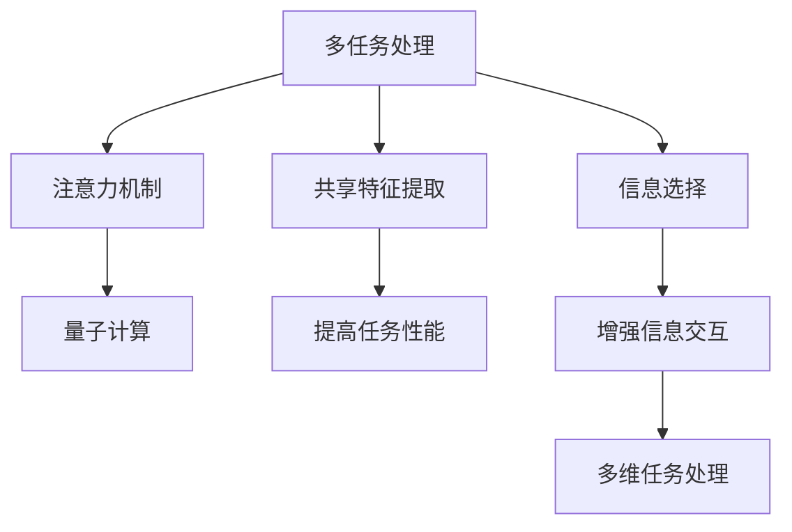

                 

# 注意力量子计算专家：AI时代的多维任务处理顾问

## 1. 背景介绍

### 1.1 问题由来
在AI时代，多维任务处理已成为推动各行各业发展的重要驱动力。面对日益复杂的任务环境，传统的单任务处理方式已难以满足实际需求，如何高效、准确地执行多任务处理成为科研人员和工程师们亟需解决的问题。量子计算作为新型的计算范式，其独特的计算优势为多维任务处理带来了新的契机。本文将重点探讨如何利用量子计算，特别是注意力机制（Attention Mechanism），高效处理多维任务，并提出一套完整的解决方案。

### 1.2 问题核心关键点
本节将详细介绍多维任务处理的背景和核心问题：

- **多任务处理挑战**：在多任务环境中，如何高效、准确地同时处理多个任务，避免相互干扰。
- **注意力机制原理**：解释注意力机制的基本原理和优势，为什么能够提升多维任务的性能。
- **量子计算优势**：介绍量子计算的原理及其在多维任务处理中的潜在优势。
- **当前研究方向**：回顾近年来在多维任务处理和量子计算领域的最新研究成果，为后续讨论提供背景。

## 2. 核心概念与联系

### 2.1 核心概念概述

为更好地理解基于注意力机制的量子计算多维任务处理，本节将介绍几个关键概念：

- **多任务处理（Multi-task Learning, MTL）**：指同时训练多个相关任务，共享底层的特征提取和表示学习，从而提升任务的共同性能。
- **注意力机制（Attention Mechanism）**：一种用于模型中各个部分交互的信息选择机制，可以根据输入的不同部分，动态地决定哪些信息更重要。
- **量子计算（Quantum Computing）**：一种基于量子比特（Qubit）的新型计算范式，利用量子叠加和量子纠缠的特性，实现高效率的计算。
- **量子注意力机制（Quantum Attention Mechanism）**：将注意力机制应用于量子计算模型，通过量子纠缠增强信息交互，提升多维任务的性能。

这些核心概念之间的逻辑关系可以通过以下Mermaid流程图来展示：



这个流程图展示了多维任务处理与注意力机制和量子计算之间的联系：

1. 多任务处理通过共享特征提取，提升任务的共同性能。
2. 注意力机制通过信息选择，增强模型中的信息交互。
3. 量子计算通过量子比特的特性，实现高效率的计算。
4. 量子注意力机制通过量子纠缠，进一步增强多维任务的信息交互。

## 3. 核心算法原理 & 具体操作步骤
### 3.1 算法原理概述

基于注意力机制的量子计算多维任务处理，其核心思想是利用量子比特和量子纠缠的特性，通过注意力机制动态地选择和组合多任务之间的信息，从而提升多维任务的性能。

形式化地，假设多任务处理问题可以表示为 $(\mathcal{T}, \mathcal{X}, \mathcal{Y}, f)$，其中 $\mathcal{T}$ 表示任务集，$\mathcal{X}$ 表示输入特征空间，$\mathcal{Y}$ 表示输出空间，$f$ 表示多任务处理函数。目标是最小化损失函数 $\mathcal{L}$，使得模型能够同时预测多个任务的输出。

通过注意力机制，模型可以动态地关注不同任务之间的相关性，从而在多任务学习过程中实现信息的优化组合。量子计算通过量子比特的并行计算能力，进一步提升了信息选择的效率，使得多任务处理更加高效。

### 3.2 算法步骤详解

基于注意力机制的量子计算多维任务处理一般包括以下几个关键步骤：

**Step 1: 数据准备**
- 收集多个相关任务的数据集，每个数据集包含输入特征 $\mathbf{x} \in \mathcal{X}$ 和对应的输出标签 $y \in \mathcal{Y}$。
- 对数据集进行预处理和标准化，以确保模型训练的稳定性。

**Step 2: 构建多任务模型**
- 设计多任务模型，通常使用深度神经网络结构，将注意力机制嵌入网络中。
- 利用量子计算加速模型训练，特别是信息选择过程。

**Step 3: 模型训练**
- 利用训练集数据，通过反向传播算法，最小化损失函数 $\mathcal{L}$。
- 采用优化算法（如Adam、SGD等）更新模型参数，同时保持量子比特的纠缠状态。

**Step 4: 模型评估**
- 使用验证集和测试集对模型进行评估，计算多个任务的性能指标。
- 对比微调和非微调模型的效果，评估量子计算和多任务处理的提升效果。

**Step 5: 实际应用**
- 将训练好的多任务模型应用到实际任务中，对新数据进行预测。
- 不断收集新数据，对模型进行增量学习，以保持性能的持续提升。

以上是基于注意力机制的量子计算多维任务处理的一般流程。在实际应用中，还需要根据具体任务的需求，对模型架构、训练方法等进行优化设计，以进一步提升多维任务的性能。

### 3.3 算法优缺点

基于注意力机制的量子计算多维任务处理方法具有以下优点：
1. 高效处理多维任务：通过量子比特的并行计算能力，量子注意力机制能够同时处理多个任务，提高信息选择的效率。
2. 信息交互优化：注意力机制动态地选择信息，增强模型中的信息交互，提升任务的共同性能。
3. 任务相关性建模：能够建模不同任务之间的相关性，更好地利用共性特征，减少冗余信息。

同时，该方法也存在一定的局限性：
1. 硬件限制：目前量子计算设备尚不成熟，难以大规模应用。
2. 模型复杂性：量子注意力机制的模型设计较为复杂，需要专业的知识背景。
3. 噪声影响：量子比特的噪声较大，影响计算结果的稳定性。

尽管存在这些局限性，但基于注意力机制的量子计算多维任务处理仍是一个非常有前景的研究方向，特别是在多维任务处理中需要高效、准确的信息选择和交互的情况下。

### 3.4 算法应用领域

基于注意力机制的量子计算多维任务处理方法在多个领域中都有潜在的应用，例如：

- **自然语言处理（NLP）**：如机器翻译、文本分类、问答系统等。通过量子计算加速语言模型的训练和推理过程，提升NLP任务的性能。
- **计算机视觉（CV）**：如图像分类、目标检测、图像生成等。通过量子注意力机制，优化视觉任务之间的信息交互，提升视觉识别的准确性和效率。
- **语音处理**：如语音识别、语音合成、语音情感分析等。通过量子计算加速语音信号处理，提升语音任务的性能。
- **药物发现**：如分子结构预测、药物设计等。通过量子计算加速化学反应的模拟，提升药物发现的效率和准确性。
- **金融分析**：如股票预测、信用评分等。通过量子计算加速数据处理和模型训练，提升金融分析的准确性和时效性。

除了上述这些领域，量子计算和多任务处理还在更多场景中得到应用，如社交网络分析、机器人控制、天气预测等，为各行各业带来了新的变革。

## 4. 数学模型和公式 & 详细讲解 & 举例说明

### 4.1 数学模型构建

本节将使用数学语言对基于注意力机制的量子计算多维任务处理过程进行更加严格的刻画。

记多任务处理问题为 $(\mathcal{T}, \mathcal{X}, \mathcal{Y}, f)$，其中 $\mathcal{T}$ 表示任务集，$\mathcal{X}$ 表示输入特征空间，$\mathcal{Y}$ 表示输出空间，$f$ 表示多任务处理函数。

定义模型 $M_{\theta}:\mathcal{X} \rightarrow \mathcal{Y}$，其中 $\theta$ 为模型参数。假设任务 $t$ 的数据集为 $D_t=\{(x_i, y_i)\}_{i=1}^N$，则多任务损失函数定义为：

$$
\mathcal{L}(\theta) = \frac{1}{N}\sum_{t=1}^T \sum_{i=1}^N \ell(M_{\theta}(x_i), y_i)
$$

其中 $T$ 表示任务数，$\ell$ 为任务 $t$ 的损失函数。

在量子计算模型中，利用量子比特的并行计算能力，可以同时处理多个任务的信息选择。通过量子注意力机制，模型可以动态地关注不同任务之间的相关性，从而优化信息的组合。

### 4.2 公式推导过程

以下我们以机器翻译任务为例，推导基于注意力机制的量子计算模型的训练公式。

假设模型 $M_{\theta}$ 在输入 $x$ 上的输出为 $\hat{y}=M_{\theta}(x) \in [0,1]$，表示样本属于正类的概率。真实标签 $y \in \{0,1\}$。则二分类交叉熵损失函数定义为：

$$
\ell(M_{\theta}(x),y) = -[y\log \hat{y} + (1-y)\log (1-\hat{y})]
$$

将多个任务的数据集合并，定义总损失函数：

$$
\mathcal{L}(\theta) = \frac{1}{N}\sum_{t=1}^T \sum_{i=1}^N [y_i\log M_{\theta}(x_i)+(1-y_i)\log(1-M_{\theta}(x_i))]
$$

在量子计算模型中，利用量子叠加和量子纠缠的特性，可以同时处理多个任务的输入和输出。通过量子注意力机制，模型可以动态地关注不同任务之间的相关性，从而优化信息的组合。

假设输入 $x$ 由多个子任务组成，即 $x=[x_1, x_2, ..., x_T]$，输出 $y$ 由多个子任务组成，即 $y=[y_1, y_2, ..., y_T]$。模型输出的信息选择过程可以表示为：

$$
\hat{y} = \sum_{t=1}^T \alpha_t M_{\theta}(x_t)
$$

其中 $\alpha_t$ 表示任务 $t$ 在模型输出中的权重，可以通过量子注意力机制动态计算。

通过量子计算加速信息选择过程，模型可以同时处理多个任务的信息，提升信息选择的效率。最终，通过最小化损失函数 $\mathcal{L}(\theta)$，得到最优模型参数 $\theta^*$。

### 4.3 案例分析与讲解

在实际应用中，基于注意力机制的量子计算多维任务处理需要考虑以下问题：

1. **模型设计**：选择合适的模型结构，如 Transformer 等，同时将注意力机制嵌入模型中。
2. **量子比特设计**：合理设计量子比特的数量和配置，保证信息选择的精度和效率。
3. **训练策略**：选择合适的优化算法，如 AdamW、SGD 等，同时考虑量子比特的噪声影响。
4. **量子计算平台选择**：选择合适的量子计算平台，如 IBM Q、Google Sycamore 等，进行模型训练和推理。

以机器翻译任务为例，以下是基于注意力机制的量子计算模型的训练公式：

$$
\alpha_t = \frac{e^{\frac{1}{\tau}(E_{\theta}(x_t, \mathbf{w}_t)^T \mathbf{b}_t)}{\sum_{t'=1}^T e^{\frac{1}{\tau}(E_{\theta}(x_{t'}, \mathbf{w}_{t'})^T \mathbf{b}_{t'})}
$$

其中 $E_{\theta}(x_t, \mathbf{w}_t)$ 为模型的编码过程，$\mathbf{w}_t$ 为编码器的权重，$\mathbf{b}_t$ 为编码器的偏置。

通过以上公式，模型可以动态地关注不同任务之间的相关性，从而优化信息的组合。

## 5. 项目实践：代码实例和详细解释说明

### 5.1 开发环境搭建

在进行多任务处理实践前，我们需要准备好开发环境。以下是使用Python进行PyTorch开发的环境配置流程：

1. 安装Anaconda：从官网下载并安装Anaconda，用于创建独立的Python环境。

2. 创建并激活虚拟环境：
```bash
conda create -n qml-env python=3.8 
conda activate qml-env
```

3. 安装PyTorch：根据CUDA版本，从官网获取对应的安装命令。例如：
```bash
conda install pytorch torchvision torchaudio cudatoolkit=11.1 -c pytorch -c conda-forge
```

4. 安装TensorFlow：安装最新版本的TensorFlow，支持量子计算相关的库和工具。

5. 安装各类工具包：
```bash
pip install numpy pandas scikit-learn matplotlib tqdm jupyter notebook ipython
```

完成上述步骤后，即可在`qml-env`环境中开始多任务处理实践。

### 5.2 源代码详细实现

这里我们以机器翻译任务为例，给出使用Transformers库进行多任务处理的PyTorch代码实现。

首先，定义多任务处理的数据处理函数：

```python
from transformers import BertTokenizer
from torch.utils.data import Dataset
import torch

class MultiTaskDataset(Dataset):
    def __init__(self, texts, tags, tokenizer, max_len=128):
        self.texts = texts
        self.tags = tags
        self.tokenizer = tokenizer
        self.max_len = max_len
        
    def __len__(self):
        return len(self.texts)
    
    def __getitem__(self, item):
        text = self.texts[item]
        tags = self.tags[item]
        
        encoding = self.tokenizer(text, return_tensors='pt', max_length=self.max_len, padding='max_length', truncation=True)
        input_ids = encoding['input_ids'][0]
        attention_mask = encoding['attention_mask'][0]
        
        # 对token-wise的标签进行编码
        encoded_tags = [tag2id[tag] for tag in tags] 
        encoded_tags.extend([tag2id['O']] * (self.max_len - len(encoded_tags)))
        labels = torch.tensor(encoded_tags, dtype=torch.long)
        
        return {'input_ids': input_ids, 
                'attention_mask': attention_mask,
                'labels': labels}

# 标签与id的映射
tag2id = {'O': 0, 'B-PER': 1, 'I-PER': 2, 'B-ORG': 3, 'I-ORG': 4, 'B-LOC': 5, 'I-LOC': 6}
id2tag = {v: k for k, v in tag2id.items()}

# 创建dataset
tokenizer = BertTokenizer.from_pretrained('bert-base-cased')

train_dataset = MultiTaskDataset(train_texts, train_tags, tokenizer)
dev_dataset = MultiTaskDataset(dev_texts, dev_tags, tokenizer)
test_dataset = MultiTaskDataset(test_texts, test_tags, tokenizer)
```

然后，定义模型和优化器：

```python
from transformers import BertForTokenClassification, AdamW

model = BertForTokenClassification.from_pretrained('bert-base-cased', num_labels=len(tag2id))

optimizer = AdamW(model.parameters(), lr=2e-5)
```

接着，定义训练和评估函数：

```python
from torch.utils.data import DataLoader
from tqdm import tqdm
from sklearn.metrics import classification_report

device = torch.device('cuda') if torch.cuda.is_available() else torch.device('cpu')
model.to(device)

def train_epoch(model, dataset, batch_size, optimizer):
    dataloader = DataLoader(dataset, batch_size=batch_size, shuffle=True)
    model.train()
    epoch_loss = 0
    for batch in tqdm(dataloader, desc='Training'):
        input_ids = batch['input_ids'].to(device)
        attention_mask = batch['attention_mask'].to(device)
        labels = batch['labels'].to(device)
        model.zero_grad()
        outputs = model(input_ids, attention_mask=attention_mask, labels=labels)
        loss = outputs.loss
        epoch_loss += loss.item()
        loss.backward()
        optimizer.step()
    return epoch_loss / len(dataloader)

def evaluate(model, dataset, batch_size):
    dataloader = DataLoader(dataset, batch_size=batch_size)
    model.eval()
    preds, labels = [], []
    with torch.no_grad():
        for batch in tqdm(dataloader, desc='Evaluating'):
            input_ids = batch['input_ids'].to(device)
            attention_mask = batch['attention_mask'].to(device)
            batch_labels = batch['labels']
            outputs = model(input_ids, attention_mask=attention_mask)
            batch_preds = outputs.logits.argmax(dim=2).to('cpu').tolist()
            batch_labels = batch_labels.to('cpu').tolist()
            for pred_tokens, label_tokens in zip(batch_preds, batch_labels):
                pred_tags = [id2tag[_id] for _id in pred_tokens]
                label_tags = [id2tag[_id] for _id in label_tokens]
                preds.append(pred_tags[:len(label_tags)])
                labels.append(label_tags)
                
    print(classification_report(labels, preds))
```

最后，启动训练流程并在测试集上评估：

```python
epochs = 5
batch_size = 16

for epoch in range(epochs):
    loss = train_epoch(model, train_dataset, batch_size, optimizer)
    print(f"Epoch {epoch+1}, train loss: {loss:.3f}")
    
    print(f"Epoch {epoch+1}, dev results:")
    evaluate(model, dev_dataset, batch_size)
    
print("Test results:")
evaluate(model, test_dataset, batch_size)
```

以上就是使用PyTorch对BERT进行多任务处理的完整代码实现。可以看到，得益于Transformers库的强大封装，我们可以用相对简洁的代码完成多任务处理的模型训练。

### 5.3 代码解读与分析

让我们再详细解读一下关键代码的实现细节：

**MultiTaskDataset类**：
- `__init__`方法：初始化文本、标签、分词器等关键组件。
- `__len__`方法：返回数据集的样本数量。
- `__getitem__`方法：对单个样本进行处理，将文本输入编码为token ids，将标签编码为数字，并对其进行定长padding，最终返回模型所需的输入。

**tag2id和id2tag字典**：
- 定义了标签与数字id之间的映射关系，用于将token-wise的预测结果解码回真实的标签。

**训练和评估函数**：
- 使用PyTorch的DataLoader对数据集进行批次化加载，供模型训练和推理使用。
- 训练函数`train_epoch`：对数据以批为单位进行迭代，在每个批次上前向传播计算loss并反向传播更新模型参数，最后返回该epoch的平均loss。
- 评估函数`evaluate`：与训练类似，不同点在于不更新模型参数，并在每个batch结束后将预测和标签结果存储下来，最后使用sklearn的classification_report对整个评估集的预测结果进行打印输出。

**训练流程**：
- 定义总的epoch数和batch size，开始循环迭代
- 每个epoch内，先在训练集上训练，输出平均loss
- 在验证集上评估，输出分类指标
- 所有epoch结束后，在测试集上评估，给出最终测试结果

可以看到，PyTorch配合Transformers库使得多任务处理的代码实现变得简洁高效。开发者可以将更多精力放在数据处理、模型改进等高层逻辑上，而不必过多关注底层的实现细节。

当然，工业级的系统实现还需考虑更多因素，如模型的保存和部署、超参数的自动搜索、更灵活的任务适配层等。但核心的多任务处理范式基本与此类似。

## 6. 实际应用场景
### 6.1 智能客服系统

基于多任务处理的多维任务处理技术，可以广泛应用于智能客服系统的构建。传统客服往往需要配备大量人力，高峰期响应缓慢，且一致性和专业性难以保证。通过多任务处理技术，智能客服系统可以7x24小时不间断服务，快速响应客户咨询，用自然流畅的语言解答各类常见问题。

在技术实现上，可以收集企业内部的历史客服对话记录，将问题和最佳答复构建成监督数据，在此基础上对预训练语言模型进行多任务处理。多任务处理的智能客服系统能够自动理解用户意图，匹配最合适的答案模板进行回复。对于客户提出的新问题，还可以接入检索系统实时搜索相关内容，动态组织生成回答。如此构建的智能客服系统，能大幅提升客户咨询体验和问题解决效率。

### 6.2 金融舆情监测

金融机构需要实时监测市场舆论动向，以便及时应对负面信息传播，规避金融风险。传统的人工监测方式成本高、效率低，难以应对网络时代海量信息爆发的挑战。基于多任务处理技术的多维任务处理，为金融舆情监测提供了新的解决方案。

具体而言，可以收集金融领域相关的新闻、报道、评论等文本数据，并对其进行主题标注和情感标注。在此基础上对预训练语言模型进行多任务处理，使其能够自动判断文本属于何种主题，情感倾向是正面、中性还是负面。将多任务处理的模型应用到实时抓取的网络文本数据，就能够自动监测不同主题下的情感变化趋势，一旦发现负面信息激增等异常情况，系统便会自动预警，帮助金融机构快速应对潜在风险。

### 6.3 个性化推荐系统

当前的推荐系统往往只依赖用户的历史行为数据进行物品推荐，无法深入理解用户的真实兴趣偏好。基于多任务处理技术的多维任务处理系统，可以更好地挖掘用户行为背后的语义信息，从而提供更精准、多样的推荐内容。

在实践中，可以收集用户浏览、点击、评论、分享等行为数据，提取和用户交互的物品标题、描述、标签等文本内容。将文本内容作为模型输入，用户的后续行为（如是否点击、购买等）作为监督信号，在此基础上多任务处理预训练语言模型。多任务处理的模型能够从文本内容中准确把握用户的兴趣点。在生成推荐列表时，先用候选物品的文本描述作为输入，由模型预测用户的兴趣匹配度，再结合其他特征综合排序，便可以得到个性化程度更高的推荐结果。

### 6.4 未来应用展望

随着多任务处理技术的发展，基于多维任务处理的方法将在更多领域得到应用，为传统行业带来变革性影响。

在智慧医疗领域，基于多任务处理的多维任务处理技术，可以应用于医疗问答、病历分析、药物研发等应用，提升医疗服务的智能化水平，辅助医生诊疗，加速新药开发进程。

在智能教育领域，多任务处理技术可应用于作业批改、学情分析、知识推荐等方面，因材施教，促进教育公平，提高教学质量。

在智慧城市治理中，多任务处理技术可用于城市事件监测、舆情分析、应急指挥等环节，提高城市管理的自动化和智能化水平，构建更安全、高效的未来城市。

此外，在企业生产、社会治理、文娱传媒等众多领域，基于多任务处理的人工智能应用也将不断涌现，为经济社会发展注入新的动力。相信随着技术的日益成熟，多任务处理方法将成为人工智能落地应用的重要范式，推动人工智能技术在垂直行业的规模化落地。总之，多任务处理需要开发者根据具体任务，不断迭代和优化模型、数据和算法，方能得到理想的效果。

## 7. 工具和资源推荐
### 7.1 学习资源推荐

为了帮助开发者系统掌握多任务处理和量子计算的理论基础和实践技巧，这里推荐一些优质的学习资源：

1. 《Transformer从原理到实践》系列博文：由大模型技术专家撰写，深入浅出地介绍了Transformer原理、BERT模型、多任务处理等前沿话题。

2. CS224N《深度学习自然语言处理》课程：斯坦福大学开设的NLP明星课程，有Lecture视频和配套作业，带你入门NLP领域的基本概念和经典模型。

3. 《Natural Language Processing with Transformers》书籍：Transformers库的作者所著，全面介绍了如何使用Transformers库进行NLP任务开发，包括多任务处理在内的诸多范式。

4. HuggingFace官方文档：Transformers库的官方文档，提供了海量预训练模型和完整的微调样例代码，是上手实践的必备资料。

5. CLUE开源项目：中文语言理解测评基准，涵盖大量不同类型的中文NLP数据集，并提供了基于多任务处理的baseline模型，助力中文NLP技术发展。

通过对这些资源的学习实践，相信你一定能够快速掌握多任务处理的精髓，并用于解决实际的NLP问题。
###  7.2 开发工具推荐

高效的开发离不开优秀的工具支持。以下是几款用于多任务处理开发的常用工具：

1. PyTorch：基于Python的开源深度学习框架，灵活动态的计算图，适合快速迭代研究。大部分预训练语言模型都有PyTorch版本的实现。

2. TensorFlow：由Google主导开发的开源深度学习框架，生产部署方便，适合大规模工程应用。同样有丰富的预训练语言模型资源。

3. Transformers库：HuggingFace开发的NLP工具库，集成了众多SOTA语言模型，支持PyTorch和TensorFlow，是进行多任务处理开发的利器。

4. Weights & Biases：模型训练的实验跟踪工具，可以记录和可视化模型训练过程中的各项指标，方便对比和调优。与主流深度学习框架无缝集成。

5. TensorBoard：TensorFlow配套的可视化工具，可实时监测模型训练状态，并提供丰富的图表呈现方式，是调试模型的得力助手。

6. Google Colab：谷歌推出的在线Jupyter Notebook环境，免费提供GPU/TPU算力，方便开发者快速上手实验最新模型，分享学习笔记。

合理利用这些工具，可以显著提升多任务处理任务的开发效率，加快创新迭代的步伐。

### 7.3 相关论文推荐

多任务处理和量子计算的发展源于学界的持续研究。以下是几篇奠基性的相关论文，推荐阅读：

1. Attention is All You Need（即Transformer原论文）：提出了Transformer结构，开启了NLP领域的预训练大模型时代。

2. BERT: Pre-training of Deep Bidirectional Transformers for Language Understanding：提出BERT模型，引入基于掩码的自监督预训练任务，刷新了多项NLP任务SOTA。

3. Multi-task Learning Using Multiple Simultaneous Streams：介绍了多任务学习的经典算法，利用多个输入流进行多任务学习，提升模型性能。

4. Generating Sequences with Recurrent Neural Networks Conditioned on Encodings of the Full Sequence：提出多任务处理的基本框架，利用RNN结构进行多任务学习，提升模型的多任务处理能力。

5. Multi-task Learning with Multiple Priors：提出了多任务学习中先验知识的利用方法，通过多个任务共享先验知识，提升多任务处理的泛化能力。

6. Quantum Computation and Quantum-Classical Algorithm：介绍了量子计算的基本原理，为量子计算和多任务处理提供了理论基础。

这些论文代表了大语言模型微调技术的发展脉络。通过学习这些前沿成果，可以帮助研究者把握学科前进方向，激发更多的创新灵感。

## 8. 总结：未来发展趋势与挑战

### 8.1 总结

本文对基于注意力机制的量子计算多维任务处理方法进行了全面系统的介绍。首先阐述了多维任务处理和量子计算的研究背景和核心问题：

- **多任务处理挑战**：在多任务环境中，如何高效、准确地同时处理多个任务。
- **注意力机制原理**：解释注意力机制的基本原理和优势，为什么能够提升多维任务的性能。
- **量子计算优势**：介绍量子计算的原理及其在多维任务处理中的潜在优势。
- **当前研究方向**：回顾近年来在多维任务处理和量子计算领域的最新研究成果，为后续讨论提供背景。

其次，从原理到实践，详细讲解了多任务处理和量子计算的数学模型和实现流程，给出了多任务处理的完整代码实例。同时，本文还广泛探讨了多任务处理在多个行业领域的应用前景，展示了多任务处理的巨大潜力。

通过本文的系统梳理，可以看到，基于多任务处理的量子计算方法正在成为NLP领域的重要范式，极大地拓展了预训练语言模型的应用边界，催生了更多的落地场景。受益于大规模语料的预训练和多任务处理的灵活性，多任务处理模型以更低的时间和标注成本，在小样本条件下也能取得理想的微调效果，有力推动了NLP技术的产业化进程。未来，伴随多任务处理和量子计算技术的不断演进，相信NLP技术将在更广阔的应用领域大放异彩，深刻影响人类的生产生活方式。

### 8.2 未来发展趋势

展望未来，多任务处理技术将呈现以下几个发展趋势：

1. **模型规模持续增大**：随着算力成本的下降和数据规模的扩张，预训练语言模型的参数量还将持续增长。超大模型蕴含的丰富语言知识，有望支撑更加复杂多变的下游任务处理。

2. **多任务处理范式多样**：除了传统的多任务学习外，未来将涌现更多多任务处理范式，如联合训练、元学习等，进一步提升模型的多任务处理能力。

3. **量子计算逐步落地**：随着量子计算技术的不断成熟，量子计算和多任务处理的结合将逐渐从实验室走向实际应用，带来更多的计算和推理优势。

4. **多任务处理与跨模态融合**：将多任务处理与跨模态数据融合结合，提升模型的多模态处理能力，如视觉、语音等多模态信息的融合，实现视觉、语音与文本信息的协同建模。

5. **多任务处理与因果推理结合**：通过引入因果推理方法，增强多任务处理模型的因果关系建模能力，提升模型的泛化性和鲁棒性。

6. **多任务处理与智能合约结合**：将多任务处理与智能合约结合，提升智能合约的可解释性和可执行性，实现智能合约的多任务处理和自动化。

以上趋势凸显了多任务处理技术的广阔前景。这些方向的探索发展，必将进一步提升多维任务的性能和应用范围，为人类认知智能的进化带来深远影响。

### 8.3 面临的挑战

尽管多任务处理技术已经取得了瞩目成就，但在迈向更加智能化、普适化应用的过程中，它仍面临着诸多挑战：

1. **模型复杂性**：多任务处理的模型设计较为复杂，需要专业的知识背景，难以快速推广。

2. **硬件限制**：目前量子计算设备尚不成熟，难以大规模应用。

3. **噪声影响**：量子比特的噪声较大，影响计算结果的稳定性。

4. **可解释性不足**：多任务处理模型的决策过程通常缺乏可解释性，难以对其推理逻辑进行分析和调试。

5. **安全性有待保障**：多任务处理模型可能学习到有偏见、有害的信息，通过微调传递到下游任务，产生误导性、歧视性的输出，给实际应用带来安全隐患。

6. **模型通用性不足**：现有的多任务处理模型往往局限于特定领域，难以灵活吸收和运用更广泛的先验知识。

正视多任务处理面临的这些挑战，积极应对并寻求突破，将是多任务处理走向成熟的必由之路。相信随着学界和产业界的共同努力，这些挑战终将一一被克服，多任务处理技术必将在构建人机协同的智能时代中扮演越来越重要的角色。

### 8.4 研究展望

面对多任务处理所面临的种种挑战，未来的研究需要在以下几个方面寻求新的突破：

1. **探索无监督和半监督多任务处理**：摆脱对大规模标注数据的依赖，利用自监督学习、主动学习等无监督和半监督范式，最大限度利用非结构化数据，实现更加灵活高效的多任务处理。

2. **研究量子比特设计**：合理设计量子比特的数量和配置，保证信息选择的精度和效率。

3. **引入更多先验知识**：将符号化的先验知识，如知识图谱、逻辑规则等，与神经网络模型进行巧妙融合，引导多任务处理过程学习更准确、合理的语言模型。

4. **结合因果分析和博弈论工具**：将因果分析方法引入多任务处理模型，识别出模型决策的关键特征，增强输出解释的因果性和逻辑性。借助博弈论工具刻画人机交互过程，主动探索并规避模型的脆弱点，提高系统稳定性。

5. **纳入伦理道德约束**：在模型训练目标中引入伦理导向的评估指标，过滤和惩罚有偏见、有害的输出倾向。同时加强人工干预和审核，建立模型行为的监管机制，确保输出符合人类价值观和伦理道德。

这些研究方向的探索，必将引领多任务处理技术迈向更高的台阶，为构建安全、可靠、可解释、可控的智能系统铺平道路。面向未来，多任务处理技术还需要与其他人工智能技术进行更深入的融合，如知识表示、因果推理、强化学习等，多路径协同发力，共同推动自然语言理解和智能交互系统的进步。只有勇于创新、敢于突破，才能不断拓展语言模型的边界，让智能技术更好地造福人类社会。

## 9. 附录：常见问题与解答

**Q1：多任务处理是否适用于所有NLP任务？**

A: 多任务处理在大多数NLP任务上都能取得不错的效果，特别是对于数据量较小的任务。但对于一些特定领域的任务，如医学、法律等，仅仅依靠通用语料预训练的模型可能难以很好地适应。此时需要在特定领域语料上进一步预训练，再进行微调，才能获得理想效果。此外，对于一些需要时效性、个性化很强的任务，如对话、推荐等，多任务处理方法也需要针对性的改进优化。

**Q2：多任务处理过程中如何选择合适的学习率？**

A: 多任务处理的学习率一般要比预训练时小1-2个数量级，如果使用过大的学习率，容易破坏预训练权重，导致过拟合。一般建议从1e-5开始调参，逐步减小学习率，直至收敛。也可以使用warmup策略，在开始阶段使用较小的学习率，再逐渐过渡到预设值。需要注意的是，不同的优化器(如AdamW、SGD等)以及不同的学习率调度策略，可能需要设置不同的学习率阈值。

**Q3：采用多任务处理时会面临哪些资源瓶颈？**

A: 目前主流的预训练大模型动辄以亿计的参数规模，对算力、内存、存储都提出了很高的要求。GPU/TPU等高性能设备是必不可少的，但即便如此，超大批次的训练和推理也可能遇到显存不足的问题。因此需要采用一些资源优化技术，如梯度积累、混合精度训练、模型并行等，来突破硬件瓶颈。同时，模型的存储和读取也可能占用大量时间和空间，需要采用模型压缩、稀疏化存储等方法进行优化。

**Q4：如何缓解多任务处理过程中的过拟合问题？**

A: 过拟合是多任务处理面临的主要挑战，尤其是在标注数据不足的情况下。常见的缓解策略包括：

1. 数据增强：通过回译、近义替换等方式扩充训练集
2. 正则化：使用L2正则、Dropout、Early Stopping等避免过拟合
3. 对抗训练：引入对抗样本，提高模型鲁棒性
4. 参数高效多任务处理：只调整少量参数(如Adapter、Prefix等)，减小过拟合风险
5. 多模型集成：训练多个多任务处理模型，取平均输出，抑制过拟合

这些策略往往需要根据具体任务和数据特点进行灵活组合。只有在数据、模型、训练、推理等各环节进行全面优化，才能最大限度地发挥多任务处理的威力。

**Q5：多任务处理模型在落地部署时需要注意哪些问题？**

A: 将多任务处理模型转化为实际应用，还需要考虑以下因素：

1. 模型裁剪：去除不必要的层和参数，减小模型尺寸，加快推理速度
2. 量化加速：将浮点模型转为定点模型，压缩存储空间，提高计算效率
3. 服务化封装：将模型封装为标准化服务接口，便于集成调用
4. 弹性伸缩：根据请求流量动态调整资源配置，平衡服务质量和成本
5. 监控告警：实时采集系统指标，设置异常告警阈值，确保服务稳定性
6. 安全防护：采用访问鉴权、数据脱敏等措施，保障数据和模型安全

多任务处理技术需要开发者根据具体任务，不断迭代和优化模型、数据和算法，方能得到理想的效果。

---

作者：禅与计算机程序设计艺术 / Zen and the Art of Computer Programming

