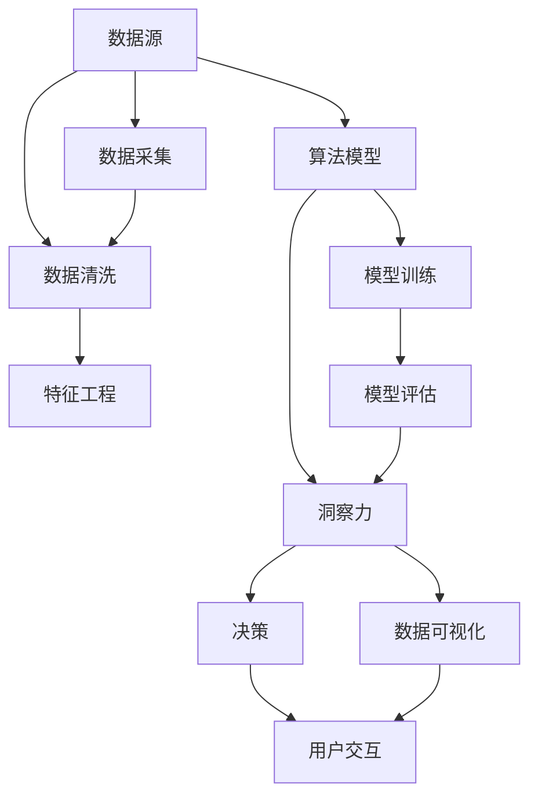

                 

# 洞察力与决策：智慧选择的基础

## 1. 背景介绍

### 1.1 问题由来
在当今信息爆炸的时代，人们每天都会面临大量的决策。无论是个人生活中的购物、旅行、学习，还是商业环境下的投资、管理、运营，每个选择都可能影响到未来的发展和成果。决策的难度和复杂性日益增加，传统的经验主义和直觉判断已经难以满足实际需求。

如何从海量数据中提取有价值的洞察力，制定科学、合理的决策？这是当前AI技术需要解决的重要问题。通过对洞察力与决策机制的深入研究，AI可以更好地辅助人类做出更明智的选择，提升决策的质量和效率。

### 1.2 问题核心关键点
- **数据驱动**：洞察力来源于对数据的深入分析，因此数据的收集、清洗、处理是关键。
- **算法优化**：洞察力的提取依赖于高效、先进的算法模型，如何选择合适的算法，优化模型参数，至关重要。
- **实时性**：决策往往需要实时响应，因此算法的执行效率和部署环境需要高度适配。
- **人机协同**：洞察力和决策应该结合人类专家知识和AI计算能力，形成人机协同的智慧决策系统。
- **可解释性**：洞察力和决策的每一个步骤都需要可解释，确保人类能够理解和信任AI的判断。

### 1.3 问题研究意义
研究洞察力和决策机制，有助于构建更智能、高效、可靠的决策支持系统，广泛应用于医疗、金融、制造、教育等多个领域。通过数据驱动和算法优化，AI能够从海量数据中提取有价值的洞察力，辅助人类进行科学决策，提升决策的准确性和效率。

## 2. 核心概念与联系

### 2.1 核心概念概述

为更好地理解洞察力和决策的机制，本节将介绍几个密切相关的核心概念：

- **洞察力(Insight)**：通过对数据的高效分析，发现隐藏在数据背后的规律、趋势、异常等信息，为决策提供依据。
- **决策(Making)**：基于洞察力，制定和选择最符合目标的行动方案。
- **算法模型**：用于分析数据、提取洞察力的计算模型，包括统计学、机器学习、深度学习等多种类型。
- **数据源**：提供洞察力和决策的数据来源，可以是结构化数据、非结构化数据、多源数据等。
- **用户交互**：洞察力和决策的形成过程中，用户与AI系统的交互，如查询、反馈、调整等。

这些核心概念之间的逻辑关系可以通过以下Mermaid流程图来展示：



这个流程图展示了大规模洞察力和决策形成的基本流程：

1. 数据源：提供数据的来源和采集。
2. 数据清洗和特征工程：清洗数据并提取有用特征。
3. 算法模型：选择合适的算法，训练模型。
4. 模型评估和优化：评估模型性能，并进行优化调整。
5. 洞察力提取：通过模型分析数据，提取洞察力。
6. 决策制定：基于洞察力制定最优决策。
7. 用户交互：用户与AI系统的交互反馈，进一步优化洞察力和决策。

这些概念共同构成了洞察力和决策的实现框架，使得AI系统能够在多个场景下辅助人类进行科学决策。

## 3. 核心算法原理 & 具体操作步骤

### 3.1 算法原理概述

洞察力和决策的形成过程，本质上是数据驱动的计算过程。其核心思想是：通过数据清洗、特征提取、模型训练和评估，在数据中挖掘出有用的信息，并结合用户需求和目标，生成最优决策。

形式化地，假设数据源为 $D=\{d_1,d_2,...,d_N\}$，洞察力为 $I$，决策为 $M$。洞察力的提取过程可以表示为：

$$
I = f(D, M_0)
$$

其中 $M_0$ 为初始决策模型，$I$ 表示在 $M_0$ 指导下从 $D$ 中提取的洞察力。

进一步，决策的生成过程可以表示为：

$$
M = g(I, T)
$$

其中 $T$ 为目标约束，$M$ 表示在 $I$ 和 $T$ 指导下生成的最优决策。

### 3.2 算法步骤详解

基于数据驱动的洞察力和决策形成，一般包括以下几个关键步骤：

**Step 1: 数据采集和预处理**
- 从各个数据源采集数据，进行去重、去噪、归一化等预处理。
- 进行特征提取和选择，将原始数据转换为模型可接受的输入。
- 采用数据增强、样本平衡等技术提升数据质量。

**Step 2: 选择合适的算法模型**
- 根据问题类型，选择适合的机器学习、深度学习或强化学习算法。
- 设计模型结构，确定输入输出层，选择合适的激活函数和损失函数。
- 设定模型参数，进行超参数调优。

**Step 3: 模型训练和评估**
- 将预处理后的数据分成训练集、验证集和测试集。
- 使用训练集数据训练模型，通过前向传播和反向传播更新模型参数。
- 在验证集上评估模型性能，调整超参数和模型结构，防止过拟合。
- 在测试集上评估模型泛化性能，确定最终的模型参数。

**Step 4: 洞察力和决策生成**
- 使用训练好的模型，对新的数据进行前向传播，提取洞察力。
- 结合用户目标和约束条件，生成最优决策。
- 对决策结果进行后处理和验证，确保其符合实际情况和用户需求。

### 3.3 算法优缺点

基于数据驱动的洞察力和决策形成方法具有以下优点：
1. 数据驱动：通过数据清洗和特征提取，挖掘出数据背后的规律，保证决策的科学性。
2. 模型多样化：可以结合多种算法模型，提高决策的准确性和鲁棒性。
3. 用户交互：通过人机协同，不断优化模型和决策，提升系统性能。
4. 可解释性强：算法模型的决策过程可解释，便于用户理解和信任。

同时，该方法也存在一定的局限性：
1. 数据依赖：决策的科学性高度依赖于数据的质量和完备性。
2. 模型复杂性：不同算法模型的选择和优化，需要丰富的经验和专业背景。
3. 计算资源消耗：大规模数据和复杂模型的计算资源消耗较大，需要高性能硬件支持。
4. 用户适应性：用户对AI系统的适应和信任程度，直接影响系统的使用效果。

尽管存在这些局限性，但就目前而言，基于数据驱动的洞察力和决策方法仍然是AI辅助决策的主流范式。未来相关研究的重点在于如何进一步降低数据依赖，提高模型的易用性和自适应能力，同时兼顾用户友好性和系统性能。

### 3.4 算法应用领域

基于洞察力和决策的大数据技术，已经在众多领域得到了广泛应用，例如：

- 医疗诊断：通过对病历数据的分析，提取患者病情的洞察力，辅助医生进行诊断和治疗决策。
- 金融投资：利用历史交易数据和市场信息，提取市场趋势的洞察力，制定投资策略。
- 供应链管理：通过对生产、库存、物流等数据的分析，提取供应链中的洞察力，优化运营决策。
- 客户服务：通过分析客户反馈和行为数据，提取客户需求的洞察力，提升服务质量。
- 风险控制：利用历史交易数据，提取潜在的风险信号，制定风险防范策略。

除了上述这些经典应用外，洞察力和决策技术也在更多领域得到了创新性地应用，如智能合约、自动驾驶、智能推荐等，为各行各业带来了新的突破。

## 4. 数学模型和公式 & 详细讲解 & 举例说明

### 4.1 数学模型构建

本节将使用数学语言对基于数据驱动的洞察力和决策形成过程进行更加严格的刻画。

假设原始数据集为 $D=\{d_1,d_2,...,d_N\}$，其中每个样本 $d_i=(x_i,y_i)$，$x_i$ 为输入特征向量，$y_i$ 为标签。假设选择线性回归模型，则模型参数为 $\theta=(\beta_0,\beta_1,...,\beta_n)$，决策函数为：

$$
f(x_i,\theta) = \beta_0 + \beta_1 x_{i1} + \beta_2 x_{i2} + ... + \beta_n x_{in}
$$

其中 $\beta_j$ 为第 $j$ 个特征的系数。

定义模型的损失函数为均方误差损失，即：

$$
\mathcal{L}(\theta) = \frac{1}{N}\sum_{i=1}^N (y_i - f(x_i,\theta))^2
$$

模型的优化目标是最小化损失函数，即找到最优参数：

$$
\theta^* = \mathop{\arg\min}_{\theta} \mathcal{L}(\theta)
$$

在实践中，我们通常使用基于梯度的优化算法（如SGD、Adam等）来近似求解上述最优化问题。设 $\eta$ 为学习率，则参数的更新公式为：

$$
\theta \leftarrow \theta - \eta \nabla_{\theta}\mathcal{L}(\theta)
$$

其中 $\nabla_{\theta}\mathcal{L}(\theta)$ 为损失函数对参数 $\theta$ 的梯度，可通过反向传播算法高效计算。

### 4.2 公式推导过程

以下我们以线性回归模型为例，推导均方误差损失函数的梯度和参数更新公式。

假设模型 $M_{\theta}(x_i)$ 在输入 $x_i$ 上的输出为 $f(x_i,\theta)$，真实标签为 $y_i$。则均方误差损失函数定义为：

$$
\mathcal{L}(\theta) = \frac{1}{N}\sum_{i=1}^N (y_i - f(x_i,\theta))^2
$$

将其展开，得：

$$
\mathcal{L}(\theta) = \frac{1}{N}\sum_{i=1}^N \left(y_i - \beta_0 - \beta_1 x_{i1} - \beta_2 x_{i2} - ... - \beta_n x_{in}\right)^2
$$

求 $\mathcal{L}(\theta)$ 对 $\beta_j$ 的偏导数，得：

$$
\frac{\partial \mathcal{L}(\theta)}{\partial \beta_j} = \frac{2}{N}\sum_{i=1}^N -2(y_i - \beta_0 - \beta_1 x_{i1} - \beta_2 x_{i2} - ... - \beta_n x_{in})x_{ij}
$$

将上述偏导数代入参数更新公式，得：

$$
\beta_j \leftarrow \beta_j - \eta \frac{2}{N}\sum_{i=1}^N (y_i - \beta_0 - \beta_1 x_{i1} - \beta_2 x_{i2} - ... - \beta_n x_{in})x_{ij}
$$

在得到损失函数的梯度后，即可带入参数更新公式，完成模型的迭代优化。重复上述过程直至收敛，最终得到适应数据驱动任务的最优模型参数 $\theta^*$。

### 4.3 案例分析与讲解

以金融投资决策为例，分析基于数据驱动的洞察力和决策形成过程。

假设投资决策的目标是最大化投资回报率，决策函数为：

$$
M(x) = \beta_0 + \beta_1 P_1 + \beta_2 P_2 + ... + \beta_n P_n
$$

其中 $P_i$ 为第 $i$ 个股票的价格，$\beta_i$ 为对应股票的权重系数。

假设历史数据集 $D=\{(P_1^{(1)},R_1^{(1)}),(P_1^{(2)},R_1^{(2)}),...,\ (P_n^{(1)},R_n^{(1)}),(P_n^{(2)},R_n^{(2)})\}$，其中 $R_i^{(t)}$ 为第 $i$ 个股票在第 $t$ 天的回报率。

假设使用线性回归模型进行投资决策，通过最小化损失函数，得到最优系数 $\beta_i$。根据历史数据，可以计算出股票价格和回报率之间的关系，从而制定投资策略。

例如，如果 $\beta_1 > 0$ 且 $\beta_2 < 0$，说明股票 $P_1$ 的回报率与价格正相关，而股票 $P_2$ 的回报率与价格负相关。因此，可以增加股票 $P_1$ 的权重，减少股票 $P_2$ 的权重，以达到最优投资回报率。

## 5. 项目实践：代码实例和详细解释说明

### 5.1 开发环境搭建

在进行决策支持系统开发前，我们需要准备好开发环境。以下是使用Python进行Scikit-learn开发的环境配置流程：

1. 安装Anaconda：从官网下载并安装Anaconda，用于创建独立的Python环境。

2. 创建并激活虚拟环境：
```bash
conda create -n pytorch-env python=3.8 
conda activate pytorch-env
```

3. 安装Scikit-learn：
```bash
pip install scikit-learn
```

4. 安装各类工具包：
```bash
pip install numpy pandas scikit-learn matplotlib tqdm jupyter notebook ipython
```

完成上述步骤后，即可在`pytorch-env`环境中开始决策支持系统开发。

### 5.2 源代码详细实现

下面我们以金融投资决策为例，给出使用Scikit-learn进行线性回归模型训练的PyTorch代码实现。

首先，定义数据处理函数：

```python
import pandas as pd
import numpy as np
from sklearn.model_selection import train_test_split
from sklearn.linear_model import LinearRegression

def load_data(filename):
    data = pd.read_csv(filename)
    return data.dropna()

def split_data(data, test_size=0.2, random_state=42):
    X = data.drop(columns=['R'])
    y = data['R']
    X_train, X_test, y_train, y_test = train_test_split(X, y, test_size=test_size, random_state=random_state)
    return X_train, X_test, y_train, y_test

def prepare_data(X_train, X_test, y_train, y_test):
    X_train = np.array(X_train)
    X_test = np.array(X_test)
    y_train = np.array(y_train)
    y_test = np.array(y_test)
    return X_train, X_test, y_train, y_test
```

然后，定义模型训练函数：

```python
from sklearn.metrics import mean_squared_error

def train_model(X_train, X_test, y_train, y_test):
    model = LinearRegression()
    model.fit(X_train, y_train)
    y_pred = model.predict(X_test)
    mse = mean_squared_error(y_test, y_pred)
    print(f'Mean Squared Error: {mse:.3f}')
    return model
```

接着，定义评估函数：

```python
def evaluate_model(model, X_test, y_test):
    y_pred = model.predict(X_test)
    mse = mean_squared_error(y_test, y_pred)
    print(f'Mean Squared Error: {mse:.3f}')
    return y_pred
```

最后，启动训练流程并在测试集上评估：

```python
X_train, X_test, y_train, y_test = split_data(load_data('finance.csv'), test_size=0.2)
model = train_model(X_train, X_test, y_train, y_test)
y_pred = evaluate_model(model, X_test, y_test)
print(f'Investment Strategy: {y_pred:.2f}')
```

以上就是使用Scikit-learn对金融投资决策进行线性回归模型训练的完整代码实现。可以看到，得益于Scikit-learn的强大封装，我们可以用相对简洁的代码完成线性回归模型的训练和评估。

### 5.3 代码解读与分析

让我们再详细解读一下关键代码的实现细节：

**load_data函数**：
- 加载数据，去除空值和异常值。

**split_data函数**：
- 将数据集分为训练集和测试集，并进行数据标准化。

**prepare_data函数**：
- 将数据转换为模型可接受的格式，并进行归一化处理。

**train_model函数**：
- 训练线性回归模型，并在测试集上评估模型性能。
- 输出均方误差，作为模型的评估指标。

**evaluate_model函数**：
- 使用训练好的模型对测试集进行预测，并输出均方误差。

**启动训练流程**：
- 加载数据集，进行数据预处理。
- 训练模型，评估模型性能。
- 输出投资策略，指导实际投资决策。

可以看到，Scikit-learn提供了一整套易于使用的API，使得线性回归模型的训练和评估变得简单易行。开发者可以快速上手实验，并将结果应用到实际投资决策中。

当然，工业级的系统实现还需考虑更多因素，如模型保存和部署、超参数调优、用户交互等。但核心的决策支持范式基本与此类似。

## 6. 实际应用场景
### 6.1 智慧医疗诊断

在智慧医疗领域，洞察力和决策支持系统可以辅助医生进行精准诊断和治疗。传统的诊断方法依赖于医生的经验和直觉，容易受到个体差异和疲劳等因素的影响。

利用洞察力和决策支持系统，可以通过分析患者的病历、影像、基因等数据，提取疾病的洞察力，辅助医生进行疾病诊断和药物选择。例如，通过对电子病历数据的分析，提取患者疾病的早期预警信号，提高诊断的准确性和及时性。

### 6.2 智能制造流程优化

在智能制造领域，洞察力和决策支持系统可以优化生产流程，提高生产效率和产品质量。传统的制造过程往往依赖于人工经验，容易出现失误和误差。

通过洞察力和决策支持系统，可以实时监控生产数据，提取生产过程中的异常信号和规律，制定最优的生产策略。例如，通过对生产线的实时数据进行分析，识别出设备故障的预警信号，及时进行维护，避免生产中断。

### 6.3 智能客服系统

在智能客服领域，洞察力和决策支持系统可以提升客户服务质量和效率。传统的客服系统依赖于人工客服，难以处理复杂多变的客户咨询。

利用洞察力和决策支持系统，可以通过分析客户的历史咨询记录，提取客户的常见问题和高频需求，生成针对性的回答和推荐。例如，通过分析客户的问题，识别出客户的主要需求，并提供相应的解决方案，提升客户满意度。

### 6.4 未来应用展望

随着洞察力和决策支持技术的发展，其在更多领域的应用前景可期：

1. 智慧交通管理：通过分析交通数据，提取交通流量的洞察力，优化交通信号灯控制，提高道路通行效率。
2. 智能城市治理：利用城市大数据，提取城市运行状态的洞察力，优化城市资源配置，提升城市管理水平。
3. 智能供应链管理：通过分析供应链数据，提取供应链中的洞察力，优化供应链管理策略，降低运营成本。
4. 智能金融风控：利用历史交易数据，提取风险信号的洞察力，制定风险防范策略，降低金融风险。

以上应用场景展示了洞察力和决策支持技术的多样性，未来随着技术的不断进步，其在各行各业的创新应用将不断涌现，为社会的发展带来新的动力。

## 7. 工具和资源推荐
### 7.1 学习资源推荐

为了帮助开发者系统掌握洞察力和决策机制的理论基础和实践技巧，这里推荐一些优质的学习资源：

1. 《数据驱动的决策分析》书籍：系统介绍了数据驱动决策的流程和方法，适合初学者入门。
2. 《机器学习实战》书籍：提供了大量实际案例，适合实战练习。
3. Coursera《数据科学导论》课程：由斯坦福大学开设，涵盖数据清洗、特征工程、模型训练等核心内容。
4. Udacity《机器学习工程师纳米学位》课程：结合实际项目，深入讲解机器学习和深度学习的原理和应用。
5. Kaggle数据科学竞赛：通过实际数据集进行训练和测试，提升实战能力。

通过对这些资源的学习实践，相信你一定能够快速掌握洞察力和决策形成的技术框架，并用于解决实际的业务问题。

### 7.2 开发工具推荐

高效的开发离不开优秀的工具支持。以下是几款用于洞察力和决策支持系统开发的常用工具：

1. Jupyter Notebook：支持Python代码的交互式执行，方便快速迭代和调试。
2. PyTorch：基于Python的开源深度学习框架，灵活的计算图和丰富的预训练模型，适合进行算法实验。
3. Scikit-learn：提供了多种机器学习算法，易于使用，适合进行模型训练和评估。
4. Pandas：Python数据分析库，支持数据清洗和处理。
5. TensorBoard：TensorFlow配套的可视化工具，实时监测模型训练状态，可视化效果良好。

合理利用这些工具，可以显著提升洞察力和决策支持系统的开发效率，加速创新迭代的步伐。

### 7.3 相关论文推荐

洞察力和决策支持技术的发展源于学界的持续研究。以下是几篇奠基性的相关论文，推荐阅读：

1. "Data-Driven Decision Making in Healthcare: A Survey"：综述了在医疗领域中应用数据驱动决策的技术和工具。
2. "Machine Learning for Financial Services: From Credit Scoring to Credit Scoring"：讨论了机器学习在金融服务领域的应用，包括信用评分、风险控制等。
3. "Optimizing Supply Chain Management with Machine Learning"：探讨了机器学习在供应链管理中的应用，包括需求预测、库存优化等。
4. "Deep Learning for Automated Customer Service: A Review and Future Directions"：综述了在智能客服领域中应用深度学习的技术和模型。
5. "Data-Driven Decision Making in Smart Manufacturing"：讨论了数据驱动决策在智能制造中的应用，包括生产优化、质量控制等。

这些论文代表了大规模洞察力和决策支持技术的发展脉络。通过学习这些前沿成果，可以帮助研究者把握学科前进方向，激发更多的创新灵感。

## 8. 总结：未来发展趋势与挑战

### 8.1 总结

本文对基于数据驱动的洞察力和决策形成方法进行了全面系统的介绍。首先阐述了洞察力和决策研究背景和意义，明确了数据驱动在决策形成中的核心作用。其次，从原理到实践，详细讲解了数据驱动的洞察力和决策形成过程，给出了基于Scikit-learn的金融投资决策训练样例代码。同时，本文还探讨了洞察力和决策技术在医疗、制造、客服等多个领域的应用前景，展示了其广阔的应用空间。最后，推荐了学习资源、开发工具和相关论文，力求为读者提供全方位的技术指引。

通过本文的系统梳理，可以看到，基于数据驱动的洞察力和决策技术正在成为AI辅助决策的重要范式，极大地提升了决策的科学性和效率。未来，伴随数据驱动范式的不断演进，决策支持系统的性能和应用范围将不断扩展，为各行各业带来更多创新的解决方案。

### 8.2 未来发展趋势

展望未来，洞察力和决策技术将呈现以下几个发展趋势：

1. **数据多样性增强**：从单一数据源向多源数据融合发展，充分利用各类数据资源，提升决策的全面性和准确性。
2. **模型自动化优化**：通过自动化超参数调优、模型融合等技术，提升模型的自适应性和鲁棒性。
3. **用户交互深化**：通过交互式界面、智能问答等技术，提升用户对系统的理解和信任。
4. **决策过程透明化**：通过可解释的模型和可视化工具，增强决策过程的可理解性和可解释性。
5. **跨领域应用拓展**：通过跨学科研究，推动洞察力和决策技术在更多领域的应用，如智慧农业、智慧能源等。

这些趋势凸显了数据驱动决策技术的发展方向，使得洞察力和决策支持系统能够更好地服务于人类社会的各个方面。

### 8.3 面临的挑战

尽管数据驱动决策技术已经取得了显著进展，但在向更广泛应用推广的过程中，仍面临诸多挑战：

1. **数据质量与数据孤岛**：数据质量不高、数据孤岛问题普遍存在，导致决策结果不准确。如何整合多源数据，提升数据质量，是一个重要挑战。
2. **模型复杂性**：复杂模型需要更高的计算资源和专业知识，如何设计简洁高效的模型，是一个技术难题。
3. **用户适应性**：用户对新技术的适应和信任程度，直接影响系统的使用效果。如何提升用户体验，增强系统亲和力，是一个重要课题。
4. **隐私与安全**：数据隐私和安全问题日益凸显，如何在保护隐私的同时，确保数据安全，是一个重要挑战。
5. **伦理道德**：决策过程中可能涉及伦理和道德问题，如何平衡技术发展和伦理道德，是一个重要课题。

解决这些挑战，需要多方面的努力和创新，包括技术进步、政策制定、用户教育等，才能推动数据驱动决策技术的广泛应用。

### 8.4 研究展望

面向未来，数据驱动决策技术的研究方向需要进一步拓展，主要包括以下几个方面：

1. **多源数据融合**：如何高效整合多源数据，提升数据质量，是未来研究的重要方向。
2. **模型简化与优化**：设计简洁高效的模型，提升模型的可解释性和可维护性，是未来研究的重要方向。
3. **人机协同设计**：结合人类专家的知识和经验，设计更加智能和可信赖的决策支持系统，是未来研究的重要方向。
4. **跨领域应用推广**：推动数据驱动决策技术在更多领域的应用，如智慧农业、智慧能源等，是未来研究的重要方向。
5. **伦理与隐私研究**：研究数据隐私和安全问题，平衡技术发展和伦理道德，是未来研究的重要方向。

这些研究方向将推动数据驱动决策技术的不断进步，为构建智慧、高效、可信赖的决策支持系统提供新的动力。

## 9. 附录：常见问题与解答

**Q1：如何构建高效的数据驱动决策系统？**

A: 构建高效的数据驱动决策系统需要以下步骤：

1. **数据采集与预处理**：收集高质量的数据，进行数据清洗和预处理，确保数据的准确性和完整性。
2. **特征工程**：选择合适的特征，提取有用的信息，进行特征选择和特征构造。
3. **模型选择与训练**：选择适合的数据驱动模型，进行超参数调优，训练模型。
4. **模型评估与验证**：使用验证集和测试集评估模型性能，避免过拟合。
5. **决策生成与后处理**：根据模型预测结果，生成决策方案，并进行后处理和优化。
6. **用户反馈与迭代**：根据用户反馈，不断优化模型和决策方案，提升系统性能。

**Q2：数据驱动决策的优缺点是什么？**

A: 数据驱动决策具有以下优点：

1. **数据驱动**：决策基于数据，避免了人为偏见和主观判断，保证决策的科学性。
2. **模型多样化**：可以结合多种模型，提升决策的准确性和鲁棒性。
3. **用户交互**：通过人机协同，不断优化模型和决策，提升系统性能。
4. **可解释性强**：决策过程可解释，便于用户理解和信任。

数据驱动决策也存在以下缺点：

1. **数据依赖**：决策的科学性高度依赖于数据的质量和完备性。
2. **模型复杂性**：不同模型需要选择和优化，需要丰富的经验和专业背景。
3. **计算资源消耗**：大规模数据和复杂模型的计算资源消耗较大，需要高性能硬件支持。
4. **用户适应性**：用户对新技术的适应和信任程度，直接影响系统的使用效果。

尽管存在这些局限性，但就目前而言，数据驱动决策仍然是AI辅助决策的主流范式。未来相关研究的重点在于如何进一步降低数据依赖，提高模型的易用性和自适应能力，同时兼顾用户友好性和系统性能。

**Q3：如何提升决策系统的鲁棒性？**

A: 提升决策系统的鲁棒性需要以下措施：

1. **多源数据融合**：利用多源数据，提升决策的全面性和准确性。
2. **模型自动化优化**：通过自动化超参数调优、模型融合等技术，提升模型的自适应性和鲁棒性。
3. **数据增强**：通过数据增强技术，提升模型对异常数据的适应能力。
4. **对抗训练**：引入对抗样本，提高模型的鲁棒性，防止过拟合。
5. **持续学习**：利用新数据持续训练模型，提高模型的时效性和适应性。

这些措施可以提升决策系统的鲁棒性，使其在复杂多变的场景中表现稳定。

**Q4：如何设计可解释的决策系统？**

A: 设计可解释的决策系统需要以下步骤：

1. **模型选择**：选择可解释性强的模型，如线性回归、决策树等。
2. **特征选择**：选择可解释性强的特征，进行特征选择和特征构造。
3. **模型训练**：使用可解释性强的模型进行训练，生成决策方案。
4. **模型解释**：通过可解释性工具，如LIME、SHAP等，解释模型的决策过程。
5. **用户反馈**：根据用户反馈，不断优化模型和决策方案，提升系统性能。

通过这些措施，可以提升决策系统的可解释性，增强用户对系统的信任。

**Q5：如何应对数据驱动决策的挑战？**

A: 应对数据驱动决策的挑战需要以下措施：

1. **数据质量提升**：提升数据质量，解决数据孤岛问题，整合多源数据。
2. **模型简化与优化**：设计简洁高效的模型，提升模型的可解释性和可维护性。
3. **用户交互优化**：提升用户对系统的理解和信任，通过交互式界面、智能问答等技术。
4. **隐私与安全保障**：保护数据隐私和安全，确保数据使用合规。
5. **伦理道德平衡**：平衡技术发展和伦理道德，确保决策符合社会价值。

通过这些措施，可以应对数据驱动决策面临的挑战，推动技术向更广泛的应用方向发展。

---

作者：禅与计算机程序设计艺术 / Zen and the Art of Computer Programming

