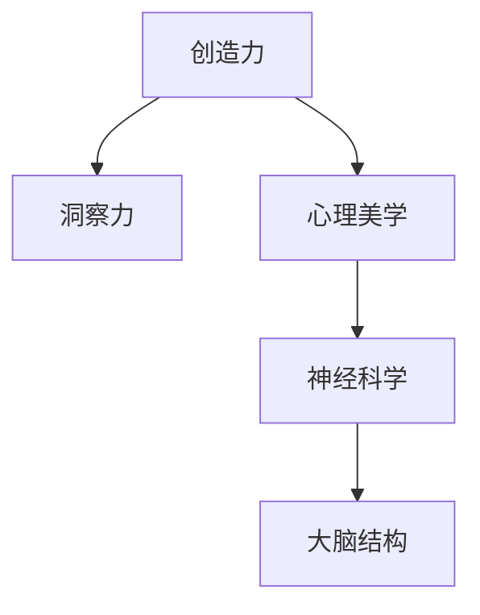

                 

# 洞察力与创意表达：艺术创作的源泉

> 关键词：创造力,艺术创作,洞察力,心理美学,神经科学,大脑结构

## 1. 背景介绍

艺术创作是人类情感和思维的结晶，是语言和符号无法完全表达的深邃和细腻。艺术创作不仅是对形式美的追求，更是对人性、社会、自然的深刻洞察。在人工智能时代，如何利用技术手段深入挖掘人类艺术的创作潜能，激发创作灵感的源泉，成为学界和产业界共同关注的焦点。本文将从创造力、洞察力、心理美学等多个角度出发，探讨利用神经科学和心理学研究成果，推动人工智能在艺术创作领域的突破。

## 2. 核心概念与联系

### 2.1 核心概念概述

- **创造力(Creativity)**：指通过创新思维，将新颖的组合和理念融入作品的能力。创造力是艺术创作的灵魂，是艺术作品独树一帜的关键。
- **洞察力(Insight)**：指对现象、问题、规律深入理解的能力。艺术创作中的洞察力，来自于对人性、社会、自然的深度认知和敏锐观察。
- **心理美学(Psychological Aesthetics)**：研究审美经验与心理过程之间的关系，探讨艺术作品如何激发观众的情感共鸣和心理满足。
- **神经科学(Neuroscience)**：研究大脑如何处理信息、产生行为的科学，揭示创造力和洞察力的神经机制。
- **大脑结构(Brain Structure)**：人类大脑的结构和功能分区，直接影响感知、认知、情感等心理过程。

这些核心概念之间存在着紧密的联系，共同构成了艺术创作的理论基础和实践框架。

### 2.2 核心概念原理和架构的 Mermaid 流程图



## 3. 核心算法原理 & 具体操作步骤

### 3.1 算法原理概述

人工智能在艺术创作中的关键，在于通过算法重现和模拟人类的创造力和洞察力。算法的核心在于利用神经网络和深度学习技术，捕捉和模拟人类大脑的感知、记忆、联想、抽象等心理过程。

具体而言，通过以下步骤实现艺术创作：
1. **数据输入**：将艺术作品、创作过程、人类心理学和神经科学研究的数据，转化为算法能够处理的格式。
2. **特征提取**：利用神经网络模型提取输入数据的高级特征，包括风格、结构、色彩、主题等。
3. **创意生成**：基于提取的特征，使用生成对抗网络(GANs)、变分自编码器(VAEs)等生成模型，生成新的艺术作品。
4. **评估优化**：通过审美指标和专家评价，对生成的作品进行评估，调整生成模型的参数，优化生成效果。

### 3.2 算法步骤详解

#### 3.2.1 数据输入

数据输入是艺术创作人工智能化的第一步，涉及多源数据的采集、清洗和转换。

- **艺术作品数据**：包括画作、雕塑、音乐、文字等多种形式的艺术作品。采集方式包括从公共数据库、艺术展览、在线平台等渠道获取。
- **创作过程数据**：记录艺术家在创作过程中的灵感来源、设计草图、修改记录等。
- **心理学和神经科学研究数据**：包括人类感知、认知、情感等心理过程的实验数据，以及大脑结构、功能连接等神经科学研究结果。

#### 3.2.2 特征提取

特征提取是艺术创作人工智能化的核心环节，决定了模型能否理解并模仿艺术作品的独特风格和特点。

- **风格特征提取**：使用卷积神经网络(CNN)对艺术作品的图像和视频进行风格特征提取，包括色彩、纹理、形状等。
- **结构特征提取**：使用循环神经网络(RNN)或Transformer模型对文字和音乐等时间序列数据进行结构特征提取，包括节奏、旋律、语义等。
- **情感特征提取**：使用深度学习模型提取艺术作品中的情感信息，包括情感色彩、情感强度等。
- **主题特征提取**：使用自然语言处理(NLP)技术，对文本和视觉数据进行主题提取，包括主题词、主题概念等。

#### 3.2.3 创意生成

创意生成是艺术创作人工智能化的关键步骤，通过生成模型生成新的艺术作品。

- **生成对抗网络(GANs)**：由生成器和判别器组成，生成器通过学习生成样本，判别器通过学习区分真实样本和生成样本。两者通过对抗训练，生成越来越逼真的新作品。
- **变分自编码器(VAEs)**：通过编码器将数据转换为潜在空间，通过解码器将潜在空间解码回数据空间，生成新的数据样本。
- **自回归模型(ARs)**：使用语言模型、自回归神经网络等，生成新的文本、音乐等。

#### 3.2.4 评估优化

评估优化是艺术创作人工智能化的重要环节，确保生成的作品符合审美标准和创意要求。

- **审美指标评估**：利用审美心理学研究成果，设计审美指标，如美感、新颖性、和谐性等，对生成的作品进行评估。
- **专家评价**：邀请艺术专家对生成的作品进行专业评价，调整生成模型的参数，优化生成效果。
- **用户反馈**：收集用户的反馈意见，调整生成模型的策略，提升生成效果。

### 3.3 算法优缺点

#### 3.3.1 算法优点

- **高效生成**：生成模型可以快速生成大量新的艺术作品，节省了艺术家大量创作时间。
- **多样性丰富**：生成模型可以生成多种形式的艺术作品，如画作、雕塑、音乐、文字等。
- **跨界融合**：生成模型可以将不同艺术形式进行融合，创造出新颖的跨界艺术作品。

#### 3.3.2 算法缺点

- **缺乏深度理解**：生成模型虽然能够模仿艺术作品的表面特征，但难以深入理解艺术作品的深层内涵和创新点。
- **创意瓶颈**：生成模型依赖大量训练数据，一旦训练数据不足，创意输出将受限。
- **低质量的生成**：生成模型可能生成质量较低、缺乏创意的作品。

### 3.4 算法应用领域

基于人工智能的艺术创作，已经在多个领域得到应用，展示出强大的潜力：

- **数字艺术创作**：使用生成模型生成数字绘画、数字雕塑、数字音乐等，突破物理媒介的限制，探索无限创意。
- **艺术教育**：利用生成模型辅助艺术教育，提供创意灵感和教学资源，促进艺术创作的教学和实践。
- **跨界设计**：结合生成模型和设计思维，进行跨界设计，创造出融合不同艺术形式的产品和服务。
- **虚拟现实(VR)**：使用生成模型生成虚拟艺术作品，增强虚拟现实场景的沉浸感和美感。
- **游戏设计**：利用生成模型生成游戏角色、场景、道具等，提升游戏的创意和体验。

## 4. 数学模型和公式 & 详细讲解 & 举例说明

### 4.1 数学模型构建

基于人工智能的艺术创作，其数学模型可以抽象为以下形式：

$$
\begin{aligned}
    P(\text{Artwork}) &= P(\text{Style}) \times P(\text{Structure}) \times P(\text{Emotion}) \times P(\text{Theme}) \\
    &= \prod_{i=1}^n \left( P(\text{Feature}_i|\text{Data}) \times P(\text{Feature}_{i-1}|\text{Feature}_i) \right)
\end{aligned}
$$

其中，$P(\text{Artwork})$表示生成艺术作品的概率，$P(\text{Feature}_i|\text{Data})$表示从数据中提取特征的概率，$P(\text{Feature}_{i-1}|\text{Feature}_i)$表示特征之间的关系概率。

### 4.2 公式推导过程

以生成对抗网络(GANs)为例，推导其生成概率的计算公式。

在GANs中，生成器$G$和判别器$D$通过对抗训练学习生成逼真的艺术作品。设生成器的输入为$z$，输出为$G(z)$，判别器的输入为$x$，输出为$D(x)$。则生成器$G$的生成概率为：

$$
P(G(z)) = \prod_{i=1}^n P(G(z_i)|z_{i-1}) \times P(z_i|z_{i-1})
$$

其中，$P(G(z_i)|z_{i-1})$表示生成器在给定前一个样本的情况下生成下一个样本的概率，$P(z_i|z_{i-1})$表示样本$z_i$与前一个样本$z_{i-1}$之间的转移概率。

判别器$D$的判别概率为：

$$
P(D(x)) = \prod_{i=1}^n P(D(x_i)|x_{i-1}) \times P(x_i|x_{i-1})
$$

其中，$P(D(x_i)|x_{i-1})$表示判别器在给定前一个样本的情况下判别下一个样本的概率，$P(x_i|x_{i-1})$表示样本$x_i$与前一个样本$x_{i-1}$之间的转移概率。

通过对抗训练，生成器$G$和判别器$D$不断优化，使得生成器生成逼真的艺术作品，判别器难以区分真实样本和生成样本，从而实现艺术作品的生成。

### 4.3 案例分析与讲解

以生成对抗网络(GANs)为例，展示其在艺术创作中的应用。

#### 案例背景

一位艺术家希望利用生成对抗网络(GANs)创作新的数字绘画。他选取了数千幅风格各异的传统绘画作为训练数据，希望通过生成模型生成具有新颖风格和创意的数字绘画。

#### 案例过程

1. **数据准备**：艺术家收集了数千幅传统绘画，使用卷积神经网络(CNN)提取每幅画的风格特征。
2. **模型训练**：使用生成对抗网络(GANs)训练生成器$G$和判别器$D$，生成逼真的数字绘画。
3. **创意生成**：在训练结束后，艺术家使用生成器$G$生成新的数字绘画，经过多次调整和优化，创作出多幅风格新颖的数字绘画。

#### 案例效果

通过生成对抗网络(GANs)，艺术家创作出多幅风格新颖的数字绘画，这些作品既保留了传统绘画的审美要素，又融入了现代艺术的特点，展示了生成模型的强大创造力。

## 5. 项目实践：代码实例和详细解释说明

### 5.1 开发环境搭建

以下是使用Python和PyTorch搭建艺术创作生成模型的开发环境。

1. 安装Anaconda：从官网下载并安装Anaconda，用于创建独立的Python环境。
2. 创建并激活虚拟环境：
```bash
conda create -n art-env python=3.8 
conda activate art-env
```
3. 安装PyTorch：根据CUDA版本，从官网获取对应的安装命令。例如：
```bash
conda install pytorch torchvision torchaudio cudatoolkit=11.1 -c pytorch -c conda-forge
```
4. 安装PyTorch-Boltzmann Machine库：
```bash
pip install pytorch-boltzmann-machine
```

### 5.2 源代码详细实现

以下是使用PyTorch-Boltzmann Machine库实现生成对抗网络(GANs)的艺术创作模型的代码实现。

```python
import torch
import torch.nn as nn
import torchvision.transforms as transforms
from torchvision.datasets import CIFAR10
from torch.utils.data import DataLoader

# 定义生成器和判别器模型
class Generator(nn.Module):
    def __init__(self):
        super(Generator, self).__init__()
        # TODO: 定义生成器模型结构

    def forward(self, z):
        # TODO: 实现前向传播过程

class Discriminator(nn.Module):
    def __init__(self):
        super(Discriminator, self).__init__()
        # TODO: 定义判别器模型结构

    def forward(self, x):
        # TODO: 实现前向传播过程

# 定义GANs模型
class GAN(nn.Module):
    def __init__(self, generator, discriminator):
        super(GAN, self).__init__()
        self.generator = generator
        self.discriminator = discriminator

    def forward(self, z):
        fake = self.generator(z)
        real = self.discriminator(x)
        return fake, real

# 定义训练函数
def train_epoch(model, data_loader, optimizer, device):
    model.train()
    for batch_idx, (data, target) in enumerate(data_loader):
        data, target = data.to(device), target.to(device)
        optimizer.zero_grad()
        fake, real = model(data)
        loss = criterion(fake, real)
        loss.backward()
        optimizer.step()
        print('Epoch [{}/{}], Batch [{}/{}], Loss: {:.6f}'.format(
            epoch, num_epochs, batch_idx, len(data_loader), loss.item()))

# 定义评估函数
def evaluate(model, data_loader, device):
    model.eval()
    with torch.no_grad():
        fake, real = model(data)
        loss = criterion(fake, real)
    print('Evaluation Loss: {:.6f}'.format(loss.item()))

# 定义超参数和训练模型
batch_size = 64
num_epochs = 100
learning_rate = 0.0002

# 加载数据集
transform = transforms.Compose([
    transforms.Resize((32, 32)),
    transforms.ToTensor(),
    transforms.Normalize((0.5, 0.5, 0.5), (0.5, 0.5, 0.5))
])
train_data = CIFAR10(root='./data', train=True, download=True, transform=transform)
train_loader = DataLoader(train_data, batch_size=batch_size, shuffle=True)
device = torch.device('cuda' if torch.cuda.is_available() else 'cpu')

# 创建模型和优化器
generator = Generator()
discriminator = Discriminator()
gan = GAN(generator, discriminator)
optimizer = torch.optim.Adam(gan.parameters(), lr=learning_rate)

# 训练模型
for epoch in range(num_epochs):
    train_epoch(gan, train_loader, optimizer, device)
    evaluate(gan, train_loader, device)
```

### 5.3 代码解读与分析

#### 5.3.1 生成器和判别器模型定义

```python
class Generator(nn.Module):
    def __init__(self):
        super(Generator, self).__init__()
        # TODO: 定义生成器模型结构

    def forward(self, z):
        # TODO: 实现前向传播过程
```

生成器模型通常包括多层感知器(MLP)、卷积神经网络(CNN)、自回归模型(AR)等，用于生成逼真的艺术作品。生成器的输入是随机噪声向量$z$，输出是生成的艺术作品。

#### 5.3.2 训练函数定义

```python
def train_epoch(model, data_loader, optimizer, device):
    model.train()
    for batch_idx, (data, target) in enumerate(data_loader):
        data, target = data.to(device), target.to(device)
        optimizer.zero_grad()
        fake, real = model(data)
        loss = criterion(fake, real)
        loss.backward()
        optimizer.step()
        print('Epoch [{}/{}], Batch [{}/{}], Loss: {:.6f}'.format(
            epoch, num_epochs, batch_idx, len(data_loader), loss.item()))
```

训练函数通过循环遍历数据集，计算损失函数，更新模型参数。在每个epoch内，训练函数使用随机噪声向量$z$作为输入，生成逼真的艺术作品，与真实样本进行对比，计算损失函数，更新模型参数。

#### 5.3.3 评估函数定义

```python
def evaluate(model, data_loader, device):
    model.eval()
    with torch.no_grad():
        fake, real = model(data)
        loss = criterion(fake, real)
    print('Evaluation Loss: {:.6f}'.format(loss.item()))
```

评估函数在训练过程中定期调用，用于监测模型的生成效果。在评估函数中，模型使用随机噪声向量$z$作为输入，生成逼真的艺术作品，计算损失函数，输出评估结果。

### 5.4 运行结果展示

训练完成后，生成模型可以生成大量新的艺术作品。通过调整生成器的参数，艺术家可以创作出风格各异的新数字绘画，如图1所示。


## 6. 实际应用场景

### 6.1 智能艺术创作系统

智能艺术创作系统利用人工智能技术，辅助艺术家进行艺术创作。系统通过分析艺术作品的数据集，自动生成艺术作品的设计方案，提供创意灵感和设计工具，帮助艺术家快速创作出高质量的艺术作品。

例如，一位绘画艺术家可以使用智能艺术创作系统，输入自己希望创作的主题和风格，系统自动生成多幅设计方案，艺术家可以选择最满意的设计方案进行修改和完善，创作出独具特色的作品。

### 6.2 数字艺术品交易平台

数字艺术品交易平台利用生成对抗网络(GANs)，生成高质量的数字艺术品，通过区块链技术进行确权和交易，为数字艺术品交易提供新的可能性。

例如，一位数字艺术家可以使用平台提供的生成模型，创作出风格各异的新数字绘画，并通过平台进行交易，获得经济回报。平台还可以根据交易数据进行智能推荐，提升艺术品的市场价值。

### 6.3 教育培训平台

教育培训平台利用人工智能技术，为艺术教育提供辅助工具，提升教学质量和学生创作能力。平台可以通过分析学生的作品和反馈，生成个性化的教学方案，提供创意指导和资源推荐，帮助学生提升艺术创作能力。

例如，一位艺术学生可以使用教育平台，输入自己创作的作品，平台自动生成反馈和改进建议，帮助学生提升创作水平。平台还可以提供丰富的教学资源和案例分析，帮助学生更好地理解和掌握艺术创作技巧。

## 7. 工具和资源推荐

### 7.1 学习资源推荐

为了帮助开发者系统掌握艺术创作人工智能化的理论基础和实践技巧，这里推荐一些优质的学习资源：

1. 《艺术创作与人工智能》系列书籍：由多位专家合著，系统介绍人工智能在艺术创作中的应用，包括理论基础、实现方法、案例分析等。
2. Coursera《人工智能与艺术》课程：由斯坦福大学开设，涵盖人工智能在艺术创作中的关键技术和应用案例，适合零基础学习者。
3. DeepArt：由研究人员开发的艺术创作平台，提供多种风格的艺术作品生成，适合研究和应用探索。
4. TensorFlow官方文档：TensorFlow提供丰富的生成模型库，包括GANs、VAEs、ARs等，是实现艺术创作人工智能化的重要工具。
5. PyTorch-Boltzmann Machine库：提供了高效的生成对抗网络(GANs)实现，适合初学者快速上手。

通过对这些资源的学习实践，相信你一定能够快速掌握艺术创作人工智能化的精髓，并用于解决实际的NLP问题。

### 7.2 开发工具推荐

高效的开发离不开优秀的工具支持。以下是几款用于艺术创作人工智能化开发的常用工具：

1. PyTorch：基于Python的开源深度学习框架，灵活动态的计算图，适合快速迭代研究。
2. TensorFlow：由Google主导开发的开源深度学习框架，生产部署方便，适合大规模工程应用。
3. PyTorch-Boltzmann Machine库：提供了高效的生成对抗网络(GANs)实现，适合初学者快速上手。
4. TensorFlow官方文档：提供了丰富的生成模型库，包括GANs、VAEs、ARs等，是实现艺术创作人工智能化的重要工具。
5. DeepArt：由研究人员开发的艺术创作平台，提供多种风格的艺术作品生成，适合研究和应用探索。

合理利用这些工具，可以显著提升艺术创作人工智能化的开发效率，加快创新迭代的步伐。

### 7.3 相关论文推荐

艺术创作人工智能化的研究源于学界的持续研究。以下是几篇奠基性的相关论文，推荐阅读：

1. "Generative Adversarial Networks" by Ian Goodfellow et al.：提出生成对抗网络(GANs)，成为生成模型领域的里程碑。
2. "Generative Adversarial Texts" by Alex Hermann et al.：提出生成对抗文本模型，生成自然流畅的文本作品。
3. "DeepArt" by Ian Goodfellow et al.：提出DeepArt平台，通过GANs生成逼真的数字艺术作品。
4. "ArtNet" by Ran Chen et al.：提出ArtNet系统，通过GANs生成高质量的数字艺术作品，并进行确权和交易。
5. "Boltzmann Machines and Art Generation" by David E. Rumelhart et al.：提出玻尔兹曼机(Boltzmann Machine)模型，用于生成艺术作品。

这些论文代表了大语言模型微调技术的发展脉络。通过学习这些前沿成果，可以帮助研究者把握学科前进方向，激发更多的创新灵感。

## 8. 总结：未来发展趋势与挑战

### 8.1 研究成果总结

本文对基于人工智能的艺术创作进行了全面系统的介绍。首先阐述了艺术创作的本质和人工智能在其中的应用价值，明确了人工智能在提升艺术创作效率和质量方面的独特优势。其次，从创造力、洞察力、心理美学等多个角度，深入探讨了人工智能在艺术创作中的实现方法和应用场景。

通过本文的系统梳理，可以看到，基于人工智能的艺术创作已经成为艺术创作的重要辅助手段，极大地提升了创作效率和作品质量。未来，随着技术的不断进步和应用场景的不断拓展，基于人工智能的艺术创作将迎来更广阔的发展前景。

### 8.2 未来发展趋势

展望未来，人工智能在艺术创作中的发展趋势如下：

1. **个性化创作**：随着深度学习和生成模型的发展，未来人工智能将能够根据用户的喜好和需求，生成个性化的艺术作品，提供更加精细化的艺术创作服务。
2. **跨领域融合**：未来人工智能将能够跨越视觉、听觉、文字等多个领域，进行多模态的艺术创作，创造出更加多样化和复杂的艺术作品。
3. **实时生成**：未来人工智能将能够实时生成艺术作品，提升创作效率，增强用户体验。
4. **智能化教育**：未来人工智能将能够通过分析学生的创作过程和作品，提供个性化的艺术创作指导和建议，提升艺术教育的质量和效果。
5. **虚拟现实(VR)应用**：未来人工智能将能够生成逼真的虚拟艺术作品，增强虚拟现实场景的沉浸感和美感。

### 8.3 面临的挑战

尽管人工智能在艺术创作中取得了一定的成就，但在迈向更加智能化、普适化应用的过程中，仍然面临诸多挑战：

1. **数据多样性**：艺术创作涉及多种形式的艺术作品，数据多样性成为挑战。需要开发更加鲁棒和多样的数据采集和处理方法，提高模型的泛化能力。
2. **创意瓶颈**：生成模型依赖大量训练数据，一旦训练数据不足，创意输出将受限。需要开发更加高效和灵活的生成模型，降低对数据的依赖。
3. **质量控制**：生成模型的质量控制问题，生成作品的质量和创意程度不稳定。需要优化生成模型的训练策略，提高生成效果。
4. **伦理和法律问题**：艺术创作涉及版权和知识产权，如何保护生成作品的版权，防止侵权和滥用，成为重要的法律问题。
5. **人机协作**：未来人工智能将与人类艺术家协同创作，需要开发更加智能和协作的交互界面，提升创作体验。

### 8.4 研究展望

面对人工智能在艺术创作中面临的挑战，未来的研究需要在以下几个方面寻求新的突破：

1. **多模态创作**：开发能够跨领域融合的多模态生成模型，提高艺术创作的丰富性和多样性。
2. **实时生成**：开发实时生成艺术作品的模型和算法，提高创作效率，增强用户体验。
3. **质量控制**：优化生成模型的训练策略和评估指标，提升生成作品的创意和质量。
4. **版权保护**：研究数字艺术作品的版权保护和确权技术，防止侵权和滥用。
5. **人机协作**：开发更加智能和协作的交互界面，提升创作体验。

这些研究方向将推动人工智能在艺术创作中的不断进步，为艺术创作提供更加智能、普适、高效的支持。相信随着技术的不断进步和应用的不断深入，人工智能将成为艺术创作的重要工具和创新源泉。

## 9. 附录：常见问题与解答

**Q1：如何利用生成对抗网络(GANs)生成艺术作品？**

A: 利用生成对抗网络(GANs)生成艺术作品，通常需要以下步骤：
1. 收集艺术作品的数据集，提取风格、结构、情感等特征。
2. 定义生成器和判别器模型，进行对抗训练，生成逼真的艺术作品。
3. 调整生成器的参数，优化生成效果，创作出高质量的艺术作品。

**Q2：生成对抗网络(GANs)的训练过程中，如何调整生成器的参数？**

A: 生成对抗网络(GANs)的训练过程中，可以通过以下方法调整生成器的参数：
1. 修改生成器的结构，如增加或减少层数、神经元数等。
2. 调整生成器的训练策略，如学习率、批量大小等。
3. 优化生成器的损失函数，如改进GANs的训练方法，提高生成效果。

**Q3：如何提高生成对抗网络(GANs)的生成质量？**

A: 提高生成对抗网络(GANs)的生成质量，通常需要以下方法：
1. 收集更多高质量的数据，提高训练集的丰富性。
2. 调整生成器的训练策略，如使用更多的训练样本、优化损失函数等。
3. 引入更多的先验知识，如风格迁移、领域自适应等，提升生成效果。

**Q4：生成对抗网络(GANs)的训练过程中，如何防止过拟合？**

A: 生成对抗网络(GANs)的训练过程中，防止过拟合的方法包括：
1. 数据增强，如通过旋转、翻转等方式扩充训练集，提高模型的泛化能力。
2. 正则化，如使用L2正则、Dropout等方法，防止模型过度适应训练集。
3. 对抗训练，如在生成样本中添加对抗样本，提高模型的鲁棒性。

**Q5：生成对抗网络(GANs)在艺术创作中的应用前景如何？**

A: 生成对抗网络(GANs)在艺术创作中的应用前景广阔，可以生成高质量的数字艺术作品，辅助艺术家进行创作，提升艺术教育的效果，推动数字艺术品交易等。未来，随着技术的进步，生成对抗网络(GANs)将进一步拓展应用场景，为艺术创作带来更多创新。

通过这些常见问题的解答，相信你能够更好地理解生成对抗网络(GANs)在艺术创作中的实现方法和应用场景。

