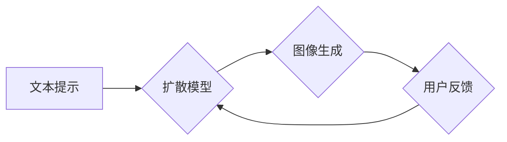

> ComfyUI, AI图像生成, 扩散模型, 稳定扩散,  文本提示,  用户体验,  开源社区

## 1. 背景介绍

近年来，人工智能领域取得了令人瞩目的进展，尤其是生成式人工智能模型的蓬勃发展。其中，基于扩散模型的图像生成技术，如 DALL-E 2、Stable Diffusion 和 Midjourney，展现出强大的图像创作能力，能够根据文本提示生成逼真的图像，引发了广泛的关注和研究。

ComfyUI 作为一款开源的图像生成工具，基于 Stable Diffusion 模型，致力于提供更易用、更灵活、更强大的图像生成体验。它通过简洁直观的界面和丰富的功能，降低了用户学习门槛，使更多人能够轻松参与到图像生成创作中。

## 2. 核心概念与联系

ComfyUI 的核心概念是将文本提示与扩散模型相结合，通过一系列的步骤生成图像。

**Mermaid 流程图:**

**核心概念解释:**

* **文本提示:** 用户输入描述图像内容的文本，作为模型的输入。
* **扩散模型:** 是一种基于概率的生成模型，通过逐步添加噪声将图像转换为纯噪声，然后反向学习去除噪声，最终生成图像。
* **图像生成:** 扩散模型根据文本提示，逐步去除噪声，生成符合描述的图像。
* **用户反馈:** 用户可以对生成的图像进行评价和修改，反馈信息可以用于模型的进一步训练和优化。

## 3. 核心算法原理 & 具体操作步骤

### 3.1  算法原理概述

ComfyUI 基于 Stable Diffusion 模型，其核心算法原理是基于变分自编码器 (VAE) 和扩散过程的结合。

* **变分自编码器 (VAE):** 用于将图像编码成低维表示，并解码成图像。
* **扩散过程:** 将图像逐步添加噪声，最终转换为纯噪声，然后反向学习去除噪声，生成图像。

### 3.2  算法步骤详解

1. **前向扩散:** 将图像逐步添加噪声，直到变成纯噪声。
2. **反向扩散:** 从纯噪声开始，逐步去除噪声，最终生成图像。
3. **文本提示编码:** 将文本提示编码成向量，作为反向扩散过程中的引导信息。

### 3.3  算法优缺点

**优点:**

* 生成图像质量高，细节丰富。
* 能够根据文本提示生成多样化的图像。
* 训练和部署成本相对较低。

**缺点:**

* 生成图像可能存在一些噪点或模糊现象。
* 训练模型需要大量的计算资源和数据。

### 3.4  算法应用领域

* **图像生成:** 生成艺术作品、产品设计、场景设计等。
* **图像编辑:** 修复图像、添加元素、修改图像风格等。
* **图像合成:** 将多个图像合成在一起，生成新的图像。

## 4. 数学模型和公式 & 详细讲解 & 举例说明

### 4.1  数学模型构建

ComfyUI 的数学模型主要包括以下几个部分:

* **变分自编码器 (VAE):** 使用编码器将图像编码成低维表示，解码器将低维表示解码成图像。
* **扩散过程:** 使用一系列的线性变换和噪声添加操作，将图像逐步转换为纯噪声。
* **文本提示编码:** 使用词嵌入模型将文本提示编码成向量，作为扩散过程中的引导信息。

### 4.2  公式推导过程

由于篇幅限制，这里只列举一些关键公式，详细推导过程可以参考相关文献。

* **VAE 编码器输出:**

$$
z = \text{Encoder}(x)
$$

其中，$x$ 是输入图像，$z$ 是编码后的低维表示。

* **VAE 解码器输入:**

$$
\hat{x} = \text{Decoder}(z)
$$

其中，$\hat{x}$ 是解码后的图像。

* **扩散过程中的噪声添加:**

$$
x_t = \sqrt{1-\beta_t}x_{t-1} + \sqrt{\beta_t}\epsilon_t
$$

其中，$x_t$ 是第 $t$ 步的图像，$\beta_t$ 是扩散系数，$\epsilon_t$ 是高斯噪声。

### 4.3  案例分析与讲解

假设我们想要生成一张“一只可爱的猫在草地上玩耍”的图像。

1. 用户输入文本提示“一只可爱的猫在草地上玩耍”。
2. 文本提示编码器将文本提示编码成一个向量，作为扩散过程中的引导信息。
3. 扩散模型根据文本提示向量和噪声，逐步生成图像。
4. 最后生成的图像是一个符合描述的可爱猫在草地上玩耍的图像。

## 5. 项目实践：代码实例和详细解释说明

### 5.1  开发环境搭建

ComfyUI 基于 Python 开发，需要安装 Python、PyTorch 和其他依赖库。

### 5.2  源代码详细实现

ComfyUI 的源代码开源在 GitHub 上，可以参考官方文档进行学习和修改。

### 5.3  代码解读与分析

ComfyUI 的代码主要包括以下几个部分:

* **UI 界面:** 使用 PySide 或 PyQt 等库构建用户界面。
* **模型加载:** 加载 Stable Diffusion 模型和权重文件。
* **图像生成:** 根据用户输入的文本提示和参数，调用模型生成图像。
* **图像显示:** 显示生成的图像。

### 5.4  运行结果展示

运行 ComfyUI 后，用户可以输入文本提示，并根据需要调整参数，生成符合描述的图像。

## 6. 实际应用场景

### 6.1  艺术创作

ComfyUI 可以帮助艺术家快速生成创意素材，探索新的艺术风格。

### 6.2  产品设计

ComfyUI 可以帮助设计师快速生成产品原型，进行概念验证和设计迭代。

### 6.3  游戏开发

ComfyUI 可以帮助游戏开发者生成游戏场景、角色和道具，加速游戏开发流程。

### 6.4  未来应用展望

随着 ComfyUI 的不断发展，其应用场景将会更加广泛，例如：

* **个性化定制:** 根据用户的喜好生成个性化的图像，例如头像、壁纸等。
* **虚拟现实 (VR) 和增强现实 (AR):** 生成虚拟场景和物体，增强用户体验。
* **教育和培训:** 生成互动式教学素材，提高学习效率。

## 7. 工具和资源推荐

### 7.1  学习资源推荐

* **ComfyUI 官方文档:** https://github.com/AUTOMATIC1111/stable-diffusion-webui
* **Stable Diffusion 官方文档:** https://stability.ai/blog/stable-diffusion-v1-release

### 7.2  开发工具推荐

* **Python:** https://www.python.org/
* **PyTorch:** https://pytorch.org/
* **PySide/PyQt:** https://www.riverbankcomputing.com/software/pyside/intro

### 7.3  相关论文推荐

* **Diffusion Models Beat GANs on Image Synthesis:** https://arxiv.org/abs/2006.11239
* **High-Resolution Image Synthesis with Latent Diffusion Models:** https://arxiv.org/abs/2112.10752

## 8. 总结：未来发展趋势与挑战

### 8.1  研究成果总结

ComfyUI 的发展代表了图像生成技术向更易用、更灵活、更强大的方向迈进。

### 8.2  未来发展趋势

* **更强大的模型:** 开发更高效、更高质量的扩散模型，生成更逼真的图像。
* **更丰富的功能:** 添加更多功能，例如图像编辑、图像合成等。
* **更易用的界面:** 进一步简化用户界面，降低用户学习门槛。
* **更广泛的应用:** 将 ComfyUI 应用到更多领域，例如教育、医疗、设计等。

### 8.3  面临的挑战

* **计算资源:** 训练和部署大型扩散模型需要大量的计算资源。
* **数据安全:** 图像生成模型需要大量的训练数据，如何保证数据安全是一个重要问题。
* **伦理问题:** 图像生成技术可能被用于生成虚假信息，如何避免滥用是一个需要认真思考的问题。

### 8.4  研究展望

未来，ComfyUI 将继续朝着更强大、更易用、更安全的方向发展，为用户提供更丰富的图像生成体验。

## 9. 附录：常见问题与解答

**常见问题:**

* 如何安装 ComfyUI？
* 如何使用 ComfyUI 生成图像？
* 如何修改 ComfyUI 的参数？

**解答:**

* 安装 ComfyUI 的步骤可以参考官方文档。
* 使用 ComfyUI 生成图像，只需输入文本提示，并根据需要调整参数即可。
* ComfyUI 的参数可以通过配置文件进行修改。

作者：禅与计算机程序设计艺术 / Zen and the Art of Computer Programming

<end_of_turn>