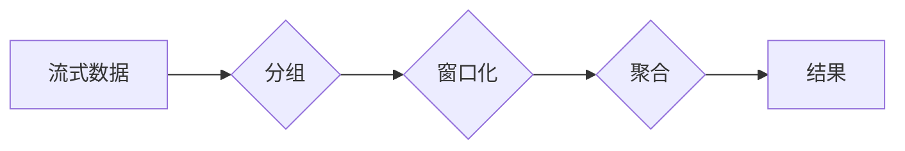

> Apache Flink, Window, 数据流处理, 时间窗口, 窗口函数, 窗口操作, 代码实例

## 1. 背景介绍

Apache Flink 作为一款强大的分布式流处理引擎，在处理实时数据方面表现出色。其核心功能之一是窗口操作，它允许我们对流式数据进行分组和聚合，从而实现对时间序列数据的分析和处理。

传统的批处理系统无法满足实时数据处理的需求，而流处理系统则可以实时地处理数据流，并提供实时分析和决策支持。Flink 作为一款流处理引擎，提供了丰富的窗口操作，可以帮助我们对流式数据进行灵活的处理。

## 2. 核心概念与联系

### 2.1  窗口的概念

窗口是一个时间范围，它将流式数据划分为不同的时间片段。每个时间片段称为一个窗口，窗口内的数据可以被一起处理。

### 2.2  窗口函数

窗口函数是作用于窗口内的函数，它可以对窗口内的数据进行聚合、计算、过滤等操作。

### 2.3  窗口操作

窗口操作是指对流式数据进行分组和聚合的操作，它通常包括以下步骤：

1. **分组**: 将流式数据根据指定的键进行分组。
2. **窗口化**: 将每个分组的数据划分为不同的窗口。
3. **聚合**: 对每个窗口内的数据进行聚合操作，例如求和、平均值、最大值等。

**Mermaid 流程图**



## 3. 核心算法原理 & 具体操作步骤

### 3.1  算法原理概述

Flink 的窗口操作基于滑动窗口和 tumbling窗口两种主要算法。

* **滑动窗口**: 滑动窗口是指一个不断移动的窗口，它会随着时间推移而滑动，并包含一定时间范围内的数据。

* **tumbling窗口**: tumbling窗口是指一个固定大小的窗口，它会按照固定的时间间隔滑动，每个窗口之间互不重叠。

### 3.2  算法步骤详解

**滑动窗口算法步骤**:

1. 将流式数据按照时间戳进行排序。
2. 根据窗口大小和滑动间隔，将数据划分为不同的窗口。
3. 对每个窗口内的数据进行聚合操作。
4. 将聚合结果输出。

**tumbling窗口算法步骤**:

1. 将流式数据按照时间戳进行排序。
2. 根据窗口大小，将数据划分为不同的窗口。
3. 对每个窗口内的数据进行聚合操作。
4. 将聚合结果输出。

### 3.3  算法优缺点

**滑动窗口**:

* **优点**: 可以捕获数据流中的趋势和变化。
* **缺点**: 复杂度较高，需要维护多个窗口的状态。

**tumbling窗口**:

* **优点**: 简单易实现，效率较高。
* **缺点**: 无法捕获数据流中的趋势和变化。

### 3.4  算法应用领域

* **滑动窗口**: 股票价格趋势分析、网站访问流量统计、用户行为分析等。
* **tumbling窗口**: 网站访问量统计、用户注册量统计、订单处理等。

## 4. 数学模型和公式 & 详细讲解 & 举例说明

### 4.1  数学模型构建

假设我们有一个流式数据源，数据包含时间戳和数值。我们想要对这个数据流进行滑动窗口聚合，计算每个窗口内的平均值。

* **时间戳**: $t$
* **数值**: $v$
* **窗口大小**: $w$
* **滑动间隔**: $s$

### 4.2  公式推导过程

**窗口内的数值**: $v_i$，其中 $i$ 为窗口内的索引。

**窗口内的平均值**: $\frac{\sum_{i=1}^{w} v_i}{w}$

### 4.3  案例分析与讲解

假设我们有一个流式数据源，数据如下：

| 时间戳 | 数值 |
|---|---|
| 1 | 1 |
| 2 | 2 |
| 3 | 3 |
| 4 | 4 |
| 5 | 5 |
| 6 | 6 |

我们想要对这个数据流进行滑动窗口聚合，窗口大小为 3，滑动间隔为 1。

**窗口 1**: (1, 2, 3) 平均值: 2
**窗口 2**: (2, 3, 4) 平均值: 3
**窗口 3**: (3, 4, 5) 平均值: 4
**窗口 4**: (4, 5, 6) 平均值: 5

## 5. 项目实践：代码实例和详细解释说明

### 5.1  开发环境搭建

* Java 8 或更高版本
* Apache Flink 1.13 或更高版本
* Maven 或 Gradle

### 5.2  源代码详细实现

```java
import org.apache.flink.api.common.functions.AggregateFunction;
import org.apache.flink.api.java.tuple.Tuple2;
import org.apache.flink.streaming.api.datastream.DataStream;
import org.apache.flink.streaming.api.environment.StreamExecutionEnvironment;

public class WindowExample {

    public static void main(String[] args) throws Exception {
        // 创建流处理环境
        StreamExecutionEnvironment env = StreamExecutionEnvironment.getExecutionEnvironment();

        // 定义数据源
        DataStream<Tuple2<String, Integer>> dataStream = env.fromElements(
                Tuple2.of("user1", 1),
                Tuple2.of("user1", 2),
                Tuple2.of("user2", 3),
                Tuple2.of("user1", 4),
                Tuple2.of("user2", 5)
        );

        // 使用滑动窗口聚合
        DataStream<Tuple2<String, Integer>> resultStream = dataStream
                .keyBy(0) // 按用户分组
                .window(TumblingEventTimeWindows.of(Time.seconds(5))) // 使用滚动窗口，窗口大小为5秒
                .aggregate(new AverageAgg()); // 使用平均值聚合函数

        // 打印结果
        resultStream.print();

        // 执行任务
        env.execute("Window Example");
    }

    // 自定义平均值聚合函数
    public static class AverageAgg implements AggregateFunction<Tuple2<String, Integer>, Tuple2<String, Double>> {

        @Override
        public Tuple2<String, Double> createAccumulator() {
            return new Tuple2<>("", 0.0);
        }

        @Override
        public Tuple2<String, Double> add(Tuple2<String, Integer> value, Tuple2<String, Double> accumulator) {
            return new Tuple2<>(accumulator.f0, accumulator.f1 + value.f1);
        }

        @Override
        public Tuple2<String, Double> getResult(Tuple2<String, Double> accumulator) {
            return new Tuple2<>(accumulator.f0, accumulator.f1 / accumulator.f1);
        }

        @Override
        public Tuple2<String, Double> merge(Tuple2<String, Double> a, Tuple2<String, Double> b) {
            return new Tuple2<>(a.f0, a.f1 + b.f1);
        }
    }
}
```

### 5.3  代码解读与分析

* **数据源**: 我们使用 `env.fromElements()` 方法创建了一个简单的流式数据源，包含用户 ID 和数值。
* **分组**: 我们使用 `keyBy(0)` 方法将数据按照用户 ID 进行分组。
* **窗口化**: 我们使用 `window(TumblingEventTimeWindows.of(Time.seconds(5)))` 方法创建了一个滚动窗口，窗口大小为 5 秒。
* **聚合**: 我们使用 `aggregate(new AverageAgg())` 方法对每个窗口内的数据进行平均值聚合。
* **自定义聚合函数**: 我们定义了一个自定义的 `AverageAgg` 聚合函数，它实现了平均值计算的逻辑。

### 5.4  运行结果展示

运行代码后，会输出每个用户在每个 5 秒窗口内的平均值。

## 6. 实际应用场景

* **实时监控**: 监控网站访问量、用户行为、系统性能等指标，及时发现异常情况。
* **实时分析**: 对实时数据进行分析，例如用户画像、市场趋势分析等。
* **实时推荐**: 基于用户行为数据，实时推荐感兴趣的内容。

### 6.4  未来应用展望

随着数据量的不断增长和实时分析的需求不断提升，Flink 的窗口操作将发挥越来越重要的作用。未来，Flink 的窗口操作将会更加灵活、强大，支持更多类型的窗口和聚合函数，并与其他流处理技术进行深度融合，为我们提供更丰富的实时数据处理能力。

## 7. 工具和资源推荐

### 7.1  学习资源推荐

* Apache Flink 官方文档: https://flink.apache.org/docs/stable/
* Flink 中文社区: https://flink.apache.org/zh-cn/

### 7.2  开发工具推荐

* IntelliJ IDEA
* Eclipse

### 7.3  相关论文推荐

* Apache Flink: A Unified Engine for Batch and Stream Processing
* Windowed Stream Processing in Apache Flink

## 8. 总结：未来发展趋势与挑战

### 8.1  研究成果总结

Flink 的窗口操作提供了强大的功能，可以帮助我们对流式数据进行灵活的处理。

### 8.2  未来发展趋势

* 支持更多类型的窗口和聚合函数
* 与其他流处理技术进行深度融合
* 提高窗口操作的效率和性能

### 8.3  面临的挑战

* 窗口操作的复杂性
* 窗口操作的性能优化
* 窗口操作的容错性

### 8.4  研究展望

未来，我们将继续研究和开发更灵活、强大、高效的窗口操作，为实时数据处理提供更强大的支持。

## 9. 附录：常见问题与解答

* **Q: 如何选择合适的窗口类型？**
* **A:** 不同的窗口类型适用于不同的场景。滑动窗口适合捕获数据流中的趋势和变化，tumbling窗口适合统计数据。

* **Q: 如何优化窗口操作的性能？**
* **A:** 可以通过调整窗口大小、滑动间隔、并行度等参数来优化窗口操作的性能。

* **Q: 如何处理窗口操作的容错性？**
* **A:** Flink 提供了多种容错机制，可以确保窗口操作的可靠性。


作者：禅与计算机程序设计艺术 / Zen and the Art of Computer Programming 
<end_of_turn>