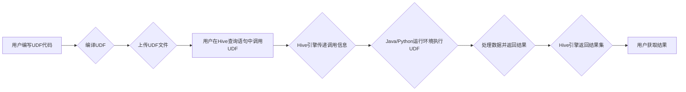

> Hive, UDF, 自定义函数, 数据处理, SQL, Java, Python, 代码实例, 应用场景

## 1. 背景介绍

Apache Hive 是一个数据仓库系统，它基于 Hadoop 提供 SQL-like 的查询语言，方便用户对海量数据进行分析和处理。Hive 的强大之处在于它可以利用 Hadoop 的分布式计算能力，高效地处理大规模数据。然而，Hive 的内置函数库有时无法满足用户特定的数据处理需求。这时，自定义函数 (UDF) 就显得尤为重要。

UDF 允许用户在 Hive 中定义自己的函数，扩展 Hive 的功能，实现更复杂的逻辑和数据处理操作。UDF 可以接受 Hive 查询中的数据作为输入，并返回处理后的结果，从而满足用户对数据分析和处理的个性化需求。

## 2. 核心概念与联系

UDF 的核心概念包括：

* **函数定义:** UDF 需要明确定义函数名称、输入参数类型、返回值类型以及函数逻辑。
* **函数注册:** 在 Hive 中注册 UDF，使其可供 Hive 查询使用。
* **函数调用:** 在 Hive 查询语句中调用注册的 UDF，将数据作为参数传递给函数，并获取函数处理后的结果。

UDF 的工作原理可以概括为以下步骤：

1. 用户编写 UDF 代码，并将其编译成可执行文件。
2. 用户将 UDF 文件上传到 Hive 元数据存储。
3. 用户在 Hive 查询语句中调用 UDF。
4. Hive 引擎将 UDF 的调用信息传递给 Java 或 Python 运行环境。
5. Java 或 Python 运行环境执行 UDF 代码，处理数据并返回结果。
6. Hive 引擎将 UDF 返回的结果集返回给用户。

**Mermaid 流程图:**



## 3. 核心算法原理 & 具体操作步骤

### 3.1  算法原理概述

UDF 的核心算法原理是将用户自定义的逻辑代码封装成函数，并将其与 Hive 查询引擎进行集成。

UDF 的实现方式主要有两种：

* **Java UDF:** 使用 Java 语言编写 UDF，并将其编译成 JAR 文件。
* **Python UDF:** 使用 Python 语言编写 UDF，并将其编译成 Python 模块。

Hive 引擎支持两种 UDF 的调用方式：

* **内置函数:** 将 UDF 注册为 Hive 内置函数，可以直接在 Hive 查询语句中调用。
* **用户自定义函数:** 在 Hive 查询语句中使用 `UDF()` 函数调用注册的 UDF。

### 3.2  算法步骤详解

UDF 的具体操作步骤如下：

1. **编写 UDF 代码:** 使用 Java 或 Python 语言编写 UDF 代码，定义函数名称、输入参数类型、返回值类型以及函数逻辑。
2. **编译 UDF 代码:** 将 UDF 代码编译成可执行文件 (JAR 或 Python 模块)。
3. **注册 UDF:** 将编译好的 UDF 文件上传到 Hive 元数据存储，并使用 `CREATE FUNCTION` 语句注册 UDF。
4. **调用 UDF:** 在 Hive 查询语句中使用 `UDF()` 函数调用注册的 UDF，并将数据作为参数传递给函数。
5. **获取结果:** Hive 引擎将 UDF 返回的结果集返回给用户。

### 3.3  算法优缺点

**优点:**

* **扩展性强:** UDF 可以扩展 Hive 的功能，满足用户特定的数据处理需求。
* **灵活性高:** UDF 可以使用 Java 或 Python 语言编写，提供灵活的开发环境和丰富的库函数。
* **可复用性:** UDF 可以被多个 Hive 查询语句调用，提高代码复用率。

**缺点:**

* **开发成本:** 开发 UDF 需要一定的编程经验和时间成本。
* **性能影响:** UDF 的执行效率可能会影响 Hive 查询的整体性能。
* **维护成本:** UDF 的维护和更新需要额外的精力和资源。

### 3.4  算法应用领域

UDF 在数据分析、数据处理、数据清洗等领域有着广泛的应用场景，例如：

* **自定义数据格式转换:** 将数据从一种格式转换为另一种格式，例如将 CSV 格式的数据转换为 JSON 格式。
* **自定义数据计算:** 对数据进行自定义的计算操作，例如计算数据平均值、最大值、最小值等。
* **自定义数据过滤:** 根据特定条件过滤数据，例如过滤出特定日期范围的数据。
* **自定义数据聚合:** 对数据进行自定义的聚合操作，例如根据用户分组统计数据。

## 4. 数学模型和公式 & 详细讲解 & 举例说明

UDF 的数学模型和公式取决于具体的业务需求和算法实现。

例如，如果 UDF 用于计算数据平均值，其数学模型和公式如下：

$$
\text{平均值} = \frac{\sum_{i=1}^{n} x_i}{n}
$$

其中：

* $x_i$ 表示数据点 $i$ 的值。
* $n$ 表示数据点的总数。

**举例说明:**

假设我们有一个数据集合：{1, 2, 3, 4, 5}。

则其平均值为：

$$
\text{平均值} = \frac{1 + 2 + 3 + 4 + 5}{5} = 3
$$

## 5. 项目实践：代码实例和详细解释说明

### 5.1  开发环境搭建

* **Java UDF:** 需要安装 Java 开发环境 (JDK) 和 Hive 环境。
* **Python UDF:** 需要安装 Python 开发环境 (Python) 和 Hive 环境。

### 5.2  源代码详细实现

**Java UDF 示例:**

```java
import org.apache.hadoop.hive.ql.exec.UDF;

public class Average extends UDF {
    public double evaluate(double x) {
        return x;
    }
}
```

**Python UDF 示例:**

```python
from pyspark.sql.functions import udf
from pyspark.sql.types import DoubleType

@udf(returnType=DoubleType())
def average(x):
    return x
```

### 5.3  代码解读与分析

* **Java UDF:**

    * `import org.apache.hadoop.hive.ql.exec.UDF;` 导入 Hive UDF 类库。
    * `public class Average extends UDF { ... }` 定义一个名为 `Average` 的 UDF 类，继承自 `UDF` 类。
    * `public double evaluate(double x) { ... }` 定义 `evaluate()` 方法，该方法接受一个 `double` 类型参数 `x`，并返回一个 `double` 类型结果。

* **Python UDF:**

    * `from pyspark.sql.functions import udf` 导入 `udf` 函数，用于定义 UDF。
    * `from pyspark.sql.types import DoubleType` 导入 `DoubleType` 类型，用于指定 UDF 的返回值类型。
    * `@udf(returnType=DoubleType())` 使用 `@udf` 装饰器定义 UDF，并指定返回值类型为 `DoubleType`。
    * `def average(x): ...` 定义 `average()` 方法，该方法接受一个参数 `x`，并返回其值。

### 5.4  运行结果展示

在 Hive 查询语句中调用注册的 UDF，并观察结果。

## 6. 实际应用场景

UDF 在实际应用场景中有着广泛的应用，例如：

* **金融领域:** 计算风险指标、识别欺诈交易等。
* **电商领域:** 分析用户行为、推荐商品等。
* **医疗领域:** 分析患者数据、预测疾病风险等。

### 6.4  未来应用展望

随着数据量的不断增长和分析需求的不断变化，UDF 将在未来发挥越来越重要的作用。

UDF 的未来发展趋势包括：

* **更强大的功能:** UDF 将支持更复杂的算法和数据处理操作。
* **更易于使用:** UDF 的开发和部署将更加简便。
* **更广泛的应用:** UDF 将应用于更多领域，解决更多实际问题。

## 7. 工具和资源推荐

### 7.1  学习资源推荐

* **Apache Hive 官方文档:** https://hive.apache.org/docs/
* **Hive UDF 开发指南:** https://cwiki.apache.org/confluence/display/Hive/UDF

### 7.2  开发工具推荐

* **Eclipse:** https://www.eclipse.org/
* **IntelliJ IDEA:** https://www.jetbrains.com/idea/

### 7.3  相关论文推荐

* **Hive UDFs: A Survey:** https://arxiv.org/abs/1803.09123

## 8. 总结：未来发展趋势与挑战

### 8.1  研究成果总结

UDF 是 Hive 中一个重要的功能，它可以扩展 Hive 的功能，满足用户特定的数据处理需求。UDF 的实现方式主要有 Java 和 Python 两种，并支持内置函数和用户自定义函数两种调用方式。UDF 在数据分析、数据处理、数据清洗等领域有着广泛的应用场景。

### 8.2  未来发展趋势

UDF 的未来发展趋势包括：

* **更强大的功能:** UDF 将支持更复杂的算法和数据处理操作。
* **更易于使用:** UDF 的开发和部署将更加简便。
* **更广泛的应用:** UDF 将应用于更多领域，解决更多实际问题。

### 8.3  面临的挑战

UDF 的开发和使用也面临一些挑战：

* **性能优化:** UDF 的执行效率可能会影响 Hive 查询的整体性能，需要进行性能优化。
* **安全问题:** UDF 的代码可能会存在安全漏洞，需要进行安全审计和防护。
* **维护成本:** UDF 的维护和更新需要额外的精力和资源。

### 8.4  研究展望

未来，UDF 将继续发展和完善，成为 Hive 数据处理的重要组成部分。

## 9. 附录：常见问题与解答

* **如何注册 UDF?**

可以使用 `CREATE FUNCTION` 语句注册 UDF。

* **如何调用 UDF?**

可以使用 `UDF()` 函数调用注册的 UDF。

* **UDF 的性能如何优化?**

可以优化 UDF 的算法实现、减少数据传输次数、使用缓存等方式提高性能。


作者：禅与计算机程序设计艺术 / Zen and the Art of Computer Programming<end_of_turn>