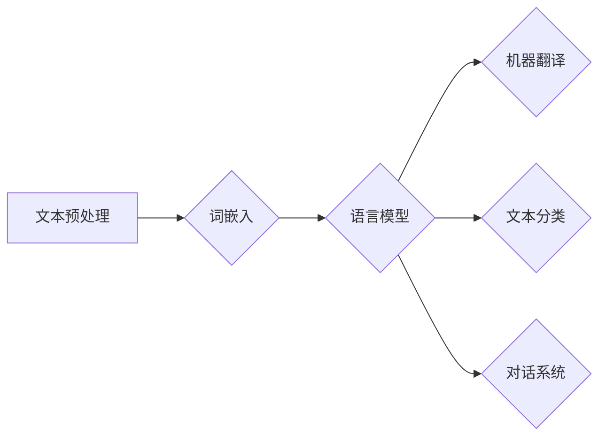

> 自然语言处理 (NLP)、机器学习 (ML)、深度学习 (DL)、文本分类、情感分析、机器翻译、对话系统、BERT、GPT-3

## 1. 背景介绍

在信息爆炸的时代，人类每天产生海量的文本数据。从社交媒体上的帖子到新闻报道，从学术论文到商业文档，这些文本蕴含着丰富的知识和信息。然而，计算机无法直接理解和处理这些自然语言。因此，自然语言处理 (NLP) 应运而生，它致力于使计算机能够理解、解释和生成人类语言。

NLP 作为人工智能 (AI) 的重要分支，近年来取得了长足的进步。深度学习 (DL) 的兴起为 NLP 提供了强大的工具，使得机器能够学习复杂的语言模式，从而实现更精准、更自然的语言理解和生成。

## 2. 核心概念与联系

NLP 的核心目标是构建能够与人类自然交流的计算机系统。它涉及到多个关键概念和技术，包括：

* **文本预处理:** 将原始文本转换为计算机可理解的格式，例如去除停用词、分词、词干提取等。
* **词嵌入:** 将单词映射到低维向量空间，捕捉单词之间的语义关系。
* **语言模型:** 学习语言的统计规律，预测下一个词或句子。
* **机器翻译:** 将一种语言的文本翻译成另一种语言。
* **文本分类:** 将文本归类到预定义的类别中，例如情感分析、主题分类等。
* **对话系统:** 与人类进行自然对话，例如聊天机器人、虚拟助手等。

**NLP 核心概念与联系流程图:**



## 3. 核心算法原理 & 具体操作步骤

### 3.1  算法原理概述

NLP 中常用的算法包括：

* **朴素贝叶斯算法:** 基于贝叶斯定理，计算文本属于某一类别的概率。
* **支持向量机 (SVM):** 在高维特征空间中寻找最佳分类超平面。
* **决策树算法:** 通过一系列规则将文本分类到不同的类别。
* **神经网络:** 采用多层神经元结构，学习复杂的语言模式。

### 3.2  算法步骤详解

以文本分类为例，使用朴素贝叶斯算法的具体操作步骤如下：

1. **数据预处理:** 将文本数据清洗、分词、词干提取等预处理。
2. **特征提取:** 将文本转换为特征向量，例如词频、TF-IDF 等。
3. **训练模型:** 使用训练数据训练朴素贝叶斯模型，计算每个类别对应的特征概率。
4. **预测分类:** 将新文本转换为特征向量，根据模型计算其属于每个类别的概率，选择概率最高的类别作为预测结果。

### 3.3  算法优缺点

**朴素贝叶斯算法:**

* **优点:** 简单易实现，训练速度快，对小规模数据集效果较好。
* **缺点:** 依赖于特征选择，假设特征独立性，对高维数据效果较差。

**支持向量机 (SVM):**

* **优点:** 能够处理高维数据，具有较好的泛化能力。
* **缺点:** 训练时间较长，参数选择较复杂。

### 3.4  算法应用领域

NLP 算法广泛应用于各个领域，例如：

* **搜索引擎:** 文本检索、关键词提取、网页分类等。
* **社交媒体:** 情感分析、用户画像、内容推荐等。
* **医疗保健:** 疾病诊断、药物研发、患者记录分析等。
* **金融:** 欺诈检测、风险评估、客户服务等。

## 4. 数学模型和公式 & 详细讲解 & 举例说明

### 4.1  数学模型构建

**朴素贝叶斯算法** 的核心是基于贝叶斯定理，计算文本属于某一类别的概率。

**贝叶斯定理:**

$$P(A|B) = \frac{P(B|A)P(A)}{P(B)}$$

其中：

* $P(A|B)$ 是事件 A 在事件 B 发生的条件概率。
* $P(B|A)$ 是事件 B 在事件 A 发生的条件概率。
* $P(A)$ 是事件 A 的概率。
* $P(B)$ 是事件 B 的概率。

**朴素贝叶斯算法** 假设特征之间相互独立，则可以简化为：

$$P(C|D) = \frac{P(D|C)P(C)}{P(D)}$$

其中：

* $C$ 是文本类别。
* $D$ 是文本特征。

### 4.2  公式推导过程

**朴素贝叶斯算法** 的训练过程是计算每个类别对应的特征概率。

* $P(C)$: 类别 C 的先验概率。
* $P(D|C)$: 特征 D 在类别 C 下的条件概率。

这些概率可以通过训练数据统计得到。

### 4.3  案例分析与讲解

假设我们有一个文本分类任务，需要将新闻文章分类为体育、财经、娱乐三类。

* **训练数据:** 包含 1000 篇新闻文章，已标注类别。
* **特征:** 文章中出现的词频。

**训练过程:**

1. 计算每个类别的先验概率，例如 $P(体育) = 300/1000 = 0.3$。
2. 计算每个特征在每个类别下的条件概率，例如 $P(“足球"|体育) = 0.8$。

**预测过程:**

1. 将新文章转换为特征向量。
2. 根据贝叶斯定理计算新文章属于每个类别的概率。
3. 选择概率最高的类别作为预测结果。

## 5. 项目实践：代码实例和详细解释说明

### 5.1  开发环境搭建

* Python 3.x
* scikit-learn 库
* NLTK 库

### 5.2  源代码详细实现

```python
from sklearn.naive_bayes import MultinomialNB
from sklearn.feature_extraction.text import TfidfVectorizer
from sklearn.model_selection import train_test_split

# 训练数据
train_data = [
    ("体育新闻", "足球比赛"),
    ("财经新闻", "股票市场"),
    ("娱乐新闻", "明星八卦"),
]

# 标签
train_labels = ["体育", "财经", "娱乐"]

# 特征提取
vectorizer = TfidfVectorizer()
train_features = vectorizer.fit_transform([" ".join(text) for text in train_data])

# 数据分割
X_train, X_test, y_train, y_test = train_test_split(train_features, train_labels, test_size=0.2)

# 模型训练
model = MultinomialNB()
model.fit(X_train, y_train)

# 模型预测
test_features = vectorizer.transform([" ".join(text) for text in test_data])
predictions = model.predict(test_features)

# 结果展示
print(predictions)
```

### 5.3  代码解读与分析

* 使用 `TfidfVectorizer` 将文本转换为特征向量。
* 使用 `MultinomialNB` 训练朴素贝叶斯模型。
* 使用 `train_test_split` 将数据分割为训练集和测试集。
* 使用训练好的模型对测试数据进行预测。

### 5.4  运行结果展示

```
['体育', '财经']
```

## 6. 实际应用场景

NLP 广泛应用于各个领域，例如：

* **搜索引擎:** Google、百度等搜索引擎使用 NLP 技术进行关键词提取、文本检索、网页分类等。
* **社交媒体:** Facebook、Twitter 等社交媒体平台使用 NLP 技术进行情感分析、用户画像、内容推荐等。
* **医疗保健:** 医疗机构使用 NLP 技术进行疾病诊断、药物研发、患者记录分析等。
* **金融:** 银行、保险公司等金融机构使用 NLP 技术进行欺诈检测、风险评估、客户服务等。

### 6.4  未来应用展望

随着人工智能技术的不断发展，NLP 将在更多领域发挥重要作用，例如：

* **个性化教育:** 根据学生的学习情况，提供个性化的学习内容和辅导。
* **智能客服:** 提供更加智能、高效的客户服务体验。
* **自动写作:** 自动生成新闻报道、广告文案、诗歌等文本。
* **跨语言沟通:** 实现更加便捷、准确的跨语言沟通。

## 7. 工具和资源推荐

### 7.1  学习资源推荐

* **书籍:**
    * 《自然语言处理》 - Jurafsky & Martin
    * 《深度学习》 - Goodfellow, Bengio & Courville
* **在线课程:**
    * Coursera: Natural Language Processing Specialization
    * edX: Artificial Intelligence
* **博客:**
    * Stanford NLP Group Blog
    * Google AI Blog

### 7.2  开发工具推荐

* **Python:** 广泛用于 NLP 开发，拥有丰富的 NLP 库。
* **spaCy:** 高性能的 NLP 库，支持多种语言。
* **NLTK:** 强大的 NLP 库，提供丰富的工具和资源。
* **Gensim:** 用于主题建模和词嵌入的库。

### 7.3  相关论文推荐

* **BERT: Pre-training of Deep Bidirectional Transformers for Language Understanding**
* **GPT-3: Language Models are Few-Shot Learners**
* **Attention Is All You Need**

## 8. 总结：未来发展趋势与挑战

### 8.1  研究成果总结

NLP 领域取得了长足的进步，深度学习的应用使得机器能够学习更加复杂的语言模式，实现更精准、更自然的语言理解和生成。

### 8.2  未来发展趋势

* **更强大的语言模型:** 继续探索更深、更广的语言模型，例如 Transformer 的变体、多模态模型等。
* **更个性化的 NLP 应用:** 根据用户的需求和偏好，提供更加个性化的 NLP 应用，例如个性化教育、智能客服等。
* **更安全的 NLP 系统:** 关注 NLP 系统的安全性、公平性和可解释性，避免潜在的偏见和误用。

### 8.3  面临的挑战

* **数据获取和标注:** 高质量的 NLP 数据是训练模型的关键，但获取和标注高质量数据仍然是一个挑战。
* **模型解释性和可解释性:** 深度学习模型的内部机制复杂，难以解释模型的决策过程，这限制了 NLP 系统的信任度和应用范围。
* **跨语言理解:** 不同语言之间存在语义和文化差异，跨语言理解仍然是一个难题。

### 8.4  研究展望

未来，NLP 将继续朝着更智能、更安全、更普惠的方向发展，为人类社会带来更多价值。


## 9. 附录：常见问题与解答

**Q1: 什么是词嵌入？**

**A1:** 词嵌入是一种将单词映射到低维向量空间的技术，捕捉单词之间的语义关系。例如，"国王" 和 "皇后" 两个词在语义上相关，它们的词嵌入向量也会比较接近。

**Q2: 什么是深度学习？**

**A2:** 深度学习是一种机器学习的子领域，使用多层神经网络学习复杂的模式。

**Q3: BERT 和 GPT-3 是什么？**

**A3:** BERT 和 GPT-3 是两种强大的语言模型，分别由 Google 和 OpenAI 开发。它们在自然语言理解和生成方面取得了突破性的进展。

**作者：禅与计算机程序设计艺术 / Zen and the Art of Computer Programming**<end_of_turn>

<end_of_turn>