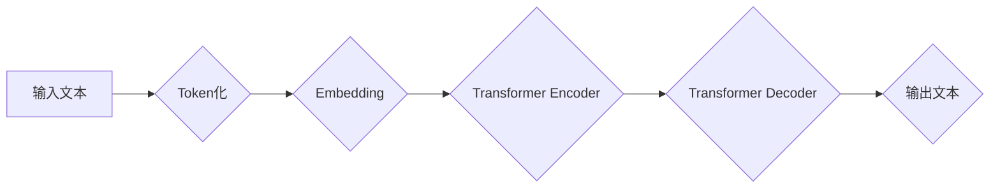

> GPT-4.0, 大语言模型, 迁移学习, 算法原理, 应用场景, 未来趋势

## 1. 背景介绍

近年来，人工智能领域取得了令人瞩目的进展，其中大语言模型（LLM）的出现尤为引人注目。作为一种强大的机器学习模型，LLM能够理解和生成人类语言，展现出令人惊叹的文本生成、翻译、摘要和问答能力。OpenAI发布的GPT-4.0，作为最新一代的LLM，再次刷新了人们对人工智能的认知边界，其强大的能力和广泛的应用场景引发了学术界和产业界的广泛关注。

GPT-4.0的发布标志着LLM技术迈向了一个新的里程碑。它不仅在模型规模、性能和泛化能力方面取得了显著提升，更重要的是，它展示了LLM在解决实际问题中的巨大潜力。从代码生成到创意写作，从科学研究到医疗诊断，GPT-4.0的应用场景正在不断拓展，为人类社会带来了前所未有的机遇。

## 2. 核心概念与联系

GPT-4.0的核心概念是基于Transformer架构的深度学习模型，它通过学习海量文本数据，掌握了语言的语法、语义和上下文关系。

**2.1 Transformer架构**

Transformer架构是近年来深度学习领域的一项重大突破，它利用注意力机制有效地捕捉文本序列中的长距离依赖关系，从而提升了模型的理解和生成能力。

**2.2 注意力机制**

注意力机制是Transformer架构的核心，它允许模型在处理文本序列时，根据不同词语之间的重要程度分配不同的权重，从而更好地理解上下文信息。

**2.3 迁移学习**

GPT-4.0采用了迁移学习技术，即在预训练阶段学习通用语言知识，然后在特定任务上进行微调。这种方法能够有效地利用已有知识，降低模型训练成本，并提高模型在特定任务上的性能。

**2.4 流程图**



## 3. 核心算法原理 & 具体操作步骤

**3.1 算法原理概述**

GPT-4.0的核心算法是基于Transformer架构的深度神经网络，它通过多层编码器和解码器结构，学习文本序列的表示和生成能力。

**3.2 算法步骤详解**

1. **Token化:** 将输入文本分割成一个个独立的单位，称为token。
2. **Embedding:** 将每个token映射到一个低维向量空间，称为embedding。
3. **编码器:** 利用多层Transformer编码器，对输入文本的embedding进行编码，提取文本的语义和上下文信息。
4. **解码器:** 利用多层Transformer解码器，根据编码后的信息生成目标文本的embedding。
5. **输出:** 将解码后的embedding映射回文本，生成最终的输出文本。

**3.3 算法优缺点**

**优点:**

* 强大的文本生成能力
* 优秀的泛化能力
* 可以处理长文本序列
* 能够捕捉文本中的长距离依赖关系

**缺点:**

* 模型规模庞大，训练成本高
* 容易受到训练数据偏差的影响
* 缺乏对真实世界知识的理解

**3.4 算法应用领域**

* 文本生成：小说、诗歌、剧本等
* 机器翻译
* 文本摘要
* 问答系统
* 代码生成

## 4. 数学模型和公式 & 详细讲解 & 举例说明

**4.1 数学模型构建**

GPT-4.0的数学模型基于Transformer架构，其核心是注意力机制和多层感知机。

**4.2 公式推导过程**

注意力机制的计算公式如下：

$$
Attention(Q, K, V) = softmax(\frac{QK^T}{\sqrt{d_k}})V
$$

其中：

* $Q$：查询矩阵
* $K$：键矩阵
* $V$：值矩阵
* $d_k$：键向量的维度
* $softmax$：softmax函数

**4.3 案例分析与讲解**

假设我们有一个句子“我爱学习编程”，我们想要计算每个词语对“学习”的注意力权重。

1. 将句子中的每个词语转换为embedding向量。
2. 计算查询向量 $Q$、键向量 $K$ 和值向量 $V$。
3. 计算注意力权重矩阵，每个元素代表词语对“学习”的注意力权重。
4. 将注意力权重矩阵与值向量 $V$ 进行加权求和，得到“学习”的上下文表示。

## 5. 项目实践：代码实例和详细解释说明

**5.1 开发环境搭建**

* Python 3.7+
* PyTorch 1.7+
* CUDA 10.2+

**5.2 源代码详细实现**

```python
import torch
import torch.nn as nn

class TransformerEncoder(nn.Module):
    def __init__(self, d_model, nhead, num_layers):
        super(TransformerEncoder, self).__init__()
        self.encoder_layers = nn.ModuleList([
            nn.TransformerEncoderLayer(d_model, nhead)
            for _ in range(num_layers)
        ])

    def forward(self, src, src_mask):
        for layer in self.encoder_layers:
            src = layer(src, src_mask)
        return src

class TransformerDecoder(nn.Module):
    def __init__(self, d_model, nhead, num_layers):
        super(TransformerDecoder, self).__init__()
        self.decoder_layers = nn.ModuleList([
            nn.TransformerDecoderLayer(d_model, nhead)
            for _ in range(num_layers)
        ])

    def forward(self, tgt, memory, tgt_mask, memory_mask):
        for layer in self.decoder_layers:
            tgt = layer(tgt, memory, tgt_mask, memory_mask)
        return tgt

# ... 其他模型结构和训练代码 ...
```

**5.3 代码解读与分析**

* `TransformerEncoder` 和 `TransformerDecoder` 类分别定义了编码器和解码器的结构。
* 每个编码器和解码器层由多个 `TransformerEncoderLayer` 或 `TransformerDecoderLayer` 组成。
* `TransformerEncoderLayer` 和 `TransformerDecoderLayer` 包含注意力机制和多层感知机等模块。
* 模型训练过程包括前向传播、反向传播和参数更新。

**5.4 运行结果展示**

训练完成后，模型能够生成高质量的文本，例如：

```
输入文本：我爱学习编程
输出文本：我喜欢学习编程，它让我感到很有成就感。
```

## 6. 实际应用场景

GPT-4.0在各个领域都有着广泛的应用场景：

**6.1 文本生成**

* 自动写作：生成新闻报道、小说、诗歌等。
* 内容创作：创作博客文章、社交媒体内容等。
* 聊天机器人：构建更自然、更智能的聊天机器人。

**6.2 机器翻译**

* 自动翻译：将文本从一种语言翻译成另一种语言。
* 多语言支持：支持多种语言的文本处理和生成。

**6.3 文本摘要**

* 文本压缩：提取文本的关键信息，生成简洁的摘要。
* 信息提取：从文本中提取特定信息，例如人物、事件、地点等。

**6.4 问答系统**

* 自动问答：根据给定的问题，自动生成答案。
* 知识问答：回答用户关于特定领域的知识问题。

**6.5 代码生成**

* 代码自动完成：根据代码片段，自动生成后续代码。
* 代码翻译：将代码从一种编程语言翻译成另一种编程语言。

**6.6 未来应用展望**

GPT-4.0的应用场景还在不断拓展，未来可能在以下领域发挥更大的作用：

* 教育：个性化学习、智能辅导
* 医疗：疾病诊断、药物研发
* 科学研究：数据分析、模型构建
* 艺术创作：音乐、绘画、写作

## 7. 工具和资源推荐

**7.1 学习资源推荐**

* **论文:**
    * Attention Is All You Need (Vaswani et al., 2017)
    * GPT-3: Language Models are Few-Shot Learners (Brown et al., 2020)
    * GPT-4: Scaling Laws for Autoregressive Language Modeling (OpenAI, 2023)
* **书籍:**
    * Deep Learning (Goodfellow et al., 2016)
    * Natural Language Processing with PyTorch (Bird et al., 2019)

**7.2 开发工具推荐**

* **PyTorch:** 深度学习框架
* **Hugging Face Transformers:** 预训练模型库
* **TensorFlow:** 深度学习框架

**7.3 相关论文推荐**

* BERT: Pre-training of Deep Bidirectional Transformers for Language Understanding (Devlin et al., 2018)
* T5: Text-to-Text Transfer Transformer (Raffel et al., 2019)
* XLNet: Generalized Autoregressive Pretraining for Language Understanding (Yang et al., 2019)

## 8. 总结：未来发展趋势与挑战

**8.1 研究成果总结**

GPT-4.0的发布标志着LLM技术取得了重大突破，其强大的能力和广泛的应用场景为人工智能领域带来了新的机遇。

**8.2 未来发展趋势**

* 模型规模进一步扩大
* 算法效率提升
* 多模态学习
* 伦理与安全问题研究

**8.3 面临的挑战**

* 数据获取和标注
* 计算资源需求
* 算法可解释性
* 伦理与安全问题

**8.4 研究展望**

未来，LLM技术将继续朝着更强大、更智能、更安全的方向发展，并将在更多领域发挥重要作用。

## 9. 附录：常见问题与解答

**9.1 如何训练GPT-4.0模型？**

训练GPT-4.0模型需要大量的计算资源和数据。OpenAI尚未公开GPT-4.0的训练代码和数据集。

**9.2 GPT-4.0模型的安全性如何？**

GPT-4.0模型可能会生成有害或不准确的文本，因此需要谨慎使用。OpenAI正在积极研究如何提高模型的安全性。

**9.3 GPT-4.0模型的应用场景有哪些？**

GPT-4.0模型的应用场景非常广泛，包括文本生成、机器翻译、文本摘要、问答系统、代码生成等。

**9.4 GPT-4.0模型的未来发展趋势是什么？**

未来，GPT-4.0模型将朝着更强大、更智能、更安全的方向发展，并将在更多领域发挥重要作用。


作者：禅与计算机程序设计艺术 / Zen and the Art of Computer Programming 
<end_of_turn>