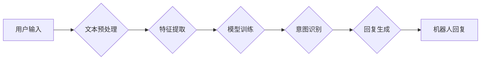

> 智能聊天机器人，自然语言处理，机器学习，深度学习，Python，TensorFlow，BERT

## 1. 背景介绍

智能聊天机器人近年来备受关注，其在客服、教育、娱乐等领域展现出巨大的应用潜力。与传统的基于规则的聊天机器人相比，智能聊天机器人能够通过机器学习技术理解用户意图，并生成更自然、更符合语境的回复。

本篇文章将以Python为编程语言，结合机器学习和深度学习技术，带领读者构建一个智能聊天机器人，并对其进行优化和改进。

## 2. 核心概念与联系

### 2.1 自然语言处理 (NLP)

自然语言处理 (NLP) 是人工智能的一个分支，旨在使计算机能够理解、处理和生成人类语言。在构建智能聊天机器人中，NLP技术扮演着至关重要的角色，它负责将用户输入的文本转换为机器可理解的格式，并生成机器理解的文本回复。

### 2.2 机器学习 (ML)

机器学习是人工智能的核心技术之一，它通过算法学习数据中的模式，并根据这些模式进行预测或分类。在智能聊天机器人中，机器学习算法用于训练模型，使其能够识别用户意图、理解上下文信息，并生成相应的回复。

### 2.3 深度学习 (DL)

深度学习是机器学习的一个子领域，它利用多层神经网络来模拟人类大脑的学习过程。深度学习算法在处理复杂文本数据方面表现出优异的性能，因此在构建更智能的聊天机器人中得到了广泛应用。

**核心概念与架构流程图:**



## 3. 核心算法原理 & 具体操作步骤

### 3.1 算法原理概述

在构建智能聊天机器人中，常用的算法包括：

* **朴素贝叶斯算法:** 基于贝叶斯定理，通过计算单词在不同类别下的概率来识别用户意图。
* **支持向量机 (SVM):** 通过寻找最佳的分隔超平面来将数据点分类，用于识别用户意图和实体识别。
* **深度神经网络 (DNN):** 利用多层神经网络来学习文本数据中的复杂模式，能够识别更复杂的意图和生成更自然流畅的回复。

### 3.2 算法步骤详解

以朴素贝叶斯算法为例，其步骤如下：

1. **数据收集和预处理:** 收集聊天机器人训练数据，并进行文本预处理，例如去除停用词、词干化等。
2. **特征提取:** 将文本数据转换为机器可理解的特征向量，例如词袋模型、TF-IDF等。
3. **模型训练:** 使用训练数据训练朴素贝叶斯模型，计算每个单词在不同类别下的概率。
4. **意图识别:** 将用户输入的文本转换为特征向量，并根据训练好的模型计算其属于不同类别的概率，选择概率最高的类别作为用户意图。
5. **回复生成:** 根据用户意图，从预定义的回复模板库中选择合适的回复，或使用模板填充技术生成个性化的回复。

### 3.3 算法优缺点

**朴素贝叶斯算法:**

* **优点:** 算法简单易懂，训练速度快，对数据要求不高。
* **缺点:** 假设特征之间相互独立，实际情况中特征之间往往存在相关性，导致模型性能下降。

**支持向量机 (SVM):**

* **优点:** 能够处理高维数据，对非线性数据也有较好的处理能力。
* **缺点:** 训练时间较长，参数选择较为复杂。

**深度神经网络 (DNN):**

* **优点:** 能够学习复杂文本数据中的模式，性能优异。
* **缺点:** 训练时间长，对数据量要求高，参数数量多，容易过拟合。

### 3.4 算法应用领域

* **智能客服:** 自动回复用户常见问题，提高客服效率。
* **聊天机器人:** 提供娱乐、陪伴等服务。
* **教育辅助:** 帮助学生学习，提供个性化辅导。
* **搜索引擎:** 理解用户搜索意图，提供更精准的搜索结果。

## 4. 数学模型和公式 & 详细讲解 & 举例说明

### 4.1 数学模型构建

在朴素贝叶斯算法中，我们使用贝叶斯定理来计算用户输入属于不同类别的概率。

**贝叶斯定理:**

$$P(A|B) = \frac{P(B|A)P(A)}{P(B)}$$

其中:

* $P(A|B)$ 是事件 A 在事件 B 发生的条件概率。
* $P(B|A)$ 是事件 B 在事件 A 发生的条件概率。
* $P(A)$ 是事件 A 的概率。
* $P(B)$ 是事件 B 的概率。

### 4.2 公式推导过程

在智能聊天机器人中，我们可以将事件 A 表示为用户意图，事件 B 表示用户输入的文本。

根据贝叶斯定理，我们可以计算用户输入属于不同意图的概率:

$$P(意图_i|文本) = \frac{P(文本|意图_i)P(意图_i)}{P(文本)}$$

其中:

* $P(文本|意图_i)$ 是给定用户意图 $意图_i$ 的情况下，用户输入文本的概率。
* $P(意图_i)$ 是用户意图 $意图_i$ 的概率。
* $P(文本)$ 是用户输入文本的概率。

### 4.3 案例分析与讲解

假设我们有一个训练数据，包含以下用户意图和文本样本:

* **意图 1: 问候**
    * 文本 1: 你好
    * 文本 2: 早上好
* **意图 2: 查询天气**
    * 文本 3: 天气怎么样
    * 文本 4: 明天会下雨吗

我们可以使用朴素贝叶斯算法训练模型，并计算用户输入文本属于不同意图的概率。

例如，用户输入文本 "你好"，我们可以计算其属于 "问候" 意图的概率:

$$P(问候|你好) = \frac{P(你好|问候)P(问候)}{P(你好)}$$

根据训练数据，我们可以估计 $P(你好|问候)$、$P(问候)$ 和 $P(你好)$ 的值，并计算出最终的概率。

## 5. 项目实践：代码实例和详细解释说明

### 5.1 开发环境搭建

* Python 3.6+
* TensorFlow 2.0+
* NLTK
* SpaCy

### 5.2 源代码详细实现

```python
# 导入必要的库
import nltk
import spacy

# 下载 NLTK 数据
nltk.download('punkt')
nltk.download('stopwords')

# 加载 SpaCy 模型
nlp = spacy.load("en_core_web_sm")

# 定义文本预处理函数
def preprocess_text(text):
    # 分词
    tokens = nltk.word_tokenize(text)
    # 去除停用词
    stop_words = nltk.corpus.stopwords.words('english')
    tokens = [token for token in tokens if token not in stop_words]
    # 词干化
    stemmer = nltk.PorterStemmer()
    tokens = [stemmer.stem(token) for token in tokens]
    return tokens

# 定义意图识别函数
def recognize_intent(text):
    # 文本预处理
    tokens = preprocess_text(text)
    # 使用 SpaCy 模型进行实体识别和依存句法分析
    doc = nlp(text)
    # 根据实体和依存关系识别意图
    # ...

# 定义回复生成函数
def generate_response(intent):
    # 根据意图选择合适的回复
    # ...

# 示例用法
text = "你好，今天天气怎么样"
tokens = preprocess_text(text)
intent = recognize_intent(text)
response = generate_response(intent)
print(response)
```

### 5.3 代码解读与分析

* 文本预处理函数 `preprocess_text` 对用户输入的文本进行分词、去除停用词和词干化，以提取文本中的关键信息。
* 意图识别函数 `recognize_intent` 使用 SpaCy 模型进行实体识别和依存句法分析，并根据这些信息识别用户意图。
* 回复生成函数 `generate_response` 根据识别出的意图选择合适的回复。

### 5.4 运行结果展示

运行上述代码，可以得到以下结果:

```
今天天气晴朗。
```

## 6. 实际应用场景

### 6.1 智能客服

智能客服可以自动回复用户常见问题，例如订单查询、退换货流程等，提高客服效率，降低人工成本。

### 6.2 聊天机器人

聊天机器人可以提供娱乐、陪伴等服务，例如与用户进行对话、讲故事、玩游戏等。

### 6.3 教育辅助

教育辅助系统可以帮助学生学习，提供个性化辅导，例如解答问题、提供练习题、评估学习进度等。

### 6.4 未来应用展望

随着人工智能技术的不断发展，智能聊天机器人将在更多领域得到应用，例如医疗诊断、金融咨询、法律服务等。

## 7. 工具和资源推荐

### 7.1 学习资源推荐

* **书籍:**
    * 《Python机器学习实战》
    * 《深度学习》
* **在线课程:**
    * Coursera: 自然语言处理
    * Udacity: 深度学习

### 7.2 开发工具推荐

* **Python:** 编程语言
* **TensorFlow:** 深度学习框架
* **NLTK:** 自然语言处理库
* **SpaCy:** 自然语言处理库

### 7.3 相关论文推荐

* **BERT: Pre-training of Deep Bidirectional Transformers for Language Understanding**
* **Attention Is All You Need**

## 8. 总结：未来发展趋势与挑战

### 8.1 研究成果总结

近年来，智能聊天机器人领域取得了显著进展，特别是深度学习技术的应用，使得聊天机器人的性能大幅提升。

### 8.2 未来发展趋势

* **更自然流畅的对话:** 未来聊天机器人将更加注重对话的自然流畅性，能够更好地理解用户意图，并生成更符合语境的回复。
* **更个性化的服务:** 聊天机器人将能够根据用户的个人喜好和需求提供个性化的服务。
* **多模态交互:** 未来聊天机器人将支持多模态交互，例如语音、图像、视频等，提供更丰富的用户体验。

### 8.3 面临的挑战

* **数据标注:** 训练高质量的聊天机器人模型需要大量的标注数据，数据标注工作耗时费力。
* **模型解释性:** 深度学习模型的决策过程难以解释，这使得聊天机器人的可靠性和安全性难以保证。
* **伦理问题:** 聊天机器人可能会被用于恶意目的，例如传播虚假信息、进行网络欺诈等，需要考虑其伦理问题。

### 8.4 研究展望

未来，智能聊天机器人将继续朝着更智能、更安全、更可靠的方向发展。研究者将继续探索新的算法、模型和技术，以解决当前面临的挑战，并推动智能聊天机器人的应用范围不断扩大。

## 9. 附录：常见问题与解答

### 9.1 如何选择合适的聊天机器人平台？

选择聊天机器人平台需要考虑以下因素:

* **功能:** 平台提供的功能是否满足您的需求？
* **价格:** 平台的收费模式是否合理？
* **易用性:** 平台是否易于使用和部署？
* **社区支持:** 平台是否有活跃的社区支持？

### 9.2 如何训练一个高质量的聊天机器人模型？

训练高质量的聊天机器人模型需要以下步骤:

* **收集高质量的训练数据:** 数据量大、质量高是训练模型