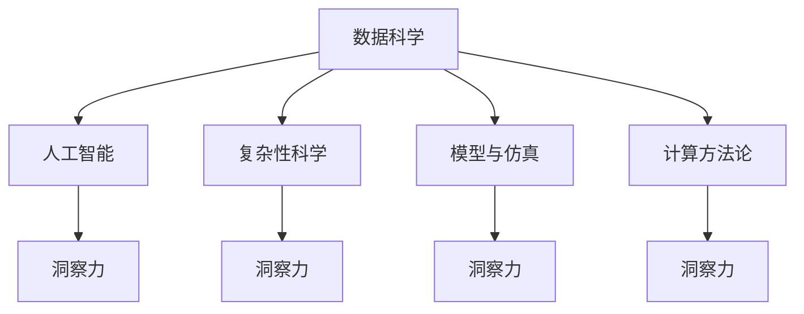

                 

# 洞察力与科学发现：突破性研究的源泉

## 1. 背景介绍

在科学与技术发展的历史长河中，洞察力一直是推动人类进步的重要动力。从牛顿的万有引力定律，到达尔文的进化论，再到现代科技革命，每一次重大发现都源于对现有知识体系的深刻洞察与突破。而洞察力，正是大科学时代的一个重要特征。

### 1.1 问题由来

随着大数据、人工智能等现代技术的兴起，科学研究的范式正在发生根本变革。传统的小规模、局部分析逐渐被大规模、全方位的数据驱动分析所取代。然而，数据背后隐藏的丰富知识，往往需要具备深厚理论功底和敏锐洞察力的研究者，才能揭示出其核心价值。大数据与人工智能的结合，为洞察力的生成提供了新工具，也为科学发现带来了新机遇。

### 1.2 问题核心关键点

在现代科学研究中，洞察力被定义为：通过对已有知识体系的深度理解，揭示出潜在的规律、模式或新现象的能力。其核心在于：

- **多学科交叉**：跨领域的理论和方法，有助于从不同角度洞察复杂问题。
- **大规模数据分析**：大数据技术提供了海量数据来源，助力研究人员从海量信息中提取有价值的模式。
- **复杂性理论**：利用复杂系统理论，揭示现象背后的复杂机制。
- **计算模型与模拟**：通过构建计算模型，模拟复杂系统，发现潜在规律。
- **数据驱动的推理**：借助人工智能算法，对数据进行分析和推理，发现新的现象和规律。

通过这些关键点，研究人员能够从复杂的现象中发现更深层次的规律，推动科学研究的不断进步。

## 2. 核心概念与联系

### 2.1 核心概念概述

为更好地理解洞察力的生成机制，本节将介绍几个核心概念：

- **数据科学**：通过数据收集、处理、分析，发现数据背后的规律和趋势，是洞察力生成的基础。
- **人工智能**：借助机器学习、深度学习等技术，对数据进行高级分析和推理，为洞察力的发现提供技术手段。
- **复杂性科学**：研究复杂系统，揭示系统内部的相互作用机制，帮助研究人员理解复杂的自然和社会现象。
- **模型与仿真**：通过构建计算模型和仿真实验，模拟系统行为，洞察其内在规律。
- **计算方法论**：利用计算方法论，如随机实验、蒙特卡罗模拟等，对复杂问题进行求解。

这些概念之间的逻辑关系可以通过以下Mermaid流程图来展示：



这个流程图展示了大科学时代洞察力生成机制的关键组成部分及其相互关系：

1. 数据科学提供了数据来源，是大科学的基础。
2. 人工智能和大数据技术，为洞察力的发现提供了高级分析和推理能力。
3. 复杂性科学揭示了复杂系统的内在机制。
4. 模型与仿真通过计算方法论，进一步理解系统行为。
5. 洞察力通过以上各环节的综合运用，最终生成。

这些概念共同构成了大科学时代洞察力的生成框架，使得研究人员能够从复杂的现象中发现更深层次的规律，推动科学研究的不断进步。

## 3. 核心算法原理 & 具体操作步骤

### 3.1 算法原理概述

洞察力的生成，实质上是一个多层次、多维度的综合分析过程。通过数据科学、人工智能、复杂性科学等工具，从不同角度对数据进行深入分析，揭示其背后的规律和模式。

从数据科学的角度，洞察力的生成可以分为数据收集、数据预处理、数据分析和数据可视化四个基本步骤。其中，数据分析是核心，包括描述性统计分析、探索性数据分析、假设检验、回归分析、聚类分析等。通过这些分析方法，研究人员可以从数据中提取有用的信息，洞察其背后的规律。

人工智能技术，特别是深度学习算法，通过对大规模数据集进行训练，能够揭示数据中的隐含模式，为洞察力的发现提供强大的技术支持。例如，通过卷积神经网络（CNN）和递归神经网络（RNN）等模型，研究人员可以从图像和序列数据中提取特征，发现模式和规律。

复杂性科学则通过建模和仿真，帮助研究人员理解系统的动态行为和交互机制。例如，通过系统动力学模型，研究人员可以模拟复杂系统的演化过程，揭示其内在规律。

### 3.2 算法步骤详解

基于上述原理，洞察力的生成一般包括以下几个关键步骤：

**Step 1: 数据收集与预处理**

- 通过数据采集工具和平台，从不同来源获取数据，确保数据的多样性和代表性。
- 对数据进行清洗和预处理，去除噪声和缺失值，确保数据的质量。

**Step 2: 数据分析与建模**

- 运用统计学和机器学习算法，对数据进行描述性分析和探索性分析，发现数据中的规律和趋势。
- 利用复杂性科学建模工具，对复杂系统进行建模和仿真，理解系统的动态行为和交互机制。

**Step 3: 假设检验与验证**

- 基于数据分析和建模结果，提出科学假设，进行假设检验。
- 通过实验或仿真验证假设的正确性，调整模型参数和分析方法，进一步优化洞察力。

**Step 4: 洞察力的提取与应用**

- 通过数据可视化工具，将洞察力结果以图形化方式展示，帮助研究人员理解和交流。
- 将洞察力应用于实际问题，推动科学研究的进步。

### 3.3 算法优缺点

洞察力生成技术具有以下优点：

1. **高效性**：通过自动化和算法化的方法，大幅提升数据分析和推理的效率。
2. **全面性**：多学科、多层次的分析方法，有助于全面理解复杂问题。
3. **鲁棒性**：数据科学和人工智能技术能够处理大规模、高维度的数据，提高分析的鲁棒性。

同时，该技术也存在一定的局限性：

1. **数据质量依赖**：洞察力的生成高度依赖数据的质量和多样性，数据偏差可能导致分析结果的偏差。
2. **算法复杂性**：高级分析和推理算法，如深度学习模型，通常具有较高的计算复杂度，需要较强的计算资源。
3. **理论局限**：某些复杂现象可能难以通过现有理论和方法进行全面解释，需要进一步的理论创新。

尽管存在这些局限性，但整体而言，洞察力生成技术在大科学时代仍是大规模数据分析和科学发现的重要工具。未来研究将更多地关注算法的优化和理论的创新，进一步提升洞察力的生成能力。

### 3.4 算法应用领域

洞察力生成技术在多个领域都有广泛的应用，例如：

- **环境科学**：通过分析卫星数据和地面监测数据，洞察全球气候变化趋势，预测环境风险。
- **生物医药**：利用基因数据和临床试验数据，洞察疾病机理，加速新药研发。
- **金融市场**：通过分析历史交易数据和新闻数据，洞察市场趋势，进行投资决策。
- **社会科学**：通过分析社会调查数据和网络数据，洞察社会行为模式，推动公共政策制定。
- **物理科学**：通过实验数据和计算模拟，洞察物理现象的本质，推动基础科学研究。

除了上述这些经典领域外，洞察力生成技术还在更多新兴领域中得到了应用，如智能城市、智慧农业、数字经济等，为各行各业带来了新的研究方法和创新机遇。

## 4. 数学模型和公式 & 详细讲解 & 举例说明

### 4.1 数学模型构建

本节将使用数学语言对洞察力的生成机制进行更加严格的刻画。

设研究人员获取的数据集为 $D=\{(x_i,y_i)\}_{i=1}^N$，其中 $x_i$ 为输入数据，$y_i$ 为真实标签。假设 $x_i$ 为多维度向量，$y_i$ 为离散标签。

定义数据的描述性统计特征为 $S_x$，探索性数据分析特征为 $S_y$。通过描述性统计和探索性分析，研究人员可以得到数据的均值、方差、分布等基本特征，以及数据间的相关性等。

进一步，定义数据模型 $M(x;\theta)$，其中 $\theta$ 为模型参数，$M$ 为任意模型，如线性回归模型、决策树模型、深度学习模型等。通过对 $M(x;\theta)$ 进行训练，可以得到模型参数 $\hat{\theta}$，进而得到数据模型 $M(x;\hat{\theta})$。

通过模型 $M(x;\hat{\theta})$ 对 $y_i$ 进行预测，可以得到预测标签 $\hat{y}_i$。定义预测误差为 $\epsilon_i = y_i - \hat{y}_i$，进而可以计算预测误差 $E[\epsilon_i]$，评估模型的预测能力。

### 4.2 公式推导过程

以下我们以线性回归模型为例，推导描述性统计和模型预测误差的过程。

假设模型 $M(x;\theta) = \theta_0 + \theta_1x_1 + \theta_2x_2 + \cdots + \theta_px_p$，其中 $\theta_0,\theta_1,\cdots,\theta_p$ 为模型参数。

数据的描述性统计特征为 $\bar{x} = \frac{1}{N}\sum_{i=1}^N x_i$，$\sigma_x^2 = \frac{1}{N}\sum_{i=1}^N (x_i - \bar{x})^2$。通过最小二乘法，可以得到模型参数的估计值 $\hat{\theta} = (X^TX)^{-1}X^Ty$，其中 $X = [1,x_1,x_2,\cdots,x_p]^T$，$y = [y_1,y_2,\cdots,y_N]^T$。

模型预测误差为 $\epsilon_i = y_i - \hat{y}_i = y_i - (X\hat{\theta})_i$。通过均方误差（MSE）计算预测误差，$E[\epsilon_i] = \sigma^2$，其中 $\sigma^2$ 为模型预测误差的方差。

### 4.3 案例分析与讲解

假设研究人员要分析某地区的空气质量数据，数据集为 $D=\{(x_i,y_i)\}_{i=1}^N$，其中 $x_i$ 为空气质量监测站点的坐标、气象数据等，$y_i$ 为空气质量指数（AQI）。

首先，对数据集进行描述性统计分析，得到各监测站点 AQI 的均值、方差、最大值、最小值等基本特征。接着，通过探索性数据分析，发现 AQI 与天气条件、交通流量等变量之间存在一定的相关性。

然后，构建线性回归模型 $M(x;\theta) = \theta_0 + \theta_1x_{1,i} + \theta_2x_{2,i} + \cdots + \theta_px_{p,i}$，其中 $x_{1,i},x_{2,i},\cdots,x_{p,i}$ 为不同气象条件和交通流量的指标。通过对模型进行训练，可以得到参数 $\hat{\theta}$，进而得到模型 $M(x;\hat{\theta})$。

最后，利用模型 $M(x;\hat{\theta})$ 对新监测站点进行预测，得到 AQI 的预测值。通过计算预测误差 $E[\epsilon_i]$，评估模型的预测能力，调整模型参数，优化洞察力生成过程。

## 5. 项目实践：代码实例和详细解释说明

### 5.1 开发环境搭建

在进行洞察力生成实践前，我们需要准备好开发环境。以下是使用Python进行Python科学计算的环境配置流程：

1. 安装Anaconda：从官网下载并安装Anaconda，用于创建独立的Python环境。

2. 创建并激活虚拟环境：
```bash
conda create -n pydata-env python=3.8 
conda activate pydata-env
```

3. 安装PyTorch：根据CUDA版本，从官网获取对应的安装命令。例如：
```bash
conda install pytorch torchvision torchaudio cudatoolkit=11.1 -c pytorch -c conda-forge
```

4. 安装NumPy、Pandas、SciPy等库：
```bash
pip install numpy pandas scipy scikit-learn matplotlib tqdm jupyter notebook ipython
```

完成上述步骤后，即可在`pydata-env`环境中开始洞察力生成实践。

### 5.2 源代码详细实现

这里我们以线性回归模型为例，给出使用PyTorch进行数据分析和模型训练的PyTorch代码实现。

```python
import torch
import torch.nn as nn
import torch.optim as optim
import numpy as np
import pandas as pd

# 定义线性回归模型
class LinearRegression(nn.Module):
    def __init__(self, input_dim, output_dim):
        super(LinearRegression, self).__init__()
        self.linear = nn.Linear(input_dim, output_dim)
    
    def forward(self, x):
        y_pred = self.linear(x)
        return y_pred

# 定义数据集
data = pd.read_csv('data.csv')
X = data.iloc[:, :-1].values
y = data.iloc[:, -1].values

# 将数据转换为PyTorch张量
X_tensor = torch.from_numpy(X).float()
y_tensor = torch.from_numpy(y).float()

# 定义模型、优化器和损失函数
model = LinearRegression(input_dim=X.shape[1], output_dim=1)
optimizer = optim.SGD(model.parameters(), lr=0.01)
criterion = nn.MSELoss()

# 训练模型
epochs = 1000
for epoch in range(epochs):
    optimizer.zero_grad()
    y_pred = model(X_tensor)
    loss = criterion(y_pred, y_tensor)
    loss.backward()
    optimizer.step()
    if (epoch+1) % 100 == 0:
        print(f'Epoch {epoch+1}, Loss: {loss.item()}')

# 输出模型参数
print('Model Parameters:')
for param in model.parameters():
    print(param)
```

### 5.3 代码解读与分析

让我们再详细解读一下关键代码的实现细节：

**LinearRegression类**：
- `__init__`方法：初始化模型参数，包括线性层。
- `forward`方法：前向传播，计算输出。

**数据集处理**：
- 从CSV文件中读取数据，将输入特征和输出标签分别转换为PyTorch张量。

**模型训练**：
- 定义模型、优化器、损失函数。
- 通过循环迭代，在每个epoch中计算模型输出、损失函数，并通过反向传播更新模型参数。

**输出结果**：
- 打印模型参数，展示模型学习效果。

在实际的洞察力生成过程中，根据具体任务的不同，模型训练的过程可能需要进行多次调整和优化。例如，通过调整学习率、增加正则化项、引入数据增强等手段，可以提高模型的泛化能力和预测精度。

## 6. 实际应用场景

### 6.1 环境科学

通过分析历史气象数据、气候变化数据等，研究人员可以洞察全球气候变化趋势，预测未来气候变化。例如，通过线性回归模型，可以建立二氧化碳浓度与全球气温之间的关系，预测未来气温变化。

### 6.2 生物医药

利用基因数据和临床试验数据，研究人员可以洞察疾病机理，加速新药研发。例如，通过深度学习算法，可以分析基因组数据和药物作用机制，发现潜在的药物靶点和治疗方案。

### 6.3 金融市场

通过分析历史交易数据和新闻数据，研究人员可以洞察市场趋势，进行投资决策。例如，通过时间序列分析，可以预测股票价格的走势，辅助投资决策。

### 6.4 未来应用展望

随着洞察力生成技术的不断进步，其在科学研究和社会治理中的应用前景将更加广阔。

在智慧城市治理中，通过分析城市运行数据，洞察交通拥堵、空气质量等问题的根源，制定科学合理的城市规划和管理措施。

在智慧农业中，通过分析气象数据、土壤数据等，洞察作物生长规律，优化种植方案，提高农业生产效率。

在数字经济中，通过分析用户行为数据，洞察市场需求和消费趋势，优化产品设计和市场策略。

此外，在企业决策、公共政策制定、社会治理等多个领域，洞察力生成技术都将发挥重要作用，推动各行各业的健康发展。

## 7. 工具和资源推荐

### 7.1 学习资源推荐

为了帮助开发者系统掌握洞察力生成技术的基础知识和实践技巧，这里推荐一些优质的学习资源：

1. 《数据科学导论》系列博文：由数据科学专家撰写，全面介绍了数据科学的基本概念和经典模型。

2. 《深度学习与人工智能》课程：由斯坦福大学等知名高校开设的深度学习课程，内容涵盖机器学习、深度学习、计算机视觉、自然语言处理等领域。

3. 《数据科学与人工智能》书籍：全面介绍了数据科学与人工智能的理论和实践，包括数据处理、机器学习、深度学习、数据可视化等方面。

4. Kaggle：全球知名的数据科学竞赛平台，提供大量数据集和竞赛机会，帮助你积累实践经验。

5. Coursera：提供大量数据科学和人工智能课程，由世界各地的知名学者和机构提供。

通过对这些资源的学习实践，相信你一定能够快速掌握洞察力生成技术的精髓，并用于解决实际的科学问题。

### 7.2 开发工具推荐

高效的开发离不开优秀的工具支持。以下是几款用于洞察力生成开发的常用工具：

1. Jupyter Notebook：交互式编程环境，方便进行数据处理和模型训练。

2. PyTorch：基于Python的深度学习框架，灵活的计算图设计，适合快速迭代研究。

3. TensorFlow：由Google主导开发的深度学习框架，生产部署方便，适合大规模工程应用。

4. SciPy：开源的Python科学计算库，提供大量科学计算功能，适合数据分析和建模。

5. NumPy：开源的Python数值计算库，提供高性能的数组操作和科学计算功能。

6. Matplotlib：开源的Python绘图库，支持丰富的图表类型，适合数据可视化。

合理利用这些工具，可以显著提升洞察力生成任务的开发效率，加快创新迭代的步伐。

### 7.3 相关论文推荐

洞察力生成技术的研究源于学界的持续研究。以下是几篇奠基性的相关论文，推荐阅读：

1. "Big Data Mining and Statistical Learning" by Jiawei Han et al.
2. "Deep Learning for NLP" by Yoshua Bengio et al.
3. "Data Science for Business" by Foster Provost and Tom Fawcett.
4. "Complexity: The Emerging Science at the Edge of Order and Chaos" by Robert M. May.
5. "Applied Predictive Modeling" by Max Kuhn and Kjell Johnson.

这些论文代表了大科学时代洞察力生成技术的发展脉络。通过学习这些前沿成果，可以帮助研究者把握学科前进方向，激发更多的创新灵感。

## 8. 总结：未来发展趋势与挑战

### 8.1 总结

本文对洞察力的生成机制进行了全面系统的介绍。首先阐述了洞察力在大科学时代的重要作用，明确了其在科学研究和社会治理中的独特价值。其次，从原理到实践，详细讲解了洞察力的数学模型和操作步骤，给出了洞察力生成任务开发的完整代码实例。同时，本文还广泛探讨了洞察力生成技术在多个行业领域的应用前景，展示了其巨大的潜力。

通过本文的系统梳理，可以看到，洞察力生成技术正在成为大科学时代的重要工具，极大地提升了科学研究和社会治理的效率和效果。未来，伴随数据科学、人工智能技术的不断进步，洞察力生成技术将在更多领域得到应用，为各行各业带来新的研究方法和创新机遇。

### 8.2 未来发展趋势

展望未来，洞察力生成技术将呈现以下几个发展趋势：

1. **大数据的普及**：随着大数据技术的不断发展，数据量将大幅增长，洞察力生成将依赖更大规模的数据来源。

2. **深度学习的应用**：深度学习算法在数据处理和推理方面具有显著优势，将成为洞察力生成的重要工具。

3. **多模态数据融合**：通过融合视觉、音频、文本等多种模态数据，洞察力生成将具备更全面的数据视角。

4. **计算资源的提升**：随着高性能计算资源的普及，洞察力生成将具备更高的计算能力和处理速度。

5. **跨学科方法的融合**：跨学科方法的融合将带来新的分析手段和理论工具，进一步提升洞察力生成的效果。

6. **实时分析能力的增强**：通过引入实时数据分析技术，洞察力生成将具备更强的时效性和响应能力。

这些趋势凸显了洞察力生成技术的广阔前景。这些方向的探索发展，必将进一步提升洞察力的生成能力，为科学研究和社会治理带来新的突破。

### 8.3 面临的挑战

尽管洞察力生成技术已经取得了瞩目成就，但在迈向更加智能化、普适化应用的过程中，它仍面临着诸多挑战：

1. **数据质量与多样性**：洞察力的生成高度依赖数据的质量和多样性，数据偏差可能导致分析结果的偏差。

2. **算法复杂性**：高级分析和推理算法，如深度学习模型，通常具有较高的计算复杂度，需要较强的计算资源。

3. **理论局限**：某些复杂现象可能难以通过现有理论和方法进行全面解释，需要进一步的理论创新。

4. **跨学科协作**：跨学科协作难度较大，不同领域之间的知识整合和应用需要更多时间和精力。

5. **隐私与安全**：数据隐私和安全问题，是洞察力生成过程中需要重点关注的重要问题。

6. **伦理与法律**：洞察力生成可能涉及隐私、伦理和法律问题，需要制定相应的政策和规范。

正视洞察力生成面临的这些挑战，积极应对并寻求突破，将是大科学时代洞察力生成的必由之路。相信随着学界和产业界的共同努力，这些挑战终将一一被克服，洞察力生成技术必将在科学研究和社会治理中发挥更大的作用。

### 8.4 研究展望

面对洞察力生成面临的挑战，未来的研究需要在以下几个方面寻求新的突破：

1. **数据采集与处理**：通过引入更多来源、更高质量的数据，提升数据的代表性和多样性。

2. **算法优化与创新**：开发更加高效、灵活的算法，提升数据处理和推理能力。

3. **跨学科方法论**：推动跨学科方法的融合，为洞察力生成提供更多的理论支持和应用手段。

4. **隐私与安全保护**：加强数据隐私保护和安全防范，确保数据使用的合规性和安全性。

5. **伦理与法律规范**：制定伦理与法律规范，保障洞察力生成的公正性和合理性。

6. **实时分析技术**：引入实时分析技术，提升洞察力生成的时效性和响应能力。

这些研究方向的探索，必将引领洞察力生成技术迈向更高的台阶，为科学研究和社会治理带来新的突破。

## 9. 附录：常见问题与解答

**Q1：洞察力生成是否适用于所有科学领域？**

A: 洞察力生成技术在大多数科学领域都能取得不错的效果，特别是对于大数据驱动的领域。但对于一些特定领域，如生物学、天文学等，可能还需要引入更专业的理论和方法。

**Q2：洞察力生成过程中如何选择合适的数据集？**

A: 选择合适的数据集是洞察力生成的关键。应尽量选择数据量丰富、质量高、多样化且代表性强的数据集。对于特定领域，可以选择领域内的权威数据集或公开数据集，如政府公开数据、开源数据集等。

**Q3：洞察力生成中如何处理数据偏差问题？**

A: 数据偏差是洞察力生成中常见的问题，可以通过数据清洗、数据增强、样本加权等方法进行处理。同时，引入机器学习中的正则化技术，如L1正则、Dropout等，可以有效降低模型的过拟合风险。

**Q4：洞察力生成中如何保证结果的准确性和可靠性？**

A: 保证洞察力生成结果的准确性和可靠性，需要从数据采集、数据处理、模型训练等多个环节进行全面的质量控制。定期进行模型验证和效果评估，确保模型在不同数据集上的泛化能力和鲁棒性。

**Q5：洞察力生成技术在科学研究中的应用前景如何？**

A: 洞察力生成技术在科学研究中具有广泛的应用前景，特别是在大规模数据分析、复杂系统建模、科学发现等方面。随着数据科学和人工智能技术的不断进步，洞察力生成将逐步成为科学研究的重要工具，为科研工作带来新的突破和创新。

综上所述，洞察力生成技术是大科学时代的核心工具之一，将在科学研究和社会治理中发挥重要作用。未来，随着技术的不断进步和应用领域的不断拓展，洞察力生成技术必将带来更多创新和突破，推动科学研究的不断进步。

---

作者：禅与计算机程序设计艺术 / Zen and the Art of Computer Programming

