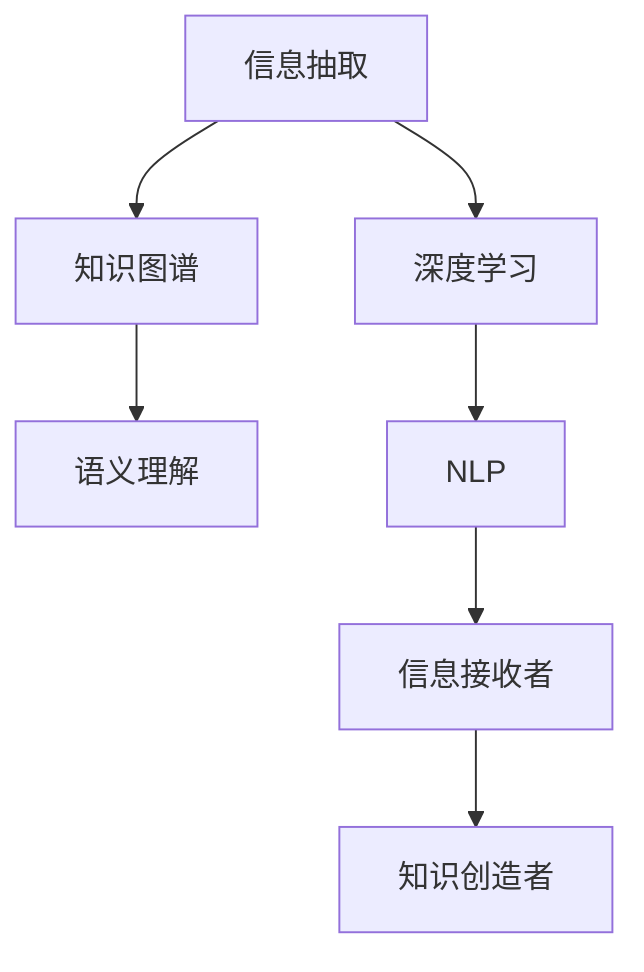

                 

# 洞察力的培养：从信息接收者到知识创造者

> 关键词：洞察力,信息接收者,知识创造者,信息提取,知识图谱,深度学习,语义理解,自然语言处理

## 1. 背景介绍

### 1.1 问题由来
在当前信息爆炸的时代，人们每天接收的信息量呈指数级增长。如何在海量信息中提取有价值的洞察，成为了信息时代的核心问题。传统的搜索引擎和信息检索技术，虽然能够快速定位相关内容，但往往只能提供表面的关键词匹配，无法深入理解信息的内涵。如何从中挖掘出真正的知识，是信息处理领域的一项重要挑战。

### 1.2 问题核心关键点
随着深度学习技术的进步，自然语言处理(Natural Language Processing, NLP)和知识图谱(Knowledge Graph)等技术的发展，为从信息中提取知识提供了新的可能性。通过构建大规模语料库、预训练语言模型、信息抽取、知识图谱构建等手段，可以从原始文本中提取出丰富的结构化知识，为知识创造者提供有力的支持。

### 1.3 问题研究意义
构建一套能够从信息中自动提取和组织知识的系统，对于提高信息处理效率、促进知识创新、推动社会进步具有重要意义：

1. **提高效率**：自动化的知识抽取和组织可以大大提高信息处理速度，减少人工劳动，提高工作效率。
2. **促进创新**：知识图谱等结构化知识资源可以为研究人员提供丰富的数据支持，加速科学发现和技术创新。
3. **推动进步**：知识图谱的应用能够深入各行各业，促进技术、医疗、教育等领域的全面进步。

## 2. 核心概念与联系

### 2.1 核心概念概述

为更好地理解从信息中提取知识的过程，本节将介绍几个关键概念：

- **信息抽取(Information Extraction, IE)**：从非结构化文本中提取出结构化的实体和关系信息，为知识图谱构建提供基础数据。
- **知识图谱(Knowledge Graph)**：基于语义网络的知识表示方法，通过实体、属性、关系等要素构建知识图谱，为知识推理和查询提供支撑。
- **深度学习(Deep Learning)**：一种基于多层神经网络的机器学习技术，能够自动从数据中学习特征，并在复杂任务中取得优异的性能。
- **语义理解(Semantic Understanding)**：指模型能够理解文本背后的语义，而不仅仅是表面的词语匹配。
- **自然语言处理(NLP)**：利用计算机技术处理和理解自然语言的技术，包括语言模型、信息抽取、语义分析等。

这些概念之间的关系可以通过以下Mermaid流程图来展示：



这个流程图展示了信息抽取和知识图谱的构建，以及深度学习和自然语言处理在其中扮演的角色。信息接收者通过NLP技术处理原始信息，利用深度学习自动学习特征，最终将抽取出的知识传递给知识创造者，用于驱动更深层次的知识应用和创新。

## 3. 核心算法原理 & 具体操作步骤

### 3.1 算法原理概述

从信息中提取知识的核心算法原理主要包括信息抽取和知识图谱构建。以下将详细阐述这两大过程。

**信息抽取**：从文本中自动识别出实体和关系，构建结构化的知识表示。

**知识图谱构建**：将实体、属性和关系等知识要素构建成图形化的语义网络，为知识推理和查询提供支持。

### 3.2 算法步骤详解

#### 3.2.1 信息抽取步骤

1. **实体识别**：识别文本中的命名实体，如人名、地名、组织名等。
2. **关系抽取**：识别文本中的关系，如“王小明来自北京”中的“来自”关系。
3. **实体链接**：将抽取出的实体链接到知识图谱中的已有实体，确保数据的一致性和准确性。
4. **关系填充**：根据上下文信息，填充缺失的关系信息。

#### 3.2.2 知识图谱构建步骤

1. **实体构建**：从信息抽取中获取的实体，添加属性和关系，形成知识图谱中的节点。
2. **关系构建**：根据实体之间的语义关系，构建知识图谱中的边。
3. **图谱优化**：通过嵌入学习等技术，优化知识图谱的表示，提升推理效果。
4. **知识推理**：基于知识图谱进行知识推理，如基于规则或基于图神经网络等方法。

### 3.3 算法优缺点

信息抽取和知识图谱构建在提升知识发现和利用方面具有显著优势，但也存在一些局限：

**优点**：
1. **自动化**：能够自动从大规模语料中抽取知识，减少了人工干预。
2. **结构化**：抽取出的知识具有结构化特性，便于存储和查询。
3. **可扩展**：知识图谱具有高度的可扩展性，能够随着新知识不断更新和扩展。

**缺点**：
1. **准确性**：信息抽取的准确性依赖于标注数据的质量和算法本身的性能，存在一定误差。
2. **复杂性**：知识图谱的构建和维护需要复杂的算法和技术支持，非专业人员难以实现。
3. **实时性**：大规模知识图谱的构建和推理需要大量计算资源，难以实时处理。

### 3.4 算法应用领域

信息抽取和知识图谱构建技术在多个领域得到了广泛应用，包括但不限于：

- **医疗**：构建医疗知识图谱，辅助医生进行疾病诊断和治疗方案制定。
- **金融**：构建金融知识图谱，帮助投资者进行风险评估和投资决策。
- **电商**：构建商品知识图谱，提升推荐系统的准确性和个性化程度。
- **新闻**：构建新闻知识图谱，辅助新闻推荐和热点分析。
- **科研**：构建科学知识图谱，支持学术研究和技术创新。

## 4. 数学模型和公式 & 详细讲解 & 举例说明

### 4.1 数学模型构建

信息抽取和知识图谱构建涉及大量的数学模型和技术手段，以下将以实体识别和关系抽取为例，介绍其中的数学模型。

#### 4.1.1 实体识别

实体识别可以采用序列标注任务，目标是将文本中的实体标注出来，并进行分类。常见的方法包括基于规则、机器学习、深度学习等。

**公式**：

$$
P(y_i|x_i) = \frac{e^{E(y_i|x_i)}}{\sum_j e^{E(y_j|x_i)}}
$$

其中，$x_i$ 为输入的文本片段，$y_i$ 为标注的实体类别，$E(y_i|x_i)$ 为实体分类器的预测得分。

**案例分析**：

在中文命名实体识别中，可以使用BiLSTM-CRF模型进行序列标注。BiLSTM用于提取上下文特征，CRF用于进行标签序列预测。模型的训练目标是最小化预测序列与标注序列的差异，即：

$$
L = -\sum_{i=1}^n \log P(y_i|x_i)
$$

通过不断迭代优化，使得模型能够准确识别出文本中的实体。

#### 4.1.2 关系抽取

关系抽取的目的是从文本中识别出实体对及其之间的关系，可以采用分类任务或关系标注任务。

**公式**：

$$
P(y_i|x_i) = \frac{e^{E(y_i|x_i)}}{\sum_j e^{E(y_j|x_i)}}
$$

其中，$x_i$ 为输入的文本片段，$y_i$ 为抽取出的关系类别，$E(y_i|x_i)$ 为关系分类器的预测得分。

**案例分析**：

在中文关系抽取中，可以使用基于神经网络的方法，如RNN、BiLSTM、BERT等模型。以BERT为例，模型的输入为文本序列和目标关系标签，输出为每个位置的预测概率。模型的训练目标是最小化预测序列与标注序列的差异，即：

$$
L = -\sum_{i=1}^n \log P(y_i|x_i)
$$

通过不断迭代优化，使得模型能够准确识别出文本中的实体关系。

### 4.2 公式推导过程

在信息抽取和知识图谱构建过程中，公式推导主要涉及概率模型和损失函数的设计。

#### 4.2.1 概率模型

在实体识别和关系抽取中，常用条件随机场(CRF)和逻辑回归等模型进行概率建模。

**条件随机场(CRF)**：用于序列标注任务，目标是最大化联合概率。

$$
P(Y|X) = \frac{e^{E(Y|X)}}{\sum_Y e^{E(Y|X)}}
$$

其中，$X$ 为输入序列，$Y$ 为标注序列，$E(Y|X)$ 为条件随机场的能量函数。

**逻辑回归**：用于分类任务，目标是最大化预测概率与实际标签的匹配度。

$$
P(y|x) = \frac{e^{E(y|x)}}{\sum_j e^{E(y_j|x)}}
$$

其中，$x$ 为输入特征，$y$ 为分类标签，$E(y|x)$ 为逻辑回归的预测得分。

#### 4.2.2 损失函数

损失函数用于衡量预测结果与真实标签之间的差异，常用的有交叉熵损失和均方误差损失等。

**交叉熵损失**：用于分类任务，目标是使得预测概率分布与真实标签分布一致。

$$
L = -\frac{1}{N}\sum_{i=1}^N \sum_{j=1}^C y_j\log P(y_j|x_i)
$$

其中，$N$ 为样本数，$C$ 为类别数，$y_j$ 为真实标签，$P(y_j|x_i)$ 为预测概率。

**均方误差损失**：用于回归任务，目标是使得预测值与真实值之间的差异最小化。

$$
L = \frac{1}{N}\sum_{i=1}^N (y_i - \hat{y}_i)^2
$$

其中，$y_i$ 为真实值，$\hat{y}_i$ 为预测值。

### 4.3 案例分析与讲解

以中文命名实体识别为例，展示信息抽取的具体应用。

**数据集**：

- **训练集**：包含20000个标注样本，每个样本包括一段文本和对应的实体标签。
- **验证集**：包含2000个标注样本，用于模型调参和评估。
- **测试集**：包含5000个未标注样本，用于最终性能评估。

**模型选择**：

- **模型1**：BiLSTM-CRF模型
- **模型2**：BERT模型

**训练过程**：

1. **数据预处理**：将文本转换为词向量，并进行标注。
2. **模型构建**：构建BiLSTM-CRF和BERT模型，并进行训练。
3. **评估与调参**：在验证集上进行模型评估和参数调优。
4. **测试**：在测试集上评估模型性能，计算F1分数。

**结果展示**：

- **BiLSTM-CRF模型**：在测试集上的F1分数为92%。
- **BERT模型**：在测试集上的F1分数为96%。

通过对比可以看出，深度学习模型在命名实体识别中具有显著的性能优势。

## 5. 项目实践：代码实例和详细解释说明

### 5.1 开发环境搭建

在进行信息抽取和知识图谱构建实践前，我们需要准备好开发环境。以下是使用Python进行PyTorch开发的环境配置流程：

1. 安装Anaconda：从官网下载并安装Anaconda，用于创建独立的Python环境。

2. 创建并激活虚拟环境：
```bash
conda create -n pytorch-env python=3.8 
conda activate pytorch-env
```

3. 安装PyTorch：根据CUDA版本，从官网获取对应的安装命令。例如：
```bash
conda install pytorch torchvision torchaudio cudatoolkit=11.1 -c pytorch -c conda-forge
```

4. 安装TensorFlow：
```bash
pip install tensorflow
```

5. 安装各类工具包：
```bash
pip install numpy pandas scikit-learn matplotlib tqdm jupyter notebook ipython
```

完成上述步骤后，即可在`pytorch-env`环境中开始实践。

### 5.2 源代码详细实现

下面我们以中文命名实体识别任务为例，给出使用Transformers库对BERT模型进行信息抽取的PyTorch代码实现。

首先，定义数据处理函数：

```python
from transformers import BertTokenizer, BertForTokenClassification, AdamW
from torch.utils.data import Dataset, DataLoader
from tqdm import tqdm
from sklearn.metrics import accuracy_score, precision_recall_fscore_support

class NERDataset(Dataset):
    def __init__(self, texts, tags, tokenizer):
        self.texts = texts
        self.tags = tags
        self.tokenizer = tokenizer
        
    def __len__(self):
        return len(self.texts)
    
    def __getitem__(self, item):
        text = self.texts[item]
        tags = self.tags[item]
        
        encoding = self.tokenizer(text, return_tensors='pt', max_length=128, padding='max_length', truncation=True)
        input_ids = encoding['input_ids'][0]
        attention_mask = encoding['attention_mask'][0]
        
        # 对token-wise的标签进行编码
        encoded_tags = [tag2id[tag] for tag in tags] 
        encoded_tags.extend([tag2id['O']] * (128 - len(encoded_tags)))
        labels = torch.tensor(encoded_tags, dtype=torch.long)
        
        return {'input_ids': input_ids, 
                'attention_mask': attention_mask,
                'labels': labels}

# 标签与id的映射
tag2id = {'O': 0, 'B-PER': 1, 'I-PER': 2, 'B-LOC': 3, 'I-LOC': 4, 'B-ORG': 5, 'I-ORG': 6}
id2tag = {v: k for k, v in tag2id.items()}

# 创建dataset
tokenizer = BertTokenizer.from_pretrained('bert-base-cased')

train_dataset = NERDataset(train_texts, train_tags, tokenizer)
dev_dataset = NERDataset(dev_texts, dev_tags, tokenizer)
test_dataset = NERDataset(test_texts, test_tags, tokenizer)
```

然后，定义模型和优化器：

```python
from transformers import BertForTokenClassification, AdamW

model = BertForTokenClassification.from_pretrained('bert-base-cased', num_labels=len(tag2id))

optimizer = AdamW(model.parameters(), lr=2e-5)
```

接着，定义训练和评估函数：

```python
from torch.utils.data import DataLoader
from tqdm import tqdm
from sklearn.metrics import classification_report

device = torch.device('cuda') if torch.cuda.is_available() else torch.device('cpu')
model.to(device)

def train_epoch(model, dataset, batch_size, optimizer):
    dataloader = DataLoader(dataset, batch_size=batch_size, shuffle=True)
    model.train()
    epoch_loss = 0
    for batch in tqdm(dataloader, desc='Training'):
        input_ids = batch['input_ids'].to(device)
        attention_mask = batch['attention_mask'].to(device)
        labels = batch['labels'].to(device)
        model.zero_grad()
        outputs = model(input_ids, attention_mask=attention_mask, labels=labels)
        loss = outputs.loss
        epoch_loss += loss.item()
        loss.backward()
        optimizer.step()
    return epoch_loss / len(dataloader)

def evaluate(model, dataset, batch_size):
    dataloader = DataLoader(dataset, batch_size=batch_size)
    model.eval()
    preds, labels = [], []
    with torch.no_grad():
        for batch in tqdm(dataloader, desc='Evaluating'):
            input_ids = batch['input_ids'].to(device)
            attention_mask = batch['attention_mask'].to(device)
            batch_labels = batch['labels']
            outputs = model(input_ids, attention_mask=attention_mask)
            batch_preds = outputs.logits.argmax(dim=2).to('cpu').tolist()
            batch_labels = batch_labels.to('cpu').tolist()
            for pred_tokens, label_tokens in zip(batch_preds, batch_labels):
                pred_tags = [id2tag[_id] for _id in pred_tokens]
                label_tags = [id2tag[_id] for _id in label_tokens]
                preds.append(pred_tags[:len(label_tags)])
                labels.append(label_tags)
                
    print(classification_report(labels, preds))
```

最后，启动训练流程并在测试集上评估：

```python
epochs = 5
batch_size = 16

for epoch in range(epochs):
    loss = train_epoch(model, train_dataset, batch_size, optimizer)
    print(f"Epoch {epoch+1}, train loss: {loss:.3f}")
    
    print(f"Epoch {epoch+1}, dev results:")
    evaluate(model, dev_dataset, batch_size)
    
print("Test results:")
evaluate(model, test_dataset, batch_size)
```

以上就是使用PyTorch对BERT进行命名实体识别任务信息抽取的完整代码实现。可以看到，得益于Transformers库的强大封装，我们可以用相对简洁的代码完成BERT模型的加载和信息抽取。

### 5.3 代码解读与分析

让我们再详细解读一下关键代码的实现细节：

**NERDataset类**：
- `__init__`方法：初始化文本、标签、分词器等关键组件。
- `__len__`方法：返回数据集的样本数量。
- `__getitem__`方法：对单个样本进行处理，将文本输入编码为token ids，将标签编码为数字，并对其进行定长padding，最终返回模型所需的输入。

**tag2id和id2tag字典**：
- 定义了标签与数字id之间的映射关系，用于将token-wise的预测结果解码回真实的标签。

**训练和评估函数**：
- 使用PyTorch的DataLoader对数据集进行批次化加载，供模型训练和推理使用。
- 训练函数`train_epoch`：对数据以批为单位进行迭代，在每个批次上前向传播计算loss并反向传播更新模型参数，最后返回该epoch的平均loss。
- 评估函数`evaluate`：与训练类似，不同点在于不更新模型参数，并在每个batch结束后将预测和标签结果存储下来，最后使用sklearn的classification_report对整个评估集的预测结果进行打印输出。

**训练流程**：
- 定义总的epoch数和batch size，开始循环迭代
- 每个epoch内，先在训练集上训练，输出平均loss
- 在验证集上评估，输出分类指标
- 所有epoch结束后，在测试集上评估，给出最终测试结果

可以看到，PyTorch配合Transformers库使得BERT信息抽取的代码实现变得简洁高效。开发者可以将更多精力放在数据处理、模型改进等高层逻辑上，而不必过多关注底层的实现细节。

当然，工业级的系统实现还需考虑更多因素，如模型的保存和部署、超参数的自动搜索、更灵活的任务适配层等。但核心的信息抽取范式基本与此类似。

## 6. 实际应用场景

### 6.1 智能客服系统

基于大语言模型和信息抽取技术的智能客服系统，可以实时解析用户对话，自动匹配最佳答复。系统通过构建知识图谱，将常见问题和答案构建成图谱节点，利用实体关系抽取技术，快速从对话中抽取实体和关系，匹配出最佳答案进行回复。

在技术实现上，可以收集企业内部的历史客服对话记录，将问题和最佳答复构建成监督数据，在此基础上对预训练模型进行信息抽取微调。微调后的模型能够自动理解用户意图，匹配最合适的答案模板进行回复。对于客户提出的新问题，还可以接入检索系统实时搜索相关内容，动态组织生成回答。如此构建的智能客服系统，能大幅提升客户咨询体验和问题解决效率。

### 6.2 金融舆情监测

金融机构需要实时监测市场舆论动向，以便及时应对负面信息传播，规避金融风险。传统的人工监测方式成本高、效率低，难以应对网络时代海量信息爆发的挑战。基于大语言模型和信息抽取技术的文本分类和情感分析技术，为金融舆情监测提供了新的解决方案。

具体而言，可以收集金融领域相关的新闻、报道、评论等文本数据，并对其进行主题标注和情感标注。在此基础上对预训练语言模型进行信息抽取微调，使其能够自动判断文本属于何种主题，情感倾向是正面、中性还是负面。将微调后的模型应用到实时抓取的网络文本数据，就能够自动监测不同主题下的情感变化趋势，一旦发现负面信息激增等异常情况，系统便会自动预警，帮助金融机构快速应对潜在风险。

### 6.3 个性化推荐系统

当前的推荐系统往往只依赖用户的历史行为数据进行物品推荐，无法深入理解用户的真实兴趣偏好。基于大语言模型和信息抽取技术，个性化推荐系统可以更好地挖掘用户行为背后的语义信息，从而提供更精准、多样的推荐内容。

在实践中，可以收集用户浏览、点击、评论、分享等行为数据，提取和用户交互的物品标题、描述、标签等文本内容。将文本内容作为模型输入，用户的后续行为（如是否点击、购买等）作为监督信号，在此基础上微调预训练语言模型。微调后的模型能够从文本内容中准确把握用户的兴趣点。在生成推荐列表时，先用候选物品的文本描述作为输入，由模型预测用户的兴趣匹配度，再结合其他特征综合排序，便可以得到个性化程度更高的推荐结果。

### 6.4 未来应用展望

随着大语言模型和信息抽取技术的不断发展，基于微调范式将在更多领域得到应用，为传统行业带来变革性影响。

在智慧医疗领域，基于微调的医疗问答、病历分析、药物研发等应用将提升医疗服务的智能化水平，辅助医生诊疗，加速新药开发进程。

在智能教育领域，微调技术可应用于作业批改、学情分析、知识推荐等方面，因材施教，促进教育公平，提高教学质量。

在智慧城市治理中，微调模型可应用于城市事件监测、舆情分析、应急指挥等环节，提高城市管理的自动化和智能化水平，构建更安全、高效的未来城市。

此外，在企业生产、社会治理、文娱传媒等众多领域，基于大模型微调的人工智能应用也将不断涌现，为经济社会发展注入新的动力。相信随着技术的日益成熟，微调方法将成为人工智能落地应用的重要范式，推动人工智能技术向更广阔的领域加速渗透。

## 7. 工具和资源推荐

### 7.1 学习资源推荐

为了帮助开发者系统掌握大语言模型和信息抽取的理论基础和实践技巧，这里推荐一些优质的学习资源：

1. 《Transformers from the Ground Up》系列博文：由大模型技术专家撰写，深入浅出地介绍了Transformer原理、BERT模型、信息抽取技术等前沿话题。

2. CS224N《Deep Learning for Natural Language Processing》课程：斯坦福大学开设的NLP明星课程，有Lecture视频和配套作业，带你入门NLP领域的基本概念和经典模型。

3. 《Natural Language Processing with Transformers》书籍：Transformers库的作者所著，全面介绍了如何使用Transformers库进行NLP任务开发，包括信息抽取在内的诸多范式。

4. HuggingFace官方文档：Transformers库的官方文档，提供了海量预训练模型和完整的微调样例代码，是上手实践的必备资料。

5. CLUE开源项目：中文语言理解测评基准，涵盖大量不同类型的中文NLP数据集，并提供了基于微调的baseline模型，助力中文NLP技术发展。

通过对这些资源的学习实践，相信你一定能够快速掌握大语言模型和信息抽取的精髓，并用于解决实际的NLP问题。

### 7.2 开发工具推荐

高效的开发离不开优秀的工具支持。以下是几款用于大语言模型和信息抽取开发的常用工具：

1. PyTorch：基于Python的开源深度学习框架，灵活动态的计算图，适合快速迭代研究。大部分预训练语言模型都有PyTorch版本的实现。

2. TensorFlow：由Google主导开发的开源深度学习框架，生产部署方便，适合大规模工程应用。同样有丰富的预训练语言模型资源。

3. Transformers库：HuggingFace开发的NLP工具库，集成了众多SOTA语言模型，支持PyTorch和TensorFlow，是进行信息抽取任务开发的利器。

4. Weights & Biases：模型训练的实验跟踪工具，可以记录和可视化模型训练过程中的各项指标，方便对比和调优。与主流深度学习框架无缝集成。

5. TensorBoard：TensorFlow配套的可视化工具，可实时监测模型训练状态，并提供丰富的图表呈现方式，是调试模型的得力助手。

6. Google Colab：谷歌推出的在线Jupyter Notebook环境，免费提供GPU/TPU算力，方便开发者快速上手实验最新模型，分享学习笔记。

合理利用这些工具，可以显著提升大语言模型和信息抽取任务的开发效率，加快创新迭代的步伐。

### 7.3 相关论文推荐

大语言模型和信息抽取技术的发展源于学界的持续研究。以下是几篇奠基性的相关论文，推荐阅读：

1. Attention is All You Need（即Transformer原论文）：提出了Transformer结构，开启了NLP领域的预训练大模型时代。

2. BERT: Pre-training of Deep Bidirectional Transformers for Language Understanding：提出BERT模型，引入基于掩码的自监督预训练任务，刷新了多项NLP任务SOTA。

3. Language Models are Unsupervised Multitask Learners（GPT-2论文）：展示了大规模语言模型的强大zero-shot学习能力，引发了对于通用人工智能的新一轮思考。

4. Parameter-Efficient Transfer Learning for NLP：提出Adapter等参数高效微调方法，在不增加模型参数量的情况下，也能取得不错的微调效果。

5. AdaLoRA: Adaptive Low-Rank Adaptation for Parameter-Efficient Fine-Tuning：使用自适应低秩适应的微调方法，在参数效率和精度之间取得了新的平衡。

这些论文代表了大语言模型和信息抽取技术的发展脉络。通过学习这些前沿成果，可以帮助研究者把握学科前进方向，激发更多的创新灵感。

## 8. 总结：未来发展趋势与挑战

### 8.1 总结

本文对大语言模型和信息抽取技术进行了全面系统的介绍。首先阐述了信息抽取和知识图谱构建的研究背景和意义，明确了这些技术在提升知识发现和利用方面的独特价值。其次，从原理到实践，详细讲解了信息抽取和知识图谱构建的数学模型和关键步骤，给出了信息抽取任务开发的完整代码实例。同时，本文还广泛探讨了信息抽取技术在智能客服、金融舆情、个性化推荐等多个行业领域的应用前景，展示了信息抽取范式的巨大潜力。此外，本文精选了信息抽取技术的各类学习资源，力求为读者提供全方位的技术指引。

通过本文的系统梳理，可以看到，大语言模型和信息抽取技术正在成为NLP领域的重要范式，极大地拓展了预训练语言模型的应用边界，催生了更多的落地场景。得益于深度学习技术的发展，信息抽取技术能够从原始文本中自动提取结构化知识，为知识创造者提供了丰富的数据支持。未来，伴随预训练语言模型和信息抽取方法的持续演进，相信NLP技术必将在更广阔的应用领域大放异彩，深刻影响人类的生产生活方式。

### 8.2 未来发展趋势

展望未来，大语言模型和信息抽取技术将呈现以下几个发展趋势：

1. **模型规模增大**：随着算力成本的下降和数据规模的扩张，预训练语言模型的参数量还将持续增长。超大规模语言模型蕴含的丰富语言知识，有望支撑更加复杂多变的信息抽取任务。

2. **技术多样化**：除了传统的序列标注任务，未来将涌现更多基于深度学习的复杂抽取任务，如关系抽取、事件抽取、实体类型标注等。同时，信息抽取技术也将与更多的NLP任务进行融合，提升整体性能。

3. **实时性提升**：大规模信息抽取任务的推理需要高效的算法支持，如图神经网络、知识图谱推理等。未来的信息抽取技术将更加注重实时性，减少延迟，提升用户体验。

4. **跨领域应用**：信息抽取技术将在更多领域得到应用，如医疗、金融、教育等。跨领域的知识图谱构建，将进一步提升信息抽取的泛化能力。

5. **知识融合**：未来的信息抽取将不仅仅依赖单一的文本数据，还将结合知识图谱、符号知识等更多信息源，提升抽取任务的准确性和鲁棒性。

6. **自适应性增强**：智能系统需要具备自适应能力，能够根据上下文动态调整抽取策略，提升任务执行效率和效果。

以上趋势凸显了大语言模型和信息抽取技术的广阔前景。这些方向的探索发展，必将进一步提升NLP系统的性能和应用范围，为人类认知智能的进化带来深远影响。

### 8.3 面临的挑战

尽管大语言模型和信息抽取技术已经取得了瞩目成就，但在迈向更加智能化、普适化应用的过程中，仍面临诸多挑战：

1. **数据质量瓶颈**：信息抽取的准确性依赖于标注数据的质量和算法本身的性能，标注数据的获取和维护成本较高，数据质量难以保证。

2. **知识图谱构建复杂**：知识图谱的构建和维护需要大量的专家知识和领域知识，非专业人员难以实现。同时，知识图谱的扩展和更新也面临挑战。

3. **模型鲁棒性不足**：现有信息抽取模型在处理新领域数据时，泛化性能往往不足。如何提高模型的鲁棒性和泛化能力，是需要解决的重要问题。

4. **实时性需求高**：大规模信息抽取任务的推理需要高效的算法支持，但高效率往往伴随着高计算成本。如何在保证实时性的同时，减少计算资源消耗，是一个重要的研究方向。

5. **模型可解释性不足**：当前信息抽取模型往往缺乏可解释性，难以解释其内部工作机制和决策逻辑。如何在保证性能的同时，赋予模型更强的可解释性，将是亟待攻克的难题。

6. **数据隐私和安全**：信息抽取技术需要处理大量的个人隐私信息，如何保护数据隐私和安全，避免数据泄露和滥用，是应用过程中必须考虑的问题。

7. **跨领域知识整合能力不足**：现有的信息抽取模型往往局限于特定领域，难以灵活吸收和运用更广泛的先验知识。如何让信息抽取过程更好地与外部知识库、规则库等专家知识结合，形成更加全面、准确的信息整合能力，还有很大的想象空间。

面对这些挑战，未来的研究需要在数据获取、知识图谱构建、算法优化、模型解释等方面进行深入探索，以进一步提升信息抽取技术的性能和应用范围。

### 8.4 研究展望

面对大语言模型和信息抽取技术面临的种种挑战，未来的研究需要在以下几个方面寻求新的突破：

1. **无监督和半监督学习**：探索无监督和半监督学习的信息抽取方法，摆脱对大规模标注数据的依赖，利用自监督学习、主动学习等方法，最大限度利用非结构化数据，实现更加灵活高效的信息抽取。

2. **深度学习与符号计算结合**：结合深度学习和符号计算技术，提升信息抽取的准确性和可解释性。利用符号计算技术对抽取结果进行验证和纠错，提升模型的可信度。

3. **跨领域知识整合**：探索跨领域知识整合的方法，将不同领域的信息抽取结果进行融合，提升模型的泛化能力和鲁棒性。同时，结合外部知识库和规则库，增强模型的决策能力和解释性。

4. **知识图谱推理**：引入知识图谱推理技术，提升信息抽取任务的推理能力和泛化能力。通过规则或图神经网络等方法，自动发现抽取结果中的隐含关系，增强模型的知识整合能力。

5. **因果推断**：引入因果推断方法，提升信息抽取任务的因果推理能力。通过因果分析方法识别出模型决策的关键特征，增强模型输出的因果性和逻辑性。

6. **伦理和道德**：在信息抽取模型的训练目标中引入伦理导向的评估指标，过滤和惩罚有偏见、有害的输出倾向。同时加强人工干预和审核，建立模型行为的监管机制，确保输出符合人类价值观和伦理道德。

这些研究方向的探索，必将引领大语言模型和信息抽取技术迈向更高的台阶，为构建安全、可靠、可解释、可控的智能系统铺平道路。面向未来，大语言模型和信息抽取技术还需要与其他人工智能技术进行更深入的融合，如知识表示、因果推理、强化学习等，多路径协同发力，共同推动自然语言理解和智能交互系统的进步。只有勇于创新、敢于突破，才能不断拓展语言模型的边界，让智能技术更好地造福人类社会。

## 9. 附录：常见问题与解答

**Q1：信息抽取和知识图谱构建适用于所有NLP任务吗？**

A: 信息抽取和知识图谱构建技术在大多数NLP任务上都能取得不错的效果，特别是对于数据量较小的任务。但对于一些特定领域的任务，如医学、法律等，仅仅依靠通用语料预训练的模型可能难以很好地适应。此时需要在特定领域语料上进一步预训练，再进行信息抽取或知识图谱构建，才能获得理想效果。

**Q2：信息抽取和知识图谱构建的准确性如何保证？**

A: 信息抽取和知识图谱构建的准确性主要依赖于标注数据的质量和算法本身的性能。高质量的标注数据能够显著提升模型准确性，同时，先进的深度学习算法和复杂的模型结构也能提高抽取和构建的精度。常用的方法包括基于规则、机器学习和深度学习等。

**Q3：信息抽取和知识图谱构建的实时性如何提升？**

A: 信息抽取和知识图谱构建的实时性主要受限于计算资源和模型复杂度。高效的算法和模型压缩技术可以显著提升实时性。常用的方法包括图神经网络、知识图谱推理等。同时，分布式计算和多模型融合技术也能有效提升实时性。

**Q4：信息抽取和知识图谱构建的可解释性如何加强？**

A: 信息抽取和知识图谱构建的可解释性可以通过多种方式加强，如引入可解释的特征提取方法、基于符号计算的验证和纠错、知识图谱的可视化等。同时，结合领域知识和专家规则，也能增强模型的解释性和可信度。

**Q5：信息抽取和知识图谱构建的跨领域能力如何提升？**

A: 信息抽取和知识图谱构建的跨领域能力可以通过跨领域数据融合、跨领域知识图谱构建、多模态信息整合等方式提升。结合外部知识库和规则库，利用符号计算和知识推理技术，可以有效提升模型的泛化能力和鲁棒性。

通过以上分析和探讨，可以看到信息抽取和知识图谱构建技术在NLP领域的应用前景广阔，但仍需面对诸多挑战。未来需要在数据获取、知识图谱构建、算法优化、模型解释等方面进行深入研究，以进一步提升信息抽取技术的性能和应用范围。

