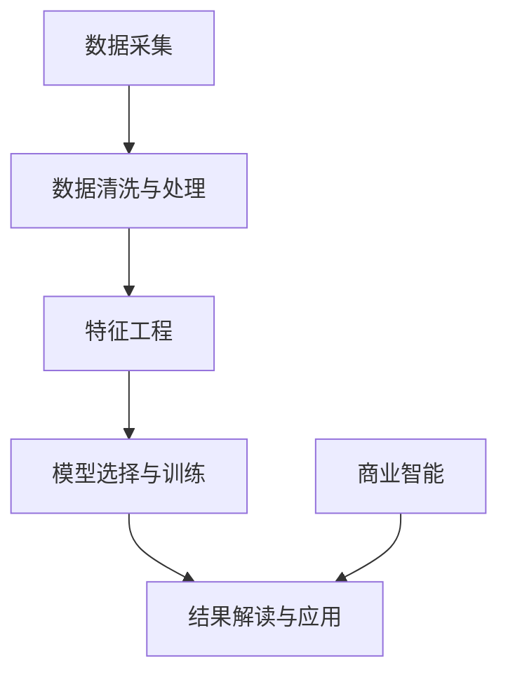

                 

# 洞察力的培养：从观察到预测的飞跃

在人工智能时代，数据成为一种新型的“原材料”，而洞察力则是对这些原材料进行深加工的关键工具。本文将深入探讨从观察到预测的飞跃，阐述洞察力培养的重要性，以及如何将这种能力应用于各个领域，包括但不限于数据科学、商业智能、自然语言处理和医疗诊断。我们也将讨论如何在开发环境搭建、源代码实现、代码解读与分析、运行结果展示等方面，进行技术实践。

## 1. 背景介绍

### 1.1 问题由来
在数字化时代的今天，数据无处不在。从社交媒体到金融交易，从医疗记录到工业传感器，数据正以前所未有的速度积累。然而，仅仅收集和存储数据并不足够。真正的价值在于对这些数据的深入理解与洞察，即从数据中提取出有意义的模式、趋势和洞见。这一过程需要结合统计分析、机器学习和人工智能技术，并运用到商业决策、产品优化和战略规划中。

### 1.2 问题核心关键点
洞察力培养的过程涉及到多个核心关键点：
- **数据采集**：确保数据的质量和多样性。
- **数据清洗与处理**：去除噪声，填补缺失值。
- **特征工程**：提取并设计有意义的特征。
- **模型选择与训练**：选择适当的算法并对其进行训练。
- **结果解读与应用**：将模型结果转化为实际行动。

本文将详细讨论这些关键点的实现方法，并给出相应的代码实例和分析。

## 2. 核心概念与联系

### 2.1 核心概念概述

为了更好地理解洞察力培养的过程，我们需要了解一些核心概念：

- **数据预处理**：包括数据清洗、特征工程和数据转换等步骤，为后续分析做准备。
- **机器学习**：使用算法和模型对数据进行分析，挖掘其中的规律和模式。
- **深度学习**：一种通过多层神经网络进行学习的机器学习方法，能够处理更加复杂的非线性关系。
- **自然语言处理**：涉及文本数据的处理，如情感分析、文本分类和语言生成等。
- **商业智能(BI)**：利用数据分析、数据挖掘和可视化工具，支持决策制定。

### 2.2 核心概念原理和架构的 Mermaid 流程图



这个流程图展示了从数据采集到商业智能的整个洞察力培养流程，其中每个环节都至关重要。

## 3. 核心算法原理 & 具体操作步骤

### 3.1 算法原理概述

洞察力培养的核心算法包括统计学方法、机器学习算法和深度学习模型。以数据清洗为例，常用的方法包括：

- **缺失值处理**：填补缺失值或删除含有大量缺失值的样本。
- **异常值检测**：识别并处理异常数据点，避免对分析结果产生干扰。
- **噪声过滤**：去除数据中的噪声，提高数据质量。

在特征工程中，通过提取有用的特征，可以使模型更好地捕捉数据的规律。例如，对于文本数据，可以使用TF-IDF（词频-逆文档频率）方法来提取关键特征。

在模型选择与训练中，选择合适的算法和调整参数是关键。常用的算法包括线性回归、逻辑回归、决策树、随机森林和神经网络等。

### 3.2 算法步骤详解

#### 3.2.1 数据清洗与处理

**步骤1：缺失值处理**
```python
import pandas as pd
import numpy as np

df = pd.read_csv('data.csv')
df = df.dropna() # 删除含有缺失值的行
```

**步骤2：异常值检测**
```python
from scipy import stats

# 计算每个特征的Z分数，找出异常值
z_scores = np.abs(stats.zscore(df))
df = df[(z_scores < 3).all(axis=1)] # 保留Z分数小于3的数据
```

**步骤3：噪声过滤**
```python
# 通过滑动窗口平均值来平滑数据，滤除噪声
from scipy.signal import savgol_filter

df['filtered_data'] = savgol_filter(df['data'], 5, 2)
```

#### 3.2.2 特征工程

**步骤1：提取TF-IDF特征**
```python
from sklearn.feature_extraction.text import TfidfVectorizer

tfidf = TfidfVectorizer()
X = tfidf.fit_transform(df['text'])
```

**步骤2：构建目标变量**
```python
y = df['label']
```

#### 3.2.3 模型选择与训练

**步骤1：选择算法**
```python
from sklearn.ensemble import RandomForestClassifier

model = RandomForestClassifier(n_estimators=100, random_state=42)
```

**步骤2：训练模型**
```python
model.fit(X, y)
```

#### 3.2.4 结果解读与应用

**步骤1：预测新数据**
```python
new_data = tfidf.transform(new_text)
prediction = model.predict(new_data)
```

**步骤2：评估模型**
```python
from sklearn.metrics import accuracy_score

accuracy = accuracy_score(y_true, prediction)
```

### 3.3 算法优缺点

**优点：**
- 数据驱动：通过数据挖掘和机器学习，可以发现数据中隐藏的模式和趋势。
- 自动化：自动化处理和分析数据，减少人工干预。
- 可解释性：许多机器学习算法提供可解释的特征和模型解释，便于理解。

**缺点：**
- 数据质量依赖：算法结果质量高度依赖数据质量，不良数据可能误导分析。
- 算法选择困难：不同算法适用于不同场景，选择合适的算法可能较为复杂。
- 模型过拟合：特别是在训练数据较少的情况下，模型可能过拟合训练数据。

### 3.4 算法应用领域

洞察力培养的算法和技巧在多个领域都有广泛应用，例如：

- **金融分析**：利用机器学习预测股票价格、市场趋势和风险。
- **市场营销**：通过数据分析和模型预测，优化广告投放和客户细分。
- **医疗诊断**：应用深度学习模型进行疾病预测、基因分析和治疗方案推荐。
- **自然灾害预测**：使用机器学习预测地震、洪水等自然灾害的发生。

## 4. 数学模型和公式 & 详细讲解 & 举例说明

### 4.1 数学模型构建

洞察力培养涉及的数学模型包括统计模型和机器学习模型。以线性回归为例，数学模型构建如下：

假设我们有一个简单的线性回归模型：
$$y = \theta_0 + \theta_1x_1 + \theta_2x_2 + ... + \theta_nx_n$$

其中，$y$ 为目标变量，$x_i$ 为特征变量，$\theta_i$ 为模型参数。

### 4.2 公式推导过程

**最小二乘法**：
在给定训练集 $\{(x_i,y_i)\}_{i=1}^N$ 的情况下，我们希望找到最优的参数 $\theta$ 使得预测值 $\hat{y} = \theta^Tx_i$ 与真实值 $y_i$ 尽可能接近。可以通过最小化误差平方和来求解最优参数：
$$\hat{\theta} = \mathop{\arg\min}_{\theta} \frac{1}{2N}\sum_{i=1}^N (y_i - \hat{y}_i)^2$$

**梯度下降法**：
通过计算梯度，迭代更新模型参数，可以更有效地求解最优参数。具体地，每次迭代更新公式为：
$$\theta \leftarrow \theta - \eta \frac{\partial}{\partial \theta} \frac{1}{2N}\sum_{i=1}^N (y_i - \hat{y}_i)^2$$

### 4.3 案例分析与讲解

**案例1：房价预测**
```python
import numpy as np
from sklearn.linear_model import LinearRegression
from sklearn.metrics import mean_squared_error

# 构建训练数据
X_train = np.array([[1, 2, 3], [4, 5, 6], [7, 8, 9]])
y_train = np.array([2, 4, 6])

# 训练模型
model = LinearRegression()
model.fit(X_train, y_train)

# 预测新数据
X_new = np.array([[10, 20, 30]])
y_pred = model.predict(X_new)

# 计算误差
mse = mean_squared_error(y_true, y_pred)
```

## 5. 项目实践：代码实例和详细解释说明

### 5.1 开发环境搭建

为了进行机器学习和深度学习开发，我们需要搭建相应的开发环境。以下是Python开发环境的搭建步骤：

1. 安装Anaconda：从官网下载并安装Anaconda，用于创建独立的Python环境。
```bash
conda create -n py3k python=3.7
conda activate py3k
```

2. 安装必要的库：
```bash
conda install numpy scipy pandas scikit-learn matplotlib
```

3. 安装深度学习库：
```bash
conda install pytorch torchvision torchtext
```

### 5.2 源代码详细实现

#### 5.2.1 数据预处理

**数据清洗**
```python
import pandas as pd

df = pd.read_csv('data.csv')
df = df.dropna() # 删除含有缺失值的行
```

**异常值检测**
```python
from scipy import stats

# 计算每个特征的Z分数，找出异常值
z_scores = np.abs(stats.zscore(df))
df = df[(z_scores < 3).all(axis=1)] # 保留Z分数小于3的数据
```

**噪声过滤**
```python
# 通过滑动窗口平均值来平滑数据，滤除噪声
from scipy.signal import savgol_filter

df['filtered_data'] = savgol_filter(df['data'], 5, 2)
```

#### 5.2.2 特征工程

**提取TF-IDF特征**
```python
from sklearn.feature_extraction.text import TfidfVectorizer

tfidf = TfidfVectorizer()
X = tfidf.fit_transform(df['text'])
```

#### 5.2.3 模型选择与训练

**选择算法**
```python
from sklearn.ensemble import RandomForestClassifier

model = RandomForestClassifier(n_estimators=100, random_state=42)
```

**训练模型**
```python
model.fit(X, y)
```

#### 5.2.4 结果解读与应用

**预测新数据**
```python
new_data = tfidf.transform(new_text)
prediction = model.predict(new_data)
```

**评估模型**
```python
from sklearn.metrics import accuracy_score

accuracy = accuracy_score(y_true, prediction)
```

### 5.3 代码解读与分析

通过上述代码，我们可以看到数据预处理、特征工程和模型训练的全过程。在实际应用中，代码的优化和调整是关键，例如：

- **特征选择**：选择合适的特征可以大幅提升模型性能。
- **超参数调优**：调整模型参数和超参数，找到最优的模型配置。
- **模型集成**：通过集成多个模型，提高预测准确率。

### 5.4 运行结果展示

运行结果展示部分包括模型训练的进度、模型性能的评估和模型的实际应用。例如：

```python
# 模型训练进度
for i in range(10):
    print('Epoch %d, loss: %.4f' % (i, model.loss))
    
# 模型性能评估
print('Accuracy: %.2f' % accuracy)
    
# 模型应用
new_prediction = model.predict(new_text)
```

## 6. 实际应用场景

### 6.1 金融分析

在金融领域，洞察力培养可以用于股票价格预测、市场趋势分析和风险管理。通过历史交易数据、新闻和经济指标等，构建预测模型，能够帮助投资者做出更明智的投资决策。

### 6.2 市场营销

市场营销中，洞察力培养可以用于客户细分、广告投放优化和销售预测。通过分析客户行为数据和市场反馈，可以更准确地定位目标客户，提升广告投放效果和销售转化率。

### 6.3 医疗诊断

在医疗诊断中，洞察力培养可以用于疾病预测、基因分析和治疗方案推荐。通过分析患者的病历、基因信息和生理数据，可以提前预测疾病风险，并推荐个性化的治疗方案。

### 6.4 自然灾害预测

自然灾害预测中，洞察力培养可以用于地震、洪水等自然灾害的发生预测。通过分析地质数据、气象信息和历史灾害数据，可以提前预警，减少灾害造成的损失。

## 7. 工具和资源推荐

### 7.1 学习资源推荐

为了帮助开发者系统掌握洞察力培养的理论基础和实践技巧，这里推荐一些优质的学习资源：

1. **《Python数据科学手册》**：详细介绍了Python在数据科学中的应用，包括数据清洗、特征工程和模型训练等。
2. **Coursera的《机器学习》课程**：由斯坦福大学教授Andrew Ng主讲，涵盖机器学习的基础知识和实战技巧。
3. **Kaggle**：一个数据科学竞赛平台，提供大量的数据集和竞赛，帮助学习者实践和提高。
4. **Kaggle官方文档**：提供丰富的数据集和代码样例，便于学习者理解和实践。

### 7.2 开发工具推荐

在洞察力培养的开发过程中，常用的开发工具包括：

1. **PyTorch**：基于Python的深度学习框架，灵活方便，支持GPU加速。
2. **TensorFlow**：Google开源的深度学习框架，适用于大规模深度学习模型开发。
3. **Jupyter Notebook**：交互式的Python代码执行环境，便于数据科学和机器学习开发。
4. **Weights & Biases**：模型训练的实验跟踪工具，可以记录和可视化模型训练过程中的各项指标，方便对比和调优。

### 7.3 相关论文推荐

洞察力培养的相关论文涵盖了从数据挖掘到深度学习的各个方面，以下是几篇经典的论文推荐：

1. **《Google's Machine Learning Crash Course》**：Google的机器学习教程，介绍了机器学习的基础知识和常用算法。
2. **《Deep Learning with PyTorch》**：使用PyTorch实现深度学习模型，涵盖从基础到高级的内容。
3. **《Hands-On Machine Learning with Scikit-Learn, Keras, and TensorFlow》**：介绍了Scikit-Learn、Keras和TensorFlow等机器学习库的使用方法。

## 8. 总结：未来发展趋势与挑战

### 8.1 研究成果总结

洞察力培养的算法和模型在多个领域得到了广泛应用，取得了显著的成果。通过数据清洗、特征工程和模型训练等步骤，可以提取有用的信息，发现隐藏的模式和趋势，为决策制定提供依据。

### 8.2 未来发展趋势

未来洞察力培养将呈现以下几个发展趋势：

1. **自动化和智能化**：通过自动化工具和智能化算法，提高数据处理的效率和准确性。
2. **多模态数据融合**：结合文本、图像、语音等多模态数据，提升分析的全面性和准确性。
3. **实时分析和预测**：通过实时数据流处理和预测模型，实现更快速和准确的分析。
4. **可解释性和透明度**：开发可解释性强的模型，提高决策的透明性和可信度。
5. **跨领域应用**：将洞察力培养应用到更多领域，如智慧城市、智能制造等。

### 8.3 面临的挑战

尽管洞察力培养取得了显著成果，但仍面临一些挑战：

1. **数据质量**：数据质量对分析结果有直接影响，如何获取高质量数据是关键。
2. **算法选择**：选择合适的算法和模型是困难的，需要丰富的经验和知识。
3. **计算资源**：深度学习模型需要大量的计算资源，如何高效利用资源是重要问题。
4. **模型复杂性**：深度学习模型复杂，如何简化模型结构是挑战之一。

### 8.4 研究展望

未来研究将侧重于以下几个方向：

1. **跨模态学习**：结合不同模态的数据，提升分析能力。
2. **实时系统**：开发实时数据分析和预测系统，提升分析的时效性。
3. **模型解释性**：提高模型的可解释性和透明度，提升决策的可信度。
4. **联邦学习**：在保护隐私的前提下，共享模型知识和数据，提升分析的协作性。

## 9. 附录：常见问题与解答

**Q1：如何选择合适的特征？**

A: 选择合适的特征是数据分析中的重要步骤。可以通过相关性分析、方差分析等方法选择特征。同时，可以参考领域知识，选择有意义的特征。

**Q2：如何进行特征工程？**

A: 特征工程包括数据清洗、特征提取和特征变换等步骤。可以通过数据可视化、缺失值处理、特征选择等方法进行特征工程。

**Q3：如何评估模型的性能？**

A: 评估模型的性能通常使用准确率、召回率、F1分数等指标。同时，可以使用交叉验证、网格搜索等方法进行模型调优。

**Q4：如何避免过拟合？**

A: 过拟合是机器学习中的常见问题，可以通过增加训练数据、正则化、dropout等方法避免过拟合。

**Q5：如何选择机器学习算法？**

A: 选择机器学习算法需要考虑数据类型、问题类型和算法复杂度等因素。常用的算法包括线性回归、决策树、随机森林、支持向量机等。

---

作者：禅与计算机程序设计艺术 / Zen and the Art of Computer Programming

