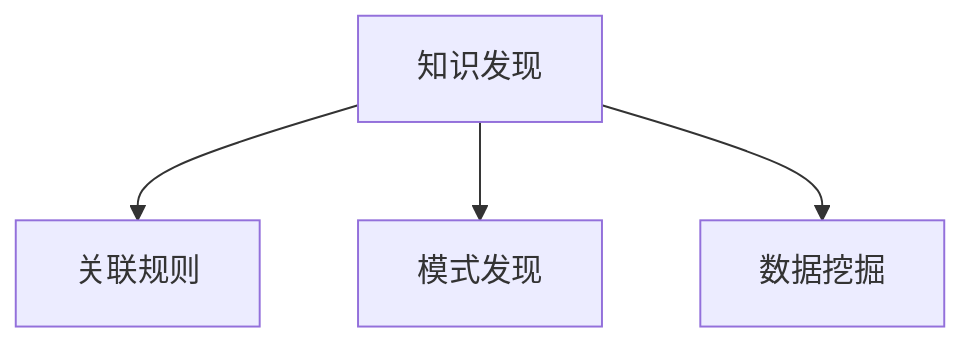

                 

# 洞察力的培养：知识发现引擎的重要意义

## 1. 背景介绍

### 1.1 问题由来

在信息化时代，数据已经成为了企业的核心资产。从用户行为、市场动态到产品迭代，数据无处不在，而如何从中挖掘有价值的信息，成为当前企业数字化转型的关键问题。然而，数据不仅量大，而且多源异构，结构复杂，传统的统计分析手段已经无法满足企业对数据洞察力的需求。

知识发现引擎(Knowledge Discovery Engine, KDE)应运而生，通过自动化算法，从海量数据中挖掘出隐含的、潜在的知识，帮助企业快速决策，提升业务竞争力。KDE的核心任务是自动分析数据集，通过建立模型、提取特征、关联分析等方式，自动发现数据中的模式、规律、趋势等洞察力。

### 1.2 问题核心关键点

KDE的核心关键点包括：
- **数据预处理**：清洗、标准化、归一化数据，去除噪音，确保分析质量。
- **特征选择**：从数据集中提取最重要、最有区分度的特征，减少维度，提高分析效率。
- **模型选择**：选择合适的算法，建立数据模型，发现数据中的模式和规律。
- **模式识别**：通过识别数据中的模式和关联，提取知识，提供业务洞察。
- **结果验证**：对发现的洞察进行验证，确保结果的可靠性。

KDE的应用范围广泛，涵盖了数据分析、业务决策、智能推荐等多个领域，是提升企业数据价值的重要手段。

### 1.3 问题研究意义

KDE的研究具有重要意义：
- **提升数据价值**：通过挖掘数据中的深层次洞察力，提升企业决策效率和质量。
- **加速业务创新**：帮助企业快速理解市场趋势和客户需求，加速产品创新和业务流程优化。
- **提升运营效率**：通过自动化分析，减少人工干预，降低运营成本，提高业务效率。
- **支持智能决策**：为智能决策提供数据支持，提升数据驱动的业务管理水平。

## 2. 核心概念与联系

### 2.1 核心概念概述

为了更好地理解KDE的工作原理和优化方向，本节将介绍几个密切相关的核心概念：

- **知识发现**(Knowledge Discovery, KD)：指通过算法自动从数据中发现和抽取知识的过程，是KDE的核心任务。
- **关联规则**(Association Rule)：描述事物间的关联关系，是KDE中最常用的知识表示方式之一。
- **模式发现**(Pattern Discovery)：从数据中识别出具有统计学意义的规律和模式，是KDE的重要目标。
- **数据挖掘**(Data Mining)：使用自动化算法从数据中抽取有用信息的处理过程，KDE是其重要分支之一。

这些概念之间的逻辑关系可以通过以下Mermaid流程图来展示：



这个流程图展示了几大核心概念之间的联系：

1. 数据挖掘是发现知识的基础，通过自动化算法从数据中抽取特征和规律。
2. 模式发现是知识发现的重要步骤，从数据中识别出统计学意义上的规律。
3. 关联规则是知识表示的方式，描述事物之间的关联关系。

这些概念共同构成了知识发现引擎的工作框架，使其能够自动化地从数据中挖掘出有价值的洞察力。

## 3. 核心算法原理 & 具体操作步骤
### 3.1 算法原理概述

知识发现引擎(KDE)的核心原理是通过数据挖掘算法，从数据集中自动发现知识。其核心思想是：利用数学、统计、机器学习等手段，从数据集中挖掘出有意义的模式、规律、关联等洞察力。

形式化地，假设给定数据集 $D=\{x_1,x_2,...,x_n\}$，其中 $x_i \in \mathcal{X}$ 为样本空间中的元素。KDE的目标是找到一个函数 $f(x)$，使得 $f(x)$ 能够最大化地表示数据集中隐含的知识。

常用的KDE算法包括决策树、聚类、关联规则、神经网络等。不同的算法从不同的角度发现数据中的知识，如分类、关联、聚类等。

### 3.2 算法步骤详解

知识发现引擎的开发一般包括以下几个关键步骤：

**Step 1: 数据预处理**
- 收集数据集 $D$，并进行清洗、标准化、归一化等预处理操作。
- 去除噪音数据，修正异常值，确保数据质量。
- 处理缺失值，选择合适的填补策略。

**Step 2: 特征选择**
- 从原始数据中提取最重要的特征，减少维度，提高分析效率。
- 使用主成分分析(PCA)、独立成分分析(ICA)、特征重要性排序等方法，选择最有区分度的特征。
- 构建特征空间，将原始数据映射到低维空间，便于模型训练和分析。

**Step 3: 模型选择**
- 选择合适的数据挖掘算法，如决策树、聚类、关联规则、神经网络等。
- 根据数据类型和分析目标，确定合适的模型。
- 设置模型参数，选择合适的评估指标，如准确率、召回率、F1值等。

**Step 4: 模型训练**
- 使用训练数据集 $D_{train}$，对模型进行训练。
- 迭代优化模型参数，最小化损失函数，提高模型性能。
- 使用交叉验证等技术，评估模型泛化能力。

**Step 5: 模式识别**
- 对测试数据集 $D_{test}$ 进行测试，识别出数据中的模式和规律。
- 提取有意义的知识，生成洞察力报告。
- 对洞察力进行验证，确保其可靠性。

**Step 6: 结果展示**
- 将分析结果以图表、报表等形式展示给决策者。
- 提供可视化界面，支持交互式数据分析。
- 自动生成业务建议，帮助企业快速决策。

以上是知识发现引擎的一般开发流程，不同算法和任务可能需要不同的优化策略。

### 3.3 算法优缺点

知识发现引擎具有以下优点：
- **自动化程度高**：通过算法自动分析数据，减少人工干预，提高分析效率。
- **可扩展性强**：支持多种数据类型和分析目标，易于在不同场景下应用。
- **结果可靠**：利用数学和统计手段，确保发现的知识具有可靠性和准确性。

同时，该方法也存在一定的局限性：
- **对数据质量敏感**：数据质量直接影响到分析结果的可靠性，需要高质量的数据。
- **算法复杂度高**：部分算法如神经网络、深度学习等，计算复杂度较高，对计算资源需求较大。
- **结果解释性差**：自动化算法生成结果，缺乏人工的解释和理解。

尽管存在这些局限性，但就目前而言，知识发现引擎依然是数据分析和业务决策的重要手段，特别是在数据量大、结构复杂的情况下，其自动化分析能力尤为突出。

### 3.4 算法应用领域

知识发现引擎在多个领域得到了广泛应用，例如：

- **市场营销**：通过分析用户行为数据，发现购买趋势、兴趣点，优化营销策略。
- **金融风控**：利用历史交易数据，识别出异常交易，防范金融风险。
- **健康医疗**：分析患者病历数据，识别出病情发展趋势，提升医疗服务质量。
- **供应链管理**：通过分析采购、销售数据，优化供应链流程，提升效率。
- **智能推荐**：分析用户行为和历史数据，推荐个性化的产品和服务。

除了上述这些经典应用外，知识发现引擎还被创新性地应用到更多领域，如安全监控、舆情分析、舆情预测等，为数据驱动的决策支持提供了新的方法。

## 4. 数学模型和公式 & 详细讲解 & 举例说明

### 4.1 数学模型构建

知识发现引擎的数学模型构建主要包括以下几个步骤：

1. **特征空间构建**：将原始数据映射到高维特征空间，生成特征矩阵 $X \in \mathbb{R}^{n \times m}$，其中 $n$ 为样本数，$m$ 为特征数。
2. **模型训练**：通过最小化损失函数 $L(Y,\hat{Y})$，训练模型 $\hat{Y}=f(X)$。
3. **模式识别**：利用统计学手段，从训练结果中识别出有意义的模式和规律。

形式化地，知识发现引擎的数学模型可以表示为：

$$
\hat{Y}=f(X;w)
$$

其中 $w$ 为模型参数，$f$ 为模型函数。

### 4.2 公式推导过程

以分类任务为例，我们推导一下决策树模型的构建过程。

假设数据集 $D=\{(x_1,y_1),(x_2,y_2),...(x_n,y_n)\}$，其中 $x_i \in \mathbb{R}^m$ 为特征向量，$y_i \in \{0,1\}$ 为标签。我们希望找到一个决策树模型 $T$，能够最优地分类样本。

首先，定义信息熵 $H(Y)$：

$$
H(Y)=-\sum_{y}P(y)\log P(y)
$$

其中 $P(y)$ 为标签 $y$ 的概率。

然后，定义信息增益 $Gain(X,y)$，用于衡量特征 $X$ 对标签 $y$ 的区分能力：

$$
Gain(X,y)=H(Y)-\sum_{x \in X}P(x)H(Y|x)
$$

其中 $P(x)$ 为特征 $x$ 的概率，$H(Y|x)$ 为给定特征 $x$ 条件下，标签 $y$ 的条件熵。

决策树模型的构建过程可以表示为：

$$
T=\arg\min_{X \in \mathcal{X}}Gain(X,Y)
$$

其中 $\mathcal{X}$ 为特征集合，$Gain(X,Y)$ 为信息增益。

在实际应用中，决策树模型可以通过剪枝、正则化等技术进行优化，避免过拟合。

### 4.3 案例分析与讲解

假设我们有一组销售数据，包含客户年龄、性别、购买金额等信息。我们希望通过分析这些数据，找出最有可能购买某类商品的客户特征。

首先，对数据进行清洗和标准化处理，确保数据质量。然后，使用主成分分析(PCA)选择最有区分度的特征，构建特征空间。最后，使用决策树模型进行训练和测试，识别出最有可能购买商品的客户特征。

通过分析结果，我们发现年龄在25-35岁、男性、月收入在5000元以上的客户，最有可能购买某类商品。这个洞察力可以帮助企业优化营销策略，提升销售额。

## 5. 项目实践：代码实例和详细解释说明
### 5.1 开发环境搭建

在进行知识发现引擎开发前，我们需要准备好开发环境。以下是使用Python进行Scikit-learn开发的环境配置流程：

1. 安装Anaconda：从官网下载并安装Anaconda，用于创建独立的Python环境。

2. 创建并激活虚拟环境：
```bash
conda create -n sklearn-env python=3.8 
conda activate sklearn-env
```

3. 安装Scikit-learn：
```bash
pip install scikit-learn
```

4. 安装各类工具包：
```bash
pip install numpy pandas matplotlib seaborn
```

5. 安装Jupyter Notebook：
```bash
pip install jupyter notebook
```

完成上述步骤后，即可在`sklearn-env`环境中开始知识发现引擎的开发。

### 5.2 源代码详细实现

下面我们以市场营销数据分析为例，给出使用Scikit-learn进行知识发现引擎开发的Python代码实现。

首先，定义数据预处理函数：

```python
import pandas as pd
from sklearn.preprocessing import StandardScaler, MinMaxScaler
from sklearn.ensemble import DecisionTreeClassifier

def preprocess_data(df):
    # 数据清洗
    df.dropna(inplace=True)
    df = df.drop_duplicates()

    # 特征缩放
    scaler = StandardScaler()
    df[['age', 'income']] = scaler.fit_transform(df[['age', 'income']])
    df['score'] = MinMaxScaler().fit_transform(df[['score']])

    return df
```

然后，定义特征选择函数：

```python
from sklearn.feature_selection import SelectKBest, f_classif

def feature_selection(X, y):
    # 特征选择
    selector = SelectKBest(f_classif, k=3)
    X_new = selector.fit_transform(X, y)

    return X_new
```

接着，定义模型训练和测试函数：

```python
def train_model(X, y):
    # 模型训练
    clf = DecisionTreeClassifier()
    clf.fit(X, y)

    return clf

def evaluate_model(model, X_test, y_test):
    # 模型测试
    y_pred = model.predict(X_test)
    accuracy = accuracy_score(y_test, y_pred)
    confusion_matrix = confusion_matrix(y_test, y_pred)

    return accuracy, confusion_matrix
```

最后，启动知识发现引擎的流程：

```python
# 加载数据集
df = pd.read_csv('sales_data.csv')

# 数据预处理
df = preprocess_data(df)

# 特征选择
X_train, y_train = df.iloc[:2/3].drop(['id'], axis=1), df.iloc[:2/3]['purchased']
X_test, y_test = df.iloc[2/3:].drop(['id'], axis=1), df.iloc[2/3:]['purchased']

# 特征选择
X_train = feature_selection(X_train, y_train)

# 模型训练
model = train_model(X_train, y_train)

# 模型测试
accuracy, confusion_matrix = evaluate_model(model, X_test, y_test)

print('Accuracy:', accuracy)
print('Confusion Matrix:', confusion_matrix)
```

以上就是使用Scikit-learn进行市场营销数据分析的知识发现引擎开发代码实现。可以看到，Scikit-learn的封装和API设计，使得知识发现引擎的开发变得简洁高效。

### 5.3 代码解读与分析

让我们再详细解读一下关键代码的实现细节：

**preprocess_data函数**：
- 数据清洗：去除缺失值和重复数据，确保数据质量。
- 特征缩放：使用标准化和归一化方法，将特征值缩放到一个标准的范围内，提高模型的训练效率。

**feature_selection函数**：
- 特征选择：使用SelectKBest和f_classif方法，选择最具区分度的特征，减少维度。
- k=3：选择前3个最具区分度的特征，简化模型复杂度。

**train_model函数**：
- 模型训练：使用决策树算法，训练模型，最小化损失函数。
- 返回模型对象，方便后续使用。

**evaluate_model函数**：
- 模型测试：对测试集进行预测，计算准确率和混淆矩阵。
- 返回准确率和混淆矩阵，供后续分析使用。

**启动知识发现引擎流程**：
- 加载数据集，分为训练集和测试集。
- 数据预处理：应用preprocess_data函数，进行数据清洗和特征缩放。
- 特征选择：应用feature_selection函数，选择最具区分度的特征。
- 模型训练：应用train_model函数，训练决策树模型。
- 模型测试：应用evaluate_model函数，测试模型性能。
- 输出准确率和混淆矩阵，进行结果分析。

可以看到，Scikit-learn的API设计使得知识发现引擎的开发变得非常直观和简洁。开发者只需关注核心业务逻辑，而不必过多关注底层实现细节。

当然，工业级的系统实现还需考虑更多因素，如模型保存和部署、超参数自动搜索、更灵活的特征工程等。但核心的知识发现引擎开发流程基本与此类似。

## 6. 实际应用场景

### 6.1 市场营销

知识发现引擎在市场营销中具有重要应用。通过分析用户行为数据，可以发现购买趋势、兴趣点，优化营销策略，提高销售额。例如，通过分析历史购买数据，可以发现不同年龄段、性别的客户购买偏好，从而定制个性化营销活动。

### 6.2 金融风控

金融行业需要实时监控交易数据，防范金融风险。知识发现引擎可以自动识别出异常交易，提前预警，防范金融欺诈和洗钱等风险。例如，通过分析交易记录，可以识别出异常交易模式，如大额交易、异地交易等，及时预警并采取措施。

### 6.3 健康医疗

健康医疗领域需要从大量病历数据中提取有用信息，提升医疗服务质量。知识发现引擎可以帮助医生识别出病情发展趋势，提高诊断准确率。例如，通过分析患者病历数据，可以发现病情变化规律，预测疾病发展，提前干预。

### 6.4 智能推荐

智能推荐系统需要从用户行为数据中提取有用信息，推荐个性化的产品和服务。知识发现引擎可以自动分析用户兴趣和行为，生成推荐列表。例如，通过分析用户浏览和购买历史，可以发现用户兴趣点，推荐相关产品。

### 6.5 供应链管理

供应链管理需要从采购、销售数据中提取有用信息，优化供应链流程。知识发现引擎可以帮助企业识别出供应链瓶颈和优化点，提高供应链效率。例如，通过分析供应链数据，可以发现物流瓶颈，优化仓储和配送流程。

## 7. 工具和资源推荐
### 7.1 学习资源推荐

为了帮助开发者系统掌握知识发现引擎的理论基础和实践技巧，这里推荐一些优质的学习资源：

1. 《Python数据科学手册》：全面介绍了Python在数据科学中的应用，包括数据预处理、特征工程、模型训练等。
2. 《统计学习方法》：统计学习领域的经典教材，涵盖监督学习、非监督学习、半监督学习等内容。
3. 《机器学习实战》：通过实际案例讲解机器学习算法和应用，适合入门学习。
4. 《Scikit-learn官方文档》：Scikit-learn的详细API文档，提供了丰富的案例和应用示例。
5. Kaggle：全球知名的数据科学竞赛平台，提供大量数据集和竞赛题目，供开发者学习和实践。

通过对这些资源的学习实践，相信你一定能够快速掌握知识发现引擎的精髓，并用于解决实际的业务问题。

### 7.2 开发工具推荐

高效的开发离不开优秀的工具支持。以下是几款用于知识发现引擎开发的常用工具：

1. Python：面向对象的高级编程语言，适合数据科学和机器学习开发。
2. Scikit-learn：Python的科学计算库，提供丰富的机器学习算法和工具。
3. Pandas：数据处理和分析库，提供高效的数据清洗和特征处理功能。
4. Matplotlib：绘图库，支持绘制多种类型的图表，方便数据分析和可视化。
5. Jupyter Notebook：交互式开发环境，支持代码编写、数据展示、实时调试。

合理利用这些工具，可以显著提升知识发现引擎的开发效率，加快创新迭代的步伐。

### 7.3 相关论文推荐

知识发现引擎的研究源于学界的持续研究。以下是几篇奠基性的相关论文，推荐阅读：

1. "Induction of Decision Trees"（J.Ross Quinlan）：介绍了决策树算法的原理和应用，奠定了决策树在数据挖掘中的应用基础。
2. "Association Rules and Sequential Patterns"（Michael A. J. Nembhard, Robert M. O'Keefe）：介绍了关联规则的原理和应用，提供了数据挖掘中常用的知识表示方式。
3. "Classification and Regression Trees"（Jerome Friedman, Geoffrey Molnar, Charles Stone, et al.）：介绍了决策树的优化方法和应用，提供了更加高效和灵活的决策树算法。
4. "The Elements of Statistical Learning"（Tibshirani, Hastie, et al.）：提供了统计学习领域的全面介绍，涵盖了监督学习、非监督学习、半监督学习等算法。
5. "Data Mining: Concepts and Techniques"（Jianhui Ma, Raghu Ramakrishnan, et al.）：提供了数据挖掘的全面介绍，涵盖了多种数据挖掘算法和技术。

这些论文代表了大数据和知识发现引擎的发展脉络。通过学习这些前沿成果，可以帮助研究者把握学科前进方向，激发更多的创新灵感。

## 8. 总结：未来发展趋势与挑战

### 8.1 总结

本文对知识发现引擎的核心原理、操作步骤、应用场景进行了全面系统的介绍。首先阐述了知识发现引擎的背景和核心任务，明确了其在数据分析和业务决策中的重要价值。其次，从原理到实践，详细讲解了知识发现引擎的数学模型和关键步骤，给出了知识发现引擎开发的全流程代码实例。同时，本文还广泛探讨了知识发现引擎在市场营销、金融风控、健康医疗等多个领域的应用前景，展示了其在数据驱动的决策支持中的巨大潜力。此外，本文精选了知识发现引擎的学习资源和开发工具，力求为开发者提供全方位的技术指引。

通过本文的系统梳理，可以看到，知识发现引擎已经成为企业数据价值挖掘的重要工具，极大地提升了数据分析的自动化和智能化水平。未来，伴随数据量的不断增长和算法技术的不断演进，知识发现引擎必将在更多领域发挥其独特价值，推动数据驱动的决策支持不断向前发展。

### 8.2 未来发展趋势

展望未来，知识发现引擎的发展将呈现以下几个趋势：

1. **自动化水平提升**：通过自动化算法和工具，进一步提升知识发现引擎的自动化程度，减少人工干预，提高分析效率。
2. **多模态数据融合**：结合文本、图像、视频等多种模态的数据，提升知识发现引擎的全面性和准确性。
3. **实时数据处理**：通过流式数据处理技术，实现对实时数据的即时分析和处理，满足业务需求。
4. **跨领域应用扩展**：知识发现引擎将扩展到更多领域，如金融风控、智能推荐、健康医疗等，为更多行业提供决策支持。
5. **模型可解释性增强**：通过可解释性模型和可视化工具，提升知识发现引擎的透明度和可信度。
6. **模型鲁棒性加强**：通过鲁棒性优化和异常检测技术，提升知识发现引擎的稳定性和可靠性。

以上趋势凸显了知识发现引擎的广阔前景。这些方向的探索发展，必将进一步提升知识发现引擎的性能和应用范围，为数据驱动的决策支持提供更坚实的基础。

### 8.3 面临的挑战

尽管知识发现引擎已经取得了瞩目成就，但在迈向更加智能化、普适化应用的过程中，它仍面临诸多挑战：

1. **数据质量瓶颈**：数据质量直接影响分析结果的可靠性，需要高质量的数据和有效的数据清洗方法。
2. **计算资源需求高**：部分算法如深度学习、神经网络等，计算复杂度较高，对硬件资源有较高要求。
3. **结果解释性差**：自动化算法生成结果，缺乏人工的解释和理解，难以满足业务需求。
4. **模型鲁棒性不足**：知识发现引擎对异常数据和噪声数据较为敏感，容易产生误判。
5. **业务适用性不足**：部分算法和工具在特定领域的应用效果不佳，需要针对特定场景进行优化。

尽管存在这些挑战，但知识发现引擎依然具有广阔的应用前景，特别是在数据量大、结构复杂的情况下，其自动化分析能力尤为突出。未来，需要在数据预处理、模型设计、结果解释等方面进行全面优化，提升知识发现引擎的适用性和可靠性。

### 8.4 研究展望

面对知识发现引擎所面临的挑战，未来的研究需要在以下几个方面寻求新的突破：

1. **数据预处理技术提升**：研究高效的数据清洗和标准化方法，提升数据质量，降低分析误差。
2. **多模态数据融合技术**：研究多种数据模态的整合方法，提升知识发现引擎的全面性和准确性。
3. **可解释性模型的探索**：研究可解释性模型，提升知识发现引擎的透明度和可信度。
4. **实时数据处理技术**：研究流式数据处理技术，提升知识发现引擎的实时性。
5. **跨领域应用优化**：研究知识发现引擎在不同领域的应用优化方法，提升其在特定场景下的效果。
6. **模型鲁棒性增强**：研究鲁棒性优化方法，提升知识发现引擎的稳定性和可靠性。

这些研究方向的探索，必将引领知识发现引擎迈向更高的台阶，为数据驱动的决策支持提供更坚实的基础。面向未来，知识发现引擎还需要与其他人工智能技术进行更深入的融合，如深度学习、自然语言处理、图像处理等，多路径协同发力，共同推动数据驱动的决策支持系统的进步。只有勇于创新、敢于突破，才能不断拓展知识发现引擎的边界，让数据驱动的决策支持系统更好地服务于人类社会。

## 9. 附录：常见问题与解答

**Q1：知识发现引擎是否适用于所有数据类型？**

A: 知识发现引擎适用于多种数据类型，包括数值型、文本型、图像型等。但对于非结构化数据，如语音、视频等，需要借助其他技术进行预处理和特征提取。

**Q2：知识发现引擎的自动化程度有多高？**

A: 知识发现引擎的自动化程度较高，能够自动进行数据预处理、特征选择、模型训练等步骤。但部分关键步骤如特征工程和模型调参仍需人工干预。

**Q3：知识发现引擎的模型选择有哪些？**

A: 知识发现引擎常用的模型包括决策树、聚类、关联规则、神经网络等。不同模型适用于不同的数据分析任务和场景，需要根据具体情况选择。

**Q4：知识发现引擎的可视化工具有哪些？**

A: 知识发现引擎的可视化工具包括Matplotlib、Seaborn、Tableau等。这些工具能够将分析结果以图表、报表等形式展示给决策者，方便理解和应用。

**Q5：知识发现引擎在实际应用中需要注意哪些问题？**

A: 知识发现引擎在实际应用中需要注意以下问题：
1. 数据质量：确保数据质量，进行有效的数据清洗和标准化。
2. 特征选择：选择最具区分度的特征，避免特征维度过高的困扰。
3. 模型选择：选择合适的模型，避免模型过拟合和欠拟合。
4. 结果验证：对分析结果进行验证，确保结果的可靠性和正确性。
5. 结果解释：提供可解释性结果，满足业务需求和决策要求。

通过这些注意事项，可以确保知识发现引擎在实际应用中发挥其最大价值。

总之，知识发现引擎作为数据驱动决策支持的重要工具，具有广泛的应用前景和重要的研究价值。通过对核心概念、原理和步骤的深入理解，相信你一定能够掌握知识发现引擎的精髓，并用于解决实际的业务问题。同时，面向未来，知识发现引擎还需要在自动化、可解释性、跨领域应用等方面进行全面优化，提升其性能和适用性。只有不断创新、勇于探索，才能将知识发现引擎推向更高的应用水平。

