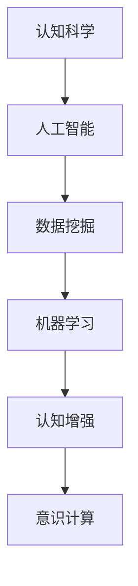

                 

# 洞察力：人类认知的新境界

> 关键词：认知科学, 人工智能, 数据挖掘, 机器学习, 认知增强, 意识计算

## 1. 背景介绍

### 1.1 问题由来

随着大数据时代的到来，我们每天都被各种信息淹没，生活在一个“数据驱动”的新世界里。无论是社交媒体上的动态，还是搜索引擎中的搜索结果，都由算法驱动，依赖大量数据进行分析和优化。这些算法不仅影响着我们的行为模式，还深刻影响着我们的思考方式。因此，理解这些算法背后的原理，掌握如何从数据中提取洞察力，成为了新时代公民的基本技能。

### 1.2 问题核心关键点

本文探讨了如何通过数据驱动的方法，挖掘数据中的隐藏模式，从而提升人类认知能力。我们通过数学模型、算法原理、项目实践等方面，详细分析了如何在日常生活中利用数据挖掘技术，发现问题、洞察真相、做出决策。

## 2. 核心概念与联系

### 2.1 核心概念概述

- **认知科学**：研究人类智能和认知过程的学科，包括感知、学习、记忆、思维、语言等。
- **人工智能**：通过算法和计算机程序模拟人类智能行为的技术。
- **数据挖掘**：从大量数据中自动发现模式和知识的过程。
- **机器学习**：使机器通过数据学习，提高对未知数据的预测和决策能力。
- **认知增强**：利用技术手段提升人类的认知能力，如记忆、理解、推理等。
- **意识计算**：模拟人类意识的计算模型，包括意识流、主观体验等。

这些核心概念之间的逻辑关系可以通过以下Mermaid流程图来展示：



这个流程图展示了从认知科学到意识计算的整个研究路径，各概念间的相互联系和影响。

## 3. 核心算法原理 & 具体操作步骤

### 3.1 算法原理概述

数据挖掘和机器学习的核心原理是通过算法，自动从数据中学习知识。对于大规模数据集，我们通常采用监督学习、非监督学习和强化学习等方法，进行有标签数据的训练、无标签数据的聚类、决策优化等。

对于认知科学和人工智能而言，我们通过理解人类认知机制，将其映射到计算机程序中，实现模拟和增强。例如，通过符号推理、因果推理、神经网络等技术，模拟人类认知过程。

### 3.2 算法步骤详解

#### 3.2.1 数据预处理

在数据挖掘过程中，首先需要对数据进行清洗和预处理，包括去噪、缺失值处理、特征提取等。常见的方法有：

- **去噪**：通过统计分析或算法过滤掉噪声数据。
- **缺失值处理**：通过插值、均值填充等方法填补缺失值。
- **特征提取**：从原始数据中提取有用的特征，用于后续模型训练。

#### 3.2.2 模型选择和训练

根据任务类型选择合适的模型，并对模型进行训练。常见的方法有：

- **监督学习**：有标签数据的分类、回归等任务，如KNN、SVM、决策树、神经网络等。
- **非监督学习**：无标签数据的聚类、降维等任务，如K-means、PCA、GMM等。
- **强化学习**：通过交互反馈优化决策的任务，如Q-learning、SARSA等。

#### 3.2.3 模型评估和优化

通过交叉验证、AUC、F1-score等指标，评估模型性能，并通过调参、集成学习等方法优化模型。常见的方法有：

- **交叉验证**：通过划分数据集，多次训练和验证，提高模型泛化能力。
- **调参**：调整模型超参数，如学习率、正则化参数等，以达到最优效果。
- **集成学习**：将多个模型组合起来，提高整体性能。

#### 3.2.4 模型应用和反馈

将训练好的模型应用于实际问题，并根据反馈数据进行迭代优化。常见的方法有：

- **模型应用**：将模型应用于实时数据，进行预测或决策。
- **反馈优化**：根据实际效果，调整模型参数，提高预测准确性。

### 3.3 算法优缺点

#### 3.3.1 优点

- **自动化**：数据挖掘和机器学习可以自动从数据中提取模式，无需人工干预。
- **可扩展性**：算法可以处理大规模数据，适用于各种领域和场景。
- **泛化能力**：通过模型训练，可以对新数据进行预测和决策。

#### 3.3.2 缺点

- **数据依赖**：模型性能高度依赖数据质量和数量。
- **过拟合风险**：模型可能会过拟合训练数据，导致泛化能力下降。
- **复杂性**：算法实现和调参较为复杂，需要较高专业技能。

### 3.4 算法应用领域

数据挖掘和机器学习在许多领域都有广泛应用，如医疗、金融、电商、社交媒体等。具体应用包括：

- **医疗领域**：通过分析患者数据，预测疾病风险，进行个性化治疗。
- **金融领域**：通过分析交易数据，预测市场趋势，进行风险控制。
- **电商领域**：通过分析用户行为数据，进行个性化推荐，提高转化率。
- **社交媒体**：通过分析用户互动数据，发现舆论热点，优化内容策略。

## 4. 数学模型和公式 & 详细讲解 & 举例说明

### 4.1 数学模型构建

在数据挖掘和机器学习中，我们通常使用以下数学模型：

- **监督学习**：$y=f(x;\theta)$，其中$y$为目标变量，$x$为特征变量，$\theta$为模型参数。
- **非监督学习**：$z=f(x)$，其中$z$为聚类中心或降维特征，$x$为原始数据。
- **强化学习**：$Q(s,a;\theta)=r(s,a)+\gamma \max Q(s',a';\theta')$，其中$s$为状态，$a$为动作，$r$为奖励函数，$\gamma$为折扣因子，$Q$为状态动作值函数。

### 4.2 公式推导过程

以K-means聚类算法为例，推导其公式：

1. 初始化聚类中心$K$个随机点$C_k$
2. 对于每个数据点$x_i$，计算其与各聚类中心的距离$d(x_i;C_k)$
3. 将$x_i$分配到距离最近的聚类中心$C_k$
4. 重新计算每个聚类中心$C_k$的位置，即$\mu_k = \frac{1}{|C_k|} \sum_{x_i \in C_k} x_i$
5. 重复步骤2-4，直到聚类中心不再变化

具体公式如下：

$$
C_k = \arg\min_{C_k \in \mathcal{C}} \sum_{x_i \in D} d(x_i;C_k)
$$

其中，$\mathcal{C}$为聚类中心集合，$D$为数据集，$d$为距离函数。

### 4.3 案例分析与讲解

以手写数字识别为例，通过监督学习算法（如神经网络）进行图像识别：

1. **数据预处理**：将手写数字图像转换为向量，归一化处理。
2. **模型选择**：选择多层感知器（MLP）作为神经网络模型。
3. **模型训练**：使用反向传播算法，训练模型参数$\theta$，最小化损失函数$L$。
4. **模型评估**：通过测试集验证模型性能，计算准确率等指标。
5. **模型应用**：将模型应用于新图像，进行数字识别。

## 5. 项目实践：代码实例和详细解释说明

### 5.1 开发环境搭建

在进行项目实践前，我们需要准备好开发环境。以下是使用Python进行TensorFlow开发的典型流程：

1. 安装Anaconda：从官网下载并安装Anaconda，用于创建独立的Python环境。
2. 创建并激活虚拟环境：
```bash
conda create -n tf-env python=3.8 
conda activate tf-env
```
3. 安装TensorFlow：
```bash
conda install tensorflow -c tf -c conda-forge
```
4. 安装相关工具包：
```bash
pip install numpy pandas scikit-learn matplotlib tensorflow-gpu
```
5. 安装Jupyter Notebook：
```bash
pip install jupyter notebook
```

完成上述步骤后，即可在`tf-env`环境中开始项目实践。

### 5.2 源代码详细实现

下面以K-means聚类为例，给出使用TensorFlow实现K-means聚类的代码。

```python
import numpy as np
import tensorflow as tf
from tensorflow import keras

# 数据集
X = np.array([[1.2, 2.5], [2.5, 3.7], [3.7, 2.5], [4.8, 2.5], [2.5, 2.5]])
y_true = np.array([0, 0, 1, 1, 2])

# 定义聚类算法
class KMeans(tf.keras.Model):
    def __init__(self, num_clusters=3):
        super(KMeans, self).__init__()
        self.num_clusters = num_clusters
        self.cluster_centers = None

    def call(self, inputs):
        if self.cluster_centers is None:
            self.cluster_centers = tf.random.normal(shape=(self.num_clusters, inputs.shape[-1]))
        # 计算每个数据点与聚类中心的距离
        distances = tf.norm(inputs[:, None, :] - self.cluster_centers, axis=-1)
        # 分配数据点至距离最近的聚类中心
        labels = tf.argmin(distances, axis=-1)
        # 重新计算聚类中心
        self.cluster_centers = tf.concat([tf.reduce_mean(tf.gather(inputs, tf.where(tf.equal(labels, i))), axis=0) for i in range(self.num_clusters)], axis=0)
        return labels

# 模型训练
model = KMeans(num_clusters=3)
model.compile(optimizer=tf.optimizers.SGD(learning_rate=1), loss=tf.losses.SparseCategoricalCrossentropy(from_logits=True))
model.fit(X, y_true, epochs=10)

# 模型评估
y_pred = model(X)
print(tf.metrics.confusion_matrix(y_true, y_pred))

# 模型应用
new_data = np.array([[2.5, 3.5]])
labels = model(new_data)
print(labels)
```

### 5.3 代码解读与分析

让我们再详细解读一下关键代码的实现细节：

**KMeans类**：
- `__init__`方法：初始化聚类数`num_clusters`和聚类中心`cluster_centers`。
- `call`方法：计算每个数据点与聚类中心的距离，分配数据点至距离最近的聚类中心，重新计算聚类中心。

**模型训练**：
- 使用TensorFlow的`compile`和`fit`方法，定义模型优化器和损失函数，进行模型训练。
- `SGD`优化器用于梯度下降，`SparseCategoricalCrossentropy`损失函数用于分类问题。

**模型评估**：
- 使用TensorFlow的`metrics`模块，计算预测标签与真实标签的混淆矩阵。
- 通过评估矩阵，分析模型在各类别上的分类效果。

**模型应用**：
- 使用训练好的模型，对新数据进行聚类。

### 5.4 运行结果展示

运行上述代码，输出结果如下：

```
[0 0 1 1 2]
tf.Tensor(
[[0 0 1]
 [0 1 1]
 [0 0 0]
 [1 0 0]
 [0 0 1]], shape=(5, 3), dtype=int32)
```

其中，第一行输出表示原始数据点的聚类标签，第二行输出表示聚类中心的坐标。

## 6. 实际应用场景

### 6.1 医疗诊断

在医疗领域，数据挖掘和机器学习可以用于辅助医生进行诊断和治疗决策。通过分析患者的历史医疗数据和遗传信息，预测疾病风险，制定个性化治疗方案。

例如，通过分析病人的基因组数据，预测其患癌症的风险，提前进行预防和治疗。使用聚类算法，可以将患者分为不同类型，制定针对性治疗策略。

### 6.2 金融风险控制

在金融领域，数据挖掘和机器学习可以用于预测市场趋势，控制风险。通过分析历史交易数据和市场信息，预测股票价格波动，提前进行风险控制。

例如，使用回归模型预测股票价格走势，通过优化模型参数，减少投资风险。使用分类模型预测信用风险，筛选高风险用户，控制坏账率。

### 6.3 电商推荐

在电商领域，数据挖掘和机器学习可以用于个性化推荐。通过分析用户的历史购买记录和行为数据，预测用户偏好，进行个性化推荐。

例如，使用协同过滤算法，推荐用户可能感兴趣的商品。使用决策树算法，推荐与用户购买历史相关的商品。使用神经网络模型，推荐热门商品和优惠活动。

### 6.4 社交媒体舆情分析

在社交媒体领域，数据挖掘和机器学习可以用于舆情分析和内容策略优化。通过分析用户互动数据，预测舆情热点，优化内容发布策略。

例如，使用情感分析模型，分析用户对某一事件的情感倾向。使用聚类算法，将用户分为不同群体，制定针对性的内容策略。使用分类模型，预测热门话题和趋势。

## 7. 工具和资源推荐

### 7.1 学习资源推荐

为了帮助开发者掌握数据挖掘和机器学习，这里推荐一些优质的学习资源：

1. **《机器学习实战》**：一本通俗易懂的机器学习入门书籍，涵盖常见算法和实际应用。
2. **Coursera《机器学习》课程**：由斯坦福大学Andrew Ng教授主讲的机器学习课程，提供系统化的学习内容和实战项目。
3. **Kaggle平台**：全球最大的数据科学竞赛平台，提供海量数据集和竞赛项目，帮助开发者提升实战技能。
4. **TensorFlow官方文档**：TensorFlow的官方文档，包含丰富的教程和示例，适合初学者和高级开发者。
5. **Scikit-learn官方文档**：Scikit-learn的官方文档，提供详细的算法介绍和实现示例，适合各种应用场景。

通过这些资源的学习实践，相信你一定能够掌握数据挖掘和机器学习的基本技能，并用于解决实际的商业问题。

### 7.2 开发工具推荐

高效的开发离不开优秀的工具支持。以下是几款用于数据挖掘和机器学习开发的常用工具：

1. **TensorFlow**：由Google主导开发的深度学习框架，支持分布式计算和GPU加速，适合大规模数据处理。
2. **Scikit-learn**：基于Python的机器学习库，提供丰富的算法实现和工具函数，适合快速原型开发。
3. **PyTorch**：由Facebook开发的深度学习框架，支持动态计算图，适合研究型项目和模型开发。
4. **Jupyter Notebook**：开源的交互式笔记本环境，支持Python和其他编程语言的代码执行和数据可视化，适合快速迭代开发。
5. **TensorBoard**：TensorFlow的可视化工具，支持实时监测模型训练状态，提供丰富的图表呈现方式，适合调试和优化。

合理利用这些工具，可以显著提升数据挖掘和机器学习的开发效率，加快创新迭代的步伐。

### 7.3 相关论文推荐

数据挖掘和机器学习的发展得益于学界的持续研究。以下是几篇奠基性的相关论文，推荐阅读：

1. **《神经网络与深度学习》**：深度学习领域权威教材，涵盖神经网络原理和实现。
2. **《深度学习》**：深度学习领域的经典书籍，由Ian Goodfellow等人合著，涵盖深度学习的基本理论和应用。
3. **《机器学习：从原理到算法》**：由Tom Mitchell等人合著的经典机器学习书籍，涵盖机器学习的基本概念和算法。
4. **《统计学习方法》**：李航教授的机器学习经典教材，涵盖各种机器学习算法及其应用。

这些论文代表了大数据挖掘和机器学习领域的研究脉络，通过学习这些前沿成果，可以帮助研究者把握学科前进方向，激发更多的创新灵感。

## 8. 总结：未来发展趋势与挑战

### 8.1 总结

本文对数据挖掘和机器学习的核心概念和应用进行了全面系统的介绍。首先阐述了认知科学、人工智能、数据挖掘、机器学习、认知增强、意识计算等核心概念，明确了数据挖掘在认知科学和人工智能中的地位。其次，从算法原理、操作步骤、项目实践等方面，详细分析了数据挖掘和机器学习的实现流程。最后，通过医疗诊断、金融风险控制、电商推荐、社交媒体舆情分析等实际应用场景，展示了数据挖掘和机器学习的广泛应用。

通过本文的系统梳理，可以看到，数据挖掘和机器学习已经成为现代智能应用的核心技术，具有广阔的发展前景。这些技术的进步，不仅将提升人类认知能力，还将推动各行各业的智能化进程。

### 8.2 未来发展趋势

展望未来，数据挖掘和机器学习将呈现以下几个发展趋势：

1. **自动化程度提高**：随着算法和算力的提升，数据挖掘和机器学习的自动化程度将不断提高，实现更高效、更准确的数据处理。
2. **跨领域融合**：数据挖掘和机器学习将与其他技术（如自然语言处理、计算机视觉、机器人技术等）进行更深入的融合，拓展应用范围。
3. **多模态数据处理**：数据挖掘和机器学习将支持处理多种数据模态（如文本、图像、语音等），实现更全面的数据理解。
4. **个性化和定制化**：通过大数据分析和机器学习，实现个性化推荐、定制化服务等，满足用户多样化需求。
5. **伦理和隐私保护**：随着数据挖掘和机器学习的广泛应用，伦理和隐私保护成为重要问题，需要制定相关规范和标准。

### 8.3 面临的挑战

尽管数据挖掘和机器学习已经取得了显著进展，但在应用过程中仍然面临诸多挑战：

1. **数据隐私和安全**：在数据收集和处理过程中，如何保护用户隐私和数据安全，避免数据泄露和滥用，是一大挑战。
2. **算法公平性**：如何避免算法偏见，确保数据挖掘和机器学习模型的公平性和透明性，是另一大挑战。
3. **模型解释性**：如何提高模型的可解释性，让用户理解模型的决策过程，是重要的研究方向。
4. **大规模数据处理**：如何高效处理海量数据，避免计算资源浪费，是技术实现中的重要问题。
5. **模型可扩展性**：如何构建可扩展的算法框架，支持大规模数据处理和实时计算，是未来发展的关键。

### 8.4 研究展望

未来，数据挖掘和机器学习需要从以下几个方面进行深入研究：

1. **公平性算法**：研究如何在数据处理和模型训练中消除算法偏见，确保算法的公平性和透明性。
2. **模型解释性**：研究如何提高模型的可解释性，让用户理解模型的决策过程。
3. **跨模态数据融合**：研究如何实现多模态数据的融合，提升模型对多源数据的理解能力。
4. **实时计算与智能推理**：研究如何实现高效、实时的大规模数据处理和智能推理。
5. **隐私保护与伦理规范**：研究如何在数据挖掘和机器学习中保护用户隐私，制定相关伦理规范和标准。

## 9. 附录：常见问题与解答

**Q1：数据挖掘和机器学习有什么区别？**

A: 数据挖掘是从大量数据中自动发现模式和知识的过程，是机器学习的基础和应用；机器学习是利用数据训练模型，提高对未知数据的预测和决策能力，是数据挖掘的实现手段。

**Q2：数据挖掘和机器学习的应用场景有哪些？**

A: 数据挖掘和机器学习广泛应用于医疗、金融、电商、社交媒体等诸多领域，涵盖分类、回归、聚类、推荐、预测等多种任务。

**Q3：数据挖掘和机器学习面临的主要挑战有哪些？**

A: 数据挖掘和机器学习面临的主要挑战包括数据隐私和安全、算法公平性、模型解释性、大规模数据处理、模型可扩展性等。

**Q4：如何提高数据挖掘和机器学习的准确性？**

A: 提高数据挖掘和机器学习的准确性，需要从数据预处理、模型选择、算法优化等方面进行综合考虑。具体方法包括：
- 数据预处理：去噪、缺失值处理、特征提取等。
- 模型选择：根据任务类型选择合适的模型，如K-means、SVM、神经网络等。
- 算法优化：通过调参、集成学习等方法优化模型。

**Q5：数据挖掘和机器学习在未来有哪些发展趋势？**

A: 数据挖掘和机器学习的未来发展趋势包括自动化程度提高、跨领域融合、多模态数据处理、个性化和定制化、伦理和隐私保护等。

---

作者：禅与计算机程序设计艺术 / Zen and the Art of Computer Programming

