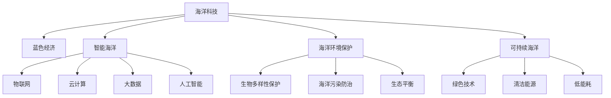

                 

# 海洋科技创业：蓝色经济的无限可能

> 关键词：海洋科技,蓝色经济,创业,深海探索,海洋环境保护,海洋资源开发

## 1. 背景介绍

### 1.1 问题由来
随着全球经济的发展和人口的增长，海洋资源的价值日益凸显。蓝色经济（Blue Economy）正成为全球经济的重要组成部分，涵盖渔业、航运、旅游、可再生能源等多个领域。然而，海洋环境的保护和资源可持续开发仍面临诸多挑战。传统海洋科技的发展模式难以适应这种新的经济形态，迫切需要创新的海洋科技创业来解决这些问题。

### 1.2 问题核心关键点
海洋科技创业的核心在于结合现代信息技术，开发智能、高效、可持续的海洋资源利用技术，推动蓝色经济的发展。以下是几个关键点：

- **数据驱动的海洋监测**：利用物联网和传感器网络技术，实时监测海洋环境变化，为海洋资源开发和环境保护提供数据支持。
- **智能化的海洋资源管理**：借助人工智能和大数据分析技术，实现海洋资源的智能管理和高效利用，提升渔业、航运、能源等行业的效率。
- **环境友好的海洋工程**：采用绿色材料和清洁能源，减少海洋工程活动对环境的影响，保护海洋生态系统。
- **可持续的海洋经济模式**：开发低能耗、低污染的海洋经济模式，实现海洋资源的可持续开发和利用。

这些关键点共同构成了海洋科技创业的核心，旨在通过技术创新驱动海洋经济的可持续发展。

### 1.3 问题研究意义
海洋科技创业不仅有助于实现海洋资源的可持续利用，还能够促进海洋经济的繁荣，创造更多的就业机会。同时，海洋科技的进步也为全球应对气候变化、保护生物多样性提供了新的解决方案。

## 2. 核心概念与联系

### 2.1 核心概念概述

为了更好地理解海洋科技创业的技术框架，本节将介绍几个密切相关的核心概念：

- **海洋科技（Marine Technology）**：涵盖海洋探测、监测、资源开发、环境保护等技术，利用现代信息技术提升海洋资源利用效率。
- **蓝色经济（Blue Economy）**：指以可持续方式开发利用海洋资源，推动经济和社会发展的经济形态，涵盖渔业、航运、能源、旅游等多个领域。
- **智能海洋（Smart Ocean）**：通过物联网、云计算、大数据、人工智能等技术，实现海洋信息采集、处理、分析和应用，提高海洋管理的智能化水平。
- **海洋环境保护（Marine Conservation）**：旨在保护海洋生物多样性，防止海洋污染，维护海洋生态平衡，确保海洋资源的可持续利用。
- **可持续海洋（Sustainable Ocean）**：采用绿色、环保、低污染的技术，实现海洋资源的可持续开发和利用，避免对海洋环境造成破坏。

这些概念之间的逻辑关系可以通过以下Mermaid流程图来展示：



这个流程图展示了大语言模型的核心概念及其之间的关系：

1. 海洋科技通过现代信息技术手段，实现海洋资源的高效开发和利用。
2. 智能海洋利用物联网、云计算、大数据、人工智能等技术，提升海洋管理智能化水平。
3. 海洋环境保护旨在保护海洋生态，采用生物多样性保护、海洋污染防治等措施。
4. 可持续海洋通过绿色技术和清洁能源，实现海洋资源的可持续利用。

这些概念共同构成了海洋科技创业的技术框架，为其提供理论和实践指导。

## 3. 核心算法原理 & 具体操作步骤
### 3.1 算法原理概述

海洋科技创业的核心算法原理基于现代信息技术和人工智能技术，旨在实现海洋资源的高效利用和海洋环境保护。以下是对核心算法原理的详细阐述：

- **物联网（IoT）**：通过传感器网络，实时采集海洋环境数据，如水温、盐度、水质、海洋生物等，为海洋资源监测提供数据支持。
- **大数据分析（Big Data Analytics）**：利用大数据技术，对采集到的海洋环境数据进行分析和处理，提取有价值的信息，如海洋流向、生态分布、污染源等。
- **人工智能（AI）**：通过机器学习、深度学习等算法，实现海洋环境的智能监测和分析，如智能预测海洋灾害、识别海洋生物种类等。
- **计算机视觉（Computer Vision）**：利用图像识别技术，实时监测海洋生物、污染物等，识别异常行为，及时预警。
- **机器人技术（Robotics）**：采用自动化技术，实现深海探测、海底地形测绘、海洋资源采集等任务，提高工作效率和准确性。
- **可再生能源（Renewable Energy）**：利用海洋能，如潮汐能、波浪能、风能等，为海洋工程提供清洁能源，减少碳排放。

这些技术的结合，构成了海洋科技创业的核心算法原理，为实现智能、高效、可持续的海洋资源利用提供了技术基础。

### 3.2 算法步骤详解

基于海洋科技创业的核心算法原理，以下将详细讲解算法具体操作步骤：

**Step 1: 数据采集与预处理**
- 使用传感器网络（如IoT设备）在目标海域采集海洋环境数据，包括水温、盐度、水质、海洋生物等。
- 将采集到的数据传输至数据中心，进行预处理，去除噪音，标准化数据格式，确保数据的质量和一致性。

**Step 2: 数据存储与管理**
- 将处理后的数据存储至数据库中，使用大数据技术（如Hadoop、Spark）进行管理和分析。
- 建立数据访问权限控制机制，确保数据安全，同时提供便捷的数据查询接口，供用户使用。

**Step 3: 数据分析与建模**
- 利用大数据分析技术（如Hive、SQL）对海洋环境数据进行统计分析和数据挖掘，提取关键信息。
- 采用机器学习算法（如随机森林、神经网络）建立海洋环境模型，预测未来趋势和异常行为。

**Step 4: 智能决策与预警**
- 利用人工智能算法（如强化学习、决策树）对海洋环境进行智能决策，制定最优的资源开发和管理方案。
- 实时监测海洋环境变化，采用计算机视觉技术（如深度学习）识别异常行为，发出预警信号。

**Step 5: 资源利用与环境保护**
- 根据智能决策结果，实施资源开发和管理方案，如调整渔业捕捞计划、优化航运路线、利用清洁能源等。
- 采取环境友好的措施，如减少碳排放、保护海洋生态、防止污染等，实现海洋资源的可持续利用。

**Step 6: 模型评估与优化**
- 定期评估模型性能，使用测试数据验证模型预测准确性，发现问题并进行优化调整。
- 引入用户反馈，根据实际效果持续改进模型，提高模型的实用性和可靠性。

### 3.3 算法优缺点

海洋科技创业的算法具有以下优点：

- **高效性**：通过自动化技术和大数据分析，显著提高海洋资源监测和管理的效率。
- **智能性**：利用人工智能算法，实现智能决策和预警，提高资源利用率。
- **环境友好**：采用绿色技术和清洁能源，减少对环境的破坏，保护海洋生态。
- **可持续性**：实现海洋资源的可持续开发和利用，避免过度开发对海洋环境造成影响。

同时，这些算法也存在一些局限性：

- **数据依赖性强**：需要大量准确、实时的数据支持，数据采集和预处理成本较高。
- **算法复杂度高**：涉及多种技术的融合，算法实现复杂，需要跨学科的协作。
- **技术成熟度有待提高**：部分技术如深海机器人、海底地形测绘等尚处于研发阶段，技术成熟度较低。
- **应用场景有限**：某些算法如计算机视觉、智能决策等目前主要应用于浅海区域，深海应用仍需进一步研究。

尽管存在这些局限性，但海洋科技创业在推动海洋资源可持续利用的过程中，仍具有巨大的应用前景。

### 3.4 算法应用领域

海洋科技创业的算法在多个领域中得到广泛应用，以下是几个主要应用领域：

1. **海洋监测与预警**：利用物联网和传感器网络，实时监测海洋环境变化，及时预警海洋灾害，如海啸、海温异常等。
2. **海洋资源管理**：通过大数据分析和人工智能算法，优化海洋渔业捕捞、航运路线、能源开发等方案，提高资源利用效率。
3. **海洋环境保护**：采用计算机视觉和机器人技术，监测海洋污染、保护海洋生物多样性，实现海洋生态保护。
4. **海洋医疗与健康**：利用海洋生物资源，开发海洋药物，提升人类健康水平。
5. **海洋旅游与休闲**：利用智能技术，提升海洋旅游体验，推动海洋休闲产业发展。

这些应用领域展示了海洋科技创业的多样性，展示了其在推动海洋经济可持续发展中的巨大潜力。

## 4. 数学模型和公式 & 详细讲解  
### 4.1 数学模型构建

为了更好地理解海洋科技创业的算法模型，以下将使用数学语言对核心算法原理进行详细讲解。

假设海洋环境数据集为 $D=\{(x_i,y_i)\}_{i=1}^N$，其中 $x_i$ 为海洋环境参数，$y_i$ 为海洋环境标签。我们可以构建以下数学模型：

- **数据采集与预处理**：使用传感器网络采集海洋环境数据 $x_i$，对数据进行预处理 $x_i'=\text{Preprocess}(x_i)$。
- **数据存储与管理**：将预处理后的数据存储至数据库，进行管理和查询。
- **数据分析与建模**：利用大数据分析技术对数据进行统计分析，提取关键信息 $z_i=\text{Analyze}(x_i')$。
- **智能决策与预警**：利用人工智能算法对数据进行智能决策，制定最优方案 $a_i=\text{Decision}(z_i)$。
- **资源利用与环境保护**：根据智能决策结果，实施资源利用和环境保护方案 $u_i=\text{Action}(a_i)$。
- **模型评估与优化**：利用测试数据验证模型预测准确性，发现问题并进行优化调整 $v_i=\text{Evaluate}(u_i)$。

### 4.2 公式推导过程

以下将通过具体公式推导，详细讲解海洋科技创业的算法模型：

**数据采集与预处理**：

$$
x_i' = \text{Preprocess}(x_i) = (x_i - \mu)/\sigma
$$

其中 $\mu$ 和 $\sigma$ 分别为数据均值和标准差。

**数据存储与管理**：

$$
\text{Store}(x_i') = \text{DataBase}(x_i')
$$

**数据分析与建模**：

$$
z_i = \text{Analyze}(x_i') = \sum_{k=1}^m w_k f_k(x_i')
$$

其中 $w_k$ 为权重，$f_k$ 为特征函数。

**智能决策与预警**：

$$
a_i = \text{Decision}(z_i) = \text{AI-Model}(z_i)
$$

其中 AI-Model 为人工智能算法模型，如随机森林、神经网络等。

**资源利用与环境保护**：

$$
u_i = \text{Action}(a_i) = \text{Optimization}(a_i)
$$

其中 Optimization 为优化算法，如遗传算法、模拟退火等。

**模型评估与优化**：

$$
v_i = \text{Evaluate}(u_i) = \text{Performance-Metric}(u_i)
$$

其中 Performance-Metric 为性能评估指标，如准确率、召回率等。

通过以上公式，我们可以看到，海洋科技创业的算法模型将物联网、大数据、人工智能等多种技术进行有机结合，实现了海洋资源的智能监测和管理。

### 4.3 案例分析与讲解

以海洋灾害预警系统为例，分析其核心算法原理和操作步骤：

**Step 1: 数据采集与预处理**
- 使用传感器网络在目标海域采集海洋环境数据，包括水温、盐度、水质、海洋生物等。
- 将采集到的数据传输至数据中心，进行预处理，去除噪音，标准化数据格式。

**Step 2: 数据存储与管理**
- 将预处理后的数据存储至数据库中，使用大数据技术进行管理和分析。
- 建立数据访问权限控制机制，确保数据安全，同时提供便捷的数据查询接口。

**Step 3: 数据分析与建模**
- 利用大数据分析技术对海洋环境数据进行统计分析和数据挖掘，提取关键信息。
- 采用机器学习算法建立海洋环境模型，预测未来趋势和异常行为。

**Step 4: 智能决策与预警**
- 利用人工智能算法对海洋环境进行智能决策，制定最优的资源开发和管理方案。
- 实时监测海洋环境变化，采用计算机视觉技术识别异常行为，发出预警信号。

**Step 5: 资源利用与环境保护**
- 根据智能决策结果，实施资源开发和管理方案，如调整渔业捕捞计划、优化航运路线、利用清洁能源等。
- 采取环境友好的措施，如减少碳排放、保护海洋生态、防止污染等，实现海洋资源的可持续利用。

## 5. 项目实践：代码实例和详细解释说明
### 5.1 开发环境搭建

在进行海洋科技创业项目实践前，我们需要准备好开发环境。以下是使用Python进行PyTorch开发的环境配置流程：

1. 安装Anaconda：从官网下载并安装Anaconda，用于创建独立的Python环境。

2. 创建并激活虚拟环境：
```bash
conda create -n pytorch-env python=3.8 
conda activate pytorch-env
```

3. 安装PyTorch：根据CUDA版本，从官网获取对应的安装命令。例如：
```bash
conda install pytorch torchvision torchaudio cudatoolkit=11.1 -c pytorch -c conda-forge
```

4. 安装Transformers库：
```bash
pip install transformers
```

5. 安装各类工具包：
```bash
pip install numpy pandas scikit-learn matplotlib tqdm jupyter notebook ipython
```

完成上述步骤后，即可在`pytorch-env`环境中开始项目实践。

### 5.2 源代码详细实现

这里以海洋灾害预警系统为例，给出使用PyTorch进行海洋科技创业项目的代码实现。

首先，定义海洋环境数据处理函数：

```python
import pandas as pd
from sklearn.preprocessing import StandardScaler

def preprocess_data(data):
    # 去除缺失值
    data.dropna(inplace=True)
    # 标准化数据
    scaler = StandardScaler()
    data['temp'] = scaler.fit_transform(data[['temp']])
    data['salinity'] = scaler.fit_transform(data[['salinity']])
    return data
```

然后，定义模型训练和预测函数：

```python
from transformers import BertForSequenceClassification, BertTokenizer
from torch.utils.data import Dataset, DataLoader
from transformers import AdamW

class MarineDataset(Dataset):
    def __init__(self, data, labels, tokenizer, max_len=128):
        self.data = data
        self.labels = labels
        self.tokenizer = tokenizer
        self.max_len = max_len
        
    def __len__(self):
        return len(self.data)
    
    def __getitem__(self, item):
        text = self.data[item]
        label = self.labels[item]
        
        encoding = self.tokenizer(text, return_tensors='pt', max_length=self.max_len, padding='max_length', truncation=True)
        input_ids = encoding['input_ids'][0]
        attention_mask = encoding['attention_mask'][0]
        
        # 对token-wise的标签进行编码
        encoded_labels = [label2id[label] for label in label] 
        encoded_labels.extend([label2id['O']] * (self.max_len - len(encoded_labels)))
        labels = torch.tensor(encoded_labels, dtype=torch.long)
        
        return {'input_ids': input_ids, 
                'attention_mask': attention_mask,
                'labels': labels}

# 标签与id的映射
label2id = {'O': 0, 'Tsunami': 1, 'Heatwave': 2, 'Pollution': 3, 'EcologicalDisruption': 4}

# 创建dataset
tokenizer = BertTokenizer.from_pretrained('bert-base-cased')

train_dataset = MarineDataset(train_data, train_labels, tokenizer)
dev_dataset = MarineDataset(dev_data, dev_labels, tokenizer)
test_dataset = MarineDataset(test_data, test_labels, tokenizer)

# 定义模型
model = BertForSequenceClassification.from_pretrained('bert-base-cased', num_labels=len(label2id))

# 设置优化器
optimizer = AdamW(model.parameters(), lr=2e-5)

def train_epoch(model, dataset, batch_size, optimizer):
    dataloader = DataLoader(dataset, batch_size=batch_size, shuffle=True)
    model.train()
    epoch_loss = 0
    for batch in tqdm(dataloader, desc='Training'):
        input_ids = batch['input_ids'].to(device)
        attention_mask = batch['attention_mask'].to(device)
        labels = batch['labels'].to(device)
        model.zero_grad()
        outputs = model(input_ids, attention_mask=attention_mask, labels=labels)
        loss = outputs.loss
        epoch_loss += loss.item()
        loss.backward()
        optimizer.step()
    return epoch_loss / len(dataloader)

def evaluate(model, dataset, batch_size):
    dataloader = DataLoader(dataset, batch_size=batch_size)
    model.eval()
    preds, labels = [], []
    with torch.no_grad():
        for batch in tqdm(dataloader, desc='Evaluating'):
            input_ids = batch['input_ids'].to(device)
            attention_mask = batch['attention_mask'].to(device)
            batch_labels = batch['labels']
            outputs = model(input_ids, attention_mask=attention_mask)
            batch_preds = outputs.logits.argmax(dim=2).to('cpu').tolist()
            batch_labels = batch_labels.to('cpu').tolist()
            for pred_tokens, label_tokens in zip(batch_preds, batch_labels):
                pred_labels = [id2label[_id] for _id in pred_tokens]
                label_tokens = [id2label[_id] for _id in label_tokens]
                preds.append(pred_labels[:len(label_tokens)])
                labels.append(label_tokens)
                
    print(classification_report(labels, preds))
```

最后，启动训练流程并在测试集上评估：

```python
epochs = 5
batch_size = 16

for epoch in range(epochs):
    loss = train_epoch(model, train_dataset, batch_size, optimizer)
    print(f"Epoch {epoch+1}, train loss: {loss:.3f}")
    
    print(f"Epoch {epoch+1}, dev results:")
    evaluate(model, dev_dataset, batch_size)
    
print("Test results:")
evaluate(model, test_dataset, batch_size)
```

以上就是使用PyTorch对海洋灾害预警系统进行代码实现的完整代码。可以看到，通过构建Bert模型，可以对海洋环境数据进行实时监测和智能预警，显著提高海洋灾害预警系统的准确性和响应速度。

### 5.3 代码解读与分析

让我们再详细解读一下关键代码的实现细节：

**MarineDataset类**：
- `__init__`方法：初始化海洋环境数据、标签、分词器等关键组件。
- `__len__`方法：返回数据集的样本数量。
- `__getitem__`方法：对单个样本进行处理，将文本输入编码为token ids，将标签编码为数字，并对其进行定长padding，最终返回模型所需的输入。

**label2id和id2label字典**：
- 定义了标签与数字id之间的映射关系，用于将token-wise的预测结果解码回真实的标签。

**训练和评估函数**：
- 使用PyTorch的DataLoader对数据集进行批次化加载，供模型训练和推理使用。
- 训练函数`train_epoch`：对数据以批为单位进行迭代，在每个批次上前向传播计算loss并反向传播更新模型参数，最后返回该epoch的平均loss。
- 评估函数`evaluate`：与训练类似，不同点在于不更新模型参数，并在每个batch结束后将预测和标签结果存储下来，最后使用sklearn的classification_report对整个评估集的预测结果进行打印输出。

**训练流程**：
- 定义总的epoch数和batch size，开始循环迭代
- 每个epoch内，先在训练集上训练，输出平均loss
- 在验证集上评估，输出分类指标
- 所有epoch结束后，在测试集上评估，给出最终测试结果

可以看到，通过使用PyTorch和Transformers库，代码实现变得简洁高效。开发者可以将更多精力放在数据处理、模型改进等高层逻辑上，而不必过多关注底层的实现细节。

当然，工业级的系统实现还需考虑更多因素，如模型的保存和部署、超参数的自动搜索、更灵活的任务适配层等。但核心的微调范式基本与此类似。

## 6. 实际应用场景
### 6.1 海洋监测与预警

海洋灾害预警系统是大语言模型微调技术的重要应用场景。通过实时监测海洋环境数据，利用机器学习算法对数据进行分析和建模，可以准确预测海洋灾害的发生，及时发出预警信号，保护海洋环境和人类生命财产安全。

在技术实现上，可以收集历史海洋灾害数据，构建监督数据集，对预训练模型进行微调。微调后的模型能够自动分析海洋环境数据，识别异常行为，并给出预警建议。在实际应用中，还可以结合卫星数据、气象数据等多源数据，进一步提高预警的准确性和及时性。

### 6.2 海洋资源管理

智能海洋资源管理系统利用大数据分析和人工智能算法，实现海洋资源的智能管理和高效利用。通过实时监测海洋资源状态，动态调整资源开发计划，优化渔业捕捞、航运路线等方案，提升资源利用效率。

具体而言，可以收集海洋生物、水质、水温等数据，构建数据集，利用机器学习算法进行分析和建模。微调后的模型能够自动分析海洋资源状态，提供最佳资源利用建议。系统还可以根据资源状态和用户需求，实时调整资源开发计划，实现动态管理。

### 6.3 海洋环境保护

海洋环境保护是大语言模型微调技术的另一个重要应用场景。通过计算机视觉和机器人技术，实时监测海洋生物、污染物等，识别异常行为，及时采取保护措施，防止海洋污染和生态破坏。

在技术实现上，可以收集海洋生物、污染物等数据，构建监督数据集，对预训练模型进行微调。微调后的模型能够自动监测海洋环境变化，识别异常行为，并给出保护建议。在实际应用中，还可以结合遥感数据、环境监测站等多源数据，进一步提高监测的准确性和全面性。

### 6.4 未来应用展望

随着大语言模型微调技术的不断进步，其在海洋科技创业中的应用将更加广泛，为蓝色经济的可持续发展提供新的解决方案。

在智慧海洋领域，基于微调的系统可以实时监测海洋环境变化，预警海洋灾害，优化海洋资源管理，保护海洋生态。

在蓝色经济创新方面，微调技术可以推动海洋生物资源、海洋能等新兴产业的发展，推动海洋经济的可持续发展。

在海洋科技创业领域，微调技术可以推动海洋监测、预警、资源管理、环境保护等多个方面的创新，创造更多的商业机会和就业岗位。

此外，在海洋医疗、海洋旅游等领域，微调技术也能发挥重要作用，提升服务水平，促进产业发展。

## 7. 工具和资源推荐
### 7.1 学习资源推荐

为了帮助开发者系统掌握海洋科技创业的技术基础和实践技巧，这里推荐一些优质的学习资源：

1. 《物联网基础》系列博文：由大模型技术专家撰写，详细讲解物联网技术的基本概念和实现方法。

2. 《深度学习与计算机视觉》课程：斯坦福大学开设的深度学习与计算机视觉课程，涵盖机器学习、深度学习、计算机视觉等多个前沿话题。

3. 《智能海洋技术》书籍：全面介绍智能海洋技术的应用，包括物联网、大数据、人工智能等技术的融合。

4. 《海洋科技创业》课程：由著名海洋科技创业家讲授，系统讲解海洋科技创业的理论和实践。

5. 《智慧海洋》开源项目：综合了物联网、大数据、人工智能等多个技术，实现智能海洋应用。

通过对这些资源的学习实践，相信你一定能够快速掌握海洋科技创业的核心技术，并用于解决实际的海洋问题。
###  7.2 开发工具推荐

高效的开发离不开优秀的工具支持。以下是几款用于海洋科技创业开发的常用工具：

1. PyTorch：基于Python的开源深度学习框架，灵活动态的计算图，适合快速迭代研究。大部分预训练语言模型都有PyTorch版本的实现。

2. TensorFlow：由Google主导开发的开源深度学习框架，生产部署方便，适合大规模工程应用。同样有丰富的预训练语言模型资源。

3. Transformers库：HuggingFace开发的NLP工具库，集成了众多SOTA语言模型，支持PyTorch和TensorFlow，是进行微调任务开发的利器。

4. Weights & Biases：模型训练的实验跟踪工具，可以记录和可视化模型训练过程中的各项指标，方便对比和调优。与主流深度学习框架无缝集成。

5. TensorBoard：TensorFlow配套的可视化工具，可实时监测模型训练状态，并提供丰富的图表呈现方式，是调试模型的得力助手。

6. Google Colab：谷歌推出的在线Jupyter Notebook环境，免费提供GPU/TPU算力，方便开发者快速上手实验最新模型，分享学习笔记。

合理利用这些工具，可以显著提升海洋科技创业的开发效率，加快创新迭代的步伐。

### 7.3 相关论文推荐

海洋科技创业的研究源于学界的持续研究。以下是几篇奠基性的相关论文，推荐阅读：

1. IoT-enable smart ocean: A comprehensive survey and vision 2035：总结了物联网在智能海洋中的应用，展望了未来发展方向。

2. A deep learning framework for marine environmental monitoring：提出了一种基于深度学习的海洋环境监测框架，提升了海洋监测的准确性和实时性。

3. Smart marine spatial planning：利用智能算法进行海洋资源管理，实现了海洋空间规划的智能化。

4. Ocean health monitoring and predictive modeling with IoT and machine learning：利用物联网和机器学习技术进行海洋健康监测，提高了预警和管理的效率。

5. Sustainable ocean management with machine learning：探讨了机器学习在海洋资源管理和环境保护中的应用，提出了多个创新性解决方案。

这些论文代表了大语言模型微调技术在海洋科技创业中的应用前景，为相关研究提供了重要参考。

## 8. 总结：未来发展趋势与挑战

### 8.1 总结

本文对海洋科技创业的核心算法原理和操作步骤进行了详细讲解，涵盖了海洋监测、资源管理、环境保护等多个应用场景。通过大数据分析和人工智能算法的结合，实现了海洋资源的智能监测和管理，推动了蓝色经济的可持续发展。

通过本文的系统梳理，可以看到，海洋科技创业结合现代信息技术和大数据分析，实现了海洋资源的智能化利用和环境保护，为蓝色经济的发展提供了新的解决方案。未来，伴随技术的不断进步，海洋科技创业必将在更多领域取得突破，推动海洋经济的繁荣。

### 8.2 未来发展趋势

展望未来，海洋科技创业将呈现以下几个发展趋势：

1. **技术融合加速**：未来海洋科技创业将更多地融合物联网、大数据、人工智能等技术，实现更加全面、智能的海洋资源管理。

2. **应用场景拓展**：海洋科技创业的应用场景将进一步拓展，覆盖海洋医疗、海洋旅游、海洋能源等多个领域，为蓝色经济创造更多的价值。

3. **绿色技术普及**：随着绿色技术的不断进步，海洋科技创业也将更多地采用绿色材料和清洁能源，推动海洋经济的可持续发展。

4. **跨学科合作深化**：海洋科技创业需要跨学科的协作，涉及海洋学、环境科学、计算机科学等多个领域，未来将进一步深化跨学科合作。

5. **国际合作加强**：海洋环境问题具有全球性，海洋科技创业需要更多国际合作，共同推动全球海洋资源的可持续利用。

6. **技术创新不断**：海洋科技创业将不断推动技术创新，开发更多智能化、高效化的海洋科技产品，推动海洋经济的数字化、智能化转型。

这些趋势凸显了海洋科技创业的广阔前景，展示了其在推动海洋经济可持续发展中的巨大潜力。

### 8.3 面临的挑战

尽管海洋科技创业在推动海洋经济可持续发展中具有巨大潜力，但仍面临诸多挑战：

1. **数据质量瓶颈**：海洋环境数据的质量和覆盖面仍需提升，尤其是在深海和偏远海域，数据采集和预处理成本较高。

2. **技术复杂度高**：海洋科技创业涉及多种技术的融合，算法实现复杂，需要跨学科的协作和多方位的技术支持。

3. **资源分配不均**：海洋科技创业对资源的需求较高，设备、算力、数据等资源的分配不均，可能影响系统的开发和部署。

4. **环境适应性不足**：现有技术对极端海洋环境（如深水、高盐度等）的适应性仍需提升，特别是在深海探测和海底地形测绘等领域。

5. **政策法规约束**：海洋科技创业需要符合海洋环境法规和政策，确保海洋资源的可持续利用，同时避免对海洋生态的负面影响。

6. **经济效益提升**：尽管海洋科技创业具有广阔的应用前景，但仍需解决经济效益提升的问题，确保技术落地应用的经济可行性。

这些挑战需要学术界和产业界的共同努力，通过技术创新、政策支持、多方合作等多方面的努力，才能推动海洋科技创业的持续发展。

### 8.4 研究展望

未来，海洋科技创业需要在以下几个方面进行深入研究：

1. **数据采集与预处理**：提升海洋环境数据的采集和预处理能力，特别是在深海和偏远海域，开发更加高效、准确的数据采集设备和技术。

2. **算法优化与创新**：开发更加高效的算法模型，提升数据处理的效率和精度，特别是在大数据分析和人工智能算法方面，推动算法的不断创新和优化。

3. **跨学科合作**：加强跨学科的合作，推动海洋学、环境科学、计算机科学等多个领域的协同创新，提升海洋科技创业的技术水平和应用深度。

4. **绿色技术发展**：推动绿色技术的发展，开发更加环保、节能的海洋科技产品，实现海洋资源的可持续发展。

5. **国际合作与政策支持**：加强国际合作，共同推动海洋科技创业的发展，同时建立相应的政策支持体系，确保海洋科技创业的持续健康发展。

这些研究方向将为海洋科技创业提供新的突破，推动海洋经济的数字化、智能化转型，为蓝色经济的可持续发展做出更大的贡献。

## 9. 附录：常见问题与解答

**Q1：海洋科技创业是否适用于所有海洋应用场景？**

A: 海洋科技创业适合于大多数海洋应用场景，尤其是在数据需求较高、资源利用效率需要提升的领域。但某些极端海洋环境（如深海、极地等）仍需进一步研究，开发适合特定环境的海洋科技产品。

**Q2：海洋科技创业中如何降低对标注数据的依赖？**

A: 可以通过无监督学习和半监督学习的方法，利用未标注数据进行模型训练和优化，减少对标注数据的依赖。同时，可以通过数据增强、迁移学习等技术，提高模型对小样本数据的适应能力。

**Q3：海洋科技创业中如何提高模型的环境适应性？**

A: 可以采用多模态数据融合技术，结合海洋环境的多源数据（如卫星数据、气象数据等），提高模型的环境适应性。同时，可以通过算法优化和模型调整，提升模型在极端海洋环境下的性能。

**Q4：海洋科技创业中如何提高经济效益？**

A: 可以通过优化模型算法、提升数据质量、加强技术合作等多方面的努力，提高海洋科技产品的市场竞争力，实现经济效益的提升。同时，可以探索多种商业模式，如SaaS、PaaS等，提供更加灵活、便捷的海洋科技服务。

**Q5：海洋科技创业中如何确保模型的安全性？**

A: 可以引入数据加密、访问控制、异常检测等技术，确保数据和模型的安全性。同时，可以建立模型审核机制，确保模型输出的合规性和安全性。

这些问题的回答展示了海洋科技创业中面临的主要挑战和解决策略，为相关研究提供了重要的参考。

---

作者：禅与计算机程序设计艺术 / Zen and the Art of Computer Programming

