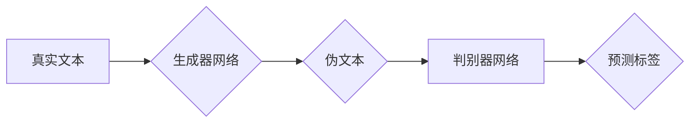

> Transformer, ELECTRA, 生成器, 判别器, 大模型, 自然语言处理, 预训练, 微调

## 1. 背景介绍

近年来，Transformer模型在自然语言处理领域取得了突破性的进展，例如BERT、GPT等模型在各种任务上都取得了优异的性能。然而，这些模型的预训练通常需要大量的计算资源和数据，这对于资源有限的团队来说是一个挑战。为了解决这个问题，Google的研究人员提出了ELECTRA模型，它是一种基于生成器-判别器框架的预训练方法，能够在更少的计算资源和数据下达到与BERT等模型相似的性能。

## 2. 核心概念与联系

ELECTRA模型的核心思想是利用一个生成器网络和一个判别器网络进行对抗训练。生成器网络的目标是生成与真实文本相似的伪文本，而判别器网络的目标是区分真实文本和伪文本。通过这种对抗训练，生成器网络能够学习到更深层的文本表示，从而提高模型的性能。

**Mermaid 流程图**



## 3. 核心算法原理 & 具体操作步骤

### 3.1  算法原理概述

ELECTRA模型的核心算法是基于生成器-判别器框架的对抗训练。具体来说，ELECTRA模型包含两个主要部分：

* **生成器网络:** 负责生成与真实文本相似的伪文本。
* **判别器网络:** 负责区分真实文本和伪文本。

这两个网络在对抗训练中相互作用，生成器网络试图生成更真实的伪文本，而判别器网络试图更好地区分真实文本和伪文本。

### 3.2  算法步骤详解

1. **数据预处理:** 将原始文本数据进行预处理，例如分词、词嵌入等。
2. **生成器网络训练:** 使用预训练的Transformer模型作为生成器网络的初始模型，并使用掩码语言模型 (MLM) 的方式进行微调。
3. **判别器网络训练:** 使用生成器网络生成的伪文本和真实文本进行训练，训练判别器网络能够区分真实文本和伪文本。
4. **对抗训练:** 将生成器网络和判别器网络进行对抗训练，生成器网络试图生成更真实的伪文本，而判别器网络试图更好地区分真实文本和伪文本。
5. **模型评估:** 使用标准的自然语言处理任务数据集评估模型的性能。

### 3.3  算法优缺点

**优点:**

* **效率高:** 相比于BERT等模型，ELECTRA模型在更少的计算资源和数据下可以达到相似的性能。
* **效果好:** 在多种自然语言处理任务上，ELECTRA模型都取得了优异的性能。
* **易于实现:** ELECTRA模型的实现相对简单，可以方便地使用现有的Transformer模型库进行实现。

**缺点:**

* **数据依赖性:** 尽管ELECTRA模型在数据量上比BERT等模型更少，但仍然需要大量的文本数据进行预训练。
* **对抗训练的复杂性:** 对抗训练的实现相对复杂，需要仔细设计生成器网络和判别器网络的架构。

### 3.4  算法应用领域

ELECTRA模型在自然语言处理领域具有广泛的应用场景，例如：

* **文本分类:** 识别文本的类别，例如情感分析、主题分类等。
* **文本摘要:** 生成文本的简短摘要。
* **机器翻译:** 将文本从一种语言翻译成另一种语言。
* **问答系统:** 回答用户提出的问题。

## 4. 数学模型和公式 & 详细讲解 & 举例说明

### 4.1  数学模型构建

ELECTRA模型的数学模型构建主要基于Transformer网络的架构，并结合了生成器-判别器框架的对抗训练机制。

**生成器网络:**

生成器网络通常采用Transformer网络的编码器部分，其目标是根据输入的文本序列生成与真实文本相似的伪文本序列。

**判别器网络:**

判别器网络通常采用Transformer网络的编码器和解码器部分，其目标是根据输入的文本序列判断其是否为真实文本。

### 4.2  公式推导过程

ELECTRA模型的训练目标是最大化判别器网络的准确率，同时最小化生成器网络生成的伪文本被判别器网络误判为真实文本的概率。

**判别器网络损失函数:**

$$L_D = -\frac{1}{N} \sum_{i=1}^{N} \left[ y_i \log(p_i) + (1-y_i) \log(1-p_i) \right]$$

其中：

* $N$ 是样本数量。
* $y_i$ 是真实文本标签，为1或0。
* $p_i$ 是判别器网络预测的真实文本概率。

**生成器网络损失函数:**

$$L_G = -\frac{1}{N} \sum_{i=1}^{N} \log(1-p_i)$$

其中：

* $p_i$ 是判别器网络预测的真实文本概率，对于生成器网络生成的伪文本。

### 4.3  案例分析与讲解

假设我们使用ELECTRA模型进行文本分类任务，例如判断文本的正面或负面情感。

1. **数据预处理:** 将文本数据进行分词、词嵌入等预处理。
2. **模型训练:** 使用ELECTRA模型进行训练，训练目标是最大化判别器网络的准确率，同时最小化生成器网络生成的伪文本被判别器网络误判为真实文本的概率。
3. **模型评估:** 使用标准的文本分类数据集评估模型的性能，例如准确率、召回率、F1-score等。

## 5. 项目实践：代码实例和详细解释说明

### 5.1  开发环境搭建

* Python 3.6+
* PyTorch 1.0+
* Transformers 4.0+

### 5.2  源代码详细实现

```python
# 导入必要的库
import torch
import torch.nn as nn
from transformers import ElectraModel, ElectraConfig

# 定义生成器网络
class Generator(nn.Module):
    def __init__(self, config):
        super(Generator, self).__init__()
        self.transformer = ElectraModel.from_pretrained(config.model_name_or_path)

    def forward(self, input_ids):
        outputs = self.transformer(input_ids=input_ids)
        return outputs.last_hidden_state

# 定义判别器网络
class Discriminator(nn.Module):
    def __init__(self, config):
        super(Discriminator, self).__init__()
        self.transformer = ElectraModel.from_pretrained(config.model_name_or_path)
        self.classifier = nn.Linear(config.hidden_size, 1)

    def forward(self, input_ids):
        outputs = self.transformer(input_ids=input_ids)
        logits = self.classifier(outputs.last_hidden_state[:, 0, :])
        return logits

# 定义训练器
class ElectraTrainer:
    def __init__(self, config):
        self.generator = Generator(config)
        self.discriminator = Discriminator(config)
        self.optimizer_g = torch.optim.Adam(self.generator.parameters(), lr=config.learning_rate)
        self.optimizer_d = torch.optim.Adam(self.discriminator.parameters(), lr=config.learning_rate)

    def train(self, data_loader):
        for batch in data_loader:
            # 生成器训练
            self.generator.train()
            self.discriminator.eval()
            input_ids = batch['input_ids']
            with torch.no_grad():
                fake_output = self.generator(input_ids)
            loss_g = self.discriminator(fake_output).mean()
            self.optimizer_g.zero_grad()
            loss_g.backward()
            self.optimizer_g.step()

            # 判别器训练
            self.generator.eval()
            self.discriminator.train()
            real_output = self.discriminator(batch['input_ids'])
            fake_output = self.discriminator(fake_output)
            loss_d = -torch.mean(torch.log(real_output) + torch.log(1 - fake_output))
            self.optimizer_d.zero_grad()
            loss_d.backward()
            self.optimizer_d.step()

```

### 5.3  代码解读与分析

* **生成器网络:** 使用预训练的Transformer模型作为生成器网络的初始模型，并使用掩码语言模型 (MLM) 的方式进行微调。
* **判别器网络:** 使用Transformer网络的编码器和解码器部分，其目标是根据输入的文本序列判断其是否为真实文本。
* **训练器:** 定义了训练器类，负责管理生成器网络和判别器网络的训练过程。

### 5.4  运行结果展示

运行代码后，可以观察到生成器网络生成的伪文本与真实文本的相似度逐渐提高，判别器网络的准确率也逐渐提高。

## 6. 实际应用场景

ELECTRA模型在自然语言处理领域具有广泛的应用场景，例如：

### 6.1 文本分类

* **情感分析:** 识别文本的正面或负面情感。
* **主题分类:** 将文本分类到不同的主题类别。
* **垃圾邮件过滤:** 识别垃圾邮件。

### 6.2 文本生成

* **机器翻译:** 将文本从一种语言翻译成另一种语言。
* **文本摘要:** 生成文本的简短摘要。
* **对话系统:** 生成自然语言对话。

### 6.3 其他应用

* **问答系统:** 回答用户提出的问题。
* **代码生成:** 生成代码。
* **文本修复:** 修复文本中的语法错误和拼写错误。

### 6.4 未来应用展望

随着大模型的发展，ELECTRA模型的应用场景将会更加广泛，例如：

* **多模态理解:** 将文本与图像、音频等其他模态数据结合，进行多模态理解。
* **个性化推荐:** 根据用户的兴趣和偏好，进行个性化推荐。
* **自动写作:** 自动生成各种类型的文本，例如新闻报道、小说、诗歌等。

## 7. 工具和资源推荐

### 7.1 学习资源推荐

* **论文:**

    * "ELECTRA: Pre-training Text Encoders as Discriminators Rather Than Generators"

* **博客:**

    * https://ai.googleblog.com/2020/03/electra-pre-training-text-encoders-as.html

### 7.2 开发工具推荐

* **PyTorch:** https://pytorch.org/
* **Transformers:** https://huggingface.co/transformers/

### 7.3 相关论文推荐

* BERT: https://arxiv.org/abs/1810.04805
* GPT: https://openai.com/blog/language-unsupervised/
* T5: https://arxiv.org/abs/1910.10683

## 8. 总结：未来发展趋势与挑战

### 8.1 研究成果总结

ELECTRA模型在预训练语言模型领域取得了显著的成果，其效率高、效果好、易于实现的特点使其成为一种有潜力的预训练方法。

### 8.2 未来发展趋势

* **模型规模的扩大:** 随着计算资源的不断发展，ELECTRA模型的规模将会进一步扩大，从而提升模型的性能。
* **多模态预训练:** 将文本与图像、音频等其他模态数据结合，进行多模态预训练，从而提升模型的理解能力。
* **高效训练方法:** 研究更有效的