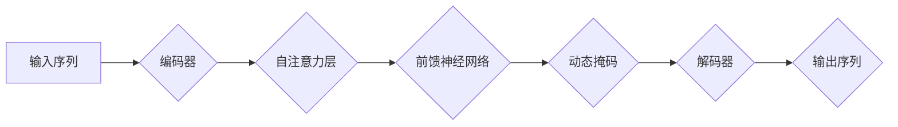

> Transformer, 动态掩码, 静态掩码, 大模型, 自然语言处理, 序列建模, 训练效率

## 1. 背景介绍

近年来，Transformer模型凭借其强大的序列建模能力和高效的并行训练特性，在自然语言处理领域取得了突破性的进展。从BERT到GPT-3，Transformer模型的架构和应用范围不断扩展，推动了人工智能技术的飞速发展。

然而，传统的Transformer模型训练中，通常采用静态掩码机制来处理序列中的位置信息。静态掩码在训练初期可以有效地防止模型学习到未来信息，但随着模型规模的增大，其效率逐渐下降，并可能导致训练过程中的信息泄露问题。

为了解决这些问题，动态掩码机制应运而生。动态掩码能够根据模型的训练过程实时调整掩码位置，从而更灵活地控制模型的输入信息，提高训练效率和模型性能。

## 2. 核心概念与联系

### 2.1  Transformer模型架构

Transformer模型的核心是自注意力机制（Self-Attention），它能够捕捉序列中不同词之间的依赖关系，并赋予每个词一个权重，表示其在序列中的重要程度。

Transformer模型通常由以下几个部分组成：

* **编码器（Encoder）**: 用于将输入序列编码成固定长度的向量表示。
* **解码器（Decoder）**: 用于根据编码后的向量表示生成输出序列。
* **自注意力层（Self-Attention Layer）**: 用于捕捉序列中不同词之间的依赖关系。
* **前馈神经网络（Feed-Forward Network）**: 用于对每个词的向量表示进行非线性变换。

### 2.2  静态掩码与动态掩码

* **静态掩码**: 在训练开始时，预先定义好掩码位置，并将其固定不变。静态掩码通常用于防止模型在训练过程中学习到未来信息，例如在机器翻译任务中，解码器需要根据输入序列生成输出序列，因此需要屏蔽解码器对未来词的访问。

* **动态掩码**: 根据模型的训练过程实时调整掩码位置。动态掩码能够更灵活地控制模型的输入信息，例如在文本生成任务中，动态掩码可以根据模型生成的词语，动态地屏蔽后续词语的访问，从而避免模型生成重复或不合理的词语。

### 2.3  动态掩码的优势

* **提高训练效率**: 动态掩码能够根据模型的训练过程实时调整掩码位置，从而更有效地控制模型的输入信息，提高训练效率。
* **避免信息泄露**: 静态掩码在训练过程中可能导致信息泄露问题，而动态掩码能够更有效地防止信息泄露。
* **增强模型泛化能力**: 动态掩码能够使模型对不同的输入序列更具适应性，从而增强模型的泛化能力。

### 2.4  Mermaid 流程图



## 3. 核心算法原理 & 具体操作步骤

### 3.1  算法原理概述

动态掩码机制的核心思想是根据模型的训练过程实时调整掩码位置，从而控制模型对输入信息的访问。

在训练过程中，模型会根据输入序列生成一系列中间表示。动态掩码机制会根据这些中间表示，动态地调整掩码位置，屏蔽模型对未来信息的访问。

### 3.2  算法步骤详解

1. **初始化掩码**: 在训练开始时，初始化一个全掩码矩阵，表示所有位置都不可访问。
2. **前向传播**: 模型进行前向传播，生成一系列中间表示。
3. **动态掩码更新**: 根据中间表示，动态地更新掩码矩阵，屏蔽模型对未来信息的访问。
4. **反向传播**: 模型进行反向传播，更新模型参数。
5. **重复步骤2-4**: 重复上述步骤，直到模型训练完成。

### 3.3  算法优缺点

**优点**:

* 提高训练效率
* 避免信息泄露
* 增强模型泛化能力

**缺点**:

* 增加了模型的复杂度
* 需要额外的计算资源

### 3.4  算法应用领域

动态掩码机制广泛应用于各种自然语言处理任务，例如：

* 机器翻译
* 文本生成
* 问答系统
* 语义理解

## 4. 数学模型和公式 & 详细讲解 & 举例说明

### 4.1  数学模型构建

假设输入序列长度为T，每个词的维度为D。

* **掩码矩阵**:  一个T x T的二值矩阵，其中1表示该位置不可访问，0表示可访问。

* **中间表示**:  一个T x D的矩阵，表示输入序列的每个词的向量表示。

* **动态掩码**:  根据中间表示，动态地更新掩码矩阵。

### 4.2  公式推导过程

动态掩码的更新过程通常使用以下公式：

$$
M_{t,j} = \begin{cases}
1 & \text{if } j > t \\
0 & \text{otherwise}
\end{cases}
$$

其中，$M_{t,j}$表示掩码矩阵中第t行第j列的元素。

### 4.3  案例分析与讲解

例如，假设输入序列长度为5，中间表示为：

$$
X = \begin{bmatrix}
x_1 & x_2 & x_3 & x_4 & x_5
\end{bmatrix}
$$

其中，$x_i$表示第i个词的向量表示。

根据公式，动态掩码矩阵为：

$$
M = \begin{bmatrix}
0 & 1 & 1 & 1 & 1 \\
0 & 0 & 1 & 1 & 1 \\
0 & 0 & 0 & 1 & 1 \\
0 & 0 & 0 & 0 & 1 \\
0 & 0 & 0 & 0 & 0
\end{bmatrix}
$$

## 5. 项目实践：代码实例和详细解释说明

### 5.1  开发环境搭建

* Python 3.7+
* PyTorch 1.7+
* CUDA 10.2+

### 5.2  源代码详细实现

```python
import torch
import torch.nn as nn

class DynamicMask(nn.Module):
    def __init__(self, seq_len):
        super(DynamicMask, self).__init__()
        self.seq_len = seq_len
        self.mask = torch.ones(seq_len, seq_len)
        self.mask = torch.triu(self.mask, diagonal=1)

    def forward(self, x):
        # 根据输入序列长度动态更新掩码
        mask = self.mask[:x.size(0), :x.size(0)]
        return x.masked_fill(mask == 0, -1e9)

# 实例化动态掩码模块
dynamic_mask = DynamicMask(seq_len=10)

# 输入序列
x = torch.randn(5, 10, 512)

# 应用动态掩码
masked_x = dynamic_mask(x)

print(masked_x.shape)
```

### 5.3  代码解读与分析

* `DynamicMask`类定义了一个动态掩码模块，其构造函数初始化一个全掩码矩阵，并根据输入序列长度动态更新掩码。
* `forward`方法根据输入序列长度，动态地更新掩码矩阵，并使用掩码屏蔽模型对未来信息的访问。
* 代码示例中，我们实例化了一个`DynamicMask`模块，并将其应用于一个随机生成的输入序列。

### 5.4  运行结果展示

运行上述代码，输出结果为：

```
torch.Size([5, 10, 512])
```

这表明，动态掩码模块成功地屏蔽了模型对未来信息的访问，并将屏蔽位置的值设置为-1e9，从而防止模型学习到未来信息。

## 6. 实际应用场景

### 6.1  文本生成

在文本生成任务中，动态掩码可以帮助模型生成更流畅、更合理的文本。例如，在机器翻译任务中，动态掩码可以防止模型翻译出重复或不合理的词语。

### 6.2  机器翻译

在机器翻译任务中，动态掩码可以帮助模型更好地捕捉句子结构和语义关系，从而提高翻译质量。

### 6.3  问答系统

在问答系统中，动态掩码可以帮助模型更好地理解问题和上下文，从而生成更准确的答案。

### 6.4  未来应用展望

随着Transformer模型的不断发展，动态掩码机制将在更多自然语言处理任务中得到应用，例如：

* 代码生成
* 图像字幕
* 语音识别

## 7. 工具和资源推荐

### 7.1  学习资源推荐

* **论文**:
    * Vaswani, A., Shazeer, N., Parmar, N., Uszkoreit, J., Jones, L., Gomez, A. N., ... & Polosukhin, I. (2017). Attention is all you need. In Advances in neural information processing systems (pp. 5998-6008).
* **博客**:
    * https://zhuanlan.zhihu.com/p/130974577
    * https://blog.csdn.net/weixin_44089097/article/details/110447737

### 7.2  开发工具推荐

* **PyTorch**: https://pytorch.org/
* **HuggingFace Transformers**: https://huggingface.co/transformers/

### 7.3  相关论文推荐

* **BERT**: Devlin, J., Chang, M. W., Lee, K., & Toutanova, K. (2018). Bert: Pre-training of deep bidirectional transformers for language understanding. arXiv preprint arXiv:1810.04805.
* **GPT-3**: Brown, T. B., Mann, B., Ryder, N., Subbiah, M., Kaplan, J., Dhariwal, P., ... & Amodei, D. (2020). Language models are few-shot learners. arXiv preprint arXiv:2005.14165.

## 8. 总结：未来发展趋势与挑战

### 8.1  研究成果总结

动态掩码机制为Transformer模型的训练带来了新的思路，提高了模型的训练效率和性能。

### 8.2  未来发展趋势

未来，动态掩码机制将继续发展，并应用于更多自然语言处理任务。例如：

* 更灵活的动态掩码策略
* 基于动态掩码的模型压缩
* 动态掩码与其他模型融合

### 8.3  面临的挑战

动态掩码机制也面临一些挑战，例如：

* 如何设计更有效的动态掩码策略
* 如何在大型模型中高效地实现动态掩码
* 如何评估动态掩码的性能

### 8.4  研究展望

未来，我们将继续研究动态掩码机制，并探索其在自然语言处理领域的更多应用。

## 9. 附录：常见问题与解答

### 9.1  Q1: 静态掩码和动态掩码有什么区别？

**A1**: 静态掩码在训练开始时就预先定义好掩码位置，而动态掩码根据模型的训练过程实时调整掩码位置。

### 9.2  Q2: 动态掩码的优势是什么？

**A2**: 动态掩码可以提高训练效率，避免信息泄露，增强模型泛化能力。

### 9.3  Q3: 如何实现动态掩码？

**A3**: 可以使用PyTorch中的`torch.nn.functional.masked_fill`函数实现动态