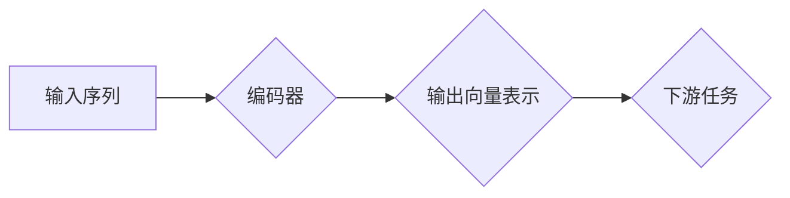

> Transformer, BERT, 自然语言处理, 预训练模型, 中文文本理解, 语言模型

## 1. 背景介绍

近年来，深度学习在自然语言处理 (NLP) 领域取得了显著进展，其中 Transformer 架构和基于 Transformer 的预训练语言模型 (PLM) 成为 NLP 领域的新宠。BERT (Bidirectional Encoder Representations from Transformers) 是 Google 团队开发的基于 Transformer 架构的 PLM，在许多 NLP 任务上取得了state-of-the-art 的性能，例如文本分类、问答系统、文本蕴含等。

BERT 模型的优势在于其采用了双向编码机制，能够更好地理解上下文信息，并通过预训练的方式学习到丰富的语言表示，从而在后续下游任务中表现出色。

## 2. 核心概念与联系

### 2.1 Transformer 架构

Transformer 架构是一种新型的序列到序列模型，它摒弃了传统的循环神经网络 (RNN) 的顺序处理方式，采用了注意力机制 (Attention) 来捕捉序列中的长距离依赖关系。

Transformer 架构主要由以下几个部分组成：

* **编码器 (Encoder):** 用于将输入序列编码成固定长度的向量表示。
* **解码器 (Decoder):** 用于根据编码后的向量表示生成输出序列。
* **注意力机制:** 用于计算序列中不同元素之间的相关性，并根据相关性权重进行加权求和，从而捕捉长距离依赖关系。

### 2.2 BERT 模型

BERT 模型基于 Transformer 架构，它是一个双向编码模型，其编码器部分由多个 Transformer 块组成。BERT 模型通过预训练的方式学习到丰富的语言表示，并通过微调的方式将其应用于不同的下游任务。

**BERT 模型的预训练目标主要有两种：**

* **Masked Language Modeling (MLM):** 随机遮盖输入序列中的部分词，然后预测被遮盖词的词语。
* **Next Sentence Prediction (NSP):** 判断两个句子是否连续。

### 2.3 Mermaid 流程图



## 3. 核心算法原理 & 具体操作步骤

### 3.1 算法原理概述

BERT 模型的核心算法原理是基于 Transformer 架构和双向编码机制。

* **Transformer 架构:** 能够有效地捕捉序列中的长距离依赖关系。
* **双向编码机制:** 能够更好地理解上下文信息，从而学习到更丰富的语言表示。

### 3.2 算法步骤详解

1. **输入处理:** 将输入序列转换为词嵌入向量。
2. **编码器:** 将词嵌入向量输入到编码器中，编码器由多个 Transformer 块组成，每个 Transformer 块包含多头注意力机制和前馈神经网络。
3. **输出向量表示:** 编码器输出每个词的上下文向量表示。
4. **下游任务:** 根据下游任务的需求，使用输出的上下文向量表示进行预测。

### 3.3 算法优缺点

**优点:**

* 能够有效地捕捉序列中的长距离依赖关系。
* 双向编码机制能够更好地理解上下文信息。
* 预训练的方式能够学习到丰富的语言表示。

**缺点:**

* 计算量较大，训练成本高。
* 对训练数据要求较高。

### 3.4 算法应用领域

BERT 模型在许多 NLP 任务上取得了state-of-the-art 的性能，例如：

* 文本分类
* 问答系统
* 文本蕴含
* 机器翻译
* 语义相似度计算

## 4. 数学模型和公式 & 详细讲解 & 举例说明

### 4.1 数学模型构建

BERT 模型的数学模型主要包括以下几个部分：

* **词嵌入:** 将每个词映射到一个低维向量空间。
* **多头注意力机制:** 计算序列中不同元素之间的相关性，并根据相关性权重进行加权求和。
* **前馈神经网络:** 对注意力机制输出进行非线性变换。

### 4.2 公式推导过程

**词嵌入:**

$$
\mathbf{w}_i = \mathbf{W}_e \mathbf{x}_i
$$

其中，$\mathbf{w}_i$ 是词 $i$ 的词嵌入向量，$\mathbf{x}_i$ 是词 $i$ 的 one-hot 编码向量，$\mathbf{W}_e$ 是词嵌入矩阵。

**多头注意力机制:**

$$
\mathbf{Attention}(\mathbf{Q}, \mathbf{K}, \mathbf{V}) = \text{softmax}\left(\frac{\mathbf{Q} \mathbf{K}^T}{\sqrt{d_k}}\right) \mathbf{V}
$$

其中，$\mathbf{Q}$, $\mathbf{K}$, $\mathbf{V}$ 分别是查询矩阵、键矩阵和值矩阵，$d_k$ 是键向量的维度。

**前馈神经网络:**

$$
\mathbf{F}(\mathbf{x}) = \sigma(\mathbf{W}_1 \mathbf{x} + \mathbf{b}_1)
$$

其中，$\mathbf{F}$ 是前馈神经网络，$\mathbf{x}$ 是输入向量，$\mathbf{W}_1$, $\mathbf{b}_1$ 分别是权重矩阵和偏置向量，$\sigma$ 是激活函数。

### 4.3 案例分析与讲解

假设我们有一个句子 "The cat sat on the mat"，我们使用 BERT 模型对其进行编码，得到每个词的上下文向量表示。

对于词 "cat"，它的上下文向量表示会受到 "The" 和 "sat" 的影响，因为它位于这两个词之间。

## 5. 项目实践：代码实例和详细解释说明

### 5.1 开发环境搭建

* Python 3.6+
* TensorFlow 或 PyTorch
* CUDA 和 cuDNN (可选)

### 5.2 源代码详细实现

```python
# 使用 HuggingFace Transformers 库加载预训练的 BERT 模型
from transformers import BertTokenizer, BertModel

# 加载 BERT 模型和词典
tokenizer = BertTokenizer.from_pretrained('bert-base-uncased')
model = BertModel.from_pretrained('bert-base-uncased')

# 将输入文本转换为 BERT 模型可以识别的格式
input_text = "The cat sat on the mat"
input_ids = tokenizer.encode(input_text, add_special_tokens=True)

# 将输入 ID 传入 BERT 模型进行编码
outputs = model(input_ids)

# 获取每个词的上下文向量表示
last_hidden_state = outputs.last_hidden_state
```

### 5.3 代码解读与分析

* `BertTokenizer` 用于将文本转换为 BERT 模型可以识别的格式，包括将文本分割成单词，并为每个单词分配一个 ID。
* `BertModel` 是 BERT 模型的实现，它包含编码器部分。
* `model(input_ids)` 将输入 ID 传入 BERT 模型进行编码，并返回每个词的上下文向量表示。

### 5.4 运行结果展示

运行上述代码后，会得到每个词的上下文向量表示，这些向量可以用于后续的下游任务，例如文本分类、问答系统等。

## 6. 实际应用场景

BERT 模型在许多实际应用场景中取得了成功，例如：

* **搜索引擎:** BERT 可以用于理解用户搜索意图，并返回更相关的搜索结果。
* **聊天机器人:** BERT 可以用于训练更智能的聊天机器人，使其能够更好地理解用户对话内容。
* **文本摘要:** BERT 可以用于自动生成文本摘要，提取文本的关键信息。

### 6.4 未来应用展望

BERT 模型的未来应用前景广阔，例如：

* **多语言理解:** 将 BERT 模型应用于多语言文本理解任务。
* **跨模态理解:** 将 BERT 模型与其他模态数据 (例如图像、音频) 结合，实现跨模态理解。
* **个性化推荐:** 使用 BERT 模型分析用户的兴趣偏好，提供个性化推荐。

## 7. 工具和资源推荐

### 7.1 学习资源推荐

* **HuggingFace Transformers 库:** https://huggingface.co/docs/transformers/index
* **BERT 官方论文:** https://arxiv.org/abs/1810.04805

### 7.2 开发工具推荐

* **TensorFlow:** https://www.tensorflow.org/
* **PyTorch:** https://pytorch.org/

### 7.3 相关论文推荐

* **BERT: Pre-training of Deep Bidirectional Transformers for Language Understanding:** https://arxiv.org/abs/1810.04805
* **XLNet: Generalized Autoregressive Pretraining for Language Understanding:** https://arxiv.org/abs/1906.08237
* **RoBERTa: A Robustly Optimized BERT Pretraining Approach:** https://arxiv.org/abs/1907.11692

## 8. 总结：未来发展趋势与挑战

### 8.1 研究成果总结

BERT 模型的出现标志着 NLP 领域取得了重大进展，它为许多 NLP 任务带来了新的突破。

### 8.2 未来发展趋势

* **模型规模更大:** 预训练模型的规模将继续扩大，从而学习到更丰富的语言表示。
* **多模态理解:** 将 BERT 模型与其他模态数据结合，实现跨模态理解。
* **可解释性:** 研究 BERT 模型的内部机制，提高模型的可解释性。

### 8.3 面临的挑战

* **计算资源:** 训练大型预训练模型需要大量的计算资源。
* **数据质量:** 预训练模型的性能依赖于训练数据的质量。
* **公平性:** 预训练模型可能存在偏见，需要研究如何提高模型的公平性。

### 8.4 研究展望

未来，预训练语言模型将继续发展，并在更多领域发挥重要作用。

## 9. 附录：常见问题与解答

**Q1: BERT 模型的训练数据是什么？**

**A1:** BERT 模型的训练数据来自 Google 的 BookCorpus 和 Wikipedia 数据集。

**Q2: BERT 模型的预训练目标是什么？**

**A2:** BERT 模型的预训练目标主要有两种：Masked Language Modeling (MLM) 和 Next Sentence Prediction (NSP)。

**Q3: 如何使用 BERT 模型进行下游任务？**

**A3:** 可以通过微调 BERT 模型的参数来进行下游任务。

**Q4: BERT 模型的开源代码在哪里？**

**A4:** BERT 模型的开源代码可以在 HuggingFace Transformers 库中找到。


作者：禅与计算机程序设计艺术 / Zen and the Art of Computer Programming 
<end_of_turn>