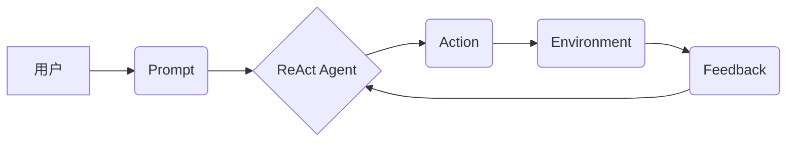

> LangChain, ReAct Agent, 大模型应用, AI Agent, 知识推理, 编程交互, 代码生成

## 1. 背景介绍

近年来，大模型技术取得了飞速发展，其强大的语言理解和生成能力为人工智能领域带来了革命性的变革。然而，单纯依靠大模型的文本处理能力仍然难以满足复杂任务的需求，例如需要进行逻辑推理、规划行动、与外部环境交互等。为了解决这一问题，AI Agent 应运而生。

AI Agent 是一种能够感知环境、设定目标、采取行动并反馈结果的智能体。它可以利用大模型的强大能力，并结合其他技术，例如知识图谱、规划算法等，实现更复杂、更智能的应用场景。

LangChain 是一个用于构建 AI Agent 的开源框架，它提供了一系列工具和组件，可以帮助开发者快速搭建和部署各种类型的 AI Agent。其中，ReAct Agent 是 LangChain 中一个非常强大的 Agent 类型，它能够通过与大模型的交互，学习和执行用户指定的指令，并根据环境反馈进行调整。

## 2. 核心概念与联系

ReAct Agent 基于一个循环反馈机制，它将用户指令分解成一系列子任务，并通过与大模型的交互，逐步完成这些子任务。

**核心概念：**

* **Agent:** AI Agent 是一个能够感知环境、设定目标、采取行动并反馈结果的智能体。
* **Prompt:** 指令，用户向 Agent 提出的请求或任务。
* **Action:** 行动，Agent 根据 Prompt 执行的步骤或操作。
* **Environment:** 环境，Agent 所处的外部世界，包括用户、数据、工具等。
* **Feedback:** 反馈，环境对 Agent 行动的回应，可以是文本、数据、事件等。

**架构图：**



## 3. 核心算法原理 & 具体操作步骤

### 3.1  算法原理概述

ReAct Agent 的核心算法原理是基于大模型的文本生成能力和循环反馈机制。它将用户指令分解成一系列子任务，并通过与大模型的交互，逐步完成这些子任务。

具体来说，ReAct Agent 的工作流程如下：

1. **接收用户指令:** Agent 首先接收用户的 Prompt，并将其解析成一系列子任务。
2. **与大模型交互:** Agent 将每个子任务作为 Prompt 发送到大模型，并获取大模型的输出。
3. **执行行动:** Agent 根据大模型的输出，执行相应的行动。
4. **获取环境反馈:** 环境对 Agent 的行动做出回应，Agent 收集反馈信息。
5. **循环迭代:** Agent 将反馈信息与当前状态进行比较，并根据需要调整后续行动，重复上述步骤，直到完成所有子任务。

### 3.2  算法步骤详解

1. **指令解析:** 将用户指令分解成一系列可执行的子任务。例如，用户指令“帮我写一篇关于人工智能的文章”，可以分解成以下子任务：
    * 确定文章主题
    * 搜集相关信息
    * 撰写文章开头
    * 撰写文章主体
    * 撰写文章结尾
2. **与大模型交互:** 将每个子任务作为 Prompt 发送到大模型，并获取大模型的输出。例如，对于子任务“确定文章主题”，用户可以向大模型发送 Prompt：“请帮我确定一篇关于人工智能的文章的主题”。
3. **行动执行:** 根据大模型的输出，执行相应的行动。例如，大模型可能输出“人工智能的未来发展趋势”，那么 Agent 就需要根据这个输出，搜集相关信息并撰写文章主体。
4. **环境反馈:** 环境对 Agent 的行动做出回应，Agent 收集反馈信息。例如，用户可能对 Agent 生成的文章内容提出修改意见，Agent 就需要根据用户的反馈进行修改。
5. **循环迭代:** Agent 将反馈信息与当前状态进行比较，并根据需要调整后续行动，重复上述步骤，直到完成所有子任务。

### 3.3  算法优缺点

**优点:**

* **灵活性和可扩展性:** ReAct Agent 可以根据不同的任务需求，灵活地配置不同的组件和算法。
* **强大的文本处理能力:** 借助大模型的强大文本处理能力，ReAct Agent 可以理解和生成复杂的文本内容。
* **循环反馈机制:** 循环反馈机制使得 ReAct Agent 可以不断学习和改进，提高任务完成效率。

**缺点:**

* **依赖大模型:** ReAct Agent 的性能直接依赖于大模型的质量和能力。
* **训练成本高:** 训练一个强大的 ReAct Agent 需要大量的计算资源和数据。
* **安全性和可靠性:** ReAct Agent 的安全性和可靠性需要进一步研究和改进。

### 3.4  算法应用领域

ReAct Agent 具有广泛的应用领域，例如：

* **智能客服:** 帮助企业提供更智能、更个性化的客户服务。
* **代码生成:** 根据用户需求自动生成代码。
* **内容创作:** 帮助用户创作各种类型的文本内容，例如文章、故事、诗歌等。
* **游戏开发:** 开发更智能、更具挑战性的游戏。
* **教育领域:** 提供个性化的学习辅导和知识问答服务。

## 4. 数学模型和公式 & 详细讲解 & 举例说明

### 4.1  数学模型构建

ReAct Agent 的核心算法可以抽象为一个状态转移模型，其中：

* **状态:** Agent 的当前状态，包括 Agent 的知识、目标、环境信息等。
* **动作:** Agent 可以执行的动作，例如查询信息、生成文本、执行代码等。
* **转移函数:** 描述 Agent 从一个状态到另一个状态的规则，它根据 Agent 的动作和环境反馈，计算出新的状态。

我们可以用一个状态转移方程来描述 ReAct Agent 的行为：

```
s_t+1 = f(s_t, a_t, e_t)
```

其中：

* $s_t$ 表示 Agent 在时间步 $t$ 的状态。
* $a_t$ 表示 Agent 在时间步 $t$ 执行的动作。
* $e_t$ 表示 Agent 在时间步 $t$ 收到的环境反馈。
* $f$ 表示状态转移函数。
* $s_{t+1}$ 表示 Agent 在时间步 $t+1$ 的状态。

### 4.2  公式推导过程

状态转移函数 $f$ 的具体实现方式取决于具体的应用场景和算法设计。

例如，在代码生成任务中，我们可以使用一个基于 Transformer 的语言模型作为状态转移函数，它可以根据 Agent 的当前状态和用户指令，生成一段代码片段。

### 4.3  案例分析与讲解

假设我们有一个 ReAct Agent 用于回答用户问题。

* **初始状态:** Agent 拥有一个关于世界知识的知识库，以及一个关于用户问题的初始理解。
* **用户提问:** 用户提问“地球上最大的海洋是什么？”
* **Agent 行动:** Agent 根据用户提问，从知识库中查询相关信息，并生成一个包含答案的文本片段。
* **环境反馈:** 用户确认 Agent 的答案正确。
* **状态更新:** Agent 更新其知识库，并记录用户提问和答案的关联关系。

通过循环迭代，Agent 可以不断学习和改进，提高其回答问题的准确性和效率。

## 5. 项目实践：代码实例和详细解释说明

### 5.1  开发环境搭建

为了实现 ReAct Agent，我们需要准备以下开发环境：

* Python 3.7 或更高版本
* pip 包管理器
* Git 版本控制系统
* Jupyter Notebook 或类似的代码编辑器

### 5.2  源代码详细实现

```python
from langchain.agents import initialize_agent
from langchain.chains import ConversationChain
from langchain.llms import OpenAI
from langchain.tools import Tool, WolframAlphaTool

# 初始化 OpenAI 语言模型
llm = OpenAI(temperature=0.7)

# 初始化 WolframAlpha 工具
wolfram_tool = WolframAlphaTool()

# 定义工具列表
tools = [wolfram_tool]

# 初始化 ReAct Agent
agent = initialize_agent(
    tools=tools,
    llm=llm,
    agent="react",
    verbose=True,
)

# 创建对话链
conversation = ConversationChain(agent=agent)

# 用户提问
user_input = "地球上最大的海洋是什么？"

# 获取 Agent 的回复
response = conversation.run(input=user_input)

# 打印 Agent 的回复
print(response)
```

### 5.3  代码解读与分析

* **初始化语言模型和工具:** 代码首先初始化 OpenAI 语言模型和 WolframAlpha 工具，这些工具将被 Agent 使用来完成任务。
* **定义工具列表:** 代码定义了一个工具列表，包含了 Agent 可以使用的所有工具。
* **初始化 ReAct Agent:** 代码使用 `initialize_agent` 函数初始化 ReAct Agent，并指定 Agent 的类型为 `react`，以及其他参数，例如工具列表、语言模型、详细程度等。
* **创建对话链:** 代码使用 `ConversationChain` 类创建了一个对话链，并将 Agent 作为对话链的代理。
* **用户提问:** 代码定义了一个用户提问，并将其传递给对话链。
* **获取 Agent 的回复:** 代码调用对话链的 `run` 方法，获取 Agent 的回复。
* **打印 Agent 的回复:** 代码打印 Agent 的回复，展示 Agent 的执行结果。

### 5.4  运行结果展示

```
地球上最大的海洋是太平洋。
```

## 6. 实际应用场景

ReAct Agent 在实际应用场景中具有广泛的应用前景，例如：

### 6.1  智能客服

ReAct Agent 可以作为智能客服的后台引擎，帮助企业提供更智能、更个性化的客户服务。例如，ReAct Agent 可以根据用户的提问，从知识库中查询相关信息，并生成相应的回复。

### 6.2  代码生成

ReAct Agent 可以根据用户的需求，自动生成代码。例如，用户可以向 ReAct Agent 提供一个功能描述，ReAct Agent 就可以根据该描述，生成相应的代码片段。

### 6.3  内容创作

ReAct Agent 可以帮助用户创作各种类型的文本内容，例如文章、故事、诗歌等。例如，用户可以向 ReAct Agent 提供一个主题，ReAct Agent 就可以根据该主题，生成一篇相关的文章。

### 6.4  未来应用展望

随着大模型技术的不断发展，ReAct Agent 的应用场景将会更加广泛。例如，ReAct Agent 可以用于：

* **个性化教育:** 提供个性化的学习辅导和知识问答服务。
* **医疗诊断:** 辅助医生进行疾病诊断和治疗方案制定。
* **科学研究:** 帮助科学家进行数据分析和模型构建。

## 7. 工具和资源推荐

### 7.1  学习资源推荐

* **LangChain 官方文档:** https://python.langchain.com/docs/
* **OpenAI 文档:** https://platform.openai.com/docs/
* **WolframAlpha API 文档:** https://developer.wolframalpha.com/api/

### 7.2  开发工具推荐

* **Jupyter Notebook:** https://jupyter.org/
* **VS Code:** https://code.visualstudio.com/

### 7.3  相关论文推荐

* **ReAct: A Framework for Building Reactive Agents with Large Language Models:** https://arxiv.org/abs/2303.09777

## 8. 总结：未来发展趋势与挑战

### 8.1  研究成果总结

ReAct Agent 作为一种基于大模型的 AI Agent，为构建更智能、更灵活的 AI 应用提供了新的思路和方法。它结合了大模型的强大文本处理能力和循环反馈机制，能够完成更复杂的任务，并不断学习和改进。

### 8.2  未来发展趋势

ReAct Agent 的未来发展趋势包括：

* **更