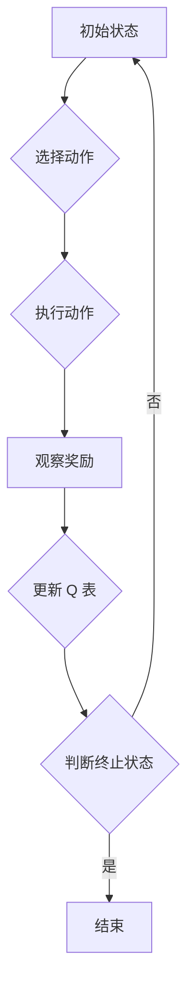

> Q-learning, 强化学习, 知识框架, AI, 算法原理, 应用场景

## 1. 背景介绍

在人工智能领域，强化学习 (Reinforcement Learning, RL) 作为一种模仿人类学习方式的算法，近年来取得了显著进展，并在机器人控制、游戏 AI、推荐系统等领域展现出强大的应用潜力。其中，Q-learning 作为 RL 的经典算法之一，以其简单易懂、易于实现的特点，成为了研究和应用的热点。

然而，对于初学者而言，理解 Q-learning 的核心原理和应用场景可能存在一定的难度。本文旨在通过构建一个完整的 Q-learning 知识框架，帮助读者深入理解该算法的本质，并掌握其应用技巧。

## 2. 核心概念与联系

Q-learning 算法的核心思想是通过学习一个 Q 表 (Q-table)，来评估在不同状态下采取不同动作的价值。Q 表是一个二维数组，其中每一行代表一个状态，每一列代表一个动作，每个单元格的值表示采取该动作在该状态下的期望回报。

**Q-learning 算法流程图:**



**核心概念解释:**

* **状态 (State):**  系统当前的状况，例如游戏中的棋盘位置、机器人当前的位置等。
* **动作 (Action):**  系统可以采取的行动，例如游戏中的移动、攻击等、机器人中的前进、转弯等。
* **奖励 (Reward):**  系统在执行某个动作后获得的反馈，可以是正数、负数或零。
* **Q 值 (Q-value):**  在特定状态下执行特定动作的期望回报。

**Q-learning 算法的优势:**

* **模型免费:**  不需要事先构建环境模型，可以直接从环境中学习。
* **离线学习:**  可以利用历史数据进行离线学习，无需实时交互。
* **广泛适用:**  可以应用于各种各样的强化学习问题。

## 3. 核心算法原理 & 具体操作步骤

### 3.1  算法原理概述

Q-learning 算法的核心思想是通过迭代更新 Q 表，来逼近最优策略。更新规则如下：

$$
Q(s, a) = Q(s, a) + \alpha [r + \gamma \max_{a'} Q(s', a') - Q(s, a)]
$$

其中：

* $Q(s, a)$:  在状态 $s$ 下执行动作 $a$ 的 Q 值。
* $\alpha$:  学习率，控制学习速度。
* $r$:  在执行动作 $a$ 后获得的奖励。
* $\gamma$:  折扣因子，控制未来奖励的权重。
* $s'$:  执行动作 $a$ 后进入的下一个状态。
* $\max_{a'} Q(s', a')$:  在下一个状态 $s'$ 下，所有可能的动作 $a'$ 的最大 Q 值。

### 3.2  算法步骤详解

1. **初始化 Q 表:**  将 Q 表中的所有值初始化为零或一个小值。
2. **选择动作:**  根据当前状态，选择一个动作。可以使用 $\epsilon$-贪婪策略，以一定的概率选择随机动作，以探索环境。
3. **执行动作:**  执行选择的动作，并观察获得的奖励和下一个状态。
4. **更新 Q 表:**  根据更新规则，更新 Q 表中的值。
5. **重复步骤 2-4:**  重复上述步骤，直到达到终止条件，例如达到最大迭代次数或达到目标奖励。

### 3.3  算法优缺点

**优点:**

* 简单易懂，易于实现。
* 能够学习最优策略。
* 适用于离线学习。

**缺点:**

* 对于状态空间和动作空间很大的问题，Q 表会变得非常庞大，难以存储和更新。
* 学习速度可能较慢。

### 3.4  算法应用领域

Q-learning 算法广泛应用于以下领域:

* **机器人控制:**  训练机器人完成各种任务，例如导航、抓取等。
* **游戏 AI:**  开发智能游戏对手，例如围棋、象棋等。
* **推荐系统:**  根据用户的历史行为，推荐感兴趣的内容。
* **金融交易:**  开发自动交易策略。

## 4. 数学模型和公式 & 详细讲解 & 举例说明

### 4.1  数学模型构建

Q-learning 算法的核心数学模型是 Q 表，它是一个二维数组，其中每一行代表一个状态，每一列代表一个动作，每个单元格的值表示采取该动作在该状态下的期望回报。

**Q 表的数学表示:**

$$
Q(s, a)
$$

其中：

* $s$:  状态
* $a$:  动作

### 4.2  公式推导过程

Q-learning 算法的更新规则如下：

$$
Q(s, a) = Q(s, a) + \alpha [r + \gamma \max_{a'} Q(s', a') - Q(s, a)]
$$

其中：

* $Q(s, a)$:  在状态 $s$ 下执行动作 $a$ 的 Q 值。
* $\alpha$:  学习率，控制学习速度。
* $r$:  在执行动作 $a$ 后获得的奖励。
* $\gamma$:  折扣因子，控制未来奖励的权重。
* $s'$:  执行动作 $a$ 后进入的下一个状态。
* $\max_{a'} Q(s', a')$:  在下一个状态 $s'$ 下，所有可能的动作 $a'$ 的最大 Q 值。

该公式表示，Q 值的更新等于当前 Q 值加上学习率乘以奖励加上折扣因子乘以下一个状态下所有动作的最大 Q 值减去当前 Q 值。

### 4.3  案例分析与讲解

假设我们有一个简单的环境，其中有一个机器人需要在两个状态之间移动，每个状态都有两个动作可以选择。

* 状态 1:  机器人位于起点。
* 状态 2:  机器人位于终点。
* 动作 1:  向右移动。
* 动作 2:  向左移动。

初始 Q 表如下：

| 状态 | 动作 1 | 动作 2 |
|---|---|---|
| 状态 1 | 0 | 0 |
| 状态 2 | 0 | 0 |

假设机器人从状态 1 开始，执行动作 1 移动到状态 2，获得奖励 1。根据 Q-learning 更新规则，Q 表更新如下：

| 状态 | 动作 1 | 动作 2 |
|---|---|---|
| 状态 1 | 0 + 0.1 * (1 + 0.9 * 1) | 0 |
| 状态 2 | 0 | 0 |

可以看到，Q 表中的 Q(状态 1, 动作 1) 值被更新为 0.19，表示执行动作 1 从状态 1 到状态 2 的期望回报为 0.19。

## 5. 项目实践：代码实例和详细解释说明

### 5.1  开发环境搭建

本项目使用 Python 语言进行开发，需要安装以下库:

* NumPy:  用于数值计算。
* Matplotlib:  用于数据可视化。

可以使用 pip 安装这些库:

```bash
pip install numpy matplotlib
```

### 5.2  源代码详细实现

```python
import numpy as np

# 定义环境
class Environment:
    def __init__(self):
        self.state = 0  # 初始状态

    def step(self, action):
        if action == 0:  # 向左移动
            self.state = (self.state - 1) % 2
        elif action == 1:  # 向右移动
            self.state = (self.state + 1) % 2
        reward = 1 if self.state == 1 else 0  # 奖励
        return self.state, reward

# 定义 Q-learning 算法
class QLearning:
    def __init__(self, learning_rate=0.1, discount_factor=0.9, epsilon=0.1):
        self.learning_rate = learning_rate
        self.discount_factor = discount_factor
        self.epsilon = epsilon
        self.q_table = np.zeros((2, 2))  # Q 表

    def choose_action(self, state):
        if np.random.uniform(0, 1) < self.epsilon:
            return np.random.choice([0, 1])  # 随机选择动作
        else:
            return np.argmax(self.q_table[state])  # 选择最大 Q 值的动作

    def update_q_table(self, state, action, reward, next_state):
        self.q_table[state, action] += self.learning_rate * (
            reward + self.discount_factor * np.max(self.q_table[next_state]) - self.q_table[state, action]
        )

# 主程序
if __name__ == "__main__":
    env = Environment()
    agent = QLearning()

    for episode in range(1000):
        state = env.state
        while state != 1:
            action = agent.choose_action(state)
            next_state, reward = env.step(action)
            agent.update_q_table(state, action, reward, next_state)
            state = next_state

    print("Q 表:")
    print(agent.q_table)
```

### 5.3  代码解读与分析

* **环境类 (Environment):**  定义了环境的状态和动作，以及环境的转移规则和奖励函数。
* **Q-learning 类 (QLearning):**  实现了 Q-learning 算法的核心逻辑，包括 Q 表的初始化、动作选择、Q 值的更新等。
* **主程序:**  创建环境和 Q-learning 算法实例，进行训练和测试。

### 5.4  运行结果展示

运行代码后，会输出 Q 表，其中每个单元格的值表示在对应状态下执行对应动作的期望回报。

## 6. 实际应用场景

Q-learning 算法在实际应用中具有广泛的应用场景，例如:

* **机器人控制:**  训练机器人完成导航、抓取、避障等任务。
* **游戏 AI:**  开发智能游戏对手，例如围棋、象棋、Go 等。
* **推荐系统:**  根据用户的历史行为，推荐感兴趣的内容。
* **金融交易:**  开发自动交易策略。

### 6.4  未来应用展望

随着人工智能技术的不断发展，Q-learning 算法的应用场景将会更加广泛。例如:

* **医疗诊断:**  利用 Q-learning 算法训练模型，辅助医生进行疾病诊断。
* **自动驾驶:**  训练自动驾驶汽车完成路径规划、避障等任务。
* **个性化教育:**  根据学生的学习情况，提供个性化的学习方案。

## 7. 工具和资源推荐

### 7.1  学习资源推荐

* **书籍:**
    * Reinforcement Learning: An Introduction by Richard S. Sutton and Andrew G. Barto
    * Deep Reinforcement Learning Hands-On by Maxim Lapan
* **在线课程:**
    * Coursera: Reinforcement Learning Specialization by David Silver
    * Udacity: Deep Reinforcement Learning Nanodegree

### 7.2  开发工具推荐

* **Python:**  广泛用于机器学习和深度学习开发。
* **TensorFlow:**  开源深度学习框架，支持 Q-learning 算法的实现。
* **PyTorch:**  另一个流行的深度学习框架，也支持 Q-learning 算法的实现。

### 7.3  相关论文推荐

* **Q-Learning:  ** Watkins, C. J. C. H