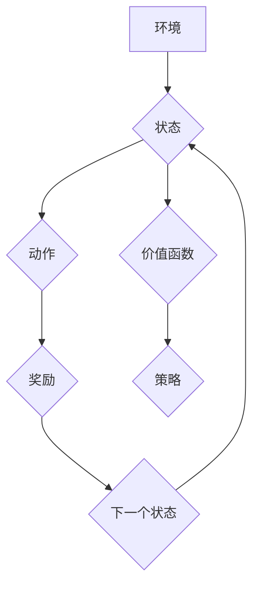

> Deep Q-Network (DQN), 可视化技术, 学习过程, 价值函数, 策略梯度, 强化学习, 算法可解释性

## 1. 背景介绍

在机器学习领域，强化学习 (Reinforcement Learning, RL) 作为一种模仿人类学习的智能算法，近年来取得了显著的进展。其中，Deep Q-Network (DQN) 作为一种深度强化学习算法，在解决复杂决策问题方面展现出强大的能力，例如游戏 AI、机器人控制等。然而，DQN 的学习过程往往是复杂的，难以直观地理解其决策机制和学习策略。

可视化技术作为一种有效的信息表达方式，能够帮助我们更好地理解和分析复杂系统。将 DQN 的学习过程可视化，可以让我们更直观地观察其价值函数的更新、策略的迭代以及学习过程中的关键信息，从而加深对 DQN 算法的理解，并为算法改进和应用提供新的思路。

## 2. 核心概念与联系

DQN 算法的核心思想是利用深度神经网络来逼近价值函数，并通过 Q-learning 算法进行策略迭代。

**价值函数 (Value Function)**：

价值函数用来评估一个状态在特定策略下的期望回报。DQN 中常用的价值函数是 Q-函数，它表示从当前状态采取某个动作后，在后续状态下获得的期望回报。

**Q-learning 算法**:

Q-learning 是一种基于价值函数的强化学习算法，通过不断地更新 Q-函数来学习最优策略。其核心思想是根据经验，更新 Q-函数的值，使得 Q-函数能够逼近最优价值函数。

**策略 (Policy)**：

策略决定了在给定状态下采取哪个动作。DQN 中的策略是基于 Q-函数学习的，即选择 Q-函数值最大的动作。

**Mermaid 流程图**:



## 3. 核心算法原理 & 具体操作步骤

### 3.1  算法原理概述

DQN 算法的核心是利用深度神经网络来逼近 Q-函数，并通过 Q-learning 算法进行策略迭代。具体步骤如下：

1. **初始化**: 初始化 Q-网络参数，并设置学习率、折扣因子等超参数。
2. **环境交互**: 与环境交互，获取当前状态、采取动作、获得奖励和下一个状态。
3. **经验回放**: 将 (状态, 动作, 奖励, 下一个状态) 存储到经验回放缓冲池中。
4. **目标 Q-值计算**: 使用目标网络 (与主网络参数不同) 计算目标 Q-值，即最大化 Q-函数值。
5. **Q-网络更新**: 使用梯度下降算法更新主网络参数，使得 Q-网络的预测值与目标 Q-值之间的误差最小化。
6. **目标网络更新**: 定期更新目标网络的参数，使其与主网络参数保持一致。

### 3.2  算法步骤详解

1. **初始化**: 

   - 创建一个深度神经网络，作为 Q-网络，其输入为状态，输出为每个动作对应的 Q-值。
   - 初始化 Q-网络的参数，可以使用随机初始化或预训练模型。
   - 设置学习率、折扣因子等超参数。

2. **环境交互**:

   - 与环境交互，获取当前状态。
   - 根据当前状态和策略，选择一个动作。
   - 执行动作，获得奖励和下一个状态。

3. **经验回放**:

   - 将 (状态, 动作, 奖励, 下一个状态) 存储到经验回放缓冲池中。
   - 经验回放缓冲池可以存储大量的历史经验，并随机采样经验进行训练，从而提高训练效率和稳定性。

4. **目标 Q-值计算**:

   - 使用目标网络计算目标 Q-值，即最大化 Q-函数值。
   - 目标网络的参数与主网络参数不同，用于计算目标 Q-值，避免过拟合。

5. **Q-网络更新**:

   - 使用梯度下降算法更新主网络参数，使得 Q-网络的预测值与目标 Q-值之间的误差最小化。
   - 损失函数通常使用均方误差 (MSE) 或 Huber 损失函数。

6. **目标网络更新**:

   - 定期更新目标网络的参数，使其与主网络参数保持一致。
   - 目标网络更新频率通常设置为固定的时间间隔或训练次数。

### 3.3  算法优缺点

**优点**:

- 能够处理高维状态空间。
- 能够学习复杂的策略。
- 训练效率较高。

**缺点**:

- 容易出现过拟合问题。
- 需要大量的训练数据。
- 训练过程比较复杂。

### 3.4  算法应用领域

DQN 算法在以下领域具有广泛的应用:

- 游戏 AI
- 机器人控制
- 自动驾驶
- 医疗诊断
- 金融投资

## 4. 数学模型和公式 & 详细讲解 & 举例说明

### 4.1  数学模型构建

DQN 算法的核心是 Q-函数，它表示从当前状态采取某个动作后，在后续状态下获得的期望回报。

**Q-函数定义**:

$$
Q(s, a) = E[\sum_{t=0}^{\infty} \gamma^t r_{t+1} | s_t = s, a_t = a]
$$

其中:

- $s$ 表示当前状态。
- $a$ 表示采取的动作。
- $r_{t+1}$ 表示在下一个状态 $s_{t+1}$ 获得的奖励。
- $\gamma$ 表示折扣因子，控制未来奖励的权重。
- $E$ 表示期望值。

### 4.2  公式推导过程

DQN 算法利用深度神经网络来逼近 Q-函数，并通过 Q-learning 算法进行策略迭代。

**Q-learning 更新规则**:

$$
Q(s, a) \leftarrow Q(s, a) + \alpha [r_{t+1} + \gamma \max_{a'} Q(s', a') - Q(s, a)]
$$

其中:

- $\alpha$ 表示学习率，控制学习步长。
- $s'$ 表示下一个状态。
- $a'$ 表示在下一个状态 $s'$ 中采取的动作。

### 4.3  案例分析与讲解

假设我们有一个简单的游戏环境，其中玩家可以选择向上、向下、向左、向右四个动作。

- 状态 $s$ 表示玩家当前的位置。
- 动作 $a$ 表示玩家采取的动作。
- 奖励 $r_{t+1}$ 表示玩家在下一个状态获得的奖励，例如获得金币奖励或碰撞障碍物惩罚。

DQN 算法可以学习到每个状态下采取不同动作的 Q-值，从而选择最优策略。例如，如果玩家在某个状态下，向上移动的 Q-值最高，则 DQN 算法会建议玩家向上移动。

## 5. 项目实践：代码实例和详细解释说明

### 5.1  开发环境搭建

- Python 3.x
- TensorFlow 或 PyTorch 深度学习框架
- OpenAI Gym 游戏环境

### 5.2  源代码详细实现

```python
import tensorflow as tf
import numpy as np
from tensorflow.keras.models import Sequential
from tensorflow.keras.layers import Dense

# 定义 DQN 网络结构
class DQN(tf.keras.Model):
    def __init__(self):
        super(DQN, self).__init__()
        self.dense1 = Dense(64, activation='relu')
        self.dense2 = Dense(64, activation='relu')
        self.dense3 = Dense(4, activation='linear')  # 4 个动作

    def call(self, x):
        x = self.dense1(x)
        x = self.dense2(x)
        x = self.dense3(x)
        return x

# 初始化 DQN 网络
dqn = DQN()

# 定义损失函数和优化器
loss_fn = tf.keras.losses.MeanSquaredError()
optimizer = tf.keras.optimizers.Adam(learning_rate=0.001)

# 训练 DQN 网络
for episode in range(100):
    # ... 环境交互和经验回放 ...
    # 计算目标 Q 值
    target_q_values = target_network(next_states)
    # 更新 DQN 网络参数
    with tf.GradientTape() as tape:
        q_values = dqn(states)
        loss = loss_fn(q_values, target_q_values)
    gradients = tape.gradient(loss, dqn.trainable_variables)
    optimizer.apply_gradients(zip(gradients, dqn.trainable_variables))
```

### 5.3  代码解读与分析

- 代码首先定义了 DQN 网络结构，使用三个全连接层构成。
- 然后初始化 DQN 网络，并定义损失函数和优化器。
- 训练循环中，首先与环境交互，获取经验数据。
- 然后计算目标 Q 值，并使用梯度下降算法更新 DQN 网络参数。

### 5.4  运行结果展示

训练完成后，可以评估 DQN 算法的性能，例如在游戏环境中获得的得分。

## 6. 实际应用场景

DQN 算法在以下领域具有广泛的应用:

### 6.1  游戏 AI

DQN 算法可以用于训练游戏 AI，使其能够学习玩游戏并取得高分。例如，AlphaGo 使用 DQN 算法战胜了世界围棋冠军。

### 6.2  机器人控制

DQN 算法可以用于训练机器人控制策略，使其能够在复杂环境中完成任务。例如，使用 DQN 算法训练机器人进行导航、抓取和搬运等操作。

### 6.3  自动驾驶

DQN 算法可以用于训练自动驾驶系统，使其能够在复杂道路环境中安全驾驶。例如，使用 DQN 算法训练自动驾驶汽车进行路径规划、避障和决策等操作。

### 6.4  未来应用展望

DQN 算法在未来将有更广泛的应用，例如:

- 个性化推荐系统
- 金融投资策略
- 医疗诊断辅助系统

## 7. 工具和资源推荐

### 7.1  学习资源推荐

- 深度强化学习: 强化学习算法与应用 (Sutton & Barto)
- Deep Reinforcement Learning Hands-On (Maxim Lapan)
- OpenAI Gym: https://gym.openai.com/

### 7.2  开发工具推荐

- TensorFlow: https://www.tensorflow.org/
- PyTorch: https://pytorch.org/

### 7.3  相关论文推荐

- Deep Q-Network (Mnih et al., 2015)
- Dueling Network Architectures for Deep Reinforcement Learning (Wang et al., 2015)
- Prioritized Experience Replay (Schaul et al., 2015)

## 8. 总结：未来发展趋势与挑战

### 8.1  研究成果总结

DQN 算法取得了显著的成果，在解决复杂决策问题方面展现出强大的能力。

### 8.2  未来发展趋势

- 探索更有效的强化学习算法，例如基于模型的强化学习 (Model-Based RL)。
- 研究更鲁棒的强化学习算法，能够应对更复杂和不确定性环境。
- 将强化学习与其他机器学习技术结合，例如迁移学习和联邦学习。

### 8.3  面临的挑战

- 强化学习算法的训练效率仍然较低。
- 强化学习算法的解释性和可解释性仍然不足。
- 强化学习算法在现实世界中的应用仍然面临挑战。

### 8.4  研究展望

未来，强化学习领域将继续朝着更智能、更安全、更可解释的方向发展。


## 9. 附录：常见