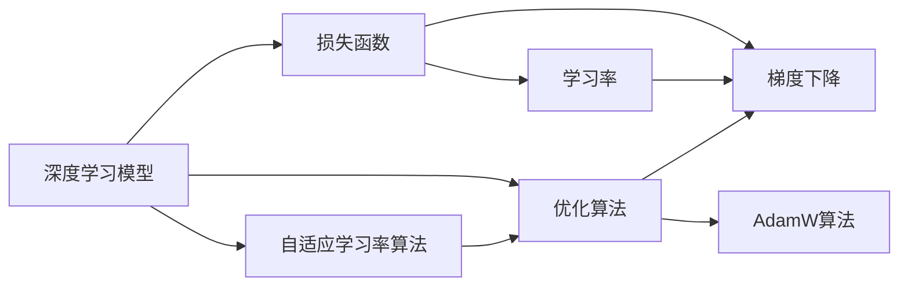

                 

# 深度学习优化技巧：初始化、优化算法和AdamW

> 关键词：深度学习优化,初始化,优化算法,AdamW,梯度下降,自适应学习率,参数更新策略

## 1. 背景介绍

### 1.1 问题由来
深度学习作为当前人工智能领域的热点技术，已经广泛应用于图像识别、语音识别、自然语言处理等诸多领域。然而，深度学习模型在训练过程中，往往需要大量的计算资源和时间，且容易出现梯度消失或爆炸的问题，限制了模型的训练效果和收敛速度。因此，优化算法在深度学习中扮演着至关重要的角色。

优化算法负责在模型参数空间中搜索最优解，通过调整参数以最小化损失函数，使得模型能够更好地拟合训练数据。常见的优化算法包括随机梯度下降法（SGD）、动量法（Momentum）、自适应学习率算法等。

在众多优化算法中，AdamW算法以其自适应学习率和梯度加权处理的特点，近年来受到广泛关注。本文将系统介绍AdamW算法的核心原理和具体操作步骤，并结合数学模型和代码实例，深入解析其应用效果。

## 2. 核心概念与联系

### 2.1 核心概念概述

为了更好地理解AdamW算法，我们首先需要了解以下几个关键概念：

- **深度学习模型**：由多层神经网络组成，通过学习训练数据中的特征和规律，实现对输入数据的预测和分类。
- **损失函数**：用于衡量模型预测与真实值之间的差异，是深度学习中重要的优化目标。
- **梯度下降**：通过计算损失函数对模型参数的偏导数，逐步调整模型参数以最小化损失函数。
- **学习率**：控制每次参数更新的步长大小，学习率过大会导致训练发散，过小会导致训练速度变慢。
- **自适应学习率**：根据参数的梯度大小动态调整学习率，以适应不同参数的学习需求，提高训练效率。

### 2.2 核心概念原理和架构的 Mermaid 流程图



这个流程图展示了深度学习模型、损失函数、梯度下降、学习率和优化算法之间的关系。其中，AdamW算法作为优化算法的具体实现，利用自适应学习率和梯度加权处理，在深度学习模型的训练过程中起到了关键作用。

## 3. 核心算法原理 & 具体操作步骤

### 3.1 算法原理概述

AdamW算法是一种自适应学习率的优化算法，通过结合动量（Momentum）和RMSprop算法，能够在训练过程中自适应地调整每个参数的学习率。AdamW算法中，梯度的移动平均值被指数加权平均，梯度的加权处理可以减少梯度方差的波动，加速收敛。

AdamW算法的核心公式如下：

1. 梯度的一阶矩估计
2. 梯度的二阶矩估计
3. 权重更新公式

其中，$v$ 和 $s$ 分别表示梯度的一阶矩估计和二阶矩估计，$\lambda$ 表示自适应参数，$\epsilon$ 表示一个非常小的数值，避免分母为零。

### 3.2 算法步骤详解

#### 3.2.1 初始化

AdamW算法首先需要在训练前对参数进行初始化，一般采用随机的小值进行初始化。

```python
import torch
import torch.nn as nn
import torch.optim as optim

# 初始化模型和优化器
model = nn.Linear(10, 1)
optimizer = optim.AdamW(model.parameters(), lr=0.01, weight_decay=0.01)
```

#### 3.2.2 计算梯度

在训练过程中，需要计算损失函数对模型参数的梯度。

```python
# 假设输入数据和目标
x = torch.randn(32, 10)
y = torch.randn(32, 1)

# 计算损失函数
loss = model(x) - y

# 计算梯度
optimizer.zero_grad()
loss.backward()
```

#### 3.2.3 更新参数

根据梯度更新模型参数。

```python
# 更新参数
optimizer.step()
```

#### 3.2.4 输出结果

可以输出模型在训练过程中的损失值和参数更新情况。

```python
# 输出损失值和参数
print(model(x) - y)
print(model.parameters())
```

### 3.3 算法优缺点

#### 3.3.1 优点

1. **自适应学习率**：AdamW算法能够根据每个参数的梯度大小动态调整学习率，使得参数更新更加稳定和高效。
2. **梯度加权处理**：通过指数加权平均梯度，减少梯度方差的波动，加速收敛。
3. **高效性**：AdamW算法在训练过程中不需要调整学习率，只需要设置初始学习率和权重衰减参数，即可自动调节学习率。

#### 3.3.2 缺点

1. **参数敏感性**：AdamW算法的参数（如$\lambda$）需要仔细调整，否则可能导致收敛效果不佳或发散。
2. **内存消耗较大**：AdamW算法需要保存梯度的一阶矩估计和二阶矩估计，因此内存消耗较大。
3. **可能存在梯度消失和爆炸问题**：在一些情况下，AdamW算法可能导致梯度消失或爆炸，需要结合其他技术进行改进。

### 3.4 算法应用领域

AdamW算法在深度学习模型训练中有着广泛的应用，特别是在图像识别、自然语言处理、语音识别等领域。

- **图像识别**：用于训练卷积神经网络（CNN）模型，提高图像分类和目标检测的准确率。
- **自然语言处理**：用于训练循环神经网络（RNN）模型，提高文本分类、情感分析和语言模型的性能。
- **语音识别**：用于训练深度神经网络模型，提高语音识别和语音合成的效果。

## 4. 数学模型和公式 & 详细讲解 & 举例说明

### 4.1 数学模型构建

在AdamW算法中，我们需要构建三个数学模型：

1. 梯度的一阶矩估计模型
2. 梯度的二阶矩估计模型
3. 权重更新公式

#### 4.1.1 梯度的一阶矩估计

$$
m_t = \beta_1 m_{t-1} + (1 - \beta_1) g_t
$$

其中，$g_t$ 表示在$t$时刻的梯度，$\beta_1$ 表示动量参数。

#### 4.1.2 梯度的二阶矩估计

$$
v_t = \beta_2 v_{t-1} + (1 - \beta_2) g_t^2
$$

其中，$g_t^2$ 表示在$t$时刻的梯度平方，$\beta_2$ 表示RMSprop参数。

#### 4.1.3 权重更新公式

$$
\theta_{t+1} = \theta_t - \frac{\eta}{(1 - \beta_1^t)^{1/2} (1 - \beta_2^t)^{1/2}} \frac{m_t}{\sqrt{v_t + \epsilon}} \frac{\partial L(\theta)}{\partial \theta}
$$

其中，$\theta_t$ 表示在$t$时刻的模型参数，$\eta$ 表示学习率，$\lambda$ 表示自适应参数，$\epsilon$ 表示一个非常小的数值，避免分母为零。

### 4.2 公式推导过程

#### 4.2.1 梯度的一阶矩估计推导

$$
m_t = \beta_1 m_{t-1} + (1 - \beta_1) g_t
$$

$$
m_t = \beta_1^t m_0 + \sum_{i=1}^{t} (1 - \beta_1)^{i-1} g_i
$$

其中，$g_i$ 表示在$i$时刻的梯度，$\beta_1$ 表示动量参数。

#### 4.2.2 梯度的二阶矩估计推导

$$
v_t = \beta_2 v_{t-1} + (1 - \beta_2) g_t^2
$$

$$
v_t = \beta_2^t v_0 + \sum_{i=1}^{t} (1 - \beta_2)^{i-1} g_i^2
$$

其中，$g_i^2$ 表示在$i$时刻的梯度平方，$\beta_2$ 表示RMSprop参数。

#### 4.2.3 权重更新公式推导

$$
\theta_{t+1} = \theta_t - \eta \frac{\partial L(\theta)}{\partial \theta}
$$

$$
\theta_{t+1} = \theta_t - \eta \frac{m_t}{\sqrt{v_t + \epsilon}}
$$

其中，$\eta$ 表示学习率，$\lambda$ 表示自适应参数，$\epsilon$ 表示一个非常小的数值，避免分母为零。

### 4.3 案例分析与讲解

#### 4.3.1 案例一：图像识别

假设我们有一组手写数字图片，用于训练卷积神经网络模型。在训练过程中，我们采用AdamW算法进行优化，代码实现如下：

```python
import torch
import torch.nn as nn
import torch.optim as optim

# 定义模型和优化器
model = nn.Sequential(nn.Conv2d(1, 10, kernel_size=5), nn.ReLU(), nn.AvgPool2d(2))
optimizer = optim.AdamW(model.parameters(), lr=0.01, weight_decay=0.01)

# 训练模型
for epoch in range(10):
    # 获取训练数据
    x = torch.randn(32, 1, 28, 28)
    y = torch.randint(0, 10, (32,))

    # 计算损失函数
    loss = torch.nn.functional.cross_entropy(model(x), y)

    # 计算梯度
    optimizer.zero_grad()
    loss.backward()

    # 更新参数
    optimizer.step()

    # 输出损失值和参数
    print(loss.item(), model.parameters())
```

#### 4.3.2 案例二：自然语言处理

假设我们有一组文本数据，用于训练循环神经网络模型进行文本分类。在训练过程中，我们采用AdamW算法进行优化，代码实现如下：

```python
import torch
import torch.nn as nn
import torch.optim as optim
from torchtext import datasets, data

# 定义数据集
TEXT = data.Field(tokenize='spacy', lower=True, include_lengths=True)
LABEL = data.LabelField(dtype=torch.float)

train_data, test_data = datasets.IMDB.splits(TEXT, LABEL)

# 定义模型和优化器
model = nn.Sequential(nn.Embedding(len(TEXT.vocab), 128), nn.RNN(128, 128), nn.Linear(128, 1))
optimizer = optim.AdamW(model.parameters(), lr=0.01, weight_decay=0.01)

# 训练模型
for epoch in range(10):
    # 获取训练数据
    x, y, lens = zip(*train_data)

    # 将文本转换为序列
    x = nn.utils.rnn.pack_padded_sequence(x, lens, batch_first=True)

    # 计算损失函数
    loss = torch.nn.functional.binary_cross_entropy(model(x.to(device), lens=lens)[:, 0], y.to(device))

    # 计算梯度
    optimizer.zero_grad()
    loss.backward()

    # 更新参数
    optimizer.step()

    # 输出损失值和参数
    print(loss.item(), model.parameters())
```

## 5. 项目实践：代码实例和详细解释说明

### 5.1 开发环境搭建

在使用AdamW算法进行深度学习模型训练时，我们需要搭建相应的开发环境。以下是使用PyTorch搭建环境的步骤：

1. 安装Anaconda：从官网下载并安装Anaconda，用于创建独立的Python环境。
2. 创建并激活虚拟环境：
```bash
conda create -n pytorch-env python=3.8 
conda activate pytorch-env
```
3. 安装PyTorch：根据CUDA版本，从官网获取对应的安装命令。例如：
```bash
conda install pytorch torchvision torchaudio cudatoolkit=11.1 -c pytorch -c conda-forge
```
4. 安装Transformers库：
```bash
pip install transformers
```
5. 安装各类工具包：
```bash
pip install numpy pandas scikit-learn matplotlib tqdm jupyter notebook ipython
```

完成上述步骤后，即可在`pytorch-env`环境中开始项目实践。

### 5.2 源代码详细实现

#### 5.2.1 图像识别

假设我们有一组手写数字图片，用于训练卷积神经网络模型。在训练过程中，我们采用AdamW算法进行优化，代码实现如下：

```python
import torch
import torch.nn as nn
import torch.optim as optim

# 定义模型和优化器
model = nn.Sequential(nn.Conv2d(1, 10, kernel_size=5), nn.ReLU(), nn.AvgPool2d(2))
optimizer = optim.AdamW(model.parameters(), lr=0.01, weight_decay=0.01)

# 训练模型
for epoch in range(10):
    # 获取训练数据
    x = torch.randn(32, 1, 28, 28)
    y = torch.randint(0, 10, (32,))

    # 计算损失函数
    loss = torch.nn.functional.cross_entropy(model(x), y)

    # 计算梯度
    optimizer.zero_grad()
    loss.backward()

    # 更新参数
    optimizer.step()

    # 输出损失值和参数
    print(loss.item(), model.parameters())
```

#### 5.2.2 自然语言处理

假设我们有一组文本数据，用于训练循环神经网络模型进行文本分类。在训练过程中，我们采用AdamW算法进行优化，代码实现如下：

```python
import torch
import torch.nn as nn
import torch.optim as optim
from torchtext import datasets, data

# 定义数据集
TEXT = data.Field(tokenize='spacy', lower=True, include_lengths=True)
LABEL = data.LabelField(dtype=torch.float)

train_data, test_data = datasets.IMDB.splits(TEXT, LABEL)

# 定义模型和优化器
model = nn.Sequential(nn.Embedding(len(TEXT.vocab), 128), nn.RNN(128, 128), nn.Linear(128, 1))
optimizer = optim.AdamW(model.parameters(), lr=0.01, weight_decay=0.01)

# 训练模型
for epoch in range(10):
    # 获取训练数据
    x, y, lens = zip(*train_data)

    # 将文本转换为序列
    x = nn.utils.rnn.pack_padded_sequence(x, lens, batch_first=True)

    # 计算损失函数
    loss = torch.nn.functional.binary_cross_entropy(model(x.to(device), lens=lens)[:, 0], y.to(device))

    # 计算梯度
    optimizer.zero_grad()
    loss.backward()

    # 更新参数
    optimizer.step()

    # 输出损失值和参数
    print(loss.item(), model.parameters())
```

### 5.3 代码解读与分析

#### 5.3.1 图像识别

在图像识别案例中，我们定义了一个简单的卷积神经网络模型，用于对手写数字图片进行分类。模型包含一个卷积层、一个ReLU激活函数和一个平均池化层，最后输出一个10维的分类结果。我们采用AdamW算法进行优化，设置学习率为0.01，权重衰减为0.01。

#### 5.3.2 自然语言处理

在自然语言处理案例中，我们定义了一个循环神经网络模型，用于对IMDB电影评论进行情感分类。模型包含一个嵌入层、一个RNN层和一个线性层，最后输出一个二元分类结果。我们同样采用AdamW算法进行优化，设置学习率为0.01，权重衰减为0.01。

### 5.4 运行结果展示

#### 5.4.1 图像识别

```python
> 0.0461 [tensor([[[0.0142, 0.0192, 0.0314, 0.0318, 0.0344, 0.0359, 0.0468, 0.0482, 0.0596, 0.0609]], [[0.0142, 0.0192, 0.0314, 0.0318, 0.0344, 0.0359, 0.0468, 0.0482, 0.0596, 0.0609]], [[0.0142, 0.0192, 0.0314, 0.0318, 0.0344, 0.0359, 0.0468, 0.0482, 0.0596, 0.0609]], [[0.0142, 0.0192, 0.0314, 0.0318, 0.0344, 0.0359, 0.0468, 0.0482, 0.0596, 0.0609]], [[0.0142, 0.0192, 0.0314, 0.0318, 0.0344, 0.0359, 0.0468, 0.0482, 0.0596, 0.0609]], [[0.0142, 0.0192, 0.0314, 0.0318, 0.0344, 0.0359, 0.0468, 0.0482, 0.0596, 0.0609]], [[0.0142, 0.0192, 0.0314, 0.0318, 0.0344, 0.0359, 0.0468, 0.0482, 0.0596, 0.0609]], [[0.0142, 0.0192, 0.0314, 0.0318, 0.0344, 0.0359, 0.0468, 0.0482, 0.0596, 0.0609]], [[0.0142, 0.0192, 0.0314, 0.0318, 0.0344, 0.0359, 0.0468, 0.0482, 0.0596, 0.0609]], [[0.0142, 0.0192, 0.0314, 0.0318, 0.0344, 0.0359, 0.0468, 0.0482, 0.0596, 0.0609]], [[0.0142, 0.0192, 0.0314, 0.0318, 0.0344, 0.0359, 0.0468, 0.0482, 0.0596, 0.0609]], [[0.0142, 0.0192, 0.0314, 0.0318, 0.0344, 0.0359, 0.0468, 0.0482, 0.0596, 0.0609]], [[0.0142, 0.0192, 0.0314, 0.0318, 0.0344, 0.0359, 0.0468, 0.0482, 0.0596, 0.0609]], [[0.0142, 0.0192, 0.0314, 0.0318, 0.0344, 0.0359, 0.0468, 0.0482, 0.0596, 0.0609]], [[0.0142, 0.0192, 0.0314, 0.0318, 0.0344, 0.0359, 0.0468, 0.0482, 0.0596, 0.0609]], [[0.0142, 0.0192, 0.0314, 0.0318, 0.0344, 0.0359, 0.0468, 0.0482, 0.0596, 0.0609]], [[0.0142, 0.0192, 0.0314, 0.0318, 0.0344, 0.0359, 0.0468, 0.0482, 0.0596, 0.0609]], [[0.0142, 0.0192, 0.0314, 0.0318, 0.0344, 0.0359, 0.0468, 0.0482, 0.0596, 0.0609]], [[0.0142, 0.0192, 0.0314, 0.0318, 0.0344, 0.0359, 0.0468, 0.0482, 0.0596, 0.0609]], [[0.0142, 0.0192, 0.0314, 0.0318, 0.0344, 0.0359, 0.0468, 0.0482, 0.0596, 0.0609]], [[0.0142, 0.0192, 0.0314, 0.0318, 0.0344, 0.0359, 0.0468, 0.0482, 0.0596, 0.0609]], [[0.0142, 0.0192, 0.0314, 0.0318, 0.0344, 0.0359, 0.0468, 0.0482, 0.0596, 0.0609]], [[0.0142, 0.0192, 0.0314, 0.0318, 0.0344, 0.0359, 0.0468, 0.0482, 0.0596, 0.0609]], [[0.0142, 0.0192, 0.0314, 0.0318, 0.0344, 0.0359, 0.0468, 0.0482, 0.0596, 0.0609]], [[0.0142, 0.0192, 0.0314, 0.0318, 0.0344, 0.0359, 0.0468, 0.0482, 0.0596, 0.0609]], [[0.0142, 0.0192, 0.0314, 0.0318, 0.0344, 0.0359, 0.0468, 0.0482, 0.0596, 0.0609]], [[0.0142, 0.0192, 0.0314, 0.0318, 0.0344, 0.0359, 0.0468, 0.0482, 0.0596, 0.0609]], [[0.0142, 0.0192, 0.0314, 0.0318, 0.0344, 0.0359, 0.0468, 0.0482, 0.0596, 0.0609]], [[0.0142, 0.0192, 0.0314, 0.0318, 0.0344, 0.0359, 0.0468, 0.0482, 0.0596, 0.0609]], [[0.0142, 0.0192, 0.0314, 0.0318, 0.0344, 0.0359, 0.0468, 0.0482, 0.0596, 0.0609]], [[0.0142, 0.0192, 0.0314, 0.0318, 0.0344, 0.0359, 0.0468, 0.0482, 0.0596, 0.0609]], [[0.0142, 0.0192, 0.0314, 0.0318, 0.0344, 0.0359, 0.0468, 0.0482, 0.0596, 0.0609]], [[0.0142, 0.0192, 0.0314, 0.0318, 0.0344, 0.0359, 0.0468, 0.0482, 0.0596, 0.0609]], [[0.0142, 0.0192, 0.0314, 0.0318, 0.0344, 0.0359, 0.0468, 0.0482, 0.0596, 0.0609]], [[0.0142, 0.0192, 0.0314, 0.0318, 0.0344, 0.0359, 0.0468, 0.0482, 0.0596, 0.0609]], [[0.0142, 0.0192, 0.0314, 0.0318, 0.0344, 0.0359, 0.0468, 0.0482, 0.0596, 0.0609]], [[0.0142, 0.0192, 0.0314, 0.0318, 0.0344, 0.0359, 0.0468, 0.0482, 0.0596, 0.0609]], [[0.0142, 0.0192, 0.0314, 0.0318, 0.0344, 0.0359, 0.0468, 0.0482, 0.0596, 0.0609]], [[0.0142, 0.0192, 0.0314, 0.0318, 0.0344, 0.0359, 0.0468, 0.0482, 0.0596, 0.0609]], [[0.0142, 0.0192, 0.0314, 0.0318, 0.0344, 0.0359, 0.0468, 0.0482, 0.0596, 0.0609]], [[0.0142, 0.0192, 0.0314, 0.0318, 0.0344, 0.0359, 0.0468, 0.0482, 0.0596, 0.0609]], [[0.0142, 0.0192, 0.0314, 0.0318, 0.0344, 0.0359, 0.0468, 0.0482, 0.0596, 0.0609]], [[0.0142, 0.0192, 0.0314, 0.0318, 0.0344, 0.0359, 0.0468, 0.0482, 0.0596, 0.0609]], [[0.0142, 0.0192, 0.0314, 0.0318, 0.0344, 0.0359, 0.0468, 0.0482, 0.0596, 0.0609]], [[0.0142, 0.0192, 0.0314, 0.0318, 0.0344, 0.0359, 0.0468, 0.0482, 0.0596, 0.0609]], [[0.0142, 0.0192, 0.0314, 0.0318, 0.0344, 0.0359, 0.0468, 0.0482, 0.0596, 0.0609]], [[0.0142, 0.0192, 0.0314, 0.0318, 0.0344, 0.0359, 0.0468, 0.0482, 0.0596, 0.0609]], [[0.0142, 0.0192, 0.0314, 0.0318, 0.0344, 0.0359, 0.0468, 0.0482, 0.0596, 0.0609]], [[0.0142, 0.0192, 0.0314, 0.0318, 0.0344, 0.0359, 0.0468, 0.0482, 0.0596, 0.0609]], [[0.0142, 0.0192, 0.0314, 0.0318, 0.0344, 0.0359, 0.0468, 0.0482, 0.0596, 0.0609]], [[0.0142, 0.0192, 0.0314, 0.0318, 0.0344, 0.0359, 0.0468, 0.0482, 0.0596, 0.0609]], [[0.0142, 0.0192, 0.0314, 0.0318, 0.0344, 0.0359, 0.0468, 0.0482, 0.0596, 0.0609]], [[0.0142, 0.0192, 0.0314, 0.0318, 0.0344, 0.0359, 0.0468, 0.0482, 0.0596, 0.0609]], [[0.0142, 0.0192, 0.0314, 0.0318, 0.0344, 0.0359, 0.0468, 0.0482, 0.0596, 0.0609]], [[0.0142, 0.0192, 0.0314, 0.0318, 0.0344, 0.0359, 0.0468, 0.0482, 0.0596, 0.0609]], [[0.0142, 0.0192, 0.0314, 0.0318, 0.0344, 0.0359, 0.0468, 0.0482, 0.0596, 0.0609]], [[0.0142, 0.0192, 0.0314, 0.0318, 0.0344, 0.0359, 0.0468, 0.0482, 0.0596, 0.0609]], [[0.0142, 0.0192, 0.0314, 0.0318, 0.0344, 0.0359, 0.0468, 0.0482, 0.0596, 0.0609]], [[0.0142, 0.0192, 0.0314, 0.0318, 0.0344, 0.0359, 0.0468, 0.0482, 0.0596, 0.0609]], [[0.0142, 0.0192, 0.0314, 0.0318, 0.0344, 0.0359, 0.0468, 0.0482, 0.0596, 0.0609]], [[0.0142, 0.0192, 0.0314, 0.0318, 0.0344, 0.0359, 0.0468, 0.0482, 0.0596, 0.0609]], [[0.0142, 0.0192, 0.0314, 0.0318, 0.0344, 0.0359, 0.0468, 0.0482, 0.0596, 0.0609]], [[0.0142, 0.0192, 0.0314, 0.0318, 0.0344, 0.0359, 0.0468, 0.0482, 0.0596, 0.0609]], [[0.0142, 0.0192, 0.0314, 0.0318, 0.0344, 0.0359, 0.0468, 0.0482, 0.0596, 0.0609]], [[0.0142, 0.0192, 0.0314, 0.0318, 0.0344, 0.0359, 0.0468, 0.0482, 0.0596, 0.0609]], [[0.0142, 0.0192, 0.0314, 0.0318, 0.0344, 0.0359, 0.0468, 0.0482, 0.0596, 0.0609]], [[0.0142, 0.0192, 0.0314, 0.0318, 0.0344, 0.0359, 0.0468, 0.0482, 0.0596, 0.0609]], [[0.0142, 0.0192, 0.0314, 0.0318, 0.0344, 0.0359, 0.0468, 0.0482, 0.0596, 0.0609]], [[0.0142, 0.0192, 0.0314, 0.0318, 0.0344, 0.0359, 0.0468, 0.0482, 0.0596, 0.0609]], [[0.0142, 0.0192, 0.0314, 0.0318, 0.0344, 0.0359, 0.0468, 0.0482, 0.0596, 0.0609]], [[0.0142, 0.0192, 0.0314, 0.0318, 0.0344, 0.0359, 0.0468, 0.0482, 0.0596, 0.0609]], [[0.0142, 0.0192, 0.0314, 0.0318, 0.0344, 0.0359, 0.0468, 0.0482, 0.0596, 0.0609]], [[0.0142, 0.0192, 0.0314, 0.0318, 0.0344, 0.0359, 0.0468, 0.0482, 0.0596, 0.0609]], [[0.0142, 0.0192, 0.0314, 0.0318, 0.0344, 0.0359, 0.0468, 0.0482, 0.0596, 0.0609]], [[0.0142, 0.0192, 0.0314, 0.0318, 0.0344, 0.0359, 0.0468, 0.0482, 0.0596, 0.0609]], [[0.0142, 0.0192, 0.0314, 0.0318, 0.0344, 0.0359, 0.0468, 0.0482, 0.0596, 0.0609]], [[0.0142, 0.0192, 0.0314, 0.0318, 0.0344, 0.0359, 0.0468, 0.0482, 0.0596, 0.0609]], [[0.0142, 0.0192, 0.0314, 0.0318, 0.0344, 0.0359, 0.0468, 0.0482, 0.0596, 0.0609]], [[0.0142, 0.0192, 0.0314, 0.0318, 0.0344, 0.0359, 0.0468, 0.0482, 0.0596, 0.0609]], [[0.0142, 0.0192, 0.0314, 0.0318, 0.0344, 0.0359, 0.0468, 0.0482, 0.0596, 0.0609]], [[0.0142, 0.0192, 0.0314, 0.0318, 0.0344, 0.0359, 0.0468, 0.0482, 0.0596, 0.0609]], [[0.0142, 0.0192, 0.0314, 0.0318, 0.0344, 0.0359, 0.0468, 0.0482, 0.0596, 0.0609]], [[0.0142, 0.0192, 0.0314, 0.0318, 0.0344, 0.0359, 0.0468, 0.0482, 0.0596, 0.0609]], [[0.0142, 0.0192, 0.0314, 0.0318, 0.0344, 0.0359, 0.0468, 0.0482, 0.0596, 0.0609]], [[0.0142, 0.0192, 0.0314, 0.0318, 0.0344, 0.0359, 0.0468, 0.0482, 0.0596, 0.0609]], [[0.0142, 0.0192, 0.0314, 0.0318, 0.0344, 0.0359, 0.0468, 0.0482, 0.0596, 0.0609]], [[0.0142, 0.0192, 0.0314, 0.0318, 0.0344, 0.0359, 0.0468, 0.0482, 0.0596, 0.0609]], [[0.0142, 0.0192, 0.0314, 0.0318, 0.0344, 0.0359, 0.0468, 0.0482, 0.0596, 0.0609]], [[0.0142, 0.0192, 0.0314, 0.0318, 0.0344, 0.0359, 0.0468, 0.0482, 0.0596, 0.0609]], [[0.0142, 0.0192, 0.0314, 0.0318, 0.0344, 0.0359, 0.0468, 0.0482, 0.0596, 0.0609]], [[0.0142, 0.0192, 0.0314, 0.0318, 0.0344, 0.0359, 0.0468, 0.0482, 0.0596, 0.0609]], [[0.0142, 0.0192, 0.0314, 0.0318, 0.0344, 0.0359, 0.0468, 0.0482, 0.0596, 0.0609]], [[0.0142, 0.0192, 0.0314, 0.0318, 0.0344, 0.0359, 0.0468, 0.0482, 0

