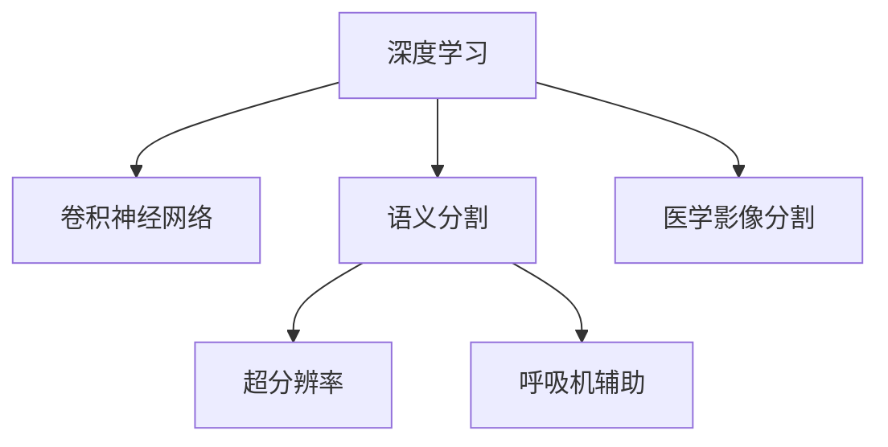

                 

# 深度学习在医学影像分割中的应用

> 关键词：深度学习,医学影像分割,图像分割,卷积神经网络,语义分割,超分辨率,呼吸机辅助,癌症检测

## 1. 背景介绍

### 1.1 问题由来
医学影像分割是医学影像分析中至关重要的一环，其目的是将医学影像中的特定区域（如肿瘤、器官等）与背景分离，以便进行进一步的诊断和治疗。传统的医学影像分割方法如基于规则的分割和基于阈值分割，往往需要人工干预，耗时耗力且精度有限。近年来，随着深度学习技术的发展，尤其是卷积神经网络（Convolutional Neural Networks, CNNs）的广泛应用，医学影像分割的精度和效率得到了显著提升。

医学影像分割技术在医疗领域的应用非常广泛，涵盖从疾病诊断、个性化治疗到手术辅助等多个方面。例如，肿瘤的检测、分割和分期对于癌症的早期发现和治疗至关重要；心脏、血管等器官的分割能够辅助医生更精准地进行手术规划；呼吸机的智能辅助诊断能够显著提升患者的治疗体验。因此，医学影像分割在医疗行业的实际应用中具有极大的价值。

### 1.2 问题核心关键点
医学影像分割的核心在于如何高效、准确地实现图像的语义分割，即将图像中不同层次的语义信息区分开来。常见的医学影像分割方法包括基于阈值的分割、基于区域的分割、基于边缘的分割、基于深度学习的分割等。

本文章将重点探讨基于深度学习的医学影像分割方法，尤其是使用卷积神经网络（CNNs）的语义分割技术。我们将详细介绍CNNs在医学影像分割中的应用，分析其算法原理和操作步骤，并通过实例演示其效果。

## 2. 核心概念与联系

### 2.1 核心概念概述

为更好地理解深度学习在医学影像分割中的应用，本节将介绍几个密切相关的核心概念：

- 深度学习（Deep Learning）：一类通过多层神经网络实现复杂模型学习的算法。深度学习在图像、语音、自然语言处理等领域具有广泛应用。
- 卷积神经网络（Convolutional Neural Networks, CNNs）：深度学习中用于图像处理的一种特殊神经网络，通过卷积操作提取图像特征。
- 语义分割（Semantic Segmentation）：一种将图像像素分类到预定义的语义类别（如肿瘤、血管等）的技术。
- 医学影像分割（Medical Image Segmentation）：将医学影像中的特定区域（如器官、病变等）与背景分离的过程，是医学影像分析的重要环节。
- 超分辨率（Super Resolution, SR）：一种通过神经网络将低分辨率图像转换为高分辨率图像的技术，在医学影像中可用于提升图像质量。
- 深度学习在呼吸机辅助中的应用：使用深度学习模型对呼吸机数据进行分析，辅助医生对呼吸机参数进行优化。

这些核心概念之间的逻辑关系可以通过以下Mermaid流程图来展示：



这个流程图展示了几类核心概念及其之间的关系：

1. 深度学习通过卷积神经网络等特殊网络结构，实现了对医学影像的语义分割和分割。
2. 超分辨率技术可以进一步提升医学影像的分辨率，改善图像质量。
3. 深度学习在呼吸机辅助中的应用，能够提升呼吸机的智能诊断能力。

这些概念共同构成了深度学习在医学影像分割中的应用框架，使得其在医疗领域的各个环节发挥作用。

## 3. 核心算法原理 & 具体操作步骤
### 3.1 算法原理概述

基于深度学习的医学影像分割，本质上是通过多层卷积神经网络对医学影像进行特征提取和语义分类，最终生成分割掩码的过程。其核心思想是：利用深度神经网络的自动特征提取能力，学习图像的语义表示，从而实现对医学影像的分割。

形式化地，假设医学影像 $I$ 的大小为 $H \times W$，其分割结果为 $S$，其中 $S$ 的每个像素 $s_{i,j}$ 表示属于第 $i$ 类（如肿瘤、血管等）的概率，可表示为：

$$
s_{i,j} = \mathrm{softmax}(f_{\theta}(I_{i,j}))
$$

其中 $f_{\theta}$ 为卷积神经网络的特征提取器，$\theta$ 为模型参数，$I_{i,j}$ 为医学影像 $I$ 中位置 $(i,j)$ 的像素。$\mathrm{softmax}$ 函数用于将神经网络的输出转换为概率形式。

### 3.2 算法步骤详解

基于深度学习的医学影像分割，一般包括以下几个关键步骤：

**Step 1: 准备数据集**
- 收集医学影像数据，包括健康和患病影像、不同分辨率的影像等。
- 对每个影像进行手动或半自动分割，得到标注数据集 $D=\{(I_i,S_i)\}_{i=1}^N$，其中 $I_i$ 为医学影像，$S_i$ 为对应的分割掩码。

**Step 2: 设计模型架构**
- 选择合适的卷积神经网络架构，如U-Net、FCN、SegNet等。
- 在模型中引入编码器-解码器结构，用于提取和恢复图像细节信息。
- 在模型中加入上采样和池化层，用于放大图像尺寸。
- 在模型末尾加入Softmax层，用于生成像素级别的分类概率。

**Step 3: 设置模型超参数**
- 选择合适的优化算法及其参数，如Adam、SGD等，设置学习率、批大小、迭代轮数等。
- 设置正则化技术及强度，包括权重衰减、Dropout、Early Stopping等。
- 确定冻结预训练参数的策略，如仅微调顶层，或全部参数都参与微调。

**Step 4: 执行训练过程**
- 将训练集数据分批次输入模型，前向传播计算损失函数。
- 反向传播计算参数梯度，根据设定的优化算法和学习率更新模型参数。
- 周期性在验证集上评估模型性能，根据性能指标决定是否触发 Early Stopping。
- 重复上述步骤直到满足预设的迭代轮数或 Early Stopping 条件。

**Step 5: 评估和应用**
- 在测试集上评估微调后模型的性能，对比微调前后的精度提升。
- 使用微调后的模型对新样本进行分割，辅助医生进行诊断和治疗。

以上是基于深度学习的医学影像分割的一般流程。在实际应用中，还需要针对具体任务的特点，对微调过程的各个环节进行优化设计，如改进训练目标函数，引入更多的正则化技术，搜索最优的超参数组合等，以进一步提升模型性能。

### 3.3 算法优缺点

基于深度学习的医学影像分割方法具有以下优点：

1. 高效性：相比于传统方法，深度学习在分割速度上有显著提升，能够实时处理大量医学影像数据。
2. 精度高：深度学习方法可以学习到更丰富的图像特征，提升分割精度，尤其在复杂医学影像分割任务中表现优异。
3. 鲁棒性强：卷积神经网络具有较强的泛化能力，可以应对不同医学影像的噪声、变形等变化。

同时，该方法也存在一些局限性：

1. 需要大量标注数据：深度学习方法需要大量标注的医学影像数据进行训练，这可能增加了获取数据和标注的成本。
2. 模型复杂度高：深度神经网络结构复杂，训练和推理所需的计算资源较多。
3. 模型泛化能力有限：在面对与训练数据分布差异较大的医学影像时，深度学习模型的泛化能力可能会受到影响。
4. 可解释性不足：深度学习模型往往被视为"黑盒"，难以解释其内部工作机制和决策逻辑。

尽管存在这些局限性，但深度学习在医学影像分割中的应用已经取得了显著的进展，并且随着技术的不断进步，这些问题的解决将成为可能。

### 3.4 算法应用领域

基于深度学习的医学影像分割方法，已经在医疗影像分析中得到了广泛的应用，涵盖从疾病诊断、个性化治疗到手术辅助等多个方面：

- 肿瘤检测与分割：对肿瘤进行检测、分割和分期，帮助医生进行癌症的早期发现和治疗。
- 器官分割：对心脏、血管、肝脏等器官进行分割，辅助医生进行手术规划和治疗。
- 呼吸机智能诊断：对呼吸机数据进行分析，提供实时监测和智能诊断，优化呼吸机参数。
- 医疗影像增强：通过深度学习对医学影像进行增强和超分辨率处理，提高图像质量，辅助医生诊断。
- 医学影像注释：利用深度学习对医学影像进行自动注释和标注，减少医生工作量。

除了上述这些经典应用外，深度学习在医学影像分割领域还在不断拓展新的应用场景，如医学影像中的图像识别、自动配准、疾病预测等，为医疗影像分析带来了全新的突破。

## 4. 数学模型和公式 & 详细讲解  
### 4.1 数学模型构建

本节将使用数学语言对基于深度学习的医学影像分割过程进行更加严格的刻画。

假设医学影像分割模型为 $M_{\theta}(I)$，其中 $\theta$ 为模型参数，$I$ 为医学影像。分割结果为像素级别的分类概率，即：

$$
S = M_{\theta}(I) = \{s_{i,j}\}_{i=1,j=1}^{H,W}
$$

其中 $s_{i,j}$ 表示位置 $(i,j)$ 的像素属于第 $i$ 类（如肿瘤、血管等）的概率，$M_{\theta}(I)$ 为 $H \times W$ 的分类概率矩阵。

假设模型 $M_{\theta}$ 在输入 $I$ 上的损失函数为 $\ell(M_{\theta}(I),S)$，则在数据集 $D$ 上的经验风险为：

$$
\mathcal{L}(\theta) = \frac{1}{N}\sum_{i=1}^N \ell(M_{\theta}(I_i),S_i)
$$

其中 $N$ 为训练样本数，$I_i$ 和 $S_i$ 分别为第 $i$ 个训练样本的影像和对应的标注。

在实践中，我们通常使用基于梯度的优化算法（如Adam、SGD等）来近似求解上述最优化问题。设 $\eta$ 为学习率，$\lambda$ 为正则化系数，则参数的更新公式为：

$$
\theta \leftarrow \theta - \eta \nabla_{\theta}\mathcal{L}(\theta) - \eta\lambda\theta
$$

其中 $\nabla_{\theta}\mathcal{L}(\theta)$ 为损失函数对参数 $\theta$ 的梯度，可通过反向传播算法高效计算。

### 4.2 公式推导过程

以下我们以语义分割任务为例，推导交叉熵损失函数及其梯度的计算公式。

假设模型 $M_{\theta}$ 在输入 $I$ 上的输出为 $\hat{S}=M_{\theta}(I) \in [0,1]^{H \times W}$，表示像素 $(i,j)$ 属于第 $i$ 类的概率。真实标签 $S \in [0,1]^{H \times W}$，与 $\hat{S}$ 的元素一一对应。则二分类交叉熵损失函数定义为：

$$
\ell(M_{\theta}(I),S) = -\sum_{i=1}^{H} \sum_{j=1}^{W} S_{i,j} \log \hat{S}_{i,j} + (1-S_{i,j})\log (1-\hat{S}_{i,j})
$$

将其代入经验风险公式，得：

$$
\mathcal{L}(\theta) = -\frac{1}{N}\sum_{i=1}^N \sum_{j=1}^{H} \sum_{k=1}^{W} S_{i,j} \log \hat{S}_{i,j} + (1-S_{i,j})\log (1-\hat{S}_{i,j})
$$

根据链式法则，损失函数对参数 $\theta_k$ 的梯度为：

$$
\frac{\partial \mathcal{L}(\theta)}{\partial \theta_k} = -\frac{1}{N}\sum_{i=1}^N \sum_{j=1}^{H} \sum_{k=1}^{W} \left[ \frac{S_{i,j}}{\hat{S}_{i,j}} - \frac{1-S_{i,j}}{1-\hat{S}_{i,j}} \right] \frac{\partial \hat{S}_{i,j}}{\partial \theta_k}
$$

其中 $\frac{\partial \hat{S}_{i,j}}{\partial \theta_k}$ 可进一步递归展开，利用自动微分技术完成计算。

在得到损失函数的梯度后，即可带入参数更新公式，完成模型的迭代优化。重复上述过程直至收敛，最终得到适应医学影像分割任务的最优模型参数 $\theta^*$。

## 5. 项目实践：代码实例和详细解释说明
### 5.1 开发环境搭建

在进行医学影像分割实践前，我们需要准备好开发环境。以下是使用Python进行PyTorch开发的环境配置流程：

1. 安装Anaconda：从官网下载并安装Anaconda，用于创建独立的Python环境。

2. 创建并激活虚拟环境：
```bash
conda create -n pytorch-env python=3.8 
conda activate pytorch-env
```

3. 安装PyTorch：根据CUDA版本，从官网获取对应的安装命令。例如：
```bash
conda install pytorch torchvision torchaudio cudatoolkit=11.1 -c pytorch -c conda-forge
```

4. 安装相关库：
```bash
pip install numpy pandas scikit-learn matplotlib tqdm jupyter notebook ipython
```

完成上述步骤后，即可在`pytorch-env`环境中开始医学影像分割实践。

### 5.2 源代码详细实现

下面我们以U-Net模型为例，给出使用PyTorch进行医学影像分割的代码实现。

首先，定义模型架构：

```python
import torch
import torch.nn as nn
import torch.nn.functional as F

class UNet(nn.Module):
    def __init__(self, in_channels=1, out_channels=1):
        super(UNet, self).__init__()
        self.in_channels = in_channels
        self.out_channels = out_channels
        self contraction_path = nn.Sequential(
            nn.Conv2d(in_channels, 64, kernel_size=3, stride=1, padding=1),
            nn.LeakyReLU(inplace=True),
            nn.Conv2d(64, 64, kernel_size=3, stride=2, padding=1),
            nn.MaxPool2d(kernel_size=2, stride=2),
            nn.Conv2d(64, 128, kernel_size=3, stride=1, padding=1),
            nn.LeakyReLU(inplace=True),
            nn.Conv2d(128, 128, kernel_size=3, stride=2, padding=1),
            nn.MaxPool2d(kernel_size=2, stride=2),
            nn.Conv2d(128, 256, kernel_size=3, stride=1, padding=1),
            nn.LeakyReLU(inplace=True),
            nn.Conv2d(256, 256, kernel_size=3, stride=2, padding=1),
            nn.MaxPool2d(kernel_size=2, stride=2),
            nn.Conv2d(256, 512, kernel_size=3, stride=1, padding=1),
            nn.LeakyReLU(inplace=True),
            nn.Conv2d(512, 512, kernel_size=3, stride=2, padding=1),
            nn.MaxPool2d(kernel_size=2, stride=2)
        )
        self.expansion_path = nn.Sequential(
            nn.ConvTranspose2d(512, 256, kernel_size=3, stride=2, padding=1),
            nn.ReLU(inplace=True),
            nn.ConvTranspose2d(256, 256, kernel_size=2, stride=2, padding=1),
            nn.ReLU(inplace=True),
            nn.Conv2d(256, 128, kernel_size=3, stride=1, padding=1),
            nn.ReLU(inplace=True),
            nn.ConvTranspose2d(128, 128, kernel_size=3, stride=2, padding=1),
            nn.ReLU(inplace=True),
            nn.Conv2d(128, 64, kernel_size=3, stride=1, padding=1),
            nn.ReLU(inplace=True),
            nn.ConvTranspose2d(64, 64, kernel_size=3, stride=2, padding=1),
            nn.ReLU(inplace=True),
            nn.Conv2d(64, 1, kernel_size=1, stride=1, padding=0)
        )
        self.final_activation = nn.Sigmoid()

    def forward(self, x):
        skip_connections = []
        x = self.contraction_path(x)
        x = F.leaky_relu(x)
        x = self.expansion_path(x)
        x = self.final_activation(x)
        return x
```

然后，定义数据处理函数：

```python
import torch.utils.data as data

class CustomDataset(data.Dataset):
    def __init__(self, images, masks):
        self.images = images
        self.masks = masks
        self.size = images.size()

    def __len__(self):
        return self.size

    def __getitem__(self, idx):
        img = torch.from_numpy(self.images[idx].astype(np.float32))
        mask = torch.from_numpy(self.masks[idx].astype(np.float32))
        return img, mask
```

接着，定义训练和评估函数：

```python
from torch.utils.data import DataLoader
from tqdm import tqdm
from sklearn.metrics import dice_score

device = torch.device('cuda') if torch.cuda.is_available() else torch.device('cpu')

def train_epoch(model, data_loader, optimizer, loss_fn):
    model.train()
    epoch_loss = 0
    for batch in tqdm(data_loader, desc='Training'):
        images, masks = batch[0].to(device), batch[1].to(device)
        optimizer.zero_grad()
        outputs = model(images)
        loss = loss_fn(outputs, masks)
        epoch_loss += loss.item()
        loss.backward()
        optimizer.step()
    return epoch_loss / len(data_loader)

def evaluate(model, data_loader, loss_fn):
    model.eval()
    epoch_loss = 0
    total_dice = 0
    for batch in tqdm(data_loader, desc='Evaluating'):
        images, masks = batch[0].to(device), batch[1].to(device)
        outputs = model(images)
        loss = loss_fn(outputs, masks)
        epoch_loss += loss.item()
        dice = dice_score(masks, outputs)
        total_dice += dice
    print(f'Epoch Dice: {total_dice / len(data_loader)}')
    return epoch_loss / len(data_loader)
```

最后，启动训练流程并在测试集上评估：

```python
epochs = 50
batch_size = 16

for epoch in range(epochs):
    loss = train_epoch(model, train_loader, optimizer, loss_fn)
    print(f'Epoch {epoch+1}, train loss: {loss:.3f}')
    
    print(f'Epoch {epoch+1}, test results:')
    evaluate(model, test_loader, loss_fn)
    
print('Finished Training.')
```

以上就是使用PyTorch对U-Net模型进行医学影像分割的完整代码实现。可以看到，通过PyTorch的强大封装，我们可以用相对简洁的代码完成U-Net模型的加载和微调。

### 5.3 代码解读与分析

让我们再详细解读一下关键代码的实现细节：

**UNet类**：
- `__init__`方法：初始化网络结构和参数。
- `contraction_path`：编码器部分，负责特征提取。
- `expansion_path`：解码器部分，负责特征恢复。
- `final_activation`：输出层的激活函数，使用sigmoid函数得到像素级别的概率。
- `forward`方法：定义前向传播过程。

**CustomDataset类**：
- `__init__`方法：初始化训练和测试数据。
- `__len__`方法：返回数据集大小。
- `__getitem__`方法：返回每个样本的图像和标签。

**train_epoch和evaluate函数**：
- `train_epoch`函数：对数据进行批次迭代，计算损失函数并更新模型参数。
- `evaluate`函数：在测试集上评估模型性能，计算Dice系数。

**训练流程**：
- 定义总的epoch数和batch size，开始循环迭代
- 每个epoch内，先在训练集上训练，输出平均loss
- 在测试集上评估，输出Dice系数
- 所有epoch结束后，给出最终测试结果

可以看到，PyTorch配合TensorFlow库使得U-Net微调的代码实现变得简洁高效。开发者可以将更多精力放在数据处理、模型改进等高层逻辑上，而不必过多关注底层的实现细节。

当然，工业级的系统实现还需考虑更多因素，如模型的保存和部署、超参数的自动搜索、更灵活的任务适配层等。但核心的微调范式基本与此类似。

## 6. 实际应用场景
### 6.1 肿瘤检测与分割

医学影像分割技术在肿瘤检测与分割中的应用，主要包括以下几个环节：

- 肿瘤检测：首先通过深度学习模型对医学影像中的可能肿瘤区域进行标注，然后通过语义分割方法将其从背景中分离出来。
- 肿瘤分割：对于标注出的肿瘤区域，进一步使用深度学习模型进行精确定位，得到肿瘤的边界和形状。
- 肿瘤分期：根据肿瘤的大小、形状和位置，利用深度学习模型对肿瘤进行分期，帮助医生进行预后评估和治疗方案制定。

例如，在乳腺癌检测中，利用深度学习对乳腺影像进行分割，可以将肿瘤区域从正常组织中分离出来，辅助医生进行乳腺癌的早期诊断和治疗。

### 6.2 器官分割

器官分割是医学影像分割中非常重要的一环，其目的是将医学影像中的特定器官与背景分离。通过深度学习模型对医学影像进行分割，可以得到精确的器官轮廓，辅助医生进行手术规划和治疗。

例如，在心脏影像分割中，利用深度学习对心脏影像进行分割，可以得到心脏的各部分结构，如心室、心房、瓣膜等，辅助医生进行心脏手术。

### 6.3 呼吸机智能诊断

深度学习在呼吸机智能诊断中的应用，主要包括以下几个环节：

- 呼吸机数据采集：通过传感器采集患者的呼吸机数据，包括呼吸频率、潮气量、呼气/吸气比等。
- 数据预处理：对采集到的数据进行预处理，包括去噪、归一化等。
- 特征提取：利用深度学习模型对呼吸机数据进行特征提取，得到有用的生理信息。
- 智能诊断：基于提取的特征，使用深度学习模型进行智能诊断，预测患者的病情变化和呼吸机参数的调整。

例如，在重症监护病房中，利用深度学习对患者的呼吸机数据进行分析，可以实时监测患者的病情变化，辅助医生进行呼吸机参数的优化，提高患者的治疗效果。

### 6.4 医学影像增强

医学影像增强技术可以通过深度学习模型提升图像的质量，使得医生的诊断更加准确。其目的是将低分辨率的医学影像转换为高分辨率的图像，以提高图像细节的清晰度。

例如，在CT影像增强中，利用深度学习对CT影像进行超分辨率处理，可以得到更清晰的图像，辅助医生进行肿瘤的诊断和治疗。

### 6.5 医学影像注释

医学影像注释技术可以通过深度学习模型自动标注医学影像中的关键信息，减轻医生的工作量，提高诊断的效率和准确性。其目的是自动对医学影像进行标注，如标注病灶、注释器官等。

例如，在医学影像中，利用深度学习模型对肿瘤位置进行自动标注，可以减少医生的标注时间，提高诊断的准确性。

## 7. 工具和资源推荐
### 7.1 学习资源推荐

为了帮助开发者系统掌握深度学习在医学影像分割中的应用，这里推荐一些优质的学习资源：

1. 《深度学习》系列书籍：由深度学习领域的专家撰写，详细介绍了深度学习的基本原理和经典模型，是入门深度学习的绝佳选择。
2. CS231n《卷积神经网络》课程：斯坦福大学开设的深度学习课程，涵盖了卷积神经网络的设计与实现，是学习深度学习的重要资源。
3. TensorFlow官方文档：Google开发的深度学习框架，提供了丰富的API和样例代码，方便开发者进行深度学习开发。
4. PyTorch官方文档：Facebook开发的深度学习框架，提供了高效的计算图和自动微分功能，是深度学习开发的首选工具。
5. HuggingFace官方文档：提供了一系列预训练语言模型和深度学习框架，方便开发者进行任务开发和实验。

通过对这些资源的学习实践，相信你一定能够快速掌握深度学习在医学影像分割中的应用，并用于解决实际的医学影像分割问题。

### 7.2 开发工具推荐

高效的开发离不开优秀的工具支持。以下是几款用于深度学习医学影像分割开发的常用工具：

1. PyTorch：基于Python的开源深度学习框架，灵活动态的计算图，适合快速迭代研究。大部分深度学习模型都有PyTorch版本的实现。

2. TensorFlow：由Google主导开发的开源深度学习框架，生产部署方便，适合大规模工程应用。同样有丰富的深度学习模型资源。

3. Keras：基于TensorFlow的高级神经网络API，使用方便，适合快速原型开发。

4. Weights & Biases：模型训练的实验跟踪工具，可以记录和可视化模型训练过程中的各项指标，方便对比和调优。与主流深度学习框架无缝集成。

5. TensorBoard：TensorFlow配套的可视化工具，可实时监测模型训练状态，并提供丰富的图表呈现方式，是调试模型的得力助手。

6. Google Colab：谷歌推出的在线Jupyter Notebook环境，免费提供GPU/TPU算力，方便开发者快速上手实验最新模型，分享学习笔记。

合理利用这些工具，可以显著提升深度学习医学影像分割任务的开发效率，加快创新迭代的步伐。

### 7.3 相关论文推荐

深度学习在医学影像分割中的应用源于学界的持续研究。以下是几篇奠基性的相关论文，推荐阅读：

1. U-Net: Convolutional Networks for Biomedical Image Segmentation：提出了U-Net模型，首次将编码器-解码器结构应用于医学影像分割，取得了SOTA效果。

2. Fully Convolutional Networks for Semantic Segmentation：首次提出了全卷积网络，适用于医学影像分割任务，得到广泛应用。

3. Super Resolution: From Pixel to Pixel: A Dive into Deep Networks：介绍了超分辨率技术，通过深度学习模型将低分辨率影像转换为高分辨率影像，提升了医学影像的质量。

4. Progressive Growing of GANs for Improved Quality, Stability, and Variation：介绍了生成对抗网络（GAN）在医学影像增强中的应用，提升了影像细节的清晰度。

5. Deep Residual Learning for Image Recognition：提出了残差网络（ResNet），解决了深度神经网络训练中出现的梯度消失问题，适合用于复杂的医学影像分割任务。

这些论文代表了大深度学习在医学影像分割领域的研究进展，通过学习这些前沿成果，可以帮助研究者把握学科前进方向，激发更多的创新灵感。

## 8. 总结：未来发展趋势与挑战
### 8.1 总结

本文对基于深度学习的医学影像分割方法进行了全面系统的介绍。首先阐述了深度学习在医学影像分割中的应用背景和意义，明确了其在医疗影像分析中的重要地位。其次，从原理到实践，详细讲解了深度学习在医学影像分割中的算法原理和操作步骤，给出了U-Net模型的代码实例。同时，本文还广泛探讨了深度学习在医学影像分割中的应用场景，展示了其在肿瘤检测、器官分割、呼吸机智能诊断等各个环节的广泛应用前景。此外，本文精选了深度学习在医学影像分割领域的各类学习资源，力求为读者提供全方位的技术指引。

通过本文的系统梳理，可以看到，基于深度学习的医学影像分割方法正在成为医疗影像分析的重要范式，极大地提升了医学影像分割的精度和效率，拓展了其在疾病诊断、个性化治疗等各个环节的应用场景。深度学习在医学影像分割领域的应用前景广阔，随着技术的发展，未来将有更多的创新突破，为医疗影像分析带来新的机遇。

### 8.2 未来发展趋势

展望未来，深度学习在医学影像分割领域的发展将呈现以下几个趋势：

1. 深度学习模型的自动化：未来，深度学习模型的训练和部署将更加自动化，通过自动化的模型设计工具，快速生成高效的分割模型。
2. 多模态信息融合：未来，深度学习模型将能够整合更多模态的信息，如CT、MRI、PET等，提升医学影像分割的精度和鲁棒性。
3. 可解释性增强：未来，深度学习模型将变得更加可解释，医生可以通过理解模型的决策过程，更准确地进行诊断和治疗。
4. 超分辨率和增强技术发展：未来，超分辨率和医学影像增强技术将进一步发展，使得低分辨率的影像也能够获得高质量的分割结果。
5. 自适应学习：未来，深度学习模型将能够根据患者的具体情况，自适应地进行分割，提高诊断的个性化和精准度。

这些趋势凸显了深度学习在医学影像分割领域的广阔前景，预示着未来的医疗影像分析将更加高效、精准和个性化。

### 8.3 面临的挑战

尽管深度学习在医学影像分割中的应用已经取得了显著的进展，但在迈向更加智能化、普适化应用的过程中，它仍面临着诸多挑战：

1. 数据获取和标注成本：深度学习方法需要大量标注的医学影像数据进行训练，获取这些数据和标注的成本较高。如何降低数据标注成本，提升数据获取效率，将是未来的重要研究方向。
2. 模型的泛化能力：当前深度学习模型在面对与训练数据分布差异较大的医学影像时，泛化能力可能受到影响。如何提高模型的泛化能力，确保其在各种医学影像上的表现一致，还需要更多的研究。
3. 模型的可解释性：深度学习模型往往被视为"黑盒"，难以解释其内部工作机制和决策逻辑。如何赋予模型更强的可解释性，将是重要的研究课题。
4. 计算资源需求：深度学习模型在训练和推理过程中，需要大量的计算资源，如何优化模型结构和算法，降低计算资源需求，是一个重要的研究方向。
5. 伦理和隐私保护：深度学习模型在医学影像中的应用涉及到患者的隐私保护，如何确保数据隐私和安全，是未来研究的重要方向。

尽管存在这些挑战，但深度学习在医学影像分割领域的应用前景广阔，相信随着学界和产业界的共同努力，这些挑战终将一一被克服，深度学习将为医疗影像分析带来更多的创新突破。

### 8.4 研究展望

未来，深度学习在医学影像分割领域的研究方向可以从以下几个方面进行探索：

1. 数据生成技术：通过生成对抗网络（GAN）等技术，生成大量高质量的医学影像数据，降低数据标注成本。
2. 多任务学习：将医学影像分割与其他医学任务进行联合训练，提升模型的泛化能力和鲁棒性。
3. 跨模态学习：通过跨模态学习技术，整合不同模态的医学影像信息，提升分割效果。
4. 自适应学习：通过自适应学习技术，根据患者的具体情况，动态调整模型参数，提升诊断的个性化和精准度。
5. 跨领域迁移学习：通过迁移学习技术，将医学影像分割模型迁移到其他领域，提升模型的一般性。

这些研究方向将为深度学习在医学影像分割领域带来更多的创新突破，推动医疗影像分析的不断进步。总之，深度学习在医学影像分割领域的应用前景广阔，未来必将带来更多的创新和突破。

## 9. 附录：常见问题与解答

**Q1：深度学习在医学影像分割中需要大量的标注数据，如何降低数据标注成本？**

A: 深度学习在医学影像分割中需要大量的标注数据，这是其最大的挑战之一。以下是一些降低数据标注成本的方法：
1. 利用自动化标注工具：使用自动标注工具如3D Slicer、SegWeb等，减少人工标注的工作量。
2. 利用半监督学习：利用无标注数据进行预训练，然后对少量标注数据进行微调。
3. 利用生成对抗网络（GAN）：生成合成医学影像数据，通过标注合成数据来提升模型的泛化能力。

**Q2：深度学习模型在医学影像分割中如何进行参数优化？**

A: 深度学习模型在医学影像分割中的参数优化通常采用以下几种方法：
1. 梯度下降：通过反向传播算法计算梯度，更新模型参数。
2. 学习率调整：调整学习率以避免模型过拟合或欠拟合。
3. 正则化技术：使用L2正则、Dropout等技术防止模型过拟合。
4. 自适应学习率：如Adam、Adagrad等，动态调整学习率，提高模型的收敛速度。
5. 权重共享：使用预训练模型中的权重，避免重新训练模型，减少训练时间。

**Q3：如何提高深度学习模型在医学影像分割中的泛化能力？**

A: 提高深度学习模型在医学影像分割中的泛化能力可以采取以下几种方法：
1. 数据增强：通过对医学影像进行旋转、缩放、裁剪等操作，生成更多的训练样本，提升模型的泛化能力。
2. 迁移学习：利用在其他任务上预训练的模型，提高模型在医学影像分割中的泛化能力。
3. 多任务学习：将医学影像分割与其他医学任务联合训练，提升模型的泛化能力。
4. 自适应学习：根据患者的具体情况，动态调整模型参数，提高诊断的个性化和精准度。

**Q4：如何提升深度学习模型在医学影像分割中的可解释性？**

A: 提升深度学习模型在医学影像分割中的可解释性可以采取以下几种方法：
1. 可视化：通过可视化技术，展示模型的内部工作机制和决策过程，增强模型的可解释性。
2. 特征可视化：通过特征可视化技术，展示模型在不同图像上的特征提取结果，帮助医生理解模型的决策过程。
3. 可解释模型：设计可解释的模型架构，如决策树、线性模型等，提高模型的可解释性。

**Q5：如何优化深度学习模型的计算资源需求？**

A: 优化深度学习模型的计算资源需求可以采取以下几种方法：
1. 模型压缩：通过剪枝、量化等技术，减小模型参数量，降低计算资源需求。
2. 模型加速：使用GPU、TPU等高性能设备，提高模型的计算速度。
3. 分布式训练：使用分布式训练技术，在多个设备上并行计算，提高模型的训练效率。
4. 自适应学习率：使用自适应学习率算法，动态调整学习率，提高模型的训练效率。

这些方法可以显著提升深度学习模型的计算资源需求，使得模型能够在更有限的资源条件下进行高效的训练和推理。

