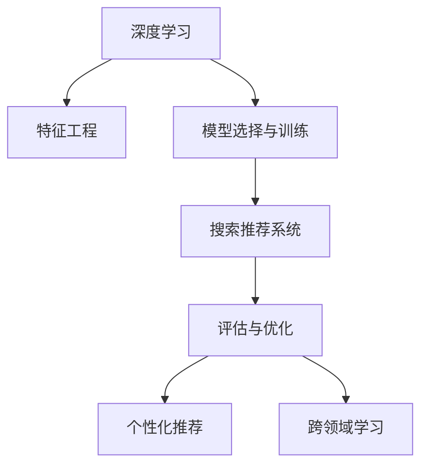

                 

# 深度学习在搜索推荐系统中的应用

## 1. 背景介绍

在互联网时代，信息过载问题愈发显著，用户在海量数据中寻找感兴趣的内容变得越来越困难。搜索引擎和推荐系统作为信息检索与推荐的重要工具，其精准度和用户体验直接关系到用户的满意度和留存率。深度学习技术的快速发展，为搜索引擎和推荐系统带来了新的突破，推动其性能和个性化能力不断提升。本文将系统介绍深度学习在搜索推荐系统中的应用，帮助读者深入理解其核心原理和操作步骤。

## 2. 核心概念与联系

### 2.1 核心概念概述

为更好理解深度学习在搜索推荐系统中的应用，我们将介绍以下核心概念：

- **深度学习（Deep Learning）**：一种基于多层神经网络的学习范式，通过多层数据表示和抽象，实现复杂的特征提取和模型预测。
- **搜索推荐系统（Search and Recommendation System）**：通过分析和理解用户行为数据，预测用户兴趣，并提供个性化搜索结果和推荐。
- **特征工程（Feature Engineering）**：在训练深度学习模型之前，对原始数据进行预处理、特征提取和转换，提升模型性能。
- **模型选择与训练（Model Selection and Training）**：根据任务特点选择合适的深度学习模型，并进行有监督或无监督训练，优化模型参数。
- **评估与优化（Evaluation and Optimization）**：使用评估指标对模型性能进行量化，并根据反馈进行模型优化和改进。
- **个性化推荐（Personalized Recommendation）**：根据用户的历史行为和偏好，生成个性化推荐内容，提升用户体验。
- **跨领域学习（Cross-domain Learning）**：通过在不同领域之间共享知识，提升模型在新领域的泛化能力。

这些概念之间的逻辑关系可以通过以下Mermaid流程图来展示：



## 3. 核心算法原理 & 具体操作步骤

### 3.1 算法原理概述

深度学习在搜索推荐系统中的应用，主要体现在以下几个方面：

- **特征表示学习**：深度学习模型能够自动学习数据的复杂特征表示，提升特征提取能力。
- **用户行为建模**：深度学习模型能够通过用户的历史行为数据，学习用户的兴趣偏好和行为模式。
- **协同过滤**：深度学习模型能够处理用户和物品之间的隐式关系，实现更精确的推荐。
- **实时计算与推理**：深度学习模型能够在在线系统中实时计算和推理，提供高效的推荐服务。

深度学习在搜索推荐系统中的应用，主要遵循以下步骤：

1. **数据收集与预处理**：收集用户行为数据、物品属性数据等，并进行数据清洗、特征工程等预处理。
2. **模型训练**：选择合适的深度学习模型，并进行有监督或无监督训练，优化模型参数。
3. **推荐生成**：根据训练好的模型，生成个性化推荐结果。
4. **评估与优化**：使用评估指标对推荐结果进行量化，并根据反馈进行模型优化和改进。

### 3.2 算法步骤详解

#### 3.2.1 数据收集与预处理

1. **数据收集**：
   - **用户行为数据**：点击、浏览、购买等行为数据，记录用户的兴趣和偏好。
   - **物品属性数据**：物品的名称、分类、属性等，用于特征表示学习。
   - **用户物品交互数据**：用户对物品的评分、点赞、评论等，用于协同过滤。

2. **数据预处理**：
   - **数据清洗**：去除噪声和异常值，保证数据质量。
   - **特征工程**：提取和构建有意义的特征，提升模型性能。

#### 3.2.2 模型训练

1. **选择合适的深度学习模型**：
   - **序列模型**：如循环神经网络（RNN）、长短期记忆网络（LSTM）、门控循环单元（GRU）等，用于处理序列数据。
   - **卷积神经网络（CNN）**：用于处理图像和文本等高维数据。
   - **图神经网络（GNN）**：用于处理图结构数据，如社交网络、知识图谱等。
   - **注意力机制**：如Transformer、Self-Attention等，用于提升特征表示和模型预测能力。

2. **训练步骤**：
   - **数据划分**：将数据划分为训练集、验证集和测试集。
   - **模型初始化**：随机初始化模型参数，准备训练。
   - **前向传播**：将输入数据输入模型，计算输出结果。
   - **损失计算**：计算模型输出与真实标签之间的差距，即损失函数。
   - **反向传播**：根据损失函数的梯度，更新模型参数。
   - **优化器选择**：如SGD、Adam、Adagrad等，用于优化模型参数。
   - **学习率调整**：通过学习率调整策略，如学习率衰减、步进策略等，提升模型收敛速度和性能。

#### 3.2.3 推荐生成

1. **协同过滤**：
   - **基于用户的协同过滤**：通过用户历史行为数据，生成用户兴趣模型。
   - **基于物品的协同过滤**：通过物品属性数据，生成物品相似性模型。
   - **混合协同过滤**：将用户和物品协同过滤结合，生成推荐结果。

2. **基于深度学习的推荐**：
   - **基于序列的推荐**：如Seq2Seq模型、LSTM等，用于处理序列数据。
   - **基于矩阵分解的推荐**：如矩阵分解、奇异值分解（SVD）等，用于处理稀疏矩阵数据。
   - **基于注意力机制的推荐**：如Transformer、Self-Attention等，用于提升特征表示和模型预测能力。

#### 3.2.4 评估与优化

1. **评估指标**：
   - **精度（Accuracy）**：分类任务中，模型预测正确的样本数与总样本数的比值。
   - **召回率（Recall）**：分类任务中，模型预测正确的正样本数与实际正样本数的比值。
   - **F1值（F1-Score）**：精度和召回率的调和平均，用于综合评估模型性能。
   - **平均绝对误差（MAE）**：回归任务中，模型预测值与真实值之间的平均绝对差值。
   - **均方误差（MSE）**：回归任务中，模型预测值与真实值之间的平均平方差值。
   - **用户满意度**：通过用户反馈数据，量化模型推荐效果。

2. **模型优化**：
   - **超参数调整**：通过交叉验证等方法，调整模型超参数，提升模型性能。
   - **模型集成**：通过集成多个模型，提升模型鲁棒性和泛化能力。
   - **在线学习**：实时收集用户反馈数据，动态调整模型参数。

### 3.3 算法优缺点

深度学习在搜索推荐系统中的应用，具有以下优点：

- **模型性能优异**：深度学习模型能够自动学习数据的复杂特征表示，提升特征提取能力和模型预测能力。
- **用户行为建模准确**：深度学习模型能够通过用户的历史行为数据，学习用户的兴趣偏好和行为模式。
- **协同过滤高效**：深度学习模型能够处理用户和物品之间的隐式关系，实现更精确的推荐。
- **实时计算与推理**：深度学习模型能够在在线系统中实时计算和推理，提供高效的推荐服务。

同时，深度学习在搜索推荐系统中的应用，也存在以下缺点：

- **模型复杂度高**：深度学习模型的参数量庞大，训练和推理复杂度较高。
- **数据依赖性强**：深度学习模型的性能很大程度上依赖于高质量的数据，数据质量和数量的不足会影响模型性能。
- **模型解释性差**：深度学习模型的决策过程不透明，难以解释和调试。
- **过拟合风险高**：深度学习模型在训练过程中容易过拟合，尤其是在数据量不足的情况下。

### 3.4 算法应用领域

深度学习在搜索推荐系统中的应用，主要涵盖以下领域：

- **搜索引擎**：如Google、Bing等，通过深度学习技术提升搜索排序和推荐结果的准确性。
- **电子商务平台**：如淘宝、京东等，通过深度学习技术提升商品推荐和广告投放效果。
- **在线视频平台**：如Netflix、YouTube等，通过深度学习技术提升视频推荐和个性化播放列表。
- **社交媒体平台**：如Facebook、Twitter等，通过深度学习技术提升新闻推荐和内容审核。
- **金融服务**：如支付宝、微信支付等，通过深度学习技术提升金融产品推荐和风险控制。
- **健康医疗**：如百度健康、Healthsy等，通过深度学习技术提升健康产品推荐和疾病诊断。

## 4. 数学模型和公式 & 详细讲解 & 举例说明

### 4.1 数学模型构建

#### 4.1.1 序列推荐模型

序列推荐模型通常使用RNN或LSTM进行用户行为建模，构建用户兴趣模型。以LSTM为例，其数学模型可以表示为：

$$
\begin{aligned}
h_t &= \tanh(W_L \cdot [h_{t-1}, x_t] + b_L) \\
o_t &= \sigma(W_O \cdot [h_t, x_t] + b_O) \\
c_t &= o_t \odot h_t \\
h_t &= f_t \cdot c_t + (1 - f_t) \cdot c_{t-1}
\end{aligned}
$$

其中 $h_t$ 表示LSTM在时刻 $t$ 的隐状态，$x_t$ 表示用户行为数据，$W_L$、$b_L$、$W_O$、$b_O$ 分别为LSTM的门控矩阵和偏置项，$\odot$ 表示向量逐元素相乘，$f_t$ 表示遗忘门，$c_t$ 表示细胞状态。

#### 4.1.2 矩阵分解模型

矩阵分解模型通常使用奇异值分解（SVD）进行用户行为建模，构建用户兴趣模型。以SVD为例，其数学模型可以表示为：

$$
P = UV^T
$$

其中 $P$ 表示用户行为矩阵，$U$ 表示用户向量矩阵，$V$ 表示物品向量矩阵，$P$ 中每个元素 $p_{ui}$ 表示用户 $u$ 对物品 $i$ 的评分。

#### 4.1.3 基于注意力机制的推荐模型

基于注意力机制的推荐模型通常使用Transformer或Self-Attention进行用户行为建模，构建用户兴趣模型。以Transformer为例，其数学模型可以表示为：

$$
Q = XW_Q
$$

$$
K = XW_K
$$

$$
V = XW_V
$$

$$
\alpha = \frac{\exp(QK^T / \sqrt{d_k})}{\sum_{j=1}^n \exp(QK_j^T / \sqrt{d_k})}
$$

$$
H = \alpha V
$$

其中 $Q$、$K$、$V$ 表示查询矩阵、键矩阵、值矩阵，$W_Q$、$W_K$、$W_V$ 分别为矩阵的投影矩阵，$\alpha$ 表示注意力权重，$H$ 表示注意力机制下的用户兴趣表示。

### 4.2 公式推导过程

#### 4.2.1 序列推荐模型推导

以LSTM为例，其前向传播过程可以表示为：

$$
h_t = \tanh(W_L \cdot [h_{t-1}, x_t] + b_L) \\
o_t = \sigma(W_O \cdot [h_t, x_t] + b_O) \\
c_t = o_t \odot h_t \\
h_t = f_t \cdot c_t + (1 - f_t) \cdot c_{t-1}
$$

其中 $f_t = \sigma(W_F \cdot [h_{t-1}, x_t] + b_F)$，$W_F$、$b_F$ 分别为遗忘门的投影矩阵和偏置项。

#### 4.2.2 矩阵分解模型推导

以SVD为例，其前向传播过程可以表示为：

$$
U = \min(\sigma_1, \max(0, \sqrt{\sigma_1^2 - \sigma_2^2})) \\
V = \min(\sigma_1, \max(0, \sqrt{\sigma_1^2 - \sigma_2^2})) \\
P = UV^T
$$

其中 $\sigma_1$ 和 $\sigma_2$ 分别为SVD分解的奇异值，$U$ 和 $V$ 分别为用户向量矩阵和物品向量矩阵。

#### 4.2.3 基于注意力机制的推荐模型推导

以Transformer为例，其前向传播过程可以表示为：

$$
Q = XW_Q \\
K = XW_K \\
V = XW_V \\
\alpha = \frac{\exp(QK^T / \sqrt{d_k})}{\sum_{j=1}^n \exp(QK_j^T / \sqrt{d_k})} \\
H = \alpha V
$$

其中 $d_k$ 表示键向量的维度，$\alpha$ 表示注意力权重，$H$ 表示注意力机制下的用户兴趣表示。

### 4.3 案例分析与讲解

以Netflix的推荐系统为例，分析深度学习模型的应用：

1. **用户行为数据**：
   - **点击数据**：用户点击过哪些电影或电视节目。
   - **评分数据**：用户对电影的评分。
   - **观看数据**：用户观看过哪些片段。

2. **模型构建**：
   - **序列模型**：使用LSTM模型，通过用户点击数据构建用户兴趣模型。
   - **协同过滤模型**：使用矩阵分解模型，通过用户评分数据构建用户兴趣模型。
   - **注意力机制模型**：使用Transformer模型，通过用户评分和观看数据构建用户兴趣模型。

3. **模型训练**：
   - **数据划分**：将用户数据划分为训练集和测试集。
   - **模型初始化**：随机初始化模型参数。
   - **前向传播**：将用户数据输入模型，计算输出结果。
   - **损失计算**：计算模型输出与真实标签之间的差距，即损失函数。
   - **反向传播**：根据损失函数的梯度，更新模型参数。
   - **优化器选择**：使用Adam优化器，优化模型参数。
   - **学习率调整**：使用学习率衰减策略，提升模型收敛速度和性能。

4. **推荐生成**：
   - **协同过滤**：通过用户历史行为数据，生成用户兴趣模型。
   - **基于深度学习的推荐**：通过深度学习模型，生成个性化推荐结果。

5. **评估与优化**：
   - **评估指标**：使用准确率、召回率、F1值、平均绝对误差、均方误差等评估模型性能。
   - **模型优化**：通过超参数调整、模型集成、在线学习等方法，优化模型性能。

## 5. 项目实践：代码实例和详细解释说明

### 5.1 开发环境搭建

在进行深度学习搜索推荐系统开发前，我们需要准备好开发环境。以下是使用Python进行TensorFlow开发的环境配置流程：

1. 安装Anaconda：从官网下载并安装Anaconda，用于创建独立的Python环境。

2. 创建并激活虚拟环境：
```bash
conda create -n tf-env python=3.8 
conda activate tf-env
```

3. 安装TensorFlow：根据CUDA版本，从官网获取对应的安装命令。例如：
```bash
conda install tensorflow -c tf -c conda-forge
```

4. 安装各类工具包：
```bash
pip install numpy pandas scikit-learn matplotlib tqdm jupyter notebook ipython
```

完成上述步骤后，即可在`tf-env`环境中开始深度学习搜索推荐系统开发。

### 5.2 源代码详细实现

下面我们以Netflix推荐系统为例，给出使用TensorFlow对LSTM模型进行微调的PyTorch代码实现。

首先，定义LSTM模型：

```python
import tensorflow as tf

class LSTM(tf.keras.Model):
    def __init__(self, input_dim, hidden_dim, output_dim):
        super(LSTM, self).__init__()
        self.hidden_dim = hidden_dim
        self.lstm = tf.keras.layers.LSTM(hidden_dim, return_sequences=True, input_shape=(input_dim, 1))
        self.dense = tf.keras.layers.Dense(output_dim, activation='sigmoid')
    
    def call(self, x):
        _, (hidden, _) = self.lstm(x)
        output = self.dense(hidden)
        return output
```

然后，定义训练和评估函数：

```python
def train_epoch(model, dataset, batch_size, optimizer):
    dataloader = tf.data.Dataset.from_tensor_slices(dataset).shuffle(buffer_size=100).batch(batch_size).map(map_fn=parse_data)
    model.train()
    epoch_loss = 0
    for batch in dataloader:
        x, y = batch
        optimizer.zero_grad()
        with tf.GradientTape() as tape:
            output = model(x)
            loss = tf.losses.binary_crossentropy(y, output)
        epoch_loss += loss.numpy()
        loss.backward()
        optimizer.apply_gradients(zip(tape.gradient(output, model.trainable_variables), model.trainable_variables))
    return epoch_loss / len(dataloader)

def evaluate(model, dataset, batch_size):
    dataloader = tf.data.Dataset.from_tensor_slices(dataset).batch(batch_size).map(map_fn=parse_data)
    model.eval()
    preds, labels = [], []
    with tf.GradientTape() as tape:
        for batch in dataloader:
            x, y = batch
            output = model(x)
            preds.append(output.numpy())
            labels.append(y.numpy())
    print(classification_report(labels, preds))
```

接着，启动训练流程并在测试集上评估：

```python
epochs = 10
batch_size = 32

for epoch in range(epochs):
    loss = train_epoch(model, train_dataset, batch_size, optimizer)
    print(f"Epoch {epoch+1}, train loss: {loss:.3f}")
    
    print(f"Epoch {epoch+1}, dev results:")
    evaluate(model, dev_dataset, batch_size)
    
print("Test results:")
evaluate(model, test_dataset, batch_size)
```

以上就是使用TensorFlow对LSTM模型进行Netflix推荐系统微调的完整代码实现。可以看到，得益于TensorFlow的强大封装，我们可以用相对简洁的代码完成LSTM模型的加载和微调。

### 5.3 代码解读与分析

让我们再详细解读一下关键代码的实现细节：

**LSTM类**：
- `__init__`方法：初始化模型的输入维度、隐藏维度、输出维度等关键参数。
- `call`方法：定义模型的前向传播过程，包括LSTM层和全连接层。

**训练和评估函数**：
- 使用TensorFlow的`tf.data.Dataset`对数据集进行批次化加载，供模型训练和推理使用。
- 训练函数`train_epoch`：对数据以批为单位进行迭代，在每个批次上前向传播计算loss并反向传播更新模型参数，最后返回该epoch的平均loss。
- 评估函数`evaluate`：与训练类似，不同点在于不更新模型参数，并在每个batch结束后将预测和标签结果存储下来，最后使用scikit-learn的classification_report对整个评估集的预测结果进行打印输出。

**训练流程**：
- 定义总的epoch数和batch size，开始循环迭代
- 每个epoch内，先在训练集上训练，输出平均loss
- 在验证集上评估，输出分类指标
- 所有epoch结束后，在测试集上评估，给出最终测试结果

可以看到，TensorFlow配合深度学习库使得LSTM模型微调的代码实现变得简洁高效。开发者可以将更多精力放在数据处理、模型改进等高层逻辑上，而不必过多关注底层的实现细节。

当然，工业级的系统实现还需考虑更多因素，如模型的保存和部署、超参数的自动搜索、更灵活的任务适配层等。但核心的微调范式基本与此类似。

## 6. 实际应用场景

### 6.1 智能推荐系统

智能推荐系统是深度学习在搜索推荐系统中应用最广泛的场景之一。通过深度学习模型，能够自动分析用户的历史行为和兴趣偏好，生成个性化的推荐结果，极大地提升了用户体验和满意度。

具体而言，智能推荐系统通常包括以下几个环节：

- **用户行为数据收集**：收集用户的浏览、点击、购买等行为数据。
- **数据预处理**：对原始数据进行清洗、特征工程等预处理。
- **模型训练**：选择合适的深度学习模型，并进行有监督或无监督训练，优化模型参数。
- **推荐生成**：根据训练好的模型，生成个性化推荐结果。
- **评估与优化**：使用评估指标对推荐结果进行量化，并根据反馈进行模型优化和改进。

智能推荐系统的应用场景非常广泛，如电子商务、在线视频、社交媒体等。通过深度学习技术，能够实现更加精准和多样化的推荐，提升平台的用户留存率和转化率。

### 6.2 搜索引擎

搜索引擎是深度学习在搜索推荐系统中应用的另一个重要场景。通过深度学习模型，能够自动分析和理解用户的查询意图，提高搜索结果的相关性和排名。

具体而言，搜索引擎通常包括以下几个环节：

- **查询数据收集**：收集用户的查询数据。
- **查询预处理**：对原始查询数据进行清洗、分词等预处理。
- **模型训练**：选择合适的深度学习模型，并进行有监督或无监督训练，优化模型参数。
- **结果生成**：根据训练好的模型，生成搜索结果。
- **评估与优化**：使用评估指标对搜索结果进行量化，并根据反馈进行模型优化和改进。

搜索引擎的应用场景非常广泛，如Google、Bing等。通过深度学习技术，能够实现更加精准和多样化的搜索结果，提升用户的使用体验。

### 6.3 医疗推荐系统

医疗推荐系统是深度学习在搜索推荐系统中应用的另一个重要场景。通过深度学习模型，能够自动分析和理解患者的病历数据，生成个性化的治疗方案。

具体而言，医疗推荐系统通常包括以下几个环节：

- **病历数据收集**：收集患者的病历数据。
- **数据预处理**：对原始数据进行清洗、特征工程等预处理。
- **模型训练**：选择合适的深度学习模型，并进行有监督或无监督训练，优化模型参数。
- **推荐生成**：根据训练好的模型，生成个性化治疗方案。
- **评估与优化**：使用评估指标对推荐结果进行量化，并根据反馈进行模型优化和改进。

医疗推荐系统的应用场景非常广泛，如百度健康、Healthsy等。通过深度学习技术，能够实现更加精准和多样化的医疗推荐，提升医生的诊断和治疗水平。

## 7. 工具和资源推荐

### 7.1 学习资源推荐

为了帮助开发者系统掌握深度学习在搜索推荐系统中的应用，这里推荐一些优质的学习资源：

1. 《深度学习》系列博文：由大模型技术专家撰写，深入浅出地介绍了深度学习的核心概念和前沿技术。

2. CS231n《卷积神经网络》课程：斯坦福大学开设的深度学习经典课程，涵盖图像分类、目标检测、图像生成等任务。

3. 《深度学习框架TensorFlow实战》书籍：TensorFlow的官方教程，全面介绍了TensorFlow的使用方法和实战案例。

4. 《深度学习与推荐系统》书籍：全面介绍了深度学习在推荐系统中的应用，涵盖了序列模型、协同过滤、注意力机制等前沿技术。

5. Arxiv论文：深度学习领域的顶级学术会议和期刊，如NeurIPS、ICML、JMLR等，提供了最新的深度学习研究成果和前沿技术。

通过对这些资源的学习实践，相信你一定能够快速掌握深度学习在搜索推荐系统中的应用，并用于解决实际的推荐问题。

### 7.2 开发工具推荐

高效的开发离不开优秀的工具支持。以下是几款用于深度学习搜索推荐系统开发的常用工具：

1. TensorFlow：由Google主导开发的开源深度学习框架，生产部署方便，适合大规模工程应用。

2. PyTorch：基于Python的开源深度学习框架，灵活动态的计算图，适合快速迭代研究。

3. Keras：高层次深度学习框架，易于上手，适合初学者入门。

4. MXNet：由亚马逊开发的深度学习框架，支持多种语言和平台，适合分布式计算。

5. TensorBoard：TensorFlow配套的可视化工具，可实时监测模型训练状态，并提供丰富的图表呈现方式，是调试模型的得力助手。

6. Weights & Biases：模型训练的实验跟踪工具，可以记录和可视化模型训练过程中的各项指标，方便对比和调优。

合理利用这些工具，可以显著提升深度学习搜索推荐系统的开发效率，加快创新迭代的步伐。

### 7.3 相关论文推荐

深度学习在搜索推荐系统中的应用源于学界的持续研究。以下是几篇奠基性的相关论文，推荐阅读：

1. "Deep Neural Networks for YouTube Recommendations"（2016）：提出使用深度神经网络进行视频推荐，提升了YouTube的推荐效果。

2. "Collaborative Filtering for Implicit Feedback Datasets"（2008）：提出基于矩阵分解的协同过滤方法，提升了推荐系统的准确性。

3. "Sequence to Sequence Learning with Neural Networks"（2014）：提出使用序列到序列模型进行机器翻译，为深度学习在推荐系统中的应用提供了新思路。

4. "Attention Is All You Need"（2017）：提出使用Transformer模型进行自然语言处理，为深度学习在推荐系统中的应用提供了新思路。

5. "Generative Adversarial Nets"（2014）：提出生成对抗网络，为深度学习在推荐系统中的应用提供了新思路。

这些论文代表了大深度学习在搜索推荐系统中的应用的发展脉络。通过学习这些前沿成果，可以帮助研究者把握学科前进方向，激发更多的创新灵感。

## 8. 总结：未来发展趋势与挑战

### 8.1 总结

本文对深度学习在搜索推荐系统中的应用进行了全面系统的介绍。首先阐述了深度学习在搜索推荐系统中的核心概念和操作步骤，明确了其在特征表示学习、用户行为建模、协同过滤、实时计算与推理等方面的应用。通过系统梳理，可以看到深度学习技术在搜索推荐系统中具有重要的地位，能够显著提升推荐结果的精准度和个性化能力。

通过本文的系统梳理，可以看到深度学习在搜索推荐系统中的应用前景广阔，已经广泛应用于电子商务、在线视频、医疗等多个领域，带来了显著的商业和社会价值。

### 8.2 未来发展趋势

展望未来，深度学习在搜索推荐系统中的应用将呈现以下几个发展趋势：

1. **模型规模持续增大**：随着算力成本的下降和数据规模的扩张，深度学习模型的参数量还将持续增长。超大规模深度学习模型蕴含的丰富特征表示，有望支撑更加复杂多变的推荐任务。

2. **推荐算法多样化**：除了传统的协同过滤和深度学习推荐算法外，未来将涌现更多融合了多模态数据、知识图谱、因果推理等元素的推荐算法，提升推荐结果的多样性和泛化能力。

3. **实时计算与推理**：深度学习模型能够在在线系统中实时计算和推理，提供高效的推荐服务，满足用户即时性需求。

4. **跨领域推荐**：通过深度学习模型，能够实现不同领域之间的推荐协同，提升推荐结果的多样性和泛化能力。

5. **用户行为动态建模**：通过深度学习模型，能够实时捕捉用户行为的变化，动态调整推荐策略，提升推荐结果的实时性和个性化能力。

6. **数据质量提升**：深度学习模型对数据质量的要求将越来越高，未来将涌现更多基于数据增强、数据清洗、数据补全等技术的数据预处理技术，提升数据质量。

### 8.3 面临的挑战

尽管深度学习在搜索推荐系统中的应用已经取得了瞩目成就，但在迈向更加智能化、普适化应用的过程中，它仍面临诸多挑战：

1. **模型复杂度高**：深度学习模型的参数量庞大，训练和推理复杂度较高。

2. **数据依赖性强**：深度学习模型的性能很大程度上依赖于高质量的数据，数据质量和数量的不足会影响模型性能。

3. **模型解释性差**：深度学习模型的决策过程不透明，难以解释和调试。

4. **过拟合风险高**：深度学习模型在训练过程中容易过拟合，尤其是在数据量不足的情况下。

5. **实时计算与推理效率**：深度学习模型在在线系统中实时计算和推理时，可能面临资源瓶颈，需要优化模型结构、算法和数据传输方式。

6. **跨领域推荐**：不同领域之间的推荐协同，需要更多的数据和模型协同，提升推荐结果的多样性和泛化能力。

### 8.4 研究展望

面对深度学习在搜索推荐系统中面临的种种挑战，未来的研究需要在以下几个方面寻求新的突破：

1. **数据增强与数据清洗**：开发更多基于数据增强、数据清洗、数据补全等技术的数据预处理技术，提升数据质量。

2. **跨领域推荐**：探索跨领域推荐算法，提升推荐结果的多样性和泛化能力。

3. **用户行为动态建模**：研究实时捕捉用户行为变化的技术，动态调整推荐策略，提升推荐结果的实时性和个性化能力。

4. **模型解释性与可解释性**：开发更多基于可解释性技术（如LIME、SHAP等）的深度学习模型，提升模型解释性和可解释性。

5. **模型压缩与加速**：研究模型压缩、剪枝、量化等技术，优化模型结构和算法，提升计算效率和实时性。

6. **跨模态推荐**：探索融合多模态数据（如文本、图像、音频等）的推荐算法，提升推荐结果的多样性和泛化能力。

这些研究方向的探索，必将引领深度学习在搜索推荐系统中的应用走向更高的台阶，为构建智能推荐系统铺平道路。相信随着学界和产业界的共同努力，深度学习技术必将在搜索推荐系统中发挥更大的作用，推动人工智能技术在各领域的落地应用。

## 9. 附录：常见问题与解答

**Q1：深度学习在搜索推荐系统中的应用是否适用于所有任务？**

A: 深度学习在搜索推荐系统中的应用，在大多数任务上都能取得不错的效果，特别是对于数据量较大的任务。但对于一些特定领域的任务，如医疗、法律等，深度学习模型的性能可能受到数据分布和领域特性的影响。此时需要在特定领域语料上进一步预训练，再进行微调，才能获得理想效果。

**Q2：深度学习模型在训练过程中如何防止过拟合？**

A: 深度学习模型在训练过程中容易过拟合，尤其是在数据量不足的情况下。防止过拟合的方法包括：

1. 数据增强：通过回译、近义替换等方式扩充训练集。
2. 正则化：使用L2正则、Dropout、Early Stopping等技术，防止模型过度适应小规模训练集。
3. 对抗训练：引入对抗样本，提高模型鲁棒性。
4. 参数高效微调：只调整少量模型参数，减小需优化的参数量。
5. 模型集成：通过集成多个模型，提升模型鲁棒性和泛化能力。

这些方法需要根据具体任务和数据特点进行灵活组合。只有在数据、模型、训练、推理等各环节进行全面优化，才能最大限度地发挥深度学习模型的性能。

**Q3：如何选择合适的深度学习模型？**

A: 选择合适的深度学习模型需要考虑以下几个因素：

1. 任务类型：不同类型的任务需要不同的模型结构。如分类任务适合使用全连接网络，序列任务适合使用RNN、LSTM、GRU等序列模型。

2. 数据规模：数据量较大的任务适合使用深度学习模型，数据量较小的任务适合使用浅层模型。

3. 计算资源：计算资源较多的情况下适合使用复杂模型，计算资源较少的情况下适合使用轻量级模型。

4. 实时性需求：实时性要求较高的任务适合使用轻量级模型，实时性要求较低的情况下可以使用复杂模型。

5. 特征表示能力：需要复杂特征表示的任务适合使用深度学习模型，特征表示能力较弱的任务适合使用浅层模型。

根据任务类型、数据规模、计算资源、实时性需求和特征表示能力等因素，选择合适的深度学习模型，能够最大限度提升推荐系统的性能和效率。

**Q4：如何评估深度学习模型的性能？**

A: 评估深度学习模型的性能需要考虑以下几个因素：

1. 评估指标：根据具体任务选择合适的评估指标，如准确率、召回率、F1值、平均绝对误差、均方误差等。

2. 交叉验证：使用交叉验证技术，评估模型在不同数据集上的性能。

3. 超参数调优：通过网格搜索、随机搜索等方法，调整模型超参数，提升模型性能。

4. 在线测试：在实际应用环境中，实时收集用户反馈数据，动态调整模型参数。

5. 用户满意度：通过用户反馈数据，量化模型推荐效果，评估模型在实际应用中的表现。

通过这些方法，可以全面评估深度学习模型的性能，并根据反馈进行优化和改进。

**Q5：如何优化深度学习模型的计算效率？**

A: 优化深度学习模型的计算效率需要考虑以下几个因素：

1. 模型压缩：通过剪枝、量化、蒸馏等技术，优化模型结构和参数，提升计算效率。

2. 硬件优化：使用GPU、TPU等高性能设备，提升计算速度。

3. 算法优化：使用高效的计算算法，如矩阵乘法、卷积等，提升计算效率。

4. 数据传输优化：优化数据传输方式，减少数据传输时间和带宽占用。

5. 并行计算：使用并行计算技术，提升计算效率。

通过这些方法，可以显著提升深度学习模型的计算效率，满足在线系统的高实时性需求。

---

作者：禅与计算机程序设计艺术 / Zen and the Art of Computer Programming

