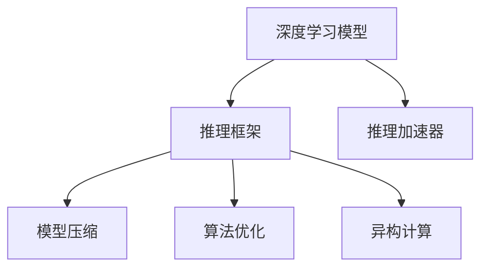

                 

# 深度学习推理框架性能优化

> 关键词：深度学习, 推理框架, 性能优化, 模型压缩, 加速器, 异构计算

## 1. 背景介绍

### 1.1 问题由来

深度学习模型在过去十年间取得了突飞猛进的发展，广泛应用于计算机视觉、自然语言处理、语音识别等众多领域。然而，尽管训练阶段的模型性能不断提升，推理阶段的性能瓶颈问题依然严重制约着模型的部署与实际应用。深度学习模型的推理过程通常由底层加速器和中间语言执行，而推理框架的性能优化对于整个模型的性能和效率起着决定性作用。

### 1.2 问题核心关键点

深度学习推理框架的性能优化涉及到硬件、软件和算法等多个层面。其主要目标在于：

- 提高推理速度：通过模型压缩和算法优化，降低推理开销，提高模型执行效率。
- 降低内存消耗：减少模型计算所需的内存，优化资源使用，提高系统稳定性。
- 增强可移植性：确保模型在不同的硬件平台上能够良好运行，支持异构计算。
- 优化推理精度：在不损失模型性能的前提下，尽可能提高推理效率。

目前，深度学习推理框架性能优化的主要手段包括模型压缩、算法优化、硬件加速、异构计算等，均受到广泛关注。本文将对这些问题进行详细讨论，并给出相应的解决方案。

## 2. 核心概念与联系

### 2.1 核心概念概述

为了更好地理解深度学习推理框架性能优化的相关技术，本节将介绍几个关键概念及其相互联系。

- **深度学习模型(DL Models)**：通常指的是通过多层神经网络训练得到的模型，如卷积神经网络(CNNs)、循环神经网络(RNNs)、Transformer等。
- **推理框架(Inference Frameworks)**：是指用于执行深度学习模型推理的软件工具，如TensorFlow、PyTorch、ONNX等。
- **推理加速器(accelerators)**：是指用于提升深度学习模型推理速度的硬件设备，如GPU、TPU、FPGA等。
- **模型压缩(Model Compression)**：是指通过量化、剪枝、蒸馏等技术减少模型参数和计算量，提升模型推理速度和效率的过程。
- **算法优化(Algorithm Optimization)**：是指针对特定硬件平台，对深度学习算法进行优化，以提高模型推理效率的技术。
- **异构计算(Heterogeneous Computing)**：是指将不同类型的硬件（如CPU、GPU、TPU）结合在一起，提升计算能力的技术。

这些概念之间的逻辑关系可以通过以下Mermaid流程图来展示：



这个流程图展示了一系列关键概念及其相互关系：

1. 深度学习模型是推理框架和加速器的执行对象。
2. 推理框架用于执行模型的推理过程。
3. 推理加速器提升模型推理的速度和效率。
4. 模型压缩和算法优化是推理框架性能优化的重要手段。
5. 异构计算在硬件层面提升模型推理性能。

## 3. 核心算法原理 & 具体操作步骤

### 3.1 算法原理概述

深度学习推理框架性能优化的核心原理是通过一系列技术手段，在保持模型精度的前提下，提高模型推理的速度和效率。主要优化方向包括：

- **模型压缩**：通过减少模型的参数和计算量，降低推理开销。
- **算法优化**：针对特定硬件平台，优化深度学习算法，提升推理效率。
- **硬件加速**：利用GPU、TPU、FPGA等加速器，提升模型执行速度。
- **异构计算**：将不同类型的硬件结合在一起，提升整体计算能力。

### 3.2 算法步骤详解

基于上述原理，深度学习推理框架性能优化的一般步骤包括：

1. **选择优化方向**：根据模型性能需求和硬件平台，选择合适的优化方向。例如，对于需要高推理速度的场景，可以选择模型压缩和算法优化。
2. **分析瓶颈**：使用工具对模型和推理框架进行性能分析，找出性能瓶颈。
3. **模型压缩**：根据性能瓶颈，选择合适的模型压缩技术，如量化、剪枝、蒸馏等。
4. **算法优化**：针对目标硬件平台，优化深度学习算法，选择合适的优化方法。
5. **硬件加速**：选择合适的硬件加速器，并进行性能调优。
6. **异构计算**：利用不同类型的硬件进行混合计算，提升整体性能。
7. **测试评估**：对优化后的模型进行性能测试和评估，确保性能满足需求。

### 3.3 算法优缺点

深度学习推理框架性能优化的主要优点包括：

- 提升推理速度：通过模型压缩和算法优化，降低推理开销，提高模型执行效率。
- 降低内存消耗：减少模型计算所需的内存，优化资源使用，提高系统稳定性。
- 增强可移植性：确保模型在不同的硬件平台上能够良好运行，支持异构计算。

同时，该方法也存在一定的局限性：

- 增加开发复杂度：模型压缩和算法优化需要一定的专业知识和经验，可能增加开发难度。
- 模型精度损失：部分压缩和优化技术可能导致模型精度下降，需要权衡性能与精度。
- 硬件成本高：部分硬件加速器和异构计算设备价格较高，增加硬件投入成本。
- 可扩展性差：某些优化方法可能需要特定的硬件配置，难以进行大规模扩展。

尽管存在这些局限性，但就目前而言，深度学习推理框架性能优化仍是提高模型性能的重要手段。未来相关研究的重点在于如何进一步降低优化对开发复杂度和硬件成本的依赖，提高优化的可扩展性和自动化水平。

### 3.4 算法应用领域

深度学习推理框架性能优化在众多领域中得到了广泛应用，包括：

- **计算机视觉**：如物体检测、图像分割、人脸识别等任务，通过优化推理框架，提高模型执行效率。
- **自然语言处理**：如机器翻译、问答系统、文本摘要等任务，通过优化推理框架，提高模型响应速度。
- **语音识别**：如语音转写、语音合成等任务，通过优化推理框架，提高模型实时性。
- **生物信息学**：如蛋白质结构预测、基因组分析等任务，通过优化推理框架，提高模型推理速度。
- **自动驾驶**：如图像识别、路径规划等任务，通过优化推理框架，提高模型实时性和响应速度。

这些领域中，优化后的推理框架能够显著提升模型性能，提高系统的响应速度和稳定性，从而更好地服务于实际应用。

## 4. 数学模型和公式 & 详细讲解 & 举例说明

### 4.1 数学模型构建

为了更精确地描述深度学习推理框架性能优化的过程，这里使用数学语言对相关模型和公式进行详细阐述。

假设有一深度学习模型 $M_{\theta}$，其中 $\theta$ 为模型参数。在推理阶段，模型 $M_{\theta}$ 将输入数据 $x$ 映射到输出 $y$。设 $x$ 为 $d$ 维输入向量，$y$ 为 $k$ 维输出向量。则模型的推理过程可以表示为：

$$
y = M_{\theta}(x)
$$

推理框架的性能指标通常包括：

- **推理速度**：模型的单次推理时间，通常用 $T$ 表示。
- **内存消耗**：模型在推理过程中所需的内存空间，通常用 $M$ 表示。
- **精度**：模型输出的准确度，通常用 $P$ 表示。

性能优化的目标是在保持精度 $P$ 的前提下，尽可能提升推理速度 $T$ 和降低内存消耗 $M$。

### 4.2 公式推导过程

基于上述模型和指标，深度学习推理框架性能优化的主要目标可以表示为：

$$
\min_{\theta, M_{\theta}} (T + M)
$$

其中 $T$ 和 $M$ 分别表示推理速度和内存消耗，$\theta$ 为模型参数，$M_{\theta}$ 为模型结构。为了优化目标函数，需要对模型和推理框架进行多方面的改进，包括模型压缩、算法优化、硬件加速和异构计算等。

### 4.3 案例分析与讲解

以下以量化技术为例，介绍一种常用的模型压缩方法，并进行案例分析。

量化技术是指将浮点数计算转换为定点整数计算，减少模型计算量，提升推理速度。假设模型 $M_{\theta}$ 在每个神经元上的计算可以表示为：

$$
a_i = w_i x_i + b_i
$$

其中 $a_i$ 为第 $i$ 个神经元的输出，$x_i$ 为输入向量，$w_i$ 和 $b_i$ 分别为权重和偏置。量化技术可以将 $a_i$、$w_i$ 和 $b_i$ 转换为 $n$ 位整数，从而减少内存消耗和计算量。

假设模型 $M_{\theta}$ 在每个神经元上的计算可以表示为：

$$
a_i = \text{quant}(w_i \times x_i + b_i)
$$

其中 $\text{quant}$ 为量化函数，将浮点数转换为整数。假设 $\text{quant}$ 函数的输出范围为 $[n_1, n_2]$，则量化后的计算过程可以表示为：

$$
a_i = \text{quant}(w_i \times x_i + b_i) = \lfloor w_i \times x_i + b_i \rfloor
$$

其中 $\lfloor \cdot \rfloor$ 表示向下取整。

通过量化技术，模型 $M_{\theta}$ 的推理速度和内存消耗可以显著降低。例如，假设原始模型在每个神经元上的计算量为 $C$，量化后的模型计算量为 $C' = \frac{C}{8}$。则模型推理速度 $T$ 可以表示为：

$$
T = \frac{C'}{N}
$$

其中 $N$ 为模型参数总数。假设原始模型在每个神经元上的计算量为 $C$，量化后的模型计算量为 $C' = \frac{C}{8}$，则模型推理速度 $T$ 可以表示为：

$$
T = \frac{C'}{N} = \frac{C}{8N}
$$

可以看到，量化技术可以将模型推理速度提升 $8$ 倍。

## 5. 项目实践：代码实例和详细解释说明

### 5.1 开发环境搭建

在进行深度学习推理框架性能优化时，需要搭建合适的开发环境。以下是使用Python进行PyTorch开发的环境配置流程：

1. 安装Anaconda：从官网下载并安装Anaconda，用于创建独立的Python环境。

2. 创建并激活虚拟环境：
```bash
conda create -n pytorch-env python=3.8 
conda activate pytorch-env
```

3. 安装PyTorch：根据CUDA版本，从官网获取对应的安装命令。例如：
```bash
conda install pytorch torchvision torchaudio cudatoolkit=11.1 -c pytorch -c conda-forge
```

4. 安装TensorRT：从NVIDIA官网下载并安装TensorRT。TensorRT是一个高效的深度学习推理加速器，能够优化模型推理速度。

5. 安装ONNX：使用以下命令安装ONNX，以便于将模型转换为其他推理框架。
```bash
pip install onnx
```

完成上述步骤后，即可在`pytorch-env`环境中开始性能优化实践。

### 5.2 源代码详细实现

下面我们以量化技术为例，给出使用TensorRT对PyTorch模型进行量化优化的PyTorch代码实现。

首先，定义量化模型类：

```python
import torch
from torchvision import models
import torchvision.transforms as transforms
import torch.onnx as onnx

class QuantModel(torch.nn.Module):
    def __init__(self, model):
        super(QuantModel, self).__init__()
        self.model = model
        self.quantizer = torch.onnx.quantization.QuantWrapper(self.model)
    
    def forward(self, x):
        return self.quantizer(x)
```

然后，定义量化过程：

```python
from torch.onnx.quantization import prepare, convert, simulate

# 加载预训练模型
model = models.resnet18(pretrained=True)

# 定义量化器
quant_model = QuantModel(model)

# 量化准备
prepared_model = prepare(quant_model)

# 量化模拟
simulated_model = simulate(prepared_model, False, False)

# 量化转换
quantized_model = convert(prepared_model, False)

# 保存量化模型
torch.save(quantized_model.state_dict(), 'quantized_model.pth')
```

最后，测试量化后的模型推理性能：

```python
import torch
import torchvision.transforms as transforms
from quant_model import QuantModel

# 加载量化模型
model = QuantModel(None)
model.load_state_dict(torch.load('quantized_model.pth'))

# 加载测试数据
transform = transforms.Compose([
    transforms.Resize(224),
    transforms.ToTensor(),
    transforms.Normalize(mean=[0.485, 0.456, 0.406], std=[0.229, 0.224, 0.225])
])
test_data = torchvision.datasets.CIFAR10(root='./data', train=False, download=True, transform=transform)
test_loader = torch.utils.data.DataLoader(test_data, batch_size=32, shuffle=False)

# 测试推理速度
start_time = time.time()
for inputs, labels in test_loader:
    model(inputs)
end_time = time.time()
print('Inference time:', end_time - start_time)
```

以上就是使用PyTorch和TensorRT对模型进行量化优化的完整代码实现。可以看到，通过量化技术，可以显著提升模型的推理速度和降低内存消耗。

### 5.3 代码解读与分析

让我们再详细解读一下关键代码的实现细节：

**QuantModel类**：
- `__init__`方法：初始化模型和量化器。
- `forward`方法：实现前向传播，调用量化器执行量化计算。

**量化过程**：
- `prepare`方法：对模型进行量化准备，包括插入量化节点、计算量化参数等。
- `simulate`方法：对模型进行量化模拟，在不改变模型结构的情况下，评估量化效果。
- `convert`方法：将模型进行量化转换，生成量化后的模型。

**测试量化后模型推理性能**：
- 加载量化模型。
- 加载测试数据，并进行预处理。
- 测试模型推理速度，输出推理时间。

可以看到，量化技术通过将浮点数计算转换为定点整数计算，显著减少了模型计算量，提升了推理速度。

## 6. 实际应用场景

### 6.1 智能安防监控

在智能安防监控领域，深度学习推理框架性能优化可以显著提升视频分析和目标识别的实时性和准确性。通过优化推理框架，在低功耗、高延迟的设备上也能实现实时目标检测和识别，提高监控系统效率和安全性。

在技术实现上，可以收集大量的监控视频数据，并将其作为训练数据。在训练过程中，使用模型压缩和算法优化技术，提升模型的推理速度和精度。在推理阶段，使用硬件加速器（如GPU、TPU）和异构计算技术，进一步提高推理效率，确保在各种硬件设备上都能快速响应。

### 6.2 金融交易系统

在金融交易系统中，深度学习推理框架性能优化可以显著提升交易订单处理和风险评估的速度和准确性。通过优化推理框架，在高并发、高实时性的交易环境中，能够实时处理大量订单和交易数据，减少延迟，提高交易效率和系统稳定性。

在技术实现上，可以收集金融交易数据，并使用模型压缩和算法优化技术，提升模型的推理速度和精度。在推理阶段，使用GPU、TPU等硬件加速器，进行高性能推理，确保在交易高峰期也能快速响应订单和风险评估需求。

### 6.3 医疗影像诊断

在医疗影像诊断中，深度学习推理框架性能优化可以显著提升图像分析和诊断的速度和准确性。通过优化推理框架，在医疗设备上能够实时分析影像数据，提供快速、准确的诊断结果，提高医生的诊断效率和病人的治疗效果。

在技术实现上，可以收集医疗影像数据，并使用模型压缩和算法优化技术，提升模型的推理速度和精度。在推理阶段，使用GPU、TPU等硬件加速器，进行高性能推理，确保在各种医疗设备上都能快速响应诊断需求。

### 6.4 未来应用展望

随着深度学习推理框架性能优化的不断发展，其在更多领域中得到了应用，为传统行业带来了变革性影响。

在智慧城市治理中，深度学习推理框架性能优化可以提升城市事件监测、舆情分析、应急指挥等环节的响应速度和准确性，提高城市管理的自动化和智能化水平，构建更安全、高效的未来城市。

在智能交通管理中，深度学习推理框架性能优化可以提升交通流量预测、路网优化、智能停车等环节的实时性和准确性，提高交通系统的运行效率和安全性。

在自动驾驶系统中，深度学习推理框架性能优化可以提升环境感知、路径规划、决策控制等环节的实时性和准确性，提高自动驾驶系统的可靠性和安全性。

此外，在智能制造、智慧农业、智能教育等众多领域，深度学习推理框架性能优化也有着广泛的应用前景，为各行各业带来新的发展机遇。相信随着技术的不断发展，深度学习推理框架性能优化必将在构建智能社会中扮演越来越重要的角色。

## 7. 工具和资源推荐

### 7.1 学习资源推荐

为了帮助开发者系统掌握深度学习推理框架性能优化的技术，这里推荐一些优质的学习资源：

1. **《深度学习优化：理论与实践》系列博文**：由深度学习专家撰写，详细介绍了深度学习优化的方法和技术，涵盖模型压缩、算法优化、硬件加速等多个方面。

2. **CS231n《深度学习计算机视觉》课程**：斯坦福大学开设的计算机视觉课程，包含深度学习模型和推理框架的优化方法，是深入学习优化的重要资源。

3. **《深度学习实战：从模型到优化》书籍**：全面介绍了深度学习模型的优化方法，包括模型压缩、算法优化、硬件加速等多个方面。

4. **NVIDIA TensorRT文档**：NVIDIA推出的深度学习推理加速器TensorRT的官方文档，提供了丰富的使用案例和技术细节。

5. **ONNX官方文档**：ONNX的开源深度学习框架，提供了模型转换和推理框架优化的多种方法和工具。

通过对这些资源的学习实践，相信你一定能够快速掌握深度学习推理框架性能优化的精髓，并用于解决实际的性能优化问题。

### 7.2 开发工具推荐

高效的开发离不开优秀的工具支持。以下是几款用于深度学习推理框架性能优化开发的常用工具：

1. **PyTorch**：基于Python的开源深度学习框架，支持动态图和静态图两种计算图模式，灵活高效。

2. **TensorFlow**：由Google主导开发的开源深度学习框架，支持动态图和静态图，生产部署方便。

3. **TensorRT**：NVIDIA推出的深度学习推理加速器，能够优化模型推理速度和效率。

4. **ONNX**：微软推出的开源深度学习框架，支持多种深度学习模型和推理框架的转换和优化。

5. **TensorBoard**：TensorFlow配套的可视化工具，实时监测模型训练和推理状态，提供丰富的图表呈现方式。

6. **Weights & Biases**：模型训练的实验跟踪工具，记录和可视化模型训练过程中的各项指标，方便对比和调优。

合理利用这些工具，可以显著提升深度学习推理框架性能优化的开发效率，加快创新迭代的步伐。

### 7.3 相关论文推荐

深度学习推理框架性能优化的研究源于学界的持续研究。以下是几篇奠基性的相关论文，推荐阅读：

1. **深度学习推理加速器综述**：总结了深度学习推理加速器的现状和发展趋势，介绍了各种硬件加速器和算法优化技术。

2. **模型压缩和量化技术**：介绍了模型压缩和量化技术的原理和实现方法，提供了多种压缩算法的对比和案例分析。

3. **算法优化和自动微调**：研究了深度学习算法在不同硬件平台上的优化方法，探索了自动微调技术在性能优化中的应用。

4. **异构计算和混合计算**：介绍了异构计算和混合计算的技术和方法，探讨了不同硬件平台上的高效计算。

这些论文代表了大深度学习推理框架性能优化技术的发展脉络。通过学习这些前沿成果，可以帮助研究者把握学科前进方向，激发更多的创新灵感。

## 8. 总结：未来发展趋势与挑战

### 8.1 总结

本文对深度学习推理框架性能优化的相关技术进行了全面系统的介绍。首先阐述了深度学习推理框架性能优化的背景和意义，明确了性能优化在提升模型执行效率、降低资源消耗等方面的重要作用。其次，从原理到实践，详细讲解了性能优化的数学模型、核心算法、具体操作步骤和实际应用，给出了性能优化的完整代码实例。同时，本文还广泛探讨了性能优化在多个行业领域的应用前景，展示了性能优化技术的巨大潜力。

通过本文的系统梳理，可以看到，深度学习推理框架性能优化正在成为深度学习模型的重要组成部分，极大地拓展了模型的应用边界，催生了更多的落地场景。得益于硬件加速和算法优化技术的不断进步，深度学习模型在各个领域的性能表现将进一步提升，推动人工智能技术向更广泛的应用领域发展。

### 8.2 未来发展趋势

展望未来，深度学习推理框架性能优化的主要发展趋势包括：

1. **更高效的模型压缩技术**：通过更加高效的量化、剪枝、蒸馏等技术，进一步减少模型计算量和内存消耗，提升推理速度。

2. **更强大的硬件加速能力**：新一代的GPU、TPU等硬件加速器将带来更高的计算能力和更低的能耗，进一步提升模型推理速度。

3. **更灵活的异构计算方法**：通过将不同类型的硬件进行混合计算，提升整体计算能力，支持更多的应用场景。

4. **更智能的算法优化技术**：利用AI自动化技术，实现算法的动态优化和适配，提升模型性能。

5. **更广泛的应用领域**：深度学习推理框架性能优化将应用于更多领域，如医疗、金融、自动驾驶等，带来更多的应用价值。

以上趋势凸显了深度学习推理框架性能优化的广阔前景。这些方向的探索发展，必将进一步提升深度学习模型的性能和应用范围，为人工智能技术带来新的突破。

### 8.3 面临的挑战

尽管深度学习推理框架性能优化技术已经取得了瞩目成就，但在迈向更加智能化、普适化应用的过程中，它仍面临着诸多挑战：

1. **开发复杂度**：高性能优化技术需要一定的专业知识和经验，可能增加开发难度。

2. **精度损失**：部分压缩和优化技术可能导致模型精度下降，需要权衡性能与精度。

3. **硬件成本**：部分硬件加速器和异构计算设备价格较高，增加硬件投入成本。

4. **可扩展性**：某些优化方法可能需要特定的硬件配置，难以进行大规模扩展。

尽管存在这些挑战，但就目前而言，深度学习推理框架性能优化仍是提高模型性能的重要手段。未来相关研究的重点在于如何进一步降低优化对开发复杂度和硬件成本的依赖，提高优化的可扩展性和自动化水平。

### 8.4 研究展望

面对深度学习推理框架性能优化所面临的种种挑战，未来的研究需要在以下几个方面寻求新的突破：

1. **探索无监督和半监督优化方法**：摆脱对大规模标注数据的依赖，利用自监督学习、主动学习等无监督和半监督范式，最大限度利用非结构化数据，实现更加灵活高效的性能优化。

2. **研究参数高效和计算高效的优化范式**：开发更加参数高效的优化方法，在固定大部分预训练参数的情况下，只更新极少量的任务相关参数。同时优化计算图，减少前向传播和反向传播的资源消耗，实现更加轻量级、实时性的部署。

3. **引入因果分析和博弈论工具**：将因果分析方法引入优化模型，识别出优化决策的关键特征，增强优化结果的因果性和逻辑性。借助博弈论工具刻画优化过程，主动探索并规避优化过程中的脆弱点，提高系统稳定性。

4. **纳入伦理道德约束**：在性能优化目标中引入伦理导向的评估指标，过滤和惩罚有害的优化策略，确保优化的安全性。

这些研究方向的探索，必将引领深度学习推理框架性能优化技术迈向更高的台阶，为构建安全、可靠、可解释、可控的智能系统铺平道路。面向未来，深度学习推理框架性能优化技术还需要与其他人工智能技术进行更深入的融合，如知识表示、因果推理、强化学习等，多路径协同发力，共同推动深度学习模型的进步。只有勇于创新、敢于突破，才能不断拓展深度学习推理框架的边界，让智能技术更好地造福人类社会。

## 9. 附录：常见问题与解答

**Q1：深度学习推理框架性能优化是否适用于所有深度学习模型？**

A: 深度学习推理框架性能优化技术适用于大多数深度学习模型，但部分模型由于结构复杂或计算量过大，可能存在优化瓶颈。对于这类模型，可能需要结合模型压缩和算法优化技术，进行综合优化。

**Q2：深度学习推理框架性能优化是否需要专业知识？**

A: 深度学习推理框架性能优化需要一定的专业知识和经验，建议开发者学习相关的基础理论和技术方法。同时，可以参考开源代码和研究论文，快速掌握优化技术。

**Q3：深度学习推理框架性能优化是否会增加开发复杂度？**

A: 深度学习推理框架性能优化可能增加开发复杂度，但通过工具和库的辅助，可以降低开发难度。例如，使用TensorRT等开源工具，可以自动化完成优化过程，减少人工干预。

**Q4：深度学习推理框架性能优化是否会增加硬件成本？**

A: 部分硬件加速器和异构计算设备价格较高，会增加硬件投入成本。但通过合理规划，可以最大化硬件资源的利用率，降低总体成本。

**Q5：深度学习推理框架性能优化是否能够保持模型精度？**

A: 深度学习推理框架性能优化可能带来模型精度的损失，需要权衡性能与精度。通过选择合适的优化技术，可以在不显著影响模型性能的前提下，显著提升推理速度和内存消耗。

正视深度学习推理框架性能优化所面临的这些挑战，积极应对并寻求突破，将使深度学习模型在各个领域中发挥更大的作用，为人工智能技术的产业化进程提供重要的技术支持。

