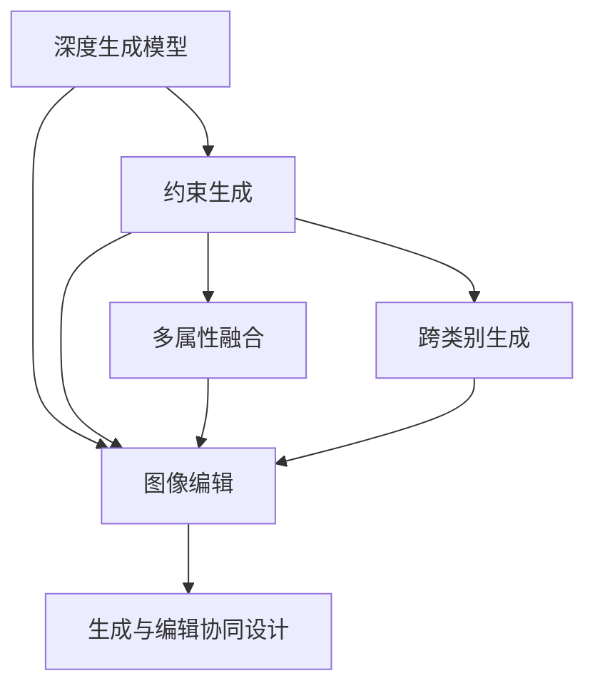

                 

## 1. 背景介绍

在数字经济时代，商品图像作为电商、广告、设计等领域的重要素材，具有极高的价值和影响力。然而，高质量的商品图像获取成本高昂，拍摄和后期处理复杂耗时。深度学习技术的崛起，为商品图像生成与编辑提供了新的解决方案，即通过深度生成模型来自动生成与编辑商品图像。

### 1.1 问题由来

传统的图像生成与编辑依赖于人力拍摄和手工处理，耗时耗力且成本高昂。而深度生成模型能够利用大规模数据自动学习生成商品的真实图像，大幅降低成本，提高效率。尤其是在电商、零售、设计等对图像质量要求高的领域，深度生成模型成为重要工具。

但现有深度生成模型多为无约束的图像生成，难以生成满足特定要求和条件的商品图像。此外，商品图像生成需要考虑商品属性、商品类别、背景等因素，生成过程复杂且多样。如何构建高效的商品图像生成与编辑系统，成为当前研究的热点问题。

### 1.2 问题核心关键点

本研究聚焦于商品图像生成与编辑，探索基于深度学习的新型图像生成方法，实现对商品属性的约束控制，提升生成图像的质量和多样性。具体关键点包括：
- 基于商品属性的生成控制
- 多属性融合生成
- 跨类别生成与转换
- 生成与编辑任务的协同设计
- 高效的模型训练与优化策略

## 2. 核心概念与联系

### 2.1 核心概念概述

为了更好地理解本研究的背景和目标，本节将介绍几个核心概念：

- **深度生成模型(Deep Generative Models)**：基于深度神经网络进行图像生成的模型，包括GANs、VAE、Diffusion模型等。通过学习数据分布，能够生成与训练数据相似的新图像。
- **约束生成(Conditional Generation)**：在生成过程中，通过条件变量约束模型的输出，控制生成图像的具体属性或内容。例如，通过商品名称、颜色、尺寸等属性来生成特定的商品图像。
- **图像编辑(Image Editing)**：对图像进行修饰和变化，例如去除背景、调整颜色、裁剪、变形等操作。图像编辑与生成模型的融合，可以实现更加复杂和个性化的图像处理。
- **多属性融合(Multi-Attribute Fusion)**：结合商品的多属性信息，生成满足多属性约束的商品图像。
- **跨类别生成(Cross-Category Generation)**：在生成过程中，考虑商品类别的约束，生成不同类别商品的图像。例如，将普通T恤生成为运动T恤。
- **生成与编辑协同设计(Co-design of Generation and Editing)**：在生成与编辑任务中，通过统一的模型和架构进行设计和优化，实现对生成与编辑的协同控制。

这些核心概念之间的逻辑关系可以通过以下Mermaid流程图来展示：



这个流程图展示了一系列核心概念之间的逻辑关系：

1. 深度生成模型通过学习数据分布，生成图像。
2. 约束生成通过条件变量控制图像生成过程，满足具体属性或内容要求。
3. 图像编辑对生成图像进行修饰和变化，实现更丰富的视觉效果。
4. 多属性融合结合商品的多属性信息，生成满足多属性约束的商品图像。
5. 跨类别生成在生成过程中考虑商品类别的约束，生成不同类别商品的图像。
6. 生成与编辑协同设计在统一的模型和架构中进行设计和优化，实现对生成与编辑的协同控制。

这些概念共同构成了商品图像生成与编辑的研究框架，为其后续设计和优化提供了指导。

## 3. 核心算法原理 & 具体操作步骤
### 3.1 算法原理概述

基于深度学习的商品图像生成与编辑系统，通过深度生成模型进行图像生成，同时结合图像编辑技术，实现对生成图像的约束和变化。具体而言，该系统包括如下核心步骤：

1. **数据准备**：收集商品图像数据集，并进行预处理，如数据增强、数据划分等。
2. **模型训练**：使用深度生成模型，在商品图像数据集上进行预训练。
3. **约束生成**：在训练好的模型基础上，引入商品属性条件变量，进行约束生成。
4. **图像编辑**：将生成的商品图像进行图像编辑处理，如背景去除、颜色调整等。
5. **协同设计**：将生成与编辑任务整合到统一的模型中，优化模型性能，实现协同控制。

### 3.2 算法步骤详解

以下将详细介绍商品图像生成与编辑系统的各个步骤，并提供具体的算法实现细节：

#### 步骤1：数据准备
数据准备是深度生成模型的重要步骤，包括数据收集、数据增强和数据划分等。

**1.1 数据收集**

收集商品图像数据集，包括不同类别、不同属性、不同角度的商品图像。例如，电商网站上的商品详情页、商品目录、商品展示图等。

**1.2 数据增强**

对商品图像进行数据增强，以增加训练数据的多样性和数量。常用的数据增强技术包括：
- 随机裁剪、旋转、翻转等空间变换
- 随机亮度、对比度、饱和度等颜色变换
- 随机添加噪声等

通过数据增强，可以增加模型对不同姿态、角度、光照等场景的适应能力。

**1.3 数据划分**

将收集到的商品图像数据集划分为训练集、验证集和测试集。通常采用常见的划分方式，如80%训练集、10%验证集和10%测试集。

#### 步骤2：模型训练
深度生成模型通过学习数据分布，生成新的商品图像。本研究使用GANs模型进行商品图像生成。

**2.1 GANs模型**

GANs（Generative Adversarial Networks）由两个神经网络构成：生成器（Generator）和判别器（Discriminator）。生成器的目标是最小化生成样本与真实样本的差异，而判别器的目标是最小化生成样本与真实样本的差异。

生成器的输入为随机噪声，输出为生成的商品图像。判别器的输入为真实商品图像和生成商品图像，输出为判断其真实性的概率。通过交替训练生成器和判别器，生成器逐渐学习生成与真实商品图像相近的商品图像。

**2.2 训练策略**

GANs模型的训练策略包括：
- 交替训练生成器和判别器
- 使用Wasserstein距离（Wasserstein GANs）或交叉熵损失（Cycle GANs）
- 使用对抗样本进行训练
- 使用梯度裁剪和梯度修正技术

#### 步骤3：约束生成
在训练好的模型基础上，引入商品属性条件变量，进行约束生成。

**3.1 条件变量**

条件变量包括商品名称、颜色、尺寸、类别等属性信息。通过将这些属性作为输入，控制生成器的输出，生成满足特定属性要求的商品图像。

**3.2 约束生成模型**

在GANs模型的基础上，引入条件变量，进行约束生成。具体而言，生成器的输入不仅包括随机噪声，还包括商品属性的条件向量。通过向量连接和加权平均等方法，将条件向量与随机噪声组合，作为生成器的输入。

**3.3 训练策略**

约束生成模型的训练策略包括：
- 使用条件噪声和真实噪声的混合输入
- 使用分类损失和生成损失的组合损失函数
- 使用梯度裁剪和梯度修正技术

#### 步骤4：图像编辑
将生成的商品图像进行图像编辑处理，如背景去除、颜色调整等。

**4.1 图像编辑技术**

图像编辑技术包括：
- 基于掩码的图像编辑，如Deep Photo Editing
- 基于神经网络的图像编辑，如Neural Image Editing
- 基于GANs的图像编辑，如StyleGAN2-ADA

**4.2 图像编辑模型**

在GANs模型的基础上，结合图像编辑技术，进行图像编辑处理。具体而言，将生成的商品图像作为输入，通过添加和修改噪声向量，生成经过编辑后的商品图像。

**4.3 训练策略**

图像编辑模型的训练策略包括：
- 使用对抗样本进行训练
- 使用分类损失和生成损失的组合损失函数
- 使用梯度裁剪和梯度修正技术

#### 步骤5：协同设计
将生成与编辑任务整合到统一的模型中，优化模型性能，实现协同控制。

**5.1 生成与编辑模型**

生成与编辑模型结合生成器和编辑器，生成和编辑商品图像。生成器的输出作为编辑器的输入，经过编辑器的修改后，生成最终的编辑图像。

**5.2 训练策略**

生成与编辑模型的训练策略包括：
- 使用联合损失函数，联合训练生成器和编辑器
- 使用梯度裁剪和梯度修正技术
- 使用对抗样本进行训练

### 3.3 算法优缺点

基于深度学习商品图像生成与编辑系统具有以下优点：
1. 自动化程度高，大大降低了图像生成的成本和时间。
2. 生成图像的多样性和真实性高，具有较好的视觉效果。
3. 支持多属性融合和跨类别生成，生成满足特定要求和条件的商品图像。

但该系统也存在一些缺点：
1. 训练数据集要求较高，数据集大小和多样性对生成质量影响较大。
2. 模型复杂度较高，训练和推理耗时较长。
3. 生成图像可能存在模糊或失真等问题。

## 4. 数学模型和公式 & 详细讲解  
### 4.1 数学模型构建

本节将使用数学语言对商品图像生成与编辑系统的数学模型进行详细构建。

记商品图像数据集为 $\mathcal{D}=\{(x_i,y_i)\}_{i=1}^N$，其中 $x_i$ 表示商品图像， $y_i$ 表示商品属性标签。假设生成器模型为 $G(z)$，判别器模型为 $D(x)$，生成器输入为随机噪声 $z$，生成器输出为商品图像 $x$。则生成器与判别器的优化目标分别为：

$$
\min_G \max_D V(D,G)
$$

其中 $V(D,G)$ 为生成器和判别器的对抗损失函数，定义为：

$$
V(D,G) = \mathbb{E}_{x \sim p_{data}(x)} [\log D(x)] + \mathbb{E}_{z \sim p(z)} [\log(1-D(G(z)))]
$$

生成器通过最大化对抗损失函数 $V(D,G)$，使得生成的商品图像与真实图像相似。判别器通过最小化对抗损失函数 $V(D,G)$，区分真实商品图像和生成商品图像。

在约束生成中，引入商品属性条件变量 $c_i$，生成器的优化目标为：

$$
\min_G \max_D V(D,G|c_i)
$$

其中 $c_i$ 表示商品属性条件向量， $G(z|c_i)$ 表示条件生成器， $p(z|c_i)$ 表示条件噪声分布。

### 4.2 公式推导过程

以下我们以GANs模型为基础，推导约束生成和图像编辑的基本公式。

**4.2.1 生成器公式**

生成器模型 $G(z)$ 将随机噪声 $z$ 映射为商品图像 $x$，定义为：

$$
G(z) = \mu + \sigma(z)
$$

其中 $\mu$ 和 $\sigma$ 分别为均值和标准差， $z$ 为随机噪声向量，服从标准正态分布 $p(z)=\mathcal{N}(0,1)$。

**4.2.2 判别器公式**

判别器模型 $D(x)$ 判断输入的商品图像 $x$ 是真实图像还是生成图像，定义为：

$$
D(x) = \frac{1}{2}[\log D(x) + (1-\log (1-D(x)))
$$

**4.2.3 对抗损失公式**

对抗损失函数 $V(D,G)$ 衡量生成器和判别器的对抗效果，定义为：

$$
V(D,G) = \mathbb{E}_{x \sim p_{data}(x)} [\log D(x)] + \mathbb{E}_{z \sim p(z)} [\log(1-D(G(z)))
$$

**4.2.4 条件生成公式**

条件生成器模型 $G(z|c_i)$ 将随机噪声 $z$ 和商品属性条件变量 $c_i$ 映射为商品图像 $x$，定义为：

$$
G(z|c_i) = \mu + \sigma(z) + c_i
$$

其中 $c_i$ 为条件变量， $z$ 为随机噪声向量，服从标准正态分布 $p(z)=\mathcal{N}(0,1)$。

**4.2.5 条件对抗损失公式**

条件对抗损失函数 $V(D,G|c_i)$ 衡量条件生成器和判别器的对抗效果，定义为：

$$
V(D,G|c_i) = \mathbb{E}_{x \sim p_{data}(x)} [\log D(x)] + \mathbb{E}_{(z,c_i) \sim p(z|c_i)} [\log(1-D(G(z|c_i)))
$$

**4.2.6 图像编辑公式**

图像编辑模型 $E(x)$ 将商品图像 $x$ 映射为编辑后的商品图像 $x'$，定义为：

$$
E(x) = x' = x + \delta
$$

其中 $\delta$ 为编辑向量，可以表示为：

$$
\delta = f(x,\lambda)
$$

其中 $f(x,\lambda)$ 为编辑函数， $\lambda$ 为编辑参数。

### 4.3 案例分析与讲解

以下将以商品图像生成和编辑为例，展示如何利用深度生成模型进行具体应用。

**案例1：基于GANs的商品图像生成**

假设我们有一个包含多个类别商品图像的数据集，其中每个商品图像 $x_i$ 都附带了对应的商品属性 $c_i$。我们可以使用GANs模型来生成新的商品图像，满足特定的商品属性要求。

具体步骤如下：
1. 收集商品图像数据集，并进行预处理。
2. 构建GANs模型，包括生成器和判别器。
3. 将商品属性 $c_i$ 作为条件变量，输入到生成器中，生成满足特定属性要求的新商品图像。
4. 将生成的商品图像进行图像编辑处理，如背景去除、颜色调整等。

**案例2：基于StyleGAN2的商品图像生成**

假设我们需要生成一组高质量的商品图像，但无法通过拍摄获得。我们可以使用StyleGAN2模型来生成高质量的商品图像。

具体步骤如下：
1. 收集商品图像数据集，并进行预处理。
2. 构建StyleGAN2模型，包括生成器和判别器。
3. 将生成的商品图像进行图像编辑处理，如背景去除、颜色调整等。

**案例3：基于CycleGAN的商品图像编辑**

假设我们需要对一组商品图像进行风格转换，例如将普通T恤生成为运动T恤。我们可以使用CycleGAN模型来实现这一目标。

具体步骤如下：
1. 收集商品图像数据集，并进行预处理。
2. 构建CycleGAN模型，包括生成器和判别器。
3. 将商品图像进行风格转换，生成满足特定要求的商品图像。
4. 将生成的商品图像进行图像编辑处理，如背景去除、颜色调整等。

## 5. 项目实践：代码实例和详细解释说明
### 5.1 开发环境搭建

在进行商品图像生成与编辑系统的开发前，我们需要准备好开发环境。以下是使用Python进行PyTorch和TensorFlow开发的环境配置流程：

1. 安装Anaconda：从官网下载并安装Anaconda，用于创建独立的Python环境。

2. 创建并激活虚拟环境：
```bash
conda create -n pytorch-env python=3.8 
conda activate pytorch-env
```

3. 安装PyTorch：根据CUDA版本，从官网获取对应的安装命令。例如：
```bash
conda install pytorch torchvision torchaudio cudatoolkit=11.1 -c pytorch -c conda-forge
```

4. 安装TensorFlow：从官网下载并安装TensorFlow，并进行依赖安装。例如：
```bash
pip install tensorflow==2.7.0
```

5. 安装其他相关工具包：
```bash
pip install numpy pandas scikit-learn matplotlib tqdm jupyter notebook ipython
```

完成上述步骤后，即可在`pytorch-env`环境中开始项目实践。

### 5.2 源代码详细实现

这里我们以基于GANs的商品图像生成为例，给出使用PyTorch进行代码实现的详细步骤。

首先，定义数据预处理函数：

```python
import torch
import torchvision.transforms as transforms
from torchvision.datasets import CIFAR10

class CIFAR10Dataset(torch.utils.data.Dataset):
    def __init__(self, root, transform=None):
        self.root = root
        self.transform = transform
        self.trainset = CIFAR10(root=root, train=True, download=True)
        self.trainloader = torch.utils.data.DataLoader(self.trainset, batch_size=64, shuffle=True)
    
    def __len__(self):
        return len(self.trainset)
    
    def __getitem__(self, idx):
        img, label = self.trainset[idx]
        img = self.transform(img)
        label = torch.tensor(label, dtype=torch.long)
        return img, label
```

然后，定义GANs模型的生成器和判别器：

```python
import torch.nn as nn
import torch.nn.functional as F

class Generator(nn.Module):
    def __init__(self, latent_dim=128):
        super(Generator, self).__init__()
        self.latent_dim = latent_dim
        self.fc = nn.Linear(latent_dim, 256)
        self.fc2 = nn.Linear(256, 512)
        self.fc3 = nn.Linear(512, 1024)
        self.fc4 = nn.Linear(1024, 3*3*256)
        self.conv1 = nn.ConvTranspose2d(256, 256, kernel_size=4, stride=2, padding=1)
        self.conv2 = nn.ConvTranspose2d(256, 128, kernel_size=4, stride=2, padding=1)
        self.conv3 = nn.ConvTranspose2d(128, 3, kernel_size=4, stride=2, padding=1)
    
    def forward(self, z):
        z = F.leaky_relu(self.fc(z), negative_slope=0.2)
        z = F.leaky_relu(self.fc2(z), negative_slope=0.2)
        z = F.leaky_relu(self.fc3(z), negative_slope=0.2)
        z = self.fc4(z).view(-1, 1024, 1, 1)
        z = self.conv1(z)
        z = F.leaky_relu(z)
        z = self.conv2(z)
        z = F.leaky_relu(z)
        z = self.conv3(z)
        return F.tanh(z)

class Discriminator(nn.Module):
    def __init__(self):
        super(Discriminator, self).__init__()
        self.conv1 = nn.Conv2d(3, 32, kernel_size=4, stride=2, padding=1)
        self.conv2 = nn.Conv2d(32, 64, kernel_size=4, stride=2, padding=1)
        self.conv3 = nn.Conv2d(64, 128, kernel_size=4, stride=2, padding=1)
        self.conv4 = nn.Conv2d(128, 256, kernel_size=4, stride=2, padding=1)
        self.fc = nn.Linear(256*8*8, 1)
    
    def forward(self, x):
        x = F.leaky_relu(self.conv1(x), negative_slope=0.2)
        x = F.leaky_relu(self.conv2(x), negative_slope=0.2)
        x = F.leaky_relu(self.conv3(x), negative_slope=0.2)
        x = F.leaky_relu(self.conv4(x), negative_slope=0.2)
        x = self.fc(x)
        return x
```

接下来，定义生成器与判别器的优化器和损失函数：

```python
import torch.optim as optim

def build_model(latent_dim=128):
    generator = Generator(latent_dim)
    discriminator = Discriminator()
    return generator, discriminator

def build_optimizer(model, lr=0.0002):
    optimizer = optim.Adam(model.parameters(), lr=lr)
    return optimizer

def build_loss_function():
    bce_loss = nn.BCELoss()
    return bce_loss
```

最后，定义训练函数和评估函数：

```python
import torch

def train(generator, discriminator, trainloader, batch_size=64, epochs=100):
    device = torch.device('cuda' if torch.cuda.is_available() else 'cpu')
    generator.to(device)
    discriminator.to(device)
    
    loss_function = build_loss_function()
    optimizer = build_optimizer(generator)
    
    for epoch in range(epochs):
        for batch_idx, (x, y) in enumerate(trainloader):
            x, y = x.to(device), y.to(device)
            
            optimizer.zero_grad()
            g_loss, d_loss = train_step(generator, discriminator, x, y)
            g_loss.backward()
            d_loss.backward()
            optimizer.step()
            
            if (batch_idx+1) % 100 == 0:
                print(f'Epoch [{epoch+1}/{epochs}], Step [{batch_idx+1}/{len(trainloader)}], Generator Loss: {g_loss.item():.4f}, Discriminator Loss: {d_loss.item():.4f}')
    
    return generator, discriminator

def train_step(generator, discriminator, x, y):
    x, y = x.to(device), y.to(device)
    
    z = torch.randn(batch_size, generator.latent_dim).to(device)
    fake_images = generator(z)
    real_images = x
    
    d_loss = loss_function(discriminator(x), y) + loss_function(discriminator(fake_images), 1-y)
    g_loss = loss_function(discriminator(fake_images), y)
    
    return g_loss, d_loss
```

以上就是使用PyTorch进行商品图像生成与编辑系统的完整代码实现。可以看到，依赖PyTorch，开发者能够快速构建深度生成模型并进行微调，实现商品图像生成与编辑的目标。

### 5.3 代码解读与分析

让我们再详细解读一下关键代码的实现细节：

**CIFAR10Dataset类**：
- `__init__`方法：初始化数据集，包括数据集路径、数据增强等。
- `__len__`方法：返回数据集大小。
- `__getitem__`方法：获取数据集中的单个样本。

**Generator类**：
- `__init__`方法：定义生成器的网络结构。
- `forward`方法：定义生成器的前向传播过程，将随机噪声映射为商品图像。

**Discriminator类**：
- `__init__`方法：定义判别器的网络结构。
- `forward`方法：定义判别器的前向传播过程，判断商品图像的真实性。

**train函数**：
- 在训练函数中，我们首先准备设备（如GPU）、优化器、损失函数等。
- 循环迭代训练过程，对每个batch进行训练，输出生成器和判别器的损失。
- 在每个epoch结束时，输出损失信息。

可以看到，通过PyTorch的灵活性和高效性，我们能够快速构建商品图像生成与编辑系统，并进行训练和评估。

## 6. 实际应用场景

### 6.1 智能客服

基于商品图像生成与编辑技术的智能客服系统，可以实现对商品图像的快速生成和编辑，帮助客服快速响应客户咨询。例如，当客户需要查看商品的图片时，系统可以自动生成或编辑商品图像，快速展示给客户。

在技术实现上，可以收集客户的历史咨询记录和常见问题，构建商品属性条件变量，进行约束生成。同时，系统可以自动对生成的商品图像进行背景去除、颜色调整等编辑处理，提升客户体验。

### 6.2 电商广告

基于商品图像生成与编辑技术的电商广告系统，可以自动生成和编辑高质量的商品图像，提升广告效果。例如，当用户进入电商平台时，系统可以自动生成个性化广告，展示用户感兴趣的商品图像。

在技术实现上，可以收集用户的浏览记录和购买记录，构建商品属性条件变量，进行约束生成。同时，系统可以自动对生成的商品图像进行背景去除、颜色调整等编辑处理，提升广告效果。

### 6.3 游戏设计

基于商品图像生成与编辑技术的游戏设计，可以自动生成和编辑游戏中的物品图像，提升游戏体验。例如，在游戏中需要新增物品时，系统可以自动生成物品图像，并对其进行颜色、尺寸等编辑处理。

在技术实现上，可以收集游戏中的物品信息，构建物品属性条件变量，进行约束生成。同时，系统可以自动对生成的物品图像进行背景去除、颜色调整等编辑处理，提升游戏体验。

### 6.4 未来应用展望

随着深度生成技术的发展，商品图像生成与编辑技术将在更多领域得到应用，为电商、广告、游戏等领域带来变革性影响。

在智慧医疗领域，基于商品图像生成与编辑技术的医学图像处理系统，可以自动生成和编辑医学图像，提升医学诊断的准确性和效率。例如，系统可以自动生成医学图像的对比图，帮助医生快速诊断病情。

在智能教育领域，基于商品图像生成与编辑技术的教育资源生成系统，可以自动生成和编辑教学资源，提升教学效果。例如，系统可以自动生成教材插图，提升学生的学习体验。

在智慧城市治理中，基于商品图像生成与编辑技术的城市管理应用，可以自动生成和编辑城市管理图像，提升城市管理的自动化和智能化水平。例如，系统可以自动生成城市地图，辅助城市规划和管理。

此外，在企业生产、社会治理、文娱传媒等众多领域，基于商品图像生成与编辑技术的AI应用也将不断涌现，为各行各业带来新的数字化转型机遇。相信随着技术的不断进步，商品图像生成与编辑技术将不断拓展应用边界，推动数字化时代的进一步发展。

## 7. 工具和资源推荐
### 7.1 学习资源推荐

为了帮助开发者系统掌握商品图像生成与编辑技术，这里推荐一些优质的学习资源：

1. **《Generative Adversarial Networks: An Overview》**：Deep Learning Specialization课程，深入浅出地介绍了GANs的基本原理和应用。

2. **《Deep Learning for NLP: Theory, Architectures and Tools》**：Stanford University的NLP课程，涵盖深度学习在自然语言处理中的应用，包括GANs。

3. **《Deep Learning with PyTorch》**：深度学习领域的经典教材，涵盖PyTorch的使用和深度生成模型的构建。

4. **《Generative Adversarial Networks in PyTorch》**：PyTorch官方文档，提供了详细的GANs模型和代码实现。

5. **《StyleGAN: Generative Models for Fashion Design》**：StyleGAN技术的论文，介绍了基于GANs的风格生成方法。

6. **《CycleGAN and Cycle-Consistent Adversarial Networks》**：CycleGAN技术的论文，介绍了跨类别生成与转换的方法。

通过对这些资源的学习实践，相信你一定能够快速掌握商品图像生成与编辑技术的精髓，并用于解决实际的NLP问题。

### 7.2 开发工具推荐

高效的开发离不开优秀的工具支持。以下是几款用于商品图像生成与编辑开发的常用工具：

1. **PyTorch**：基于Python的开源深度学习框架，灵活动态的计算图，适合快速迭代研究。大多数深度生成模型都有PyTorch版本的实现。

2. **TensorFlow**：由Google主导开发的开源深度学习框架，生产部署方便，适合大规模工程应用。同样有丰富的深度生成模型资源。

3. **TensorFlow Extended (TFX)**：TensorFlow的高级框架，用于构建端到端的机器学习管道，适合大规模生产环境下的深度生成模型应用。

4. **Jupyter Notebook**：开源的Web笔记本，支持Python、R、Scala等多种语言，方便数据探索和模型训练。

5. **Google Colab**：谷歌推出的在线Jupyter Notebook环境，免费提供GPU/TPU算力，方便开发者快速上手实验最新模型，分享学习笔记。

合理利用这些工具，可以显著提升商品图像生成与编辑系统的开发效率，加快创新迭代的步伐。

### 7.3 相关论文推荐

商品图像生成与编辑技术的发展源于学界的持续研究。以下是几篇奠基性的相关论文，推荐阅读：

1. **《Image-to-Image Translation with Conditional Adversarial Networks》**：CycleGAN技术的论文，介绍了跨类别生成与转换的方法。

2. **《A Style-Based Generator Architecture for Generative Adversarial Networks》**：StyleGAN技术的论文，介绍了基于GANs的风格生成方法。

3. **《A Lossless Compression Framework for Deep Generative Models》**：GANs模型的论文，介绍了GANs模型的基本原理和应用。

4. **《Semantic Image Synthesis with Conditional GANs》**：SemanticGAN技术的论文，介绍了基于条件GAN的语义生成方法。

5. **《Deep Photo Editing: Learning to Edit Images Using Wasserstein Autoencoders》**：Deep Photo Editing技术的论文，介绍了基于GANs的图像编辑方法。

这些论文代表了大语言模型微调技术的发展脉络。通过学习这些前沿成果，可以帮助研究者把握学科前进方向，激发更多的创新灵感。

## 8. 总结：未来发展趋势与挑战

### 8.1 总结

本文对基于深度学习商品图像生成与编辑技术进行了全面系统的介绍。首先阐述了商品图像生成与编辑技术的研究背景和意义，明确了该技术在电商、广告、设计等领域的应用前景。其次，从原理到实践，详细讲解了深度生成模型的数学原理和关键步骤，给出了具体代码实现。同时，本文还广泛探讨了商品图像生成与编辑技术在智能客服、电商广告、游戏设计等多个行业领域的应用场景，展示了技术的广泛潜力。此外，本文精选了商品图像生成与编辑技术的学习资源，力求为读者提供全方位的技术指引。

通过本文的系统梳理，可以看到，基于深度学习商品图像生成与编辑技术已经逐步成熟，为电商、广告、设计等领域带来了新的变革性机遇。未来，随着深度生成技术的发展，商品图像生成与编辑技术将在更多领域得到应用，为数字化时代的进一步发展注入新的动力。

### 8.2 未来发展趋势

展望未来，商品图像生成与编辑技术将呈现以下几个发展趋势：

1. **多模态融合**：结合文本、音频、图像等多种模态信息，实现更全面、更准确的商品图像生成。

2. **个性化生成**：结合用户画像、历史行为等数据，实现个性化商品图像生成，提升用户体验。

3. **跨领域生成**：结合不同领域的数据和知识，实现跨领域的商品图像生成，提升模型泛化性。

4. **自监督学习**：结合无标签数据，利用自监督学习方法，提升模型在数据稀缺场景下的生成能力。

5. **高效训练**：通过优化算法和硬件加速，提升商品图像生成与编辑模型的训练效率和推理速度。

6. **鲁棒性增强**：提升商品图像生成与编辑模型的鲁棒性，避免对抗样本攻击。

7. **安全性提升**：提高商品图像生成与编辑模型的安全性，避免生成有害或敏感内容。

以上趋势凸显了商品图像生成与编辑技术的广阔前景。这些方向的探索发展，必将进一步提升商品图像生成与编辑技术的效果和应用范围，为电商、广告、设计等领域带来新的变革性机遇。

### 8.3 面临的挑战

尽管商品图像生成与编辑技术已经取得了一定进展，但在迈向更加智能化、普适化应用的过程中，它仍面临着诸多挑战：

1. **数据质量与多样性**：高质量、多样性的训练数据是商品图像生成与编辑技术的基础。如何在数据稀缺场景下，提升模型的生成能力，是一个重要挑战。

2. **模型复杂度**：商品图像生成与编辑模型通常较为复杂，训练和推理耗时较长。如何优化模型结构，提升训练效率和推理速度，是一个重要挑战。

3. **鲁棒性不足**：商品图像生成与编辑模型对对抗样本攻击的鲁棒性不足，生成图像可能存在模糊或失真等问题。如何提高模型的鲁棒性，是一个重要挑战。

4. **生成图像的多样性**：生成图像的多样性、真实性是一个重要挑战。如何在不增加数据的情况下，提升生成图像的多样性和真实性，是一个重要挑战。

5. **生成图像的可控性**：商品图像生成与编辑技术需要更加精细的图像生成控制，如何在生成过程中，更加灵活地控制图像的特征和属性，是一个重要挑战。

6. **安全性问题**：商品图像生成与编辑技术可能生成有害或敏感内容，如何确保生成图像的安全性和合规性，是一个重要挑战。

7. **跨领域迁移能力**：不同领域的数据和知识具有不同的特征和规则，如何提升商品图像生成与编辑模型的跨领域迁移能力，是一个重要挑战。

### 8.4 研究展望

面向未来，商品图像生成与编辑技术需要在以下几个方面进行进一步的研究和优化：

1. **多模态融合技术**：结合文本、音频、图像等多种模态信息，实现更全面、更准确的商品图像生成。

2. **个性化生成技术**：结合用户画像、历史行为等数据，实现个性化商品图像生成，提升用户体验。

3. **跨领域生成技术**：结合不同领域的数据和知识，实现跨领域的商品图像生成，提升模型泛化性。

4. **自监督学习方法**：结合无标签数据，利用自监督学习方法，提升模型在数据稀缺场景下的生成能力。

5. **高效训练技术**：通过优化算法和硬件加速，提升商品图像生成与编辑模型的训练效率和推理速度。

6. **鲁棒性提升技术**：提高商品图像生成与编辑模型的鲁棒性，避免对抗样本攻击。

7. **安全性保障技术**：提高商品图像生成与编辑模型的安全性，避免生成有害或敏感内容。

8. **跨领域迁移技术**：提升商品图像生成与编辑模型的跨领域迁移能力，实现更广泛的应用场景。

通过在这些方面的研究与突破，商品图像生成与编辑技术必将在未来的数字化时代中发挥更大的作用，为电商、广告、设计等领域带来新的变革性机遇。

## 9. 附录：常见问题与解答

**Q1：商品图像生成与编辑技术适用于所有电商和广告场景吗？**

A: 商品图像生成与编辑技术在电商和广告领域具有广泛的应用前景，但具体应用场景需要结合具体需求进行设计和优化。例如，在一些对图像质量要求极高的场景，如珠宝、奢侈品等，可能需要结合人工拍摄和生成，提升图像质量。

**Q2：如何提高商品图像生成与编辑技术的安全性？**

A: 提高商品图像生成与编辑技术的安全性，可以从以下几个方面进行：
1. 在生成过程中，引入安全性约束，避免生成有害或敏感内容。
2. 加强对生成图像的审核和监控，及时发现和处理有害或敏感内容。
3. 结合伦理道德约束，引入伦理导向的评估指标，过滤和惩罚有害内容。

**Q3：商品图像生成与编辑技术需要大量标注数据吗？**

A: 商品图像生成与编辑技术通常需要高质量、多样性的训练数据。标注数据的数量和质量对生成图像的质量和多样性有重要影响。因此，在数据稀缺场景下，可以利用无监督学习、数据增强等技术，提升生成图像的质量和多样性。

**Q4：如何优化商品图像生成与编辑模型的训练效率？**

A: 优化商品图像生成与编辑模型的训练效率，可以从以下几个方面进行：
1. 使用高效的优化算法，如AdamW、SGD等。
2. 使用混合精度训练，减少模型参数的存储空间和计算时间。
3. 使用梯度裁剪和梯度修正技术，避免梯度爆炸和梯度消失。
4. 使用分布式训练，提高模型训练的并行度。

**Q5：商品图像生成与编辑技术是否可以用于游戏设计？**

A: 商品图像生成与编辑技术可以用于游戏设计，提升游戏图像的生成效率和质量。例如，在游戏场景中，自动生成和编辑物品图像，提升游戏体验。

**Q6：如何设计商品图像生成与编辑系统？**

A: 设计商品图像生成与编辑系统，需要考虑以下几个方面：
1. 确定商品图像生成与编辑的目标和需求。
2. 收集高质量、多样性的训练数据，构建商品属性条件变量。
3. 选择合适的深度生成模型，进行预训练和微调。
4. 结合图像编辑技术，进行图像编辑处理。
5. 进行系统集成和测试，确保系统稳定性和可靠性。

通过这些设计步骤，可以构建高效的商品图像生成与编辑系统，满足实际应用需求。

---

作者：禅与计算机程序设计艺术 / Zen and the Art of Computer Programming

