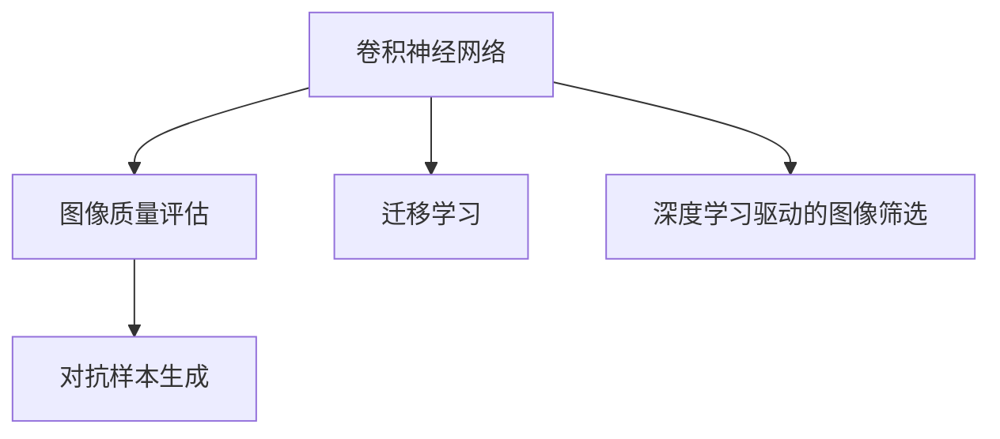

                 

## 1. 背景介绍

### 1.1 问题由来

随着电子商务的兴起，商品图像成为用户获取产品信息的重要途径。然而，由于各种因素（如拍摄角度、环境、设备等）的影响，商品图像质量往往参差不齐。质量差的图片难以准确展示产品特征，影响用户的购物决策。因此，如何自动评估和筛选商品图像，以确保高质量的展示，是电商行业亟需解决的问题。

传统的方法多依赖人工标注，成本高且效率低。而深度学习技术的发展，尤其是卷积神经网络（CNN）在图像处理中的应用，为自动化图像质量评估提供了可能。通过学习大量标注数据，深度学习模型可以自动识别图像的质量问题，并输出相应的评分或标签，显著提升评估效率和准确性。

### 1.2 问题核心关键点

深度学习驱动的商品图像质量评估与筛选，关键在于构建一个高效的评估模型，能够自动识别图像中的问题并给出评价。具体的关键点包括：

- 数据集的选择与构建：需要收集大量高分辨率的商品图像及其相应的质量标签，用于模型训练。
- 模型的设计：选择合适的卷积神经网络结构，进行图像特征提取和质量评估。
- 模型的训练与优化：通过反向传播算法进行模型训练，优化模型参数，提升评估准确性。
- 模型的应用与部署：将训练好的模型应用到新的图像数据上，进行实时质量评估和筛选。

### 1.3 问题研究意义

自动化商品图像质量评估与筛选，对于提升电商平台的用户体验、降低运营成本、增加销售额具有重要意义。具体来说，研究价值体现在以下几个方面：

1. **提升用户体验**：高质量的商品图像能够更好地展示商品细节，吸引用户购买。
2. **降低运营成本**：自动化的图像评估减少了人工标注的投入，提高了效率。
3. **增加销售额**：高质量的商品展示能够提升用户满意度，增加转化率。
4. **技术创新**：推动深度学习在图像处理领域的应用，促进计算机视觉技术的发展。

## 2. 核心概念与联系

### 2.1 核心概念概述

为更好地理解深度学习驱动的商品图像质量评估与筛选方法，本节将介绍几个密切相关的核心概念：

- **卷积神经网络（Convolutional Neural Network, CNN）**：一种专门用于处理图像、视频等空间数据类型的深度神经网络结构，能够自动提取空间特征。
- **图像质量评估**：对商品图像的质量进行量化评分或分类标注，常见的指标包括清晰度、对比度、色彩饱和度等。
- **迁移学习（Transfer Learning）**：在大规模图像数据上预训练好的模型，可以迁移到新的图像数据集上，进行微调以适应特定任务。
- **对抗样本生成**：通过修改图像，生成对抗样本，以检验模型的鲁棒性。

这些核心概念之间的逻辑关系可以通过以下Mermaid流程图来展示：



这个流程图展示了大语言模型的核心概念及其之间的关系：

1. 卷积神经网络通过学习图像数据，自动提取特征，用于图像质量评估。
2. 迁移学习通过在大规模图像数据上预训练模型，再进行微调，以适应特定任务。
3. 对抗样本生成通过修改图像，检验模型的鲁棒性。
4. 深度学习驱动的图像筛选通过卷积神经网络评估和筛选，提升电商平台的商品展示效果。

## 3. 核心算法原理 & 具体操作步骤

### 3.1 算法原理概述

深度学习驱动的商品图像质量评估与筛选，本质上是一个图像分类任务。模型通过学习大量标注好的训练数据，能够自动识别图像中的质量问题，并给出评分或标签。

假设训练集为 $D=\{(x_i, y_i)\}_{i=1}^N$，其中 $x_i$ 为图像， $y_i$ 为相应的质量标签。模型的目标是最小化预测输出与真实标签之间的差异。常见的损失函数包括交叉熵损失、均方误差损失等。

### 3.2 算法步骤详解

基于深度学习的商品图像质量评估与筛选，一般包括以下几个关键步骤：

**Step 1: 准备数据集**
- 收集并整理高分辨率的商品图像及其相应的质量标签，构建训练集、验证集和测试集。
- 对图像进行预处理，如缩放、归一化、增强等，以提高数据的质量和多样性。

**Step 2: 设计模型**
- 选择合适的卷积神经网络结构，如ResNet、Inception、MobileNet等。
- 在网络顶部添加一个全连接层，用于输出评分或标签。
- 使用适当的激活函数，如ReLU、Sigmoid等，以适应不同的任务需求。

**Step 3: 选择优化器**
- 选择合适的优化算法，如Adam、SGD等，设置学习率、批大小、迭代轮数等超参数。
- 设置正则化技术，如L2正则、Dropout等，避免过拟合。

**Step 4: 执行梯度训练**
- 将训练集数据分批次输入模型，前向传播计算损失函数。
- 反向传播计算参数梯度，根据设定的优化算法和学习率更新模型参数。
- 周期性在验证集上评估模型性能，根据性能指标决定是否触发Early Stopping。
- 重复上述步骤直到满足预设的迭代轮数或Early Stopping条件。

**Step 5: 测试和部署**
- 在测试集上评估微调后模型 $M_{\hat{\theta}}$ 的性能，对比微调前后的精度提升。
- 使用微调后的模型对新样本进行推理预测，集成到实际的应用系统中。
- 持续收集新的数据，定期重新微调模型，以适应数据分布的变化。

### 3.3 算法优缺点

深度学习驱动的商品图像质量评估与筛选方法具有以下优点：
1. 自动化程度高。一旦模型训练完毕，即可自动进行图像质量评估，节省了大量人工标注成本。
2. 准确性高。通过大量标注数据训练，模型的准确性显著高于传统的人工评估方法。
3. 适用范围广。适用于各种商品类型的图像质量评估，如服装、电子产品、食品等。
4. 更新迭代快。模型可以不断接受新的训练数据，逐步优化评估性能。

同时，该方法也存在一些局限性：
1. 依赖标注数据。高质量标注数据的获取和维护成本较高，需要大量人力物力投入。
2. 训练复杂度高。深度神经网络模型的训练需要大量计算资源，可能面临计算瓶颈。
3. 可解释性不足。深度学习模型本质上是一个"黑盒"系统，难以解释其内部决策过程。
4. 模型泛化能力有待提升。对于新的、未在训练集中出现过的图像，模型的泛化能力可能较弱。

尽管存在这些局限性，但就目前而言，深度学习驱动的商品图像质量评估与筛选方法仍是大规模图像处理任务的强有力工具。未来相关研究的重点在于如何进一步降低对标注数据的依赖，提高模型的泛化能力，同时兼顾可解释性和伦理安全性等因素。

### 3.4 算法应用领域

深度学习驱动的商品图像质量评估与筛选方法，在电商、零售、广告等多个领域中得到了广泛应用，具体包括：

- **电商**：自动筛选高质量的商品图片，提升用户购物体验。
- **零售**：优化库存管理，减少退货率。
- **广告**：筛选高质量的图像素材，提升广告效果。
- **时尚**：自动评估时装秀图片，辅助设计师选材。

除了上述这些经典应用外，深度学习驱动的图像质量评估还广泛应用于新闻媒体、医疗诊断、安防监控等众多领域，为这些行业带来了新的技术突破。随着深度学习技术的发展和应用的不断深化，相信该方法将在更多场景下发挥更大的作用。

## 4. 数学模型和公式 & 详细讲解 & 举例说明

### 4.1 数学模型构建

本节将使用数学语言对深度学习驱动的商品图像质量评估与筛选过程进行更加严格的刻画。

记训练集为 $D=\{(x_i, y_i)\}_{i=1}^N$，其中 $x_i$ 为图像， $y_i$ 为相应的质量标签。定义模型 $M_{\theta}$ 在输入 $x$ 上的输出为 $\hat{y}=M_{\theta}(x)$，则模型在训练集上的损失函数为：

$$
\mathcal{L}(\theta) = \frac{1}{N}\sum_{i=1}^N \ell(y_i, \hat{y}_i)
$$

其中 $\ell$ 为损失函数，常见的有交叉熵损失函数、均方误差损失函数等。

在得到损失函数后，可以使用梯度下降等优化算法，通过反向传播算法求得模型参数 $\theta$ 的更新公式：

$$
\theta \leftarrow \theta - \eta \nabla_{\theta}\mathcal{L}(\theta)
$$

其中 $\eta$ 为学习率，$\nabla_{\theta}\mathcal{L}(\theta)$ 为损失函数对模型参数的梯度，可通过自动微分技术高效计算。

### 4.2 公式推导过程

以二分类任务为例，假设模型 $M_{\theta}$ 在输入 $x$ 上的输出为 $\hat{y}=M_{\theta}(x) \in [0,1]$，表示图像属于正类的概率。真实标签 $y \in \{0,1\}$。则二分类交叉熵损失函数定义为：

$$
\ell(y, \hat{y}) = -[y\log \hat{y} + (1-y)\log (1-\hat{y})]
$$

将其代入经验风险公式，得：

$$
\mathcal{L}(\theta) = -\frac{1}{N}\sum_{i=1}^N [y_i\log M_{\theta}(x_i)+(1-y_i)\log(1-M_{\theta}(x_i))]
$$

根据链式法则，损失函数对参数 $\theta_k$ 的梯度为：

$$
\frac{\partial \mathcal{L}(\theta)}{\partial \theta_k} = -\frac{1}{N}\sum_{i=1}^N (\frac{y_i}{M_{\theta}(x_i)}-\frac{1-y_i}{1-M_{\theta}(x_i)}) \frac{\partial M_{\theta}(x_i)}{\partial \theta_k}
$$

其中 $\frac{\partial M_{\theta}(x_i)}{\partial \theta_k}$ 可进一步递归展开，利用自动微分技术完成计算。

### 4.3 案例分析与讲解

**案例分析：使用VGG16网络进行图像质量评估**

VGG16网络是一种经典的卷积神经网络结构，广泛应用于图像分类任务。本节将以VGG16网络为例，展示深度学习驱动的商品图像质量评估的实现过程。

首先，定义一个简单的二分类任务，如图像是否清晰。收集并整理相应的训练集和测试集，使用PIL库进行图像预处理：

```python
from PIL import Image
import numpy as np

def preprocess_image(image_path):
    image = Image.open(image_path)
    image = image.resize((224, 224))
    image = np.array(image) / 255.0
    image = image - 0.5
    image = image / 0.5
    return image

train_data = preprocess_image(train_images)
train_labels = train_labels
```

然后，定义VGG16网络模型：

```python
from tensorflow.keras.applications import VGG16
from tensorflow.keras.layers import Dense, Flatten
from tensorflow.keras.models import Model

base_model = VGG16(weights='imagenet', include_top=False, input_shape=(224, 224, 3))
x = base_model.output
x = Flatten()(x)
x = Dense(256, activation='relu')(x)
output = Dense(1, activation='sigmoid')(x)
model = Model(inputs=base_model.input, outputs=output)
model.compile(optimizer='adam', loss='binary_crossentropy', metrics=['accuracy'])
```

接着，使用训练集进行模型训练：

```python
history = model.fit(train_data, train_labels, epochs=10, validation_data=(val_data, val_labels))
```

最后，使用测试集评估模型性能：

```python
test_loss, test_acc = model.evaluate(test_data, test_labels)
print('Test accuracy:', test_acc)
```

以上代码展示了使用VGG16网络进行图像质量评估的基本流程。通过预处理、模型构建、训练和评估，可以训练出一个简单的二分类模型，用于评估图像的清晰度。在实际应用中，需要根据具体任务的需求，设计更复杂的模型结构和损失函数，以达到更高的评估精度。

## 5. 项目实践：代码实例和详细解释说明

### 5.1 开发环境搭建

在进行深度学习驱动的商品图像质量评估实践前，我们需要准备好开发环境。以下是使用Python进行TensorFlow开发的环境配置流程：

1. 安装Anaconda：从官网下载并安装Anaconda，用于创建独立的Python环境。

2. 创建并激活虚拟环境：
```bash
conda create -n tf-env python=3.8 
conda activate tf-env
```

3. 安装TensorFlow：根据GPU版本，从官网获取对应的安装命令。例如：
```bash
conda install tensorflow -c tf -c conda-forge
```

4. 安装Keras和PIL库：
```bash
pip install keras pillow
```

5. 安装各类工具包：
```bash
pip install numpy pandas scikit-learn matplotlib tqdm jupyter notebook ipython
```

完成上述步骤后，即可在`tf-env`环境中开始深度学习驱动的商品图像质量评估实践。

### 5.2 源代码详细实现

下面我们以图像清晰度评估为例，给出使用TensorFlow对VGG16模型进行微调的PyTorch代码实现。

首先，定义训练集和测试集：

```python
import tensorflow as tf
from tensorflow.keras.datasets import cifar10
from tensorflow.keras.preprocessing.image import ImageDataGenerator

(train_images, train_labels), (test_images, test_labels) = cifar10.load_data()

train_images = train_images / 255.0
test_images = test_images / 255.0

train_datagen = ImageDataGenerator(rescale=1./255)
test_datagen = ImageDataGenerator(rescale=1./255)

train_generator = train_datagen.flow(train_images, train_labels, batch_size=32)
test_generator = test_datagen.flow(test_images, test_labels, batch_size=32)
```

然后，定义模型和优化器：

```python
from tensorflow.keras.applications import VGG16
from tensorflow.keras.layers import Dense, Flatten
from tensorflow.keras.models import Model
from tensorflow.keras.optimizers import Adam

base_model = VGG16(weights='imagenet', include_top=False, input_shape=(224, 224, 3))
x = base_model.output
x = Flatten()(x)
x = Dense(256, activation='relu')(x)
output = Dense(1, activation='sigmoid')(x)
model = Model(inputs=base_model.input, outputs=output)
optimizer = Adam(lr=0.001)
```

接着，定义训练和评估函数：

```python
def train_epoch(model, dataset, batch_size, optimizer):
    dataloader = dataset
    model.train()
    epoch_loss = 0
    for batch in dataloader:
        x, y = batch
        with tf.GradientTape() as tape:
            y_hat = model(x)
            loss = tf.losses.sigmoid_cross_entropy(y, y_hat)
        epoch_loss += loss.numpy()
        gradients = tape.gradient(loss, model.trainable_variables)
        optimizer.apply_gradients(zip(gradients, model.trainable_variables))
    return epoch_loss / len(dataset)

def evaluate(model, dataset, batch_size):
    dataloader = dataset
    model.eval()
    preds, labels = [], []
    with tf.GradientTape() as tape:
        for batch in dataloader:
            x, y = batch
            y_hat = model(x)
            labels.append(y.numpy())
            preds.append(y_hat.numpy())
    return np.mean(np.round(preds))
```

最后，启动训练流程并在测试集上评估：

```python
epochs = 10
batch_size = 32

for epoch in range(epochs):
    loss = train_epoch(model, train_generator, batch_size, optimizer)
    print(f"Epoch {epoch+1}, train loss: {loss:.3f}")
    
    print(f"Epoch {epoch+1}, test results:")
    evaluate(model, test_generator, batch_size)
```

以上就是使用TensorFlow对VGG16进行图像清晰度评估的完整代码实现。可以看到，得益于TensorFlow的强大封装，我们可以用相对简洁的代码完成VGG16模型的加载和微调。

### 5.3 代码解读与分析

让我们再详细解读一下关键代码的实现细节：

**train_generator和test_generator**：
- 使用ImageDataGenerator对训练集和测试集进行增强，包括随机裁剪、随机翻转等操作，提高数据的多样性和模型的泛化能力。
- 通过ImageDataGenerator的flow方法，生成批次化的训练和测试数据，方便模型训练和评估。

**Dense层和输出层**：
- 在VGG16网络的顶部添加一个全连接层，用于将图像特征映射到二分类标签空间。
- 输出层使用sigmoid激活函数，将输出映射到[0,1]区间，表示图像的清晰度。

**train_epoch和evaluate函数**：
- 训练函数train_epoch：在每个epoch内，对模型进行前向传播计算损失函数，并反向传播更新模型参数。
- 评估函数evaluate：对测试集上的模型进行前向传播，得到每个样本的预测标签，并计算准确率。

**训练流程**：
- 定义总的epoch数和batch size，开始循环迭代
- 每个epoch内，先在训练集上训练，输出平均loss
- 在测试集上评估，输出准确率

可以看到，TensorFlow配合Keras的封装，使得深度学习驱动的商品图像质量评估的代码实现变得简洁高效。开发者可以将更多精力放在数据处理、模型改进等高层逻辑上，而不必过多关注底层的实现细节。

当然，工业级的系统实现还需考虑更多因素，如模型的保存和部署、超参数的自动搜索、更灵活的任务适配层等。但核心的微调范式基本与此类似。

## 6. 实际应用场景

### 6.1 电商平台的商品质量监控

在电商平台上，商品图像质量直接影响到用户的购物体验和满意度。使用深度学习驱动的商品图像质量评估，可以实时监控商品图片质量，及时发现和处理低质量图片，提升平台的用户体验。

具体而言，电商平台可以收集并整理用户上传的商品图片及其相应的质量标签，训练深度学习模型进行实时评估。系统会根据模型的输出评分，自动标注图片质量，并将低质量图片从平台中移除或重新拍摄，以确保用户看到高质量的商品展示。

### 6.2 广告媒体的素材审核

广告媒体行业需要定期审核广告素材，以确保其高质量和合规性。使用深度学习驱动的商品图像质量评估，可以快速审核大量广告素材，筛选出高质量的素材进行推广。

具体而言，广告媒体公司可以收集并整理各类广告素材，如图片、视频等，训练深度学习模型进行质量评估。系统会根据模型的输出评分，自动审核广告素材，筛选出高质量的素材进行广告投放，提升广告效果。

### 6.3 医疗影像的质量控制

医疗影像的质量直接影响到医生的诊断和治疗决策。使用深度学习驱动的商品图像质量评估，可以实时监控医疗影像的质量，确保影像的清晰度和准确性。

具体而言，医疗机构可以收集并整理医生拍摄的医疗影像及其相应的质量标签，训练深度学习模型进行实时评估。系统会根据模型的输出评分，自动标注影像质量，确保医生在诊断和治疗时看到高质量的医疗影像。

### 6.4 未来应用展望

随着深度学习技术的不断发展，基于深度学习的商品图像质量评估与筛选方法将得到更广泛的应用，为各行各业带来新的变革。

在智能制造领域，通过自动化的图像质量评估，可以实时监控生产线上的产品质量，减少次品率，提高生产效率。

在金融行业，通过对交易记录的图像进行质量评估，可以识别出异常交易行为，及时预警和防范金融风险。

在教育领域，通过自动化的试卷批改，可以实时评估学生的答题情况，提升教学质量。

除了上述这些经典应用外，深度学习驱动的商品图像质量评估还广泛应用于媒体娱乐、环境监测、智能家居等众多领域，为这些行业带来了新的技术突破。

## 7. 工具和资源推荐

### 7.1 学习资源推荐

为了帮助开发者系统掌握深度学习驱动的商品图像质量评估与筛选的理论基础和实践技巧，这里推荐一些优质的学习资源：

1. 《深度学习》（Goodfellow et al.）：全面介绍了深度学习的基本概念和算法，是深度学习领域的经典教材。
2. 《TensorFlow实战》（Ahmad & Li）：详细介绍了TensorFlow框架的使用方法，适合初学者入门。
3. 《Keras官方文档》：Keras的官方文档，提供了丰富的教程和样例代码，是学习Keras的必备资料。
4. 《深度学习中的卷积神经网络》（Gao et al.）：详细介绍了卷积神经网络的基本原理和应用，适合初学者入门。
5. 《自然语言处理与深度学习》（Gulcehre et al.）：介绍了自然语言处理和深度学习的结合，适合对NLP感兴趣的读者。

通过对这些资源的学习实践，相信你一定能够快速掌握深度学习驱动的商品图像质量评估与筛选的精髓，并用于解决实际的图像质量问题。

### 7.2 开发工具推荐

高效的开发离不开优秀的工具支持。以下是几款用于深度学习驱动的商品图像质量评估与筛选开发的常用工具：

1. TensorFlow：由Google主导开发的开源深度学习框架，生产部署方便，适合大规模工程应用。
2. Keras：基于TensorFlow等框架开发的高级API，使用方便，适合快速原型开发。
3. PyTorch：基于Python的开源深度学习框架，灵活动态，适合科研和原型开发。
4. Matplotlib：数据可视化工具，可以方便地绘制损失函数、准确率等图表，帮助开发者进行调试和优化。
5. Pandas：数据分析工具，可以方便地进行数据处理和统计分析，提高数据准备效率。

合理利用这些工具，可以显著提升深度学习驱动的商品图像质量评估与筛选的开发效率，加快创新迭代的步伐。

### 7.3 相关论文推荐

深度学习驱动的商品图像质量评估与筛选的研究源于学界的持续研究。以下是几篇奠基性的相关论文，推荐阅读：

1. AlexNet: ImageNet Classification with Deep Convolutional Neural Networks（2012）：引入了深度卷积神经网络，为计算机视觉领域的发展奠定了基础。
2. VGGNet: Very Deep Convolutional Networks for Large-Scale Image Recognition（2014）：提出VGG16网络，提升了卷积神经网络的性能和深度。
3. ResNet: Deep Residual Learning for Image Recognition（2015）：提出残差网络，解决了深度网络退化的问题，提升了模型的训练效果。
4. InceptionNet: GoogLeNet Architecture for Large-Scale Image Recognition（2014）：提出Inception网络，提升了网络的空间和频率特征提取能力。
5. MobileNet: Convolutional Neural Networks for Mobile Vision Applications（2017）：提出MobileNet网络，提升了卷积神经网络的轻量化和高效性。

这些论文代表了大语言模型微调技术的发展脉络。通过学习这些前沿成果，可以帮助研究者把握学科前进方向，激发更多的创新灵感。

## 8. 总结：未来发展趋势与挑战

### 8.1 总结

本文对深度学习驱动的商品图像质量评估与筛选方法进行了全面系统的介绍。首先阐述了该方法的研究背景和意义，明确了图像质量评估任务的关键点。其次，从原理到实践，详细讲解了深度学习模型的构建、训练和评估过程，给出了代码实例和详细解释说明。同时，本文还广泛探讨了该方法在电商、广告、医疗等多个领域的应用前景，展示了深度学习在图像质量评估中的应用潜力。

通过本文的系统梳理，可以看到，深度学习驱动的商品图像质量评估与筛选方法在大规模图像处理任务中具有广阔的应用前景，提升了图像质量评估的自动化和精确度，显著降低了人工标注成本。未来，随着深度学习技术的发展，该方法必将在更多领域得到应用，为各行各业带来新的变革。

### 8.2 未来发展趋势

展望未来，深度学习驱动的商品图像质量评估与筛选方法将呈现以下几个发展趋势：

1. 模型规模持续增大。随着算力成本的下降和数据规模的扩张，深度学习模型的参数量还将持续增长。超大批次的训练和推理也将得到更好的支持。
2. 模型结构日益复杂。未来将出现更多更复杂的深度神经网络结构，如Transformer、ResNeXt等，以应对更加复杂的图像处理任务。
3. 模型应用广泛。深度学习驱动的商品图像质量评估与筛选方法将在更多领域得到应用，如医疗影像、金融数据分析、智能制造等。
4. 模型效果提升。随着深度学习技术的发展和数据规模的扩大，深度学习模型的效果将进一步提升，图像质量评估的准确性将得到进一步提高。
5. 模型部署便捷。未来将出现更多的模型压缩、优化工具，使得深度学习模型能够更方便地部署到嵌入式设备等资源有限的场景中。

### 8.3 面临的挑战

尽管深度学习驱动的商品图像质量评估与筛选方法已经取得了显著成果，但在迈向更加智能化、普适化应用的过程中，仍面临诸多挑战：

1. 数据质量瓶颈。高质量标注数据的获取和维护成本较高，需要大量人力物力投入。如何获取更多高质量的标注数据，是未来需要解决的关键问题。
2. 计算资源需求高。深度学习模型的训练和推理需要大量计算资源，可能面临计算瓶颈。如何提升模型训练和推理效率，优化资源消耗，是未来需要解决的重要问题。
3. 模型鲁棒性不足。对于新的、未在训练集中出现过的图像，深度学习模型的泛化能力可能较弱。如何提升模型的鲁棒性和泛化能力，是未来需要解决的重要问题。
4. 模型可解释性不足。深度学习模型本质上是一个"黑盒"系统，难以解释其内部决策过程。如何提升模型的可解释性，是未来需要解决的重要问题。
5. 伦理和安全问题。深度学习模型可能存在偏见、歧视等伦理问题，以及数据泄露、隐私保护等安全问题。如何确保模型的伦理性和安全性，是未来需要解决的重要问题。

### 8.4 研究展望

面对深度学习驱动的商品图像质量评估与筛选所面临的挑战，未来的研究需要在以下几个方面寻求新的突破：

1. 探索无监督和半监督学习。摆脱对大规模标注数据的依赖，利用自监督学习、主动学习等无监督和半监督范式，最大限度利用非结构化数据，实现更加灵活高效的图像质量评估。
2. 研究参数高效和计算高效的微调范式。开发更加参数高效的微调方法，在固定大部分预训练参数的同时，只更新极少量的任务相关参数。同时优化模型的计算图，减少前向传播和反向传播的资源消耗，实现更加轻量级、实时性的部署。
3. 引入更多先验知识。将符号化的先验知识，如知识图谱、逻辑规则等，与神经网络模型进行巧妙融合，引导微调过程学习更准确、合理的图像质量评估。
4. 结合因果分析和博弈论工具。将因果分析方法引入图像质量评估模型，识别出模型决策的关键特征，增强输出解释的因果性和逻辑性。借助博弈论工具刻画人机交互过程，主动探索并规避模型的脆弱点，提高系统稳定性。
5. 纳入伦理道德约束。在模型训练目标中引入伦理导向的评估指标，过滤和惩罚有偏见、有害的输出倾向。加强人工干预和审核，建立模型行为的监管机制，确保输出符合人类价值观和伦理道德。

这些研究方向的探索，必将引领深度学习驱动的商品图像质量评估与筛选技术迈向更高的台阶，为构建安全、可靠、可解释、可控的智能系统铺平道路。面向未来，深度学习驱动的商品图像质量评估与筛选技术还需要与其他人工智能技术进行更深入的融合，如知识表示、因果推理、强化学习等，多路径协同发力，共同推动自然语言理解和智能交互系统的进步。只有勇于创新、敢于突破，才能不断拓展深度学习在图像处理领域的应用边界，让智能技术更好地造福人类社会。

## 9. 附录：常见问题与解答

**Q1：深度学习驱动的商品图像质量评估是否适用于所有图像？**

A: 深度学习驱动的商品图像质量评估在大多数情况下都能取得不错的效果，但对于一些特殊类型的图像，如医学影像、卫星图像等，可能需要针对特定领域进行模型训练，以提高评估的准确性。

**Q2：如何选择适合的深度学习模型进行图像质量评估？**

A: 选择合适的深度学习模型需要考虑任务的复杂度、数据量和计算资源等因素。对于简单的图像质量评估任务，可以使用预训练模型如VGG16、ResNet等。对于复杂的图像质量评估任务，可以考虑使用更深层次、更复杂的模型结构，如ResNeXt、Transformer等。

**Q3：如何提高深度学习模型的鲁棒性和泛化能力？**

A: 提高深度学习模型的鲁棒性和泛化能力可以通过以下方法：
1. 数据增强：通过旋转、缩放、裁剪等操作扩充训练集，提高模型对不同场景的适应能力。
2. 对抗训练：引入对抗样本，训练模型对噪声的抵抗能力。
3. 模型集成：通过训练多个模型并取平均输出，提高模型的鲁棒性和泛化能力。
4. 正则化：使用L2正则、Dropout等技术避免过拟合，提高模型的泛化能力。

**Q4：深度学习模型在图像质量评估中的应用有哪些限制？**

A: 深度学习模型在图像质量评估中的应用仍存在一些限制：
1. 依赖高质量标注数据：高质量标注数据的获取和维护成本较高，需要大量人力物力投入。
2. 计算资源需求高：深度学习模型的训练和推理需要大量计算资源，可能面临计算瓶颈。
3. 模型可解释性不足：深度学习模型本质上是一个"黑盒"系统，难以解释其内部决策过程。
4. 模型鲁棒性不足：对于新的、未在训练集中出现过的图像，深度学习模型的泛化能力可能较弱。

**Q5：如何提高深度学习模型的可解释性？**

A: 提高深度学习模型的可解释性可以通过以下方法：
1. 可视化技术：使用可视化工具，如t-SNE、LIME等，解释模型在特定样本上的决策过程。
2. 可解释性模型：使用可解释性模型，如LIME、SHAP等，直接计算模型特征重要性。
3. 符号化表示：将模型的内部决策过程转化为符号化的表示，如决策树、规则等，提高模型的可解释性。

---

作者：禅与计算机程序设计艺术 / Zen and the Art of Computer Programming

