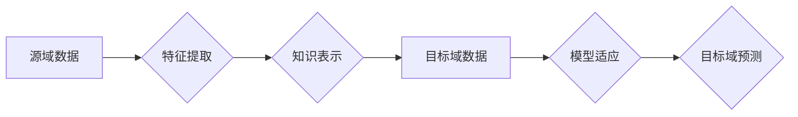

> 深度迁移学习，知识转移，跨域学习，特征提取，模型适应性，人工智能

## 1. 背景介绍

人工智能（AI）的蓬勃发展离不开海量数据的支持。然而，现实世界中，不同领域的数据往往具有不同的分布和特征，这使得训练一个通用的AI模型变得困难。例如，一个在图像识别领域训练的模型，可能无法直接应用于自然语言处理领域。

深度迁移学习（Deep Transfer Learning）应运而生，它旨在利用已训练好的模型在源域（源数据）上的知识，迁移到目标域（目标数据）中，从而提高目标域模型的性能，并减少对目标域数据的依赖。

迁移学习的优势在于：

* **提高效率：** 不需要从头开始训练模型，可以节省大量时间和计算资源。
* **提升性能：** 利用源域知识可以帮助目标域模型更快地收敛，并获得更好的性能。
* **解决数据稀缺问题：** 当目标域数据稀缺时，迁移学习可以利用源域数据进行知识迁移，弥补数据不足的缺陷。

## 2. 核心概念与联系

深度迁移学习的核心概念是**知识转移**。它通过学习源域和目标域之间的**映射关系**，将源域的知识迁移到目标域中。

**Mermaid 流程图：**



**核心概念解释：**

* **源域数据：** 已经训练好的模型所学习到的数据。
* **特征提取：** 从源域数据中提取出具有泛化能力的特征。
* **知识表示：** 将提取出的特征表示为模型可以理解的形式。
* **目标域数据：** 需要进行预测或分类的数据。
* **模型适应：** 将源域的知识映射到目标域数据中，调整模型参数。
* **目标域预测：** 利用迁移学习后的模型对目标域数据进行预测或分类。

## 3. 核心算法原理 & 具体操作步骤

### 3.1  算法原理概述

深度迁移学习的算法原理主要基于以下几个方面：

* **特征共享：** 利用源域模型已经学习到的特征，作为目标域模型的初始特征。
* **参数调整：** 对源域模型的参数进行微调，使其适应目标域的数据分布。
* **领域自适应：** 通过学习源域和目标域之间的差异，对模型进行领域自适应调整。

### 3.2  算法步骤详解

1. **预训练模型选择：** 选择一个在源域数据上已经训练好的模型，例如ImageNet上的预训练卷积神经网络（CNN）。
2. **特征提取：** 将源域模型的特征提取层冻结，并将目标域数据输入到特征提取层中，提取目标域数据对应的特征。
3. **分类器训练：** 在提取到的特征的基础上，训练一个新的分类器，用于对目标域数据进行分类。
4. **参数微调：** 对源域模型的部分参数进行微调，以进一步提高目标域模型的性能。

### 3.3  算法优缺点

**优点：**

* 提高训练效率，减少训练时间和计算资源。
* 提升模型性能，尤其是在目标域数据稀缺的情况下。
* 能够推广到新的领域，提高模型的泛化能力。

**缺点：**

* 需要找到合适的源域模型，源域模型与目标域之间存在一定的差异。
* 需要进行参数微调，可能会增加训练复杂度。
* 迁移学习效果取决于源域和目标域之间的相似性。

### 3.4  算法应用领域

深度迁移学习在各个领域都有广泛的应用，例如：

* **图像识别：** 将预训练的图像识别模型迁移到新的图像识别任务中，例如医学图像识别、目标检测等。
* **自然语言处理：** 将预训练的语言模型迁移到新的自然语言处理任务中，例如文本分类、机器翻译等。
* **语音识别：** 将预训练的语音识别模型迁移到新的语音识别任务中，例如方言识别、语音增强等。

## 4. 数学模型和公式 & 详细讲解 & 举例说明

### 4.1  数学模型构建

深度迁移学习的数学模型通常基于**损失函数**和**优化算法**。

**损失函数：** 用于衡量模型预测结果与真实结果之间的差异。常见的损失函数包括交叉熵损失函数、均方误差损失函数等。

**优化算法：** 用于更新模型参数，使其能够最小化损失函数。常见的优化算法包括梯度下降算法、Adam算法等。

### 4.2  公式推导过程

假设源域数据为 X_s，目标域数据为 X_t，源域标签为 y_s，目标域标签为 y_t。

**损失函数：**

$$
L = L_{s}(f(X_s, \theta_s)) + L_{t}(f(X_t, \theta_t))
$$

其中：

* $L_s$ 和 $L_t$ 分别为源域和目标域的损失函数。
* $f(X, \theta)$ 为模型在输入数据 X 上的预测结果，参数为 $\theta$。
* $\theta_s$ 和 $\theta_t$ 分别为源域模型和目标域模型的参数。

**优化目标：**

$$
\min_{\theta_s, \theta_t} L
$$

### 4.3  案例分析与讲解

例如，在图像分类任务中，我们可以使用预训练的ImageNet模型作为源域模型，并将目标域数据作为目标域数据进行迁移学习。

在训练过程中，我们可以使用源域数据和目标域数据分别计算损失函数，并将其加权求和作为总损失函数。

通过优化总损失函数，可以使得源域模型的参数 $\theta_s$ 能够更好地适应目标域数据，从而提高目标域模型的分类性能。

## 5. 项目实践：代码实例和详细解释说明

### 5.1  开发环境搭建

* Python 3.6+
* TensorFlow 2.0+
* PyTorch 1.0+
* CUDA 10.0+

### 5.2  源代码详细实现

```python
# 导入必要的库
import tensorflow as tf

# 定义迁移学习模型
class TransferLearningModel(tf.keras.Model):
    def __init__(self, base_model, num_classes):
        super(TransferLearningModel, self).__init__()
        self.base_model = base_model
        self.fc = tf.keras.layers.Dense(num_classes, activation='softmax')

    def call(self, inputs):
        x = self.base_model(inputs, training=False)
        x = tf.keras.layers.GlobalAveragePooling2D()(x)
        outputs = self.fc(x)
        return outputs

# 加载预训练模型
base_model = tf.keras.applications.ResNet50(weights='imagenet', include_top=False, input_shape=(224, 224, 3))

# 创建迁移学习模型
model = TransferLearningModel(base_model, num_classes=10)

# 编译模型
model.compile(optimizer='adam', loss='categorical_crossentropy', metrics=['accuracy'])

# 训练模型
model.fit(x_train, y_train, epochs=10, validation_data=(x_val, y_val))
```

### 5.3  代码解读与分析

* **模型定义：** 定义了一个迁移学习模型，包含预训练的ResNet50模型和一个全连接层。
* **预训练模型加载：** 加载预训练的ResNet50模型，并冻结其所有层。
* **模型创建：** 创建迁移学习模型，并将预训练模型作为基础模型。
* **模型编译：** 编译模型，选择优化器、损失函数和评价指标。
* **模型训练：** 使用训练数据训练模型，并使用验证数据评估模型性能。

### 5.4  运行结果展示

训练完成后，可以将模型应用于目标域数据进行预测。

## 6. 实际应用场景

### 6.1  医疗图像分析

迁移学习可以用于将预训练的图像识别模型迁移到医学图像分析任务中，例如肿瘤检测、器官分割等。

### 6.2  自然语言理解

迁移学习可以用于将预训练的语言模型迁移到自然语言理解任务中，例如文本分类、情感分析、问答系统等。

### 6.3  语音识别

迁移学习可以用于将预训练的语音识别模型迁移到新的语音识别任务中，例如方言识别、语音增强等。

### 6.4  未来应用展望

随着深度学习技术的不断发展，迁移学习将在更多领域得到应用，例如：

* **个性化推荐：** 利用用户行为数据进行迁移学习，个性化推荐商品或服务。
* **自动驾驶：** 利用预训练的图像识别模型迁移到自动驾驶场景中，提高车辆的感知能力。
* **机器人控制：** 利用迁移学习，提高机器人对不同环境的适应能力。

## 7. 工具和资源推荐

### 7.1  学习资源推荐

* **书籍：**
    * Deep Learning by Ian Goodfellow, Yoshua Bengio, and Aaron Courville
    * Transfer Learning in Machine Learning by Sinno Jernite
* **课程：**
    * Stanford CS231n: Convolutional Neural Networks for Visual Recognition
    * Deep Learning Specialization by Andrew Ng

### 7.2  开发工具推荐

* **TensorFlow:** https://www.tensorflow.org/
* **PyTorch:** https://pytorch.org/
* **Keras:** https://keras.io/

### 7.3  相关论文推荐

* **ImageNet Classification with Deep Convolutional Neural Networks** by Alex Krizhevsky, Ilya Sutskever, and Geoffrey E. Hinton
* **Domain Adaptation for Large-Scale Image Recognition** by Tong He, et al.
* **Transfer Learning for Natural Language Processing** by Jason Weston, et al.

## 8. 总结：未来发展趋势与挑战

### 8.1  研究成果总结

深度迁移学习在近年来取得了显著的进展，在各个领域都取得了令人瞩目的成果。

### 8.2  未来发展趋势

* **更有效的迁移学习算法：** 研究更有效的迁移学习算法，提高迁移学习的效率和性能。
* **跨模态迁移学习：** 研究跨模态迁移学习，将不同模态的数据进行迁移学习，例如图像和文本的迁移学习。
* **联邦迁移学习：** 研究联邦迁移学习，在不共享原始数据的情况下进行迁移学习，保护用户隐私。

### 8.3  面临的挑战

* **领域差异性：** 源域和目标域之间存在差异，如何有效地解决领域差异性仍然是一个挑战。
* **数据稀缺性：** 目标域数据可能稀缺，如何利用有限的目标域数据进行迁移学习仍然是一个挑战。
* **可解释性：** 迁移学习模型的决策过程往往难以解释，如何提高迁移学习模型的可解释性仍然是一个挑战。

### 8.4  研究展望

未来，深度迁移学习将继续朝着更有效、更通用、更可解释的方向发展，并在更多领域发挥重要作用。


## 9. 附录：常见问题与解答

**Q1：迁移学习与传统机器学习有什么区别？**

**A1：** 传统的机器学习模型需要从头开始训练，而迁移学习可以利用已训练好的模型的知识，减少训练时间和数据需求。

**Q2：如何选择合适的源域模型？**

**A2：** 选择源域模型时，需要考虑源域和目标域之间的相似性。一般来说，源域模型和目标域数据分布越相似，迁移学习效果越好。

**Q3：迁移学习的性能受哪些因素影响？**

**A3：** 迁移学习的性能受以下因素