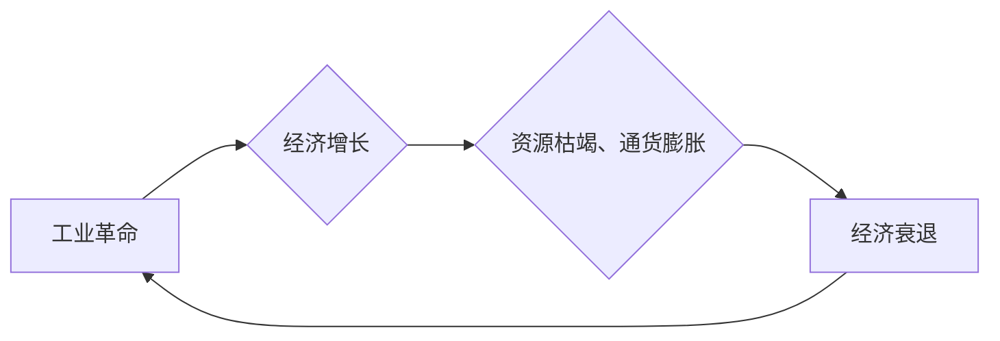

>  工业革命、经济增长周期、技术创新、数字化转型、人工智能

## 1. 背景介绍

人类社会的发展历程，可以被概括为一系列由技术创新驱动的工业革命。每一次工业革命都带来了前所未有的生产力跃迁，深刻地改变了社会经济结构，并催生了新的产业和商业模式。从蒸汽机到电力，再到互联网和人工智能，每一次革命都标志着人类文明迈向新的阶段。

然而，每一次工业革命也伴随着经济增长周期，即经济繁荣与衰退的交替。这些周期并非随机事件，而是与技术创新、资本积累、人口结构和消费需求等因素相互作用的结果。理解工业革命与经济增长周期之间的关系，对于预测未来经济趋势、制定政策应对挑战，以及把握科技发展带来的机遇具有重要意义。

## 2. 核心概念与联系

### 2.1  工业革命

工业革命是指以新技术为驱动的社会生产方式的重大变革。它通常伴随着以下特征：

* **新技术的出现和应用:** 例如蒸汽机、电力、互联网、人工智能等。
* **生产力的显著提高:** 新技术提高了生产效率，降低了生产成本，促进了经济增长。
* **社会经济结构的重组:** 新技术改变了传统的生产方式和劳动分工，催生了新的产业和职业。
* **生活方式的转变:** 新技术改善了人们的生活水平，改变了人们的消费习惯和社会交往方式。

### 2.2  经济增长周期

经济增长周期是指经济活动在一段时间内呈现波动性的现象，通常包括扩张期、顶峰期、衰退期和低谷期四个阶段。

* **扩张期:** 经济活动快速增长，就业率上升，物价上涨。
* **顶峰期:** 经济增长放缓，通货膨胀压力加大，投资意愿下降。
* **衰退期:** 经济活动收缩，失业率上升，物价下跌。
* **低谷期:** 经济活动处于最低点，企业倒闭，社会矛盾加剧。

### 2.3  联系

工业革命与经济增长周期之间存在着密切的联系。每一次工业革命都推动了经济的快速增长，但也带来了经济周期性的波动。

* **工业革命的推动作用:** 新技术带来的生产力跃迁，刺激了经济增长，拉动了消费需求，促进了投资和创新。
* **经济周期性的影响:** 经济增长过快会导致资源枯竭、通货膨胀等问题，最终导致经济衰退。而经济衰退则会抑制技术创新和投资，阻碍经济复苏。

**Mermaid 流程图**



## 3. 核心算法原理 & 具体操作步骤

### 3.1  算法原理概述

为了更好地理解工业革命与经济增长周期之间的关系，我们可以借鉴经济学中的增长模型，例如索洛模型。索洛模型认为，经济增长的主要驱动力是生产要素的投入和技术进步。

* **生产要素投入:** 包括劳动力、资本和土地等。
* **技术进步:** 指生产要素的利用效率提高，以及新技术的应用。

### 3.2  算法步骤详解

1. **收集数据:** 收集历史数据，包括生产要素投入、技术进步、经济增长率等指标。
2. **建立模型:** 根据索洛模型，建立一个数学模型，描述经济增长与生产要素投入和技术进步之间的关系。
3. **参数估计:** 利用统计方法，估计模型中的参数。
4. **预测分析:** 将模型应用于未来数据，预测未来经济增长趋势。

### 3.3  算法优缺点

* **优点:** 能够量化经济增长因素，预测未来经济趋势。
* **缺点:** 模型过于简化，无法完全反映经济的复杂性。

### 3.4  算法应用领域

* **宏观经济预测:** 预测经济增长率、通货膨胀率等宏观经济指标。
* **产业政策制定:** 为产业发展制定政策建议。
* **投资决策:** 为企业投资决策提供参考。

## 4. 数学模型和公式 & 详细讲解 & 举例说明

### 4.1  数学模型构建

索洛模型的基本公式如下：

$$
y_t = A_t K_t^{\alpha} L_t^{1-\alpha}
$$

其中：

* $y_t$：t时刻的经济产出
* $A_t$：t时刻的技术水平
* $K_t$：t时刻的资本存量
* $L_t$：t时刻的劳动力
* $\alpha$：资本的生产函数弹性

### 4.2  公式推导过程

索洛模型的推导过程基于以下假设：

* **生产函数:** 经济产出是资本和劳动力投入的函数。
* **技术进步:** 技术水平随着时间推移不断提高。
* **资本和劳动力投入:** 资本和劳动力投入随着时间推移不断增加。

### 4.3  案例分析与讲解

假设一个国家在某个时间点，其技术水平为 $A_0$，资本存量为 $K_0$，劳动力为 $L_0$，资本的生产函数弹性为 $\alpha = 0.3$。如果该国的技术水平每年提高 2%，资本存量每年增长 3%，劳动力每年增长 1%，那么我们可以利用索洛模型计算该国未来经济产出的增长率。

## 5. 项目实践：代码实例和详细解释说明

### 5.1  开发环境搭建

* **编程语言:** Python
* **库依赖:** NumPy, Pandas, Matplotlib

### 5.2  源代码详细实现

```python
import numpy as np
import pandas as pd
import matplotlib.pyplot as plt

# 设定模型参数
alpha = 0.3
A0 = 1
K0 = 1
L0 = 1
growth_rate_A = 0.02
growth_rate_K = 0.03
growth_rate_L = 0.01

# 计算未来经济产出
years = np.arange(1, 101)
A = A0 * (1 + growth_rate_A)**years
K = K0 * (1 + growth_rate_K)**years
L = L0 * (1 + growth_rate_L)**years
y = A * K**alpha * L**(1-alpha)

# 绘制图表
plt.plot(years, y)
plt.xlabel('年份')
plt.ylabel('经济产出')
plt.title('经济增长预测')
plt.show()
```

### 5.3  代码解读与分析

这段代码首先设定了索洛模型的参数，包括资本的生产函数弹性、初始技术水平、初始资本存量和初始劳动力。然后，它计算了未来几年技术水平、资本存量和劳动力增长率，并利用索洛模型公式计算了未来经济产出的增长率。最后，它绘制了经济产出随时间变化的图表。

### 5.4  运行结果展示

运行代码后，会生成一个图表，显示经济产出随时间推移的增长趋势。

## 6. 实际应用场景

### 6.1  宏观经济预测

政府和央行可以使用索洛模型预测未来经济增长率，制定相应的货币和财政政策。

### 6.2  产业政策制定

政府可以使用索洛模型分析不同产业的技术进步和资本投入情况，制定针对性的产业政策，促进经济结构调整和产业升级。

### 6.3  企业投资决策

企业可以使用索洛模型评估不同投资项目的风险和回报，做出更明智的投资决策。

### 6.4  未来应用展望

随着人工智能和大数据的快速发展，索洛模型可以进一步改进，更加准确地预测经济增长趋势，并为决策者提供更精准的建议。

## 7. 工具和资源推荐

### 7.1  学习资源推荐

* **书籍:**
    * 《经济增长理论》
    * 《宏观经济学》
* **在线课程:**
    * Coursera: 经济增长
    * edX: 宏观经济学

### 7.2  开发工具推荐

* **编程语言:** Python
* **库依赖:** NumPy, Pandas, Matplotlib

### 7.3  相关论文推荐

* **索洛模型:** Robert M. Solow, "A Contribution to the Theory of Economic Growth," Quarterly Journal of Economics, 1956.
* **经济增长模型:** Paul Romer, "Endogenous Technological Change," Journal of Political Economy, 1990.

## 8. 总结：未来发展趋势与挑战

### 8.1  研究成果总结

三次工业革命深刻地改变了人类社会，推动了经济增长和技术进步。索洛模型等经济增长模型为理解工业革命与经济增长周期提供了理论框架。

### 8.2  未来发展趋势

* **人工智能与经济增长:** 人工智能将进一步推动生产力跃迁，加速经济增长。
* **可持续发展与经济增长:** 应对气候变化和资源枯竭等挑战，实现可持续发展与经济增长的协调发展。
* **数字经济与经济增长:** 数字经济将成为未来经济增长的主要引擎。

### 8.3  面临的挑战

* **技术失衡:** 技术进步可能导致就业失衡，加剧社会不平等。
* **环境问题:** 工业革命带来的环境污染和资源消耗需要得到有效解决。
* **全球化与经济增长:** 全球化带来的竞争和合作挑战需要得到妥善应对。

### 8.4  研究展望

未来研究需要更加深入地探讨人工智能与经济增长的关系，研究可持续发展与经济增长的协调发展机制，以及数字经济对经济增长的影响。

## 9. 附录：常见问题与解答

### 9.1  问题一：索洛模型是否能够准确预测未来经济增长？

### 9.2  问题二：工业革命对环境有什么影响？

### 9.3  问题三：人工智能将如何改变未来经济？


作者：禅与计算机程序设计艺术 / Zen and the Art of Computer Programming 
<end_of_turn>