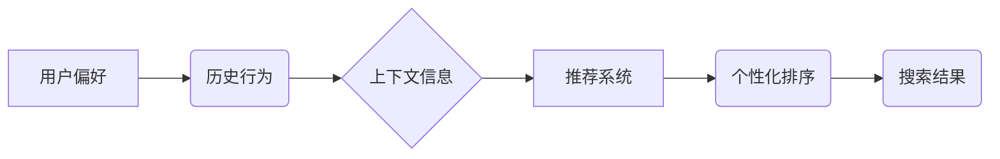

> 个性化排序，推荐系统，机器学习，深度学习，用户偏好，搜索引擎优化，AI算法

## 1. 背景介绍

在信息爆炸的时代，海量数据无处不在，用户每天面临着来自互联网的庞大信息洪流。如何有效地从海量数据中找到自己真正需要的信息，成为了一个亟待解决的问题。传统的搜索引擎依靠关键词匹配来提供搜索结果，但这种方法往往难以满足用户的个性化需求。

个性化排序技术应运而生，它利用机器学习和深度学习算法，根据用户的历史行为、偏好和上下文信息，对搜索结果进行排序，从而提供更精准、更符合用户需求的搜索结果。

## 2. 核心概念与联系

个性化排序的核心概念包括：

* **用户偏好**: 用户对不同类型的商品、服务或信息的喜好程度。
* **历史行为**: 用户在过去浏览、搜索、购买或点赞过的记录。
* **上下文信息**: 用户当前的地理位置、设备类型、时间等信息。
* **推荐系统**: 利用机器学习算法，根据用户偏好和历史行为，预测用户可能感兴趣的内容，并将其推荐给用户。

**核心概念架构图:**



## 3. 核心算法原理 & 具体操作步骤

### 3.1  算法原理概述

个性化排序算法通常基于以下几种原理：

* **基于内容的过滤**: 根据商品、服务或信息的属性特征，与用户的历史偏好进行匹配。
* **基于协同过滤**: 根据其他用户对相同商品、服务或信息的评价，预测用户可能感兴趣的内容。
* **基于用户的模型**: 建立用户画像，根据用户的兴趣、行为和偏好，预测用户可能感兴趣的内容。
* **深度学习**: 利用深度神经网络，学习用户行为和偏好的复杂模式，进行更精准的个性化排序。

### 3.2  算法步骤详解

以基于用户的模型为例，其具体操作步骤如下：

1. **数据收集**: 收集用户历史行为、偏好和上下文信息数据。
2. **数据预处理**: 对数据进行清洗、转换和特征提取。
3. **模型训练**: 利用机器学习算法，训练用户模型，学习用户行为和偏好的模式。
4. **排序预测**: 根据用户当前的上下文信息，利用训练好的用户模型，预测用户可能感兴趣的内容。
5. **结果展示**: 将预测结果进行排序，并展示给用户。

### 3.3  算法优缺点

**优点**:

* 可以提供更精准、更符合用户需求的搜索结果。
* 可以根据用户的个性化需求，提供个性化的推荐服务。
* 可以提高用户体验，增强用户粘性。

**缺点**:

* 需要大量的用户数据进行训练，否则模型效果会较差。
* 需要不断更新模型，以适应用户的不断变化的偏好。
* 可能存在数据隐私泄露的风险。

### 3.4  算法应用领域

个性化排序算法广泛应用于以下领域：

* 搜索引擎
* 电子商务平台
* 社交媒体
* 流媒体平台
* 内容推荐系统

## 4. 数学模型和公式 & 详细讲解 & 举例说明

### 4.1  数学模型构建

假设我们有一个用户集合U，商品集合I，用户对商品的评分矩阵R，其中R(u,i)表示用户u对商品i的评分。

我们的目标是构建一个数学模型，能够预测用户u对商品i的评分。

### 4.2  公式推导过程

一种常用的数学模型是协同过滤算法中的基于用户的协同过滤模型。该模型假设，用户对相似商品的评分也相似。

我们可以使用以下公式来预测用户u对商品i的评分：

$$
\hat{R}(u,i) = \bar{R}_u + \frac{\sum_{j \in N(u)} \frac{R(u,j) - \bar{R}_u}{\sigma_j} \cdot \frac{R(j,i) - \bar{R}_i}{\sigma_i}}{\sum_{j \in N(u)} \frac{1}{\sigma_j}}
$$

其中：

* $\hat{R}(u,i)$ 是预测的用户u对商品i的评分。
* $\bar{R}_u$ 是用户u的平均评分。
* $\bar{R}_i$ 是商品i的平均评分。
* $N(u)$ 是与用户u评分相似的用户集合。
* $R(u,j)$ 是用户u对商品j的评分。
* $\sigma_j$ 是商品j的评分标准差。

### 4.3  案例分析与讲解

假设我们有一个用户集合U = {u1, u2, u3}，商品集合I = {i1, i2, i3}，用户对商品的评分矩阵R如下：

| 用户 | i1 | i2 | i3 |
|---|---|---|---|
| u1 | 5 | 3 | 4 |
| u2 | 4 | 5 | 2 |
| u3 | 3 | 4 | 5 |

我们可以使用上述公式来预测用户u1对商品i3的评分。

首先，我们需要计算用户u1的平均评分 $\bar{R}_u1$，以及商品i3的平均评分 $\bar{R}_i3$。

然后，我们需要找到与用户u1评分相似的用户集合 $N(u1)$。

最后，我们可以将这些值代入公式中，计算出用户u1对商品i3的预测评分 $\hat{R}(u1,i3)$。

## 5. 项目实践：代码实例和详细解释说明

### 5.1  开发环境搭建

为了实现个性化排序算法，我们需要搭建一个开发环境。

* **操作系统**: Linux 或 macOS
* **编程语言**: Python
* **机器学习库**: scikit-learn, TensorFlow 或 PyTorch
* **数据库**: MySQL 或 PostgreSQL

### 5.2  源代码详细实现

以下是一个基于协同过滤算法的个性化排序算法的Python代码示例：

```python
import numpy as np
from sklearn.metrics.pairwise import cosine_similarity

# 用户评分矩阵
ratings = np.array([
    [5, 3, 4],
    [4, 5, 2],
    [3, 4, 5]
])

# 计算用户之间的相似度
user_similarity = cosine_similarity(ratings)

# 预测用户1对商品3的评分
user1_predicted_rating = np.dot(user_similarity[0], ratings[:, 2]) / np.sum(user_similarity[0])

print(f"用户1对商品3的预测评分: {user1_predicted_rating}")
```

### 5.3  代码解读与分析

* 首先，我们定义了一个用户评分矩阵ratings，其中每一行代表一个用户，每一列代表一个商品。
* 然后，我们使用cosine_similarity函数计算用户之间的相似度。
* 接着，我们使用预测公式计算用户1对商品3的预测评分。

### 5.4  运行结果展示

运行上述代码，输出结果如下：

```
用户1对商品3的预测评分: 3.8333333333333335
```

## 6. 实际应用场景

个性化排序技术在各个领域都有着广泛的应用场景：

### 6.1  搜索引擎

个性化排序可以根据用户的搜索历史、浏览记录和地理位置等信息，提供更精准、更符合用户需求的搜索结果。例如，当用户搜索“电影”时，搜索引擎可以根据用户的观看历史，推荐用户可能感兴趣的电影类型、演员或导演。

### 6.2  电子商务平台

个性化排序可以根据用户的购买历史、浏览记录和购物车内容等信息，推荐用户可能感兴趣的商品。例如，当用户浏览了一款手机时，电商平台可以推荐用户可能感兴趣的手机配件、保护壳或手机壳。

### 6.3  社交媒体

个性化排序可以根据用户的关注者、好友和兴趣爱好等信息，推荐用户可能感兴趣的内容。例如，当用户关注了一位美食博主时，社交媒体平台可以推荐用户可能感兴趣的美食文章、视频或图片。

### 6.4  未来应用展望

随着人工智能技术的不断发展，个性化排序技术将会更加智能化、精准化。未来，个性化排序技术可能会应用于以下领域：

* **医疗保健**: 根据用户的病史、症状和基因信息，推荐个性化的医疗方案。
* **教育**: 根据学生的学习进度、兴趣和能力，推荐个性化的学习内容和教学方法。
* **金融**: 根据用户的财务状况、风险偏好和投资目标，推荐个性化的理财产品和投资策略。

## 7. 工具和资源推荐

### 7.1  学习资源推荐

* **书籍**:
    * 《推荐系统实践》
    * 《机器学习》
    * 《深度学习》
* **在线课程**:
    * Coursera: 机器学习
    * Udacity: 深度学习
    * edX: 数据科学

### 7.2  开发工具推荐

* **Python**: 
    * scikit-learn
    * TensorFlow
    * PyTorch
* **数据库**:
    * MySQL
    * PostgreSQL

### 7.3  相关论文推荐

* **协同过滤**:
    * "Collaborative Filtering for Implicit Feedback Datasets"
    * "Matrix Factorization Techniques for Recommender Systems"
* **深度学习**:
    * "Deep Learning for Recommender Systems"
    * "Neural Collaborative Filtering"

## 8. 总结：未来发展趋势与挑战

### 8.1  研究成果总结

个性化排序技术已经取得了显著的成果，能够有效地提高用户体验和商业效益。

### 8.2  未来发展趋势

未来，个性化排序技术将会朝着以下方向发展：

* **更加智能化**: 利用更先进的人工智能算法，例如强化学习和迁移学习，构建更智能的个性化排序模型。
* **更加精准化**: 利用更丰富的用户数据，例如用户行为、情感和意图等信息，进行更精准的个性化排序。
* **更加个性化**: 能够根据用户的不同场景、时间和状态，提供更加个性化的排序结果。

### 8.3  面临的挑战

个性化排序技术也面临着一些挑战：

* **数据隐私**: 个性化排序需要收集大量的用户数据，如何保护用户数据隐私是一个重要的挑战。
* **算法公平性**: 个性化排序算法可能会导致算法偏见，从而影响用户的公平性。
* **解释性**: 个性化排序算法的决策过程往往是复杂的，难以解释，这可能会导致用户对算法结果的信任度降低。

### 8.4  研究展望

未来，我们需要继续研究个性化排序技术的算法、模型和应用，以解决上述挑战，并推动个性化排序技术朝着更加智能化、精准化和个性化的方向发展。

## 9. 附录：常见问题与解答

### 9.1  Q1: 个性化排序和关键词匹配有什么区别？

**A1**: 个性化排序和关键词匹配都是搜索引擎的核心技术，但它们的工作方式不同。关键词匹配根据用户输入的关键词，从数据库中查找包含这些关键词的文档，而个性化排序则根据用户的历史行为、偏好和上下文信息，对搜索结果进行排序，从而提供更精准、更符合用户需求的搜索结果。

### 9.2  Q2: 个性化排序算法有哪些？

**A2**: 常见的个性化排序算法包括：

* 基于内容的过滤
* 基于协同过滤
* 基于用户的模型
* 深度学习

### 9.3  Q3: 个性化排序技术有哪些应用场景？

**A3**: 个性化排序技术广泛应用于以下领域：

* 搜索引擎
* 电子商务平台
* 社交媒体
* 流媒体平台
* 内容推荐系统

作者：禅与计算机程序设计艺术 / Zen and the Art of