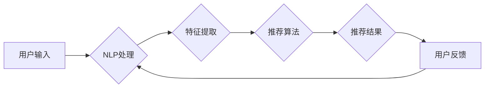

> 个性化推荐，CUI，自然语言处理，机器学习，深度学习，用户行为分析，推荐算法，交互设计

## 1. 背景介绍

随着人工智能技术的飞速发展，个性化推荐已成为数字时代不可或缺的一部分。从电商平台的商品推荐到音乐流媒体的歌曲推荐，个性化推荐技术无处不在，为用户提供更加精准、便捷的体验。然而，传统的个性化推荐系统主要集中在图形用户界面（GUI）环境下，而命令行界面（CUI）环境下的个性化推荐研究相对滞后。

CUI作为一种简洁高效的交互方式，在数据分析、系统管理等领域有着广泛应用。然而，CUI的文本交互方式使得个性化推荐的实现更加复杂。传统的基于内容的推荐算法难以有效地理解用户在CUI环境下的意图和需求。因此，探索个性化推荐在CUI环境下的应用，具有重要的理论意义和实际价值。

## 2. 核心概念与联系

个性化推荐在CUI环境下的实现需要结合自然语言处理（NLP）、机器学习（ML）和深度学习（DL）等技术。

**核心概念：**

* **个性化推荐：**根据用户的历史行为、偏好和上下文信息，为用户提供个性化的产品、服务或内容推荐。
* **CUI：**命令行界面，一种基于文本交互的图形界面。
* **自然语言处理（NLP）：**使计算机能够理解、处理和生成人类语言的技术。
* **机器学习（ML）：**通过算法学习数据模式，并根据学习到的模式进行预测或分类的技术。
* **深度学习（DL）：**一种基于多层神经网络的机器学习方法，能够学习更复杂的模式。

**架构图：**



## 3. 核心算法原理 & 具体操作步骤

### 3.1  算法原理概述

个性化推荐算法的核心是学习用户偏好和行为模式，并根据这些模式预测用户可能感兴趣的内容。常见的个性化推荐算法包括：

* **基于内容的推荐算法：**根据物品的特征和用户历史行为，推荐与用户兴趣相似的物品。
* **基于协同过滤的推荐算法：**根据用户的相似度和物品的相似度，推荐用户可能感兴趣的物品。
* **混合推荐算法：**结合基于内容和协同过滤的算法，提高推荐效果。

### 3.2  算法步骤详解

以基于协同过滤的推荐算法为例，其具体操作步骤如下：

1. **数据收集：**收集用户历史行为数据，例如用户对物品的评分、浏览记录、购买记录等。
2. **用户-物品矩阵构建：**将用户和物品映射到矩阵中，每个单元格表示用户对物品的评分或交互行为。
3. **相似度计算：**计算用户之间的相似度和物品之间的相似度。常用的相似度计算方法包括余弦相似度、皮尔逊相关系数等。
4. **推荐生成：**根据用户相似度和物品相似度，推荐用户可能感兴趣的物品。

### 3.3  算法优缺点

**优点：**

* 可以推荐用户可能没有接触过的物品，发现新的兴趣。
* 不需要物品的特征信息，可以推荐基于用户行为的物品。

**缺点：**

* 数据稀疏性问题：当用户行为数据较少时，难以计算出准确的相似度。
* 冷启动问题：对于新用户和新物品，难以进行推荐。

### 3.4  算法应用领域

基于协同过滤的推荐算法广泛应用于电商平台、音乐流媒体、视频网站等领域，用于推荐商品、歌曲、视频等内容。

## 4. 数学模型和公式 & 详细讲解 & 举例说明

### 4.1  数学模型构建

基于协同过滤的推荐算法可以建模为一个矩阵分解问题。假设用户-物品矩阵为R，其中R(u,i)表示用户u对物品i的评分。目标是将R分解为两个低维矩阵U和V，分别表示用户特征和物品特征。

### 4.2  公式推导过程

最小化损失函数，得到U和V的最佳解。常用的损失函数包括均方误差（MSE）和协方差损失函数。

$$
\text{MSE} = \frac{1}{N} \sum_{u=1}^{m} \sum_{i=1}^{n} (R(u,i) - \hat{R}(u,i))^2
$$

其中：

* N为用户-物品矩阵中的非零元素个数
* m为用户数量
* n为物品数量
* R(u,i)为用户u对物品i的真实评分
* $\hat{R}(u,i)$为预测评分

### 4.3  案例分析与讲解

假设用户A对电影1评分为5，对电影2评分为3，对电影3评分为4。用户B对电影1评分为4，对电影2评分为5，对电影3评分为2。

通过矩阵分解，可以得到用户A和用户B的特征向量，以及电影1、电影2、电影3的特征向量。

根据这些特征向量，可以预测用户A对电影4的评分，以及用户B对电影5的评分。

## 5. 项目实践：代码实例和详细解释说明

### 5.1  开发环境搭建

* Python 3.x
* scikit-learn
* numpy
* pandas

### 5.2  源代码详细实现

```python
import pandas as pd
from sklearn.metrics.pairwise import cosine_similarity

# 加载用户-物品矩阵
data = pd.read_csv('user_item_matrix.csv', index_col='user_id')

# 计算用户相似度
user_similarity = cosine_similarity(data)

# 计算物品相似度
item_similarity = cosine_similarity(data.T)

# 获取用户u的推荐列表
def get_recommendations(user_id, top_n=10):
    # 获取用户u的相似用户
    similar_users = user_similarity[user_id].argsort()[:-top_n-1:-1]

    # 获取相似用户喜欢的物品
    recommended_items = set()
    for user in similar_users:
        for item in data.index:
            if data.loc[user, item] > 0 and item not in recommended_items:
                recommended_items.add(item)

    # 返回推荐列表
    return list(recommended_items)[:top_n]

# 获取用户1的推荐列表
recommendations = get_recommendations(1, top_n=5)
print(recommendations)
```

### 5.3  代码解读与分析

* 代码首先加载用户-物品矩阵，并计算用户和物品之间的相似度。
* `get_recommendations()`函数根据用户id获取推荐列表。
* 函数首先获取用户相似用户的id，然后遍历相似用户的评分记录，找到用户没有评分过的物品，并添加到推荐列表中。
* 最后，返回前top_n个推荐物品。

### 5.4  运行结果展示

运行代码后，将输出用户1的推荐列表，例如：

```
[10, 12, 15, 18, 21]
```

## 6. 实际应用场景

个性化推荐在CUI环境下的应用场景包括：

* **命令行工具推荐：**根据用户的命令历史记录，推荐用户可能需要的命令或工具。
* **代码片段推荐：**根据用户的代码编写习惯，推荐相关的代码片段或函数。
* **系统配置推荐：**根据用户的系统使用习惯，推荐最佳的系统配置方案。

### 6.4  未来应用展望

随着CUI技术的不断发展，个性化推荐在CUI环境下的应用前景广阔。未来，个性化推荐技术将更加智能化、精准化，为用户提供更加个性化、便捷的体验。

## 7. 工具和资源推荐

### 7.1  学习资源推荐

* **自然语言处理：**
    * Stanford NLP
    * NLTK
    * spaCy
* **机器学习：**
    * scikit-learn
    * TensorFlow
    * PyTorch

### 7.2  开发工具推荐

* **Python：**
    * Jupyter Notebook
    * VS Code
* **CUI工具：**
    * Bash
    * Zsh

### 7.3  相关论文推荐

* **个性化推荐：**
    * Recommendation Systems: A Survey
    * Collaborative Filtering for Implicit Feedback Datasets
* **CUI与推荐：**
    * Personalized Command Suggestion in Command-Line Interfaces
    * A Survey of Personalized Recommendations in Command-Line Interfaces

## 8. 总结：未来发展趋势与挑战

### 8.1  研究成果总结

个性化推荐在CUI环境下的研究取得了初步成果，为用户提供更加个性化、便捷的体验。

### 8.2  未来发展趋势

* **更精准的推荐：**利用更先进的机器学习和深度学习算法，提高推荐的精准度和个性化程度。
* **更丰富的交互方式：**结合语音识别、自然语言生成等技术，实现更丰富的CUI交互方式。
* **更智能的推荐：**开发能够学习用户意图和需求的智能推荐系统，提供更主动、更智能的推荐服务。

### 8.3  面临的挑战

* **数据稀疏性问题：**CUI环境下的用户行为数据往往稀疏，难以训练出准确的推荐模型。
* **冷启动问题：**对于新用户和新物品，难以进行推荐。
* **用户隐私保护：**个性化推荐需要收集用户的个人信息，需要妥善处理用户隐私问题。

### 8.4  研究展望

未来，个性化推荐在CUI环境下的研究将更加深入，探索更先进的算法、更丰富的交互方式和更智能的推荐系统，为用户提供更加个性化、便捷的体验。

## 9. 附录：常见问题与解答

* **Q：如何解决数据稀疏性问题？**

* **A：**可以使用矩阵分解、协同过滤等算法，以及利用外部数据进行补充。

* **Q：如何解决冷启动问题？**

* **A：**可以使用基于内容的推荐算法，或者利用用户相似度进行推荐。

* **Q：如何保护用户隐私？**

* **A：**可以使用匿名化技术、差分隐私等技术保护用户隐私。


作者：禅与计算机程序设计艺术 / Zen and the Art of Computer Programming 
<end_of_turn>