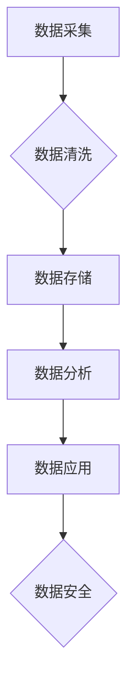

> 人工智能，数据管理，创业，策略，方案，数据安全，数据隐私，数据治理，数据分析，机器学习

## 1. 背景介绍

在当今数据爆炸的时代，数据已成为企业最重要的资产之一。人工智能（AI）技术的快速发展，为数据分析、挖掘和应用提供了强大的工具。然而，对于创业公司来说，如何有效地管理和利用数据，是实现可持续发展的重要挑战。

创业公司通常面临着资源有限、团队规模小、技术能力不足等问题。在数据管理方面，他们需要制定合理的策略和方案，以确保数据的质量、安全性和隐私性，同时最大限度地挖掘数据的价值。

## 2. 核心概念与联系

**2.1 数据管理的核心概念**

数据管理是指对数据的整个生命周期进行规划、组织、控制和维护的过程。它包括数据采集、存储、处理、分析、共享和安全等多个方面。

**2.2 人工智能与数据管理的联系**

人工智能技术可以有效地提升数据管理的效率和智能化水平。例如：

* **数据自动采集和清洗:** AI算法可以自动识别和提取数据，并进行清洗和转换，提高数据质量。
* **数据智能分析:** AI算法可以对海量数据进行分析，发现隐藏的模式和趋势，为企业决策提供支持。
* **数据安全保障:** AI技术可以用于识别和预防数据泄露，保障数据安全。

**2.3 数据管理策略与方案**

创业公司需要根据自身情况制定合理的策略和方案，以实现数据管理的目标。

**2.4 数据管理架构**

数据管理架构是指数据管理系统的设计和部署方式。常见的架构模式包括：

* **集中式架构:** 所有数据都存储在同一个中心数据库中。
* **分布式架构:** 数据分散存储在多个节点上，提高数据处理能力和容错性。
* **云计算架构:** 数据存储和处理在云平台上进行，降低成本和提高灵活性。

**Mermaid 流程图**



## 3. 核心算法原理 & 具体操作步骤

**3.1 算法原理概述**

数据管理的核心算法包括数据清洗、数据分类、数据聚类、数据关联分析等。这些算法利用数学模型和统计方法，对数据进行处理和分析，以提取有价值的信息。

**3.2 算法步骤详解**

* **数据清洗:** 
    1. 识别和处理缺失值、重复值和错误值。
    2. 转换数据格式，确保数据一致性。
    3. 标准化数据，使数据具有可比较性。
* **数据分类:** 
    1. 选择合适的分类算法，例如决策树、支持向量机等。
    2. 训练分类模型，使用已标记的数据集。
    3. 对新数据进行分类预测。
* **数据聚类:** 
    1. 选择合适的聚类算法，例如K-means、层次聚类等。
    2. 将数据划分为不同的类别，每个类别包含相似的样本。
    3. 分析聚类结果，发现数据中的潜在结构。
* **数据关联分析:** 
    1. 使用关联规则挖掘算法，例如Apriori算法等。
    2. 发现数据之间的关联关系，例如“购买A商品的人也喜欢购买B商品”。
    3. 利用关联规则进行市场营销和产品推荐。

**3.3 算法优缺点**

不同的算法具有不同的优缺点，需要根据实际情况选择合适的算法。

**3.4 算法应用领域**

数据管理算法广泛应用于各个领域，例如：

* **电商:** 商品推荐、用户画像、欺诈检测
* **金融:** 风险评估、信用评分、欺诈检测
* **医疗:** 疾病诊断、药物研发、患者管理
* **制造:** 预测性维护、质量控制、生产优化

## 4. 数学模型和公式 & 详细讲解 & 举例说明

**4.1 数学模型构建**

数据管理算法通常基于数学模型进行构建。例如，K-means聚类算法的数学模型是：

* **目标函数:** 最小化样本点到其所属聚类中心的距离的平方和。
* **迭代过程:** 
    1. 将样本点随机分配到不同的聚类中。
    2. 计算每个聚类中心的坐标。
    3. 将样本点重新分配到距离其最近的聚类中心。
    4. 重复步骤2和3，直到聚类中心不再变化。

**4.2 公式推导过程**

K-means算法的目标函数为：

$$J = \sum_{i=1}^{k} \sum_{x_j \in C_i} ||x_j - \mu_i||^2$$

其中：

* $J$ 是目标函数值。
* $k$ 是聚类数。
* $C_i$ 是第 $i$ 个聚类。
* $x_j$ 是第 $j$ 个样本点。
* $\mu_i$ 是第 $i$ 个聚类中心。

**4.3 案例分析与讲解**

假设我们有一组数据点，需要将其聚类成3个类别。我们可以使用K-means算法进行聚类。

1. 随机选择3个数据点作为初始聚类中心。
2. 将每个数据点分配到距离其最近的聚类中心。
3. 计算每个聚类中心的坐标。
4. 将每个数据点重新分配到距离其最近的聚类中心。
5. 重复步骤3和4，直到聚类中心不再变化。

最终，我们将得到3个聚类，每个聚类包含相似的样本点。

## 5. 项目实践：代码实例和详细解释说明

**5.1 开发环境搭建**

* 操作系统: Ubuntu 20.04
* Python 版本: 3.8
* 必要的库: pandas, numpy, scikit-learn

**5.2 源代码详细实现**

```python
import pandas as pd
from sklearn.cluster import KMeans

# 加载数据
data = pd.read_csv('data.csv')

# 选择特征列
features = data[['feature1', 'feature2', 'feature3']]

# 创建KMeans模型
kmeans = KMeans(n_clusters=3)

# 训练模型
kmeans.fit(features)

# 获取聚类标签
labels = kmeans.labels_

# 将聚类标签添加到数据中
data['cluster'] = labels

# 保存结果
data.to_csv('data_clustered.csv', index=False)
```

**5.3 代码解读与分析**

* 首先，我们加载数据并选择需要进行聚类的特征列。
* 然后，我们创建KMeans模型，并设置聚类数为3。
* 接着，我们训练模型，并将聚类标签添加到数据中。
* 最后，我们保存结果到CSV文件。

**5.4 运行结果展示**

运行代码后，我们将得到一个新的CSV文件，其中包含了聚类标签。我们可以使用可视化工具，例如matplotlib，来展示聚类结果。

## 6. 实际应用场景

**6.1 数据分析与挖掘**

* 识别客户群体，进行精准营销。
* 发现产品趋势，优化产品开发。
* 分析市场竞争，制定战略决策。

**6.2 数据安全与隐私保护**

* 检测数据泄露，防止数据丢失。
* 识别敏感信息，保护用户隐私。
* 确保数据合规性，避免法律风险。

**6.3 数据治理与管理**

* 建立数据标准，保证数据质量。
* 实现数据共享，提高数据利用率。
* 优化数据流程，提高数据管理效率。

**6.4 未来应用展望**

随着人工智能技术的不断发展，数据管理将更加智能化、自动化和个性化。未来，数据管理将更加注重数据可解释性、数据伦理和数据安全。

## 7. 工具和资源推荐

**7.1 学习资源推荐**

* **书籍:**
    * 《数据科学实战》
    * 《机器学习》
    * 《数据挖掘》
* **在线课程:**
    * Coursera
    * edX
    * Udacity

**7.2 开发工具推荐**

* **数据处理工具:**
    * pandas
    * numpy
* **机器学习库:**
    * scikit-learn
    * TensorFlow
    * PyTorch
* **数据可视化工具:**
    * matplotlib
    * seaborn

**7.3 相关论文推荐**

* 《K-means聚类算法》
* 《数据挖掘基本概念》
* 《人工智能伦理》

## 8. 总结：未来发展趋势与挑战

**8.1 研究成果总结**

本文介绍了人工智能创业数据管理的策略与方案，包括核心概念、算法原理、项目实践和实际应用场景。

**8.2 未来发展趋势**

* 数据管理将更加智能化、自动化和个性化。
* 数据可解释性、数据伦理和数据安全将更加重要。
* 数据管理将与其他技术，例如云计算、大数据和区块链，更加融合。

**8.3 面临的挑战**

* 数据质量问题
* 数据安全和隐私保护问题
* 数据管理人才短缺问题

**8.4 研究展望**

未来，我们将继续研究人工智能在数据管理领域的应用，探索更智能、更安全、更可持续的数据管理解决方案。

## 9. 附录：常见问题与解答

**9.1 如何选择合适的聚类算法？**

选择合适的聚类算法需要根据实际情况考虑，例如数据类型、数据规模、聚类目标等。

**9.2 如何保证数据安全和隐私？**

数据安全和隐私保护需要采取多方面的措施，例如数据加密、访问控制、数据匿名化等。

**9.3 如何提高数据管理效率？**

提高数据管理效率可以采用自动化、标准化和流程优化等方法。


作者：禅与计算机程序设计艺术 / Zen and the Art of Computer Programming 
<end_of_turn>