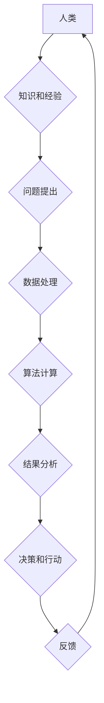

> 人类计算，计算模型，算法原理，数学模型，代码实现，实际应用，未来趋势

## 1. 背景介绍

随着人工智能技术的飞速发展，人类计算的概念逐渐成为研究热点。人类计算是指利用人类的认知能力和创造力，结合计算机技术，共同完成复杂任务的过程。它打破了传统计算机处理信息的方式，将人类的智慧融入到计算体系中，从而提升计算效率和解决问题的深度。

人类计算的应用场景日益广泛，涵盖了自然语言处理、图像识别、决策支持、创意设计等领域。例如，在自然语言处理领域，人类计算可以帮助机器更好地理解和生成人类语言，从而实现更精准的机器翻译、文本摘要和对话系统。在图像识别领域，人类计算可以帮助机器识别和理解图像中的复杂场景和物体，从而实现更准确的图像分类、目标检测和图像理解。

## 2. 核心概念与联系

**2.1 人类计算模型**

人类计算模型试图模拟人类的认知过程，将人类的思维方式和决策机制融入到计算系统中。常见的模型包括：

* **专家系统:** 基于人类专家的知识和经验，构建一个能够解决特定领域问题的知识库和推理系统。
* **案例库:** 收集和存储大量案例，并利用机器学习算法，从案例中学习和提取知识，用于解决新的问题。
* **群体智慧:** 利用多个人类参与者的集体智慧，通过协作和讨论，解决复杂问题。

**2.2 人类计算与计算机技术**

人类计算与计算机技术相互补充，共同推动计算能力的提升。

* **数据处理:** 计算机技术可以高效地处理海量数据，为人类计算提供数据支持。
* **算法设计:** 计算机技术可以设计和优化算法，提高人类计算的效率和准确性。
* **交互平台:** 计算机技术可以构建交互平台，方便人类与计算机进行交互，共同完成任务。

**2.3 人类计算的架构**



## 3. 核心算法原理 & 具体操作步骤

**3.1 算法原理概述**

人类计算的核心算法原理是模拟人类的认知过程，包括感知、理解、推理和决策等环节。常见的算法包括：

* **启发式算法:** 基于经验和直觉，寻找近似最优的解决方案。
* **模拟退火算法:** 随机搜索解空间，通过温度参数控制搜索过程，最终找到局部最优解。
* **遗传算法:** 模拟生物进化过程，通过选择、交叉和变异操作，不断优化解空间，找到全局最优解。

**3.2 算法步骤详解**

以启发式算法为例，其具体操作步骤如下：

1. **问题定义:** 明确问题的目标和约束条件。
2. **搜索空间构建:** 定义可能的解决方案空间。
3. **启发式函数设计:** 设计一个函数，用于评估每个解决方案的优劣。
4. **搜索策略选择:** 选择一种搜索策略，例如广度优先搜索或深度优先搜索。
5. **迭代搜索:** 按照搜索策略，不断探索解决方案空间，并评估每个解决方案的优劣。
6. **结果输出:** 选择最优的解决方案，并输出结果。

**3.3 算法优缺点**

* **优点:** 能够解决复杂问题，并找到近似最优的解决方案。
* **缺点:** 无法保证找到全局最优解，且算法效率可能较低。

**3.4 算法应用领域**

启发式算法广泛应用于人工智能、优化问题、机器学习等领域。例如，在路径规划领域，启发式算法可以帮助机器人找到最短路径；在组合优化问题领域，启发式算法可以帮助解决资源分配、调度等问题。

## 4. 数学模型和公式 & 详细讲解 & 举例说明

**4.1 数学模型构建**

人类计算可以抽象为一个数学模型，其中：

* **输入:** 人类提供的问题、知识和经验。
* **输出:** 计算结果和决策建议。
* **过程:** 算法处理输入数据，并根据人类的认知机制进行推理和决策。

**4.2 公式推导过程**

例如，在专家系统中，可以使用逻辑推理规则来描述人类的知识和推理过程。

```latex
$K_1 \wedge K_2 \Rightarrow C$
```

其中：

* $K_1$ 和 $K_2$ 是人类的知识或假设。
* $C$ 是结论或决策建议。

**4.3 案例分析与讲解**

假设一个专家系统用于诊断疾病，其知识库包含以下规则：

* 如果患者有发烧和咳嗽的症状，则可能患有感冒。
* 如果患者有头痛和肌肉酸痛的症状，则可能患有流感。

当患者报告发烧和咳嗽的症状时，专家系统将根据上述规则推断出患者可能患有感冒。

## 5. 项目实践：代码实例和详细解释说明

**5.1 开发环境搭建**

可以使用 Python 语言和相关库，例如 TensorFlow、PyTorch 等，搭建人类计算项目开发环境。

**5.2 源代码详细实现**

```python
# 简单的启发式算法示例
def find_shortest_path(graph, start, end):
    # 构建搜索队列
    queue = [(start, [])]
    # 记录已访问节点
    visited = set()
    # 迭代搜索
    while queue:
        node, path = queue.pop(0)
        # 如果到达目标节点
        if node == end:
            return path + [node]
        # 如果节点未被访问
        if node not in visited:
            visited.add(node)
            # 探索相邻节点
            for neighbor in graph[node]:
                queue.append((neighbor, path + [node]))
    # 未找到路径
    return None
```

**5.3 代码解读与分析**

该代码实现了一个简单的启发式算法，用于寻找图中两点之间的最短路径。

* `graph` 表示图的邻接表表示。
* `start` 和 `end` 分别表示起点和终点。
* `queue` 用于存储待搜索的节点和路径。
* `visited` 用于记录已访问的节点。
* 算法通过广度优先搜索的方式，逐层探索图结构，找到最短路径。

**5.4 运行结果展示**

运行该代码，可以得到起点和终点之间的最短路径。

## 6. 实际应用场景

**6.1 自然语言处理**

* **机器翻译:** 利用人类计算模型，提高机器翻译的准确性和流畅度。
* **文本摘要:** 利用人类计算模型，自动生成文本摘要，提取关键信息。
* **对话系统:** 利用人类计算模型，构建更自然、更智能的对话系统。

**6.2 图像识别**

* **图像分类:** 利用人类计算模型，识别图像中的物体类别。
* **目标检测:** 利用人类计算模型，定位图像中的特定物体。
* **图像理解:** 利用人类计算模型，理解图像中的场景和关系。

**6.3 决策支持**

* **风险评估:** 利用人类计算模型，评估投资风险和决策风险。
* **医疗诊断:** 利用人类计算模型，辅助医生进行疾病诊断。
* **金融预测:** 利用人类计算模型，预测市场趋势和金融风险。

**6.4 未来应用展望**

人类计算将在未来发挥更重要的作用，例如：

* **个性化学习:** 根据用户的学习风格和需求，提供个性化的学习方案。
* **创意设计:** 利用人类计算模型，辅助设计师进行创意设计和产品开发。
* **科学研究:** 利用人类计算模型，加速科学研究和技术创新。

## 7. 工具和资源推荐

**7.1 学习资源推荐**

* **书籍:**
    * 人工智能：一种现代方法
    * 深度学习
    * 人工智能：概念、算法和应用
* **在线课程:**
    * Coursera 人工智能课程
    * edX 人工智能课程
    * Udacity 深度学习课程

**7.2 开发工具推荐**

* **Python:** 人工智能开发的常用语言。
* **TensorFlow:** 深度学习框架。
* **PyTorch:** 深度学习框架。
* **Scikit-learn:** 机器学习库。

**7.3 相关论文推荐**

* 人类计算的未来
* 人类计算在自然语言处理中的应用
* 人类计算在图像识别中的应用

## 8. 总结：未来发展趋势与挑战

**8.1 研究成果总结**

人类计算的研究取得了显著进展，在自然语言处理、图像识别、决策支持等领域取得了突破性成果。

**8.2 未来发展趋势**

* **更智能的人类计算模型:** 研究更先进的人类计算模型，模拟人类的认知能力和决策机制。
* **更广泛的应用场景:** 将人类计算技术应用于更多领域，例如医疗、教育、金融等。
* **更强大的计算能力:** 利用云计算、大数据等技术，提升人类计算的计算能力和效率。

**8.3 面临的挑战**

* **数据安全和隐私保护:** 人类计算需要处理大量数据，如何保证数据安全和隐私保护是一个重要挑战。
* **算法可解释性和透明度:** 人类计算算法的决策过程往往难以理解，如何提高算法的可解释性和透明度是一个重要问题。
* **伦理和社会影响:** 人类计算技术的发展可能带来伦理和社会影响，需要进行深入研究和探讨。

**8.4 研究展望**

未来，人类计算将继续朝着更智能、更广泛、更强大的方向发展，为人类社会带来更多福祉。


## 9. 附录：常见问题与解答

**9.1 什么是人类计算？**

人类计算是指利用人类的认知能力和创造力，结合计算机技术，共同完成复杂任务的过程。

**9.2 人类计算有哪些应用场景？**

人类计算的应用场景日益广泛，涵盖了自然语言处理、图像识别、决策支持、创意设计等领域。

**9.3 人类计算有哪些优势？**

人类计算能够解决复杂问题，并找到近似最优的解决方案，同时具有更高的灵活性、创造力和适应性。

**9.4 人类计算有哪些挑战？**

人类计算面临着数据安全和隐私保护、算法可解释性和透明度、伦理和社会影响等挑战。

**9.5 人类计算的未来发展趋势是什么？**

未来，人类计算将朝着更智能、更广泛、更强大的方向发展，为人类社会带来更多福祉。


作者：禅与计算机程序设计艺术 / Zen and the Art of Computer Programming 
<end_of_turn>