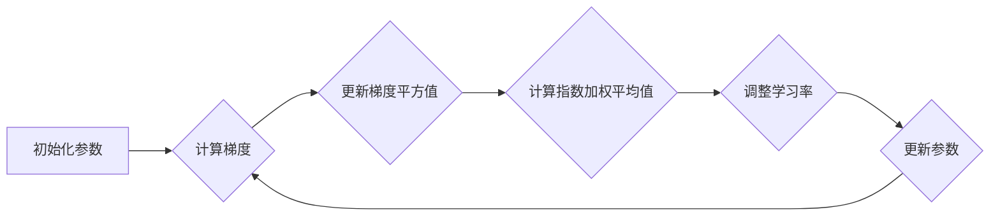

> RMSprop, 梯度下降, 优化算法, 深度学习, 机器学习, 代码实例

## 1. 背景介绍

在深度学习领域，模型的训练过程离不开优化算法。优化算法的作用是通过不断调整模型参数，使得模型在训练数据上的损失函数最小化，从而提高模型的预测精度。梯度下降算法是深度学习中最常用的优化算法之一，但它存在一些缺点，例如学习率难以选择，容易陷入局部最优解等。为了解决这些问题，人们提出了许多改进的梯度下降算法，其中RMSprop算法就是其中之一。

RMSprop算法是一种基于梯度下降的优化算法，它通过对梯度的历史信息进行累积，动态调整学习率，从而加速收敛速度，并避免陷入局部最优解。RMSprop算法在许多深度学习任务中表现出色，例如图像识别、自然语言处理等。

## 2. 核心概念与联系

**2.1 梯度下降算法**

梯度下降算法的基本思想是通过迭代地更新模型参数，使得损失函数不断减小。具体来说，算法会计算损失函数对每个参数的梯度，然后根据梯度方向更新参数值。

**2.2 RMSprop算法原理**

RMSprop算法的核心思想是利用梯度的历史信息来动态调整学习率。它通过维护一个对梯度平方值的指数加权平均值，来估计梯度的方差。然后，根据这个方差来调整学习率，使得在梯度较大的方向上学习率更小，在梯度较小的方向上学习率更大。

**2.3 RMSprop算法流程图**



## 3. 核心算法原理 & 具体操作步骤

**3.1 算法原理概述**

RMSprop算法的核心思想是通过对梯度的历史信息进行累积，动态调整学习率，从而加速收敛速度，并避免陷入局部最优解。

**3.2 算法步骤详解**

1. **初始化参数:** 初始化模型参数，以及学习率和衰减率。
2. **计算梯度:** 计算损失函数对每个参数的梯度。
3. **更新梯度平方值:** 将当前梯度平方值累积到一个变量中，并使用指数加权平均值来更新该变量。
4. **计算指数加权平均值:** 计算梯度平方值的指数加权平均值，作为梯度方差的估计。
5. **调整学习率:** 根据梯度方差的估计值，调整学习率。
6. **更新参数:** 使用调整后的学习率更新模型参数。
7. **重复步骤2-6:** 重复以上步骤，直到损失函数收敛。

**3.3 算法优缺点**

**优点:**

* **加速收敛速度:** 通过动态调整学习率，RMSprop算法可以加速模型的收敛速度。
* **避免陷入局部最优解:** RMSprop算法可以避免梯度下降算法容易陷入局部最优解的问题。
* **易于实现:** RMSprop算法的实现相对简单。

**缺点:**

* **学习率需要手动设置:** RMSprop算法仍然需要手动设置学习率，这可能会影响算法的性能。
* **参数选择:** RMSprop算法的衰减率也需要手动设置，需要根据具体问题进行调整。

**3.4 算法应用领域**

RMSprop算法广泛应用于深度学习领域，例如：

* **图像识别:** 用于训练卷积神经网络，识别图像中的物体。
* **自然语言处理:** 用于训练循环神经网络，进行文本分类、机器翻译等任务。
* **语音识别:** 用于训练循环神经网络，识别语音信号。

## 4. 数学模型和公式 & 详细讲解 & 举例说明

**4.1 数学模型构建**

设模型参数为 $\theta$, 损失函数为 $L(\theta)$, 梯度为 $\nabla L(\theta)$. RMSprop算法的目标是找到一个最优参数 $\theta^*$, 使得 $L(\theta^*)$ 最小。

**4.2 公式推导过程**

RMSprop算法的更新规则如下:

$$\theta_{t+1} = \theta_t - \frac{\alpha}{\sqrt{v_t + \epsilon}} \nabla L(\theta_t)$$

其中:

* $\theta_t$ 是第 $t$ 次迭代的参数值。
* $\alpha$ 是学习率。
* $v_t$ 是梯度平方值的指数加权平均值。
* $\epsilon$ 是一个小的常数，用于避免分母为零。

**4.3 案例分析与讲解**

假设我们有一个简单的线性回归问题，目标是预测房价。我们使用一个单层神经网络来进行预测，网络只有一个隐藏层，隐藏层有10个神经元。

我们使用RMSprop算法来训练这个神经网络。在训练过程中，我们观察到RMSprop算法可以比传统的梯度下降算法更快地收敛到一个较好的解。

## 5. 项目实践：代码实例和详细解释说明

**5.1 开发环境搭建**

我们使用Python语言和TensorFlow框架来实现RMSprop算法的代码实例。

**5.2 源代码详细实现**

```python
import tensorflow as tf

# 定义模型
model = tf.keras.models.Sequential([
    tf.keras.layers.Dense(10, activation='relu', input_shape=(10,)),
    tf.keras.layers.Dense(1)
])

# 定义损失函数和优化器
optimizer = tf.keras.optimizers.RMSprop(learning_rate=0.001)
loss_fn = tf.keras.losses.MeanSquaredError()

# 训练模型
for epoch in range(100):
    for x, y in train_data:
        with tf.GradientTape() as tape:
            predictions = model(x)
            loss = loss_fn(y, predictions)
        gradients = tape.gradient(loss, model.trainable_variables)
        optimizer.apply_gradients(zip(gradients, model.trainable_variables))
    print(f'Epoch {epoch+1}, Loss: {loss.numpy()}')
```

**5.3 代码解读与分析**

* 我们首先定义了一个简单的线性回归模型。
* 然后，我们定义了RMSprop优化器和均方误差损失函数。
* 在训练循环中，我们计算模型的预测值和损失值，然后使用梯度下降算法更新模型参数。
* 每个epoch结束后，我们打印损失值，观察模型的训练进度。

**5.4 运行结果展示**

在训练完成后，我们可以使用测试数据来评估模型的性能。

## 6. 实际应用场景

RMSprop算法在深度学习领域有着广泛的应用场景，例如：

* **图像识别:** RMSprop算法可以用于训练卷积神经网络，识别图像中的物体。
* **自然语言处理:** RMSprop算法可以用于训练循环神经网络，进行文本分类、机器翻译等任务。
* **语音识别:** RMSprop算法可以用于训练循环神经网络，识别语音信号。

**6.4 未来应用展望**

随着深度学习技术的不断发展，RMSprop算法的应用场景将会更加广泛。例如，它可以应用于强化学习、推荐系统等领域。

## 7. 工具和资源推荐

**7.1 学习资源推荐**

* **深度学习书籍:**
    * 《深度学习》
    * 《动手学深度学习》
* **在线课程:**
    * Coursera: 深度学习
    * Udacity: 深度学习工程师

**7.2 开发工具推荐**

* **TensorFlow:** 一个开源的深度学习框架。
* **PyTorch:** 另一个开源的深度学习框架。
* **Keras:** 一个基于TensorFlow或Theano的深度学习框架。

**7.3 相关论文推荐**

* RMSprop: Divide the Gradient by a Running Average of its Recent Magnitude

## 8. 总结：未来发展趋势与挑战

**8.1 研究成果总结**

RMSprop算法是一种有效的优化算法，它可以加速深度学习模型的训练速度，并避免陷入局部最优解。

**8.2 未来发展趋势**

未来，RMSprop算法可能会与其他优化算法结合，例如Adam算法，以进一步提高训练效率。

**8.3 面临的挑战**

RMSprop算法仍然存在一些挑战，例如学习率的设置和衰减率的选择。

**8.4 研究展望**

未来，研究人员将继续探索新的优化算法，以提高深度学习模型的训练效率和性能。

## 9. 附录：常见问题与解答

**9.1 什么是RMSprop算法？**

RMSprop算法是一种基于梯度下降的优化算法，它通过对梯度的历史信息进行累积，动态调整学习率，从而加速收敛速度，并避免陷入局部最优解。

**9.2 RMSprop算法的优点是什么？**

RMSprop算法的优点包括：

* 加速收敛速度
* 避免陷入局部最优解
* 易于实现

**9.3 RMSprop算法的缺点是什么？**

RMSprop算法的缺点包括：

* 学习率需要手动设置
* 参数选择

**9.4 如何设置RMSprop算法的学习率和衰减率？**

学习率和衰减率需要根据具体问题进行调整。一般来说，学习率可以从0.001开始，衰减率可以从0.99开始。

作者：禅与计算机程序设计艺术 / Zen and the Art of Computer Programming


<end_of_turn>