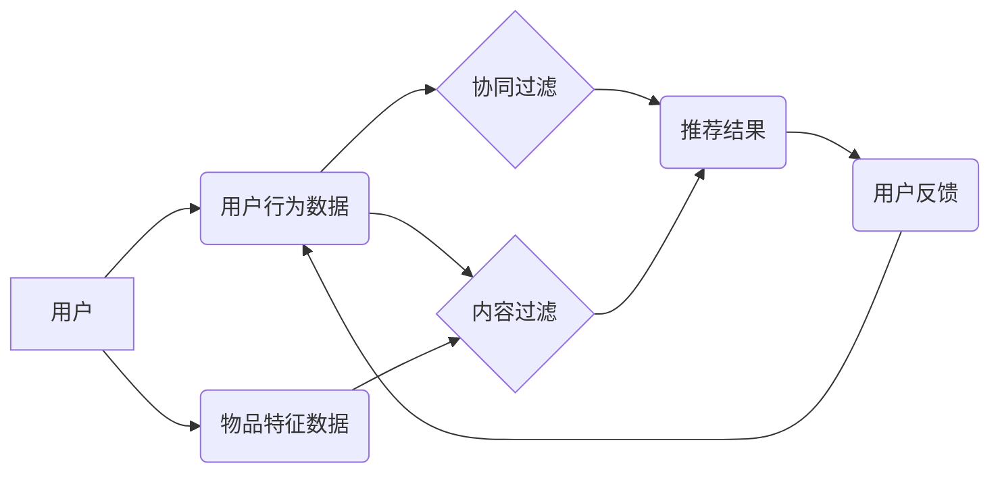

> 搜索推荐系统，匹配技术，协同过滤，内容过滤，基于模型的推荐，个性化推荐，信息检索

## 1. 背景介绍

在信息爆炸的时代，海量数据和信息涌现，用户面临着信息过载的困境。如何精准地将用户所需的信息推荐给用户，成为了一个重要的研究课题。搜索推荐系统应运而生，它结合了搜索引擎的精准查询能力和推荐系统的个性化推荐能力，为用户提供更加便捷、高效的信息获取体验。

传统搜索推荐系统主要依靠匹配技术来实现推荐。匹配技术旨在找到用户感兴趣的内容或物品，并将其推荐给用户。传统的匹配技术主要包括协同过滤和内容过滤两种方法。

## 2. 核心概念与联系

**2.1 协同过滤**

协同过滤是一种基于用户行为和物品特征的推荐方法。它假设，如果用户A喜欢物品X，那么用户B也可能喜欢物品X，前提是用户A和用户B在其他物品的喜好上有一定的相似性。协同过滤算法可以分为基于用户的协同过滤和基于物品的协同过滤两种。

* **基于用户的协同过滤:** 
    * 首先，根据用户的历史行为数据，计算用户之间的相似度。
    * 然后，对于某个用户，根据与该用户相似度高的用户喜欢的物品，推荐给该用户。
* **基于物品的协同过滤:** 
    * 首先，根据物品之间的关联性，计算物品之间的相似度。
    * 然后，对于某个用户，根据该用户喜欢的物品与相似物品，推荐给该用户。

**2.2 内容过滤**

内容过滤是一种基于物品本身特征的推荐方法。它假设，如果用户喜欢某种类型的物品，那么用户也可能喜欢其他具有相同特征的物品。内容过滤算法通常需要对物品进行特征提取，例如文本内容、图像特征、音频特征等。然后，根据用户的兴趣偏好和物品特征的相似度，推荐给用户。

**2.3 匹配技术架构**



## 3. 核心算法原理 & 具体操作步骤

### 3.1 算法原理概述

协同过滤和内容过滤是传统搜索推荐系统中常用的匹配技术。协同过滤算法基于用户的行为数据和物品特征数据，通过计算用户相似度或物品相似度来推荐物品。内容过滤算法则基于物品本身的特征数据，通过计算用户兴趣偏好和物品特征的相似度来推荐物品。

### 3.2 算法步骤详解

**3.2.1 协同过滤算法步骤**

1. **数据预处理:** 收集用户行为数据，例如用户对物品的评分、点击、购买等行为。对数据进行清洗、去噪、缺失值处理等操作。
2. **相似度计算:** 计算用户之间的相似度或物品之间的相似度。常用的相似度计算方法包括余弦相似度、皮尔逊相关系数、马氏距离等。
3. **推荐生成:** 根据用户相似度或物品相似度，推荐给用户相关的物品。

**3.2.2 内容过滤算法步骤**

1. **特征提取:** 对物品进行特征提取，例如文本内容、图像特征、音频特征等。
2. **用户兴趣建模:** 根据用户的历史行为数据，构建用户的兴趣模型，例如用户喜欢的物品类别、用户喜欢的物品属性等。
3. **推荐生成:** 根据用户的兴趣模型和物品特征的相似度，推荐给用户相关的物品。

### 3.3 算法优缺点

**3.3.1 协同过滤算法**

* **优点:** 能够发现用户之间的隐性关系，推荐出用户可能没有想到的物品。
* **缺点:** 数据稀疏性问题，当用户行为数据不足时，算法效果会下降。冷启动问题，对于新用户和新物品，算法难以进行推荐。

**3.3.2 内容过滤算法**

* **优点:** 不需要用户行为数据，可以对新用户和新物品进行推荐。
* **缺点:** 难以发现用户之间的隐性关系，推荐结果可能过于单一。

### 3.4 算法应用领域

协同过滤和内容过滤算法广泛应用于各种推荐场景，例如：

* **电子商务:** 商品推荐、用户画像
* **社交媒体:** 朋友推荐、内容推荐
* **音乐平台:** 歌曲推荐、音乐人推荐
* **视频平台:** 视频推荐、用户兴趣分析

## 4. 数学模型和公式 & 详细讲解 & 举例说明

### 4.1 数学模型构建

**4.1.1 协同过滤模型**

协同过滤模型通常使用矩阵分解技术来进行推荐。假设用户-物品交互矩阵为R，其中R(u,i)表示用户u对物品i的评分。目标是将R分解成两个低维矩阵，分别表示用户特征矩阵U和物品特征矩阵V。

**4.1.2 内容过滤模型**

内容过滤模型通常使用机器学习算法，例如逻辑回归、支持向量机等，来构建用户兴趣模型。

### 4.2 公式推导过程

**4.2.1 协同过滤模型公式推导**

$$
R(u,i) \approx U(u) \cdot V(i)
$$

其中，U(u)表示用户u的特征向量，V(i)表示物品i的特征向量。

**4.2.2 内容过滤模型公式推导**

内容过滤模型的公式推导取决于具体的机器学习算法。例如，逻辑回归模型的公式为：

$$
P(y=1|x) = \frac{1}{1 + exp(-(w \cdot x + b))}
$$

其中，x表示物品特征向量，w表示模型参数，b表示偏置项，y表示用户对物品的评分。

### 4.3 案例分析与讲解

**4.3.1 协同过滤模型案例分析**

假设有一个用户-物品交互矩阵，其中用户1对物品A评分为5，用户2对物品A评分为4，用户1对物品B评分为3，用户2对物品B评分为2。可以使用协同过滤模型将用户和物品进行特征分解，得到用户特征向量和物品特征向量。然后，可以根据用户特征向量和物品特征向量，预测用户对其他物品的评分。

**4.3.2 内容过滤模型案例分析**

假设有一个音乐平台，用户对音乐的评分数据和音乐的特征数据（例如音乐风格、歌手、发行时间等）。可以使用内容过滤模型构建用户兴趣模型，例如用户喜欢摇滚音乐、喜欢欧美歌手等。然后，可以根据用户的兴趣模型和音乐特征的相似度，推荐给用户相关的音乐。

## 5. 项目实践：代码实例和详细解释说明

### 5.1 开发环境搭建

* 操作系统：Windows/macOS/Linux
* Python 版本：3.6+
* 依赖库：pandas, numpy, scikit-learn

### 5.2 源代码详细实现

```python
import pandas as pd
from sklearn.metrics.pairwise import cosine_similarity

# 加载用户-物品交互数据
data = pd.read_csv('user_item_data.csv')

# 计算用户之间的余弦相似度
user_similarity = cosine_similarity(data.T)

# 获取用户1的相似用户
similar_users = user_similarity[0].argsort()[:-6:-1]

# 获取用户1相似用户喜欢的物品
recommended_items = data.iloc[similar_users].mean().sort_values(ascending=False)

# 打印推荐结果
print(recommended_items)
```

### 5.3 代码解读与分析

* 代码首先加载用户-物品交互数据。
* 然后，使用余弦相似度计算用户之间的相似度。
* 获取用户1的相似用户，并根据相似用户的喜好，推荐给用户1相关的物品。

### 5.4 运行结果展示

运行代码后，将输出用户1可能感兴趣的物品列表。

## 6. 实际应用场景

传统搜索推荐系统广泛应用于各种场景，例如：

* **电商平台:** 推荐商品、个性化商品列表、用户画像分析
* **社交媒体:** 推荐朋友、推荐内容、兴趣标签推荐
* **音乐平台:** 推荐歌曲、推荐音乐人、个性化音乐播放列表
* **视频平台:** 推荐视频、推荐用户、个性化视频播放列表

### 6.4 未来应用展望

随着人工智能技术的不断发展，传统搜索推荐系统将更加智能化、个性化。未来，搜索推荐系统将更加注重用户体验，提供更加精准、个性化的推荐服务。

## 7. 工具和资源推荐

### 7.1 学习资源推荐

* **书籍:**
    * 推荐系统实践
    * 算法导论
* **在线课程:**
    * Coursera: Recommender Systems
    * edX: Introduction to Recommender Systems

### 7.2 开发工具推荐

* **Python:** 
    * pandas
    * numpy
    * scikit-learn
* **Spark:** 
    * Spark MLlib

### 7.3 相关论文推荐

* **Collaborative Filtering for Implicit Feedback Datasets**
* **Matrix Factorization Techniques for Recommender Systems**

## 8. 总结：未来发展趋势与挑战

### 8.1 研究成果总结

传统搜索推荐系统已经取得了显著的成果，为用户提供了更加便捷、高效的信息获取体验。

### 8.2 未来发展趋势

* **深度学习:** 深度学习技术将被更加广泛地应用于推荐系统，提高推荐的准确性和个性化程度。
* **多模态推荐:** 推荐系统将更加注重多模态信息的融合，例如文本、图像、音频等，提供更加丰富的推荐结果。
* **联邦学习:** 联邦学习技术将被用于保护用户隐私，实现更加安全、可靠的推荐服务。

### 8.3 面临的挑战

* **数据稀疏性:** 数据稀疏性问题仍然是推荐系统面临的挑战，需要开发更加有效的算法和技术来解决。
* **冷启动问题:** 新用户和新物品的推荐仍然是一个难题，需要开发更加智能的推荐算法。
* **用户隐私保护:** 用户隐私保护是推荐系统面临的重要挑战，需要开发更加安全的推荐技术。

### 8.4 研究展望

未来，搜索推荐系统将朝着更加智能化、个性化、安全的方向发展。研究者将继续探索新的算法和技术，以解决推荐系统面临的挑战，为用户提供更加优质的推荐服务。

## 9. 附录：常见问题与解答

**9.1 什么是协同过滤？**

协同过滤是一种基于用户行为和物品特征的推荐方法，它假设，如果用户A喜欢物品X，那么用户B也可能喜欢物品X，前提是用户A和用户B在其他物品的喜好上有一定的相似性。

**9.2 什么是内容过滤？**

内容过滤是一种基于物品本身特征的推荐方法，它假设，如果用户喜欢某种类型的物品，那么用户也可能喜欢其他具有相同特征的物品。

**9.3 如何评估推荐系统的效果？**

常用的推荐系统评估指标包括准确率、召回率、F1-score、NDCG等。

**9.4 如何解决数据稀疏性问题？**

数据稀疏性问题是推荐系统面临的挑战之一，可以采用以下方法来解决：

* 使用矩阵分解技术
* 使用协同过滤算法的改进版本
* 使用内容过滤算法
* 使用混合推荐算法

作者：禅与计算机程序设计艺术 / Zen and the Art of Computer Programming


<end_of_turn>