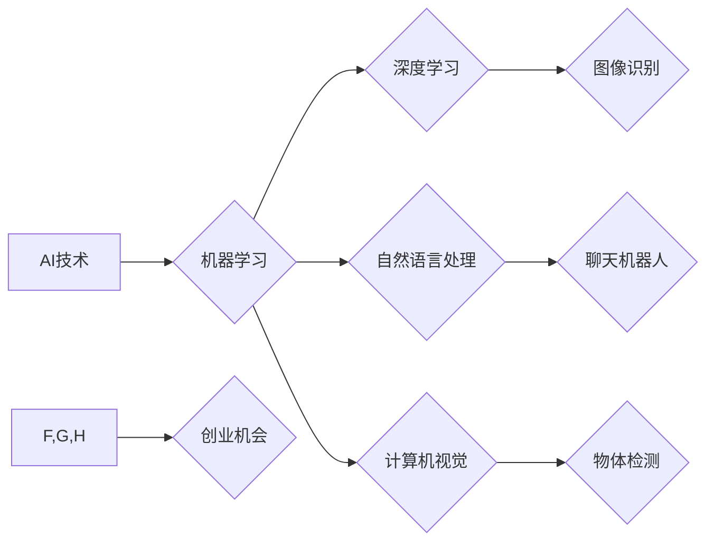

> 人工智能 (AI)
> 深度学习
> 机器学习
> 自然语言处理
> 计算机视觉
> 创业机会
> 商业应用

## 1. 背景介绍

人工智能 (AI) 正以惊人的速度发展，正在深刻地改变着我们的世界。从自动驾驶汽车到智能家居，从医疗诊断到金融交易，AI 的应用领域日益广泛。对于创业者来说，AI 浪潮带来了前所未有的机遇。

近年来，深度学习技术的突破，使得 AI 算法取得了前所未有的进展。深度学习算法能够从海量数据中自动学习特征，从而实现更精准、更智能的决策。这为创业者提供了构建创新产品和服务的强大工具。

## 2. 核心概念与联系

**2.1  人工智能 (AI)**

人工智能是指模拟人类智能行为的计算机系统。AI 的目标是让机器能够像人类一样学习、推理、解决问题和做出决策。

**2.2  机器学习 (ML)**

机器学习是 AI 的一个子领域，它使计算机能够从数据中学习，而无需明确编程。机器学习算法通过分析数据模式，建立数学模型，从而预测未来结果或做出决策。

**2.3  深度学习 (DL)**

深度学习是机器学习的一个子领域，它使用多层神经网络来模拟人类大脑的结构和功能。深度学习算法能够从复杂的数据中提取更深层次的特征，从而实现更精准的预测和识别。

**2.4  自然语言处理 (NLP)**

自然语言处理是指让计算机能够理解、处理和生成人类语言。NLP 广泛应用于聊天机器人、机器翻译、文本摘要等领域。

**2.5  计算机视觉 (CV)**

计算机视觉是指让计算机能够“看”和理解图像和视频。CV 广泛应用于图像识别、物体检测、人脸识别等领域。

**2.6  AI 创业机会**

AI 技术的快速发展为创业者带来了前所未有的机遇。创业者可以利用 AI 技术构建创新产品和服务，解决现实世界中的问题，并创造新的商业价值。

**Mermaid 流程图**



## 3. 核心算法原理 & 具体操作步骤

### 3.1  算法原理概述

深度学习算法的核心是多层神经网络。神经网络由多个层组成，每层包含多个神经元。神经元之间通过连接进行信息传递，每个连接都有一个权重。通过训练，神经网络可以调整权重，从而学习数据中的模式。

### 3.2  算法步骤详解

1. **数据预处理:** 将原始数据转换为深度学习算法可以理解的格式。
2. **网络结构设计:** 根据任务需求设计神经网络的结构，包括层数、神经元数量等。
3. **参数初始化:** 为神经网络的参数（权重和偏置）进行随机初始化。
4. **前向传播:** 将输入数据通过神经网络进行传递，计算输出结果。
5. **损失函数计算:** 计算输出结果与真实值的差异，即损失函数值。
6. **反向传播:** 根据损失函数值，反向传播误差信号，更新神经网络的参数。
7. **迭代训练:** 重复前向传播、损失函数计算和反向传播的过程，直到损失函数值达到预设阈值。

### 3.3  算法优缺点

**优点:**

* 能够从复杂的数据中提取深层次特征。
* 性能优于传统机器学习算法。
* 能够处理海量数据。

**缺点:**

* 训练时间长，需要大量计算资源。
* 对数据质量要求高。
* 模型解释性差。

### 3.4  算法应用领域

* **图像识别:** 人脸识别、物体检测、图像分类。
* **自然语言处理:** 聊天机器人、机器翻译、文本摘要。
* **语音识别:** 语音转文本、语音助手。
* **推荐系统:** 产品推荐、内容推荐。
* **医疗诊断:** 病情预测、疾病诊断。

## 4. 数学模型和公式 & 详细讲解 & 举例说明

### 4.1  数学模型构建

深度学习算法的核心是多层神经网络。神经网络可以看作是一个复杂的数学模型，其参数是神经网络的权重和偏置。

**神经元激活函数:**

神经元激活函数的作用是将神经元的输入信号转换为输出信号。常用的激活函数包括 sigmoid 函数、ReLU 函数、tanh 函数等。

**sigmoid 函数:**

$$
f(x) = \frac{1}{1 + e^{-x}}
$$

**ReLU 函数:**

$$
f(x) = max(0, x)
$$

**4.2  公式推导过程**

深度学习算法的训练过程是通过反向传播算法来实现的。反向传播算法的核心是计算梯度，并根据梯度更新神经网络的参数。

**损失函数:**

损失函数用于衡量模型预测结果与真实值的差异。常用的损失函数包括均方误差 (MSE)、交叉熵损失 (Cross-Entropy Loss) 等。

**梯度下降算法:**

梯度下降算法是一种常用的优化算法，用于更新神经网络的参数。梯度下降算法的基本思想是沿着梯度的负方向更新参数，从而减小损失函数值。

### 4.3  案例分析与讲解

**图像分类:**

假设我们有一个图像分类任务，目标是将图像分类为不同的类别，例如猫、狗、鸟等。我们可以使用卷积神经网络 (CNN) 来解决这个问题。CNN 是一种专门用于处理图像数据的深度学习算法。

CNN 的结构包括卷积层、池化层和全连接层。卷积层用于提取图像特征，池化层用于降低特征维度，全连接层用于分类。

训练 CNN 时，我们会使用大量的图像数据，并使用交叉熵损失函数和梯度下降算法来训练模型。经过训练，CNN 能够学习到图像特征，并能够准确地将图像分类为不同的类别。

## 5. 项目实践：代码实例和详细解释说明

### 5.1  开发环境搭建

* Python 3.x
* TensorFlow 或 PyTorch
* Jupyter Notebook

### 5.2  源代码详细实现

```python
import tensorflow as tf

# 定义模型结构
model = tf.keras.models.Sequential([
    tf.keras.layers.Conv2D(32, (3, 3), activation='relu', input_shape=(28, 28, 1)),
    tf.keras.layers.MaxPooling2D((2, 2)),
    tf.keras.layers.Conv2D(64, (3, 3), activation='relu'),
    tf.keras.layers.MaxPooling2D((2, 2)),
    tf.keras.layers.Flatten(),
    tf.keras.layers.Dense(10, activation='softmax')
])

# 编译模型
model.compile(optimizer='adam',
              loss='sparse_categorical_crossentropy',
              metrics=['accuracy'])

# 加载数据
(x_train, y_train), (x_test, y_test) = tf.keras.datasets.mnist.load_data()

# 数据预处理
x_train = x_train.astype('float32') / 255.0
x_test = x_test.astype('float32') / 255.0
x_train = x_train.reshape((x_train.shape[0], 28, 28, 1))
x_test = x_test.reshape((x_test.shape[0], 28, 28, 1))

# 训练模型
model.fit(x_train, y_train, epochs=5)

# 评估模型
loss, accuracy = model.evaluate(x_test, y_test)
print('Test loss:', loss)
print('Test accuracy:', accuracy)
```

### 5.3  代码解读与分析

这段代码实现了 MNIST 手写数字识别任务。

* 首先，定义了模型结构，包括卷积层、池化层和全连接层。
* 然后，编译了模型，指定了优化器、损失函数和评价指标。
* 接着，加载了 MNIST 数据集，并对数据进行了预处理。
* 最后，训练了模型，并评估了模型的性能。

### 5.4  运行结果展示

训练完成后，模型能够准确地识别 MNIST 手写数字。

## 6. 实际应用场景

### 6.1  医疗诊断

AI 算法可以分析医学影像数据，辅助医生诊断疾病。例如，AI 算法可以用于检测肺癌、乳腺癌、脑肿瘤等。

### 6.2  金融交易

AI 算法可以分析市场数据，预测股票价格走势，并进行自动交易。

### 6.3  客户服务

AI 聊天机器人可以自动回答客户问题，提供24/7 的客户服务。

### 6.4  未来应用展望

AI 技术的应用场景还在不断扩展，未来将会有更多新的应用场景出现。例如，AI 可以用于自动驾驶汽车、个性化教育、智能家居等领域。

## 7. 工具和资源推荐

### 7.1  学习资源推荐

* **在线课程:** Coursera, edX, Udacity
* **书籍:** 深度学习，机器学习实战
* **博客:** Towards Data Science, Machine Learning Mastery

### 7.2  开发工具推荐

* **Python:** TensorFlow, PyTorch, Keras
* **云平台:** AWS, Azure, Google Cloud

### 7.3  相关论文推荐

* **ImageNet Classification with Deep Convolutional Neural Networks**
* **Attention Is All You Need**
* **BERT: Pre-training of Deep Bidirectional Transformers for Language Understanding**

## 8. 总结：未来发展趋势与挑战

### 8.1  研究成果总结

近年来，AI 技术取得了长足的进步，特别是深度学习算法的突破，使得 AI 能够处理更复杂的任务，并取得更精准的结果。

### 8.2  未来发展趋势

* **模型规模和复杂度提升:** 未来 AI 模型将更加庞大，更加复杂，能够处理更复杂的任务。
* **边缘计算:** AI 计算将更加靠近数据源，实现更实时、更高效的处理。
* **解释性 AI:** 研究如何解释 AI 模型的决策过程，提高 AI 的可信度和透明度。

### 8.3  面临的挑战

* **数据获取和隐私保护:** AI 算法依赖于大量数据，如何获取高质量数据，并保护用户隐私是一个重要的挑战。
* **算法偏见:** AI 算法可能存在偏见，导致不公平的结果。如何解决算法偏见是一个重要的研究方向。
* **伦理问题:** AI 技术的快速发展引发了伦理问题，例如 AI 决策的责任归属、AI 对就业的影响等。

### 8.4  研究展望

未来 AI 研究将更加注重模型的可解释性、安全性、鲁棒性和公平性。


## 9. 附录：常见问题与解答

**Q1: 如何学习 AI 技术？**

A1: 可以通过在线课程、书籍、博客等方式学习 AI 技术。

**Q2: 如何选择合适的 AI 工具？**

A2: 需要根据具体任务需求选择合适的 AI 工具。例如， TensorFlow 和 PyTorch 是常用的深度学习框架，而 Keras 是 TensorFlow 的高层 API。

**Q3: AI 技术会取代人类工作吗？**

A3: AI 技术可以自动化一些重复性工作，但不会完全取代人类工作。AI 技术可以帮助人类提高效率，解放人力，从而专注于更复杂、更创造性的工作。


作者：禅与计算机程序设计艺术 / Zen and the Art of Computer Programming 
<end_of_turn>