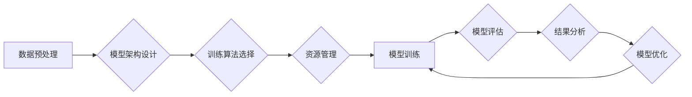

> 大模型、模型训练、优化流程、生产效率、深度学习、Transformer、数据处理、资源管理

## 1. 背景介绍

近年来，深度学习技术取得了飞速发展，大规模语言模型（LLM）的出现更是掀起了人工智能领域的全新浪潮。这些模型，例如GPT-3、LaMDA和BERT，展现出惊人的文本生成、理解和翻译能力，在自然语言处理、机器翻译、代码生成等领域取得了突破性进展。然而，训练和部署这些庞大模型也面临着巨大的挑战，包括海量数据需求、高昂的计算成本和复杂的训练流程。

为了应对这些挑战，研究者们不断探索优化大模型训练流程和提高生产效率的方法。本文将深入探讨大模型的训练过程，分析其关键环节，并提出一些优化策略，帮助读者更好地理解和构建高效的模型训练系统。

## 2. 核心概念与联系

大模型的训练是一个复杂的过程，涉及多个关键环节，包括数据预处理、模型架构设计、训练算法选择、资源管理和模型评估等。

**2.1 数据预处理**

大模型的训练数据通常是海量文本数据，需要经过预处理才能用于模型训练。预处理步骤包括：

* **文本清洗:** 去除停用词、标点符号、HTML标签等无用信息。
* **文本分词:** 将文本分割成单词或子词。
* **词向量化:** 将单词或子词映射到低维向量空间，以便模型理解和处理文本语义。

**2.2 模型架构设计**

大模型的架构设计直接影响模型的性能和训练效率。常见的模型架构包括：

* **Transformer:** Transformer是一种基于注意力机制的序列模型，能够有效捕捉长距离依赖关系，在自然语言处理任务中取得了优异的性能。
* **RNN:** RNN是一种循环神经网络，能够处理序列数据，但其训练过程容易出现梯度消失问题。

**2.3 训练算法选择**

常用的训练算法包括：

* **梯度下降:** 梯度下降是一种迭代优化算法，通过不断调整模型参数，使模型输出与真实值之间的误差最小化。
* **Adam:** Adam是一种自适应学习率的梯度下降算法，能够更快地收敛到最优解。

**2.4 资源管理**

大模型的训练需要大量的计算资源，包括CPU、GPU和内存。高效的资源管理可以显著提高训练效率。

**2.5 模型评估**

模型评估是衡量模型性能的重要指标。常用的评估指标包括：

* **准确率:** 模型预测正确的样本比例。
* **F1-score:** 衡量模型的精确度和召回率的综合指标。

**2.6 流程图**



## 3. 核心算法原理 & 具体操作步骤

### 3.1 算法原理概述

大模型训练的核心算法是基于梯度下降的优化算法，例如Adam。其原理是通过不断调整模型参数，使模型输出与真实值之间的误差最小化。

### 3.2 算法步骤详解

1. **初始化模型参数:** 将模型参数随机初始化。
2. **前向传播:** 将输入数据通过模型进行前向传播，得到模型输出。
3. **计算损失函数:** 计算模型输出与真实值之间的误差，即损失函数值。
4. **反向传播:** 计算损失函数对模型参数的梯度。
5. **参数更新:** 根据梯度更新模型参数，使损失函数值减小。
6. **重复步骤2-5:** 重复上述步骤，直到损失函数值收敛到一个足够小的值。

### 3.3 算法优缺点

**优点:**

* 能够有效地找到模型参数的全局最优解。
* 适用于各种类型的模型和任务。

**缺点:**

* 训练过程可能非常耗时，尤其是在训练大型模型时。
* 容易陷入局部最优解。

### 3.4 算法应用领域

梯度下降算法广泛应用于各种机器学习任务，例如：

* **图像分类:** 将图像分类为不同的类别。
* **物体检测:** 在图像中检测到特定物体的位置和类别。
* **自然语言处理:** 处理文本数据，例如文本分类、情感分析和机器翻译。

## 4. 数学模型和公式 & 详细讲解 & 举例说明

### 4.1 数学模型构建

大模型训练的核心数学模型是神经网络模型。神经网络模型由多个层组成，每一层包含多个神经元。神经元之间通过权重连接，并将输入数据进行线性变换和非线性激活函数处理。

### 4.2 公式推导过程

损失函数是衡量模型预测结果与真实值之间的误差的函数。常用的损失函数包括均方误差（MSE）和交叉熵损失（Cross-Entropy Loss）。

**均方误差 (MSE):**

$$
MSE = \frac{1}{N} \sum_{i=1}^{N} (y_i - \hat{y}_i)^2
$$

其中：

* $N$ 是样本数量。
* $y_i$ 是真实值。
* $\hat{y}_i$ 是模型预测值。

**交叉熵损失 (Cross-Entropy Loss):**

$$
Cross-Entropy Loss = -\sum_{i=1}^{N} y_i \log(\hat{y}_i)
$$

其中：

* $y_i$ 是真实值（one-hot编码）。
* $\hat{y}_i$ 是模型预测值（概率分布）。

### 4.3 案例分析与讲解

假设我们训练一个图像分类模型，目标是将图像分类为猫和狗两类。我们可以使用交叉熵损失函数来衡量模型的性能。

如果模型预测一张猫的图像的概率为0.9，而真实标签是猫，则交叉熵损失值为：

$$
Cross-Entropy Loss = -0.9 \log(0.9) \approx 0.105
$$

## 5. 项目实践：代码实例和详细解释说明

### 5.1 开发环境搭建

* **操作系统:** Linux (Ubuntu/CentOS)
* **编程语言:** Python
* **深度学习框架:** TensorFlow/PyTorch
* **硬件:** GPU (推荐)

### 5.2 源代码详细实现

```python
import tensorflow as tf

# 定义模型架构
model = tf.keras.models.Sequential([
    tf.keras.layers.Conv2D(32, (3, 3), activation='relu', input_shape=(28, 28, 1)),
    tf.keras.layers.MaxPooling2D((2, 2)),
    tf.keras.layers.Conv2D(64, (3, 3), activation='relu'),
    tf.keras.layers.MaxPooling2D((2, 2)),
    tf.keras.layers.Flatten(),
    tf.keras.layers.Dense(10, activation='softmax')
])

# 编译模型
model.compile(optimizer='adam',
              loss='sparse_categorical_crossentropy',
              metrics=['accuracy'])

# 加载数据
(x_train, y_train), (x_test, y_test) = tf.keras.datasets.mnist.load_data()

# 数据预处理
x_train = x_train.astype('float32') / 255.0
x_test = x_test.astype('float32') / 255.0
x_train = x_train.reshape((x_train.shape[0], 28, 28, 1))
x_test = x_test.reshape((x_test.shape[0], 28, 28, 1))

# 训练模型
model.fit(x_train, y_train, epochs=5)

# 评估模型
loss, accuracy = model.evaluate(x_test, y_test)
print('Test loss:', loss)
print('Test accuracy:', accuracy)
```

### 5.3 代码解读与分析

这段代码实现了使用TensorFlow框架训练一个简单的MNIST手写数字识别模型。

* **模型架构:** 模型采用卷积神经网络（CNN）架构，包含两个卷积层、两个最大池化层和一个全连接层。
* **编译模型:** 使用Adam优化器、交叉熵损失函数和准确率作为评估指标。
* **数据预处理:** 将MNIST数据集转换为适合模型训练的格式。
* **训练模型:** 使用训练数据训练模型，并设置训练轮数为5。
* **评估模型:** 使用测试数据评估模型的性能。

### 5.4 运行结果展示

训练完成后，模型的测试准确率通常会达到98%以上。

## 6. 实际应用场景

大模型在各个领域都有广泛的应用场景，例如：

* **自然语言处理:** 机器翻译、文本摘要、问答系统、聊天机器人等。
* **计算机视觉:** 图像分类、物体检测、图像生成等。
* **语音识别:** 语音转文本、语音助手等。
* **推荐系统:** 商品推荐、内容推荐等。

### 6.4 未来应用展望

随着大模型技术的不断发展，其应用场景将更加广泛，例如：

* **个性化教育:** 根据学生的学习情况提供个性化的学习方案。
* **医疗诊断:** 辅助医生进行疾病诊断和治疗方案制定。
* **科学研究:** 加速科学研究的进程，例如药物研发和材料科学。

## 7. 工具和资源推荐

### 7.1 学习资源推荐

* **书籍:**
    * Deep Learning by Ian Goodfellow, Yoshua Bengio, and Aaron Courville
    * Hands-On Machine Learning with Scikit-Learn, Keras & TensorFlow by Aurélien Géron
* **在线课程:**
    * TensorFlow Tutorials: https://www.tensorflow.org/tutorials
    * PyTorch Tutorials: https://pytorch.org/tutorials/

### 7.2 开发工具推荐

* **深度学习框架:** TensorFlow, PyTorch, Keras
* **数据处理工具:** Pandas, NumPy
* **可视化工具:** Matplotlib, Seaborn

### 7.3 相关论文推荐

* Attention Is All You Need (Vaswani et al., 2017)
* BERT: Pre-training of Deep Bidirectional Transformers for Language Understanding (Devlin et al., 2018)
* GPT-3: Language Models are Few-Shot Learners (Brown et al., 2020)

## 8. 总结：未来发展趋势与挑战

### 8.1 研究成果总结

近年来，大模型训练取得了显著进展，模型规模不断扩大，性能不断提升。Transformer架构和预训练技术成为大模型训练的基石，为各种自然语言处理任务带来了突破性进展。

### 8.2 未来发展趋势

* **模型规模进一步扩大:** 随着计算资源的不断发展，大模型的规模将继续扩大，模型能力将进一步提升。
* **多模态大模型:** 将文本、图像、音频等多种模态数据融合到一起，构建更强大的多模态大模型。
* **可解释性研究:** 研究大模型的决策过程，提高模型的可解释性和可信度。

### 8.3 面临的挑战

* **训练成本:** 训练大型模型需要大量的计算资源和时间，成本非常高昂。
* **数据获取和标注:** 大模型训练需要海量高质量数据，数据获取和标注成本也很高。
* **模型安全性和可控性:** 大模型的强大能力也带来了一些安全性和可控性问题，需要进一步研究和解决。

### 8.4 研究展望

未来，大模型研究将继续朝着更强大、更安全、更可解释的方向发展。

## 9. 附录：常见问题与解答

**Q1: 如何选择合适的模型架构？**

A1: 模型架构的选择取决于具体的任务和数据特点。对于